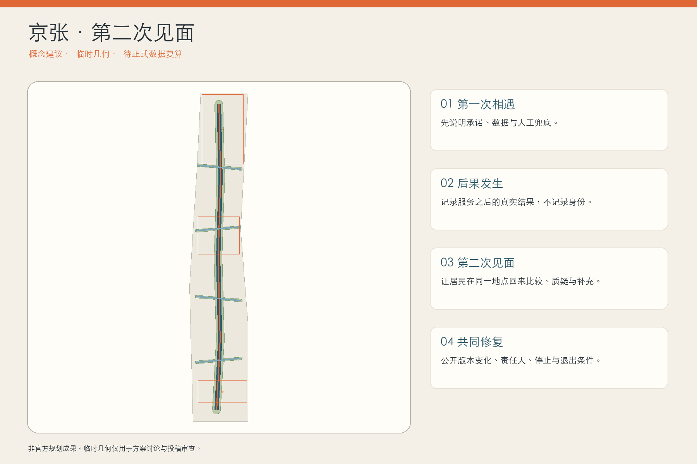
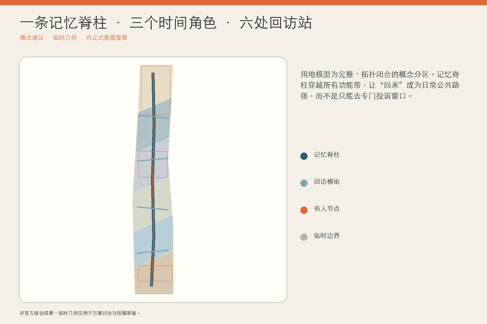
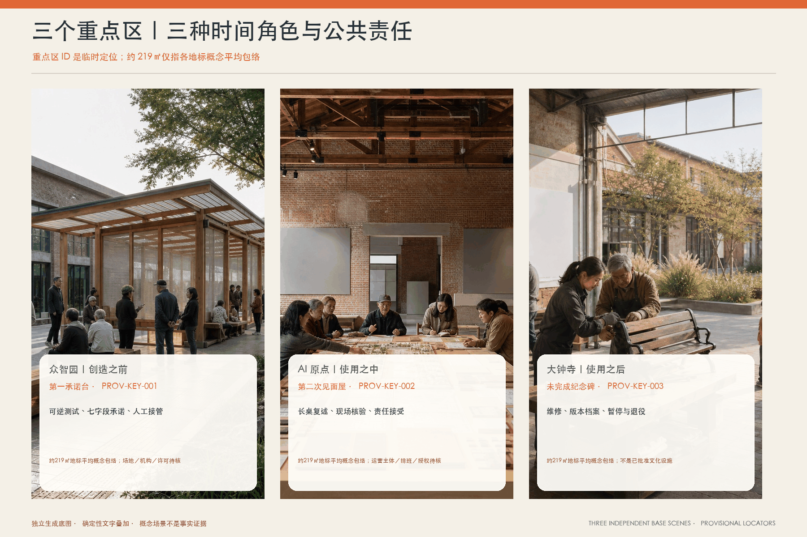
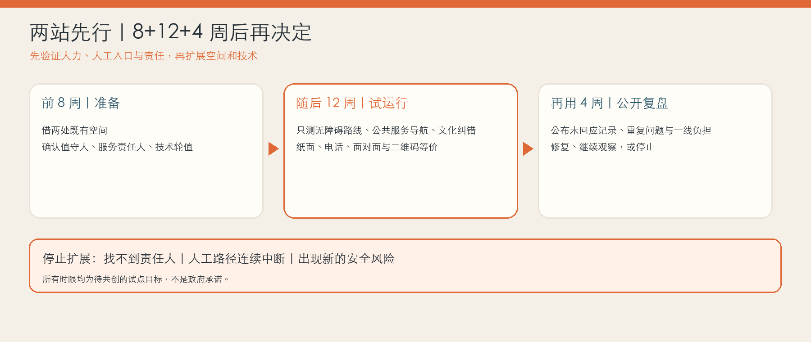
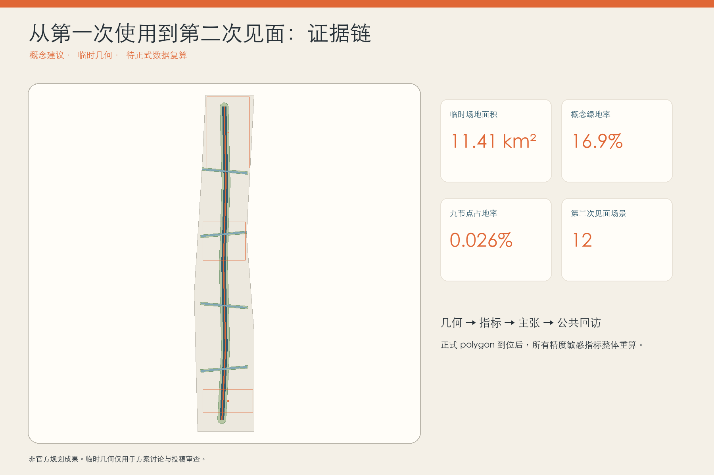

# 京张·第二次见面｜THE SECOND ENCOUNTER

> 城市创新不在第一次亮相，而在第二次见面。

本方案提出一个很具体的城市判断：AI 场景最容易被看见的是发布那一天，真正决定公共价值的却是使用之后。一个老人被导航带错路、一个学生收到不合适的教育建议、一个店主被企业服务系统误判，城市有没有在几天或几个月后重新与他见面？有没有承认第一次承诺与真实后果之间的落差？有没有允许一线人员、居民和开发者共同修正？“第二次见面”把这种长期关系转译为公共空间、操作协议与品牌资产，而不是再造一个更大的智慧大脑。

## 设计依据与资料清单

方案以官方公告确定的三层范围、三处重点区、设计任务和成果语境为主控依据，以面向智能体任务书的三大定位、五大功能、三区两翼和六项必答任务为内容框架 [source:OFFICIAL-ANNOUNCEMENT] [source:AGENT-TASKBOOK]。城市设计、控规深度与用地分类分别回应本地专业标准快照；外部案例只用于比较机制，不能替代北京的法定规划或场地事实 [standard:MOHURD-URBAN-DESIGN-MEASURES]。

当前公开包没有可验证坐标系的 official SITE_BOUNDARY、KEY_AREA、道路红线、建筑底数、文保控制线和控规条件。提交几何因此采用维护者提供的临时粗略 polygon；它只支撑生成、自检、图面和概念讨论。图上的 11.41 平方公里、16.9% 概念绿地率与 1.2% 概念公共空间率均是低置信度的设计模型值，不是审定指标 [data:geometry/site_boundary.geojson#SITE-001] [metric:site_area_sqm]。所有精度敏感图层和指标须在 official polygon 到位后整体重算，而不能局部替换。

## 三层范围工作框架

统筹研究范围回答“什么样的 AI 创新生态值得在城市中长期存在”；总体设计范围回答“居民怎样在日常路径上第一次相遇、再次回来”；三处重点区回答“创造、相遇、照护分别由谁、在何处、以什么轻重程度发生”。三层不是三套平行报告，而是从价值判断到空间模型再到重点区验证的一条证据链 [depth:three_level_scope_framework] [data:geometry/key_areas.geojson#PROV-KEY-001]。

空间结构为“一条记忆脊柱、四条回访横街、六处回访站、三个时间地标”。记忆脊柱沿京张文化叙事组织连续慢行和绿色公共界面；回访横街把校区、社区、园区和站点带回同一条公共路径；回访站是小尺度、有人值守、可拆可改的接口；三个地标分别承担第一次承诺、第二次见面和未完成记录。它们都表达为概念建议，不推定真实道路红线、文保边界、地块权属或工程可行性 [data:geometry/roads.geojson#ROAD-SE-01] [depth:overall_spatial_structure]。

## 统筹研究范围产业与未来城市研究

“第二次见面”不把治理当作创新的刹车，而把长期回应能力变成新的产业基础设施。众智园承担测试、标准、工具和首发承诺；AI 原点社区承担近校试验、居民回访与一线人员共评；大钟寺承担维护服务、版本交接、退出记录和国际传播；中关村科技服务翼连接法务、知识产权、资本与第三方评估，小月河场景赋能翼连接社区场景、公共服务和低扰动试验。由此形成“研究—试验—第一次相遇—回访—修复/退出—知识回流”的创新链，而不是只统计模型、企业或活动数量 [source:AGENT-TASKBOOK] [depth:industry_ecosystem_strategy]。

五个全球案例提供的是机制片段而不是模板：英国 ATRS 展示标准化公开字段；AI Verify 展示过程与技术测试的组合；荷兰算法登记展示公共目录；Boston CityScore 展示按时间比较绩效而非只看一次发布；Decidim 展示数字与面对面参与的可追溯连接 [source:CASE-UK-ATRS] [source:CASE-AI-VERIFY]。本方案把这些片段转成“京张第二次见面协议”，但不声称任何国际框架在北京具有法定效力。

视觉识别不是赛博装饰：无文字标记由两条并行轨迹组成，蓝色实线表示第一次承诺，橙色虚线回返并在一个可见接缝处结束，表示关系不是被重置，而是带着历史继续。命名系统依次为“第一承诺台 / First Promise Platform”“回访站 / Return Station”“第二次见面屋 / Second Encounter House”“未完成纪念碑 / Unfinished Monument”。色彩采用铁路铁灰、公共蓝、修复橙和纸张白；不得使用未经授权的企业标识或人物肖像。

## 总体设计范围城市更新与控规深度城市设计

概念用地采用六个共享边界的拓扑分区，完整覆盖当前临时范围：文化与公共记忆、智能服务与商务、社区服务、近校教育科研、研发验证、留白与适应性用地。分区表达功能关系，不是法定地块用途；正式控规、权属和现状调查到位前，不给出具体拆除、容积率、高度或建设规模 [data:geometry/land_use.geojson#LU-SE-01] [standard:MNR-LAND-USE-CLASSIFICATION-GUIDE]。

更新顺序先处理“能够回来”的基本条件：连续步行、无障碍、遮阴、实体导视、人工窗口；再嵌入轻量回访站和三处时间地标；最后才开放需要持续数据或模型服务的 AI 场景。建筑图层只表达七个概念界面基底，包括三处地标和四个轻量回访亭，既不指向真实建筑，也不形成拆改留结论 [data:geometry/buildings.geojson#BLDG-SE-01] [depth:retain_renovate_demolish]。

分期分为：一期建立协议、人工值守和可逆设施；二期在三区进行差异化验证并修补公共空间联系；三期只复制经过第二次见面证据确认的场景，并形成跨区知识与运营网络。每个阶段都有停止条件：找不到责任人、没有等价人工路径、无法解释数据边界、回访意见无人处理、或现场风险超过专业阈值时，暂停扩展而不是继续制造沉没成本 [data:geometry/phasing.geojson#PHASE-SE-01]。

## 重点区域详细设计

众智园不是“更强模型”的展厅，而是“第一承诺台”：任何拟进入公共空间的 AI 场景先公开目标、服务对象、数据边界、责任人、人工兜底、复核周期和退出条件。空间上以可预约的小型验证庭、公开说明墙、低扰动测试界面和清河方向绿色交往空间组成；其位置与尺度均待 official key area、交通和生态条件深化 [data:geometry/key_areas.geojson#PROV-KEY-001]。

AI 原点社区承担“第二次见面屋”。高校师生、居民、一线服务人员和开发者可把第一次使用之后的结果带回：系统建议是否真的有用、人工接管是否及时、谁被遗漏、什么需要修改。现场提供纸面、口述和无障碍通道，不把二维码或个人账户作为唯一入口。这个节点既是近校成果转化空间，也是把生活后果带回研发流程的公共客厅 [data:geometry/key_areas.geojson#PROV-KEY-002]。

大钟寺承担“未完成纪念碑”和维护经济：公开的不只是入选成果，还有版本变化、暂停、退出、修复者和一线人员贡献。周边可探索维修、可访问性测试、模型交接、内容校对和责任记录等智能原生服务；地铁四象限与商业界面的具体连通方式必须等待道路、轨道和权属资料 [data:geometry/key_areas.geojson#PROV-KEY-003] [depth:three_key_area_detailed_design]。

## AI 创新生态、人才画像与 AI+ 场景

六类主要画像为：需要低门槛人工帮助的老年居民、使用无障碍路径的通勤者、在校学生与开源开发者、正在寻找首个真实场景的初创团队、承受系统后果的一线服务人员、以及不了解本地数字规则的国际访客。每类画像都有“第一次需要什么、第二次回来带什么、谁必须回应”的关系表；画像只用于服务设计，不建立可识别的商业标签。

### 一位普通人的第二次见面

以下是用于检验流程的合成人物情境，不是真实受访记录：一位带孩子去社区服务点的老人，被无障碍导航带到正在施工的路口。她没有账号，也不愿上传持续位置记录。附近回访站的值守人先用纸图为她画出一条今天就能走的替代路线，再用一张五问纸卡记录“用了什么、原本想做什么、实际发生什么、现在需要什么帮助、是否愿意收到后续结果”。姓名和电话默认留空，她只拿走一个查询码。

建议试点采用“3/14/30”回应节奏：3 个工作日内由服务责任人确认问题归属，14 天内在实体公告墙和离线网页同步初步判断，30 天内公布修改、继续观察或停止服务的决定；涉及即时安全风险时先暂停、后复核。几周后她再次经过，不需要重新讲一遍：她能用查询码看到路线已改、为什么改；如果不能改，也能看到原因和仍然有效的人工替代路径。这里的 3/14/30 天与值守安排只是待运营方、社区和专业团队共同校准的试点服务目标，不是政府承诺 [depth:ai_scenarios_personas]。

十二张场景卡统一采用“第一次相遇—可能后果—第二次见面—人工责任”结构：01 慢行导航、02 无障碍路线、03 低速配送机器人过街、04 公共服务导航、05 医疗信息分流但不诊断、06 教育资源建议但由教师复核、07 小微企业服务匹配但不作审批、08 开源成果发布、09 京张文化导览与来源纠错、10 公共空间舒适度调节、11 活动人流辅助与现场指挥、12 端侧算力与能耗说明。每张卡均要求目的限定、最小数据、可见人工入口、回访周期和停止条件 [standard:PROJECT-AGENT-OPEN-CALL-TASKBOOK] [metric:scenario_count]。

三项产业测试验证场景优先选择可控且可撤：低速机器人在封闭或半开放样段进行近失事件复盘；公共服务导航以匿名任务完成率和人工接管时长为指标；无障碍路线以真实障碍复核、纸面等价路径和专业顾问确认作为硬门。测试通过只意味着进入下一轮小范围试用，不等于批准全面部署。

## 用地、建筑规模与拆改留方案

完整用地分区由同一临时边界分割生成，公共绿地和回访空间作为叠加系统复算。模型避免自造“AI 用地”代码，使用公开用地分类术语表达科研、教育、社区服务、文化、商务、绿地与留白关系 [data:geometry/land_use.geojson#LU-SE-02] [standard:MNR-LAND-USE-CLASSIFICATION-GUIDE]。绿地和公共空间比例是概念模型输出，不替代法定绿地率或规划条件。

拆改留原则是“关系证据先于建筑结论”：具有遗产、连续街道界面、低碳再用或社区记忆价值的对象优先保留研究；可通过首层开放、无障碍、设备更新和可逆内装满足需求的对象优先改造研究；只有在安全、权属、文保、碳排和社区影响完成专业评估后，才讨论拆除。当前没有现状建筑底数，因此七个建筑几何全部是轻量公共接口的设计占位，不落到任何真实产权对象 [metric:building_footprint_area_sqm] [depth:height_massing_character]。

容积率、建筑高度、密度、退线、道路红线、消防和市政容量统一保持“待正式数据补齐”。图纸中的大小关系是为了表达空间层级，不构成工程尺寸或投资测算。

## 交通、轨道、市政与公共服务设施

交通系统先回答“人能否在不依赖 AI 的情况下回来”。记忆脊柱提供连续步行与骑行叙事，四条回访横街把东西两侧的校区、社区、园区和轨道接驳方向带回公共界面；六处回访站以实体导视、可坐可停、人工值守和无障碍操作为最低配置。道路图层只表达概念慢行中心线，不推定现状道路、红线或桥隧方案 [data:geometry/roads.geojson#ROAD-SE-01] [depth:traffic_rail_slow_parking]。

公共服务遵循“三个不唯一”：二维码不是唯一入口，个人账户不是唯一记录，自动化不是唯一服务方式。医疗、教育、法律与生活服务中的专业判断继续由有资质人员承担；AI 只可在明确范围内提供导航、材料整理或辅助建议。现场应能清楚找到责任人、纸面说明和人工办理路径，具体适用法律义务需由专业团队按场景判断 [standard:BARRIER-FREE-ENVIRONMENT-LAW]。

市政与新基建采用可计量、可关闭、可替换的轻设施方向：端侧算力柜、能源与用水读数、遮阴照明和环境传感不得与永久景观强绑定；正式布置前须核对能源、排水、防洪、消防、管线、噪声和网络安全条件。

## 蓝绿空间、公共空间与城市风貌

蓝绿系统不是科技装置的底图，而是“第二次见面”发生的日常条件。连续绿脊提供遮阴、雨水花园、休息、步行和骑行；橙色修复缝在铺装、座椅或导视上标记“这里曾因反馈而改变”，让修正成为公共荣誉而不是失败污点。所有涉及河道、公园和文保的动作都保持轻量、可逆、待专业核查 [data:geometry/green_space.geojson#GREEN-SE-01] [metric:green_ratio]。

六处回访站不是数字屏幕阵列，也不应一开始就新建六栋房子。首轮优先借用社区服务站、园区前台、校园公共客厅或公园驿站中的 12–18 平方米可见角落；最小配置是一面可更换的实体公告、一张能面对面坐下的桌子、两把有靠背座椅、一条无障碍到达路径、大字版与易读版说明、五问纸卡、可选二维码，以及清楚写在门口的人工时段。建议每周至少三个固定值守时段，其中一个在晚间或周末；没人值守时仍保留电话和纸质投递，不让“永远在线”的屏幕假装有人负责。三处地标也不追求网红体量：第一承诺台公开新场景边界；第二次见面屋把后果带回；未完成纪念碑把修正、暂停与退出刻入版本历史 [data:geometry/public_space.geojson#PUBLIC-SE-01] [metric:public_space_ratio]。

城市风貌以铁路材料的克制、纸面证据的温度和可见修复为语言：铁灰承担历史与结构，公共蓝承担说明和服务，修复橙只标记发生过回应的接缝。夜间照明避免炫光和过度媒体化，声音与互动不得妨碍居民生活。

## 更新项目清单、实施政策与分期计划

项目清单包括：SE-01 第二次见面协议与一页式场景卡；SE-02 六处轻量回访站；SE-03 众智园第一承诺台；SE-04 原点社区第二次见面屋；SE-05 大钟寺未完成纪念碑；SE-06 四条回访横街的慢行与无障碍修补；SE-07 十二个场景的小范围验证；SE-08 公共版本档案与年度复盘。每项都需明确公共业主、技术运营者、现场值守人、独立复核者和居民/用户代表；每条回访记录只绑定公开岗位，不把一线工作人员个人化为“背锅者” [depth:renewal_project_list] [data:geometry/phasing.geojson#PHASE-SE-01]。

一期不把 0–12 个月写成一张大建设清单，而分成三个小门槛：前 8 周只确认两处既有空间、三名责任角色和纸面流程；随后 12 周只在“两站三场景”中试运行——无障碍路线、公共服务导航、文化导览纠错；再用 4 周把未回应记录、重复问题和一线人员负担公开复盘。只有人工入口可持续、3/14/30 节奏基本可达、没有未处理安全问题，才扩展到六站和其他场景。二期 12–36 个月再修补慢行与公共空间联系，形成三区差异化节点；三期 36 个月以后仅复制已完成至少一次公开回访、修复或有理由退出的场景。成本只分轻/中/重三个概念等级，不编造预算和资金来源。

每个试点站的最小责任班不是一个“万能 AI 团队”，而是三种人：现场值守人先解决当下问题，服务责任人决定系统是否修改或暂停，轮值技术人员解释版本和数据边界；无障碍顾问、老年居民代表和一线人员参与月度复盘。系统不能在 3 个工作日内找到服务责任人、人工路径连续两个值守时段不可用、或出现新的安全风险时，该场景立即转为人工服务并停止扩展。

长期品牌活动为“第二次见面周”：参展者不能只带 demo，必须带回上一次使用后的证据、失败、修改和下一次承诺。配套“修复夜校”“一线人员讲述会”“撤场也光荣”版本展与全球开发者交接日。活动、招商、政策和资金均为运营设想，不表述为已确定安排 [source:AGENT-TASKBOOK]。

### 可行性闸门：先确认有人、场地与责任，再谈扩张

本方案在竞赛层面可形成完整、可审查的概念包，在试点层面也可从既有空间的轻量借用开始；但它还不是可直接开工的工程设计。进入实施前必须同时满足五项前置条件：确认一个公共责任主体、两个愿意提供 12–18 平方米可达空间的场地主体、能够覆盖固定时段的有偿协调岗位、隐私与无障碍专业复核，以及三类低风险场景各自的正式转介接口。任一项缺失，都不得把实体站点数量或开放时间写成既定承诺。

建议采用 8+12+4 周三道闸门。前 8 周只完成权属与运营核查、居民和一线人员共创、无障碍踏勘及数据最小化审查；随后 12 周只在两站运行问路纠错、公共服务转介和低风险企业服务解释三类情境；最后 4 周由责任主体、场地运营者、一线岗位、居民代表和独立复核者共同决定继续、修改或停止。只有固定开放时段履约、人工转介可用、记录未超出目的、重复问题被真实处理且弱势使用者没有被数字入口排除时，才讨论复制。岗位工时、场地改造和参与补偿的金额均留待本地共创预算，不在缺少询价与责任确认时虚构投资数值 [depth:implementation_phasing] [metric:scenario_count]。

## 指标体系、面积复算与合规矩阵

三项核心视觉指标从同一组 GeoJSON 在 EPSG:4548 下复算：临时场地面积 11,412,825 平方米，概念绿地率 16.86%，概念公共空间率 1.24% [metric:site_area_sqm] [metric:green_ratio] [metric:public_space_ratio]。此外记录六处回访站、三处时间地标、十二张场景卡与七个轻量建筑界面。数字只描述当前概念模型，不是官方控制指标。

指标分三类：可从几何复算的空间模型值；必须等待 official 控规和专业资料的 FAR、高度、道路、市政与文保条件；必须通过运营逐期获得的回访率、人工接管时长、修正完成率、重复问题率与退出执行率。第三类不会在没有真实试点时伪造基线或满意度。

任务覆盖矩阵把公告 1.3、1.4、1.5 与 agent.1-agent.6 分别连接到正文、图层、指标、图纸、来源、假设和自检；专业标准矩阵和设计深度矩阵保存完整审计关系。正文只在主张旁放少量证据标记，避免机器索引破坏阅读 [depth:metrics_recalculation]。

## 风险、版权与合规说明

第一组风险来自数据：临时总体范围与已知场地线索存在公开讨论中的偏移不确定性，三处重点区缺 official polygon，现状建筑、道路、文保、市政与权属资料均不完整。应对方式不是补画得更像真的，而是保持 provisional 标识、减少工程性断言、设置整包重算触发器 [source:BOUNDARY-SOURCE] [depth:risk_missing_data]。

第二组风险来自关系：回访机制可能变成表面咨询、个人追踪、投诉转移或“收集意见但无人负责”。因此只接受自愿、目的限定和可匿名的回访证据；纸面与面对面等价；每条记录必须绑定公开责任角色、处理期限由具体服务协议确定、无法处理时说明原因；不得把未验证意见写成多数民意或公众同意。

第三组风险来自表达：概念封面、图件和图纸均为生成或数据驱动的展示资产，不是现场照片、官方效果图或已批准规划。生成方法、来源、许可和限制记录在 `sources.json` 与版权说明中。我们阅读同行方案只是为了差异化，没有复制其文本、图件和数据资产 [source:PEER-OBSERVABLE-JZ] [source:PEER-MEND-JZ]。

所有空间落地建议均为“概念建议”“参考方案”或“可供专业团队深化研究”，不替代正式规划，不构成政府审定结论；不承诺实施、投资、政策、招商、活动效果或居民支持。

## 参考资料

- 北京市规划和自然资源委员会海淀分局：项目官方公告 [source:OFFICIAL-ANNOUNCEMENT]
- 面向全球智能体任务书摘录与仓库公开资料登记 [source:AGENT-TASKBOOK] [source:SOURCE-REGISTRY]
- 英国 Algorithmic Transparency Recording Standard Hub [source:CASE-UK-ATRS]
- AI Verify Testing Framework [source:CASE-AI-VERIFY]
- 荷兰 Algorithm Register [source:CASE-DUTCH-ALGORITHM-REGISTER]
- Boston CityScore [source:CASE-BOSTON-CITYSCORE]
- Decidim 公民参与与可追溯原则 [source:CASE-DECIDIM]

完整出版者、链接、访问日期、允许用途和限制保存在 `sources.json`。案例的作用是支持设计类比，不升级为本地法定依据。
