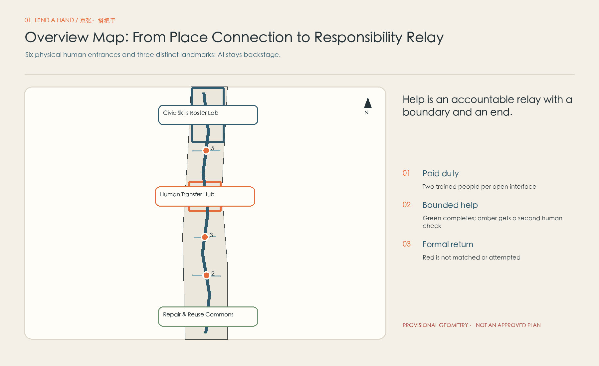
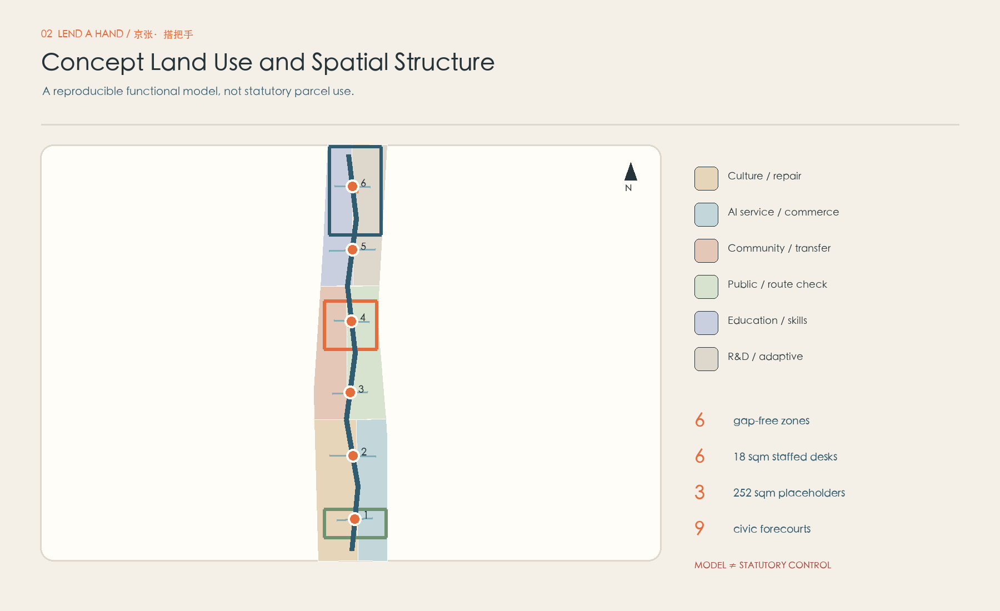
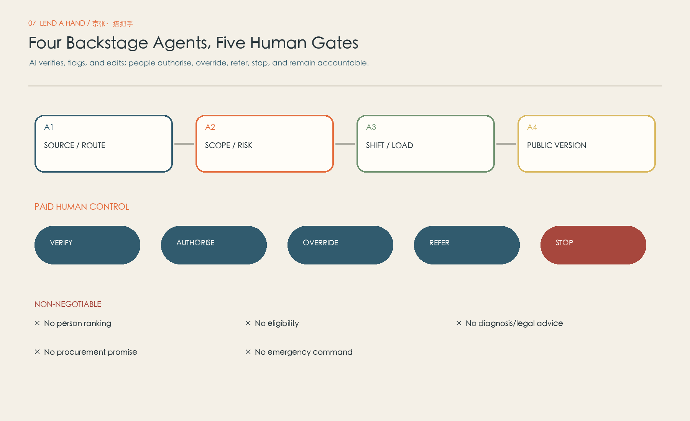
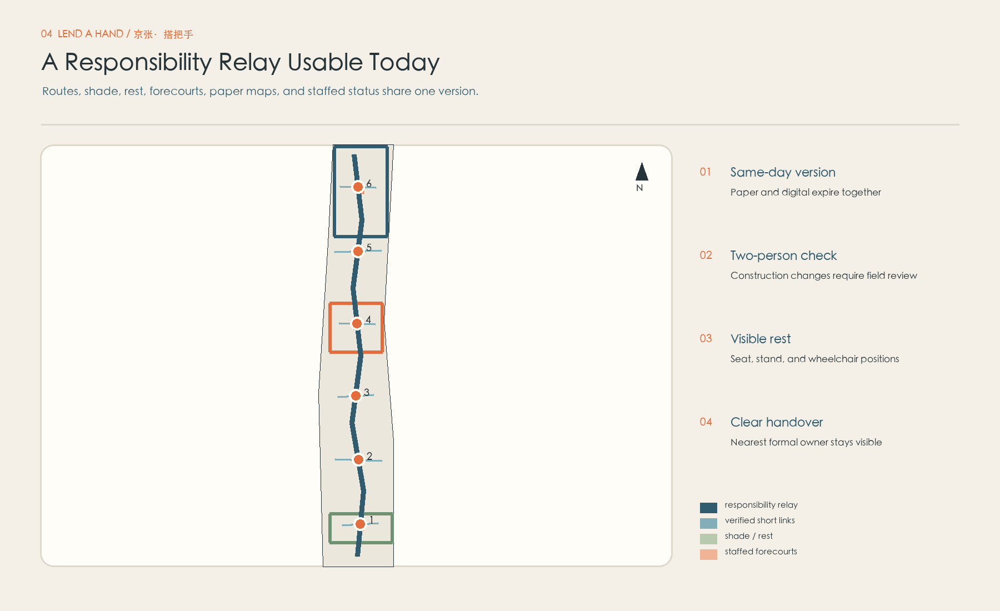
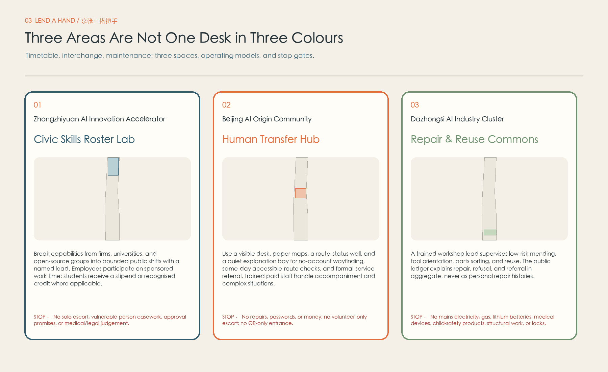
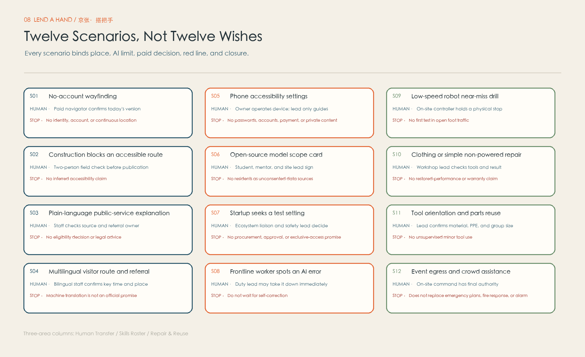
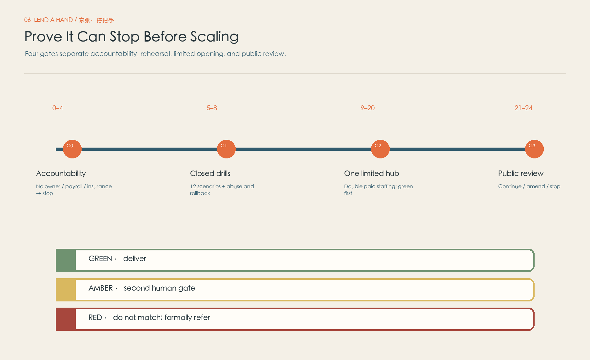
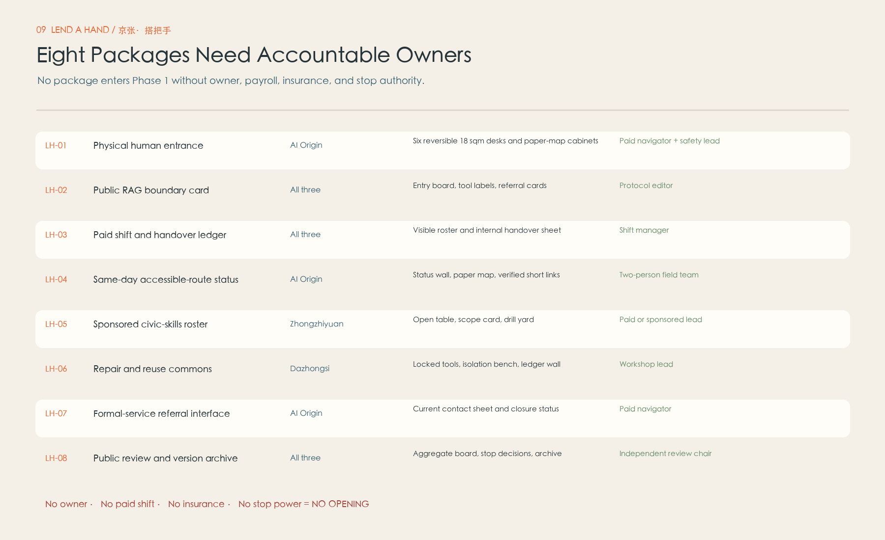
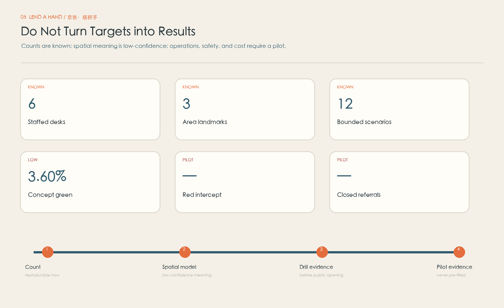

# JING-ZHANG · LEND A HAND

> A smarter city must not reduce help to a conversation between one person and a system. Public intelligence means every request knows who may receive it, how far that role extends, and when responsibility must return to a formal service.

A caregiver pushing a pram reaches construction fencing while the map still says “continue straight.” She does not need another download, nor should she be assigned to an enthusiastic neighbour with no training, insurance, or duty lead. She needs a visible human entrance: someone checks whether the route works today, draws a paper alternative, or hands responsibility to a formal owner when the situation exceeds the station's scope.

Lend a Hand is therefore neither a volunteer marketplace nor furniture placed in a park. It is a three-layer operating system: paid duty, bounded low-risk help, and formal-service interfaces. Six reversible staffed desks offer no-account entry. Three different landmarks turn skills timetabling, human interchange, and repair/reuse into place-specific civic infrastructure. Four backstage agents only verify sources/routes, flag risk, plan aggregate capacity, and edit public versions. Help is not a task assigned to a neighbour; it is an accountable relay with a boundary and an end.

## Design Basis and Source List

The official announcement controls the three scope levels, three key areas, objectives, design tasks, and deliverable context. The agent taskbook supplies the agent-facing positions, functions, and six required tasks [source:OFFICIAL-ANNOUNCEMENT] [source:AGENT-TASKBOOK]. Repository snapshots for urban design, regulatory planning, land-use classification, architectural depth, accessibility, generative AI, and ageing inclusion operate as review checklists. They do not turn a concept package into a statutory plan [standard:PROJECT-OFFICIAL-ANNOUNCEMENT].

Available SITE_BOUNDARY and KEY_AREA polygons are explicitly provisional rough geometry. They support generation, topology checks, and relational comparison, but they are not official parcel, road, heritage, or engineering redlines [data:geometry/site_boundary.geojson#SITE-001] [source:BOUNDARY-SOURCE]. The cleared package lacks an existing-building survey, ownership, rail interfaces, street sections, utility capacity, heritage controls, approved planning parameters, and an accountable operator. All areas, ratios, placeholders, and routes are low-confidence design-model outputs that must be recalculated as a whole when official data arrives.

Safety and operations use primary sources as risk-routing prompts: Civil Code provisions signal the need to obtain advice on any applicable safety duties of place managers or activity organisers; the Personal Information Protection Law informs necessity and sensitive-information review; the Volunteer Service Regulation informs voluntariness, training, records, privacy, and protection [source:CIVIL-CODE-1198] [source:PIPL] [source:VOLUNTEER-REGULATION]. NYC311, Helsinki Service Map, and Repair Café contribute transferable mechanisms—multiple access channels, service status, accessible information, refusal, and capacity—but confer no Beijing authority. Two recent peer packages were read only as benchmarks for mapping, conditional interfaces, simulation ledgers, and stop measures; no copy or geometry was reused.

## Three-Level Scope Framework

The same “help desk” is not repeated at three scales. The coordinated research area asks how AI-industry and university capabilities can become bounded public shifts without unpaid personal overtime. The overall design area asks how six physical entrances form an accessible, handover-ready, rollback-ready relay along daily routes. The key areas test three different verbs: capability departs, a person transfers, and an object or system is repaired. Rail connects locations; Lend a Hand translates timetable, interchange, and maintenance into civic responsibility [depth:three_level_scope_framework].

At the strategic level, a Civic Capability Supply Protocol requires firms to sponsor employee time, universities to provide supervision plus stipend or recognised credit where applicable, and open-source groups to accept only public and reversible tasks. At corridor level, one responsibility-relay walk links six 18 sqm reversible desks and three adaptive-reuse interface placeholders. At key-area level, Zhongzhiyuan tests capability supply, AI Origin operates the primary human referral interface, and Dazhongsi tests repair and reuse. All share the same RAG scope, double paid staffing, data minimum, and stop authority.

Six desks are spatial capacity, not a promise that six stations open simultaneously. A fixed primary hub and scheduled pop-ups open only when two trained paid people are present, paper and digital versions match, and the current formal-referral sheet is valid. Otherwise the interface visibly shows closed status and the nearest formal channel. One coordinator may not cover two stations, remotely double as safety lead, or fill sick leave with a volunteer [assumption:A-STAFF-001].

## Coordinated Research Area: Industry and Future City Research

AI ecosystems are commonly measured in compute, models, capital, and exhibition space. This proposal adds a missing infrastructure: translating everyday limits, errors, accessibility barriers, language difficulty, maintenance demand, and human override into safe public tasks. Firms receive no resident-data mine; they receive authorised, de-identified, stoppable test settings. Residents receive more than a temporary demonstration: they see a human entrance and a formal handover. Industrial value comes from more reliable systems, not from turning a neighbourhood into a cheap test bed [depth:industry_ecosystem_strategy].

Four relationships make the ecosystem credible. Firms and universities sponsor paid civic-skill shifts for device accessibility, plain-language public information, and open-source scope cards. Frontline workers can remove a wrong version, and their override enters product review as evidence. Formal-service recipients receive only the necessary request category and status, not unconsented profiles or unstructured case histories. A qualified repair operator links reuse materials, skills learning, and professional referrals; refusing a high-risk object counts as a quality result.

The talent proposition is professional dignity rather than robots everywhere. Engineers validate inside explicit limits. Frontline knowledge carries named override power. Students do not backfill jobs through goodwill. International visitors receive human-confirmed multilingual information. Accessibility users are not test subjects; they co-determine whether a route is publishable. Public evidence includes refusals, referrals, pauses, expiries, and unresolved items, proving that an AI district can stop a system.

| ID | Backstage role | May do | Final human | Hard boundary |
| --- | --- | --- | --- | --- |
| A1 | Source & Route Verifier | Compare public sources, dates, route versions, and field-check status | Paid navigator | Never fill a missing fact; expire stale information |
| A2 | Scope & Risk Sentinel | Flag RAG breaches, missing second checks, and prohibited objects | Duty/safety lead | A red flag triggers a human protocol; AI does not manage a person alone |
| A3 | Shift & Load Planner | Schedule only task category, aggregate capacity, and advertised skill shifts | Shift manager | No ranking of residents, volunteers, workers, or social value |
| A4 | Public Version & Easy-read Editor | Draft multilingual, easy-read, and paper-equivalent versions with citations | Content owner | Check time/place fields; archive overrides and previous versions |

## Overall Design Area: Urban Renewal and Regulatory-Plan-Level Urban Design

The structure is one responsibility-relay walk, six verified short links, six staffed desks, three area-specific landmarks, and four backstage agents. The line is not a proposed road; it is a conceptual relationship awaiting street and accessibility surveys. Each desk is a reversible 3 × 6 m interface. Each landmark is an 18 × 14 m adaptive-use placeholder. The total building placeholder is about 864 sqm: 108 sqm for six desks and about 756 sqm for three interfaces. Geometry therefore matches the promise of a small public interface rather than drawing a hall and calling it a table [data:geometry/buildings.geojson#BLDG-LH-T01] [metric:building_footprint_area_sqm].

Six gap-free conceptual zones use recognised classification terms for culture/repair-reuse support, AI services/community commerce, community service/human transfer, public space/route verification, education-research/civic skills, and R&D/adaptive use. These are functional relations, not statutory parcels. Green, public forecourts, routes, and building footprints are auditable overlays. No invented “AI land” code replaces planning classification [data:geometry/land_use.geojson#LU-LH-01] [standard:MNR-LAND-USE-CLASSIFICATION-GUIDE].

Renewal starts with continuous walking, accessibility, shade, lighting, physical wayfinding, egress, and a human counter. Reversible desks, paper-map cabinets, route walls, and rest places come next. Limited digital services follow. Building adaptation or long lease comes last. Without surveys of buildings, title, structure, fire safety, and heritage, no demolition, FAR, storey, height, or parking claim is made. Retain-renovate-demolish decisions follow safety/title, carbon/memory, reversible adaptation, professional review, then approval—not an AI-generated massing image [depth:retain_renovate_demolish].

Movement logic requires same-day paper/digital synchronisation, two-person field checks after construction changes, no obstruction of fire access, tactile paths, clear width, or station forecourts, and physical stop control in closed or semi-closed robot drills. Municipal and new-infrastructure needs—safe power, shutdown, lighting, storage, network fallback, fire controls, and weather protection—remain a due-diligence list, not an assumed capacity [data:geometry/roads.geojson#ROAD-LH-01] [depth:municipal_new_infrastructure].

## Detailed Design of Key Areas

The three key areas combine different space, operations, and accountability rather than three colour themes.

| Area | Core space | Landmark | Unique action | Explicit exclusion |
| --- | --- | --- | --- | --- |
| Zhongzhiyuan AI Innovation Accelerator | Civic Skills Roster Lab | Skills Timetable | Break capabilities from firms, universities, and open-source groups into bounded public shifts with a named lead. Employees participate on sponsored work time; students receive a stipend or recognised credit where applicable. | No solo escort, vulnerable-person casework, approval promises, or medical/legal judgement. |
| Beijing AI Origin Community | Human Transfer Hub | Human Interchange | Use a visible desk, paper maps, a route-status wall, and a quiet explanation bay for no-account wayfinding, same-day accessible-route checks, and formal-service referral. Trained paid staff handle accompaniment and complex situations. | No repairs, passwords, or money; no volunteer-only escort; no QR-only entrance. |
| Dazhongsi AI Industry Cluster | Repair & Reuse Commons | Repair Ledger Wall | A trained workshop lead supervises low-risk mending, tool orientation, parts sorting, and reuse. The public ledger explains repair, refusal, and referral in aggregate, never as personal repair histories. | No mains electricity, gas, lithium batteries, medical devices, child-safety products, structural work, or locks. |

Zhongzhiyuan's Civic Skills Roster Lab combines open worktables, a public scope-card wall, a closed drill yard, and a visible timetable. Each shift publishes task category, can/cannot statements, shift lead, capacity, duration, and exit. Employee participation occurs on sponsored work time; student participation requires supervision and stipend/credit where applicable. It handles device accessibility, plain-language information, open-source scope cards, and closed robot drills—not vulnerable-person cases. The Skills Timetable displays accountable capability, never personal performance ranking [data:geometry/key_areas.geojson#PROV-KEY-001].

AI Origin's Human Transfer Hub is the primary referral node. A visible counter sits on the main desire line, with a quiet explanation bay, paper maps, route-status wall, and current formal-service contact sheet. It opens with one paid navigator and one duty/safety lead; it closes when staffing is single, contacts expire, paper versions diverge, or egress is obstructed. Only trained paid staff may accompany a person, and only within public visible range and a defined shift radius. The Human Interchange cannot replace people with a screen; open/closed, queue, referral, and duty owner stay visible [data:geometry/key_areas.geojson#PROV-KEY-002].

Dazhongsi's Repair & Reuse Commons includes locked tools, clean material sorting, a low-risk bench, an isolation/refusal bay, and an aggregate ledger wall. Clothing and simple non-powered objects may proceed under supervision. Amber objects require a second decision. Mains electrical, gas, lithium batteries, medical devices, child-safety items, structural objects, and locks are refused and referred. A liability waiver cannot replace reasonable control. The Repair Ledger Wall publishes aggregate repair, refusal, and referral reasons, never a personal repair file [data:geometry/key_areas.geojson#PROV-KEY-003].

## AI Innovation Ecosystem, Personas, and AI+ Scenarios

Personas are not commercial segments. Each tests whether the interface shifts risk unevenly. The six descriptions use situation, need, equivalent physical channel, decision owner, and non-negotiable limit; no identifiable profile or ranking is created [depth:ai_scenarios_personas].

| ID | Person | Immediate task | Physical support | AI/human relationship | Do not cross |
| --- | --- | --- | --- | --- | --- |
| P01 | Older resident who prefers offline help | Find a route usable today or understand a notice | Paper map, seated explanation, take-away query code | AI drafts or checks public sources; paid staff decide. | No password, money, private contact, home visit, or eligibility decision. |
| P02 | Wheelchair, pram, or low-vision traveller | Verify an accessible link after construction changes | Field-checked status and a human alternative | AI drafts or checks public sources; paid staff decide. | No password, money, private contact, home visit, or eligibility decision. |
| P03 | Caregiver with a child | Needs clear directions without separation or secluded escort | Help in visible range; no childcare | AI drafts or checks public sources; paid staff decide. | No password, money, private contact, home visit, or eligibility decision. |
| P04 | Frontline public-service worker | Flag a system error and withdraw a stale version | Authority to stop publication and record the override | AI drafts or checks public sources; paid staff decide. | No password, money, private contact, home visit, or eligibility decision. |
| P05 | Student or open-source developer | Place a prototype in a bounded public test | Public scope card plus academic and site-lead sign-off | AI drafts or checks public sources; paid staff decide. | No password, money, private contact, home visit, or eligibility decision. |
| P06 | Startup or campus test engineer | Find a real but reversible validation setting | Closed drills first; pilot does not imply approval | AI drafts or checks public sources; paid staff decide. | No password, money, private contact, home visit, or eligibility decision. |

Twelve scenarios cover wayfinding, accessibility, public information, language, device settings, open-source scope, industry testing, rollback, robot near-miss drills, low-risk repair, tool education, and event egress. Each binds one primary place, a backstage AI role, a paid final decision, data minimum, red line, and success/stop result [metric:scenario_count].

| ID | Scenario | Primary place | AI only | Paid human gate | Data/red line | Success or stop |
| --- | --- | --- | --- | --- | --- | --- |
| S01 | No-account wayfinding | Human Transfer Hub | Source and route verification | Paid navigator confirms today's version | No identity, account, or continuous location | A usable route or clear referral |
| S02 | Construction blocks an accessible route | Human Transfer Hub | Flag conflict and request field check | Two-person field check before publication | No inferred accessibility claim | Stale version removed and paper map synced |
| S03 | Plain-language public-service explanation | Human Transfer Hub | Rewrite published material in plain language | Staff checks source and referral owner | No eligibility decision or legal advice | Visitor knows the next formal channel |
| S04 | Multilingual visitor route and referral | Human Transfer Hub | Draft a translation for review | Bilingual staff confirms key time and place | Machine translation is not an official promise | Teach-back confirmation and take-away note |
| S05 | Phone accessibility settings | Civic Skills Roster Lab | Offer generic device steps | Owner operates device; lead only guides | No passwords, accounts, payment, or private content | Setting changed or referred to official support |
| S06 | Open-source model scope card | Civic Skills Roster Lab | Structure data, capability, and failure conditions | Student, mentor, and site lead sign | No residents as unconsented data sources | Public can understand capability and limits |
| S07 | Startup seeks a test setting | Civic Skills Roster Lab | Match task category to aggregate capacity | Ecosystem liaison and safety lead decide | No procurement, approval, or exclusive-access promise | Closed drill or explicit refusal |
| S08 | Frontline worker spots an AI error | Across all three areas | Compare versions and propose rollback | Duty lead may take it down immediately | Do not wait for self-correction | Stale information removed within 15 minutes and logged |
| S09 | Low-speed robot near-miss drill | Civic Skills Roster Lab | Summarise trajectories and near misses | On-site controller holds a physical stop | No first test in open foot traffic | No red event released; one event stops test |
| S10 | Clothing or simple non-powered repair | Repair & Reuse Commons | Suggest material and generic steps | Workshop lead checks tools and result | No restored-performance or warranty claim | Safe return or written refusal/referral |
| S11 | Tool orientation and parts reuse | Repair & Reuse Commons | Suggest classification candidates | Lead confirms material, PPE, and group size | No unsupervised minor tool use | Traceable materials and capacity-bound session |
| S12 | Event egress and crowd assistance | Human Transfer Hub | Display verified exits and crowd alerts | On-site command has final authority | Does not replace emergency plans, fire response, or alarm | Drill closes under command and logs errors |

S02 shows the boundary in practice. Construction information enters the Source & Route Verifier as “field check required.” Two people inspect the public route without filming passers-by or recording a continuous trace. The duty lead first removes the stale digital version and marks the paper map, then publishes a checked alternative. If no safe alternative exists, the station says it cannot confirm a route today and refers the matter to the road/site owner. AI cannot invent the missing segment, and a volunteer cannot lead someone through construction.

S10 follows a different protocol. The owner remains present and describes the problem. The workshop lead classifies the object. Red is refused; amber proceeds only with tools, PPE, capacity, and competence; green invites the owner to take part. Completion does not promise “as new.” The lead checks obvious safety, explains residual risk, and records only aggregate object category/outcome. Injury, tool loss of control, unknown material, or an unsupervised minor stops the session and isolates the tool pending review.

## Land Use, Building Scale, and Retain-Renovate-Demolish Strategy

Land-use areas derive only from the provisional boundary in EPSG:4548. Six zones share edges without overlap and cover the design canvas. The green relay and nine civic forecourts are overlays. Buildings strictly distinguish six 18 sqm desks from three roughly 252 sqm adaptive interfaces. A public forecourt is a queue, rest, and transfer space around a desk, not the desk footprint. GeoJSON, metrics, drawings, and text all resolve to nine forecourts and nine building placeholders [data:geometry/public_space.geojson#PUBLIC-LH-01] [metric:handover_table_count].

Architectural expression stops at urban-design and operating-interface depth. A desk must be reversible, closable, visible, weather-protected, able to hold paper maps, and allow side-by-side wheelchair use. An area interface should first seek suitable existing space rather than assume a new building. Before siting, each candidate needs title, structure, fire, egress, accessibility, lighting, noise, neighbour impact, heritage, equipment load, hygiene, and storage checks. The rectangles express an operating envelope, not a construction boundary [depth:height_massing_character].

Retain-renovate-demolish decisions ask five questions: lawful and safe use; heritage/street/community-memory value; whether reversible adaptation meets access and operation; whether life-cycle carbon and cost favour reuse; and whether everyday impacts were reviewed with users. Missing evidence leaves the status unknown. Railway imagery is used in public language and responsibility structure; no facility attaches to a heritage object before official heritage boundaries are known.

## Transport, Rail, Municipal Infrastructure, and Public Services

The responsibility relay is a walking/service logic, not a road centreline. Six short links conceptually connect public entrances, transit directions, and rest forecourts, but exact alignments require official street, rail, tactile-path, slope, crossing, construction, station-crowd, and ownership data [data:geometry/roads.geojson#ROAD-LH-02] [depth:traffic_rail_slow_parking]. Route status has three classes: field checked, public source awaiting check, and currently unconfirmable. Only the first supports “usable today.” Paper and digital maps share a version and expire together.

Desk siting follows visibility without spectacle, seating and standing, side-by-side wheelchair space, no child separation, staff access to backup, and no obstruction of fire or tactile routes. Only trained paid staff accompany someone within a defined public visible radius, recording start/end node and outcome rather than a trace. No home entry, private-car transport, or personal contact exchange. Emergencies follow on-site emergency and call protocols immediately; they do not wait for AI triage.

Due diligence covers compliant power and shutdown, paper operation during network failure, lighting and closure, fire and egress, wet-weather safety, locked tools and inventory, material cleaning/isolation, accessible restrooms, refused waste, screen privacy, permissions, and daily open/close checks. “Lightweight” removes none of these duties. A venue with tables but no safety, storage, support, and closure capability may host explanation only—not repair or accompaniment.

Formal referral uses a minimum ticket: request category, station, time band, immediate-risk flag, receiving owner, receipt time, closure state, and version. Names, phone numbers, precise location, health/family detail, passwords, accounts, photos, and free-text histories remain out by default. Where contact is genuinely needed, the formal receiving service follows its own lawful process rather than turning the Lend a Hand ledger into a shadow case database [assumption:A-DATA-001].

## Blue-Green Network, Public Space, and Urban Character

The blue-green system supports rest, legibility, and recovery rather than using a large percentage to mask weak site evidence. The concept model places an 18 m design buffer along the relay, six rest pockets, three key-area green islands, and nine forecourts. All require recalculation against official ecology, water, trees, sponge-city, heritage, and road data [data:geometry/green_space.geojson#GREEN-LH-01] [metric:green_ratio]. The displayed ratio is a design-model output, not a statutory green-space ratio or a claim of new landscape delivery.

Public space is more than furniture. Each open node needs five layers: distant open/closed visibility; a service scope readable without scanning; seated, standing, and wheelchair explanation positions; a discreet handover position for amber/red requests; and a paper formal channel that remains useful after staff leave. Area landmarks add a unique interface: the timetable communicates time and capability; the interchange shows who receives the next leg; the ledger explains what was repaired, refused, or professionally referred.

Identity comes from railway operations rather than cyber-blue spectacle. Deep blue marks accountable continuity, orange marks a break requiring handover or repair, green marks recovery/rest, and warm paper keeps a daily scale. The symbol is an open handover, not a compulsory handshake, plus a discontinuous route: help may be refused, paused, or returned. Information hierarchy is fixed—open today, scope, duty person, stop, next formal channel—so promotion never precedes safety.

Accessibility follows two equivalent paths: high-contrast, legible physical text with paper, spoken, seated, and easy-read support; and a zoomable, keyboard-usable page tied to the same version. Accessibility law and ageing-inclusion policy are applicability checks. The proposal does not generalise one provision into a universal statutory human-service duty; no-account human access is a self-imposed public-design principle [standard:BARRIER-FREE-ENVIRONMENT-LAW].

## Renewal Projects, Implementation Policy, and Phasing

Every spatial output is paired with an accountable owner, operator, prerequisite, and stop gate. “Co-creation” without an owner never enters Phase 1. A desk without paid duty stays closed. A tool cabinet without a qualified workshop lead stays locked.

| Pkg | Project | Place | Physical output | Accountable owner | Daily operator | Minimum prerequisite | Continue/stop evidence |
| --- | --- | --- | --- | --- | --- | --- | --- |
| LH-01 | Physical human entrance | AI Origin | Six reversible 18 sqm desks and paper-map cabinets | Local public accountable body | Paid navigator + safety lead | Gate 0 owner/site/insurance pass | Continue only when spatial and operating evidence passes |
| LH-02 | Public RAG boundary card | All three | Entry board, tool labels, referral cards | Operator safety lead | Protocol editor | Gate 0 owner/site/insurance pass | Continue only when spatial and operating evidence passes |
| LH-03 | Paid shift and handover ledger | All three | Visible roster and internal handover sheet | Operator | Shift manager | Gate 0 owner/site/insurance pass | Continue only when spatial and operating evidence passes |
| LH-04 | Same-day accessible-route status | AI Origin | Status wall, paper map, verified short links | Road/site duty owner | Two-person field team | Gate 0 owner/site/insurance pass | Continue only when spatial and operating evidence passes |
| LH-05 | Sponsored civic-skills roster | Zhongzhiyuan | Open table, scope card, drill yard | Campus/university partners | Paid or sponsored lead | Gate 0 owner/site/insurance pass | Continue only when spatial and operating evidence passes |
| LH-06 | Repair and reuse commons | Dazhongsi | Locked tools, isolation bench, ledger wall | Qualified/professional operator | Workshop lead | Gate 0 owner/site/insurance pass | Continue only when spatial and operating evidence passes |
| LH-07 | Formal-service referral interface | AI Origin | Current contact sheet and closure status | Receiving service owner | Paid navigator | Gate 0 owner/site/insurance pass | Continue only when spatial and operating evidence passes |
| LH-08 | Public review and version archive | All three | Aggregate board, stop decisions, archive | Public accountable body | Independent review chair | Gate 0 owner/site/insurance pass | Continue only when spatial and operating evidence passes |

Gate 0 (weeks 0–4) confirms the public owner, operator, venue rights, payroll and relief, insurance, legal, safeguarding, privacy, accessibility, fire, and formal receiving owners. One missing condition stops the process; there is no public recruitment. Gate 1 (weeks 5–8) is closed tabletop/field rehearsal only. All twelve scenarios plus abuse, stale rollback, staff absence, network failure, lost child, tool loss of control, and emergency-call tests must run before public service [depth:phasing_implementation].

Gate 2 (weeks 9–20) opens one double-staffed hub and a few scheduled pop-ups, initially for green requests. Repair opens only after separate tool, PPE, isolation, inspection, and insurance gates. Any missed red line, unresolved safeguarding event, volunteer substitution, missing paper equivalent, single-person opening, or stale-route failure closes the interface. Gate 3 (weeks 21–24) publishes aggregate evidence and convenes the owner, frontline staff, accessibility representation, operator, and independent chair to continue, amend, or stop.

Scaling ignores footfall and media reach. It looks at paid staffing delivery, red-risk interception, no-account completion, closed-loop referral, route freshness, workload, privacy samples, and funded cost. Unknown metrics remain unknown; targets are not results. Public invitations ask people to challenge scope, safety, staffing, and siting—never to provide case stories or volunteer before approval.

## Metrics, Area Recalculation, and Compliance Matrix

Metrics have three statuses. Structural counts are known proposal facts. Spatial numbers are reproducible from provisional geometry but low-confidence in planning meaning. Operating, safety, labour, privacy, and cost evidence can only exist after accountability, agreements, and a pilot. Known, target, and unknown never share a column [depth:metrics_recalculation].

| Class | Measure | Current | Definition | Confidence/time |
| --- | --- | --- | --- | --- |
| Structure | Staffed relay desks | 6 | GeoJSON building-feature count | High; design count |
| Structure | Area-specific landmarks | 3 | Adaptive-interface count | High; design count |
| Content | Scenarios | 12 | Scenario-matrix count | High; text count |
| Content | Personas | 6 | Persona-matrix count | High; text count |
| Spatial | Provisional site area sqm | 11412825.386 | EPSG:4548 recalculation | Low; provisional boundary |
| Spatial | Concept green ratio | 0.036008 | Green union / provisional site | Low; design model |
| Spatial | Concept public-space ratio | 0.003634 | Nine forecourts / provisional site | Low; design model |
| Operations | Staffed-hours delivery | Unknown | Actual double-staffed hours / approved hours | After pilot |
| Safety | Red-request interception | Unknown; drill target 100% | Refused/referred red requests / all red requests | After drills |
| Referral | Closed-loop referral | Unknown | Receiving-owner confirmations / referrals | After agreements and pilot |
| Access | No-account completion | Unknown | Completed/referred without an account / eligible requests | After pilot |
| Labour | Volunteer-substitution incidents | Unknown; target 0 | Cases improperly shifted from paid/professional roles | After pilot |
| Privacy | Minimisation audit pass | Unknown | Samples without unnecessary identity/free text/location / samples | After privacy assessment |
| Cost | Operating cost per closed request | Unknown | Payroll + venue + insurance + tools + upkeep / closed requests | After budget and pilot |

The provisional site is 11,412,825 sqm, with a concept green ratio of 0.0360 and concept public-space ratio of 0.0036 [metric:site_area_sqm] [metric:public_space_ratio]. These numbers prove internal consistency—geometry exists, CRS recalculation works, ratios agree, and six desks/three landmarks match. They prove neither approval, venue availability, nor service effect. FAR, height, parking, utility capacity, and real operating cost remain unknown.

The compliance matrix covers announcement tasks, three scales, overall work, key-area work, and six agent tasks. The professional matrix covers nine repository standards; the design-depth matrix covers fifteen required items. “Addressed/complete” means an evidence chain exists in this package. It does not mean administrative approval, legal opinion, engineering review, or third-party certification. Qualified people and accountable bodies must re-evaluate applicability before implementation.

## Risk, Copyright, and Compliance

The primary risk is not one wrong AI sentence; it is warm language hiding responsibility. Six hard limits follow: volunteers do not replace paid, statutory, or professional roles; minors and vulnerable adults are not assigned to an unaccompanied volunteer; red requests are neither matched nor attempted; repair refusal overrides social pressure; personal data is minimal and no-account by default; AI does not rank people or make final eligibility, priority, safety, diagnosis, legal, procurement, or emergency decisions [assumption:A-SAFETY-001].

| Level | Allowed/trigger content | Mandatory action |
| --- | --- | --- |
| Green | Public information, paper maps, seated explanation, language/accessibility help, owner-operated device settings, supervised clothing or simple non-powered repair | Deliver within shift scope and record minimal event data |
| Amber | Field route checks, visible-range accompaniment by trained paid staff only, advanced tools, complex situations involving vulnerable adults | Safety lead makes a second decision; refer when capacity is absent |
| Red | Emergency care or diagnosis, legal/eligibility decisions, money transfer, passwords/accounts, home entry, childcare, private-car transport, private contact/photos, high-risk repair | Do not match or attempt; refer to emergency/formal services and open an incident record as appropriate |

Every open interface has two trained paid people. The public-facing role handles explanation, paper maps, green requests, and formal referral. The duty/safety lead controls amber decisions, red protocols, incidents, opening/closure, and stop authority. Volunteers, company partners, and students may share knowledge only in approved supervised low-risk shifts. They may not escort alone, triage cases, access private devices, receive money, enter homes, transport, photograph/contact privately, or command an incident. “No worker is available, so a volunteer will cover” closes the station [assumption:A-VOLUNTEER-001].

Default records contain request category, station, time band, outcome, referral state, and version only. Names, phone numbers, identity documents, health/family details, precise traces, photos, passwords, accounts, payments, and free text are not routine inputs. Situations involving children under 14, precise movement, health, or other sensitive information stay outside ordinary operation. Any future strict necessity requires separate lawful-basis, necessity, consent, access, retention, and deletion review. Paper is an equivalent formal path, not a degraded one.

Repair never uses a disclaimer in place of insurance and reasonable control. A qualified operator, locked tools, PPE, material isolation, capacity, guardian rules, output check, refusal/referral list, incident report, and stop authority are prerequisites. High-risk categories remain excluded. The concrete applicability of public-place, activity, volunteer, personal-information, and AI duties must be assessed by qualified local reviewers; citations route risks rather than certify compliance.

Text, coded geometry, figures, visual pages, and PDFs were independently generated by Codex under AmyLili28's direction from public sources and repository inputs. External cases are summarised only for mechanisms. No unauthorised corporate marks, portraits, interview quotations, or long copyrighted passages are used. Figures are deterministically drawn with Pillow; ImageGen is not claimed. COMMUNITY-DISPLAY-ONLY describes display permission for this submission and cannot override third-party rights.

Unified boundary: this is an agent-generated concept proposal, not an approved statutory plan. It does not represent approval, funding, employment, insurance, venue access, or service commitment by government, owners, operators, or communities. Every location, metric, role, hour, and procedure requires official data, site investigation, professional review, and confirmation by accountable bodies before implementation [depth:risk_missing_data].

## References

1. Beijing Municipal Commission of Planning and Natural Resources, Haidian Branch, official Jing-Zhang AI Innovation Belt announcement [source:OFFICIAL-ANNOUNCEMENT].
2. Repository site package, source registry, agent taskbook, and provisional geometry [source:SITE-PACKAGE] [source:SOURCE-REGISTRY].
3. Civil Code safety-duty provisions, Personal Information Protection Law, and Volunteer Service Regulation, used only for precondition/risk review [source:CIVIL-CODE-1198] [source:PIPL] [source:VOLUNTEER-REGULATION].
4. NYC311, Helsinki Service Map, and Repair Café House Rules, used only for transferable access/status/low-risk operating mechanisms [source:NYC311] [source:HELSINKI-SERVICE-MAP] [source:REPAIR-CAFE-RULES].
5. Public peer packages Jingzhang Commons Rail and Jingzhang Slow Line, used only as evidence and visual-quality benchmarks [source:PEER-COMMONS-RAIL] [source:PEER-SLOW-LINE].
