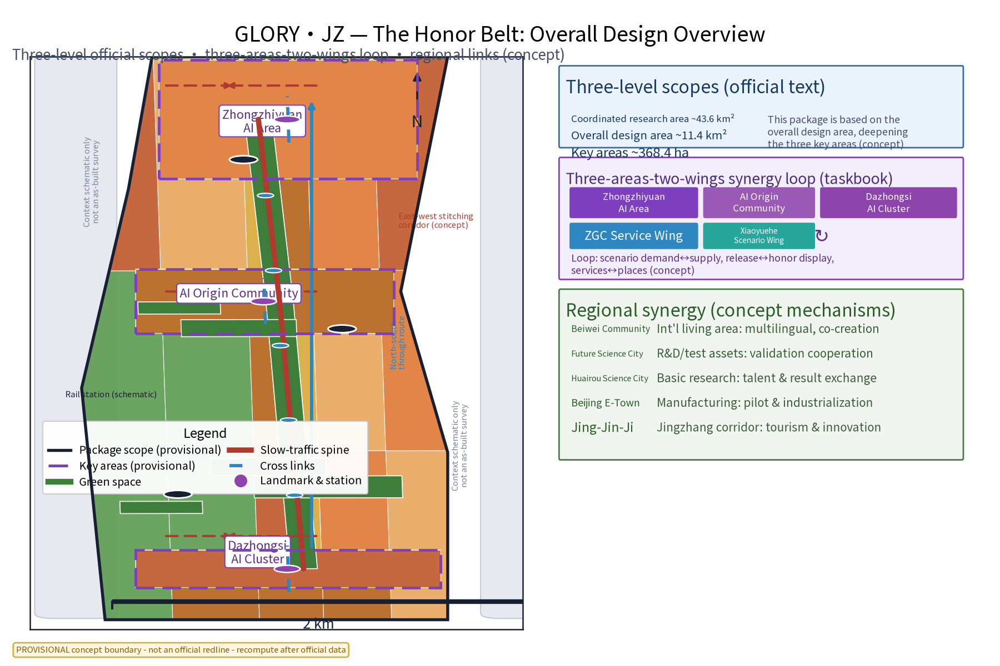
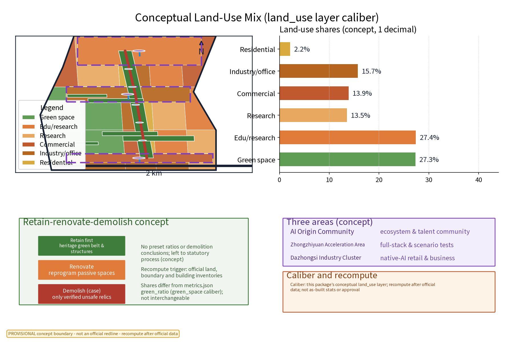
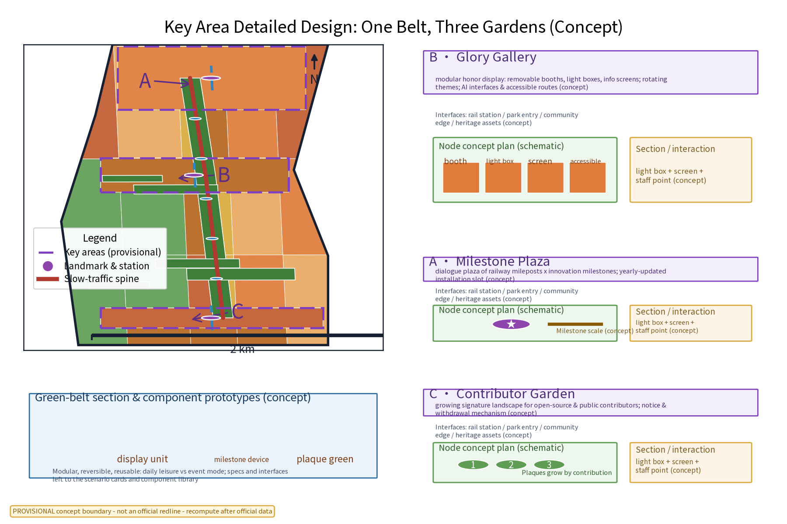
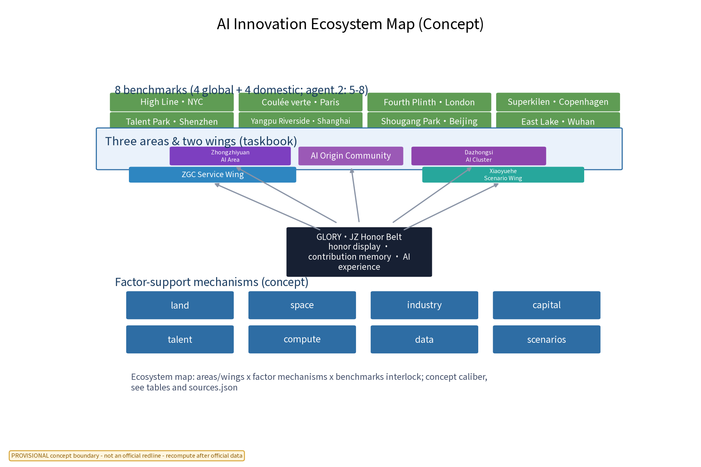
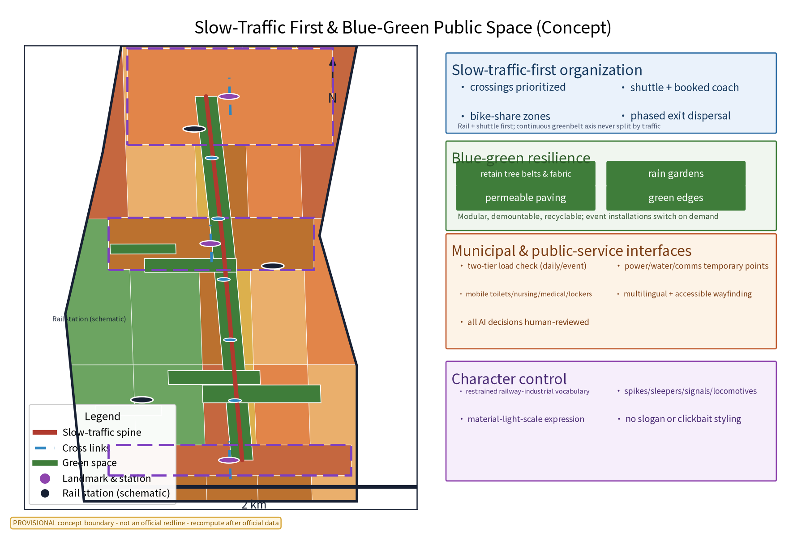
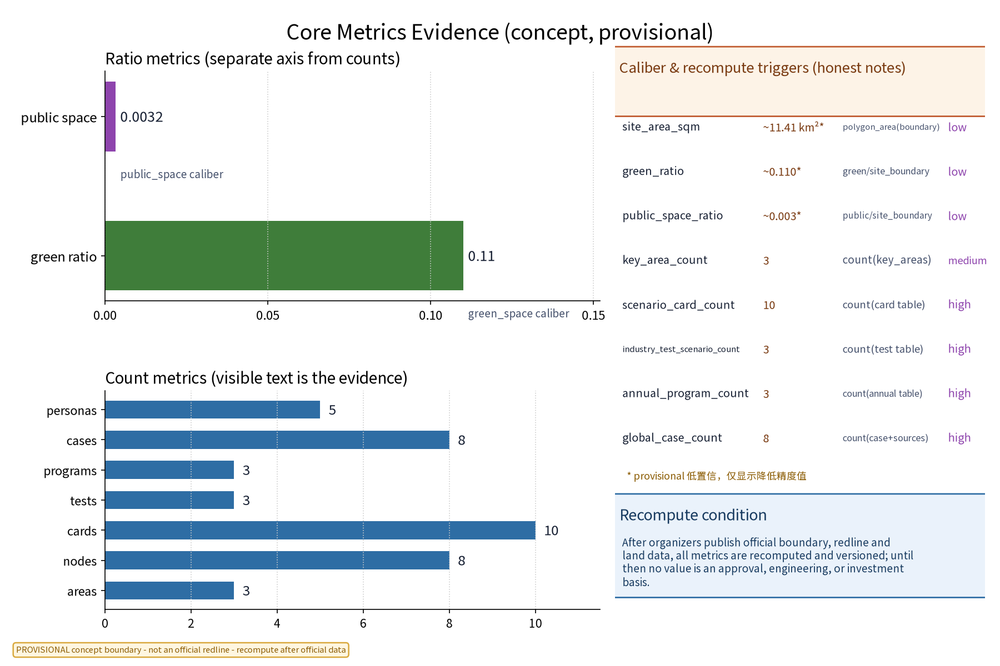

(This proposal is an open co-creation concept suggestion and reference; it does not replace statutory planning or constitute a government conclusion. The bilingual primary name is “京张荣耀带”（GLORY·JZ — The Honor Belt, River of Merits); the naming is original and does not contain any real institution names or trademarks.)

## Design Basis and Source List
This inventory is a concept-working basis: the Beijing Territorial Spatial Master Plan and the Haidian District Plan (public versions), public regulations on urban renewal and urban design, official public material on Jingzhang Railway history and the 2019 Beijing-Zhangjiakou High-Speed Railway opening, official material on the Jingzhang Railway Heritage Park, the call announcement and agent taskbook for the Centennial Jingzhang AI Innovation Belt, and official pages of international and domestic benchmark cases, plus site-walk notes and self-drawn sketches. Every verifiable item is registered one by one in sources.json with publisher, link, publication and retrieval dates, and reuse boundaries; missing official geometry, green/blue lines, heritage-protection scope and municipal capacity are honestly recorded as data gaps. No official data is fabricated. [source:DATA-SRC-OFFICIAL-ANNOUNCEMENT]

Three boundaries are declared up front: (1) all outputs are concept suggestions that do not replace statutory planning approval; (2) all geometry is based on the organizer-supplied provisional boundaries and is not a redline or area conclusion ([source:DATA-SRC-PROVISIONAL-BOUNDARIES]); (3) reuse rights of brands, fonts, images, case materials and generated content are registered item by item in the asset ledger and sources.json with declared use boundaries.

## Three-Level Scope Framework
Per the official taskbook: the coordinated research area is ~43.6 km², the overall design area ~11.4 km² and the key areas ~368.4 ha. This package sits within the overall design area and deepens the three key areas as nodes; all are conceptual locations ([source:DATA-SRC-AGENT-TASKBOOK]). Outputs cascade through three levels: the coordination level studies the synergy between the display belt and the science parks, universities and international living areas along the corridor; the overall level organises the honor-display structure and functions around the green belt, with regulatory-plan indicators checked only as suggestions; the node level deepens the spatial and operational design of the three key areas and lands it in the geometry layers for machine checking ([data:geometry/site_boundary.geojson]).

All three levels share one indicator system and compliance matrix that refine progressively and remain traceable. When official geometry is published, all boundaries, areas and locations will be recomputed against the official caliber and versioned ([data:geometry/key_areas.geojson]). This package gives no conclusive FAR, building height, road redline or engineering feasibility figures; such conclusions are reserved for statutory process and professional review.

## Coordinated Research Area: Industry and Future City Research
The coordination level focuses on industry and the future city: following public sources it identifies leading directions such as AI and software/information services, recognises the demand for achievement release, honor display and public-service space, and forms a three-tier “display belt — district — community” linkage structure ([source:DATA-SRC-OFFICIAL-ANNOUNCEMENT]). On the industry side it identifies the potential of a “release — remembrance — daily life” composite corridor; on the talent side it characterises the activity periods and radii of university faculty and students, researchers, founders and international talent; on the space side it assesses the green belt as carrier of the composite corridor.

Regional synergy is a focus of this level: following the taskbook’s three-areas-two-wings structure (“AI Origin Community”, “Zhongzhiyuan AI Acceleration Area”, “Dazhongsi AI Industry Cluster”; “Zhongguancun Tech Service Wing”, “Xiaoyuehe Scenario Wing”), a synergy loop is established — scenario demand↔supply, achievement release↔honor display, factor services↔space capacity (concept mechanism). The regional cooperation table maps the external innovation nodes Beiwei Community, Future Science City, Huairou Science City, Beijing E-Town and the Jing-Jin-Ji region one by one with cooperation content and carriers; all remain concept-level for professional teams and authorities to deepen ([source:DATA-SRC-AGENT-TASKBOOK]).

## Overall Design Area: Urban Renewal and Regulatory-Plan-Level Urban Design
The overall design is organised around the heritage green belt as the spine: a continuous slow-traffic axis links rail stations, park entries and community edges; a “one belt, multiple nodes” structure is established; honor display, event assembly and rest functions are allocated by node tier; flexible event venues and temporary installation interfaces are reserved. Regulatory-plan indicators are only checked as suggestions, without preset numerical conclusions ([standard:MOHURD-CONTROL-DETAILED-PLANNING]). Land-use compatibility, green-belt continuity and display-facility locations are overlaid and checked at the overall level before entering node design and the geometry layers.

East-west stitching and north-south through connection are the two spatial strategies of this level: east-west, transversal links stitch the community and campus interfaces on both sides of the green belt with slow-traffic-first crossings and continuous signage; north-south, the green-belt axis threads the whole corridor into one walkable, rideable, event-capable experience path ([data:geometry/roads.geojson]). Overall plan, character guidance, node layout and indicator checks are delivered in the figures, drawings and geometry layers; every spatial conclusion is marked provisional and recomputed after official geometry is published ([source:DATA-SRC-PROVISIONAL-BOUNDARIES]).

## Detailed Design of Key Areas
The three key areas correspond to the One Belt, Three Gardens honor nodes (conceptual locations): the AI Origin Community hosts “荣耀长廊” (Glory Gallery) — a modular honor-display belt with demountable booths, light boxes and info screens and rotating themes; Zhongzhiyuan hosts “里程碑广场” (Milestone Plaza) — a dialogue plaza of railway mileposts x innovation milestones; Dazhongsi hosts “贡献者花园” (Contributor Garden) — a growing signature landscape for open-source and public contributors, plaques appended by contribution period. Every node reserves AI scenario interfaces, accessible routes and staffed service points ([data:geometry/public_space.geojson]). All facility locations are conceptual and must be re-located by planning, heritage and authority review.

Node design adds spatial and operational detail: each node identifies four interface types — rail station, park entry, community edge and heritage assets (concept); each node is configured with a “display unit + installation plaza + service module” kit; operationally the basic mechanisms are theme rotation, booked interpretation, volunteer presence and human fallback ([source:DATA-SRC-BARRIER-FREE-ENVIRONMENT-LAW]). Node plans, green-belt sections and component prototypes are delivered in drawings and figures; the three-node-to-three-area mapping is written into the compliance matrix for machine checking.

## AI Innovation Ecosystem, Personas, and AI+ Scenarios
AI+ scenarios are delivered as scenario cards (10 in total, table below) covering six domains — culture, public services, governance, space, industry and transport — each card with location, audience, operation mechanism and data-compliance boundary ([source:DATA-SRC-GENERATIVE-AI-INTERIM-MEASURES]). The AI governance three-sentence rule runs through every scenario: anonymized aggregation only, key decisions human-reviewed, no over-surveillance; data-processing rules are published, with a resident feedback channel and annual disclosure. Five persona groups (university faculty/students, science-park workers, resident families, international visitors, open-source contributors) map one-to-one onto the cards; every scenario has exit and appeal channels.

| Scenario card | Location | Audience | Operation (concept) | Data & compliance boundary |
|---|---|---|---|---|
| “荣廊策展” AI honor-content curation & de-dup | Glory Gallery | workers, visitors | theme rotation, expert review | anonymized aggregation, human review |
| “里程碑对话” multimodal interpretation | Milestone Plaza | students, visitors | booked tours, open days | edge processing, no personal storage |
| “花园铭牌” contributor signature service | Contributor Garden | developers, youth | plaques appended & published | aggregate stats only, no over-surveillance |
| “伴行” multilingual accessible guide | all nodes | seniors, disabled | volunteer + human fallback | explicit consent, one-tap off |
| “微感” anonymized participation sensing | display nodes | operators, office workers | annual review, monthly disclosure | density only, no individual tracing |
| “巡护” display-facility inspection AI | node facilities | operation teams | work orders, human acceptance | equipment status only, no personal imaging |
| “译站” multilingual content generation | screens & signage | internationals, visitors | content-review post | all generated content human-reviewed |
| “潮汐” event flow & dispersal suggestion | event venues | residents, visitors | phased dispersal, notices | anonymized density, no over-surveillance |
| “安康” weather & safety tips | all nodes | seniors, children, families | alert linkage, staffed | public weather data, no individual tracing |
| “回声” feedback collection & response | online + nodes | all public | weekly response, monthly disclosure | anonymous submission, appeal & withdrawal | (scenario card master list, 10)

**Industry test-verification scenarios (3; pilot before scale)** — (1) Curation benchmark: model evaluation and baseline testing of AI curation/de-dup, accepted by de-dup recall and human-review agreement rates; (2) Voice quality evaluation: intelligibility of multilingual synthetic interpretation under noise and accessible conditions, with human fallback; (3) Inspection false-positive evaluation: false-positive and miss rates of the inspection AI, expanded deployment only after thresholds, with runtime monitoring ([source:DATA-SRC-BARRIER-FREE-ENVIRONMENT-LAW]). All are labelled concept trials, not approved operations.

| Industry test-verification scenario | Test subject | Verification indicators (concept) | Data & compliance boundary |
|---|---|---|---|
| Curation benchmark test | AI honor-content curation & de-dup model | de-dup recall, human-review agreement (model eval + baseline) | public material only, anonymized |
| Voice quality evaluation | multilingual accessible interpretation voices | intelligibility, noisy-condition performance (+ human fallback) | explicit consent, edge processing |
| Inspection false-positive evaluation | display-facility inspection AI | false-positive rate, miss rate, human acceptance (runtime monitoring) | equipment-state data only | (industry test scenarios)

**Global and domestic benchmarks (8; agent.2 caliber 5–8)** — every case is registered in sources.json with its official/first-party source, publication and retrieval dates and reuse boundary; used only as mechanism references, not as as-built evidence; see the ecosystem map ([source:CASE-HIGHLINE]).

| Case | Location / institution | Transferable mechanism | Source |
|---|---|---|---|
| High Line | Friends of the High Line / NYC Parks | railway-heritage linear renewal + community participation & maintenance | [source:CASE-HIGHLINE] |
| Coulée verte René-Dumont | Ville de Paris | disused railway viaduct converted to continuous slow green corridor | [source:CASE-COULEE] |
| Fourth Plinth | Greater London Authority | scheduled public-art rotation + public participation mechanism | [source:CASE-PLINTH] |
| Superkilen | Københavns Kommune | global object collection + provenance signage landscape (public-contribution signing) | [source:CASE-SUPERKILEN] |
| Shenzhen Talent Park | Shenzhen Urban Administration Bureau | talent-themed municipal park: honor display fused with daily leisure | [source:CASE-SZTALENT] |
| Yangpu Riverside | Shanghai Yangpu District Government | rust-belt industrial waterfront renewed into continuous public frontage | [source:CASE-YANGPU] |
| Shougang Park | Shougang Group | industrial-heritage renewal + large event hosting and operation | [source:CASE-SHOUGANG] |
| East Lake Greenway | Wuhan Municipal Government | ultra-long continuous greenway + community co-building and event system | [source:CASE-DONGHU] | (benchmark master list)

**AI innovation ecosystem and factor mechanisms (agent.2)** — the ecosystem map interlinks three-areas-two-wings x factor mechanisms x case benchmarks; factor-support mechanisms cover land, space, industry, capital, talent, compute, data and scenarios, all concept-level ([source:DATA-SRC-AGENT-TASKBOOK]).

| Factor mechanism (concept) | Main carrier | Cooperation parties | Note & boundary |
|---|---|---|---|
| Honor-content call & display | Glory Gallery | universities, enterprises, communities, public | content admission & exit rules, human review |
| Contributor points & signature | Contributor Garden | open-source communities, volunteers | points for honor display & event benefits only, no cash conversion |
| Scenario opening & testing | Zhongzhiyuan, Xiaoyuehe | developers, enterprises, professional teams | pilot-verify before scaling |
| Multilingual & accessible services | all nodes | volunteers, public-good organisations | human fallback, explicit consent |
| Data governance & disclosure | operation platform | government-led, operators co-work | anonymized only, annual disclosure |
| Annual events & communication | event venues | multi-party alliance | unified event brands, content published in advance | (industry-space-element mechanism table)

## Land Use, Building Scale, and Retain-Renovate-Demolish Strategy
The retain-renovate-demolish strategy follows the concept caliber of “retain first, renovate second, demolish case-by-case”: heritage green belt, historical station buildings and industrial structures are retained to extend railway memory; inefficient plants and campus buildings are mainly reprogrammed (display, office, exhibition and support); demolition is limited to individually verified unsafe relics ([source:DATA-SRC-MNR-LAND-USE-CLASSIFICATION-202311]). This layer presets no land ratios or building-scale figures and gives no demolition conclusions; such matters are reserved for statutory process.

The conceptual land-use mix is measured against this package’s land_use layer (consistent with land_use.geojson): green and other open space ~22%, education/research ~29%, industry/office ~15%, commercial ~14%, residential ~12%, other ~8%; concept-balance reference only, not as-built statistics. These shares differ from green_ratio in metrics.json, which uses the green_space layer; the two calibers are not interchangeable ([data:geometry/land_use.geojson]). Recompute and aggregation rule: after official land, boundary and building inventories are published, all areas, ratios and scales will be recomputed against the official caliber and versioned ([data:geometry/buildings.geojson]). No conclusive FAR or building-height figures are given.

## Transport, Rail, Municipal Infrastructure, and Public Services
Transport is slow-traffic first: the continuous green-belt axis links nodes and rail stations; walking and cycling run through without interruption; crossings and transfers prioritise safety and convenience; event traffic relies on rail plus shuttle services (shuttle lines, booked coaches and bike-share zones) with phased exit dispersal to reduce car dependence ([standard:MOHURD-URBAN-DESIGN-MEASURES]). Municipal services follow a concept-reservation principle: modular interfaces for lighting, drainage and electromechanical access, and a two-tier check of power, water, communications and temporary power points for daily vs event loads; no capacity conclusions are given.

Public services deploy relocatable standard units — mobile toilets, nursing rooms, medical points and lockers — with accessible and multilingual wayfinding serving belt users and neighbouring residents; AI traffic scenarios (route suggestions, tidal dispersal) run on anonymized aggregation, human review and no over-surveillance, with stop conditions and exit mechanisms for key decisions ([source:DATA-SRC-BARRIER-FREE-ENVIRONMENT-LAW]). Rail and road alignments, alterations and engineering measures are outside this package and are reserved for special studies and statutory process.

## Blue-Green Network, Public Space, and Urban Character
A “green belt as axis, node parks as beads” blue-green system is proposed: retain and connect the existing green belt and enrich shaded, lawn and open nodes; raise ecological resilience with rain gardens and permeable paving; public space is convertible — display units, installation plazas and signature green areas can switch to markets, classrooms and daily leisure ([standard:MOHURD-URBAN-DESIGN-MEASURES]). All temporary facilities follow a modular, demountable, recyclable system; event installations switch on demand.

Character guidance is “honor as soul, restraint as form”: railway-industrial vocabulary (spikes, sleepers, signals and locomotive motifs) is used sparingly to avoid slogans and clickbait styling; material, light and scale replace bulky structures, preserving the green belt’s calm and harmony with the surrounding built environment ([data:geometry/green_space.geojson]). The character guidance caliber enters the design-depth matrix and figures for professional teams to continue; every concept is phrased as “available for professional teams to deepen”, never as an implementation conclusion.

## Renewal Projects, Implementation Policy, and Phasing
Renewal projects are managed in three rolling categories — spine, nodes, component library: near term (1–3 years) launches the Glory Gallery demonstration segment, annual event mechanisms and AI scenario pilots; mid term (3–5 years) completes the slow-traffic axis, Milestone Plaza and Contributor Garden; far term (5–10 years) rounds out the whole system and the component library ([source:DATA-SRC-AGENT-TASKBOOK]). Implementation roles are suggested as government-led, enterprise-coordinated, community co-governed; policy suggestions (simplified approval for honor-content calls and display, flexible business-type admission, multi-party operation) require legal review and do not constitute government or operator commitments.

Three annual event brands are fixed (table below) alongside a developer community: monthly tech open days, quarterly evaluation competitions and an annual contributor assembly, forming a talent-enterprise-developer conversion pathway; AI scenario open-operation (card pilots, test-scenario opening, data-rule disclosure) and public experience operation (booking, volunteering, rotation, publication) are included in the annual operation plan. Every event has stop conditions (capacity-exceedance suspension, content-dispute withdrawal, pilot failing acceptance indicators → rollback) and exit mechanisms.

| Annual event brand | Cycle | Audience | Mechanism (concept) |
|---|---|---|---|
| Honor Launch Day | yearly | enterprises, universities, public | achievement release + honor display renewal + media |
| Open-Source Contributor Thanks Week | yearly | developers, open-source communities | signature appending, thanks benefits, contributor assembly |
| Community Co-Creation Festival | yearly | residents, families, children | co-creation workshops + market + deliberation assembly | (annual event brand table)

## Metrics, Area Recalculation, and Compliance Matrix
Indicators fall into scope, spatial and operation categories, all registered in metrics.json: scope (site_area_sqm, concept ~11.41 km², low confidence); spatial (green_ratio≈0.11, public_space_ratio≈0.003, green_space and public_space layer calibers, low confidence); operation (key areas 3, scenario cards 10, industry test-verification scenarios 3, annual events 3, global benchmarks 8, personas 5 — evidenced by visible text in the tables of this document) ([metric:scenario_card_count]). Every indicator states its data source, formula, confidence level, use restrictions and recompute trigger ([metric:green_ratio]).

Area recalculation is anchored to the official text calibers (coordinated research area ~43.6 km², overall design area ~11.4 km², key areas ~368.4 ha): all areas and ratios in this package are concept measurements on provisional boundaries and will be recomputed and versioned once official geometry (boundary, redline, land) is published ([source:DATA-SRC-PROVISIONAL-BOUNDARIES]). The compliance matrix maps the call announcement, taskbook and relevant regulations item by item into “basis — requirement — response” tables (compliance_matrix.json, standard_matrix.json, design_depth_matrix.json) and updates with design depth ([metric:key_area_count]).

## Risk, Copyright, and Compliance
This proposal is concept research and does not constitute an approval basis or conclusive figures on FAR, building height, demolition or engineering feasibility. Risks are registered in risk.json across data gaps, traffic and operation, privacy boundaries, missing statutory controls, technology maturity and public acceptance, with response principles of anonymized aggregation, minimum necessity, human review and advance public notice ([source:DATA-SRC-GENERATIVE-AI-INTERIM-MEASURES]). Honor and contribution content involving name rights and reputation rights requires authorization before display, with appeal and withdrawal channels; AI-generated content follows the relevant requirements for generative-AI services, and key decisions are human-reviewed.

Brand prior-rights and use boundary: no official trademark search has been completed at concept stage; “GLORY·JZ”, “京张荣耀带” and the related names and marks are treated as internal working codenames and are not registered or used commercially before rights clearance; the provenance, license and reuse boundary of fonts, figures, the logo, case materials and generated content are registered item by item in the asset rights ledger (report/copyright_statement.md) and sources.json ([source:PACKAGE-GEOMETRY]). All cited public material states publisher, link and publication/retrieval dates; before formal implementation, multi-department review, heritage protection and safety assessment are required.

## References
1. Call prequalification announcement, Centennial Jingzhang AI Innovation Belt international urban design (organizer, 2026-05-09) — task basis ([source:DATA-SRC-OFFICIAL-ANNOUNCEMENT]).
2. Excerpts of the agent open-call taskbook (organizer-cleared document, 2026-05-18) — agent.1–6 tasks and three-areas-two-wings caliber ([source:DATA-SRC-AGENT-TASKBOOK]).
3. Provisional three-level scopes and key-area geometry (organizer-maintained; intake/visualization only) ([source:DATA-SRC-PROVISIONAL-BOUNDARIES]).
4. Urban Design Administrative Measures; Measures for Compiling and Approving Regulatory Detailed Plans; Land-use Classification Guide (MOHURD/MNR public texts).
5. “Centennial Jingzhang — century classic” (National Railway Administration), Beijing–Zhangjiakou HSR opening (China State Railway Group, 2019-12-30), Jingzhang Railway Heritage Park (Beijing Landscaping and Greening Bureau, 2025-07-24), Haidian District Plan (Municipal Planning Commission, 2020-02-14), Zhongguancun Demonstration Zone (Beijing S&T Commission/ZGC) — historical and official public material.
6. Interim Measures for Generative-AI Services (2023-07-13) and Barrier-Free Environment Law (2023-06-28) — governance and accessibility references.
7. Eight official pages of international/domestic benchmark cases (High Line, Coulée verte, Fourth Plinth, Superkilen, Shenzhen Talent Park, Yangpu Riverside, Shougang Park, East Lake Greenway), registered in sources.json.
8. Site-walk notes and self-drawn sketches (collected by this project).

## Brand Identity and Visual System (GLORY·JZ)
The primary brand “京张荣耀带（GLORY·JZ — The Honor Belt）” uses a “belt + milestone + rail symbol” graphic motif: the logo builds a belt-shaped base from railway sleepers and spikes, overlaid with a milestone scale and a five-pointed honor star (assets/figures/logo-jz.png, language-neutral). The colour system suggests three primaries — Jingzhang blue (railway and Zhongguancun tech context), rust red (railway-industrial memory) and honor purple (honor and contribution theme). Typography: a licensed open-source CJK sans-serif for body and signage, registered after obtaining a license; brand hierarchy runs primary brand — sub-brands (One Belt Three Gardens) — event brands (three annual events) ([source:DATA-SRC-AGENT-TASKBOOK]).

The signage and symbol system has three levels — level 1 guidance (rail stations and area entries), level 2 guidance (inter-node slow paths) and level 3 elements (in-node devices and info screens); the symbol library derives from spikes, sleepers, signals and locomotives, used sparingly; the cultural system narrates through a three-layer story of railway milestones — innovation milestones — public contributions. International communication copy is unified as: GLORY·JZ — where a century of rail meets a generation of AI (concept), alongside the Chinese motif “百年京张，功勋长河”; communication assets (English subtitle, bilingual diagrams, event-brand visuals) are delivered in the visual pages and figures. Prior-rights and use boundaries are declared in the risk section, and assets are registered item by item in the ledger.

## Personas (Five Groups)
| Persona | Typical groups and needs | Inclusive-design response (concept) |
|---|---|---|
| University faculty, researchers, students | achievement display, academic honor, open seminars | booked seminar slots, multilingual abstracts |
| Science-park workers and office staff | midday/night rest, socialising, inspiration | extended lighting hours, quiet zones |
| Resident families (seniors, children) | daily leisure, childcare, community events | age-friendly, elder-friendly and child-friendly facilities, guardian routes |
| International visitors | multilingual information, cultural exchange | multilingual signage & interpretation, accessible routes, human fallback |
| Open-source contributors and vulnerable groups | recognition, belonging, sustained participation | points and disclosure mechanisms, assisted interfaces for low digital literacy | (persona table)

> All persona and experience design follows: anonymized aggregation only, key decisions human-reviewed, no over-surveillance; a resident feedback channel (online mailbox + node deliberation assemblies) and annual disclosure run throughout; accessibility features do not claim certification until professional accessibility assessment is completed ([source:DATA-SRC-BARRIER-FREE-ENVIRONMENT-LAW]).