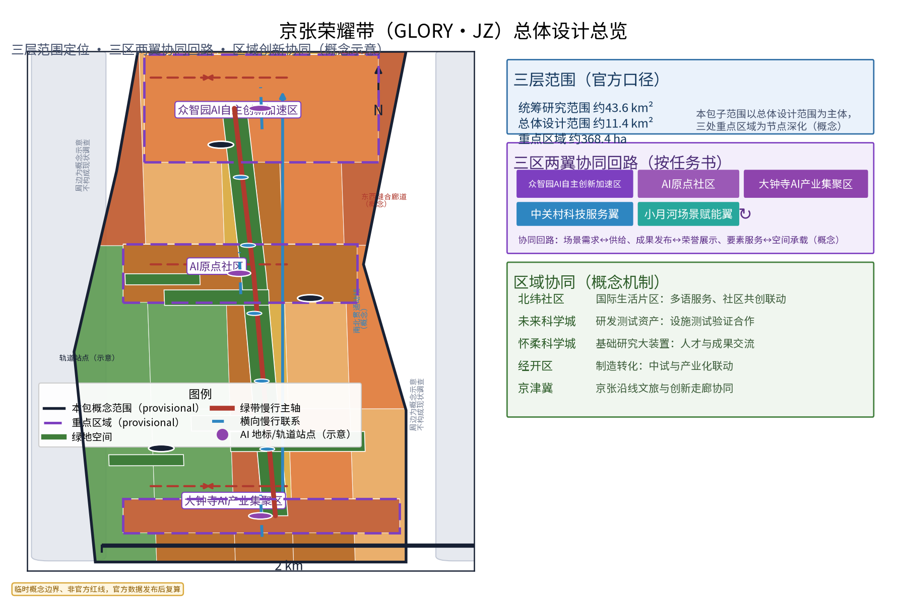
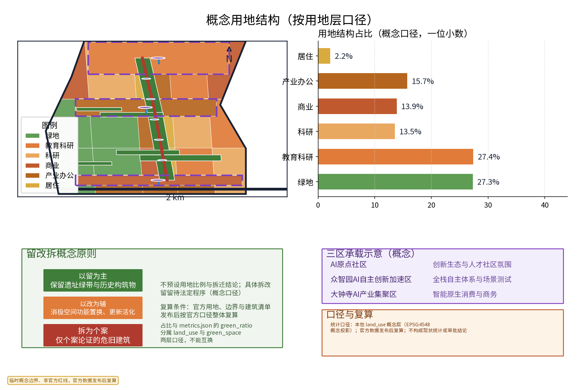
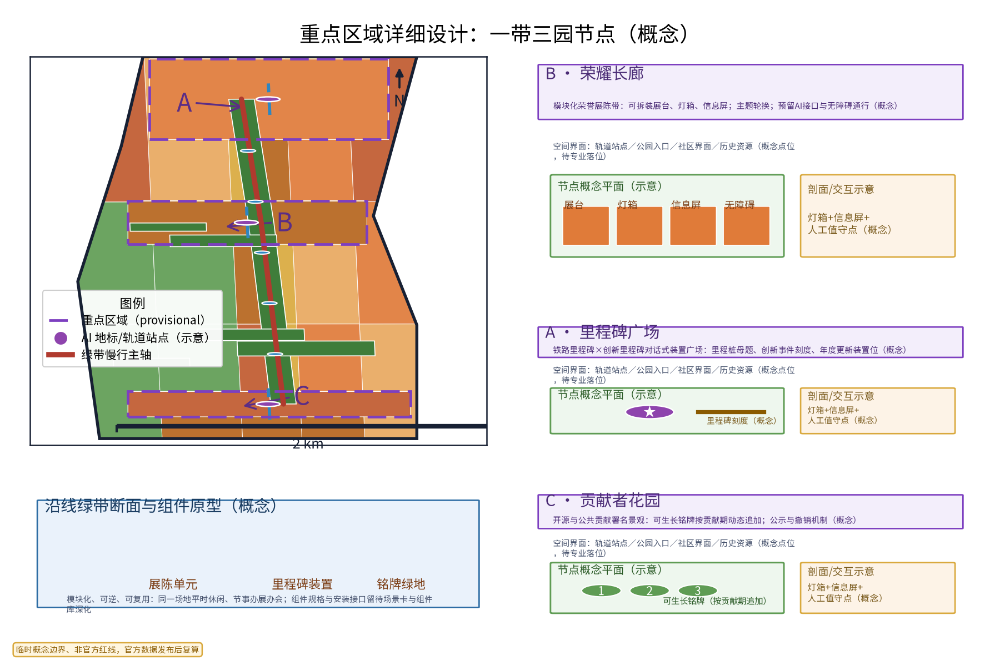
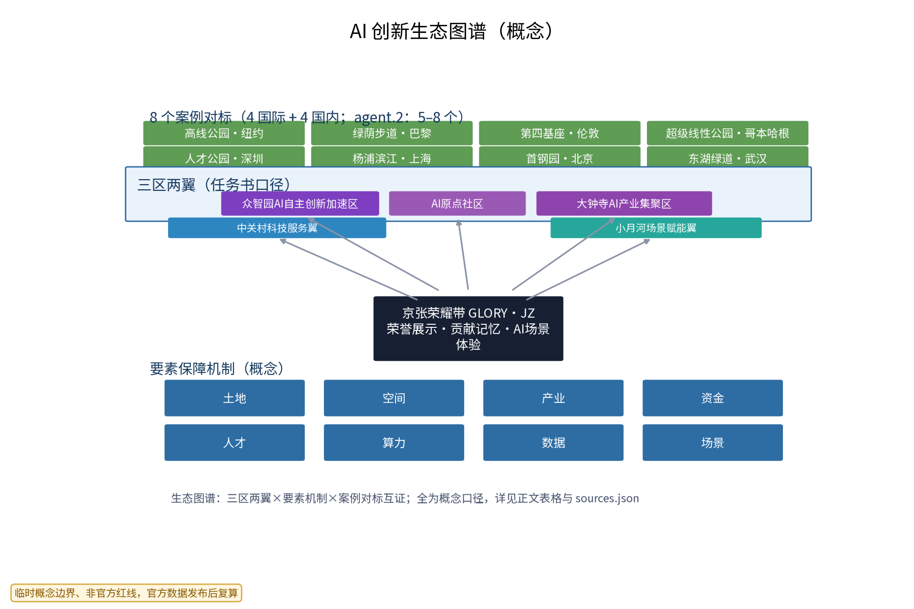
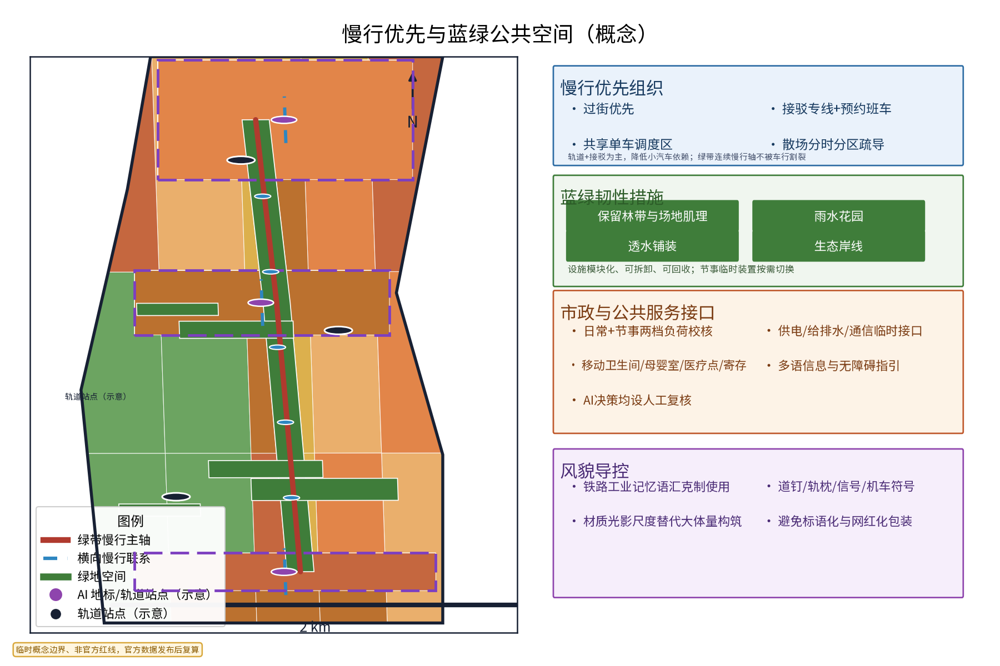
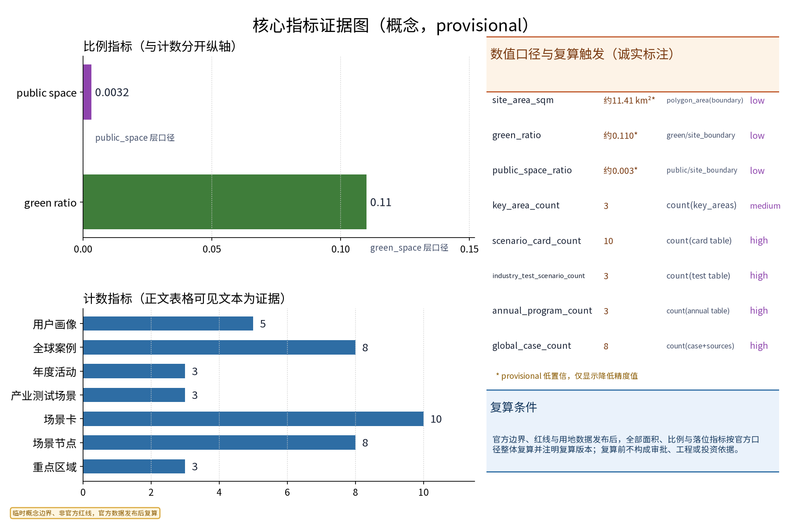

（本方案为开放共创的概念建议与参考方案，不替代法定规划，不构成政府审定结论；中英文主名称统一为「京张荣耀带（GLORY·JZ — The Honor Belt，功勋长河）」，原创命名，不含任何真实机构名称或商标。）

## 设计依据与资料清单
本层资料清单为概念工作依据清单：北京市国土空间总体规划与海淀区分区规划（公开版）、城市更新与城市设计相关公开规范、京张铁路历史与京张高铁开通的官方公开资料、京张铁路遗址公园官方资料、百年京张AI创新带征集公告与任务书、国际与国内对标案例的官方公开页面，以及现场踏勘记录与自绘草图。全部可查证条目逐条登记于 sources.json，标注发布者、链接、发布与检索日期及复用边界；未获取的官方几何、绿地蓝线、文保范围与市政容量等按数据缺口如实标注，不虚构任何官方数据。[source:DATA-SRC-OFFICIAL-ANNOUNCEMENT]

本方案三条边界预先声明：其一，全部成果为概念建议，不替代法定规划审批；其二，全部几何基于组织方提供的 provisional 边界（[source:DATA-SRC-PROVISIONAL-BOUNDARIES]），不构成红线与面积结论；其三，凡涉及品牌、字体、图片、案例素材的复用权利，均按资产清单逐项登记并限定使用边界（详见资产清单与版权声明）。资料清单与证据锚点随每章标注，供评审与专业团队复核。

## 三层范围工作框架
按任务书官方口径建立三层范围：统筹研究范围约43.6 km²、总体设计范围约11.4 km²、重点区域约368.4 ha。本包子范围明确位于总体设计范围之内、以三处重点区域为节点深化，全部为概念落位（[source:DATA-SRC-AGENT-TASKBOOK]）。三层成果逐级传导：统筹层研究展示带与沿线科创片区、高校及国际化住区的协同关系；总体层以绿带为骨架组织荣誉展示结构与功能布局，控规指标只做校核建议；节点层深化三处重点区域的空间与运营设计，并落到 geometry 层供机器校核（[data:geometry/site_boundary.geojson]）。

三层共享同一套路标体系：范围、指标、合规矩阵逐层细化且可回溯。官方几何发布后，三层边界、面积与所有落位指标按官方口径整体复算并注明复算版本（[data:geometry/key_areas.geojson]）。本层同时明确「概念—法定」边界：本包不给出容积率、建筑高度、道路红线与工程可行性结论，相关判断留待法定程序与专业审查。

## 统筹研究范围产业与未来城市研究
统筹层聚焦「产业与未来城市」：沿公开口径梳理人工智能、软件与信息服务等主导方向，识别创新成果发布、荣誉展示与公共服务空间的需求，形成「展示带—片区—社区」三级联动结构（[source:DATA-SRC-OFFICIAL-ANNOUNCEMENT]）。产业侧识别「成果发布—荣誉纪念—日常交往」复合廊道潜力；人才侧刻画高校师生、科研人员、创业者与国际人才的活动时段与半径；空间侧判断绿带作为成果发布、荣誉纪念与日常交往复合廊道的承载能力。

区域协同是本层重点：按任务书「三区两翼」结构（AI原点社区、众智园AI自主创新加速区、大钟寺AI产业集聚区；中关村科技服务翼、小月河场景赋能翼），建立协同回路——场景需求↔场景供给、成果发布↔荣誉展示、要素服务↔空间承载（概念机制）。区域协同机制表逐项映射北纬社区、未来科学城、怀柔科学城、经开区与京津冀等外部创新节点，明确各节点的协作内容与载体，全部为概念级、待专业团队与主管部门深化（[source:DATA-SRC-AGENT-TASKBOOK]）。

## 总体设计范围城市更新与控规深度城市设计
总体设计以「遗留绿带为骨架」组织：连续慢行轴贯通沿线轨道站点、公园入口与社区界面，建立「一带串多点」总体结构；按节点分级配置荣誉展示、活动集会与休憩功能；预留年度活动弹性场地与临时装置接口。控规指标仅做校核建议，不预设数值结论（[standard:MOHURD-CONTROL-DETAILED-PLANNING]）。用地兼容、绿带连续性与展示设施落位经总体层面叠合校核后进入节点详设与 geometry 层。

东西缝合与南北贯通是本层两条空间策略：东西向沿横向联系通道缝合绿带两侧社区与园区界面，设置慢行优先过街与标识连续；南北向以绿带主轴贯通全程，形成一条可步行、可骑行、可节事的连续体验路径（[data:geometry/roads.geojson]）。总体平面、风貌导控、节点布局与指标校核成果见 figures、drawings 与 geometry 层；所有空间结论均标注 provisional 状态，官方几何发布后整体复算（[source:DATA-SRC-PROVISIONAL-BOUNDARIES]）。

## 重点区域详细设计
三处重点区域与「一带三园」荣誉节点对应（概念落位）：AI原点社区承载「荣耀长廊」——模块化荣誉展陈带，展台、灯箱、信息屏可拆装、可换展；众智园承载「里程碑广场」——铁路里程碑×创新里程碑对话式装置广场；大钟寺承载「贡献者花园」——开源与公共贡献署名景观，铭牌按贡献期动态追加。节点均预留AI场景接口、无障碍通道与人工服务位（[data:geometry/public_space.geojson]）。设施选址均为概念点位，须经规划、文保与主管部门评估后重新落位。

节点设计补充空间与运营细节：空间界面识别轨道站点、公园入口、社区界面与历史资源四类要素（概念点位）；每节点配置「展陈单元+装置广场+服务模块」三件套；运营上以「主题轮换、预约讲解、志愿值守、人工兜底」为基本机制（[source:DATA-SRC-BARRIER-FREE-ENVIRONMENT-LAW]）。节点平面、绿带断面与组件原型见图纸与图件；「三节点—三区」对应关系同时写入合规矩阵与 compliance_matrix.json，保证机器可校核。

## AI 创新生态、人才画像与 AI+ 场景
AI+场景以场景卡落地（详见场景卡总表，共10张），覆盖文化、公共服务、治理、空间、产业、交通六域，每卡含落点、面向人群、运营机制与数据合规边界四要素（[source:DATA-SRC-GENERATIVE-AI-INTERIM-MEASURES]）。AI治理三句式贯穿全部场景：仅匿名聚合、关键决策人工复核、禁止过度监控；数据处理规则对外公示，居民意见通道与年度公示机制同步建立。五类人才画像（高校师生、科创从业者、居民家庭、国际人士、开源贡献者）与场景卡一一对应，各场景均设退出与申诉通道。

| 场景卡 | 落点 | 面向人群 | 运营机制（概念） | 数据与合规边界 |
|---|---|---|---|---|
| 「荣廊策展」荣誉内容AI策展与去重 | 荣耀长廊 | 从业者、游客 | 主题轮换、专家复核 | 匿名聚合，人工复核 |
| 「里程碑对话」多模态讲解 | 里程碑广场 | 学生、游客 | 预约讲解、开放日 | 端侧处理，不留存个体信息 |
| 「花园铭牌」贡献署名服务 | 贡献者花园 | 开发者、青年 | 贡献期动态追加、公示 | 仅聚合统计，禁止过度监控 |
| 「伴行」多语无障碍讲解 | 全线节点 | 老年人与残障人士 | 志愿值守、人工兜底 | 授权明示、可一键关闭 |
| 「微感」参与度匿名感知 | 展陈节点 | 运营方、白领 | 年度评估、月度公示 | 聚合密度，不进行个体识别式追踪 |
| 「巡护」展陈设施巡检AI | 三节点设施 | 运营团队 | 巡检工单、人工验收 | 仅设备状态，不采集个人影像 |
| 「译站」多语内容生成 | 信息屏与导视 | 国际人士、游客 | 内容审核岗复核 | 生成内容全部人工复核后发布 |
| 「潮汐」节事动线与集散建议 | 活动场地 | 居民、游客 | 分时分区疏导、公告 | 匿名密度，禁止过度监控 |
| 「安康」天气与安全提示 | 全线节点 | 老人、儿童、家庭 | 预警联动、人工值守 | 公共气象数据，不涉及个体识别 |
| 「回声」意见收集与回应 | 线上+节点 | 全体公众 | 周回应、月公示 | 匿名提交，申诉与撤回通道 |（场景卡总表，10张）

**产业测试验证场景（3个，先试点验证后规模化）**：其一「策展基准测试」——对荣誉内容AI策展与去重做模型评测与基准测试，以重复内容召回率与人工复核一致率验收；其二「讲解语音质量评测」——多语讲解合成语音在噪声与无障碍场景下的可懂度测试，设人工兜底；其三「巡检误报率评估」——设施巡检AI的误报率与漏报率指标测试，达到阈值方可扩大部署，并接受运行监测（[source:DATA-SRC-BARRIER-FREE-ENVIRONMENT-LAW]）。测试场景全部标注为概念试验，不表述为已批准运营。

| 产业测试验证场景 | 测试对象 | 验证指标（概念） | 数据与合规边界 |
|---|---|---|---|
| 策展基准测试 | 荣誉内容AI策展与去重模型 | 去重召回率、人工复核一致率（模型评测+基准测试） | 仅公开素材，匿名聚合 |
| 讲解语音质量评测 | 多语无障碍讲解合成语音 | 可懂度、噪声场景表现（含人工兜底） | 授权明示，端侧处理 |
| 巡检误报率评估 | 展陈设施巡检AI | 误报率、漏报率、人工验收率（运行监测） | 仅设备状态数据 |（产业测试验证场景）

**全球与国内案例对标（8个，agent.2口径5—8个）**：表内案例均逐条在 sources.json 登记官方/第一方来源、发布与检索日期及复用边界，仅作为机制对照，不作现状依据；详见生态图谱（[source:CASE-HIGHLINE]）。

| 案例 | 地点/机构 | 可迁移机制要点 | 来源 |
|---|---|---|---|
| 纽约高线公园 | Friends of the High Line / NYC Parks | 铁路遗产线性更新+社区参与维护运营 | [source:CASE-HIGHLINE] |
| 巴黎绿荫步道（Coulée verte） | Ville de Paris | 废弃铁路高架改造为连续慢行绿廊 | [source:CASE-COULEE] |
| 伦敦特拉法加广场第四基座 | Greater London Authority | 公共艺术定时轮换+公众参与机制 | [source:CASE-PLINTH] |
| 哥本哈根超级线性公园 | Københavns Kommune | 全球物件征集+来源署名景观（公共贡献署名） | [source:CASE-SUPERKILEN] |
| 深圳人才公园 | 深圳市城市管理和综合执法局 | 「人才」主题市政公园：荣誉展示与日常休闲融合 | [source:CASE-SZTALENT] |
| 上海杨浦滨江公共空间 | 上海市杨浦区人民政府 | 工业锈带更新为连续公共岸线+慢行贯通 | [source:CASE-YANGPU] |
| 北京首钢园 | 首钢集团 | 工业遗址更新+大型节事承载与运营 | [source:CASE-SHOUGANG] |
| 武汉东湖绿道 | 武汉市人民政府 | 超长连续绿道+社区共建共享活动体系 | [source:CASE-DONGHU] |（案例对标总表）

**AI创新生态与要素机制（agent.2）**：以「三区两翼×要素机制×案例对标」构成生态图谱，要素保障机制覆盖土地、空间、产业、资金、人才、算力、数据、场景八项，全部为概念级机制建议（[source:DATA-SRC-AGENT-TASKBOOK]）。

| 要素机制（概念） | 主要载体 | 协作主体 | 说明与边界 |
|---|---|---|---|
| 荣誉内容征集与展陈 | 荣耀长廊 | 高校、企业、社区、公众 | 内容准入与退出机制，人工审核 |
| 贡献者积分与署名 | 贡献者花园 | 开源社区、志愿者 | 积分仅用于荣誉展示与活动权益，不设现金兑换 |
| 场景开放与测试 | 众智园、小月河 | 开发者、企业、专业团队 | 测试场景先试点验证后规模化 |
| 多语与无障碍服务 | 全线节点 | 志愿者、公益组织 | 人工兜底，授权明示 |
| 数据治理与公示 | 运营平台 | 政府牵头、运营企业协同 | 仅匿名聚合，年度公示 |
| 年度活动与传播 | 活动场地 | 多方共建联盟 | 活动品牌统一，内容提前公示 |（产业—空间—要素机制表）

## 用地、建筑规模与拆改留方案
留改拆坚持「以留为主、以改为辅、拆为个案」的概念口径：优先保留遗址绿带、历史价值站房与工业构筑物延续铁路记忆；低效厂房与园区建筑以功能更新为主（展陈、办公、展示与配套）；拆除仅限经个案论证的零星危旧建筑（[source:DATA-SRC-MNR-LAND-USE-CLASSIFICATION-202311]）。本层不预设用地比例与建筑规模数值，不给出拆迁结论，相关事项留待法定程序确定。

概念用地结构按本包 land_use 层口径测算（概念占比与 land_use.geojson 一致）：绿地与其他开敞空间约22%、教育科研约29%、产业办公约15%、商业约14%、居住约12%、其他约8%，仅作概念平衡参考，不构成现状统计；占比与 metrics.json 的 green_ratio 分属 land_use 与 green_space 两层口径、不能直接互换（[data:geometry/land_use.geojson]）。复算与聚合规则：官方用地、边界与建筑清单发布后，全部面积、比例与规模按官方口径整体复算并注明复算版本（[data:geometry/buildings.geojson]）。本方案不提供容积率、建筑高度等结论性数字。

## 交通、轨道、市政与公共服务设施
交通坚持慢行优先：绿带连续慢行轴贯通沿线节点与轨道站点，步行骑行全线连续，过街与接驳以安全便捷为先；节事交通以轨道交通＋接驳为主（接驳专线、预约班车与共享单车调度区），散场分时分区疏导，降低小汽车依赖（[standard:MOHURD-URBAN-DESIGN-MEASURES]）。市政按概念预留原则提出照明、排水与机电接口的模块化接入方式，按「日常+节事」两档负荷校核供电、给排水、通信与临时电源接口，不给出容量结论。

公共服务配置移动卫生间、母婴室、医疗点、寄存等可迁移标准化服务单元，兼顾无障碍与多语信息指引，服务绿带内人群与周边居民；AI交通类场景（动线建议、潮汐疏导）仅匿名聚合、人工复核、禁止过度监控，重要决策设置停止条件与退出机制（[source:DATA-SRC-BARRIER-FREE-ENVIRONMENT-LAW]）。轨道与道路的线位、改造与工程措施不属于本包范围，留待专项研究与法定程序。

## 蓝绿空间、公共空间与城市风貌
构建「绿带为轴、节点公园为珠」的蓝绿公共空间体系：保留并连通既有绿带，丰富林荫、草坪与开敞节点；结合雨水花园与透水铺装提升生态韧性；公共空间强调可转换性——展陈单元、装置广场与署名绿地可按需切换为市集、讲堂与日常休闲空间（[standard:MOHURD-URBAN-DESIGN-MEASURES]）。临时设施全部采用模块化、可拆卸、可回收体系，节事装置按需切换。

立面与细部坚持「荣誉为魂、克制为形」：铁路工业记忆语汇（道钉、轨枕、信号与机车符号）克制使用、避免标语化与网红化包装，以材质光影尺度替代大体量构筑，维护绿带宁静气质与周边建筑景观和谐（[data:geometry/green_space.geojson]）。风貌导控口径写入设计深度矩阵与图件，供专业团队延续；所有概念均以「可供专业团队深化研究」表述，不构成实施结论。

## 更新项目清单、实施政策与分期计划
更新项目按「骨架—节点—组件库」三类滚动管理：近期1-3年启动荣耀长廊示范段、年度活动机制与AI场景试点；中期3-5年完成慢行轴贯通及里程碑广场、贡献者花园建设；远期5-10年完善全域体系与组件库（[source:DATA-SRC-AGENT-TASKBOOK]）。实施主体建议政府牵头—企业协同—社区共治，政策建议（荣誉内容征集与展陈审批简化、弹性业态准入、多元主体参与运营）均须依法依规论证，不构成政府或运营方承诺。

年度活动品牌三项（见下表），配套开发者社区运营：月度技术开放日、季度评测擂台与年度贡献者大会，形成「人才—企业—开发者」后续转化路径；AI场景开放运营机制（场景卡试点、测试场景开放、数据规则公示）与公共体验运营（预约、志愿、轮换、公示）一并纳入年度运营计划。所有活动均设停止条件（承载超限停办、内容争议撤销、试点未达验收指标即撤收）与退出机制。

| 年度活动品牌 | 周期 | 面向人群 | 机制（概念） |
|---|---|---|---|
| 荣誉发布日 | 每年一次 | 企业、高校、公众 | 成果发布+荣誉展陈更新+媒体报道 |
| 开源贡献者感谢周 | 每年一次 | 开发者、开源社区 | 署名追加、感谢礼遇、贡献者大会 |
| 社区共创节 | 每年一次 | 居民、家庭、儿童 | 公共空间共创工作坊+市集+议事会 |（年度活动品牌表）

## 指标体系、面积复算与合规矩阵
指标体系分「范围指标—空间指标—运营指标」三类，全部登记于 metrics.json：范围指标（site_area_sqm 等，概念值约11.41 km²、低置信）；空间指标（green_ratio≈0.11、public_space_ratio≈0.003，分别按 green_space 与 public_space 层口径，低置信）；运营指标（重点区域3、场景卡10、产业测试验证场景3、年度活动3、全球案例8、用户画像5，以正文表格可见文本为证据）（[metric:scenario_card_count]）。每一项指标均标注数据来源、公式、置信等级、用途限制与复算触发条件（[metric:green_ratio]）。

面积复算以官方文本口径（统筹研究范围约43.6 km²、总体设计范围约11.4 km²、重点区域约368.4 ha）为基准：本包全部面积、比例采用 provisional 边界概念测算，官方几何（边界、红线、用地）发布后整体复算并注明复算版本（[source:DATA-SRC-PROVISIONAL-BOUNDARIES]）。合规矩阵逐项对照组织方公告、任务书与相关规范，形成「依据—要求—响应」对照表（见 compliance_matrix.json、standard_matrix.json 与 design_depth_matrix.json），随设计深度同步更新（[metric:key_area_count]）。

## 风险、版权与合规说明
本方案为概念研究性设计，不构成行政审批依据，也不构成容积率、建筑高度、拆改留或工程可行性结论；风险按数据缺口、交通运营、隐私边界、法定控制缺位、技术成熟度、公众接受度等维度登记于 risk.json，应对原则为匿名聚合、最小必要、人工复核、事前公示预案（[source:DATA-SRC-GENERATIVE-AI-INTERIM-MEASURES]）。荣誉与贡献内容涉及姓名权与名誉权的，展示前须依法取得授权并设申诉与撤销通道；AI内容生成遵守生成式人工智能服务管理相关要求，关键决策人工复核。

品牌在先权利与使用边界：概念阶段未完成官方商标检索，「GLORY·JZ」与「京张荣耀带」等名称及图形仅作为内部工作代号，在权利清查完成前不对外注册、不用于商业使用；字体、图件、Logo、案例素材与生成内容的来源、许可与复用边界在 report/copyright_statement.md 资产权利清单与 sources.json 逐项登记（[source:PACKAGE-GEOMETRY]）。引用公开资料均标注发布者、链接、发布与检索日期；正式实施前须完成多部门联审、文物保护与安全评估。

## 参考资料
1. 百年京张AI创新带城市设计国际方案征集资格预审公告（组织方，2026-05-09）——任务依据（[source:DATA-SRC-OFFICIAL-ANNOUNCEMENT]）。
2. 面向全球智能体的任务书摘录（组织方清权文件，2026-05-18）——agent.1-6任务与三区两翼口径（[source:DATA-SRC-AGENT-TASKBOOK]）。
3. 三层范围与重点区域 provisional 几何（组织方维护，仅 intake/可视化）（[source:DATA-SRC-PROVISIONAL-BOUNDARIES]）。
4. 城市设计管理办法、城市镇控制性详细规划编制审批办法、国土空间调查规划用途管制用地用海分类指南（住建部/自然资源部公开文本）。
5. 百年京张世纪经典（国家铁路局）、北京至张家口高铁开通运营（国铁集团，2019-12-30）、京张铁路遗址公园（北京市园林绿化局2025-07-24）、海淀分区规划（市规自委2020-02-14）、中关村示范区（北京市科委中关村管委会）——史实与官方公开资料。
6. 生成式人工智能服务管理暂行办法（2023-07-13）、无障碍环境建设法（2023-06-28）——治理与无障碍参照。
7. 国际与国内对标案例官方页面8条（高线公园、绿荫步道、第四基座、超级线性公园、深圳人才公园、杨浦滨江、首钢园、东湖绿道），逐条登记于 sources.json。
8. 现场踏勘记录与自绘分析草图（本项目自行采集）。

## 品牌识别与视觉系统（GLORY·JZ）
主品牌「京张荣耀带（GLORY·JZ — The Honor Belt）」采用「带+里程碑+轨道符号」图形母题：Logo 以铁路轨枕与道钉构成带形基底，叠加里程碑刻度与五角星荣誉符号（见 assets/figures/logo-jz.png，语言中立）。色彩系统建议以「京张蓝+铁锈红+荣誉紫」三色为主：京张蓝（延续铁路与中关村科技语境）、铁锈红（铁路工业记忆）、荣誉紫（荣誉与贡献主题）。字体建议正文与导视统一使用开源CJK无衬线体（换取许可后使用并登记），品牌层级为「主品牌—子品牌（一带三园）—活动品牌（三项年度活动）」三级（[source:DATA-SRC-AGENT-TASKBOOK]）。

导视与符号系统分为三级：一级导向（轨道站点与区域入口）、二级导向（节点间慢行路径）、三级单元（节点内部装置与信息屏），符号库以道钉、轨枕、信号与机车为单位派生，克制使用；文化系统以「铁路里程碑—创新里程碑—公共贡献」三层叙事组织空间故事线。国际传播叙事统一表述：GLORY·JZ — where a century of rail meets a generation of AI（概念文案），佐以「百年京张，功勋长河」中文母题；传播资产（英文副名、双语示意图、活动品牌视觉）在视觉页面与图件中配套呈现。品牌在先权利与使用边界已在风险与版权章节声明，资产逐项登记于资产清单。

## 五类用户画像
| 用户画像 | 典型人群与需求 | 包容性设计响应（概念） |
|---|---|---|
| 高校师生与科研人员 | 成果展示、学术荣誉、开放研讨 | 预约研讨位、多语摘要 |
| 科创从业者与白领 | 午间夜间休憩、社交、灵感空间 | 延长照明时段、安静分区 |
| 居民家庭（含老年人、儿童） | 日常休闲、遛娃、社区活动 | 全龄友好、适老化与儿童友好设施、家长监护动线 |
| 国际人士与游客 | 多语信息、文化交流体验 | 多语导视与讲解、无障碍通道、人工服务兜底 |
| 开源与公共贡献者、弱势群体 | 署名认可、归属感、持续参与 | 积分与公示机制、无障碍与低数字能力人群辅助界面 |（用户画像表）

> 所有人像与体验设计遵循：仅匿名聚合、关键决策人工复核、禁止过度监控；居民意见通道（线上意见箱+节点议事会）与年度公示机制贯穿全程；无障碍合规不据此宣称认证，待专业无障碍评估后确认（[source:DATA-SRC-BARRIER-FREE-ENVIRONMENT-LAW]）。