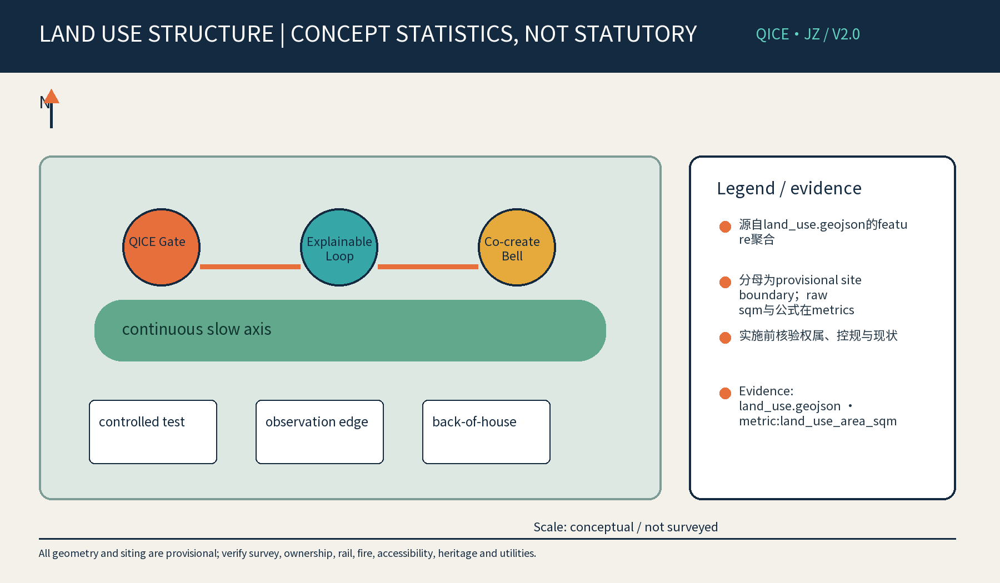
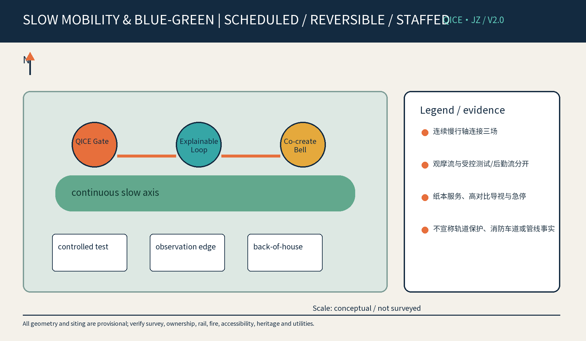

This proposal deepens the idea of an AI scenario-card, public validation-space and annual-open-event loop into “one belt, three venues.” A card connects a user problem, a spatial touchpoint, a test protocol and evidence. All spatial suggestions are concept proposals on provisional geometry. They do not assert a site condition, official boundary, heritage asset, ownership, road line, approval or operating partnership. Missing survey, ownership, rail, fire, accessibility, utility, heritage and visitor-flow evidence remains a data gap.

## Design Basis and Source List

Design intent: use the brief’s three positions, five functions, three areas, two wings and agent.1–6 outputs to build a traceable chain: write a card, place it in a space, review it, stop it safely and hand it over. The geometry layers are participant-authored conceptual layers; they are not surveys or statutory controls. Public sources and standards are methods and boundary references only. Every claim is tied to source, standard, depth, data and metric anchors. [source:DATA-SRC-OFFICIAL-ANNOUNCEMENT-20260509] [standard:PROJECT-AGENT-OPEN-CALL-TASKBOOK] [depth:existing_conditions_diagnosis] [data:DATA-GAP-SITE-FACTS] [metric:site_area_sqm]

## Three-Level Scope Framework

Level 1 connects Qinghe–Shangdi–Zhongguancun and unconfirmed regional interfaces; Level 2 connects the green corridor, three venues, streets/stations and three areas/two wings; Level 3 specifies reversible components, scenario cards and testing interfaces. Gates are G0 public-source screening, G1 survey/ownership/safety evidence, G2 low-risk small sample, and G3 human-reviewed expansion. A failed gate means stop, remove the exhibit or return to paper service. [source:DATA-SRC-PROVISIONAL-BOUNDARIES-20260605] [standard:MOHURB-URBAN-DESIGN-MEASURES] [depth:three_level_scope_framework] [data:DATA-GAP-OFFICIAL-CONTROLS] [metric:scenario_card_count]

## Coordinated Research Area: Industry and Future City Research

The response matrix is spatial, industrial and operational, but every interface is pending confirmation:

|Position/function|Spatial carrier|Mechanism and output|Operator/measure|Boundary|
|---|---|---|---|---|
|Jingzhang culture belt / public explanation|Narrative interface and verified resource points|Rights-checked captions and methods|Curator/community operator; traceability and complaints|Heritage and ownership pending|
|Urban AI life belt / active city|Workshop, paper service and observation points|Low-risk public experience, no individual identification|Community/park operator; completion and accessibility|Facilities and flows pending|
|AI innovation belt / autonomous innovation|Embodied and model validation venues|Application, review, anonymized aggregate, human release|Test operator/evaluator; tests and stops|No partnership assumed|
|World AI ecosystem|Zhongzhiyuan interface and two wings|Land, space, industry, funding, talent, compute, data, scenario|Typed institutions; response time|External interfaces pending|
|Global AI governance|Evaluation venue, honors wall, annual review|Methods and failures, no individual ranking|Review committee; review and appeal time|Not a regulatory certification|

Regional interface matrix: Beiwai Community, Future Science City, Huairou Science City, E-Town and Jing-Jin-Ji are proposed interfaces only. Each must confirm a contact, space, data authorization, safety rule and agreement before any exchange. Possible inputs are needs, methods and schema; outputs are anonymized aggregates, reproducible records or paper feedback. No cooperation is claimed. [source:DATA-SRC-AGENT-TASKBOOK-20260518] [standard:PROJECT-AGENT-OPEN-CALL-TASKBOOK] [depth:overall_spatial_structure] [data:DATA-GAP-REGIONAL-INTERFACES] [metric:industry_protocol_count]

## Overall Design Area: Urban Renewal and Regulatory-Plan-Level Urban Design

The concept is a continuous slow-mobility axis plus three venues and five interface types. Streets, stations and surrounding communities are context, not red lines. Public, observer, test, back-of-house and emergency flows are separated by time or reversible barriers. Each venue requires a verified entrance, accessible path, observation distance, safety buffer, storage, temporary power, emergency access and wet-weather shutdown point. These are professional review conditions, not completed facilities.

## Detailed Design of Key Areas

The three venues are concept units: the embodied field has a controlled test surface, observer edge, back-of-house access and physical emergency stop; the evaluation court has an explainable display, reviewer worktable, version log and paper results cabinet; the workshop has accessible tables, paper cards, staffed help and storage. Operators are typed roles. Prerequisites are survey, ownership, safety and insurance review. Maintenance is daily/event inspection, takedown and deletion. Stop actions are power-off, removal, closure, deletion and complaint escalation. Handover includes equipment, logs, deletion proof, maintenance and complaint records. The KEY-ZHON, KEY-BEIJ and KEY-DAZH polygons remain rough and provisional. [data:PACKAGE-GEOMETRY] [standard:PROJECT-OFFICIAL-ANNOUNCEMENT] [depth:three_key_area_detailed_design] [data:DATA-GAP-NODE-SITING] [metric:landmark_count]

## AI Innovation Ecosystem, Personas, and AI+ Scenarios

The eight-element ecosystem is land, space, industry, funding, talent, compute, data and scenarios. Its loop is application → small sample → human review → controlled opening → evaluation → annual review → conversion or exit. Generative AI is limited to drafting card language, version comparison and explainable summaries. It is not used for identity recognition, automatic release, approval, safety adjudication or fact generation.

Six first-party case references are used for mechanism comparison only: Mcity, AstaZero, CETRAN, GoMentum Station, the UK National Digital Twin programme and MIT Living Lab. URLs, dates and use boundaries are recorded in sources.json; no partnership is implied.

The twelve cards use the same fields: user/problem, input/source, AI or rule, spatial touchpoint, operator, human review, baseline/sample/window, success formula, error groups, privacy/retention, paper fallback, complaint and exit.

|ID|User/problem|Input → AI/rule → space|Baseline, review, threshold and stop|
|---|---|---|---|
|SC-01|Resident repair priority|Paper themes → rule clustering → workshop|Human sample; four-week window; suggested confirmation ≥90%; delete on leak|
|SC-02|Older adult wayfinding|Staff query → explainable path ranking → slow axis|Escorted baseline; 20 trips; suggested completion ≥85%; switch to staff|
|SC-03|Disabled visitor booking|Staff needs → time-slot rule → workshop|No digital requirement; accessibility check; complaint stops use|
|SC-04|Caregiver safe stay|Public time/weather → capacity rule → observation edge|Staff controls; drill-defined threshold; close when exceeded|
|SC-05|Temporary visitor translation|Authorized text → retrieval summary → caption|Curator review; weekly sample; remove any mistranslation|
|SC-06|Researcher card version|Need card → generative draft/diff → workshop|Author confirms; traceability required; untraceable card unpublished|
|SC-07|Robot path test|Controlled aggregate sensors → rule/model → embodied field|Human lead baseline; 20 controlled runs; zero boundary crossings; physical stop|
|SC-08|Model explainability|Authorized tasks → metrics/confidence → evaluation court|Human score baseline; ≥30 per class suggested; no release without expert review|
|SC-09|Visitor flow|Reservation count → capacity rule → observer edge|Manual count baseline; close at capacity; no person tracking|
|SC-10|Content safety prompt|Submission → non-decisive prompt → workshop|Two-person review; appeal; uncertain content stays unpublished|
|SC-11|Developer schema|Field allowlist → schema check → developer table|Data steward review; extra fields rejected and deleted|
|SC-12|Annual review|Aggregate logs/complaints → error groups → review wall|Committee sign-off; fairness deterioration removes the card|

Three industry protocols: T1 tests a mobile robot in the controlled field using speed, trajectory, obstacle class and weather, outputting boundary crossing, emergency stop and completion. Human leading is the baseline; 20 runs are a small-sample proposal; groups are weather, obstacle and time; the safety officer can take manual control; crossing or sensor failure exits. T2 evaluates a text/multimodal model in the court using an authorized task set, version and prompt class, outputting accuracy, refusal, explanation consistency and confidence intervals. Human scoring is the baseline; group by language and difficulty; experts review; personal data or unexplained output is deleted. T3 co-creates cards in the workshop using problem, place type, role, constraint and authorization, outputting a versioned card, spatial interface and metric. A two-reviewer pass rate of 90% is a pilot suggestion; group by user, language and digital ability; paper records are the fallback; no authorization or unresolved complaint means no opening. All protocols require minimization, re-identification testing, retention/deletion proof, access logs, appeal and accident responsibility. These are participant proposals, not official standards. [source:DATA-SRC-GENERATIVE-AI-INTERIM-MEASURES] [standard:PROJECT-AGENT-OPEN-CALL-TASKBOOK] [depth:three_key_area_detailed_design] [data:DATA-GAP-TEST-SAMPLES] [metric:scenario_card_count]

## Land Use, Building Scale, and Retain-Renovate-Demolish Strategy

No statutory land-use, FAR, height or demolition/retention conclusion is made. Land-use areas are aggregated from geometry features, divided by the calculated site boundary, reported with raw sqm, formula, confidence and rounded display. Green and public-space ratios are provisional reproducible metrics, not planning targets. Existing space may be prioritized only after survey, ownership, heritage, fire, structure and rail review. Unsupported labels such as “old industrial buildings” or “retained railway industrial heritage” are not treated as facts; use “existing space or linear cultural resource to be prioritized for renovation/protection after survey confirmation.” [source:DATA-SRC-MNR-LAND-USE-CLASSIFICATION-202311] [standard:MNR-LAND-USE-CLASSIFICATION-GUIDE] [depth:retain_renovate_demolish] [data:DATA-GAP-EXISTING-BUILDINGS] [metric:land_use_area_sqm]

## Transport, Rail, Municipal Infrastructure, and Public Services

Slow mobility, scheduled testing and staff guidance are the default. Rail protection, entrances, fire lanes, utilities and temporary electricity require confirmation. Paper cards, phone/staff registration, multilingual captions, high contrast, tactile and staffed help are non-digital alternatives. Accessibility acceptance should check continuous paths, reachable tables, rest/turning areas, readable type, audio/visual cues and staff response; exact values follow professional site measurement. [source:DATA-SRC-MOHURB-URBAN-DESIGN-MEASURES] [standard:MOHURB-URBAN-DESIGN-MEASURES] [depth:traffic_rail_slow_parking] [data:DATA-GAP-TRANSIT-UTILITIES] [metric:accessible_service_completion]

## Blue-Green Network, Public Space, and Urban Character

The component library includes removable card rails, rain cover, movable barriers, low-glare wayfinding, paper service cabinets, accessible tables, emergency-stop signs and recyclable panels. Three original landmark concepts are QICE Gate, Explainable Loop and Co-create Bell. Honors are for card authors, safety stewards, public contributors and replication partners; they are not official certification. The visual system uses ink blue, rail orange, validation cyan and paper white, with a continuous-track and square-card motif. The font and rights boundary are recorded in the ledger. [source:DATA-SRC-MOHURB-URBAN-DESIGN-MEASURES] [standard:MOHURB-URBAN-DESIGN-MEASURES] [depth:blue_green_public_space] [data:DATA-GAP-CULTURAL-ASSETS] [metric:public_space_component_count]

## Renewal Projects, Implementation Policy, and Phasing

Phase 0 verifies survey, ownership, rail, fire, heritage, accessibility and visitor-flow conditions; Phase 1 runs paper cards, captions and T3; Phase 2 runs scheduled T1/T2 with observation and safety drills; Phase 3 maintains annual open season, developer community and honors wall. Operators are typed roles; resources are professional services, reversible components, safety equipment and approved digital services. A failed gate removes the exhibit or returns to paper service. Handover includes versions, devices, logs, deletion proof, maintenance and complaint records.

Long-term operation uses an open application with user, problem, input, minimization, space, baseline, window, metric, human review, exit and responsibility. A quarterly schema clinic supports developers; annual review publishes aggregates, failures and deletion proof. Enterprise and talent conversion requires voluntary agreements and professional review. Funding, talent, compute and specialist services are external interfaces, not secured resources. [source:DATA-SRC-AGENT-TASKBOOK-20260518] [standard:PROJECT-AGENT-OPEN-CALL-TASKBOOK] [depth:phasing_implementation] [data:DATA-GAP-OPERATORS-FUNDING] [metric:annual_program_count]

## Metrics, Area Recalculation, and Compliance Matrix

site_area_sqm = area(site_boundary); green_ratio = union(green_space)/site_area; public_space_ratio = union(public_space)/site_area. Each is provisional, reproducible from geometry and has a trigger for recomputation when official geometry arrives. Land-use areas and ratios are separate displays. Process counts are 12 cards, 3 protocols, 8 personas, 3 venues, 3 landmarks, 6 global cases and 3 phases; they are concept counts, not performance promises. The compliance matrix covers minimization, anonymization, re-identification tests, retention/deletion, access logs, third-party devices, model bias, human judgment, appeals, accident responsibility, accessibility, fire/rail/heritage/ownership review and asset permissions. [source:PACKAGE-GEOMETRY] [standard:PROJECT-OFFICIAL-ANNOUNCEMENT] [depth:metrics_recalculation] [data:DATA-GAP-METRIC-VALIDATION] [metric:scenario_card_count]

## Risk, Copyright, and Compliance

This is not an approval, government commitment, official partnership, existing-condition proof or safety certification. AI uses only minimum, anonymized aggregates; no face or individual trajectory identification, automatic safety judgment or fact generation. Each pilot requires a re-identification attack test, deletion proof, access audit, error groups, human review, appeal and accident responsibility. Robots require a physical stop. Copyright is asset-level: QICE·JZ and the three landmark names are original concept proposals; the local redistributable Noto Sans SC font is used under its license; figures are self-drawn deterministic outputs; geometry is participant-authored conceptual geometry; external cases are cited, not copied. The ledger records author/method, date, URL, license, allowed/prohibited use and pending verification. Citation does not grant reuse permission. [source:DATA-SRC-OFFICIAL-ANNOUNCEMENT-20260509] [standard:PROJECT-OFFICIAL-ANNOUNCEMENT] [depth:risk_missing_data] [data:DATA-GAP-RIGHTS-AND-LIABILITY] [metric:complaint_close_rate]

## References

Sources.json contains auditable task, method, standards and first-party case references with dates and use boundaries. No site fact, ownership, heritage asset, partnership or investment is inferred from them. The 13 fixed sections map to agent.1–6; figures, HTML and A0/A3 share IDs, numbers, provisional warnings and data gaps. [source:DATA-SRC-AGENT-TASKBOOK-20260518] [standard:PROJECT-OFFICIAL-ANNOUNCEMENT] [depth:reference_traceability] [data:DATA-GAP-SOURCE-ACCESS] [metric:source_count]
