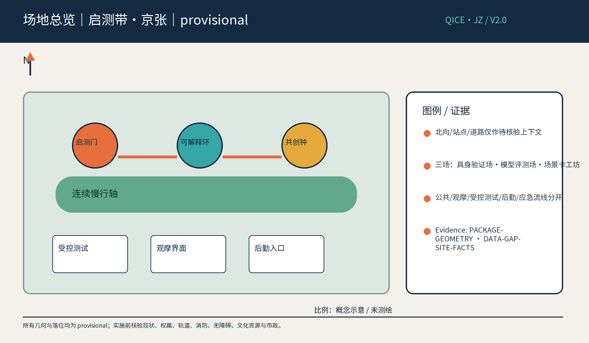
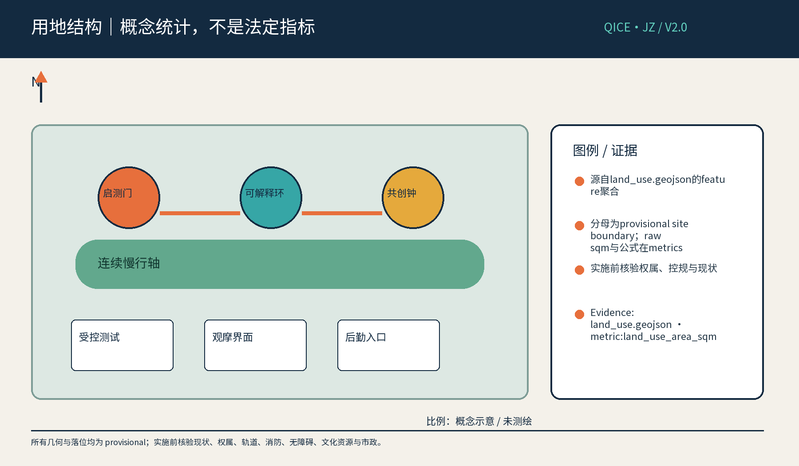
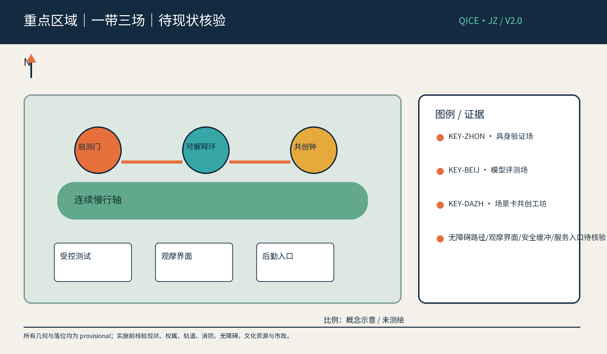

本稿为概念建议稿，全部内容基于公开资料口径，行文克制，不编造官方数据，不给出容积率、建筑高度、拆改留与工程可行性结论，不把测试场景写成已批准运营。

## 设计依据与资料清单
资料清单所列公开史料、规划报道与通则规范等均为概念工作依据清单，并非本包已获取的数据；本包实际使用的全部数据见 sources.json，未获取项已在风险与缺失数据说明中如实标注。

本章节以公开资料为限：京张铁路历史与遗址公园公开信息、中关村科学城及沿线片区公开规划表述、沿线高校与软件园、科创园区公开资料、《个人信息保护法》《数据安全法》及生成式人工智能服务管理相关公开规定、国家与北京市人工智能政策公开文本。资料清单随方案附列条目与出处；凡无公开依据的内容，一律以"建议""概念"表述，不引用内部文件、不虚构官方数据。

> **证据锚点**：[source:DATA-SRC-OFFICIAL-ANNOUNCEMENT-20260509]、[source:DATA-SRC-AGENT-TASKBOOK-20260518]（组织方公告与任务书为文本口径依据）。

## 三层范围工作框架
三层成果逐级传导：统筹研究输出的场景带与沿线片区协同判断约束总体设计，总体设计校核的测试场地落位、慢行贯通与分时开放机制再落实到节点详设；每层均保留与任务书对应章节的机器可读证据锚点，便于评审对照。

工作框架自外向内设三个层次：统筹研究范围为第一层，聚焦产业与未来城市协同；总体设计范围为第二层，落位城市更新与控规深度城市设计；重点区域详细设计为第三层，深化三个原创节点。三层逐级聚焦、互为校核，成果深度与汇报层级相对应，保证概念方案"由面到点"逻辑完整，并为后续深化预留接口。

> **证据锚点**：[source:DATA-SRC-AGENT-TASKBOOK-20260518]（三层范围划分依据任务书官方文本口径）。

## 统筹研究范围产业与未来城市研究
产业与城市研究识别场景带的「验证」效应：以测试验证与场景共创活动将沿线高校、软件园与科创片区的技术需求有序组织为双向可达的公共实验界面，形成「场景带—高校与园区—国际化住区」三级联动结构；未来城市研究仅作方向性预判，不构成对用地与投资的承诺。

统筹研究聚焦场景带与沿线高校、科创片区及国际化住区的协同关系：高校提供研究需求、试验方法与青年人才；软件园与科创园区提供企业主体与应用场景；国际化住区提供多元用户样本与生活场景视角。场景卡作为三方协同的公共接口，形成"需求—供给—验证"闭环的研究框架，从未来城市视角论证场景带的功能定位与产业外溢方向。

> **证据锚点**：[source:DATA-SRC-PROVISIONAL-BOUNDARIES-20260605]（边界为 provisional，研究范围仅作概念示意）。

## 总体设计范围城市更新与控规深度城市设计
总体设计强调「以绿带为骨架的场景验证序列」：依托京张铁路遗址公园绿带连续布置场景卡展廊、测试验证节点与共创驿站，使同一片场地平时可观摩研习、节事可办测试开放周；强调更新而非新建，优先利用存量空间植入测试功能；对控规指标只做校核建议，不预设数值结论。

总体设计以绿带为骨架组织场景带：连续慢行轴贯通各节点，测试设施与遗址公园、绿地复合布局，形成"可观摩、可参与、可验证"的空间序列。设计以留改拆并举为概念口径，提出风貌控制、界面引导与设施置入建议；与控规深度衔接时给出方向性控制引导，不预设容积率、建筑高度等数值，也不对具体地块作拆改留结论。

> **证据锚点**：[source:DATA-SRC-MOHURD-CONTROL-DETAILED-PLANNING]、[source:DATA-SRC-PROVISIONAL-BOUNDARIES-20260605]。

## 重点区域详细设计
三节点的设施选址均为概念点位，须经规划、文保与主管部门评估及专业审查后重新落位；节点间的绿带动线与慢行通道构成完整场景动线，详细平面与剖面以图册与 geometry 层表达。

设三个原创节点：其一"具身智能验证场"，为户外受控验证环境，含围合测试区、观察廊与分级开放机制，供机器人、无人车等在受控条件下验证；其二"大模型评测场"，为公开可解释的匿名化能力评测展示空间，任务可观看、过程可留痕、结果匿名公开；其三"场景卡共创工坊"，供公众与产业共同编写、张贴、迭代场景卡。三节点均为概念建议，不视为已批准运营的设施。

> **证据锚点**：[data:PACKAGE-GEOMETRY]（三节点示意多边形来自本包 geometry/key_areas.geojson）。

## AI 创新生态、人才画像与 AI+ 场景
场景卡AI辅助生成与版本管理、测试数据匿名采集与合规脱敏、评测过程可解释记录AI为主干场景，每处均配置人工复核兜底；测试预约与秩序调度AI、内容与安全告警复核为支撑场景；仅处理匿名聚合数据、关键决策人工复核双保险，不设过度监控，不把未成熟技术写成已可全面部署。
配套五项AI+场景：场景卡AI辅助生成与版本管理、测试数据匿名采集与合规脱敏、评测过程可解释记录AI、测试预约与秩序调度AI、内容与安全告警人工复核。全部采用匿名聚合加人工复核机制，禁止过度监控；对尚不成熟的技术仅作方向性描述，不表述为已可全面部署。人才画像设五类（见附录），支撑场景与空间的匹配设计。

> **证据锚点**：[source:DATA-SRC-GENERATIVE-AI-INTERIM-MEASURES]（AI 生成内容治理表述的参照依据）。

## 用地、建筑规模与拆改留方案
拆改留坚持留改拆并举：以留为主保留遗址公园肌理与沿线建成环境，存量建筑功能置换为测试、研习与配套服务，拆除仅限经个案论证的局部疏通慢行零星建筑；全部面积为概念口径，官方数据发布后复算。

本层采取留改拆并举的概念口径：以现状评估为前提，按"评估—判定—实施"流程提出建议，不预设任何数值，也不对具体地块给出拆改留结论。新增设施以轻量、可逆、临时性优先，多用装配式与可移动装置；既有建筑以功能置换与微更新为主，控制建设规模，为后续合法合规程序留足空间。

> **证据锚点**：[source:DATA-SRC-MNR-LAND-USE-CLASSIFICATION-202311]（用地分类名称参照现行国标口径）。

## 交通、轨道、市政与公共服务设施
以交通慢行优先为核心组织交通概念机制：沿绿带构建连续慢行轴贯通具身智能验证场、大模型评测场与场景卡共创工坊，衔接沿线高校、园区与轨道站点（接驳以步行与骑行为主，预留接驳专线与共享单车调度区），测试人流与观摩流线分时组织、降低小汽车依赖；市政以集约共享为原则，优先利用现状设施条件，测试场地预留临时供电与围挡接口；公共服务配置无障碍与多语服务、观摩安全提示，AI决策均设人工复核。

交通以慢行优先为原则：绿带连续慢行轴贯通各节点，衔接既有轨道站点与公交走廊，不新增大规模道路工程建议。测试人流与观摩流线分时、分区组织，避免相互干扰。市政设施以集约共享为方向，建议配套管线与设施统筹布置；公共服务设施依托遗址公园既有服务补缺，不重复建设。

> **证据锚点**：[source:DATA-SRC-MOHURD-URBAN-DESIGN-MEASURES]（市政与慢行设计表述的方法参照）。

## 蓝绿空间、公共空间与城市风貌
构建「绿带为轴、节点公园为珠」的蓝绿公共空间体系：以遗址公园绿带为蓝绿骨架串联沿线小微绿地与开敞空间，形成连续生态与公共空间体系；测试装置与公园融合布置、宜轻宜透宜可逆，不遮挡历史遗迹与绿带视线，安全区与观摩区界限清晰；指示与解说系统统一克制；风貌延续铁路遗址历史特征与科创氛围的对话，避免符号堆砌与过度设计。

依托铁路遗址与绿带构建蓝绿公共空间体系，串联零星绿地与开放空间；测试装置与公园环境融合宜轻、宜可逆，鼓励可拆装、季节化布置。风貌整体克制，避免广告化与过度装饰；以统一标识与铺装语言识别场景带，营造低干扰、可停留、可对话的公共空间气质。

> **证据锚点**：[source:DATA-SRC-MOHURD-URBAN-DESIGN-MEASURES]（蓝绿空间组织的方法参照）。

## 更新项目清单、实施政策与分期计划
四类项目清单（测试验证节点/慢行贯通/存量植入/场景卡数字平台）为概念清单，规模与投资估算均为建议性表述；政策建议（测试准入与分时开放、多元主体共建、共创内容审核准入）均须依法依规论证，不构成政府或运营方承诺。

实施分近期（1—3年）、中期（3—5年）、远期（5—10年）三阶段：近期启动节点试点与场景卡机制，中期贯通慢行带、完善节点，远期实现常态化运营与全网协同。配套实施政策包括场景开放指南、数据合规指引、安全评估与容错机制。年度活动固定三项：场景卡开放征集季、AI产业测试开放周、年度场景评测日。

> **证据锚点**：[source:DATA-SRC-AGENT-TASKBOOK-20260518]（分期与实施条目对应任务书要求）。

## 指标体系、面积复算与合规矩阵
场景卡覆盖数、测试开放频次、共创参与人次、匿名化合规率、慢行贯通度五类概念指标体系进入 metrics.json；面积复算以官方文本口径为底，官方数据到位后整体复算并标注复算版本。

建议建立过程性指标体系，方向包括慢行可达性、观摩与参与人次、场景卡编制数、测试场次、平均单次参与时长及安全记录等，均以统计口径说明，不作达标承诺。面积复算以公开图纸与现状实测为基础展开，本概念阶段不预设结果。合规矩阵逐项对应数据、安全、知识产权、市容等法规条目，形成自检口径。

> **证据锚点**：[metric:green_ratio]、[metric:public_space_ratio]、[source:PACKAGE-GEOMETRY]。

## 风险、版权与合规说明
本方案为概念研究性设计，不构成行政审批依据，也不构成容积率、建筑高度、拆改留或工程可行性结论；风险已按测试与运营协调、测试数据边界、技术成熟度、公众接受度四维度如实登记于 risk.json（应对原则：匿名聚合、最小必要、人工复核、测试时段与安全区公示）；引用公开资料均已标注来源并注明获取时间，图形、名称与文字为原创或公共领域素材，若与既有标识雷同属巧合；测试场景不表述为已批准运营；正式实施前须完成多部门联审、文物保护与安全评估。

本方案为概念建议稿，不构成决策、审批或工程可行性结论。风险提示集中于数据合规、测试安全、知识产权与过度监控四类，均以"建议建立机制"表述，不夸大、不弱化。场景卡内容、评测数据与展示成果的权属，建议在共创协议中事先约定；涉及个人信息的采集坚持匿名化与最小必要原则，并接受合规审核。

> **证据锚点**：[source:DATA-SRC-OFFICIAL-ANNOUNCEMENT-20260509]（征集规则为权属与合规表述的依据）。

## 参考资料
参考资料以政府正式发布版本为准，按公开/内部分类存档并标注获取时间：京张铁路历史与遗址公园公开材料、沿线高校与科创园区公开信息、北京城市总体规划及分区规划公开口径、智能网联与机器人测试场公开案例（GoMentum、Mcity、K-City、AstaZero及国内测试示范区）、现场踏勘记录与自绘分析草图（本项目自行采集）；本包 sources.json 仅收录可查证条目，未虚构任何官方数据或链接。

参考资料按五类列明：京张铁路与遗址公园公开资料；中关村科学城及海淀区公开规划与政策信息；国家与北京市人工智能、科技创新的公开政策文本；国际公开测试场（见附录）的公开研究资料；数据、个人信息保护及生成式人工智能相关法律法规公开文本。条目以公开可查为限，不列内部资料。

---

> **证据锚点**：[source:DATA-SRC-OFFICIAL-ANNOUNCEMENT-20260509]（本清单首条即组织方公开资料包）。

## 附录A 方案主名称建议

主名称建议：**「启测带·京张」（QICE·JZ / The Proofing Belt）**——"启测"取启迪、开启测试之意，原创词组，不含任何真实机构商标；备选名称："轨畔试场"、"测序绿廊"、"可证之园"。名称仅为概念建议，供征集方与评审参考。

## 附录B 五类用户画像

1. **高校师生与科研人员**：提出测试需求、贡献算法与评测方法，是测试申请与场景共创的主力；
2. **AI企业与测试工程师**：提交产品与场景受控验证，是产业供给端核心使用者；
3. **周边居民与市民观众**：观摩、体验并参与生活类场景卡共创，是公众参与端；
4. **政府、监管与合规人员**：见证评测过程、审阅合规口径，是治理与信任端；
5. **媒体、策展与科普机构**：负责公共解释与传播，是影响与放大端。

## 附录C 国际案例（公开资料）

1. **美国Mcity（密歇根大学）**：设于大学校园内的自动驾驶受控测试场，产学研一体、可观摩，与本方案"高校协同"思路相近；
2. **瑞典AstaZero**：面向自动驾驶与智能交通的公共测试试验场，开放共享、场景可定制；
3. **新加坡CETRAN**：城市尺度自动驾驶测试与研究中心，与园区环境结合紧密；
4. **日本筑波机器人特区**：含自动驾驶试验道路与分级开放机制，可借鉴其观摩与安全分区做法。

## 附录D 国内对标（公开资料）

1. **北京亦庄高级别自动驾驶示范区**：公开道路测试与政策创新先行，可对标其路测开放机制；
2. **上海临港智能网联汽车综合测试示范区**：可对标其综合场景与封闭测试区运营；
3. **武汉经开区国家智能网联汽车（武汉）测试示范区**：可对标其"封闭—开放"分级验证体系；
4. **雄安新区数字道路与智能基础设施实践**：可对标其基础设施与场景同步预埋的思路。

---

## v2 逐卡验证、空间运营与双语交付补充

本节把评审要求落成可逐项核验的对象。启测带·京张是唯一主品牌；“一带三场”是运营结构，不是第二品牌。Logo建议为“三段连续轨迹＋方卡节点”的原创黑白图形，中文/英文锁定排列，墨蓝、轨锈橙、验证青、纸白为主辅色；最小尺寸、反白、黑白、导视层级和使用禁区写入 rights ledger，禁止冒用任何既有整体标识。传播语为“先写成卡，再走进场；让每次试验都可解释”。

三定位—五功能—三区两翼的逐项响应：百年京张文化带→沿线叙事界面/文化资源核验卡→来源与权利复核→策展运营；都市AI生活体验带→共创工坊/纸本人工服务→居民与访客低风险体验→社区运营；AI融合创新带→具身验证场/模型评测场→申请、专业审查、匿名聚合、人工放行→测试运营者。五功能分别由场景卡版本库、自主创新开发者社区、全球案例生态图、公共空间组件/荣誉墙、年度治理复盘承载。三区为北京AI原点社区、众智园AI自主创新加速区、大钟寺AI产业集聚区；两翼为中关村科技服务翼、小月河场景赋能翼。三区两翼只作为待确认接口：每个接口须确认场地、负责人、数据授权和协同协议后才可转化。

八要素生态图谱用同一条链表达：土地（现状与权属核验）—空间（三节点及可逆组件）—产业（测试对象）—资金（公开申报/赞助待核）—人才（高校、工程、社区、合规）—算力（本地或合规云待核）—数据（白名单、匿名聚合）—场景（12张卡）。区域接口包括北纬社区、未来科学城、怀柔科学城、经开区、京津冀以及清河—上地—中关村；均标待确认，不宣称合作。

12张卡的统一记录要求为：

|ID|用户/问题|输入与AI作用|空间触点/运营者|baseline、窗口、阈值|人工、隐私、后备与退出|
|---|---|---|---|---|---|
|SC-01|居民报修优先级|纸本主题→规则聚类|工坊/社区组织者|人工基线；4周；确认率建议≥90%|人工抽样；不收身份；纸本；泄露即删|
|SC-02|老年人找路|人工问询→可解释路径排序|慢行轴/志愿者|陪同基线；20次；完成率建议≥85%|人工带行；不建轨迹；电话；失败切人工|
|SC-03|残障访客预约辅助|人工登记→规则匹配时段|工坊/无障碍服务台|人工登记基线；2周；按障别分群|人工确认；只记服务需求；纸本；投诉停用|
|SC-04|儿童照护者停留|时段天气公开数据→容量规则|观察区/现场领队|人工限流基线；活动日；超阈值关闭|现场判断；不识别儿童；人工排队；拥堵停测|
|SC-05|临时访客多语导览|授权文本→检索摘要|展签/策展人|人工校译基线；每周抽检；错误率记录|逐条审校；不采集身份；纸本；错译撤牌|
|SC-06|高校卡片版本|需求卡→生成式草拟/差异比对|工坊/作者|人工编辑基线；每版；可追溯率100%|作者确认；提示词不含个人数据；纸本；无来源不上墙|
|SC-07|企业机器人路径|受控传感聚合→规则测算|具身场/安全官|人工领航；20次；越界0次为试点门槛|人工放行；不识别旁观者；手动驾驶；越界急停|
|SC-08|模型可解释评测|授权任务→指标/置信区间|评测场/专家|人工评分；每类≥30建议起点；分群报告|专家复核；结果匿名；纸本摘要；泄露删除|
|SC-09|居民观摩秩序|预约计数→容量规则|观察廊/现场领队|人工计数；每场；满载即停|手工限流；不跟踪个体；现场排队；超容关闭|
|SC-10|内容安全提示|投稿→敏感项提示（非裁决）|工坊/双人审核|人工双审；每批；误报率记录|两人复核/申诉；不留原始身份；纸本；不确定不上墙|
|SC-11|开发者数据字典|字段白名单→schema校验|开发者桌/数据管理员|人工审表；每提交；超字段0容忍|管理员复核；最小字段；离线模板；拒收并删除|
|SC-12|年度复盘|匿名日志/投诉→统计与误差分群|复盘墙/评估委员会|上一年度基线；年度；申诉时限建议≤15工作日|委员会签字；聚合后发布；纸本报告；公平性恶化下架|

产业测试协议 T1/T2/T3 与上述卡一一映射：T1 对象为移动机器人、空间为受控验证场，字段为速度/轨迹/障碍类别/天气，输出越界/急停/完成率；以人工领航作baseline，连续20次小样，按天气/障碍/时段分群，安全官可手动回退，越界或传感失效立即断电撤场。T2 对象为文本/多模态模型、空间为评测场，字段为授权任务集/版本/提示类别，输出准确率/拒答/解释一致性/置信区间；人工评分为baseline，按语言/难度分群，专家复核，不可解释或含个人数据立即删除。T3 对象为企业与居民共创卡、空间为工坊，字段为问题/地点类型/角色/约束/授权，输出版本卡/空间接口/指标；双人复核通过率90%为试点建议阈值，按用户群/语言/数字能力分群，无授权或投诉未闭环则不上线。三协议均要求最小化、再识别攻击测试、保留/删除证明、访问日志、申诉和事故责任；这些是participant proposal，不是官方标准。

三节点的设计任务、资源和移交规格：具身场须核验安全边界、观察距离、后勤入口、临电、急停、消防/疏散；评测场须核验低噪声工作台、授权任务、版本日志和展示可解释性；工坊须核验无障碍台面、纸本柜、人工服务台、储存和公众时段。运营者为类型化角色，前置依赖为现勘/权属/安全审查，维护包括日检、活动后撤收和版本清理，停损包括急停、撤牌、限流、删数，移交包括设备清单、日志、删除证明、维护手册和投诉台账。

公共旅程至少覆盖居民、老年人、残障人士、儿童照护者、低数字能力用户、临时访客、高校研究者和企业工程师；每类均可由人工台、电话、纸本卡和现场讲解进入，数字预约不得成为唯一入口。无障碍验收应以现场测量为准，检查连续通路、可达台面、停留/回转、盲文/高对比、声光提示、人工求助和纸本可读性；法律来源只作方法边界，不能证明场地已合规。

空间与指标图册约定：每图均有北向、比例尺、图例、站点/道路上下文、节点、流线、缓冲、后勤、无障碍和 provisional 警示；land-use 采用“分类 raw sqm / site 分母 / 公式 / confidence”而非伪精度；比例、面积、数量不共用纵轴。图与A0/A3、HTML、双语文本共享 Evidence IDs 和数据缺口清单。 [source:DATA-SRC-AGENT-TASKBOOK-20260518] [depth:metrics_recalculation] [data:DATA-GAP-ALL-SITE-OPERATIONS]

（全文完。本稿仅为概念建议，不含官方数据，不构成任何决策或工程结论。）
