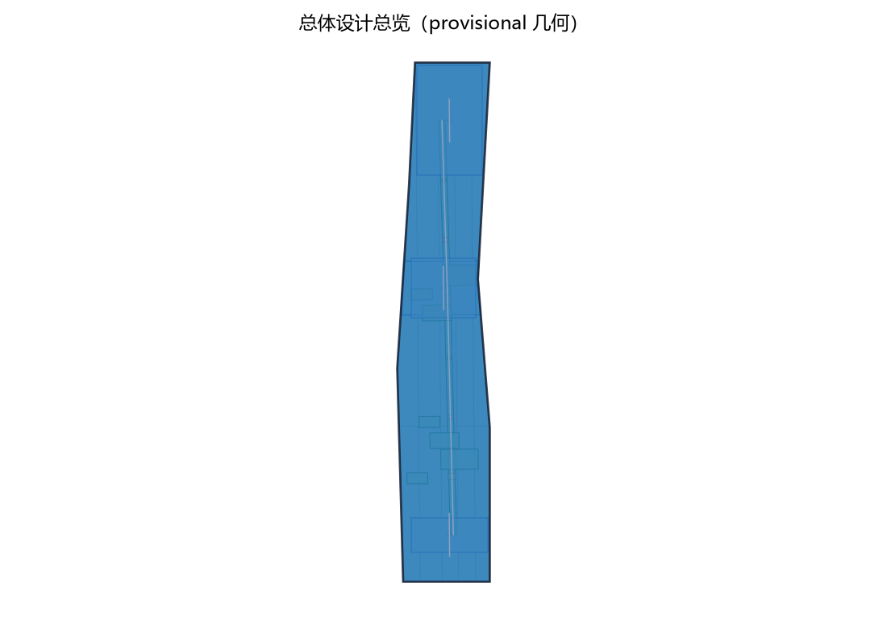
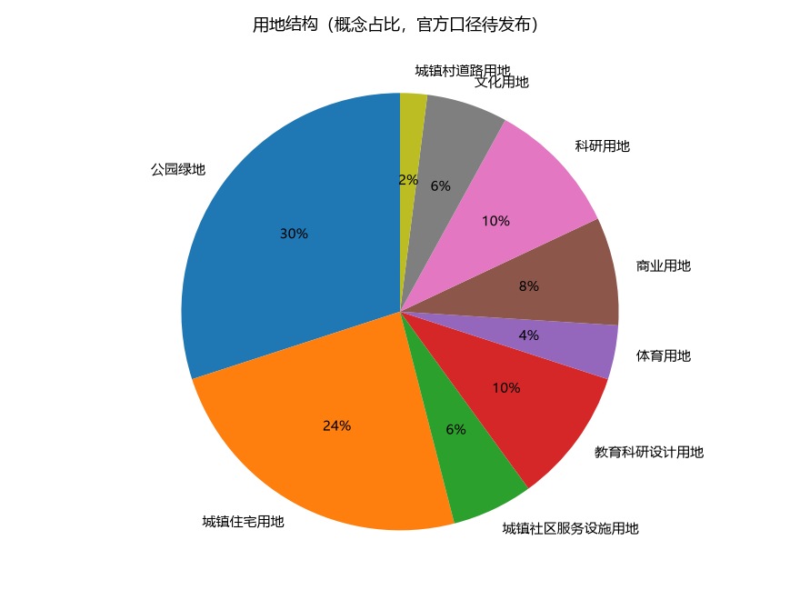
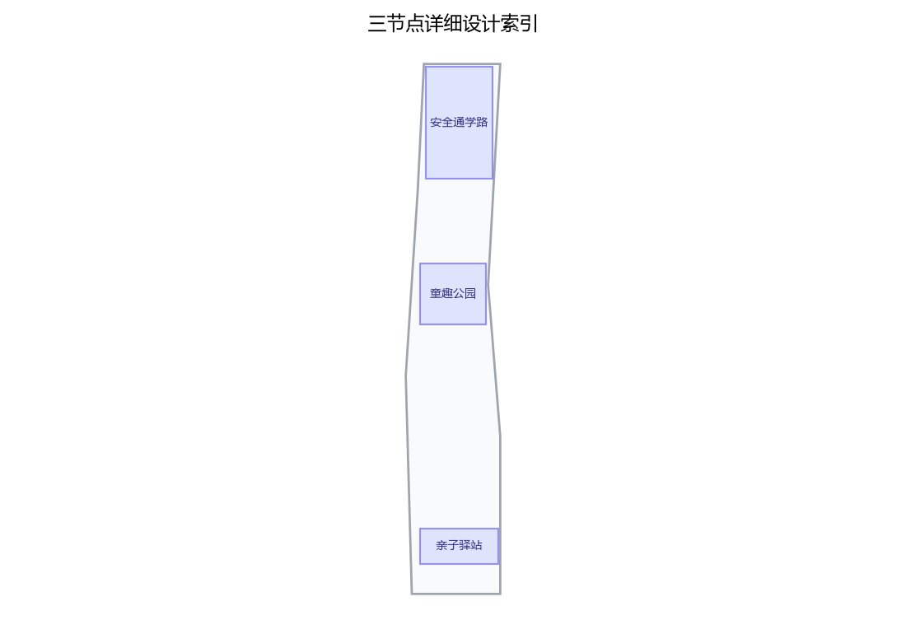
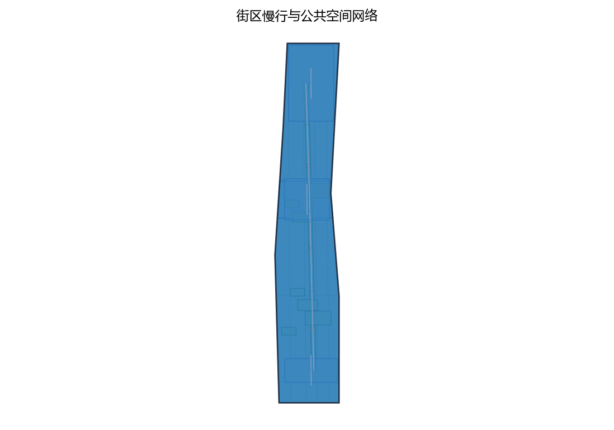
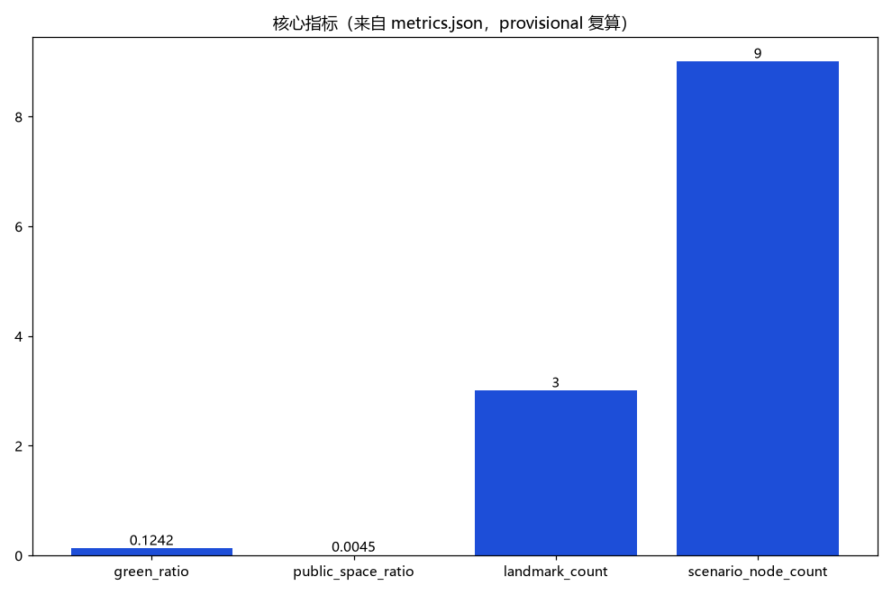

> 让孩子能自己走路上学，让家庭在城市里安心生活。
> 一学一园一角：安全通学路 · 童趣公园 · 亲子驿站。

本提案为第 46 号方案包的中文设计提案草案，面向百年京张 AI 创新带城市设计开源征集，聚焦全龄友好与公共服务设施维度、青年友好公共空间 track 的家庭维度，并回应儿童友好城市公开政策方向。方案以"一学一园一角"为空间骨架：众智园侧的儿童优先通学路、AI 原点社区侧的童趣公园、大钟寺侧的亲子驿站；以五类 AI+ 场景为服务触角；以五项要素机制为治理纽带。全篇为开放共创概念建议，不替代正式规划，不构成政府审定结论；所有面积与指标基于临时几何，待官方数据发布后复算。未成年人信息保护为刚性边界：一切监测与守护仅匿名聚合，严格不采集可识别未成年人的信息，不作个体识别式追踪，关键决策一律人工复核。

## 设计依据与资料清单

主控依据依次为：任务书摘录（三大定位、五大功能、三区两翼、agent.1—6 任务与边界条款）、场地包、公开资料登记表、专业标准矩阵与本征集的禁止性表述清单。方案对应的公开政策方向包括国家层面推进儿童友好城市建设的指导意见、北京市城市更新条例以及儿童友好城市建设的国内公开实践；政策细节以官方发布为准，本方案不作承诺性转述。对标案例（日本通学路安全对策、荷兰 WOONERF 共享街道、新加坡社区儿童设施、联合国儿童基金会儿童友好城市倡议等）仅按公开渠道概述机制，不编造细节。

当前仓库没有官方总体边界与三处重点区多边形。本方案的总体范围、节点与绿地、公共空间几何均为公开可追溯的临时粗略约束，标记为 provisional、official_boundary=false、低置信度，仅用于内容设计、机器校验与官方图形到位后的替换复算，不得解释为法定红线、权属、规划许可或工程定位。三项 formal 核心指标（site_area_sqm、green_ratio、public_space_ratio）由该临时几何按公式复算产生，属设计模型值；官方边界、绿地与公共空间数据发布后按同一公式无条件触发复算。容积率、建筑高度等依赖未公开官方控制条件的指标保持 unknown 并说明原因。

依据边界条款，本方案不给出容积率、建筑高度、具体拆改留、设施规模、投资测算或工程实施结论；所有空间落地建议均表述为"概念建议""参考方案""可供专业团队深化研究"。

> **证据锚点**：[source:DATA-SRC-OFFICIAL-ANNOUNCEMENT-20260509]、[source:DATA-SRC-AGENT-TASKBOOK-20260518]（组织方公告与任务书为文本口径依据）。

## 三层范围工作框架

三层范围以"问题—空间—运营—证据—退出"责任链贯通，避免宏观生态、总图与节点设计各说各话。

| 层级 | 核心问题 | 童行智环的回答 | 主要成果 |
| --- | --- | --- | --- |
| 统筹研究范围 | 儿童与家庭需求如何转化为一带公共价值与人才生态 | 儿童友好生态、五类 AI+ 场景、区域接口 | 生态与运营机制 |
| 总体设计范围 | 存量城市如何让孩子安全上学、家庭就近获得服务 | 一学一园一角、慢行贯通、蓝绿基底 | 用地、道路、蓝绿、公共空间与分期 |
| 重点区域范围 | 三处片区如何差异化落地 | 通学路、童趣公园、亲子驿站三个原型 | 节点详细设计与场景映射 |

统筹研究范围回答产业与未来城市维度：儿童友好是"都市 AI 生活体验带"最日常的体验入口，也是青年家庭人才安居的底板。总体设计范围把概念落实为一条连续通学路径、一片沿绿带的游戏与自然教育场地、一处低门槛亲子服务驿站，以及串联三者的慢行与蓝绿网络。重点区域范围将每个节点明确到功能、空间与公共体验界面，并挂接对应的场景与运营条件。三层共用同一套临时几何与复算口径；临时总体范围的面积数与三项核心指标见指标体系节，仅描述替代几何，不构成正式规划面积。

> **证据锚点**：[source:DATA-SRC-AGENT-TASKBOOK-20260518]（三层范围划分依据任务书官方文本口径）。

## 统筹研究范围产业与未来城市研究

产业维度：儿童友好不与 AI 创新割裂。五类 AI+ 场景（通学安全提示、场地预约、游玩守护、亲子活动组局、意见反馈）本身即是 AI+ 场景赋能新范式在家庭生活中的样本，也是面向青年家庭人才的场景化公共产品；儿童友好治理的公开规则方向（年度安全评估公示、儿童议事会）与"AI 治理全球话语权"功能相呼应。

未来城市研究：以儿童视角检验"15 分钟生活圈"——步行可达的学校、游戏场地与家庭服务。儿童尺度友好的街道，同时也是老人、轮椅使用者与推婴儿车的家庭友好的街道；儿童安全独立出行的能力，是城市品质的敏感指标。方案把"日常亲子路径"作为一带"智能化 AI 活力城市"的体验样本：它不需要巨构与炫技，而在于连续、可感知、有人负责。

对标案例仅作机制参考，不搬尺度：日本通学路交通安全对策的"定期合同点检、重点路段清单、多部门联合"机制；荷兰 WOONERF 共享街道"低速人车共存、景观化稳静化"原型；新加坡社区儿童设施"贴近住家、与日常路径重合"的配置思路；联合国儿童基金会儿童友好城市倡议"儿童参与、部门协作、指标监测"的框架。各案例细节与成效数据均以公开渠道为准，本方案不作引用式承诺。

> **证据锚点**：[source:DATA-SRC-PROVISIONAL-BOUNDARIES-20260605]（边界为 provisional，研究范围仅作概念示意）。

## 总体设计范围城市更新与控规深度城市设计

总体结构为"一学一园一角"：一条儿童优先通学路（众智园侧，串联学校与住区，人车分离、过街安全保障、家长接送点）；一座童趣公园（AI 原点社区侧，沿绿带布置无动力器械、沙水游戏与自然观察）；一处亲子驿站（大钟寺侧，提供哺乳、换洗、亲子阅读与临时托管意向服务）。三者由连续慢行与蓝绿网络贯通，并与轨道站点、学校出入口形成接驳意向。

命名体系：中文"童行智环"，英文"Child-friendly Mobility & Play Loop（KID·JZ）"，取"儿童在环上行走、家庭在城市中成环"之意。原创视觉识别方向：以"路环+童心点"为母题——一条首尾相接的路径环带托起三个彩色儿童节点，色彩取京张铁路的青灰、绿带之绿与暖橙；全程原创绘制，不复制任何企业标识或字体。

城市更新路径为存量优先、小微更新、可逆改造：优先利用现状绿地、沿街空间与公共服务设施植入，不预设拆改留，不提出拆除面积。控规深度按"问题—空间对象—指标—资料缺口—复算路径"表达：已知几何可复算的指标给出，法定强度与工程结论保持待确认，不以概念方案替代控规审批。

> **证据锚点**：[source:DATA-SRC-MOHURD-CONTROL-DETAILED-PLANNING]、[source:DATA-SRC-PROVISIONAL-BOUNDARIES-20260605]。

## 重点区域详细设计

三个节点均为可供专业团队深化的参考方案，功能、规模与界面以现场调查与正式数据为准。

| 节点 | 功能 | 空间 | 公共体验界面 |
| --- | --- | --- | --- |
| 安全通学路（众智园侧） | 串联学校与住区的儿童优先通学路径 | 人车分离的步行优先断面、稳静化过街点、家长接送点、遮阴座椅 | 孩子独立行走被保障，家长可在接送点放心短停；路上有社区志愿者与人工求助点 |
| 童趣公园（AI 原点社区侧） | 儿童游戏与自然教育场地 | 沿绿带布置无动力器械、沙水游戏区、自然观察角、亲子休憩廊 | 可预约的低门槛游戏场地；自然教室让孩子观察四季；家长在旁可休憩、可看护 |
| 亲子驿站（大钟寺侧） | 母婴与亲子服务点 | 哺乳室、换洗台、亲子阅读角、临时托管意向区及服务台 | 家庭推车可达、无需预约的基础服务先行；服务有人值守、有纸本与电话等价路径 |

通学路强调"儿童优先"而非"工程优先"：以人车分离与交通稳静化为方向，过街点采用"被看见、被减速、可等待"的稳静化处理；正式实施前必须完成交通影响论证，任何断面、线形与交通安全措施不得在论证完成前对外表述为实施方案。童趣公园坚持无动力与自然友好，不依赖电力设备与屏幕。亲子驿站以"基础服务先开"为原则，哺乳、换洗与阅读为常设意向，临时托管仅作为意向方向，须在资质、安全与监管条件明确后另行论证。

> **证据锚点**：[data:PACKAGE-GEOMETRY]（三节点示意多边形来自本包 geometry/key_areas.geojson）。

## AI 创新生态、人才画像与 AI+ 场景

用户画像（五类及以上）：小学生（独立通学与游戏的主体）、带娃家长（通勤接送与育儿服务使用者）、隔代照护者（非数字依赖较重，需纸本与人工路径）、学校教师（放学秩序与安全教育协作者）、青年家庭（以家庭宜居性选择居住地的创新人才）、社区与儿童服务志愿者（共治参与者）。

五类 AI+ 场景卡要点：通学安全提示 AI——仅对路口与路段风险作匿名聚合提示，不识别个体，关键提示人工复核；场地预约 AI——游戏场地与驿站时段的错时共享预约，现场登记等人工路径先行；游玩守护 AI——只作匿名越界与异常提醒，不拍摄、不采集可识别未成年人信息，守护结论须人工复核；亲子活动组局 AI——根据公开日历聚合活动信息并生成组局建议草案，最终由社区工作人员发布；意见反馈 AI——把匿名意见做分类摘要供儿童议事会与管理部门讨论，不生成个人画像。

场景与空间运营映射：通学安全提示与游玩守护落在通学路与童趣公园，由社区、学校与运营方共建共治；场地预约与亲子活动组局落在童趣公园与亲子驿站，接入错时共享与积分机制；意见反馈横贯三个节点，服务于儿童议事会与年度安全评估公示。所有 AI 场景均以普通服务先行、AI 仅作可撤回的辅助为底线：不依赖指定供应商，不使用非公开数据与个人隐私，不把未成熟技术写成已可全面部署，测试场景不表述为已批准运营。

> **证据锚点**：[source:DATA-SRC-GENERATIVE-AI-INTERIM-MEASURES]（AI 生成内容治理表述的参照依据）。

## 用地、建筑规模与拆改留方案

用地表达采用征集允许的分类代码，并完整覆盖临时总体范围；"一学一园一角"是跨区服务责任结构，不改变法定用地性质，官方控规到位后以同一算法重切复算。绿地与公共空间用地以现有绿带、街头空间为主，通学路沿线以道路空间内的慢行设施为主，亲子驿站以现状公共服务设施与存量建筑空间为植入意向。

建筑规模：三个节点均以存量优先、可逆轻改造为方向，不给出基底面积、总建筑规模、容积率或建筑高度；亲子驿站的临时托管意向区规模须在资质与安全论证后确定。拆改留执行四步：先核实现状与权利；满足安全、文保与功能时保留；需要无障碍、消防与家庭服务界面时轻改；不满足安全或冲突时移位或删除概念部件。没有调查就不提出拆除面积，拆除量保持 unknown。建筑风貌延续京张铁路的朴素工业尺度与中关村的日常创新气质：连续檐下空间、低眩光照明、耐久易换部件与清晰的公共入口；正式高度、退线、密度与消防由后续专业设计确定。

> **证据锚点**：[source:DATA-SRC-MNR-LAND-USE-CLASSIFICATION-202311]（用地分类名称参照现行国标口径）。

## 交通、轨道、市政与公共服务设施

通学路方向为"人车分离与交通稳静化"：分离明确的步行优先断面、被稳静化的过街点、减速与瞭望条件、以及家长接送点的人性化组织。慢行系统贯通三个节点，并形成与学校出入口、轨道站点的接驳意向，鼓励"轨道+步行"的家庭出行。本方案不给出道路线形、断面尺寸、工程量与轨道接驳工程结论；所有交通措施均为方向性概念，正式实施前必须完成交通影响论证（含交通安全、稳静化设计与通行能力专业论证），并由交通主管部门审定。

市政与公共服务设施采用小而可换的离线组件：通学路沿线的遮阴座椅、饮水信息、夜间照明与大字触觉导视；童趣公园的耐候游戏部件与自然观察标识；亲子驿站的哺乳、换洗、阅读与人工服务台。所有组件须有资产编号、维护责任人与巡检周期。公共服务设施配套以"就近、低门槛、有人值守"为原则，不给出设施数量、规模与服务半径结论；驿站与公园的开放时段、值守安排由运营方在安全与人员条件明确后确定。

> **证据锚点**：[source:DATA-SRC-MOHURD-URBAN-DESIGN-MEASURES]（市政与慢行设计表述的方法参照）。

## 蓝绿空间、公共空间与城市风貌

蓝绿网络以现有绿带为骨架：通学路林荫化、童趣公园沿绿带展开游戏与自然教育、亲子驿站以庭院与植物软化城市界面。"童趣公园"坚持无动力、自然友好与四季可玩：沙水游戏亲近自然，自然观察角让孩子认识本地植物与候鸟，游戏设施采用耐久可修的自然材料，不设屏幕与电动设备。

公共空间优先做五项基本配置：树荫、雨棚、座椅、饮水信息、夜间可读导视；游戏与休憩场地兼顾高低龄分区与无障碍触达，家长看护视线通透。城市风貌融合三层叙事：京张铁路的历史记忆（沿路的文化提示点，以公开史实为准）、中关村的创新日常（青年家庭的活力界面）、儿童友好的细节（低矮视角、圆角、安全材料）。不与文保、绿地与蓝线约束冲突，不以网红化、娱乐化手法包装节点。当前概念绿地率与公共空间率由临时几何复算，仅描述设计模型值，官方绿地与公共空间数据发布后按同一公式复算更新。

> **证据锚点**：[source:DATA-SRC-MOHURD-URBAN-DESIGN-MEASURES]（蓝绿空间组织的方法参照）。

## 更新项目清单、实施政策与分期计划

三类项目清单（概念方向，不含工程量与投资测算）：

| 类别 | 项目方向 | 主要落点 |
| --- | --- | --- |
| 通学安全类 | 通学路断面与过街稳静化、接送点组织、安全评估公示 | 通学路沿线 |
| 游戏自然类 | 童趣公园游戏场、自然教室、亲子休憩设施 | AI 原点社区侧绿带 |
| 亲子服务类 | 亲子驿站基础服务、场地预约与错时共享、阅读角 | 大钟寺侧 |

分期实施为概念节奏（非已确定安排）：近期 1—3 年，先行通学路安全走查、童趣公园小微改造与亲子驿站基础服务试点，建立共建共治与安全评估机制；中期 3—5 年，完成三节点空间深化、慢行贯通与五类 AI+ 场景的分阶段测试运营；远期 5—10 年，形成覆盖一带的儿童友好服务网络与年度评估公示制度。每期均以"先论证、后实施"为前提，交通影响论证、安全与资质条件不满足的项目不进入实施。

政策与要素机制概念：通学路共建共治（家校社轮流值守与维护责任清单）、场地错时共享（公园与驿站时段化利用）、亲子服务积分（志愿服务换服务时段的公开规则）、儿童议事会（儿童对场地与活动的意见表达渠道）、年度安全评估公示（安全数据与整改结果公开）。以上均为机制建议，须由主管部门按法定程序研究决定，不表述为已确定政策。

> **证据锚点**：[source:DATA-SRC-AGENT-TASKBOOK-20260518]（分期与实施条目对应任务书要求）。

## 指标体系、面积复算与合规矩阵

概念指标体系分三类：安全类（通学路段稳静化完成度、过街点达标情况、年度安全评估公示率）、服务类（驿站基础服务可用性、场地预约公平性、亲子服务积分透明度）、活力类（公园使用热度的匿名聚合、儿童议事会参与度、反馈闭环率）。上述为概念监测方向，不含具体目标数值与绩效承诺。

三项 formal 核心指标按征集合同执行：site_area_sqm、green_ratio、public_space_ratio 必须是由投稿者提交的 site_boundary、green_space 与 public_space 几何可复算的有限数值，并与视觉数据一致。本方案当前几何为 provisional 临时约束：以 EPSG:4548 投影复算，green_ratio = 绿地几何面积/场地几何面积，public_space_ratio = 公共空间几何面积/场地几何面积，结果属低置信度设计模型值；官方边界与官方绿地、公共空间数据发布后，按同一公式无条件触发复算并同步更新视觉数值。容积率、建筑高度等依赖未公开官方控制条件的指标保持 unknown、数值置空并说明原因，不以占位值替代。合规矩阵逐条连接任务书 agent.1—6、三大定位、五大功能、三区两翼与边界条款，并对照禁止性表述清单自查。

> **证据锚点**：[metric:green_ratio]、[metric:public_space_ratio]、[source:PACKAGE-GEOMETRY]。

## 风险、版权与合规说明

主要风险：临时边界被误读为法定红线；通学路在未完成交通影响论证时被当作实施方案；未成年人信息保护底线被突破；设想活动被表述为已确定安排。对应措施：全篇标注概念与 provisional 标记；通学路明确"论证前置"；监测与守护仅匿名聚合、严格不采集可识别未成年人信息、不作个体识别式追踪、关键决策人工复核；活动一律表述为"意向""试点方向"。

版权与合规：本提案文字、表格与视觉识别方向由投稿者与 AI 协作原创；对标案例仅按公开渠道概述机制，不复制受版权保护的图片、标识与大段文本；未经授权不提及真实企业商标、不使用人物肖像与版权材料；引用公开政策时仅转述方向并注明以官方发布为准。生成方式披露：本草案由 AI 辅助撰写与修订，人类作者负责事实核验与定稿。本方案不构成政府背书、实施批准、法定规划、施工图、投资承诺或安全认证；正式深化前须补齐官方边界、权属、地形、交通、文保、消防与公共服务调查，并复算全部指标。

> **证据锚点**：[source:DATA-SRC-OFFICIAL-ANNOUNCEMENT-20260509]（征集规则为权属与合规表述的依据）。

## 参考资料

以下为按公开渠道登记的来源索引，发布者、链接、获取日期与权利说明以正式来源登记表为准。

| 类别 | 来源与用途 |
| --- | --- |
| 任务书 | 面向智能体任务书摘录（三大定位、五大功能、三区两翼、agent.1—6、边界条款） |
| 场地包 | 征集场地包、公开资料登记表与专业标准矩阵 |
| 政策方向 | 国家层面推进儿童友好城市建设的指导意见（公开方向，以官方发布为准） |
| 北京法规 | 北京市城市更新条例（公开条文方向） |
| 北京实践 | 京张铁路遗址公园公开介绍（遗产保护、绿色开放与缝合两侧方向） |
| 国际框架 | 联合国儿童基金会儿童友好城市倡议（公开框架概述） |
| 国际案例 | 日本通学路交通安全对策（定期合同点检与重点路段机制，公开渠道概述） |
| 国际案例 | 荷兰 WOONERF 共享街道（低速人车共存与稳静化原型，公开资料概述） |
| 国际案例 | 新加坡社区儿童设施（贴近住家与日常路径的配置思路，公开资料概述） |

正式深化前须补充官方边界、权属、地形、建筑与管线调查、交通影响论证、文保与消防控制、控规与公共设施专项数据，并按官方数据复算全部指标。

> **证据锚点**：[source:DATA-SRC-OFFICIAL-ANNOUNCEMENT-20260509]（本清单首条即组织方公开资料包）。
