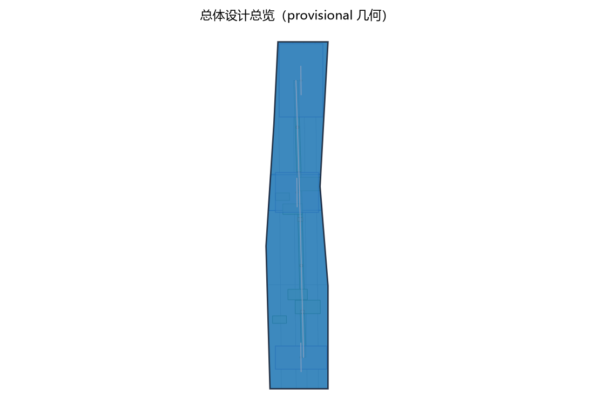
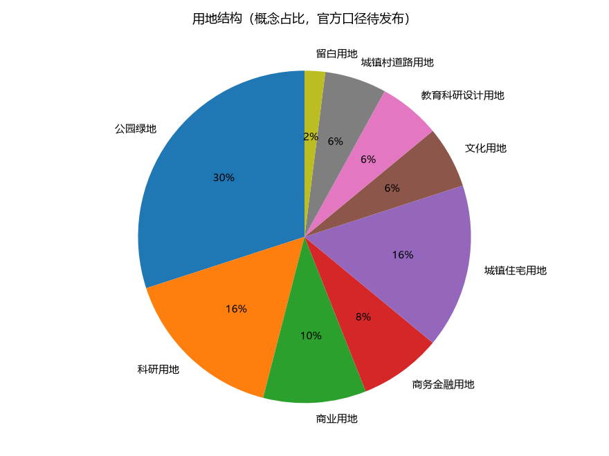
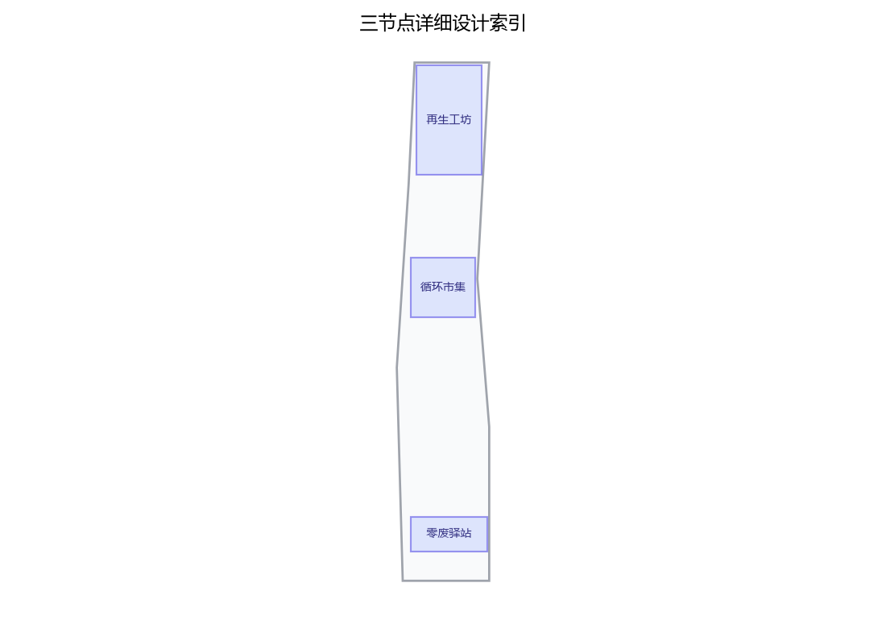
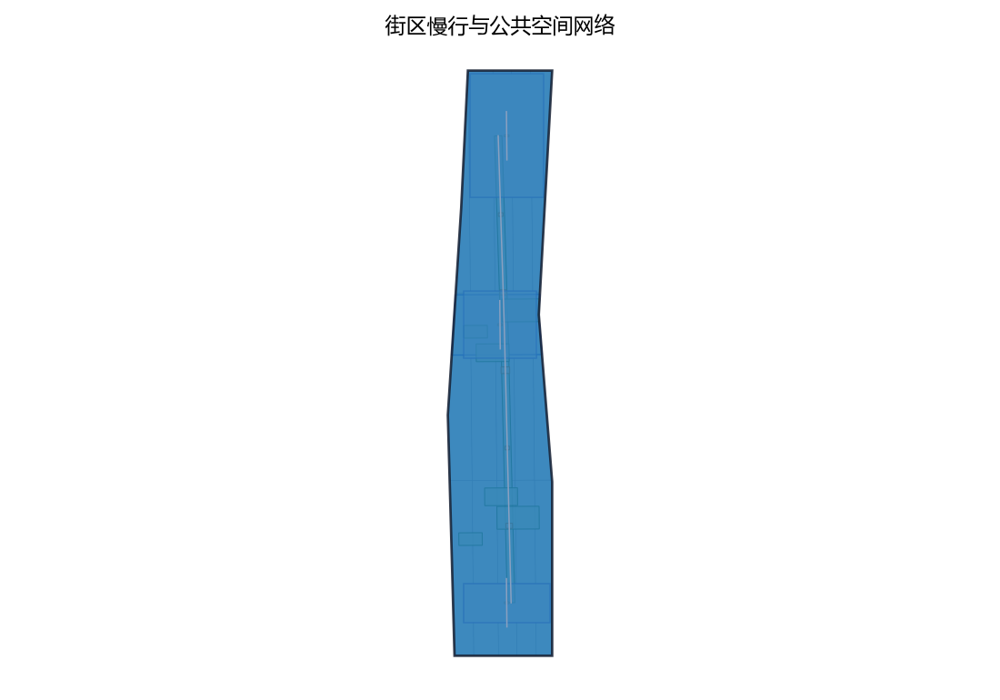
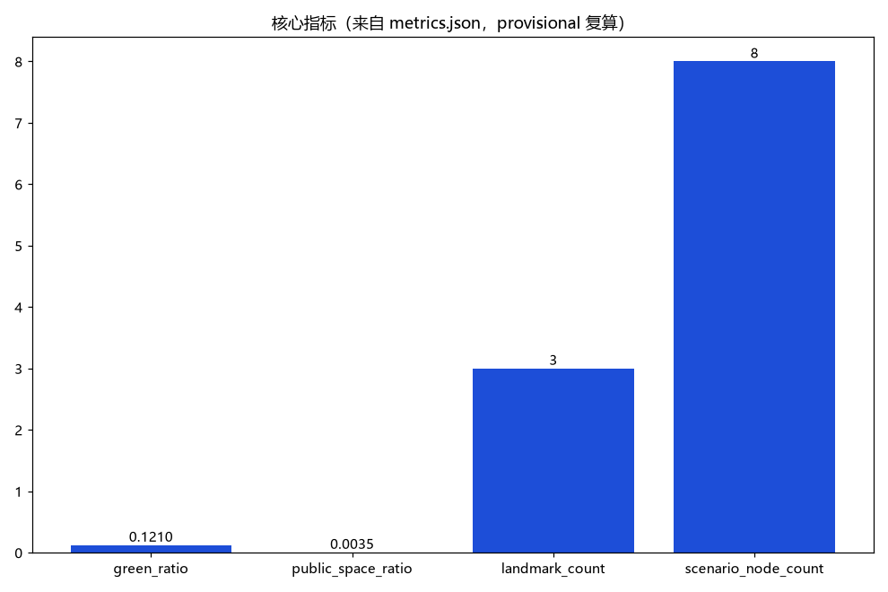

> 把城市带里的"废物流"转译为居民每天路过、愿意停留、看得懂结果的资源循环场景。一厂一市一馆、五类 AI+ 场景与四项要素机制构成"无废智环"；全文为概念建议、参考方案，可供专业团队深化研究。

## 设计依据与资料清单

主控依据为公开征集公告、面向智能体任务书、场地包、公开资料登记表与处理事实包；任务书确定的三大定位、五大功能、三区两翼与 agent.1—6 任务是本方案逐节回应的骨架，投稿技能规定的提案结构决定章节组织。本方案对应任务书低碳绿色创新环境维度，以国家"无废城市"建设与资源循环利用的公开政策方向为参照——固体废物减量化、资源化、无害化，垃圾分类收运与再生资源回收体系衔接等，均为公开方向性表述，本方案只作方向引用，不引用、不转述任何未经核实的指标与承诺。

边界与几何资料：仓库当前未提供官方总体边界与三处重点区 polygon，本方案采用公开可追溯的临时粗略约束（provisional_constraint），仅用于概念设计、机器校验与官方图形到位后的替换复算；不构成法定红线、权属、规划许可或工程定位。现状诊断、精度限制与替换要求记录于设计深度矩阵，正文只使用"待正式数据补齐"等人性化表述。

对标案例资料：深圳"无废城市"建设公开实践、上海垃圾分类与"两网融合"公开做法、哥本哈根资源回收体系、日本循环型社会推进方向，仅按公开渠道概述治理机制，不搬运数据与尺度。参考网页的发布者、获取日期、用途与许可逐项登记于来源清单（待结构化补充）。

> **证据锚点**：[source:DATA-SRC-OFFICIAL-ANNOUNCEMENT-20260509]、[source:DATA-SRC-AGENT-TASKBOOK-20260518]（组织方公告与任务书为文本口径依据）。

## 三层范围工作框架

三层范围以"资源流—空间设施—运营机制—指标证据"责任链贯通，避免宏观研究、总图与节点设计各说各话。统筹研究范围回答"再生资源产业与 AI 如何支撑一带创新生态"：把废物流理解为数据流与产业流入口，形成资源循环产业图谱与五类 AI+ 场景方向。总体设计范围把研究落为"一廊两带三节点"空间结构：沿京张遗址带的资源循环体验廊，社区回收动线与封闭式集散带两条概念通道，再生工坊、循环市集、零废驿站三处节点。重点区域范围把每个节点落实为功能、空间界面、运营班次、验收条件与停用条款。

| 层级 | 核心问题 | 无废智环的回答 | 主要成果 |
| --- | --- | --- | --- |
| 统筹研究范围 | 废物流如何成为城市资产 | 资源循环产业图谱与五类 AI+ 场景方向 | 产业—空间映射、对标机制、命名体系 |
| 总体设计范围 | 循环设施如何低干扰嵌入 | 一廊两带三节点、回收动线与慢行一体化 | 用地、动线、蓝绿、分期概念 |
| 重点区域范围 | 三处节点如何差异化运营 | 工坊加工展示、市集交换维修、驿站回收科普 | 三个概念原型、场景卡与运营班表 |

临时总体 polygon 的概念复算面积与绿地率、公共空间率以提交几何为唯一口径（provisional、低置信度），官方边界发布后按同一公式整体复算替换；三处重点区为公告线索下的粗略范围，不构成正式规划面积。

> **证据锚点**：[source:DATA-SRC-AGENT-TASKBOOK-20260518]（三层范围划分依据任务书官方文本口径）。

## 统筹研究范围产业与未来城市研究

对标三大定位、五大功能，本方案以"低碳绿色创新环境"为切入点：都市 AI 生活体验带承载零废公约、循环市集与科普驿站，AI 融合创新带承载五类 AI+ 场景验证，为世界级 AI 创新生态提供可持续底座；小月河场景赋能翼承接场景开放与公众体验，中关村科技服务翼对接再生材料供应链与绿色要素配置（概念方向）。

命名体系：中文"无废智环"，取无废城市为价值坐标、AI 为"智"、资源循环为"环"；英文 ZERO·JZ，以 ZERO 点题"零废"与"从零开始"，JZ 取京张首字母，命名原创、不照搬任何城市、园区或企业名称。Logo 概念方向：京张遗址带弧线作外环、回流箭头作内环、叠一颗绿色 AI 节点，形成"双环咬合"符号；未使用任何第三方图形或字体。

产业与未来城市设想：再生资源回收利用与固废处理的数字化、智能化是公开产业方向，本方案提出"废物流即数据流"——分类、调度、溯源、堆肥监测、碳效追踪五类 AI+ 场景构成产业验证阶梯，不预设企业、投资与规模。

对标案例（公开渠道概述，仅机制级）：深圳于 2019 年作为全国首批"无废城市"建设试点城市，公开以制度集成、源头减量、建筑废弃物综合利用与回收网点体系推进；上海公开推行生活垃圾全程分类与可回收物回收服务点、中转站、集散场三级体系，通过"两网融合"衔接环卫清运与再生资源回收；日本以 2000 年《循环型社会形成推进基本法》确立发生抑制、再使用、再生利用、热回收、适当处置的公开优先序与 3R 框架；哥本哈根公开以高回收与能源化协同组织城市资源回收体系。四案例仅借机制与治理结构，不搬运数据、不复制形象。

> **证据锚点**：[source:DATA-SRC-PROVISIONAL-BOUNDARIES-20260605]（边界为 provisional，研究范围仅作概念示意）。

## 总体设计范围城市更新与控规深度城市设计

总体结构"一廊两带三节点"。一廊：沿京张遗址带概念联通的资源循环体验廊，东西缝合两侧社区，承担"看得见的循环"科普界面与再生材料铺装展示段（概念）；两带：社区步行回收动线带与封闭式集散带，前者与慢行系统一体化，后者低干扰地贴邻既有道路布置；三节点：再生工坊、循环市集、零废驿站。

控规深度表达：以"问题—空间对象—概念指标—资料缺口—复算路径"为框架组织，不替代控规审批，不给出容积率、建筑高度、道路红线与工程实施结论。城市更新以"存量优先、轻改造、可逆、分时"为原则：三处节点优先利用现状建筑与公共空间边角，循环市集采用可逆装置与分时运营，零废驿站优先嵌入公共服务设施；所有空间落地建议表述为"概念建议""参考方案""可供专业团队深化研究"。

拆改留逻辑：先核实现状、权属、文保、结构与消防，再谈保留、轻改、移位或删除概念部件；调查完成前不提出任何拆除面积。总体范围临时几何复算面积以提交几何为准（provisional），官方数据发布后复算替换。

> **证据锚点**：[source:DATA-SRC-MOHURD-CONTROL-DETAILED-PLANNING]、[source:DATA-SRC-PROVISIONAL-BOUNDARIES-20260605]。

## 重点区域详细设计

三个节点构成"工坊变材料—市集续生命—驿站守日常"的循环链条，均采用封闭式、低噪音、低气味设计原则，规模与选址不作结论。

### 再生工坊（众智园AI自主创新加速区侧）

功能：园区级资源循环实践节点，概念涵盖建筑垃圾资源化、废旧物资分类回收与再生材料应用展示意向，兼作 AI 场景验证场地。空间：封闭式低噪低味处理车间（概念）、露天再生材料展示场、公共观察廊与教学界面，公众可沿观察廊看到"拆解—分选—再生制品"链条。公共体验：预约开放日、再生材料样品墙与设计师打样工位，让"建筑垃圾"变成看得见摸得着的材料样本。

### 循环市集（AI原点社区侧）

功能：闲置交换、维修与二手再利用的社区循环场，承接社区生活服务。空间：可逆装置组合——模块化摊位、可移动顶棚与寄存单元，分时运营：平日为社区维修角，周末为交换市集；界面开放、邻避友好。公共体验：以物换物摊位、维修工作台、闲置寄存柜与"物品故事"标签；回收积分与押金制概念在实体台面可理解地演示，纸本、电话与人工路径完整可用。

### 零废驿站（大钟寺AI产业集聚区侧）

功能：分类回收、厨余就地处理与再生材料科普的社区服务点。空间：封闭式分类回收间与厨余堆肥间（概念）、自动化投放口与人工服务台并存，科普墙与小花园展示"厨余—土壤—食物"闭环。公共体验：任何人群无需 App 即可投放与求助；匿名投放记录与人工复核结合，不进行个体识别式追踪。

三个节点沿一廊两带串联，形成"生产端、交换端、服务端"的概念闭环，具体落地点位供专业团队深化。

> **证据锚点**：[data:PACKAGE-GEOMETRY]（三节点示意多边形来自本包 geometry/key_areas.geojson）。

## AI 创新生态、人才画像与 AI+ 场景

AI 创新生态以"场景—空间—运营"三要素成环：五类 AI+ 场景全部以普通、非 AI 的服务路径为底座，AI 仅作匿名聚合与人工复核下的辅助工具；任何场景都有具名负责人、停用条件与年度复盘，不预设供应商与技术依赖。

五类用户画像：

| 用户 | 需求与参与方式 | 服务界面 |
| --- | --- | --- |
| 社区居民 | 日常投放、积分兑换、闲置交换 | 投放口、市集摊位、驿站人工台 |
| 物业管理人员 | 设施运维、居民引导、看板数据复核 | 维修角、运维工单、驿站公示墙 |
| 回收合伙人 | 小微回收经营、调度建议的确认执行 | 集散节点、调度台 |
| 绿色设计师 | 再生材料样品、溯源记录与打样支持 | 再生工坊样品墙与溯源终端 |
| 学生访客 | 科普研学、项目式学习与开放日 | 观察廊、科普墙、市集工作台 |

五类 AI+ 场景卡（要点）：

| 场景 | 核心功能 | 复核与边界 |
| --- | --- | --- |
| 分类识别AI | 投放口辅助纠错 | 仅匿名聚合投放统计，人工复核，不做个体识别式追踪 |
| 回收调度AI | 依箱体状态与运力生成调度建议 | 调度员确认后执行，不作直接派单 |
| 再生材料溯源AI | 材料批次"来源—工艺—检测"溯源记录 | 作为优先采购参考凭证，检测结论由机构出具 |
| 厨余堆肥监测AI | 温湿、气味与成熟度监测 | 输出养护建议，养护人员复核后处置 |
| 碳效追踪AI | 节点级碳减排线索聚合估算 | 公示草稿须人工复核后发布，不替代专业核算 |

场景—空间—运营映射：五类场景分别落于再生工坊观察廊与打样间、循环市集维修台、投放口、驿站堆肥间与公示墙；运营上绑定具名负责人、非 AI 等价路径、停用触发与年度公示。隐私边界：分类识别仅匿名聚合与人工复核，不采集人脸与不必要个人信息，所有输出可撤回、可删除，正式部署前落实人工复核与投诉机制。

> **证据锚点**：[source:DATA-SRC-GENERATIVE-AI-INTERIM-MEASURES]（AI 生成内容治理表述的参照依据）。

## 用地、建筑规模与拆改留方案

用地表达以仓库允许的分类代码为基础，概念覆盖临时总体范围并完整拼合无空隙；三处节点按"公共管理与服务、商业服务、绿地与设施用地"等类别作示意组合（概念），不改变法定用地性质，官方控规到位后以同一算法重切复算。建筑规模不给数值结论：只定义节点概念包络——可逆装置、轻改造部件与服务性门廊，容积率、建筑高度、建筑基底面积保持 unknown（value null，原因：依赖未公开官方控规与建筑调查），正式数据发布后复算。

拆改留四步：核实现状与权利；满足安全、文保、功能则保留；有服务、无障碍、消防与节能需求则轻改；无法满足或与约束冲突则移位、删除概念部件。没有调查与官方数据，不提出任何地块级拆改留结论。风貌以朴素工业尺度、再生材料饰面展示段与低眩光夜景为控制方向，不以"AI 造型"为目标；临时几何的用地面积、绿地率与公共空间率为 provisional 模型值，官方几何发布后替换复算。

> **证据锚点**：[source:DATA-SRC-MNR-LAND-USE-CLASSIFICATION-202311]（用地分类名称参照现行国标口径）。

## 交通、轨道、市政与公共服务设施

回收动线与慢行系统一体化：社区级投放点沿慢行路径布置，形成"投放—寄存—集散"的步行回收动线，与遮阴、座椅、导视共用断面与设施，回收成为顺路的日常行为而非额外出行（概念，不给道路红线、断面与工程量结论）。封闭式运输节点低干扰布置：集散节点优先利用既有道路边角与场地边缘，采取封闭式装卸、低噪音低气味设计，作业时段与通勤高峰错峰，减少对社区界面的干扰；不给处理规模、车辆配置与工程实施结论。

轨道与站城接驳概念：三处节点优先贴邻既有轨道交通车站的公共空间布局，使"带物出行"——旧物携带至驿站或市集——成为顺路行为；具体接驳、站城界面与通道留待专业交通与轨道研究。市政与公共服务设施：小体量、可逆、可维护组件（投放柜、寄存柜、堆肥箱、公示板与人工台），全部有资产编号、维护人、巡检频率与停用条件；厨余就地处理点为封闭式低气味概念设计，不涉及市政容量或能源负荷测算。

> **证据锚点**：[source:DATA-SRC-MOHURD-URBAN-DESIGN-MEASURES]（市政与慢行设计表述的方法参照）。

## 蓝绿空间、公共空间与城市风貌

蓝绿空间承担"循环可视"职能：零废驿站堆肥成果按合规要求回馈社区花园与街角绿地，形成"厨余—土壤—绿化"闭环；再生工坊的再生透水骨料可与蓝绿空间边界结合，作园路与铺装试验段（概念）。公共空间强调参与式体验界面：科普墙、观察廊、交换市集与维修角均为开放界面，遮阴、座椅、饮水信息与夜间照明完整配置；断网与设备失效时，纸本、电话与人工路径仍可完成全部核心服务。

城市风貌：以京张铁路朴素工业尺度为底，叠加再生材料肌理与低眩光照明，形成"看得见循环、摸得到再生"的城市气质；公共空间组件库（遮阴、座椅、投放口、导视、公示板）统一模数、耐久可修、可整体迁移，作为一带可复用的风貌与运营工具（概念）。蓝绿蓝线、绿地权属与生态管控要求均在专业核查后落实，本方案不涉及具体工程结论。

> **证据锚点**：[source:DATA-SRC-MOHURD-URBAN-DESIGN-MEASURES]（蓝绿空间组织的方法参照）。

## 更新项目清单、实施政策与分期计划

三类项目清单（概念，均不给规模、投资与开工结论）：

1. 处理设施类：再生工坊、零废驿站、厨余就地处理点——全部按封闭式、低噪音、低气味设计原则提出，规模与选址待专业论证与法定程序；
2. 回收网络类：社区投放点、两级回收动线、封闭式集散节点、可逆交换装置——构成"投放—集散—再生"网络骨架；
3. 治理机制类：生产者责任延伸（EPR）协作、回收积分与押金制、再生材料优先采购、零废公约与年度公示——作为制度层面的概念建议。

分期实施（概念节奏）：近期（1—3年），选定一处试点节点与机制沙盒起步，跑通"分类投放—封闭集散—公示复盘"最小闭环，五类 AI+ 场景以影子验证或人工辅助方式试运行；中期（3—5年），回收网络成环、三节点全部开放运营，AI+ 场景按年度保留、修改、移除机制滚动深化；远期（5—10年），形成与京津冀资源循环协作方向衔接的体系化运行与年度零废公示制度。

政策合规说明：EPR、两网融合、押金制与积分制等机制涉及环卫与环保法规政策，全部为概念建议；正式实施前须完成法定论证、行业主管部门评估与公众参与，本方案不把任何机制写成已确定安排。

> **证据锚点**：[source:DATA-SRC-AGENT-TASKBOOK-20260518]（分期与实施条目对应任务书要求）。

## 指标体系、面积复算与合规矩阵

概念指标体系分三组：空间指标——节点数（3）、概念动线长度、绿地率与公共空间率；场景指标——AI+ 场景数（5）、用户画像数（5）、人工复核覆盖率（概念阈值）；机制指标——要素机制数（4）、分期限次（3）、年度公示频次（概念 1 次/年）。所有数值注明 known、unknown 或概念口径，公式、来源文件与假设逐项登记于机器清单。

三项 formal 核心视觉指标（site_area_sqm、green_ratio、public_space_ratio）必须是从投稿者提交的 site_boundary、green_space 与 public_space 几何可复算的 known 有限数值，并与 visual/index.html 的数值 data-value 一致。本方案当前使用 provisional 几何：三项指标可依提交几何复算出低置信度的临时设计模型值，须保留 provisional 标记、来源、EPSG:4548 投影复算公式与置信度说明；正式边界与绿地、公共空间数据发布后（触发条件：官方 geometry 文件入库或公告更新），立即按同一公式复算替换。容积率、建筑高度等依赖未公开官方控制条件的指标保持 unknown、value null 并说明原因。

合规矩阵逐条连接公告、任务书 agent.1—6、三大定位、五大功能、三区两翼、边界条款与正文各节；空间建议一律表述为"概念建议""参考方案""可供专业团队深化研究"。

> **证据锚点**：[metric:green_ratio]、[metric:public_space_ratio]、[source:PACKAGE-GEOMETRY]。

## 风险、版权与合规说明

主要风险：临时边界被误读为官方红线；机制设想被表述为已确定安排；处理节点气味、噪声与邻避冲突；AI 场景滑向个体识别式追踪。对应控制：全篇标注 provisional 与官方数据发布后的复算触发条件；EPR、两网融合等机制一律标注"概念建议、正式实施前须完成法定论证"；处理与集散节点强制封闭式、低噪低味设计并写入验收与停用条件；分类识别仅匿名聚合与人工复核，禁止个体识别式追踪，试点前落实人工复核、投诉与信息保护机制。

版权：本提案文字、图表、结构为提交者与 AI 协作原创；对标案例仅作公开事实与方法引用，不复制受版权保护的图片、Logo、字体或商标；不提及未经授权的真实企业商标；引用的公开政策与案例按任务书公开资料边界记录来源、发布者与获取日期；如使用开源地图仅作署名定向背景，不从中推导任何法定事实。

合规：本方案为开放共创建议，不替代正式规划，不构成政府审定结论、实施批准、投资承诺或工程可行性结论；所有涉及环卫环保政策的表述均为方向性概念建议，最终判断由人类与专业团队完成。

> **证据锚点**：[source:DATA-SRC-OFFICIAL-ANNOUNCEMENT-20260509]（征集规则为权属与合规表述的依据）。

## 参考资料

以下为公开渠道信息索引，分为征集文件、投稿规范、场地资料、政策方向、国内实践、国际方向与地图语境七组，供专业团队核实与深化；权威网址、发布者、获取日期（本草案撰写日 2026-08）、许可与用途逐项登记于来源清单（待结构化补充）。对标案例仅按公开渠道信息概述机制层级内容，不复制受版权保护的原文、图表或标识。

| 类别 | 来源与用途 |
| --- | --- |
| 征集文件 | 资格预审公告与面向智能体任务书（三大定位、五大功能、三区两翼、agent.1—6、边界条款） |
| 投稿规范 | 城市设计 AI 投稿技能（提案结构、provisional 几何与指标契约） |
| 场地资料 | 场地包、公开资料登记表、处理事实包与参考样例提案 |
| 政策方向 | 国家"无废城市"建设、资源循环利用公开政策方向（方向性引用） |
| 国内实践 | 深圳"无废城市"建设试点的公开总结与发布信息；上海生活垃圾分类与"两网融合"公开文件 |
| 国际方向 | 哥本哈根资源回收体系公开信息；日本《循环型社会形成推进基本法》与 3R 公开框架 |
| 地图语境 | 开源地图仅作署名定向背景（如需） |

正式深化前必须补齐：官方总体边界与重点区几何、权属与地形资料、建筑与管线调查、文保与生态管控资料、控规与交通资料；补齐后按同一公式复算全部指标并更新本草案。

> **证据锚点**：[source:DATA-SRC-OFFICIAL-ANNOUNCEMENT-20260509]（本清单首条即组织方公开资料包）。
