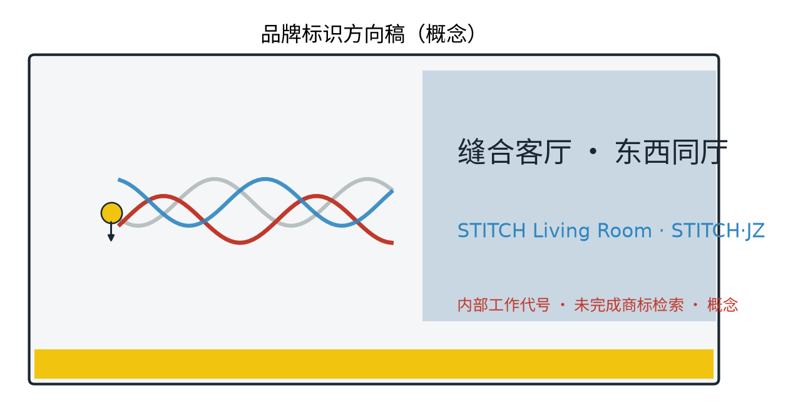

This chapter is the concept narrative of the "OPEN CITY · HAIDIAN Centennial Jingzhang AI Innovation Belt Urban Design Open Call". The theme is the Stitch Living Room: using the Jingzhang Railway Heritage Park green belt as a stitching interface, translating the two halves once divided by the railway into a crossable, stayable, conversable urban living room. The whole text is a concept suggestion and reference scheme: no fabricated official data, no conclusive values for FAR, building height, retain-renovate-demolish, investment, ridership or capacity; international and domestic cases are registered one by one with sources and reuse boundaries (Appendices 3, 4 and sources.json); anything unverifiable is explicitly demoted to a research hypothesis.

## Design Basis and Source List
The design basis follows a public-source and traceability principle. The source list has four categories. First, organisers' public materials, namely the pre-qualification announcement and the taskbook excerpt, as the textual basis for scope and task requirements. Second, public regulations and standards, including the Urban Design Administrative Measures, the Regulatory Detailed Plan Compilation and Approval Measures, the National Land-Use and Sea-Use Classification Guide, the Interim Measures for the Administration of Generative AI Services, and the Barrier-Free Environment Law. Third, institutional websites and public reports on cases: 6 international and 4 domestic cases, each registered with institution, URL, access date and reuse boundary in Appendices 3 and 4. Fourth, self-produced content: field survey notes, sketch analyses and provisional concept geometry. Statutory regulatory plans, road redlines, railway protection zones, heritage protection ranges, green and blue lines, land ownership, surveyed basemaps, underground space, municipal capacity and fire-safety conditions are not yet available; they are recorded as data gaps rather than replaced by invented data.

> **Evidence anchor**: [source:DATA-SRC-OFFICIAL-ANNOUNCEMENT-2026-05-09], [source:DATA-SRC-AGENT-TASKBOOK-2026-05-18] (scope, tasks and depth follow the organisers' public text).

## Three-Level Scope Framework
Per the official announcement text, the three scopes are, top-down: the coordinated research area of about 43.6 sq km, studying the overall relationship between the stitching belt, the two flanking districts, industry, function and urban structure; the overall design area of about 11.4 sq km, developing an urban-renewal and regulatory-plan-depth design with the green belt as the stitching interface; and key areas of about 368.4 ha, covering the Zhongzhiyuan AI Independent Innovation Acceleration Area, the Beijing AI Origin Community and the Dazhongsi AI Industry Cluster Area (official names only). This package's own scope is a concept subset: the three original nodes inside the key areas (Stitch Bridge Court, East-West Market Gallery, Stitch Axis) and the cross-boundary public-space interface along the stitching green belt. The three levels transmit top-down and verify bottom-up; all boundaries are provisional concept indications, not official redlines, and are fully recomputed once official geometry is published.

> **Evidence anchor**: [source:DATA-SRC-OFFICIAL-ANNOUNCEMENT-2026-05-09], [source:DATA-SRC-PROVISIONAL-BOUNDARIES-2026-06-05] (official area figures follow the announcement text; package geometry is provisional only).

## Coordinated Research Area: Industry and Future City Research
The coordinated research proposes a "Five-Ring Synergy" concept loop: Beiwai Community supplies innovation-community services, Future Science City supplies R&D and conversion hinterland, Huairou Science City supplies basic research support, Beijing Economic-Technological Development Area supplies manufacturing and pilot lines, and the Beijing-Tianjin-Hebei region supplies application scenarios and hinterland markets; the five rings interlock with the belt (Jingzhang AI Innovation Belt) into a talent-industry-data-scenario-governance loop. The east side is the university intelligence wing (university clusters), the west side the international-living wing (international residential areas); the two wings complement each other: universities export research, youth energy and test scenarios, while the international residential side exports diverse lifestyles, public services and cross-cultural exchange needs, and the stitching belt becomes the shared interface where the two wings exchange functions. The three positionings (Centennial Jingzhang Culture Belt, Urban AI Life Experience Belt, AI Fusion Innovation Belt) and the five functions (full-stack AI independent innovation system, world-class AI innovation ecosystem, new AI+ scenario empowerment paradigm, intelligent AI vibrant city, global voice in AI governance) are explicitly mapped in this scheme: stitching nodes correspond to the intelligent vibrant city, markets and innovation platforms to the AI innovation ecosystem and scenario empowerment, and cultural signage to the culture belt. Future-city research is directional only and implies no land-use or investment commitment.

> **Evidence anchor**: [source:DATA-SRC-AGENT-TASKBOOK-2026-05-18], [source:DATA-SRC-PROVISIONAL-BOUNDARIES-2026-06-05] (regional synergy is concept research; boundaries are provisional).

## Overall Design Area: Urban Renewal and Regulatory-Plan-Level Urban Design
The overall design organises a "Three Zones, Two Wings" synergy loop: the three zones are the Zhongzhiyuan AI Independent Innovation Acceleration Area, the Beijing AI Origin Community and the Dazhongsi AI Industry Cluster Area; the two wings are the university intelligence wing and the international-living wing. The three zones string like beads along the stitching green belt, the two wings pair across the belt, forming three synergy loops: inter-zonal function borrowing, cross-line public-space sharing, and mutual traffic between events and industry. The method follows regulatory-plan depth as an advisory check of land-use compatibility, public-space control and interface guidance, without preset numeric conclusions; the principle is incremental darning - small-scale, acupoint-like intervention, avoiding large-scale demolition. The stitching interface is a "shared interface": the same ground is for daily leisure and for markets and exhibitions during events; public services, innovation facilities and daily life functions pair up along the interface; crossing systems and the public-space network are organised together, turning the leftover green belt from a divider into a dialogue interface.

> **Evidence anchor**: [source:DATA-SRC-MOHURD-URBAN-DESIGN-MEASURES], [source:DATA-SRC-MOHURD-CONTROL-DETAILED-PLANNING] (methodological references only, not statutory approval).

## Detailed Design of Key Areas
Three original nodes form a point-line-plane stitching system. Node 1, "Stitch Bridge Court": a crossing bridge with an under-bridge plaza - walk above, gather below, turning "passing through" into "staying". Node 2, "East-West Market Gallery": a market corridor with interchangeable functions on both sides, each side with its own emphasis on the same market interface. Node 3, "Stitch Axis": an east-west slow-traffic stitching axis with AI-enhanced public space. The three nodes support each other and together form three AI pilgrimage landmarks, hosting the honour system and modular public furniture: the honour system sets up the "Bridge Court Honour Wall" and the "Stitch Honour Board", publicly announcing residents, vendors, volunteers and developers who contributed to the stitching in the past year; the reversible public-space component library is organised in three classes (base, extension, temporary), with under-bridge furniture, market units and event installations all modular, demountable and recyclable, switched by season and event. Every node provides a plan, a section and both daily and event scene sequences (see drawings and A0/A3); node locations are concept points only and must be repositioned after evaluation by planning, heritage and competent authorities.

> **Evidence anchor**: [data:PACKAGE-GEOMETRY] (node polygons from this package's geometry/key_areas.geojson and geometry/public_space.geojson).

## AI Innovation Ecosystem, Personas, and AI+ Scenarios
The AI innovation ecosystem is structured as a "Six-Ring Ecosystem Map": universities (intelligence), enterprises (R&D), platforms (pilots and compute), scenarios (cross-line public space), data (anonymised aggregation), and capital plus talent (attraction and conversion). Five persona profiles are identified (university faculty and students; AI and tech practitioners, founders and developers; international-residence residents including expatriate families; elderly residents and children of surrounding old communities; people with limited mobility and families with infants); all needs are inferred, pending co-creation with communities. Twelve AI+ scenario cards are provided (full table in Appendix 5), with crossing sensing, accessible accompaniment, facility inspection, environmental comfort and human-reviewed safety alarms as the backbone and the rest as supporting scenarios; three industry test scenarios (Appendix 6) allow enterprises and universities to test on the Xiaoyue River public experience path and node terraces. Four technical protocols: model evaluation (baseline tests and false-alarm rate before launch), data quality (field caliber and anomaly detection), error stratification (reports by group and time window), and runtime monitoring (AI indicator dashboard). The governance boundary follows three sentences: anonymised aggregation only, key decisions human-reviewed, no over-surveillance; no individual-identification tracking; personal data is not stored and cannot be traced back. Five data-governance and operation controls - anonymised aggregation, human review, false-alarm appeal, system decommissioning, and no-digital-device substitution services (human fallback) - are recorded as tables in risk.json and the operation rules.

> **Evidence anchor**: [source:DATA-SRC-GENERATIVE-AI-INTERIM-MEASURES], [source:DATA-SRC-BARRIER-FREE-ENVIRONMENT-LAW] (regulatory references for governance and accessibility wording).

## Land Use, Building Scale, and Retain-Renovate-Demolish Strategy
The retain-renovate-demolish strategy follows a concept-level "retain, renovate, demolish" approach: retain the heritage park, buildings with collective memory and existing trees; renovate inefficient factory and park buildings into market, office, exhibition and supporting spaces; demolish only scattered dilapidated buildings necessary for crossing corridors and safety, each justified case by case. No FAR, height or demolition-area figures are given and no demolition conclusion is made. The land-use structure is aggregated and recomputed from this package's land_use.geojson concept classification (27 zone polygons in 6 classes); the caliber is class area divided by the concept area of the overall design scope, with formulas and sources in metrics.json and Appendix 3. The approximate concept ratios are: research and industry land 33%, green and open space 14%, public services 15%, residential 5%, roads and municipal 12%, other mixed 21%; these ratios are concept indications without quantitative meaning, with low confidence, and are fully recomputed once official data is published.

> **Evidence anchor**: [source:DATA-SRC-MNR-LAND-USE-CLASSIFICATION-2023-11] (land-use class names follow the national guide; recomputation rules in metrics.json).

## Transport, Rail, Municipal Infrastructure, and Public Services
Transport is slow-traffic-first: the Stitch Axis runs the east-west slow-traffic main corridor and densifies crossing nodes (bridges, at-grade crossings and underpasses coordinated; existing versus proposed are colour-coded in figures); node spacing is checked against slow-traffic accessibility indicators without conclusive values. Rail stations connect by walking and accessible feeder services; event traffic relies on rail plus shuttles, with special shuttle lines, booked shuttle buses and shared-bike dispatch zones, and phased dispersal after events. Municipal services are checked in two load levels (daily and event) for power, water supply and drainage, telecom and temporary power interfaces; under-bridge uses follow fire-safety rules for occupancy and load. Public services provide relocatable standard units - mobile toilets, parent-and-baby rooms, medical points, lockers and accessible guides - filled differentially per 15-minute living circles, borrowed and shared between the two sides, prioritising routes for the elderly, children and vulnerable groups with age-friendly and inclusive design; AI traffic and inspection decisions always have human fallback, and manual guidance plus paper guides substitute when no digital device is available.

> **Evidence anchor**: [source:DATA-SRC-BARRIER-FREE-ENVIRONMENT-LAW] (regulatory reference for continuous accessible routes and human services).

## Blue-Green Network, Public Space, and Urban Character
A blue-green public-space system of "green belt as spine, node parks as pearls" is proposed: existing woodland and site texture are retained; rain gardens and permeable paving improve ecological resilience; a blue slow branch along the Xiaoyue River connects with the belt into an interwoven network. Public space emphasises convertibility and modularity: bridges, under-bridge plazas and market galleries switch between leisure, market, exhibition and lecture modes; temporary facilities use the base component library and are demountable and recyclable. The character continues the industrial-memory vocabulary of the Jingzhang railway - rails, spikes, signals and sleepers - translated in contemporary manners with restraint, emphasising dialogue rather than reproduction; under-bridge grey spaces are activated by light-touch lighting, paving and art into stayable micro-spaces, legible but not loud.

> **Evidence anchor**: [source:DATA-SRC-MOHURD-URBAN-DESIGN-MEASURES] (methodological reference for blue-green and character organisation).

## Renewal Projects, Implementation Policy, and Phasing
The project list is organised in four classes (passage, space, scenario, operation). The table below uses RACI-style roles (lead/collaborate/inform/consult) and lists for every project the actor types, preconditions, professional review gates, pilot duration, exit conditions, operation handover and KPIs; the implementation policy advocates government guidance, multi-stakeholder co-building and public participation, with under-bridge business-access rules, flexible occupancy rules, a resident voice channel (online mailbox plus offline deliberation sessions) and annual publication. Phasing: near term 1-3 years, densify crossings and pilot nodes; medium term 3-5 years, complete the Stitch Axis and the Market Gallery; long term 5-10 years, complete the system and brand the operation. Beyond the annual event brands (Appendix 8), long-term operation sets up three conversion mechanisms - a developer community (code and scenario open), a scenario-open platform (data sandbox and test applications), and international attraction and conversion (matching talent and enterprises to sites) - bound by operation agreements and annual performance reviews, with attraction results published in an annual public report. The whole list is conceptual; scale and investment are given only as qualitative low/medium/high tiers (estimation method, price base, coverage, confidence level and recomputation trigger in risk.json), and imply no government or operator commitment.

| Project | Actors (lead/collaborate) | Preconditions | Review gates | Pilot duration | Exit conditions | Handover | KPI (concept) |
|---|---|---|---|---|---|---|---|
| Crossing node pilot (Bridge Court) | Government lead; design team, residents collaborate | Survey basemap, ownership check | Planning + heritage + transport joint review | Near 1-3 yrs | Withdraw if flow or safety fails | Hand to operator and publish | Slow-traffic continuity, incident rate |
| Under-bridge activation | Operator lead; vendors, volunteers collaborate | Business-access filing | Fire + structural safety review | Near 1-3 yrs | Stop if occupancy disputes cannot be mediated | Rotation signing | Utilisation, complaint closure |
| Market Gallery formation | Sub-district lead; universities, vendors collaborate | Flexible occupancy rules published | Market rules approval | Medium 3-5 yrs | Adjust if two seasons underperform | Booked filing operation | Vendor retention, satisfaction |
| Stitch Axis completion | Government lead; transport, municipal collaborate | Railway-protection and capacity assessment | Plan check + special review | Medium 3-5 yrs | Reroute if assessment fails | Hand to public-space manager | Accessible route compliance |
| Branded operation | Operator lead; resident deliberation collaborates | Annual events published | Event safety assessment | Long 5-10 yrs | Restructure if participation keeps falling | Brand assets filed | Annual event attendance |

> **Evidence anchor**: [source:DATA-SRC-AGENT-TASKBOOK-2026-05-18] (phasing and implementation items respond to the taskbook; exit conditions and KPIs are concept-level operation suggestions).

## Metrics, Area Recalculation, and Compliance Matrix
The indicator system is a conceptual guiding framework with no statutory values; every indicator notes data source, formula, confidence level, use limits and recomputation triggers: east-west slow-traffic continuity (length of completed Stitch Axis segments, from roads.geojson, low confidence, recompute after official geometry), accessible coverage (ratio of continuous accessible routes, from concept geometry), green-belt continuity (number of green segments), under-bridge utilisation (component-library floor area), and community participation (from annual events and deliberation records, a research hypothesis). Area recalculation uses the official announcement text as the base; once official geometry is available, all values are recomputed and versioned. Current metrics.json area values are provisional design-model recomputations, not official redlines or precise area bases. The compliance matrix checks upper-level plans, regulatory plans, heritage protection, green and blue lines, character management and data governance item by item; unresolved items stay on an open list.

> **Evidence anchor**: [metric:green_ratio], [metric:public_space_ratio], [data:PACKAGE-GEOMETRY] (indicators and recomputation source from this package's geometry).

## Risk, Copyright, and Compliance
This proposal is a concept research design; it is not a basis for administrative approval nor a conclusion on FAR, height, retain-renovate-demolish or engineering feasibility. Risks - boundary precision, crossing coordination, privacy and over-surveillance perception, data governance, under-bridge occupancy disputes, implementation funding sequencing and operation sustainability - are registered in risk.json with response principles of anonymised aggregation, minimum necessity, human review and prior publication. Copyright and compliance: figures, names and texts are original concepts or public-domain material; any resemblance to existing marks is coincidental; cited materials follow public calibers with access dates, no fabricated official data; AI-assisted content is human-reviewed before use. Trademark prior-rights and use boundary: no official trademark search was completed at concept stage; all names and marks in this scheme (STITCH Living Room, STITCH·JZ, One Belt Three Pieces, etc.) are treated as internal working codenames; registrability is not promised, and external promotion or registration requires prior-rights search and clearance; Appendix 1 names follow the same boundary.

> **Evidence anchor**: [source:DATA-SRC-OFFICIAL-ANNOUNCEMENT-2026-05-09] (open-call rules are the basis for ownership and compliance wording).

## References
References follow government-published versions and are archived at public caliber with access dates. First, the organisers' announcement and taskbook (first two entries of sources.json). Second, public regulations and standards: the Urban Design Administrative Measures, the Regulatory Detailed Plan Compilation and Approval Measures, the land-use and sea-use classification guide, the generative-AI interim measures and the Barrier-Free Environment Law. Third, institutional websites and public reports on the 6 international and 4 domestic cases, each registered with institution, URL, publication and access dates, permission and reuse boundaries in sources.json; unverifiable statements are demoted to research hypotheses in the text. Fourth, self-produced content (survey notes, sketches, provisional geometry, marked self-declared). Statutory plans, redlines, ownership and surveyed basemaps are honestly recorded as gaps to be filled with a full recalculation before any deepening phase.

> **Evidence anchor**: [source:DATA-SRC-OFFICIAL-ANNOUNCEMENT-2026-05-09] (first entry of the list is the organisers' public package).

---

## Appendix 1 Brand, Naming System and Visual Identity (Logo, VI, International Communication)
The primary name "STITCH Living Room - One Hall East and West" is an original name with no real-institution trademark: "stitch" points to crossing connectivity and functional darning, "living room" to the crossable, stayable, conversable quality of public space, and "one hall east and west" to the direction of the stitching and the image of "under one roof"; the English name is STITCH Living Room (abbreviated STITCH·JZ), with the alternates "Threading Plan" and "Two-Faced Jingzhang". The logo direction takes "threading a needle" as the motif: three interlaced lines - the rail line (history), the stitch line (space) and the data-flow line (AI) - forming a recognisable needle-and-thread symbol with the STITCH·JZ wordmark.

VI rules: three primary colours - Jingzhang grey, stitch gold and Zhongguancun blue; sans-serif typefaces for Chinese and a monospace face for English; fixed grid ratios and minimum margins; uses graded into formal, community and event levels, with deformation and misuse prohibited. International communication copy: Chinese slogan "Stitch East and West, Live in One Hall"; English slogan "Stitch the City, Share the Room"; bilingual signage in the international residential area, with Japanese and Korean added on demand; channels include a multilingual guide booklet, international design week exhibitions and an English developer-community page (concept suggestions, all internal working codenames).

## Appendix 2 Five Persona Profiles
- University faculty, students and researchers: crossing between campus and home, needing semi-public spaces for conversation and small demos with flexible tables and chairs.
- AI and tech practitioners, founders and developers: strong commuting and industry-networking needs, expecting public space as an open interface for product tests, demos and developer-community events.
- International-residence residents (including expatriate families): walking, markets and family activities; needing multilingual signage, friendly scale and cross-cultural exchange settings.
- Elderly residents and children of surrounding old communities: daily rest, fitness and safe walking; the priority group for service gaps and age-friendly, child-friendly design.
- People with limited mobility and families with infants: wheelchair and stroller travel has a hard requirement for continuous accessible routes; the core users of the AI accessible accompaniment scenario (with human fallback).

## Appendix 3 International Cases (6, with Sources)
| International case | Region | Type | Insight and reuse boundary | Source (institution - URL - access date) |
|---|---|---|---|---|
| High Line | New York, USA | Elevated rail linear park | Heritage-to-living-room operation model; concept reference only | Friends of the High Line - thehighline.org - 2026-08-20 |
| Seoullo 7017 | Seoul, South Korea | Elevated walking garden stitching districts | Stitching both sides and under-bridge activation; concept reference only | Seoul Metropolitan Government - english.seoul.go.kr - 2026-08-20 |
| Promenade Plantee | Paris, France | Rail linear park | Slow-traffic continuity and under-bridge grey-space treatment; concept reference only | Mairie de Paris - paris.fr - 2026-08-21 |
| The 606 | Chicago, USA | Rail greenway linking communities | Cross-community connectivity and programming; concept reference only | The Trust for Public Land - the606.org - 2026-08-21 |
| Cheonggyecheon | Seoul, South Korea | Waterfront public-space revival | Ecology and public-space balance; concept reference only | Seoul Metropolitan Government - english.seoul.go.kr - 2026-08-22 |
| Rail Corridor | Singapore | Linear green corridor and community network | Gradual activation and community participation of a long corridor; concept reference only | Urban Redevelopment Authority - ura.gov.sg - 2026-08-22 |

## Appendix 4 Domestic Benchmark Cases (4, with Sources)
| Domestic case | City | Type | Insight and reuse boundary | Source (institution - URL - access date) |
|---|---|---|---|---|
| Shougang Park | Beijing | Industrial heritage to innovation industry and public space | Heritage vocabulary combined with industry scenarios; concept reference only | Shougang Group - shougang.com.cn - 2026-08-22 |
| West Bund | Shanghai | Industrial waterfront to cultural innovation belt | Waterfront public space and AI industry synergy; concept reference only | West Bund Group - westbund.com.cn - 2026-08-22 |
| Dasha River Ecological Corridor | Shenzhen | Linear green corridor linking communities and parks | Green-belt stitching and slow-traffic continuity; concept reference only | Shenzhen government public reports - sz.gov.cn - 2026-08-23 |
| Mengzhuiwan | Chengdu | Waterfront old-town micro-renewal with market operation | Small-scale incremental renewal and daily vitality; concept reference only | Chengdu government public reports - chengdu.gov.cn - 2026-08-23 |

## Appendix 5 AI+ Scenario Cards (12)
| Scenario card | Location / spatial touchpoint | Target users | Inputs and rules | Human review / failure mode | Operator and KPI (concept) |
|---|---|---|---|---|---|
| Bridge Court crossing sensing and allocation | Stitch Bridge Court | Commuters, white-collar workers | Anonymous flow counts only, no identification | Signal suggestions to human review | Operator; flow publication and annual review |
| Accessible crossing accompaniment | Crossing corridors | Elderly, people with disabilities | On-device sensing, explicit consent | One-touch off, volunteer standby | Operator; accessible completion rate |
| Market interchange function swap | East-West Market Gallery | Vendors, residents | Occupancy application and rotation filing | Deliberation review | Sub-district; rotation fulfilment rate |
| Facility inspection AI | Under-bridge and corridors | Operators, practitioners | Aggregated image statistics | Dispatch confirmed by human | Operator; work-order closure rate |
| Environmental comfort suggestions | Stitch Axis seating | Visitors, residents | Anonymised temperature/humidity/wind/noise | Suggestions only, no automated control | Operator; comfort satisfaction |
| Safety alarm human review | All nodes | All users | Alarms routed to human | Disposal after review; false-alarm appeal | Operator; false-alarm rate and response time |
| Co-creation demo tables | University-side terraces | Faculty, students, founders | Booking-based application | Content human-reviewed | University and platform; number of demos |
| Data sandbox scenario tests | Industry test scenarios | Developers, enterprises | Synthetic data and sandbox rules | Results human-verified | Developer community; test report count |
| Under-bridge living room conversion | Bridge Court plaza | Residents, visitors | Event booking and filing | Safety assessment by human | Operator; event utilisation |
| Pet-friendly daily zoning | Along the green belt | Families, pet owners | Zone rotation published | Complaints mediated by human | Sub-district; complaint closure |
| Multilingual cultural guide | Node guide devices | Expatriate families, visitors | Content human-approved | Updates human-reviewed | Operator; language coverage |
| Points garden volunteer programme | Community garden | Volunteers, children | Volunteer points and publication | Point disputes human-reviewed | Community; record accuracy |

## Appendix 6 Industry Test Scenarios (3)
| Industry test scenario | Test objective | Data and model caliber | Pass criteria / exit conditions |
|---|---|---|---|
| Crossing-flow sensing accuracy test | Verify accuracy and false-alarm rate of anonymous counting | Synthetic data plus on-site sample checks, error-stratified reports | Move to formal operation only below the set false-alarm threshold, otherwise decommission and fix |
| Accessible accompaniment usability test | Verify completion rates for visually impaired and wheelchair users | Recruited volunteer stratified tests with human accompaniment | Pilot continues on pass with no major misjudgements, otherwise exit |
| Market flow and format optimisation test | Verify market timing and format suggestions | Anonymised flow plus aggregated sales statistics | Continue on vendor and resident satisfaction, otherwise adjust rotation |

## Appendix 7 Agent 1-6 Deliverable Mapping Table
| Agent task | Deliverable in this scheme | Location |
|---|---|---|
| agent.1 Overall belt concept and function coordination | STITCH Living Room overall concept, three-level scope, east-west function complementarity and crossing interface coordination | Sections 2-4 |
| agent.2 Full-stack AI innovation system and world-class ecosystem | Six-ring ecosystem map, 6 international cases, three node innovation carriers | Section 6, Appendix 3 |
| agent.3 AI+ scenario empowerment paradigm and intelligent vibrant city | 12 AI+ scenario cards, 3 industry test scenarios, four technical protocols | Section 6, Appendices 5-6 |
| agent.4 AI public space, new formats and pilgrimage landmarks | Three node AI pilgrimage landmarks, honour system, reversible component library | Section 5, Appendix 1 |
| agent.5 Centennial Jingzhang culture and AI culture narrative | Railway industrial-memory vocabulary, cultural signage, bilingual communication copy | Section 9, Appendix 1 |
| agent.6 Event system and long-term operation | Annual event brands, developer community, scenario opening and international attraction mechanisms | Section 10, Appendix 8 |

## Appendix 8 Annual Event Brands and Long-Term Operation (3)
| Annual event brand | Frequency and venue | Target users | Operation mechanism (concept) |
|---|---|---|---|
| East-West Community Stitch Festival | Once a year, full Stitch Axis | Residents of both sides, vendors, universities | Resident deliberation selects themes, volunteer recruitment, annual publication |
| Under-Bridge Market Month | One or two seasons a year, Bridge Court and Market Gallery | Vendors, visitors, families | Rotation signing, business-access filing, stall booking |
| Slow Tour Day | One day per quarter, crossing routes | Elderly, children, people with limited mobility | Accessible accompaniment volunteers, human fallback, points rewards |