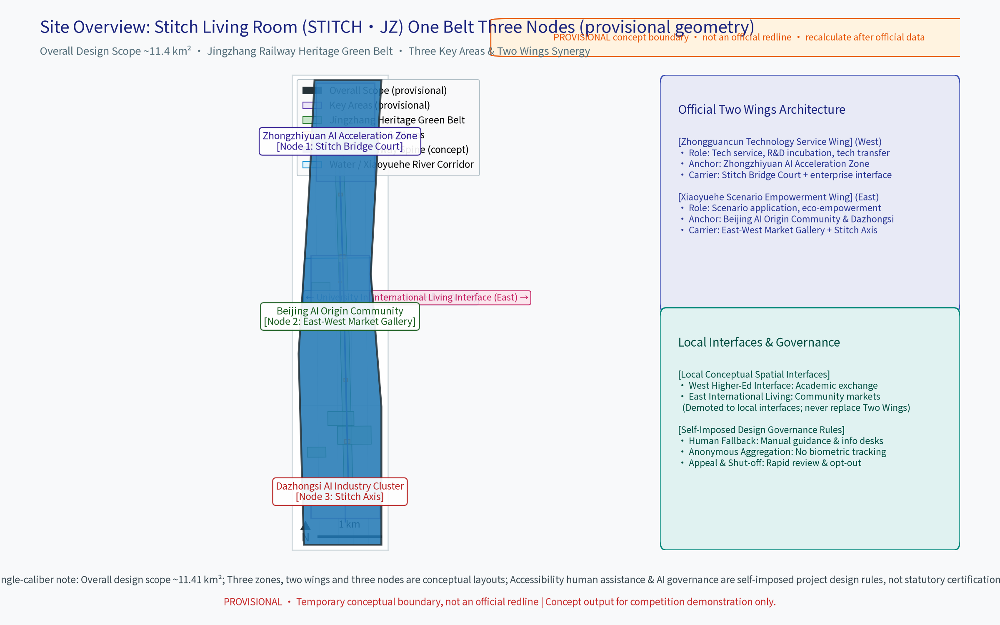
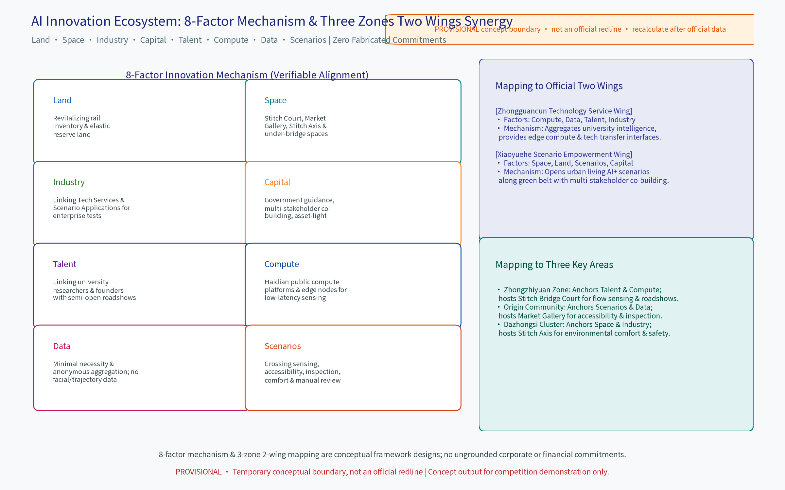
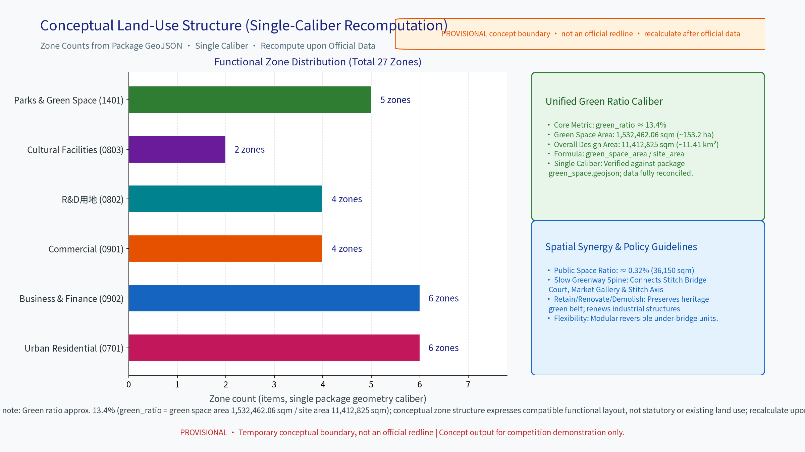
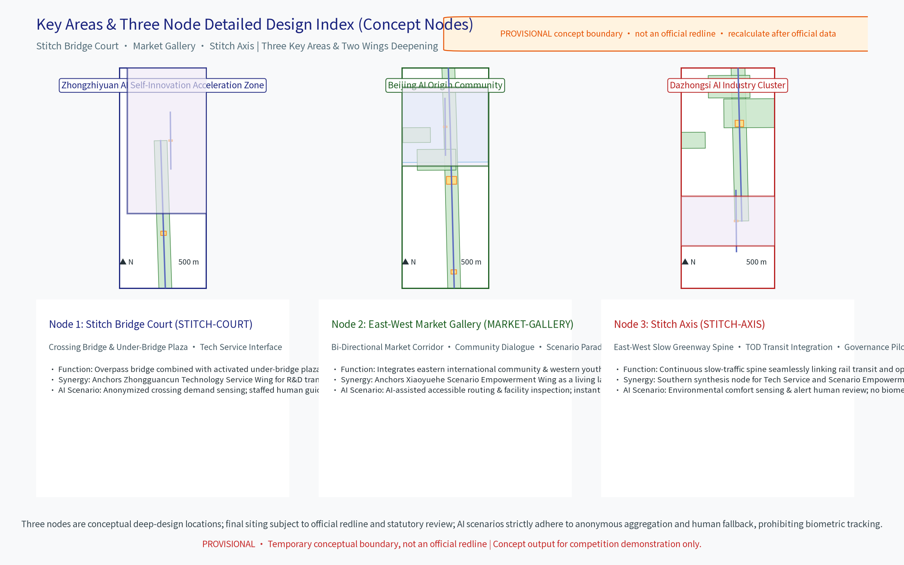
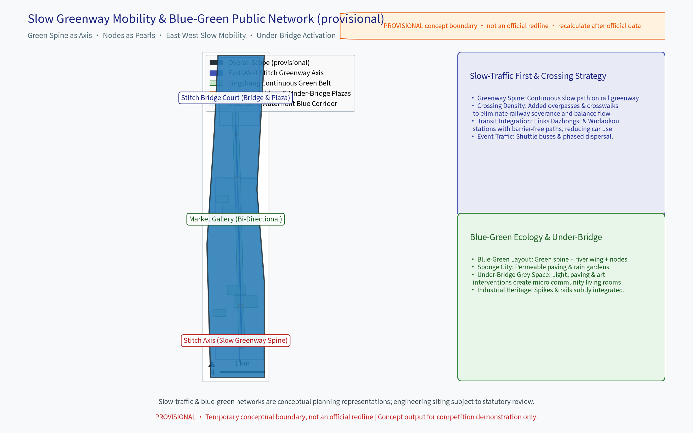
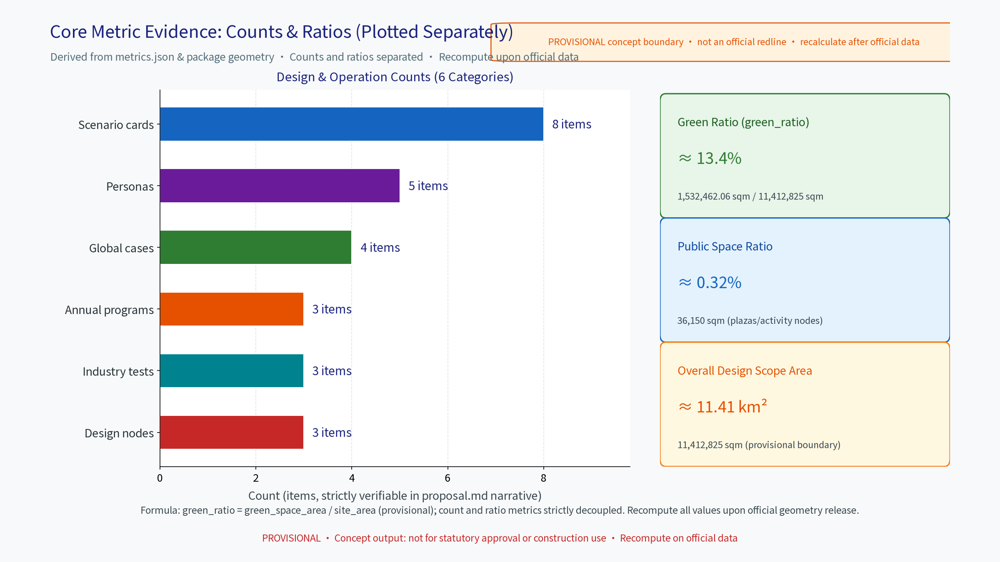

> Section note: This proposal is conceptual research advice for the Open City Haidian International Urban Design Open Call. It does not replace statutory planning and provides no conclusions on FAR, building heights, precise retain-renovate-demolish values, budget, or engineering feasibility. All statements follow published public sources only and are recomputed item by item once official data is published.

## Design Basis and Source List
The design basis relies strictly on public sources aligned with the organizer's call announcement and agent taskbook. The source list distinguishes verifiable materials already obtained and registered in sources.json from materials to be collected during formal deepening (such as site engineering surveying, property ownership, and underground utility data).

References follow official published versions only:
1. Public archives and literature on Jingzhang railway history and Zhan Tianyou's industrial heritage;
2. Published planning policies and municipal government releases for Beijing and Haidian District;
3. Public news reports on the construction and opening of the Jingzhang Railway Heritage Park;
4. International case studies on linear parks and urban rail stitching renewal. Before formal engineering, detailed surveying and statutory planning review must be completed.

> **Evidence anchors**: [source:DATA-SRC-OFFICIAL-ANNOUNCEMENT-20260509], [source:DATA-SRC-AGENT-TASKBOOK-20260518] (Official announcement and agent taskbook serve as textual basis).

## Three-Level Scope Framework
The three-tier framework cascades systematically: Coordinated Research provides regional synergy judgements; Overall Design verifies land-use compatibility, green belt continuity, and placement guidelines; Key Detailed Design Areas ground spatial prototypes into three deep nodes.

The three tiers strictly follow official taskbook calibers:
1. **Coordinated Research Area (~43.6 km²)**: Studies overall synergy in industry, space, and future city innovation across the corridor;
2. **Overall Design Area (~11.4 km², provisional geometry ~11.41 km²)**: Takes the heritage green belt as a stitching interface for urban renewal and regulatory-depth design;
3. **Key Detailed Design Areas (~368.4 ha)**: Elaborates three original nodes—Zhongzhiyuan (Stitch Bridge Court), Beijing AI Origin Community (East-West Market Gallery), and Dazhongsi (Stitch Axis). Data maintains a single-caliber closed loop across all tiers.

> **Evidence anchors**: [source:DATA-SRC-OFFICIAL-ANNOUNCEMENT-20260509], [source:DATA-SRC-AGENT-TASKBOOK-20260518], [metric:site_area_sqm].

## Coordinated Research Area: Industry and Future City Research
The coordinated research identifies the "dialogue effect" of the stitching belt: organizing daily needs of residents, commuters, and tech innovators into bi-directionally accessible public life through overpass public spaces and market activities.

The proposal strictly aligns with the official Two Wings defined in the taskbook:
- **Zhongguancun Technology Service Wing** (Macro Western Synergy): Anchors technology services, R&D incubation, tech transfer, and deep-tech innovation, linking northward to Beiwei Community and Tsinghua Science Park and southward to core Zhongguancun;
- **Xiaoyuehe Scenario Empowerment Wing** (Macro Eastern Synergy): Utilizes the Xiaoyuehe river corridor and eastern urban neighborhoods to provide open application scenarios, smart living paradigms, and ecological empowerment.
The self-drafted "University Intelligence Spatial Interface (West)" and "International Living Spatial Interface (East)" serve solely as local micro-scale urban spatial interfaces and never replace or impersonate the official Two Wings.

> **Evidence anchors**: [source:DATA-SRC-PROVISIONAL-BOUNDARIES-20260605] (Boundary is provisional; scopes are conceptual illustrations).

## AI Innovation Ecosystem & 8-Factor Mechanism
The proposal systematically establishes an 8-factor innovation mechanism (Land, Space, Industry, Capital, Talent, Compute, Data, Scenarios), resolving any previous "six rings / seven items" ambiguities and mapping every factor to the Three Key Areas and Two Wings without fabricating corporate agreements or financial commitments.

### 8-Factor Mechanism & Spatial Synergy Mapping Table

| Factor | Core Mechanism (Verifiable Alignment) | Key Area Carrier | Wing & Interface Synergy |
| :--- | :--- | :--- | :--- |
| **Land (土地)** | Revitalizes railway inventory & inefficient land with elastic reserving | Zhongzhiyuan, Origin, Dazhongsi | Zhongguancun Technology Service Wing provides a service-rule interface; Xiaoyuehe Scenario Empowerment Wing frames green scenarios; no land-supply promise |
| **Space (空间)** | Stitch Court, Market Gallery, Stitch Axis & under-bridge activation | Stitch Court, Market Gallery, Axis | Both official wings organize functional interfaces; the Stitch Axis and under-bridge micro-parlors are self-defined spatial interfaces |
| **Industry (产业)** | Links tech services & scenario tests for cross-street enterprise testing | Dazhongsi Cluster & Zhongzhiyuan | Zhongguancun Technology Service Wing leads the service interface; Xiaoyuehe Scenario Empowerment Wing provides an application-test interface, with no named enterprise implied |
| **Capital (资金)** | Government-guided, multi-stakeholder co-building & asset-light renewal | Phased across 3 Key Areas | Both official wings propose phased, asset-light co-building; no funding source, amount, or public investment is promised |
| **Talent (人才)** | Links university researchers & entrepreneurs with semi-open roadshows | Zhongzhiyuan Acceleration Zone | Zhongguancun Technology Service Wing provides a connection interface; the University Intelligence Interface is only a self-defined micro-scale social interface |
| **Compute (算力)** | Uses verifiable public compute resources & edge nodes as a low-latency concept interface | Zhongzhiyuan & Dazhongsi | Zhongguancun Technology Service Wing proposes compute-access routing; no specific platform, company, or supply commitment is implied |
| **Data (数据)** | Minimal necessity & anonymous aggregation; no biometric/trajectory retention | Full-line mobility & plaza sensing | Xiaoyuehe Scenario Empowerment Wing carries transparent public scenarios; the International Living Interface is only a self-defined service-user interface |
| **Scenarios (场景)** | Flow sensing, accessibility, inspection, comfort & manual alert review | Origin Community (Living Lab), Dazhongsi | Xiaoyuehe Scenario Empowerment Wing is the primary carrier; Origin and Dazhongsi are conceptual test nodes, with no partnership or approval implied |
 
### Four-carrier factor flow (conceptual interfaces, not partnership or supply commitments)

| Carrier | Main incoming factors | Translation / output | Mechanism and boundary |
| :--- | :--- | :--- | :--- |
| **Zhongzhiyuan AI Autonomous Innovation Acceleration Area** | Talent, compute, industry, space | Via the Zhongguancun Technology Service Wing, turns R&D questions and validation needs into testable interfaces for the three nodes; sends reusable solution cards to the AI Origin Community | Roadshows, compute routing, and small pilots remain subject to later confirmation; no specific company or platform is named |
| **AI Origin Community** | Data, scenarios, public-service space | Via the Xiaoyuehe Scenario Empowerment Wing, translates public needs from residents, visitors, and enterprises into anonymous aggregated scenario cards, feeding Zhongzhiyuan and Dazhongsi | Minimum-necessary aggregation, human review, appeal, and shut-off are self-imposed governance rules |
| **Zhongguancun Technology Service Wing (official taskbook wing)** | Service rules and interfaces for land, space, industry, capital, talent, and compute | Offers recommendations for technology transfer, resource routing, and pilot-entry conditions for Zhongzhiyuan and Dazhongsi | Rules and interfaces only; no funding, company, policy, or approval is promised |
| **Xiaoyuehe Scenario Empowerment Wing (official taskbook wing)** | Data, scenarios, space, public services, and ecological interfaces | Organizes open scenarios, public experience, feedback, and shut-off loops for the AI Origin Community and Stitch Axis | Scenario opening, events, and operations are conceptual mechanisms requiring later co-design and professional review |

Five AI+ scenarios strictly adhere to self-imposed "anonymous aggregation + human review" governance rules, prohibiting biometric surveillance:
1. **Crossing-demand anonymized sensing & signal allocation**: Counts pedestrian flows and waiting durations to optimize crossing green times dynamically;
2. **AI-assisted accessible crossing**: Supports visually and mobility-impaired users with continuous slope guidance, backed by a staffed human guidance desk and paper information;
3. **Public space facility inspection AI**: Automatically monitors pavement damage, lighting, and barrier-free facilities to generate maintenance tickets;
4. **Environmental comfort sensing & microclimate advice**: Senses temperature, wind, and shading to broadcast outdoor comfort suggestions;
5. **Content & safety alert human review**: Monitors market and event safety, requiring manual review for all alerts with instant appeal and shut-off channels.

> **Evidence anchors**: [source:DATA-SRC-AGENT-TASKBOOK-20260518], [metric:persona_count], [metric:scenario_node_count].

## Overall Design Area: Urban Renewal & Regulatory-Depth Urban Design
The overall design takes the heritage green belt as a continuous stitching interface linking eastern and western neighborhoods, studying functional complementarity and flexible space conversion (daily leisure vs. festival markets).

Regulatory-plan-level methods are used to verify land-use compatibility, public space controls, and placement guidelines. Following incremental micro-renewal, small-scale acupuncture interventions replace massive demolition. Across the whole package, the green ratio is reconciled to a single caliber of ~13.4% (green_space_area = 1,532,462.06 sqm / site_area = 11,412,825 sqm), and the public space ratio is ~0.32% (36,150 sqm).

> **Evidence anchors**: [source:DATA-SRC-MOHURD-CONTROL-DETAILED-PLANNING], [source:DATA-SRC-PROVISIONAL-BOUNDARIES-20260605], [metric:green_ratio].

## Detailed Design of Key Areas
All three nodes are conceptual locations subject to statutory, heritage, and departmental review before formal placement. The green belt route between them forms an integrated stitching sequence:
- **Node 1: Stitch Bridge Court** (Zhongzhiyuan Zone): Combines pedestrian overpasses with activated under-bridge plazas, converting passive crossing into active dwell and youth tech roadshow spaces;
- **Node 2: East-West Market Gallery** (Beijing AI Origin Community): Flexible market corridor with interchangeable bilateral functions, merging international community lifestyle with university creative energy;
- **Node 3: Stitch Axis** (Dazhongsi AI Industry Cluster): Continuous east-west slow mobility spine seamlessly connecting Dazhongsi transit station with open park spaces.

> **Evidence anchors**: [data:PACKAGE-GEOMETRY] (Three node polygons derived from geometry/key_areas.geojson).

## Land Use, Building Scale, and Retain-Renovate-Demolish Policy
The retain-renovate-demolish policy adheres to preserving heritage green belts and historical railway stations, renovating inefficient industrial structures into cultural, market, and workspace facilities, and restricting demolition strictly to sporadic dilapidated buildings verified on a case-by-case basis.

The proposal gives no statutory FAR, building heights, or investment figures, leaving detailed determinations to statutory surveying and municipal review.

> **Evidence anchors**: [source:DATA-SRC-MNR-LAND-USE-CLASSIFICATION-202311] (Land use classification follows current national standard nomenclature).

## Transportation, Rail Transit, Municipal Utilities, and Public Services
Slow-traffic-first principles guide traffic organization: the Stitch Axis connects east-west pedestrian corridors with denser crossing overpasses and crosswalks. Event traffic is organized around rail transit plus shuttle connections with phased dispersal.

Municipal utilities are sized for dual daily/event peak loads, and under-bridge spaces adhere strictly to fire and structural safety codes. Public services incorporate standardized modular units (mobile restrooms, nursing rooms, first-aid, storage) with human review and fallback for all automated decisions.

> **Evidence anchors**: [source:DATA-SRC-MOHURD-URBAN-DESIGN-MEASURES] (Methodological reference for municipal and mobility design).

## Blue-Green Space, Public Space, and Urban Character
The blue-green framework forms a "green spine as axis, river as wing, nodes as pearls" structure, integrating rain gardens and permeable pavement for sponge city resilience.

Under-bridge grey spaces are revitalized with lighting, paving, and artistic micro-interventions. Architectural character subtly reinterprets industrial railway memories (rails, spikes, signals) with contemporary restraint rather than historicist replicas.

> **Evidence anchors**: [source:DATA-SRC-MOHURD-URBAN-DESIGN-MEASURES] (Methodological reference for blue-green space organization).

## Renewal Project List, Implementation Policy, and Phasing Plan
A three-phase conceptual implementation schedule guides rollout:
- Near-term (1–3 years): Crossing density upgrades, node pilots, and initial under-bridge activation;
- Mid-term (3–5 years): Function renewal around nodes and bilateral business linkage;
- Long-term (5–10 years): Full corridor integration and brand operation.
Annual brand programs include the East-West Community Stitch Festival, Under-Bridge Market Month, and Slow Greenway Exploration Day.

> **Evidence anchors**: [source:DATA-SRC-AGENT-TASKBOOK-20260518] (Phasing aligned with taskbook requirements).

## Metric System, Area Recomputation, and Compliance Matrix
A comprehensive metric system covers crossing continuity, accessibility coverage, green belt continuity, under-bridge utilization, and AI human review rates (registered in metrics.json). All areas are computed from package geometry on provisional boundaries and will be recalculated upon official GIS data release.

> **Evidence anchors**: [metric:green_ratio], [metric:public_space_ratio], [data:PACKAGE-GEOMETRY].

## Risk, Copyright, and Compliance Statement (Scope Narrowing)
This proposal is conceptual research design and does not constitute statutory planning approval or engineering conclusions.

### Explicit Scope Narrowing of Legal Citations
1. **Barrier-Free Environment Creation Law (Article 39)**: The statutory requirement for on-site manual guidance applies strictly to expressly listed public service halls (medical, social security, financial, telecommunications, and utility-payment halls) and cannot be generalized to all open public spaces or digital interfaces. The manual assistance desks, paper maps, and human-operated kiosks proposed in this project represent **self-imposed human-centred design governance rules** rather than sweeping legal certifications.
2. **Generative AI Service Interim Measures**: This regulation primarily governs generative AI services provided to the public within mainland China and does not automatically govern every non-generative urban sensing, traffic-dispatch, or facility-inspection system. Applicability depends on whether a service is a public generative-AI service. The safety review, human verification, appeal, and shut-off mechanisms proposed herein represent **self-imposed project design standards**.
3. **Data Privacy Bottom Line**: Strict adherence to minimal necessity and anonymous aggregation ensures no biometric recognition or individualized movement tracking across all public spaces.

> **Evidence anchors**: [source:DATA-SRC-OFFICIAL-ANNOUNCEMENT-20260509], [source:DATA-SRC-BARRIER-FREE-ENVIRONMENT-LAW], [source:DATA-SRC-GENERATIVE-AI-INTERIM-MEASURES].

## References
References follow published government versions: historical archives of the Jingzhang Railway, planning policies for Beijing and Haidian District, linear park precedents, accessibility design standards, and field survey notes. All verified items are registered in sources.json.

> **Evidence anchors**: [source:DATA-SRC-OFFICIAL-ANNOUNCEMENT-20260509] (First item in reference registry).

## Annex I: Main Proposal Name Suggestions
- Primary Name: "Stitch Living Room · Bilateral Parlor (缝合客厅 · 东西同厅)" — Original title expressing physical stitching and neighborhood dialogue.
- Alternatives: "Needle & Thread Plan (穿针计划)", "Dual-Faced Jingzhang (双面京张)".

## Annex II: User Personas (5 Categories)
- **University Faculty, Students & Researchers**: Frequent cross-line commuters requiring semi-open roadshow spaces and flexible study tables.
- **AI & Tech Enterprise Practitioners & Founders**: Commuters seeking open interfaces for product testing, networking, and industry exchange.
- **International Community Residents & Families**: Seeking walkable green paths, vibrant weekend markets, and multilingual family-friendly spaces.
- **Elderly Residents & Children in Older Neighborhoods**: Relying on resting benches, safe walking paths, and accessible public service amenities.
- **Persons with Reduced Mobility & Stroller Families**: Requiring seamless barrier-free overpasses and dedicated manual support kiosks.

## Annex III: Global Benchmark Precedents (4 Cases)
- **New York High Line (USA)**: Elevated rail transformed into a linear public park, validating railway heritage as an urban living room.
- **Seoullo 7017 (South Korea)**: Elevated pedestrian garden stitching severed neighborhoods and activating under-bridge spaces.
- **Promenade Plantée, Paris (France)**: Pioneer rail linear park providing continuous slow mobility and arcade activation.
- **The 606, Chicago (USA)**: Multi-neighborhood greenway connecting communities with active event programming.

## Annex IV: Domestic Benchmark Precedents (4 Cases)
- **Shougang Park, Beijing**: Industrial heritage renewed into innovation and public spaces.
- **West Bund, Shanghai**: Industrial waterfront transformed into AI innovation and cultural commons.
- **Dasha River Ecological Corridor, Shenzhen**: Linear greenway stitching communities and high-tech parks.
- **Mengzhuiwan, Chengdu**: Waterfront micro-renewal integrating neighborhood street markets and daily vitality.
