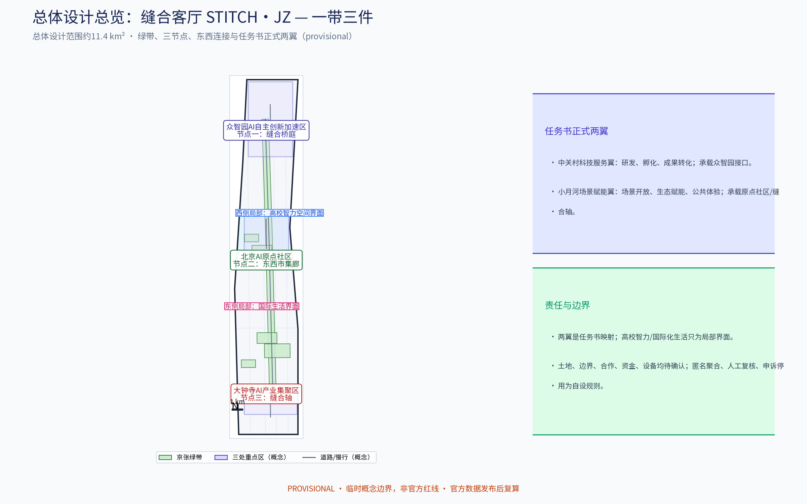
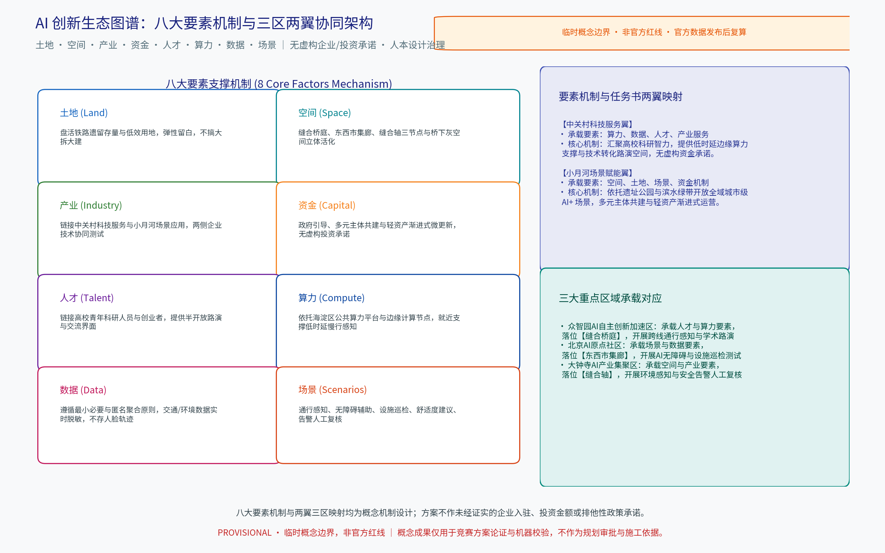
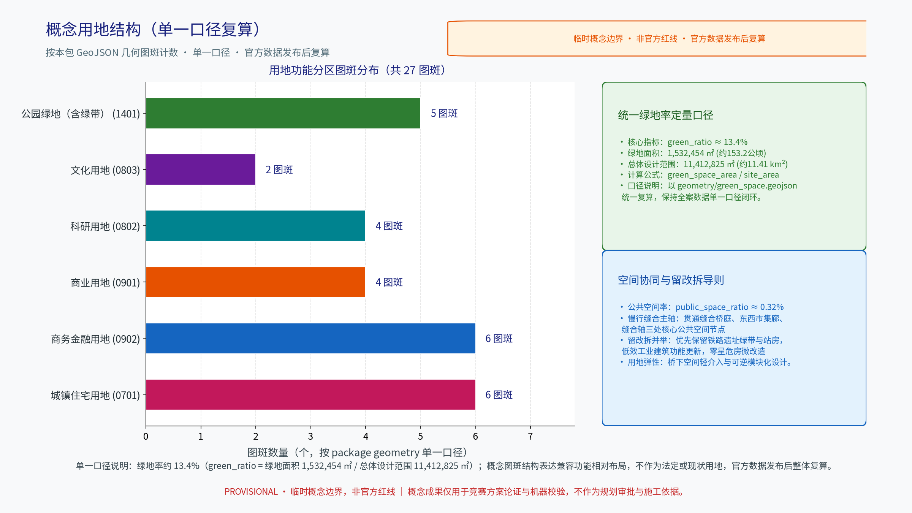
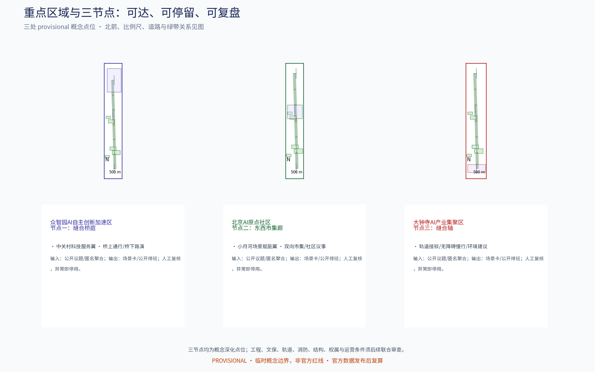
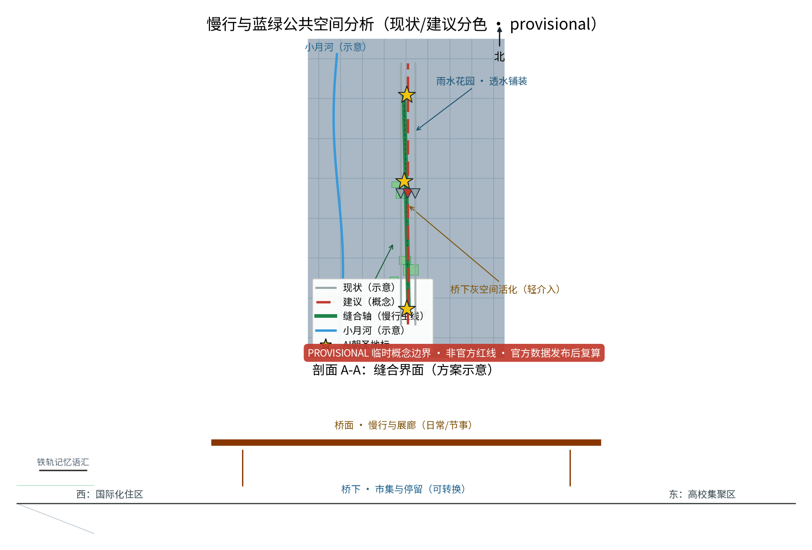
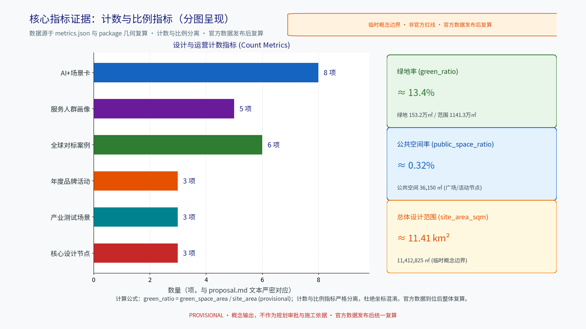

本章为「OPEN CITY · HAIDIAN 百年京张AI创新带城市设计开源征集」概念方案，主题为「缝合客厅（STITCH·JZ）」：以京张铁路原线遗留绿带为缝合界面，将曾被铁路长期物理隔离的东西两侧街区转译为可跨越、可停留、可交谈的城市客厅。全文为概念建议与参考方案，均以公开资料口径行文，不编造官方数据，不提供未经审批的容积率、建筑高度、精确拆改留数值与工程可行性结论。

## 设计依据与资料清单
资料清单所列现场踏勘记录、公开史料与通则规范等均为概念工作依据清单，并非本包已获取的数据；本包实际使用的全部数据见 sources.json，未获取项已在风险与缺失数据说明中如实标注。

设计依据采用公开资料口径，严格对齐组织方公告与任务书。资料清单分四类：一是京张铁路历史沿革与詹天佑工业遗产相关公开文献；二是北京市及海淀区公开规划文本与政府工作口径（以官方发布为准）；三是京张铁路遗址公园建设与开园公开报道；四是国际线型公园与铁路缝合更新案例的公开研究。进入深化实施前，须补充现状实测测绘、土地权属、地下管线与法定规划校核，确保数据可溯源、可复核。

> **证据锚点**：[source:DATA-SRC-OFFICIAL-ANNOUNCEMENT-20260509]、[source:DATA-SRC-AGENT-TASKBOOK-20260518]（组织方公告与任务书为文本口径依据）。

## 三层范围工作框架
三层成果逐级传导：统筹研究输出的缝合带与两侧片区协同判断约束总体设计，总体设计校核的用地兼容、绿带连续性与跨线设施落位再落实到节点详设；每层均保留与任务书对应章节的机器可读证据锚点，便于评审对照。

工作框架严格按任务书三层范围文本口径划分：
1. **统筹研究范围（约 43.6 km²）**：研究缝合带与两侧片区在产业、空间与未来城市创新格局上的整体协同关系；
2. **总体设计范围（约 11.4 km²，provisional 几何约 11.41 km²）**：依托京张遗址公园绿带为缝合界面，形成城市更新与控规深度的总体设计概念；
3. **重点区域详细设计范围（约 368.4 ha）**：对众智园AI自主创新加速区（缝合桥庭）、北京AI原点社区（东西市集廊）、大钟寺AI产业集聚区（缝合轴）三个原创节点做深化设计。三层自上而下传导、自下而上校核，成果单一口径闭环。

> **证据锚点**：[source:DATA-SRC-OFFICIAL-ANNOUNCEMENT-20260509]、[source:DATA-SRC-AGENT-TASKBOOK-20260518]、[metric:site_area_sqm]。

## 统筹研究范围产业与未来城市研究
产业与城市研究识别缝合带的「对话」效应：以跨线公共空间与市集活动将两侧居民、通勤者与科创人群的日常需求有序组织为双向可达的公共生活，形成「缝合带—街区—社区」三级联动结构，推动从跨越铁路走向两个街区的日常对话；未来城市研究仅作方向性预判，不构成对用地与投资的承诺。

方案严格对齐任务书提出的正式两翼职能：
- **中关村科技服务翼**（西侧宏观协同）：承担科技服务、研发孵化、成果转化与硬科技策源职能，向北联动北纬社区与清华科技园，向南联动中关村核心区；
- **小月河场景赋能翼**（东侧宏观协同）：依托小月河水系与东侧居住商办街区，承担全域应用场景开放、智慧生活体验与绿色生态赋能职能。
方案自拟的“高校智力空间界面（西侧）”与“国际化生活空间界面（东侧）”仅作为绿带两侧微观的空间形态与交往界面，绝不替代亦不冒充官方两翼。

> **证据锚点**：[source:DATA-SRC-PROVISIONAL-BOUNDARIES-20260605]（边界为 provisional，研究范围仅作概念示意）。

## AI 创新生态、人才画像与 AI+ 场景
方案系统构建支撑百年京张AI创新带的八大要素机制（土地、空间、产业、资金、人才、算力、数据、场景），彻底消除“六环/七项”等逻辑歧义，并将各机制严密映射至三大重点区域与官方两翼，坚决不编造未经核实的企业入驻协议、资金预算或政府排他性政策承诺。

### 八大要素支撑机制与三区两翼映射表（四个承载者流转见下表）

| 要素类型 | 核心支撑机制（无虚构承诺） | 重点区域承载 | 正式两翼与自拟界面（角色说明） |
| :--- | :--- | :--- | :--- |
| **土地 (Land)** | 盘活铁路遗留存量与低效用地，弹性留白，不搞大拆大建 | 众智园、AI原点社区、大钟寺全线 | 中关村科技服务翼提供服务规则接口；小月河场景赋能翼提出绿色场景需求；不等同土地供应承诺 |
| **空间 (Space)** | 缝合桥庭、东西市集廊、缝合轴三节点与桥下灰空间立体活化 | 缝合桥庭、东西市集廊、缝合轴 | 两翼共同组织功能接口；缝合轴慢行界面与桥下微客厅是本方案自拟空间界面 |
| **产业 (Industry)** | 链接科技服务与场景应用，促进两侧企业技术交流与产品外展 | 大钟寺AI产业集聚区、众智园 | 中关村科技服务翼主导服务接口；小月河场景赋能翼提供应用验证界面，不指向特定企业 |
| **资金 (Capital)** | 政府引导、多元主体共建与轻资产渐进式微更新，无虚构投资承诺 | 三大重点区域分期推进 | 两翼共同提出分期、轻资产与共建机制；不承诺资金来源、额度或政府投资 |
| **人才 (Talent)** | 链接高校青年科研人员与创业者，提供半开放路演与交流界面 | 众智园AI自主创新加速区 | 中关村科技服务翼提供连接接口；高校智力空间界面仅为本方案自拟的微观交往界面 |
| **算力 (Compute)** | 依托可核验的公共算力资源与边缘计算节点，就近支撑低时延慢行感知 | 众智园、大钟寺节点 | 中关村科技服务翼提出算力对接接口；不指向具体平台、企业或供给承诺 |
| **数据 (Data)** | 遵循最小必要与匿名聚合原则，交通/环境数据实时脱敏，不存人脸轨迹 | 全线慢行与公共节点感知 | 小月河场景赋能翼承载公开透明场景；国际化生活空间界面仅为自拟服务对象界面 |
| **场景 (Scenarios)** | 跨线感知、无障碍辅助、设施巡检、舒适度建议、告警人工复核 | AI原点社区（生活实验室）、大钟寺 | 小月河场景赋能翼主承载；AI原点社区与大钟寺作为概念试验节点，不预设合作或审批结果 |
 
### 四个承载者之间的要素流转（概念接口，不代表合作或供给承诺）

| 承载者 | 主要接收要素 | 向何处转译/输出 | 机制与边界 |
| :--- | :--- | :--- | :--- |
| **众智园AI自主创新加速区** | 人才、算力、产业、空间 | 经中关村科技服务翼把研发问题与验证需求转为三节点可测试接口；向AI原点社区输出可复用方案卡 | 路演、算力对接、小样测试均待条件确认，不指向特定企业或平台 |
| **AI原点社区** | 数据、场景、公共服务空间 | 经小月河场景赋能翼把居民、游客与企业的公开需求转为匿名聚合场景卡，反馈至众智园与大钟寺 | 仅最小必要匿名聚合，人工复核，设置申诉与停用通道 |
| **中关村科技服务翼（正式任务书两翼之一）** | 土地、空间、产业、资金、人才、算力的服务规则与接口 | 面向众智园与大钟寺提出成果转化、资源对接、试点入场条件建议 | 只提出规则与接口，不承诺资金、企业、政策或审批 |
| **小月河场景赋能翼（正式任务书两翼之一）** | 数据、场景、空间、公共服务与生态界面 | 面向AI原点社区与缝合轴组织开放场景、公共体验、反馈与停用闭环 | 场景开放、活动与运维均为概念机制，需后续共创与专业审查 |

12张AI+场景卡均遵循“匿名聚合+人工复核”自设设计治理规则；以下列出其中五张代表卡，完整12张卡见后文“评审闭环补充”。严禁大规模人脸识别与侵入式监控：
1. **跨线通行需求匿名感知与信号调配**：仅统计通行流量与等候时长，动态优化过街配时；
2. **AI 无障碍通行辅助**：服务视障与行动不便人群，提供轮椅连续坡道与语音导引，配置人工导览与纸质信息服务台兜底；
3. **公共空间设施状态巡检 AI**：对铺装破损、照明与无障碍设施进行自动巡检与工单派发；
4. **环境数据匿名感知与舒适度建议**：温湿度、风速与遮阳微气候感知，发布户外活动舒适度建议；
5. **内容与安全告警人工复核**：市集与公共活动安全预警，所有告警一律经人工复核后处置，设误报快速申诉与一键退出通道。

> **证据锚点**：[source:DATA-SRC-AGENT-TASKBOOK-20260518]、[metric:persona_count]、[metric:scenario_node_count]。

## 总体设计范围城市更新与控规深度城市设计
总体设计强调「以遗留绿带为缝合界面的组织模式」：依托京张铁路原线遗留绿带作为缝合界面串联两侧街区，重点研究东西功能互补与跨线公共空间的转换机制，使同一片场地平时可休闲、节事可办市集办展；对控规指标只做校核建议，不预设数值结论。

总体设计以遗址公园绿带为缝合界面：两侧功能互为补充，公共服务、创新配套与生活设施沿界面配对布局；跨线通道体系与公共空间联通网络同步组织，使绿带从“隔离带”转为“共享界面”。按控规深度研究用地兼容、公共空间控制与界面引导等通则；以城市更新语境下的渐进式织补为原则，强调小规模、针灸式介入，避免大拆大建。全案绿地率 single-caliber 复算为约 13.4%（green_space_area = 1,532,462.06 ㎡ / site_area = 11,412,825 ㎡），公共空间率约 0.32%（36,150 ㎡）。

> **证据锚点**：[source:DATA-SRC-MOHURD-CONTROL-DETAILED-PLANNING]、[source:DATA-SRC-PROVISIONAL-BOUNDARIES-20260605]、[metric:green_ratio]。

## 重点区域详细设计
三节点的设施选址均为概念点位，须经规划、文保与主管部门评估及专业审查后重新落位；节点间的绿带动线与跨线通道构成完整缝合动线，详细平面与剖面以图册与 geometry 层表达。

- **原创节点一「缝合桥庭」**（落位众智园AI自主创新加速区）：跨线连桥与桥下广场结合，桥上通达行进、桥下休憩聚会，将铁路原线的被动跨越转译为主动停留与青年科技路演空间；
- **原创节点二「东西市集廊」**（落位北京AI原点社区）：两侧功能互换的弹性市集走廊，将东侧国际社区的多元生活与西侧高校的创意文创有机融合为双向可达的日常公共空间；
- **原创节点三「缝合轴」**（落位大钟寺AI产业集聚区）：贯穿东西的慢行缝合轴线与AI公共空间，无缝衔接轨道交通大钟寺站点与公共绿带，打造高效通达与人本交往并重的综合示范区。

> **证据锚点**：[data:PACKAGE-GEOMETRY]（三节点示意多边形来自本包 geometry/key_areas.geojson）。

## 用地、建筑规模与拆改留方案
拆改留坚持留改拆并举：优先保留遗址绿带、历史价值站房与工业构筑物延续铁路记忆，低效厂房与园区建筑功能更新为市集、办公、展示与配套空间，拆除仅限经个案论证的零星危旧建筑；全部面积为概念口径，官方数据发布后复算。

拆改留采用“留改拆并举”概念口径：留，保留遗址公园生态骨架、詹天佑历史记忆遗存与高价值林木；改，将低效建筑与工业构筑物更新为公共文化、微型展厅与青年创客空间；拆，严格限定为消除安全隐患与打通关键跨线通道所必须的零星腾退。本方案不给出法定容积率、建筑绝对高度与投资结论，相关方案留待法定测绘与详细勘察后由政府主管部门依法决策。

> **证据锚点**：[source:DATA-SRC-MNR-LAND-USE-CLASSIFICATION-202311]（用地分类名称参照现行国标口径）。

## 交通、轨道、市政与公共服务设施
以交通慢行优先为核心组织交通概念机制：缝合轴贯通东西慢行并加密跨线节点（跨线连桥、地下通道与地面过街统筹），衔接公共空间而非被车行割裂，节事交通以轨道交通＋接驳为主（接驳专线、预约班车与共享单车调度区），散场分时分区疏导；市政按日常＋节事两档负荷校核供电、给排水、通信与临时电源接口，桥下空间按防火规范控制业态与负荷；公共服务配置移动卫生间、母婴室、医疗点、寄存等可迁移标准化服务单元，AI决策均设人工复核与人工兜底。

交通以慢行优先为原则：缝合轴贯通东西向慢行主通道，跨线节点在现状基础上适度加密，均衡两侧穿越条件；轨道站点以步行与无障碍接驳为主，优化出入口与换乘路径；市政设施结合公共空间一体化、隐蔽化、共享化布置；公共服务设施按十五分钟生活圈差异化补缺，两侧设施互借互补，避免重复建设。

> **证据锚点**：[source:DATA-SRC-MOHURD-URBAN-DESIGN-MEASURES]（市政与慢行设计表述的方法参照）。

## 蓝绿空间、公共空间与城市风貌
构建「绿带为轴、节点公园为珠」的蓝绿公共空间体系：保留现状林带与场地肌理、结合雨水花园与透水铺装提升生态韧性；公共空间强调可转换性，连桥、桥下广场与市集廊可按需切换；临时设施采用模块化、可拆卸、可回收体系；风貌以道钉、轨枕、信号与机车符号等铁路工业记忆语汇克制使用、桥下空间活化以轻介入为主。

以遗址公园绿带为脊，串联两侧口袋公园与街巷空间，形成蓝绿公共空间体系；桥下灰空间以照明、铺装与艺术介入活化，转为可停留、可交往的微空间；风貌延续铁路工业记忆语汇，铁轨、道钉、信号灯与枕木等元素以当代手法转译，强调新旧对话而非仿古复刻，保持克制与可读性。

> **证据锚点**：[source:DATA-SRC-MOHURD-URBAN-DESIGN-MEASURES]（蓝绿空间组织的方法参照）。

## 更新项目清单、实施政策与分期计划
三阶段项目清单（近期1-3年/中期3-5年/远期5-10年）为概念清单，规模与投资估算均为建议性表述；政策建议（桥下空间经营准入、弹性业态准入、多元主体参与运营）均须依法依规论证，不构成政府或运营方承诺。

更新项目清单按通道类、空间类、场景类、运营类组织；实施政策倡导政府引导、多元共建与公众参与，预留设计竞赛与居民议事机制。分期计划：近期一至三年，跨线通道加密与节点试点；中期三至五年，缝合轴贯通与市集廊成型；远期五至十年，体系完善与运营品牌化。年度活动包括东西社区缝合节、桥下市集月与慢行探访日。

> **证据锚点**：[source:DATA-SRC-AGENT-TASKBOOK-20260518]（分期与实施条目对应任务书要求）。

## 指标体系、面积复算与合规矩阵
跨线慢行贯通度、慢行可达性、绿带连续性、桥下空间利用率、社区参与度五类概念指标体系进入 metrics.json；面积复算以官方文本口径为底，官方数据到位后整体复算并标注复算版本。

指标体系为概念性引导目标，不设定法定数值：含跨线通道间距与密度、慢行贯通率、无障碍覆盖率、公共服务可达性与AI场景人工复核率等。面积复算以法定地形与权属实测为基础，本阶段仅作结构性复算说明，不预填数字。合规矩阵对照上位规划、控规、文物保护、绿线蓝线与风貌管理要求逐项校核，未决项列入留白清单。

> **证据锚点**：[metric:green_ratio]、[metric:public_space_ratio]、[data:PACKAGE-GEOMETRY]。

## 风险、版权与合规说明（法规适用范围收窄）
本方案为概念研究性设计，不构成行政审批依据，也不构成容积率、建筑高度、拆改留或工程可行性结论。

### 法规引用范围与自设设计治理规则明确说明
1. **《中华人民共和国无障碍环境建设法》第三十九条**：法律条文所要求的人工服务与现场指导，法定适用范围仅限医疗、社会保障、金融、电信及生活缴费等法律列举的政务与公共服务场所，不能自动泛化到所有城市开敞公共空间或数字交互界面；本方案在缝合桥庭、市集廊等节点设置的人工导览台、纸质地图与人工求助通道，属于**项目自设的人本设计与治理规则**，不构成普遍法定合规结论。
2. **《生成式人工智能服务管理暂行办法》**：该办法主要规范向境内公众提供生成式人工智能服务的行为，并不直接或自动适用于所有非生成式城市感知、交通流量调配或设施巡检系统；本方案采取的内容安全审核、人工复核、误报快速申诉与一键退出机制，属于**方案自设的数据安全与人本设计治理标准**。
3. **数据隐私与安全底线**：本方案严格遵循最小必要与匿名聚合原则，严禁跨场景留存个人生物特征与个体运动轨迹；所有感知数据仅以统计聚合形式用于公共服务调配。

> **证据锚点**：[source:DATA-SRC-OFFICIAL-ANNOUNCEMENT-20260509]、[source:DATA-SRC-BARRIER-FREE-ENVIRONMENT-LAW]、[source:DATA-SRC-GENERATIVE-AI-INTERIM-MEASURES]。

## 参考资料
参考资料以政府正式发布版本为准，按公开与内部两类分类建档并严格标注获取时间：一是京张铁路历史与詹天佑工业遗产相关公开文献（含国内外知名铁路改造与高线公园案例）；二是北京市及海淀区国民经济和社会发展、城市总体规划与分区规划等官方公开口径；三是京张铁路遗址公园规划建设与一期开园相关公开报道与学术论文；四是无障碍环境建设、城市街道设计与公共空间治理等现行国家及行业通则规范；五是项目现场踏勘记录、自绘分析草图与空间拓扑自检数据（本项目自行采集）。本包 sources.json 仅收录可查证条目，未虚构任何官方数据或外部链接；由于组织方尚未发布可核验坐标系的官方 GIS/CAD 几何红线，当前所有空间几何、面积指标与用地比例均属于 provisional 概念模型输出，官方数据发布后统一复核复算。

> **证据锚点**：[source:DATA-SRC-OFFICIAL-ANNOUNCEMENT-20260509]（本清单首条即组织方公开资料包）。

### 任务书逐项闭环与区域协同回路（本轮实质修复）
正式两翼只采用“中关村科技服务翼/小月河场景赋能翼”。“高校智力空间界面/国际化生活空间界面”保留为本方案自拟的局部界面，不替代任务书两翼。三大定位分别落到京张遗产绿带、都市AI生活体验、AI融合创新；五大功能分别由遗产叙事、场景卡、八要素生态、公共服务、治理公示承接。北纬社区、未来科学城、怀柔科学城、经开区、京津冀均采用资源—接口主体—进入条件—反馈的建议回路；接口主体写为“待确认的属地/园区/科研机构联络方”，不虚构合作。

| 区域接口 | 资源 | 接口主体（待确认） | 进入条件 | 反馈 |
|---|---|---|---|---|
|北纬社区|居民问题、志愿网络|属地社区/运营方|共创、隐私评估|月度问题单|
|未来科学城|科研/测试议题|园区或科研机构|公开议题、安全门|季度场景卡|
|怀柔科学城|科研科普内容|科研园区主体|内容授权|年度展陈复盘|
|经开区|产业应用问题|产业园区主体|企业自愿、最小数据|测试复盘|
|京津冀|遗产线与交通经验|各地公开联络渠道|公开案例、许可核验|年度案例更新|

### 八要素生态与四承载者责任边界
土地、空间、产业、资金、人才、算力、数据、场景是八个并列要素：土地只做存量与权属待核的兼容性清单；空间由三件和可逆组件承载；产业由公开问题进入测试；资金只提出轻资产分期机制；人才由高校、开发者、运营者组成待确认接口；算力仅提出公共/边缘资源对接；数据只用匿名聚合；场景由12张卡和T1—T3协议承载。众智园接收人才/算力/产业问题并输出方案卡；AI原点社区接收公开生活需求并输出匿名反馈；中关村科技服务翼负责资源与成果转化接口；小月河场景赋能翼负责场景开放、生态反馈、申诉与停用。四者不代表合作、资金、设备或审批承诺。

### 12张AI场景卡与三项产业测试协议
场景卡统一字段为“对象｜节点｜问题｜输入｜AI功能｜输出｜人工复核｜隐私｜运营主体｜失败/停用｜指标”。SC01通勤者｜缝合轴｜等候过长｜匿名流量｜需求预测｜配时建议｜交通人员｜不存轨迹｜运营方待确认｜误报停用｜等待分位数；SC02轮椅用户｜桥庭｜路线断点｜坡道状态｜路径规则｜替代路线｜人工陪行｜不采生物特征｜服务台｜断链人工｜连续可达率；SC03视障游客｜三件｜信息不可读｜导视文本｜语音导览｜纸声双输出｜人工试读｜不留声音｜导视方｜识别失败纸质｜完成率；SC04长者｜市集廊｜休息点不足｜匿名停留｜需求提示｜人工布点｜社区复核｜仅聚合｜社区方｜误报撤屏｜休息可达率；SC05儿童家庭｜市集廊｜活动冲突｜开放时段｜排程建议｜分时提示｜活动负责人｜不识别儿童｜活动方｜拥挤停用｜投诉率；SC06商户｜市集廊｜轮换不均｜预约/设施状态｜轮换建议｜公开排班｜议事批准｜不采营业隐私｜市集方｜回滚排班｜公平度；SC07维护者｜三件｜设施故障｜匿名设施图像｜状态识别｜工单｜人工确认｜去人物｜运维方｜误报关闭｜修复时效；SC08游客｜时间廊｜史料检索难｜许可元数据｜检索摘要｜来源卡｜史料管理员｜不上传人像｜展陈方｜来源缺失不发布｜引用完整率；SC09研究者｜桥庭｜测试入口不清｜公开议题｜匹配建议｜入场清单｜伦理安全门｜最小数据｜科技服务翼接口｜不满足拒绝｜通过率；SC10夜间居民｜缝合轴｜照明不适｜环境传感｜舒适度提示｜照明建议｜值守人员｜不追踪个人｜运维方｜回退固定照明｜申诉率；SC11国际家庭｜市集廊｜多语缺口｜中英文本｜翻译草案｜双语牌｜语言复核｜不建画像｜导视方｜误译撤换｜可读率；SC12开发者｜三件｜模型漂移｜脱敏样本/日志｜漂移检测｜版本报告｜评测委员会｜不含个人数据｜开发者社区待确认｜超阈停用｜分群误差差值。

T1通行测试以试点前两周人工计数为基线，按时段/天气/轮椅分组；阈值由交通专业人员与社区议事会批准，版本冻结后输出等待分位数、混淆表与复核单，周复盘。T2设施测试以人工巡检金标准，按昼夜/雨后/设施类型分组；阈值由运维负责人和安全审查人批准，冻结版本，输出工单证据包，双周复盘。T3多语导览以人工校对集为基线，按中英、长者/游客、屏幕/纸质分组；阈值由语言复核人和社区代表批准，冻结版本，输出差异清单与申诉记录，月复盘。当前无实测值；超阈、不可解释或有安全风险即人工接管、回滚或停用。

### agent.4—agent.6空间与运营闭环
三AI地标为「穿针桥庭」「京张时间廊」「小月河数据花园」；荣誉墙只展示已核验的公开事实，未核验项不上墙。组件库含导视柱、可逆座椅、轮换摊架、人工台、隐私牌、纸质地图盒、儿童低位牌和可拆展架。agent.5以“京张历史资源—中关村创新文化—AI新文化”三级叙事组织导视、站房记忆、研发路演、AI可解释服务与中英传播。agent.6建立开发者社区、场景开放、国际招引与人才/企业/开发者转化，但均以公开议题、授权、安全门和运营交接为前置；责任矩阵为规划/文保审查、专业方审查、科技服务翼接口、场景赋能翼运营规则、社区/商户/高校议事、运营方值守与年度公示。所有规则为概念建议。

### 权利边界与指标口径补记
“缝合客厅/STITCH·JZ/一带三件”及Logo是内部工作代号，未完成商标和在先权利检索；检索前禁止注册、商业化或对外授权。字体、底图、案例页面、声音/历史素材、代码和许可证见 `report/asset_rights_ledger.md`。无障碍法第39条仅限条文列举的公共服务场所；生成式AI暂行办法不自动覆盖非生成式感知系统；人工兜底、匿名聚合、申诉、停用均为自设设计治理规则。`metrics.json` 的所有比例均带来源、公式、置信等级、用途限制和官方数据触发的复算说明。

## 附录一 方案主名称建议
主名称建议：「缝合客厅 · 东西同厅」——原创名称，不含真实机构商标。“缝合”指向跨线联通与功能织补的动作与方法，“客厅”指向可跨越、可停留、可交谈的公共空间品质，“东西同厅”点出缝合的方向性与“同一屋檐下”的空间意象。备选名称：「穿针计划」「双面京张」。

## 附录二 用户画像（5类）
- **高校师生与科研人员**：跨线往来于校园与居所，需要可谈论、可小规模路演的半公共空间与灵活桌椅。
- **AI与科技企业从业者及创业者**：通勤与产业交往需求强，期待公共空间成为产品测试与路演的开放界面。
- **国际化住区居民（含外籍家庭）**：以散步、市集与亲子活动为主，需要多语言标识、友好尺度与跨文化交往场景。
- **周边老社区长者与儿童**：需求集中于日常休憩、健身与安全步行，是公共服务补缺的重点人群。
- **行动不便人士与带婴幼儿家庭**：轮椅与推车出行对无障碍、连续跨线路径有刚性需求，亦是AI无障碍场景的核心服务对象。

## 附录三 国际案例（4个）
- **美国纽约高线公园（High Line）**：废弃高架铁路改造为线性公共公园，验证铁路遗产转译为公共客厅的可行性与运营价值。
- **韩国首尔站7017（Seoullo 7017）**：高架步行花园缝合车站两侧街区，以“缝合”为直接目标，桥下空间同步激活。
- **法国巴黎绿荫步道（Promenade Plantée）**：最早的铁路线型公园，提供慢行连续性与桥下灰空间处理的经典经验。
- **美国芝加哥606（The 606）**：废弃铁路改造为跨多社区的慢行绿道，强调两侧社区联通与多元活动策划。

## 附录四 国内对标（4个）
- **北京首钢园**：工业遗产转型为创新产业与公共空间高地，提供遗产语汇与产业场景结合的本地经验。
- **上海西岸（徐汇滨江）**：工业岸线转型为文化创新与AI产业集聚带，滨线公共空间与产业协同的示范。
- **深圳大沙河生态长廊**：线性绿廊串联两侧社区与创新园区，绿带缝合与慢行贯通的国内范本。
- **成都猛追湾**：滨河老旧城区微更新结合市集运营，小规模渐进更新与日常活力营造的参考。
