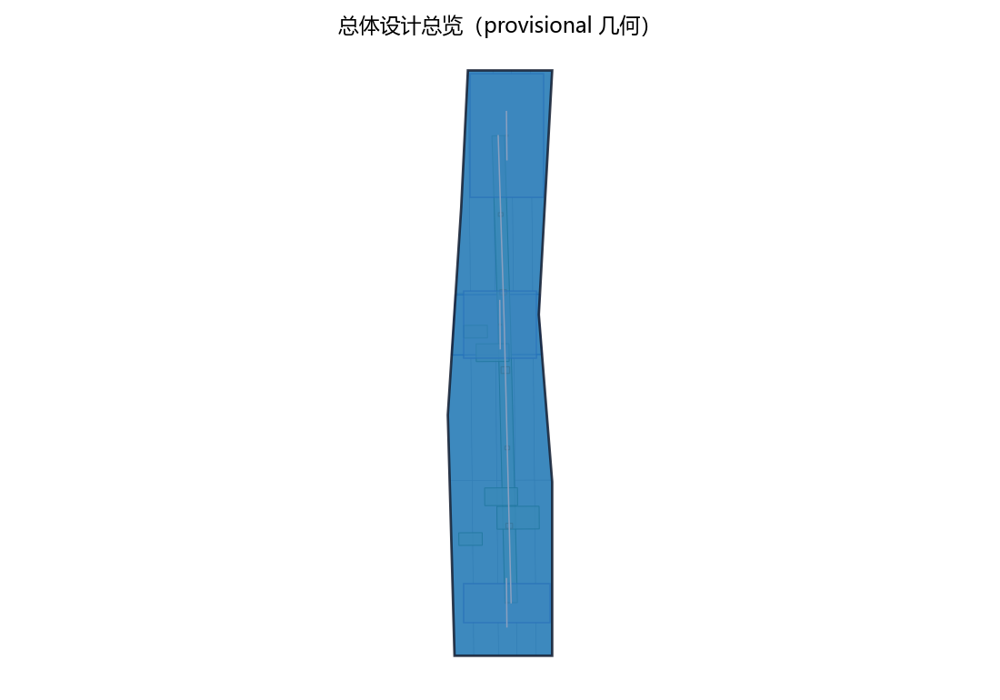
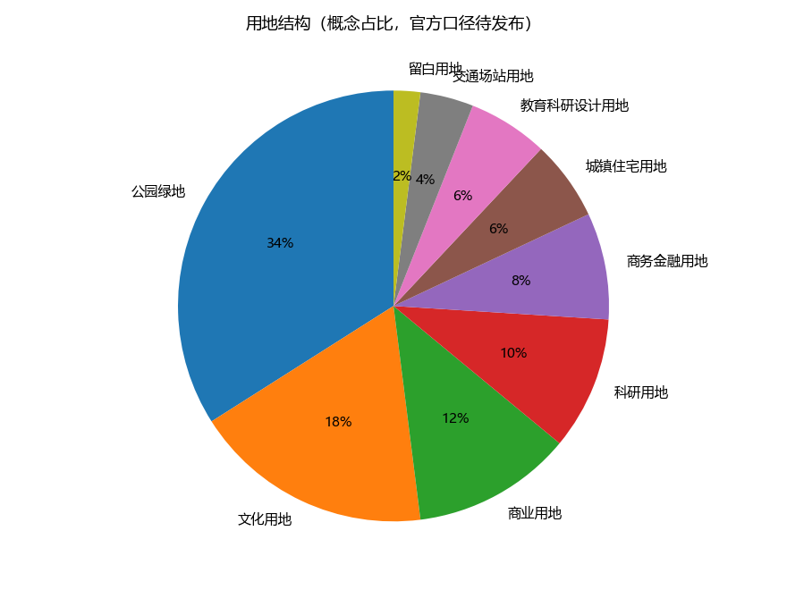
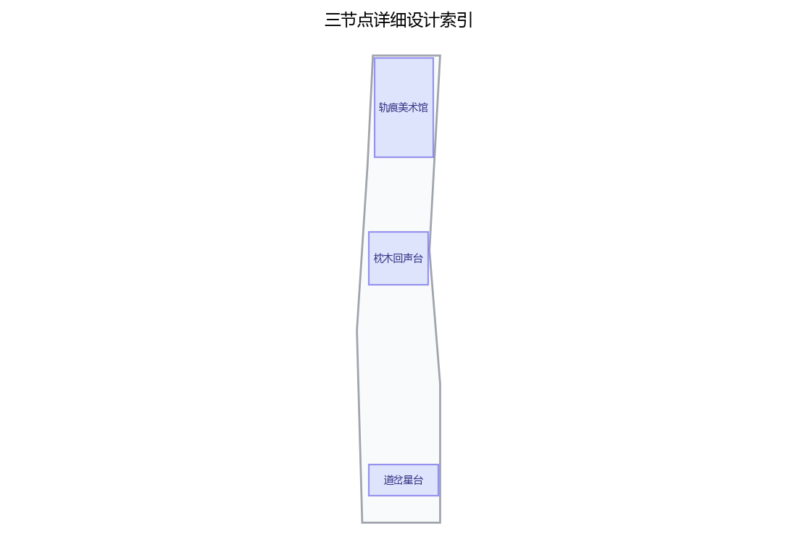
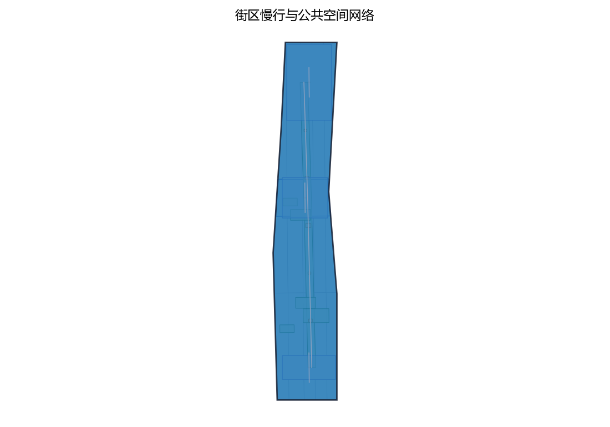
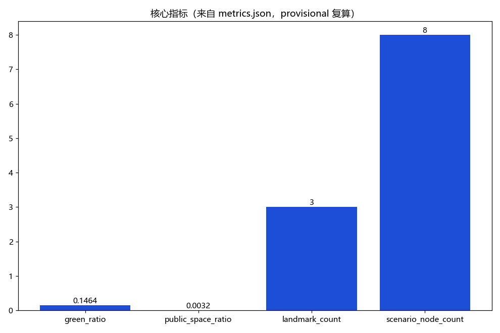

**方案名称与总体构想(概念)**

主名称:「钢弦之带」;英文名:「The Steelstring Belt」(均为原创概念命名,如与既有名称巧合,以官方核名为准)。本期主题为「遗址公园北段铁轨艺术带」——百年京张的钢轨如平放于大地的琴弦,列车驶过时轮缘使其振动发声;今日列车已改走京张高铁,旧轨安静而记忆未止。本方案以「让百年钢轨重新发声」为总体构想:保留双轨线形为空间骨架,以枕木、道岔等遗存为记忆载体,以低干预、可逆的艺术介入为手段,以数字孪生导览、AR 复原、光影交互等 AI 场景为体验引擎,使历史可看、可听、可触、可回应。方案自拟三处原创概念点位——「轨隙美术馆」「枕鸣剧场」「岔光广场」,并以清河站门户与上地/中关村软件园的慢行衔接为触角,呼应三大定位(百年京张文化带、都市AI生活体验带、AI融合创新带)与五大功能。全部落地内容均为概念建议、参考方案,可供专业团队深化研究。

## 设计依据与资料清单

本方案依据以下资料编制,均以公开获取与官方发布为准:①本征集任务书及组织方官方文本(面积与范围表述一律采用官方文本口径);②京张铁路史实——1905—1909 年由詹天佑主持修建、1909 年通车,为中国首条自主设计施工的干线铁路,2019 年京张高铁开通后城市段铁路功能迁移;③京张铁路遗址公园公开资料——北段邻近清河站与上地/中关村软件园,保留铁轨、枕木、道岔等遗存元素;④海淀区三区两翼公开信息(官方文本口径);⑤《北京城市总体规划(2016 年—2035 年)》等公开规划文件,仅作背景参考,不构成法定规划依据;⑥《个人信息保护法》《数据安全法》《无障碍环境建设法》等法律法规;⑦国内外铁路遗产公园、公共艺术与 AI+文旅公开案例研究。特别说明:组织方尚未发布官方边界多边形,现有几何均为 provisional,本方案不使用任何精确坐标与面积数值。

> **证据锚点**：[source:DATA-SRC-OFFICIAL-ANNOUNCEMENT-20260509]、[source:DATA-SRC-AGENT-TASKBOOK-20260518]（组织方公告与任务书为文本口径依据）。

## 三层范围工作框架

任务书明确三层范围:统筹研究范围 43.6 平方公里、总体设计范围 11.4 平方公里、重点区域合计 368.4 公顷(均为官方文本口径)。本方案建立"战略—中观—微观"三层工作框架:统筹层回答"产业与未来城市"之问,输出产业图谱、人才策略与 AI 场景清单;总体设计层回答"城市更新与控规深度"之问,输出空间结构、慢行网络与风貌引导,本层成果仅为设计研究深度,不替代法定规划;重点区域层回答"如何落地"之问,输出三区——众智园 AI 自主创新加速区(约 192 公顷)、北京AI原点社区(约 104 公顷)、大钟寺 AI 产业集聚区(约 72 公顷,以上均官方文本口径)——与本期重点即遗址公园北段铁轨艺术带的详细设计。中关村科技服务翼、小月河场景赋能翼作为产业与空间双翼贯穿三层传导。受官方边界未发布约束,本方案所有落点均为概念点位,线位与规模待官方数据发布后由专业团队复算深化。

> **证据锚点**：[source:DATA-SRC-AGENT-TASKBOOK-20260518]（三层范围划分依据任务书官方文本口径）。

## 统筹研究范围产业与未来城市研究

统筹研究范围 43.6 平方公里(官方文本口径)的产业研究围绕"AI 融合创新带"定位,支撑 AI 全栈自主创新体系与世界级 AI 创新生态:众智园面向自主创新加速,北京AI原点社区面向科学与创业源头,大钟寺面向产业集聚应用,中关村科技服务翼提供服务配套,小月河场景赋能翼提供城市生活试验场景(均为概念建议)。未来城市研究提出"智能化 AI 活力城市"图景:以需求驱动、隐私优先的 AI 服务提升城市体验,数据遵循"告知—同意—匿名聚合—人工复核"原则,不依赖过度监控;面向"AI 治理全球话语权",建议在带内设立 AI 治理对话、展示与国际交流平台(概念建议)。本方案主张把铁轨艺术带提升为联结三大定位的"文化—创新通廊":让创新人才在百年铁路旁工作、生活、散步,使历史记忆成为创新生态的情感锚点。

> **证据锚点**：[source:DATA-SRC-PROVISIONAL-BOUNDARIES-20260605]（边界为 provisional，研究范围仅作概念示意）。

## 总体设计范围城市更新与控规深度城市设计

总体设计范围 11.4 平方公里(官方文本口径)以存量更新为主基调:坚持"轻触式"更新,拆改留统筹、功能织补优先,不追求大拆大建(概念建议)。控规深度城市设计在本方案中仅作研究性深化,输出空间结构与开发强度引导、高度与风貌引导、公共空间与慢行体系等成果,供后续法定程序参考,不构成法定规划结论。结构设想:以遗址公园绿带为核心主轴,两侧街区相向组织"文创—科创"功能带,轨道站点周边强化慢行集散与便民服务(参考方案)。本期聚焦的北段铁轨艺术带,定位为总体设计范围内的示范性公共空间专项:其"锈色钢轨、深灰枕木、暖白灯光"的设计语言与"低干预、可逆、模块化"的介入语法,可作为全带推广的公共空间语法(概念机制),具体线位与边界以官方发布为准。

> **证据锚点**：[source:DATA-SRC-MOHURD-CONTROL-DETAILED-PLANNING]、[source:DATA-SRC-PROVISIONAL-BOUNDARIES-20260605]。

## 重点区域详细设计

重点区域合计 368.4 公顷(官方文本口径),覆盖众智园、北京AI原点社区、大钟寺三区,本方案主张以"产业、生活、文化一体化"统领三区详细设计(概念建议),并将本期深化重点置于遗址公园北段铁轨艺术带。带之命名为「钢弦之带」,设计围绕三项概念机制:其一,保留铁轨线形作为空间骨架——双轨即主轴,枕木间距为模数,一切新介入均在"轨枕网格"内定位,保证线形可读;其二,铁路遗存元素登记建档——为铁轨、枕木、道岔、道钉逐一建立"遗存登记卡",线上档案与线下铭牌对应,公众可认养、可参与口述史采集(概念机制);其三,低干预艺术介入与公共艺术体系——按"不落地(悬挂、投影)、可逆装置(不焊钢轨、可整体移除)、经评估的永久作品"三级控制,公共艺术经策展人、公众投票与专家委员会联合遴选,并设维护基金与艺术家养护公约(概念机制)。三处原创概念点位:①「轨隙美术馆」(概念点位)——沿轨隙设露天展廊,以"每格枕木一件作品"布展,利用沿线旧构筑改造为展厅(参考方案);②「枕鸣剧场」(概念点位)——下沉式枕木剧场与回声台,以 AI 声景复原(人工校核)再现百年前汽笛与车轮的节奏,兼作社区展演场;③「岔光广场」(概念点位)——道岔原位保留,以岔轨发散线为铺装与灯光母题,设"出发"主题雕塑,为夜间光影核心。三处点位均采用轻量、可逆、可移除构筑(概念机制)。

> **证据锚点**：[data:PACKAGE-GEOMETRY]（三节点示意多边形来自本包 geometry/key_areas.geojson）。

## AI 创新生态、人才画像与 AI+ 场景

人才画像(概念):面向四类人群——AI 原点社区的科学家与学者、众智园的创业团队、上地/中关村软件园的通勤工程师、学院路沿线的高校青年与市民游客,共同需求是工作、交流、实验之外的"日常松弛感"。AI+ 场景至少六类(均为概念建议):①铁轨数字孪生导览:轻量数字孪生叠加手机端语音图文导览,按点位推送;②AR 百年铁路复原:沿线叠加 1905—1909 年建造场景与列车复原影像,内容经历史专家与人工复核后上线;③艺术装置互动:踩枕木发声、挥手触发光影等装置,互动数据仅本地即时反馈、不留存;④夜跑光影智能联动:注册制夜跑者经授权后触发沿轨灯光跟随,数据去标识化匿名聚合,仅用于人流密度统计与照明节能;⑤无障碍智慧导览:语音播报、盲文轨标、震动地贴与轮椅友好坡道,播报内容人工录制复核;⑥声景档案库:铁轨、风、雨、人声的授权采集与 AI 再生,人工筛选入库。隐私与合规边界:一切采集以明确告知与同意为前提,数据默认本地处理,跨端仅传匿名聚合统计;不设人脸识别,不追踪个体轨迹,不做行为画像,不用于任何监控用途;AI 生成与推送内容一律人工复核后发布(硬性边界)。

> **证据锚点**：[source:DATA-SRC-GENERATIVE-AI-INTERIM-MEASURES]（AI 生成内容治理表述的参照依据）。

## 用地、建筑规模与拆改留方案

用地(概念建议):铁轨艺术带以公园绿地与公共空间为绝对主体,沿线仅设少量文化、服务与运营配套点;铁轨、枕木、道岔等遗存占地原状保留,不计入可建设规模。建筑规模(概念建议):坚持"少建筑、轻建筑、可逆建筑"——近期以既有构筑改造为主,新建永久建筑建议保持极低水平乃至为零,参考性规模区间待官方边界与现状图发布后由专业团队深化研究,本方案不提供精确数值。拆改留(概念机制):以"留"为底线——遗存元素按登记建档结果分级保护(原位全保、原状半保、可移位展示),任何拆除须专家论证并公开征求意见;"改"以织补为主,沿线围挡拆除、低效停车场活化、桥下空间利用等均为参考方案;"拆"仅限经评估确认无保留价值的危旧构筑,且须履行法定程序。以上全部为概念建议,不构成法定规划结论。

> **证据锚点**：[source:DATA-SRC-MNR-LAND-USE-CLASSIFICATION-202311]（用地分类名称参照现行国标口径）。

## 交通、轨道、市政与公共服务设施

交通与轨道(概念建议):铁轨艺术带内部为纯慢行空间,慢行绝对优先、全线无障碍贯通,并与遗址公园整体慢行网络无缝衔接,进而与知春路、中关村大街、学院路等沿线节点连通——这是本方案的基本立场。北端以清河站为门户锚点,建议设站前慢行优先的"下车即入园"衔接,含风雨连廊与集约非机动车停放(参考方案);与上地/中关村软件园之间建议设三条参考性慢行通廊,服务通勤与休闲两大人流,具体线位供专业团队深化研究。与轨道站点(清河站、知春路站及学院路沿线车站等,以官方信息为准)衔接处按 800 米慢行优先圈组织(概念标准),带内设共享电瓶接驳与无障碍代步服务(参考方案)。市政(概念建议):照明采用低光污染灯具与分时智能调光,管线合杆共沟、避让遗存,铺装海绵化;夜景联动数据按前章隐私边界匿名聚合。公共服务:沿线设驿站(饮水、卫生间、母婴室)、AED 急救点、无障碍信息台与应急广播,活动期以可移动设施补充。

> **证据锚点**：[source:DATA-SRC-MOHURD-URBAN-DESIGN-MEASURES]（市政与慢行设计表述的方法参照）。

## 蓝绿空间、公共空间与城市风貌

蓝绿空间(概念建议):以遗址公园绿带为骨干,北段与小月河场景赋能翼及周边公园绿地构拟绿色慢行网络,具体衔接线位供专业团队深化;植物以低维护乡土种为主,铁轨两侧设"观赏缝",保证线形与遗存始终可读。公共空间:构建"点(三处概念点位)—线(铁轨主轴)—面(两侧延展广场与口袋空间)"三级体系(概念机制)。四季活动:春"轨道花园"赏花与写生、夏夜跑光影联动、秋"钢轨灯光节"与"铁轨艺术季"、冬光影装置与新春市集;夜间经济以灯光、市集、剧场演出为主,配套时段、音量与光污染管控机制及"不扰民公约",兼顾活力与安宁(概念机制)。城市风貌:确立"锈色钢轨—深灰枕木—暖白灯光"色彩语法,新构筑以玻璃、木、钢的可逆构造为主,与周边高校与软件园风貌形成"工业记忆与现代智识"的对话,风貌引导均为概念建议。

> **证据锚点**：[source:DATA-SRC-MOHURD-URBAN-DESIGN-MEASURES]（蓝绿空间组织的方法参照）。

## 更新项目清单、实施政策与分期计划

更新项目清单(概念建议、参考方案):①遗存类——全线遗存登记建档工程、道岔与铁轨原位保护工程、声景档案库;②空间类——三处概念点位建设、慢行贯通与清河站门户衔接工程、沿线围挡与低效空间织补;③运营类——数字孪生导览平台、无障碍智慧导览系统、活动体系运营。分期计划(概念节奏):近期——完成登记建档,以快闪艺术试点三处点位,上线数字孪生导览,举办首届"铁轨艺术季";中期——深化建设三处概念点位(可逆构筑),完成慢行贯通节点工程,夜间经济常态化运营;远期——全线艺术带完整呈现,与周边城市更新项目联动,形成"政府主导公共空间、社会资本参与运营、艺术家驻留"的成熟机制。实施政策(概念建议):公共艺术基金与社会捐赠、策展人驻留制度、活动备案与影响评估制度。活动体系:年度"铁轨艺术季"、季度"遗址手作市集"、"钢轨灯光节"及不定期"枕鸣音乐会"。全部项目须依法定程序推进,本文仅为概念建议。

> **证据锚点**：[source:DATA-SRC-AGENT-TASKBOOK-20260518]（分期与实施条目对应任务书要求）。

## 指标体系、面积复算与合规矩阵

指标体系(概念建议,供专业团队深化研究):遗存保护类——铁轨线形完整保留率、遗存登记建档覆盖率、原状保留比例(参考目标≥95%);慢行类——无障碍贯通率、轨道站点 800 米圈内慢行连通比例;体验类——导览点位覆盖率、活动年均场次;治理类——AI 场景数据匿名聚合覆盖率、AI 内容人工复核率 100%。各指标值均为概念参考值,须结合实际校核。面积复算:统筹研究范围 43.6 平方公里、总体设计范围 11.4 平方公里、重点区域合计 368.4 公顷、众智园约 192 公顷、北京AI原点社区约 104 公顷、大钟寺约 72 公顷,均为官方文本口径;因官方边界多边形尚未发布,本方案不做精确坐标与面积复算,待官方发布后按统一口径复算校核。合规矩阵:三大定位——文化带对应铁轨艺术带文化机制,体验带对应 AI+ 场景,创新带对应产业与人才策略;五大功能——全栈自主创新对应产业章节,世界级生态对应生态与人才章节,场景赋能对应 AI+ 场景章节,活力城市对应交通与公共空间章节,治理话语权对应 AI 治理与隐私边界章节——逐条对应任务书,形成闭环校核。

> **证据锚点**：[metric:green_ratio]、[metric:public_space_ratio]、[source:PACKAGE-GEOMETRY]。

## 风险、版权与合规说明

风险识别(概念):①遗存保护风险——艺术介入或施工可能损害铁轨枕木,对策为低干预、可逆、施工前遗存评估与全流程监督;②信息风险——官方边界与现状资料未发布,当前几何均属 provisional,落地前必须复算;③隐私风险——AI 场景涉及数据,已按"告知—同意—本地处理—匿名聚合—人工复核"设定硬性边界,并明令禁止监控用途;④运营风险——活动噪音、人流与光污染,通过时段分区、音量管控与影响评估缓解;⑤合规风险——本方案属概念成果,任何落地须经法定规划与审批程序。版权说明:本方案为原创概念文本,主名称「钢弦之带」及三处概念点位名称均为原创命名,如与既有名称或商标巧合,以官方核名与商标检索结果为准;所涉公开资料版权归原作者,使用以官方授权为准。合规声明:本方案不含任何法定规划结论,面积一律采用官方文本口径,所有落地建议均为"概念建议、参考方案、可供专业团队深化研究"。

> **证据锚点**：[source:DATA-SRC-OFFICIAL-ANNOUNCEMENT-20260509]（征集规则为权属与合规表述的依据）。

## 参考资料
参考资料以政府正式发布版本为准；本包 sources.json 仅收录可查证条目，未虚构任何官方数据或链接。

1. 本征集任务书及组织方官方发布材料(以官方发布为准);2. 京张铁路史实文献(1905—1909 年修建、1909 年通车、詹天佑主持修建等公开史料);3. 京张高铁开通与清河站相关公开报道(2019 年);4. 京张铁路遗址公园公开资料与新闻报道;5.《北京城市总体规划(2016 年—2035 年)》等公开规划文件(背景参考);6.《个人信息保护法》《数据安全法》《无障碍环境建设法》等法律法规;7. 国内外铁路遗产公园、公共艺术运营及 AI+文旅公开案例研究。以上资料均以公开获取与官方口径为准,不构成法定依据。

> **证据锚点**：[source:DATA-SRC-OFFICIAL-ANNOUNCEMENT-20260509]（本清单首条即组织方公开资料包）。
