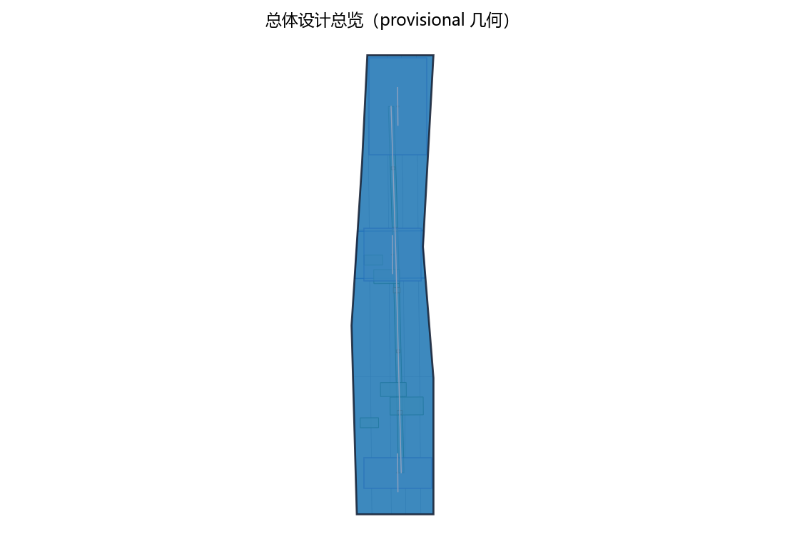
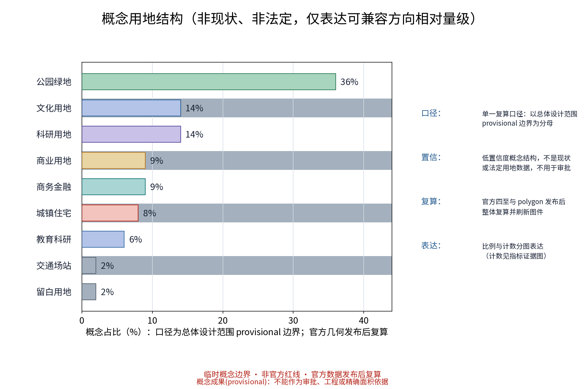
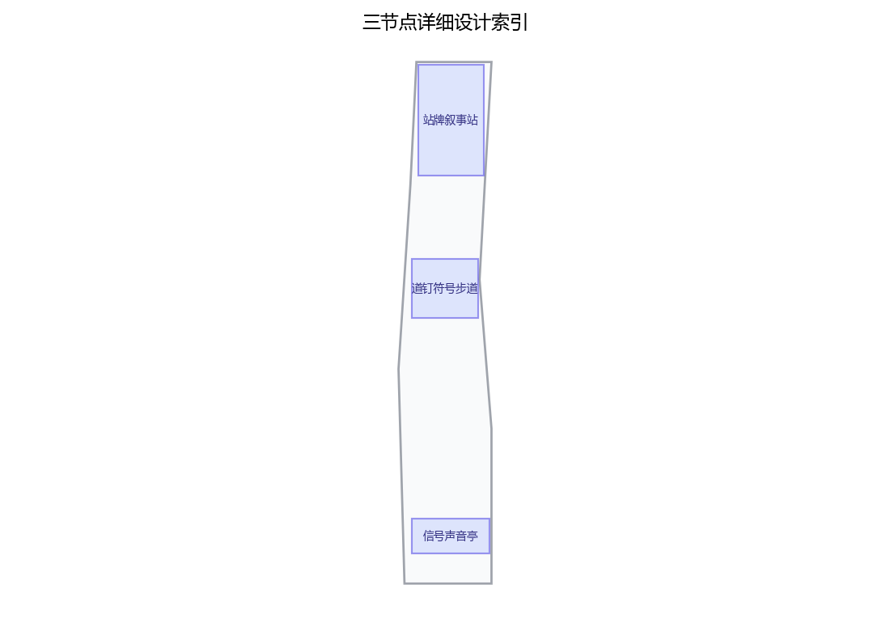
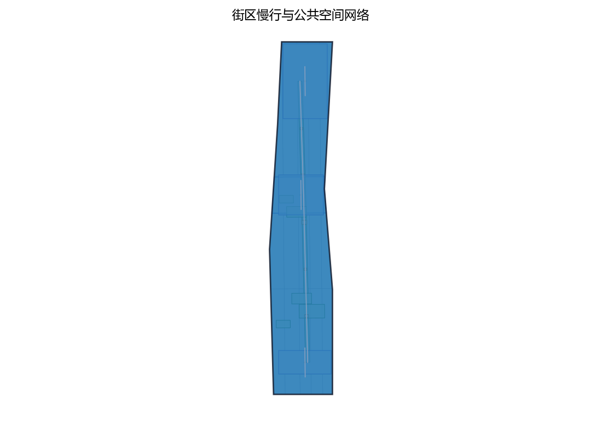
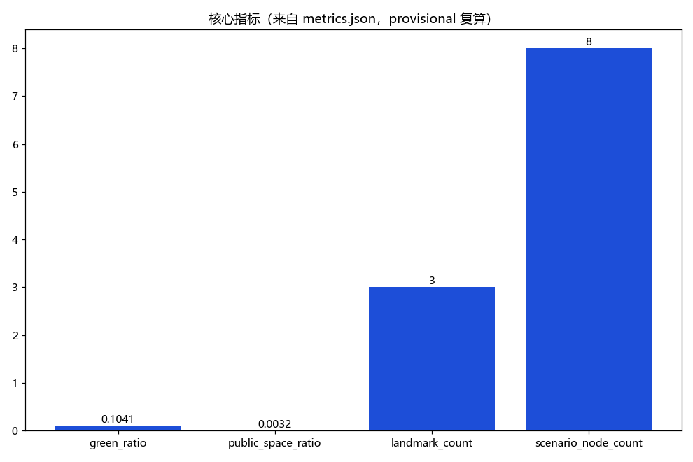

> 章节定位：本草案为概念建议文本，不给出容积率、建筑高度、拆改留数值或工程可行性结论；全部表述以公开资料口径为准，正式编制阶段逐条核定。

## 设计依据与资料清单
资料清单所列现场踏勘记录、公开史料与通则规范等均为概念工作依据清单，并非本包已获取的数据；本包实际使用的全部数据见 sources.json，未获取项已在风险与缺失数据说明中如实标注。

设计依据以公开资料为主：百年京张AI创新带相关公开规划表述、京张铁路历史档案与公开史料、清华园站等站点老照片与旧时刻表、沿线高校院所与科技园区的公开介绍，以及现行公共标识、无障碍与慢行交通相关规范。资料清单包括历史地图、站点老照片、口述史录音与整理稿、现状踏勘影像与访谈记录。本草案不替代法定规划文件，引用版本须在正式编制阶段核定。

> **证据锚点**：[source:DATA-SRC-OFFICIAL-ANNOUNCEMENT-20260509]、[source:DATA-SRC-AGENT-TASKBOOK-20260518]（组织方公告与任务书为文本口径依据）。

## 三层范围工作框架
三层成果逐级传导：统筹研究输出的导视带与沿线片区协同判断约束总体设计，总体设计校核的用地兼容、绿带连续性与标识设施落位再落实到节点详设；每层均保留与任务书对应章节的机器可读证据锚点，便于评审对照。

工作框架分三个层次：第一层为统筹研究范围，研究叙事导视带与沿线科创片区、高校与国际化住区的协同关系；第二层为总体设计范围，以绿带为骨架开展控规深度城市设计，落定导视系统总体概念；第三层为重点区域详细设计，选取三个原创节点做概念深化。三层相互校核：总体概念为节点提供统一叙事语法，节点试验为总体提供可更新的样板。

> **证据锚点**：[source:DATA-SRC-AGENT-TASKBOOK-20260518]（三层范围划分依据任务书官方文本口径）。

## 统筹研究范围产业与未来城市研究
产业与城市研究识别导视带的「可读性」效应：以叙事标识与导览体验将历史认知、文化消费与科创参访有序导入沿线公共服务与产业空间，形成「导视带—片区—社区」三级联动结构，推动从指路标识走向可阅读的城市文本；未来城市研究仅作方向性预判，不构成对用地与投资的承诺。

统筹研究把叙事导视带视为链接科创片区的公共叙事载体：历史线索以站点为纲，当代线索以创新为主题，双线并置形成"百年京张—未来AI"的连续阅读。沿线中关村、五道口、学院路、上地与清河片区的高校、软件园与国际化住区人群，既是使用者也是叙事参与者。研究慢行通勤、午间散步与国际交流等行为链，使导视带成为创新人群每日可接触的公共文化设施，反哺片区的日常活力。

> **证据锚点**：[source:DATA-SRC-PROVISIONAL-BOUNDARIES-20260605]（边界为 provisional，研究范围仅作概念示意）。

## 总体设计范围城市更新与控规深度城市设计
总体设计强调「以遗留绿带为骨架的组织模式」：依托京张铁路原线遗留绿带作为连续骨架串联沿线节点，以全线级—段级—节点级三级叙事层级作为组织线索，标识设施采用模块化、可逆、可更新体系；对控规指标只做校核建议，不预设数值结论。

总体设计以绿带为骨架，把导视系统作为城市设计要素整体落位：沿慢行轴建立"全线总览—分段指引—节点叙事"三级标识架构，统一采用铁路工业语汇（钢轨构件、道钉、信号色彩与旧式字样），避免各段自行其是。标识点位与慢行驻留空间、视线通廊同步组织，形成可识别、可阅读、可更新的连续体验，并为数字内容预留可替换的通用接口。

> **证据锚点**：[source:DATA-SRC-MOHURD-CONTROL-DETAILED-PLANNING]、[source:DATA-SRC-PROVISIONAL-BOUNDARIES-20260605]。

## 重点区域详细设计（三个原创节点）
三节点的设施选址均为概念点位，须经规划、文保与主管部门评估及专业审查后重新落位；节点间的绿带动线构成完整叙事动线，详细平面与剖面以图册与 geometry 层表达。

节点一「站牌叙事站」：以老站牌形制为原型作概念演绎（不复制原件），结合AR扫码呈现站点旧影、车次故事与口述史音频，形成可驻留的故事亭。节点二「道钉符号步道」：将道钉、钢轨与里程符号转译为地面图形标识，标记站距、年份与线路进展，兼具指路与步行计时功能。节点三「信号声音亭」：以铁路信号音为声景线索，提供多语语音导览、盲文与触觉信息，声音与文字互为补充。

本方案按任务书三大定位（百年京张文化带、都市AI生活体验带、AI融合创新带）与五大功能（AI全栈自主创新体系、世界级AI创新生态、AI+场景赋能新范式、智能化AI活力城市、AI治理全球话语权）中的文化传承与叙事标识方向展开，作为「百年京张文化带」的识别与讲述载体（概念映射）。

**场景卡索引（概念）**：AI+场景以场景卡落地，形成可评审、可迭代的运营索引：

| 场景卡 | 落点 | 面向人群 | 运营机制（概念） | 数据与合规边界 |
|---|---|---|---|---|
| 「站牌故事」AR旧影导览 | 「站牌叙事站」 | 游客、学生 | 预约讲解、史实复核 | 端侧处理，不留存个体信息 |
| 「道钉径」步行计时步道 | 「道钉符号步道」 | 通勤者、白领 | 里程积分、轮换主题 | 仅聚合统计，禁止过度监控 |
| 「信号亭」多语声景导览 | 「信号声音亭」 | 老年人与残障人士 | 志愿者值守、人工兜底 | 授权明示、可一键关闭 |
| 「巡检哨」设施巡检AI | 全线导视设施 | 运营方、从业者 | 派单维修、年度评估 | 匿名聚合，人工复核 |
| 「密度调」标识动态调配 | 重点节点 | 游客、家庭 | 实时公示、月度评估 | 聚合密度，不进行个体识别式追踪 |

> **证据锚点**：[data:PACKAGE-GEOMETRY]（三节点示意多边形来自本包 geometry/key_areas.geojson）。

## AI 创新生态、人才画像与 AI+ 场景
多语语音导览与AR历史场景复原为主干场景，每处均配置人工服务兜底；设施巡检AI、密度感知与标识动态调配、史实内容审核复核为支撑场景；仅处理匿名聚合数据、关键决策人工复核双保险，不设过度监控。
AI场景全部遵循"匿名聚合＋人工复核"底线：不采集可识别身份信息、不追踪个体、不用于任何监控目的。五个场景：多语语音导览与AI翻译；AR历史场景复原（虚拟重现须标注"复原示意"）；导视设施状态巡检AI（自动发现破损故障并派单维修）；人流密度匿名感知与标识动态调配（仅以匿名总量调节导览推荐与驻留提示）；史实与内容审核由人工复核把关，AI生成内容未经复核不得上线。AI不改变叙事本体，只降低阅读门槛。

AI场景域覆盖文化、公共服务、空间、治理、产业、交通六域:AI文化(AR旧影复原与声景叙事)、AI公共服务(多语导览与无障碍信息)、AI空间(导视系统与绿带动线)、AI治理(内容审核与数据规则公示)、AI产业(数字内容库与开放许可)、AI交通(驻留提示与动线推荐),各域均以人工复核兜底。

> **证据锚点**：[source:DATA-SRC-GENERATIVE-AI-INTERIM-MEASURES]（AI 生成内容治理表述的参照依据）。

## 用地、建筑规模与拆改留方案
拆改留坚持留改拆并举：优先保留遗址绿带、历史价值站房与工业构筑物延续铁路记忆，低效厂房与园区建筑功能更新为展陈、办公、展示与配套空间，拆除仅限经个案论证的零星危旧建筑；全部面积为概念口径，官方数据发布后复算。

本方案不预设用地规模与建筑面积数值，仅给出"留改拆并举"的概念口径：历史站点与工业遗存以留为主，导视与慢行设施轻介入加建；确需利用的构筑物以修缮改造优先，仅在影响公共安全时考虑拆整，且一律经法定审查程序。所有标识设施均为可逆、可移设计，降低对场地的永久干预，为后续法定规划留出弹性。

> **证据锚点**：[source:DATA-SRC-MNR-LAND-USE-CLASSIFICATION-202311]（用地分类名称参照现行国标口径）。

## 交通、轨道、市政与公共服务设施
以交通慢行优先为核心组织交通概念机制：绿带连续慢行轴贯通沿线节点、标识系统与慢行轴一体化布设避免信息过载，节事交通以轨道交通＋接驳为主（接驳专线、预约班车与共享单车调度区），散场分时分区疏导；市政按日常＋节事两档负荷校核供电、给排水、通信与临时电源接口；公共服务配置移动卫生间、母婴室、医疗点、寄存等可迁移标准化服务单元，AI决策均设人工复核。

交通组织坚持慢行优先：绿带内步行与骑行慢行轴和标识系统一体化设计，标识即指路、指路即叙事。导视带衔接既有轨道站点出入口与公交站点，形成"出站即入线"的动线。公共服务沿慢行轴配置座椅、饮水、避雨与无障碍设施，标识设施尽量与市政灯杆、检修设施整合以减少新增构筑物。本概念不新增轨道线路建议，相关工程问题不在讨论范围。

> **证据锚点**：[source:DATA-SRC-MOHURD-URBAN-DESIGN-MEASURES]（市政与慢行设计表述的方法参照）。

## 蓝绿空间、公共空间与城市风貌
构建「绿带为轴、节点公园为珠」的蓝绿公共空间体系：保留现状林带与场地肌理、结合雨水花园与透水铺装提升生态韧性；公共空间强调可转换性，标识亭、叙事径与声音装置可按需切换；临时设施采用模块化、可拆卸、可回收体系；风貌以道钉、轨枕、信号与机车符号等铁路工业记忆语汇克制使用、避免标语化包装。

蓝绿空间以绿带为主线，串联沿线水绿廊道与可驻留的口袋空间，形成连续的公共空间体系。标识风貌延续铁路工业记忆语汇：以钢、木、铸铁与信号色为基调，字样构图借鉴旧站牌要素，弱化新建感。叙事表达坚持克制，警语化、口号化与广告化内容一律不进入标识体系，让结构与材质自行说话，避免过度装饰。

> **证据锚点**：[source:DATA-SRC-MOHURD-URBAN-DESIGN-MEASURES]（蓝绿空间组织的方法参照）。

## 更新项目清单、实施政策与分期计划
三阶段项目清单（近期1-3年/中期3-5年/远期5-10年）为概念清单，规模与投资估算均为建议性表述；政策建议（叙事内容征集与标识设置审批简化、弹性业态准入、多元主体参与运营）均须依法依规论证，不构成政府或运营方承诺。

实施分三期：近期（1—3年）完成全线导视主系统与三个节点试点，启动年度活动；中期（3—5年）节点全线铺开，建设数字内容库与维护机制；远期（5—10年）随城市更新滚动更新内容并评估迭代。年度活动包括京张叙事导览周、口述史采集工作坊与标识设计共创节，让居民、高校与园区共同参与叙事生产。配套以设计导则、共建共管与开放内容许可等政策工具。

> **证据锚点**：[source:DATA-SRC-AGENT-TASKBOOK-20260518]（分期与实施条目对应任务书要求）。

## 指标体系、面积复算与合规矩阵
叙事标识覆盖率、慢行可达性、绿带连续性、多语内容完整度、公众参与度五类概念指标体系进入 metrics.json；面积复算以官方文本口径为底，官方数据到位后整体复算并标注复算版本。

指标体系以过程性指标为主：标识点位与慢行轴覆盖率、多语与无障碍信息可及率、内容更新周期、设施完好率与人工复核覆盖率，均按概念口径表述。面积复算仅用于校验系统规模量级，不作为承诺数值。合规矩阵对照上位规划、绿线与蓝线管理、文物与历史建筑保护及公共标识相关规范逐项自查，分"符合、待核定、不涉及"三类结论，供正式阶段沿用。

> **证据锚点**：[metric:green_ratio]、[metric:public_space_ratio]、[source:PACKAGE-GEOMETRY]。

## 风险、版权与合规说明
本方案为概念研究性设计，不构成行政审批依据，也不构成容积率、建筑高度、拆改留或工程可行性结论；风险已按节事与日常使用冲突、客流安全、史实表述争议与AI过度监控观感四维度如实登记于 risk.json（应对原则：匿名聚合、最小必要、人工复核、事前公示预案）；引用公开资料均已标注来源并注明获取时间，图形、名称与文字为原创或公共领域素材，若与既有标识雷同属巧合；历史叙事表述设史实核对岗与申诉通道，涉及肖像与口述内容的依法取得授权；正式实施前须完成多部门联审、文物保护与安全评估。

主要风险：史实表述偏差（以人工复核与来源标注对冲）；设施与内容更新停滞（以开放式维护机制对冲）；技术依赖与隐私担忧（以匿名聚合、最小化采集与公开审计对冲）。版权方面，老照片、档案、声音素材须取得合法来源与授权并署名，口述者签署知情同意；原创标识设计自身保留开放许可。本方案为概念建议，不替代法定规划与工程论证结论。

> **证据锚点**：[source:DATA-SRC-OFFICIAL-ANNOUNCEMENT-20260509]（征集规则为权属与合规表述的依据）。

## 参考资料
参考资料以政府正式发布版本为准，按公开/内部分类存档并标注获取时间：京张铁路历史与遗址公园公开材料（含清华园站等站点史料）、沿线高校与科创园区公开信息、北京城市总体规划及分区规划公开口径、标识与解说系统相关通则规范、无障碍与公共安全等通则规范、现场踏勘记录与自绘分析草图（本项目自行采集）；本包 sources.json 仅收录可查证条目，未虚构任何官方数据或链接。

参考资料以公开渠道为准：百年京张AI创新带相关官方发布信息；《京张路工摄影》《京张铁路工程纪略》等公开历史文献；沿线高校、院所与园区公开介绍；现行无障碍、标识与慢行相关规范；高线公园、自由之路等国际案例公开文献。具体版本、图件与数据在正式编制阶段核定补充，本清单不构成引证承诺，不载明未经核验的官方数据。

---

> **证据锚点**：[source:DATA-SRC-OFFICIAL-ANNOUNCEMENT-20260509]（本清单首条即组织方公开资料包）。

## 方案主名称建议

主名称建议为 **「章痕·京张叙事导视带」**（简称"章痕"）。

- "章"取篇章、印章双意——章节化叙事与城市印记；
- "痕"取钢轨之痕、历史之痕——线形遗存与时间痕迹；
- 名称不含任何真实机构名称、商标与官方标识要素，与"京张"地名及公开项目名不构成商标性关联，可放心用作概念方案主名称。
- 备选名：「轨上之章」「声轨漫读」，供评审时替换。

## 五类用户画像

1. **晨读人（高校师生与科研人员）**：以通勤、课后散步与文本考据为主，倾向耐读的史实细节与学术交流空间。
2. **午间漫游者（科创园区从业者）**：午休短时慢行、减压与偶遇式阅读，重视便捷、安静与国际化的驻留点。
3. **跨语旅人（外籍学者、留学生与国际住区居民）**：依赖多语导览与无障碍信息，希望低门槛读懂历史与当代两条叙事线。
4. **周末家庭（沿线在地居民与亲子群体）**：参与导览周、口述史工作坊与共创节，看重教育性、参与感与安全性。
5. **铁轨迷与城市漫游者（铁路爱好者、摄影与city walk人群）**：追求深度叙事、AR体验与细节考据，分享行为应被克制引导而非刺激。

## 国际案例对标（3—4个）

1. **美国波士顿自由之路（Freedom Trail）**：地面印记式叙事导览的经典，自导览、多语与低设施干预，为"道钉符号步道"提供参照。
2. **德国柏林墙之路（Berliner Mauerweg）**：线性纪念叙事的连续慢行系统，分段解说与地面标识组织严密，为全线三级标识架构提供参照。
3. **新加坡铁道走廊（Rail Corridor）**：前铁路线整体更新为生态慢行带，历史叙事与自然体验并存，为绿带骨架下的克制设计提供参照。
4. **美国纽约高线公园（The High Line）**：线性工业遗产公共空间与艺术叙事的更新样板，其"少即是多"的语汇可用于风貌克制性校验。

## 国内项目对标（3—4个）

1. **北京首钢园**：大型工业遗存整体更新与叙事性公共空间的标杆，可参照其遗存分级叙事与标识统一方法。
2. **上海杨浦滨江**："工业锈带"转"生活秀带"的滨水公共空间实践，工业遗存叙事与导视体系结合紧密。
3. **成都东郊记忆**：铁路工业遗存改造为文化园区的叙事运营案例，可参照其内容持续更新的机制。
4. **哈尔滨中东铁路公园**：以铁路遗址为骨架的线形公园，站台与机车的遗存叙事方式与本方案场景相近。

---

*以上全部内容均为概念建议：不含规划数值结论、不预设拆改留结果、不涉及工程可行性判断，不编造官方数据与引证承诺。*
