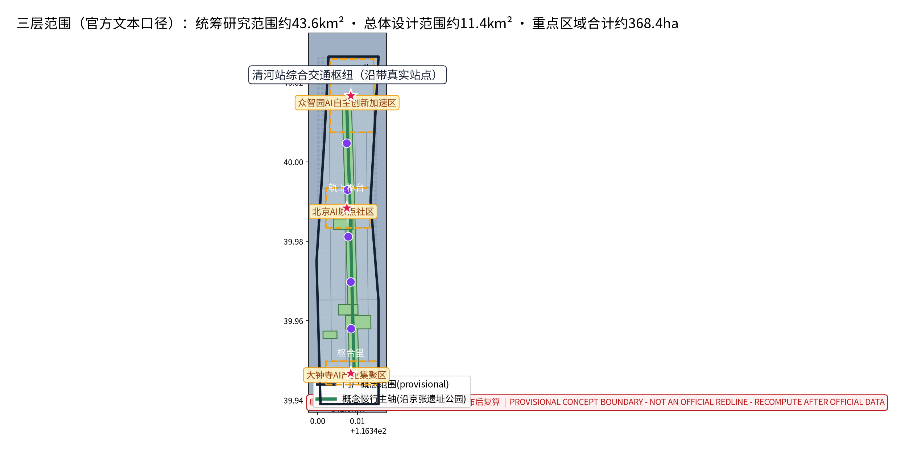
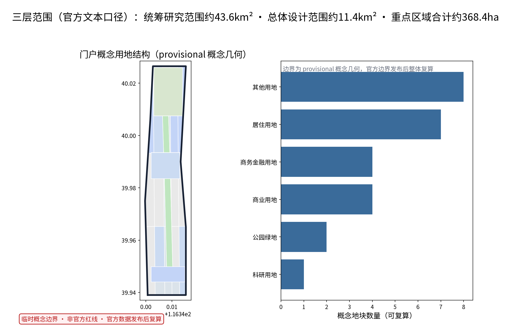
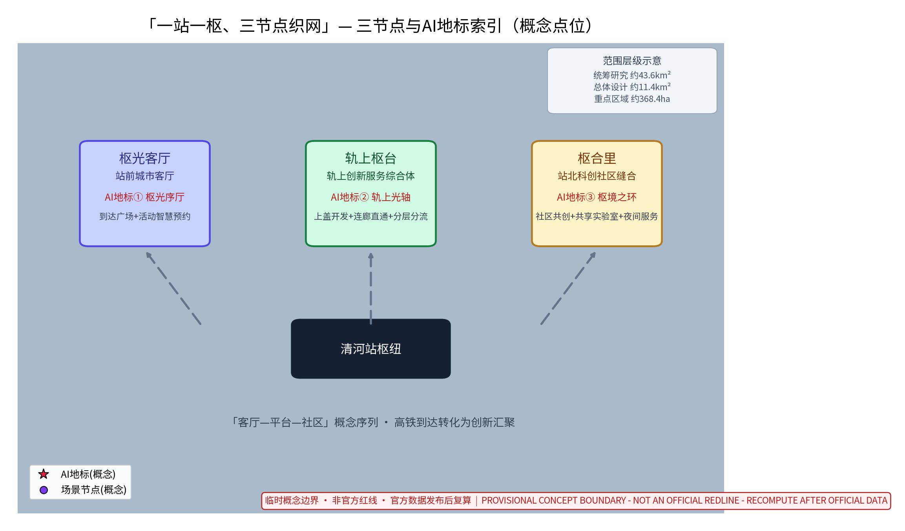

**方案名称与总体构想（概念）**

主名称「清河枢境」（Qinghe Pivot Realm，英文简称 QPR）。「枢」取枢纽、中枢与关键支点之意，「境」为承载场所精神的城市之境：以清河站综合交通枢纽（沿带真实高铁站点）为锚，把高铁的「到达」转化为创新的「汇聚」，构成「百年京张AI创新带」的北部门户，呼应海淀区「三区两翼」总体格局。本方案为原创概念建议，不含任何已确定的决策：总体结构「一站一枢、三节点织网」以「枢光客厅（站前城市客厅）」「轨上枢台（轨上创新服务综合体）」「枢合里（站北科创社区缝合节点）」三个概念点位组织站前公共交往、上盖创新服务与铁道两侧社区缝合；以「上盖增值反哺公共空间」为公共性概念机制，以「站城共创议事窗」「快闪准入备案制」「反哺积分」等原创机制控制利益平衡。方案面向五类人才画像与全龄人群提供「15分钟创新圈」概念服务，围绕交通、产业、空间、公共服务、文化、治理六域提出12张AI+场景卡、3个产业测试场景与8个场景节点、3个AI地标，全部锚定权责边界并设人工复核。本包所有几何均为 provisional 概念模型，官方边界与现状数据发布后整体复算。

## 设计依据与资料清单

本方案为概念阶段原创构思，依据公开征集任务书要点（三大定位、五大功能、三区两翼、三层范围与 agent.1—agent.6 开放任务）与公开背景资料编制；面积表述仅采用官方文本口径并显式标注口径：统筹研究范围43.6平方公里、总体设计范围11.4平方公里、重点区域合计368.4公顷（其中三处重点片区约192/104/72公顷）。组织方尚未发布官方边界多边形，本包几何全部标记为provisional，不预设任何精确坐标、面积与密度数值。概念研究基础包括：京张铁路遗址公园公开建设与开放信息、清河站枢纽公开功能与接驳信息、昌平线清河站等公开轨道接驳信息、沿带真实节点（清河、上地/中关村软件园、知春路、中关村大街、学院路）的空间认知，以及轨道交通站城融合、城市更新、数字经济与AI治理相关公开政策。建议后续深化资料清单如下表，均待组织方发布或现场踏勘后由专业团队收集。

| 深化资料类别 | 用途 | 获取状态 |
|---|---|---|
| 任务书补充文件与征集说明 | 校核任务口径 | 待组织方发布 |
| 官方边界多边形与现状测绘 | 面积、路网、地块复算 | 待组织方发布 |
| 产权、权属与建筑质量摸底 | 拆改留校核 | 待组织方发布 |
| 枢纽客流、接驳与运营数据 | AI场景与出行服务校核 | 待主管部门公开 |
| 控规控制、道路红线与轨道保护区 | 合规矩阵深化 | 待发布（现为资料缺口） |

> **证据锚点**：[source:DATA-SRC-OFFICIAL-ANNOUNCEMENT]、[source:DATA-SRC-AGENT-TASKBOOK]。

## 三层范围工作框架

三层范围工作框架按「宏观研究—中观设计—微观实施」组织：统筹研究范围（官方文本口径43.6平方公里）侧重枢纽辐射、产业格局、生态廊道与区域协同的宏观研究；总体设计范围（官方文本口径11.4平方公里）侧重城市更新与控规深度城市设计，落实三区两翼结构；重点区域（官方文本口径合计368.4公顷）包括众智园AI自主创新加速区、北京AI原点社区、大钟寺AI产业集聚区三处重点片区，以及中关村科技服务翼、小月河场景赋能翼。本方案聚焦「清河站TOD门户」专题，将其定位为创新带北部枢纽门户，并建立概念性区域协同回路：向北承接上地/中关村软件园与清河组团，与北纬社区更新联动；沿京张高铁走廊与未来科学城、怀柔科学城形成创新要素流动的概念接口；南向呼应经开区与京津冀城市群的枢纽分工，形成「北门户—中轴带—南三区、多翼协同」的概念骨架。三层工作分别对应宏观产业报告、总体城市设计、节点实施手册三类成果建议。

| 范围层级 | 官方文本口径 | 本包工作重点 |
|---|---|---|
| 统筹研究范围 | 43.6平方公里 | 产业组织、区域协同、生态廊道 |
| 总体设计范围 | 11.4平方公里 | 控规深度城市设计、三区两翼落实 |
| 重点区域 | 合计368.4公顷 | 三处重点片区与门户三节点详设 |

> **证据锚点**：[source:DATA-SRC-AGENT-TASKBOOK]。

## 统筹研究范围产业与未来城市研究

在统筹研究范围（官方文本口径43.6平方公里）概念框架内，提出「枢纽驱动、链条贯通」的产业组织思路：以清河站门户承接京张高铁沿线创新要素，与上地/中关村软件园、知春路、中关村大街构成南北贯通的AI创新走廊，并在概念层面连通未来科学城、怀柔科学城与经开区，避免门户专题孤立于全带之外。未来城市研究聚焦五大命题：AI全栈自主创新体系的载体供给、世界级AI创新生态的要素流动（土地—资金—人才—算力—数据—场景六要素）、AI+场景赋能新范式的空间试验、智能化AI活力城市的运营模式、AI治理全球话语权的公共场域。清河站门户承担「接口」角色：既是城际创新要素的汇聚接口，也是AI场景的展示与体验接口，以枢纽流量反哺创新生态。本概念以「全球AI枢纽生态图谱」为研究工具，横向对照国际枢纽的城市更新与运营机理。产业规模、职住平衡与客流预测均属概念研判，建议以公开统计与专项研究校核，不构成任何预测承诺。

> **证据锚点**：[source:DATA-SRC-PROVISIONAL-BOUNDARIES]。

## 总体设计范围城市更新与控规深度城市设计

总体设计范围（官方文本口径11.4平方公里）建议采用「更新优先、存量挖潜、刚弹结合」的控规深度城市设计概念框架：沿京张铁路遗址公园形成文化主轴，围绕三区两翼配置创新空间类型谱系。对门户专题，建议在控规深度上明确三条概念管控线索：功能混合（首层公共性、垂直混合）、上盖开发（枢纽上盖与周边地块联动）、公共空间联控（广场、连廊、绿廊统一管控），并以城市设计导则形式建议地块尺度、界面贴线、首层功能与地下连通规则。数字化辅助阶段引入概念性AI技术协议：模型评测（以基准测试分阶段验收）、数据质量（对输入数据做口径与脱敏质检）、误差分群（按场景与人群统计误差并公示）与运行监测（线上指标实时分级预警），全部结果供人工复核。由于官方边界与控规数据尚未发布，本文关于容积率、建筑高度、道路红线等的任何表述均为概念建议，不构成法定规划结论；管控规则与地块指标供专业团队在组织方发布基础数据后深化研究。

> **证据锚点**：[source:DATA-SRC-MOHURD-CONTROL-DETAILED-PLANNING]、[source:DATA-SRC-PROVISIONAL-BOUNDARIES]。

## 重点区域详细设计

重点区域（官方文本口径合计368.4公顷）详细设计建议按「三区两翼」展开：众智园AI自主创新加速区突出研发加速与中试场景，北京AI原点社区突出首站体验与社区共生，大钟寺AI产业集聚区突出产业服务与场景交易，中关村科技服务翼与小月河场景赋能翼提供软性支撑。本方案主体聚焦「清河站TOD门户」这一北部支点，围绕三个概念点位展开：概念点位一「枢光客厅」——站前城市客厅，组织到达仪式与公共交往，落位AI地标一「枢光序厅」（智能迎宾媒体界面）；概念点位二「轨上枢台」——轨上创新服务综合体，承载枢纽商业、办公、测试与创新服务，落位AI地标二「轨上光轴」（连廊光影装置）；概念点位三「枢合里」——站北科创社区缝合节点，融合社区共创、共享实验室与夜间服务，落位AI地标三「枢境之环」（上盖环廊观景装置）。三节点以高铁站房为核心形成「客厅—平台—社区」概念序列，均标注为概念点位与AI地标，具体选址与规模留待专业团队结合发布边界深化。

品牌与视觉识别方向（概念）：建议以「枢轴符号（Pivot Axis Mark）」为核心Logo图形语言，隐含铁轨、枢纽与环绕三义；主色取「京张锈色＋AI电光青」，辅以分级字体与图标规范；跨活动（快闪展、论坛、市集）延展同一符号体系。概念阶段未完成商标检索，全部名称与符号按内部工作代号处理。公共空间配套「枢合组件库」：可逆公共空间组件库含移动绿墙、可逆展台、模块化座椅、光伏雨棚、感应灯光与模块化舞台六类可逆组件，可快速组装与撤收；荣誉展示体系「枢光荣誉墙」收录开发者贡献与年度人物，采用可更换屏板并每年公示。

**场景卡索引（概念，12张）**：AI+场景以场景卡落地，形成可评审、可迭代的运营索引，每卡标注输入、输出、模型边界、运营者、数据合规边界与失败兜底；各场景的测试方法与验收基线见下方产业测试场景表与AI技术协议：

| 场景卡 | 空间落位 | 面向人群 | 输入与输出 | 模型边界／运营者 | 数据最小化与保留删除 | 失败兜底与人工复核 |
|---|---|---|---|---|---|---|
| 「枢光序厅」智能到达迎宾 | 站前广场西侧 | 游客、长者 | 到达车次聚合→接驳与排队提示 | 意图识别，仅聚合流；运营商与枢纽服务公司 | 匿名聚合，保留7日 | 无手机亦可用人工服务台 |
| 「无感安检」客流安检 | 站房进站层 | 全体旅客 | 通过率与时刻聚合→通行引导 | 法定主体授权（铁路与公安依职权），仅测通过率 | 实时计算，时段后删除 | 异常即时转人工，误判可申诉复核 |
| 「快闪客厅」活动智慧预约 | 站前广场东侧 | 游客、居民 | 分时预约→席位与动线建议 | 预约系统，端侧处理；运营公司 | 最小预约要素，活动后删除 | 现场人工登记兜底 |
| 「闲时工位」办公预约 | 轨上枢台创新综合体 | 白领、从业者 | 闲时查询→预约与积分 | 匿名聚合，不进行个体识别式追踪 | 仅统计不建档 | 人工客服与通道保留 |
| 「驿行」个性化接驳规划 | 站前接驳区 | 通勤者、游客 | 到发时刻→接驳最优组合 | 组合优化，月度评估；运营公司 | 匿名聚合统计 | 人工调度兜底 |
| 「伴行」无障碍出行引导 | 站内与站前 | 长者、残障人士 | 路线建议→分步引导 | 规则引擎＋志愿者值守 | 授权明示，可一键关闭 | 志愿者与人工办理兜底 |
| 「枢合科创角」社区展陈 | 枢合里站北社区 | 青年、学生 | 展陈申请→轮换排期 | 社区议事征集＋轮换展陈；社区运营 | 端侧处理 | 社区志愿者值守 |
| 「轨道讲堂」沉浸文化讲解 | 遗址公园带 | 亲子、家庭 | 场次预约→导览路径 | 预约系统＋讲解员 | 最小预约要素 | 现场人工讲解兜底 |
| 「枢纽食堂」社区助餐 | 轨上枢台裙房 | 银龄、居民 | 菜单与补贴预约→取餐提醒 | 助餐系统，实名最小要素 | 补贴台账依法公示 | 人工窗口兜底 |
| 「仿真沙盘」产业路演 | 上盖展厅 | 企业、投资者 | 预约路演→场景演示 | 演示系统，备案管理 | 不采集个人肖像 | 现场人工导览 |
| 「共享实验室」科研协作 | 枢合里共享实验室 | 高校、科研团队 | 时段预约→设备登记 | 预约与备案系统 | 端侧处理 | 运营方人工接洽 |
| 「夜间值守」夜间工作服务 | 站北社区街巷 | 夜间工作者 | 分级照明与照明路线 | 分级响应＋志愿巡视 | 仅聚合时段统计 | 志愿者与物业人工巡查 |

> **证据锚点**：[data:PACKAGE-GEOMETRY]（三节点示意多边形来自本包 geometry/key_areas.geojson）。

## AI 创新生态、人才画像与 AI+ 场景

人才画像建议面向算法工程师、AI产品经理、科研转化者、数字工匠、枢纽服务者五类人才，配置「15分钟创新圈」概念服务体系，并对长者、青年、儿童、家庭、居民、游客、学生、通勤者、从业者、残疾人、弱势群体、骑手、白领、亲子与银龄等全龄人群开放。AI创新生态建议以「全球AI枢纽生态图谱」为参照，梳理「土地—资金—人才—算力—数据—场景」六要素的流动机制：借鉴国际枢纽在公共交通导向开发、效益反哺公共空间、开发者社区与场景开放运营上的做法，形成本方案的可转化机制。6个有来源的全球枢纽案例见表（详见 sources.json 逐项来源）：

| 案例名称 | 城市／枢纽 | 生态机制特征（土地—资金—人才—算力—数据—场景） | 借鉴要点 | 来源 |
|---|---|---|---|---|
| 高轮Gateway城 | 东京／品川区 | 旧车辆段上盖再开发，站城一体与多主体共育园区，百年场站文化转译 | 上盖收益反哺与场站文化叙事 | [source:DATA-SRC-CASE-TAKANAWA] |
| 麻布台之丘 | 东京／虎之门 | 垂直花园城市，绿色公共空间与创投枢纽结合，30年城市更新机制 | 公共空间与资本复合运营 | [source:DATA-SRC-CASE-AZABUDAI] |
| 国王十字街区 | 伦敦 | 工业遗存更新为混合城区，40%开放空间与公共领域运营 | 公共空间联控与长期运营 | [source:DATA-SRC-CASE-KINGSCROSS] |
| 哈德逊广场 | 纽约 | 高密度混合上盖开发与大型公共空间并置 | 高强度开发与公共性平衡 | [source:DATA-SRC-CASE-HUDSON] |
| 星耀樟宜 | 新加坡／樟宜机场 | 机场商业文旅复合体，世界级室内地标与夜游产品 | 枢纽地标与旅游吸引物 | [source:DATA-SRC-CASE-JEWEL] |
| 拉德芳斯 | 巴黎 | 欧洲商务区公共管理单位持续运营与低碳转型 | 长期公共运营主体机制 | [source:DATA-SRC-CASE-LADEFENSE] |

AI+场景域覆盖交通、产业、空间、公共服务、文化、治理六域：AI交通（智慧出行助手与接驳规划）、AI产业（枢纽商业与办公服务、仿真路演）、AI空间（站前客厅与轨上综合体的场景—空间映射）、AI公共服务（无感安检与无障碍伴行）、AI文化（轨道讲堂与快闪展）、AI治理（客流调度、人工复核与运行监测），各域均以人工复核兜底并遵循匿名聚合与禁止过度监控边界。面向产业验证，建议设立3个产业测试场景，先用快闪与试点验证、达标后再规模化：

| 产业测试场景 | 测试方法与准入协议 | 验收基线 | 失败兜底与退出 |
|---|---|---|---|
| 智慧出行助手 | 匿名问卷＋行程模拟基准测试，接入方签数据协议 | 意图理解准确率不低于概念基线 | 未达标转人工客服；连续不达标触发停止条件 |
| 无感安检试点 | 法定主体授权协议＋通过率与误报率采集 | 误报率低于概念阈值 | 误判即时人工接管；试点撤收而非扩大 |
| 活动智慧预约 | 用户测试＋数据质量监测与误差分群 | 预约成功率与满意度达标 | 现场人工登记兜底；不达标撤收整改 |

AI技术协议在本节补充三条概念线：模型评测（分阶段基准测试）、数据质量（口径校验与脱敏质检）、运行监测（指标分级预警与年度公示），三者均在「AI治理三句式」框架下执行——仅匿名聚合、关键决策人工复核、禁止过度监控。

> **证据锚点**：[source:DATA-SRC-GENERATIVE-AI-INTERIM-MEASURES]、[source:DATA-SRC-BARRIER-FREE-ENVIRONMENT-LAW]。

## 用地、建筑规模与拆改留方案

拆改留坚持留改拆并举：铁路与工业遗存概念元素登记建档、能留尽留，仅针对确无保留价值的临建与非正规存量建筑拆除；全部面积为概念口径，官方数据发布后复算。门户专题建议保留站房周边有历史价值的铁路与工业遗存（旧线位、信号设施、轨道构件等概念元素），改造低效办公与仓储建筑为创新服务空间，拆除仅限无保留价值的临建与非正规存量建筑。用地结构建议以交通枢纽用地为核心，外围配置创新研发混合用地、文化展示用地与居住配套用地；站前高强度混合开发与公共空间平衡，通过「上盖增值反哺公共空间」的概念机制实现。本章所有用地占比均按统一概念口径（门户概念范围）排列，仅为方向性比例示意而非精确拆分，涵盖交通场站、商务金融、教育科研、商业、居住配套、文化、公园绿地、科研与留白等类型，不设任何精确百分比承诺；面积、绿地率与公共空间率等指标均标注置信等级与复算触发条件，官方边界与现状测绘发布后由专业团队按统一口径聚合复算。

| 概念用地类型 | 方向性示意 | 口径与置信 |
|---|---|---|
| 交通枢纽用地（核心） | 约四分之一 | 概念口径，低置信 |
| 创新研发与教育科研混合用地 | 约三分之一 | 概念口径，低置信 |
| 文化展示、商业与居住配套用地 | 其余方向 | 概念口径，低置信 |
| 公园绿地与公共空间 | 融入蓝绿骨架 | 概念口径，低置信 |

> **证据锚点**：[source:DATA-SRC-MNR-LAND-USE-CLASSIFICATION-202311]。

## 交通、轨道、市政与公共服务设施

以清河站综合交通枢纽为锚，建议组织高铁、城际线路与地铁一体化换乘的概念机制：参考既有地铁昌平线清河站等公开接驳信息，预留与规划轨道线路的概念接口；站前实现地上地下立体衔接——地下层组织轨道换乘与接驳车场，地面层组织公交与慢行，地上连廊直通上盖综合体，形成「分层分流、便捷换乘」的客流组织概念。市政方面建议结合综合管廊与能源微网概念，利用枢纽余热服务周边建筑，推进海绵化排水。公共服务建议配置枢纽服务大厅、人才服务点、社区食堂与共享实验室，并设置无障碍与适老化通道，全龄友好。无感安检与客流动态引导为高风险场景，须在试点前明确法定主体假设、最小数据、保留删除、误判申诉、人工接管与试点退出条件：

| 高风险场景 | 法定主体假设 | 最小数据与保留删除 | 误判申诉 | 人工接管 | 试点退出条件 |
|---|---|---|---|---|---|
| 无感安检 | 铁路与公安等法定主体依职权授权，本方案不代行 | 仅通过率与时段聚合，不采身份与生物信息，实时计算后删除 | 设申诉复核通道并人工办理 | 报警或异常即转人工全面接管 | 误报率超过基线或授权边界变化即撤收 |
| 客流动态引导 | 枢纽运营单位依法授权 | 仅匿名客流聚合，保留不超短期并到期删除 | 人工复核可纠偏引导建议 | 高峰与异常人工调度接管 | 频次或强度超限即停用告警、改为人工疏导 |

所有轨道线路、接驳与接口表述均为概念建议，不构成规划承诺，须以主管部门公开信息为准。

> **证据锚点**：[source:DATA-SRC-MOHURD-URBAN-DESIGN-MEASURES]、[source:DATA-SRC-BARRIER-FREE-ENVIRONMENT-LAW]。

## 蓝绿空间、公共空间与城市风貌

建议以京张铁路遗址公园为绿脉骨架，打通清河站门户与遗址公园及上地/中关村软件园的概念性慢行联系，形成「铁轨记忆步道—站前广场—软件园绿廊」的连续开敞空间序列；蓝绿空间结合小月河等水系脉络构建海绵化雨水花园与林荫场所，具体水系现状以现场踏勘为准（待踏勘假设）。城市风貌主张「百年铁轨的厚重与AI时代的轻盈」并置：保留轨枕、道钉等记忆元素，新建筑采用轻质、通透、可变的界面，夜景以信息层次化智慧照明为主，拒绝炫光屏墙。站前公共空间序列建议为「到达广场—枢光客厅—站台连廊—园区楔形绿地」四级过渡，塑造「铁轨之上、创新之门」的北部门户标志意象，配合同一套枢轴符号体系的 **文化导视**（双语Wayfinding标识），强化中英国际传播一致性与方向辨识。蓝绿与公共空间纳入可逆公共空间组件库统一联控：组件可快速铺设与撤收，保障节庆活动与日常静休两种状态轮换并存。

> **证据锚点**：[source:DATA-SRC-MOHURD-URBAN-DESIGN-MEASURES]。

## 更新项目清单、实施政策与分期计划

建议形成概念性更新项目清单：站前广场与地下空间一体化改造、轨上创新服务综合体新建、站北社区微更新、慢行绿廊贯通、市政管网升级等。参与主体建议为政府统筹、企业参与运营、高校与科研机构协同、居民与社区共建共治、运营单位驻场、志愿者协助、商户共创、专业团队评估等多元组合；以「试点先行、快闪验证」降低试错成本，并以「上盖增值反哺公约」「弹性容积率与用途兼容」「城市更新联审联批」等概念政策衔接法定程序。全部更新任务按 RACI 责任矩阵建议牵头与协作，示例：

| 更新任务 | 牵头（R） | 协作（A） | 咨询（C） | 知会（I） |
|---|---|---|---|---|
| 站前广场与地下空间一体化改造 | 政府与运营公司 | 企业、专业团队 | 高校、居民 | 商户、公众 |
| 轨上创新服务综合体概念 | 运营公司与参建企业 | 设计专业团队 | 高校、科研机构 | 公众 |
| 慢行绿廊贯通与蓝绿整合 | 政府与运营单位 | 高校、志愿者 | 社区、居民 | 公众 |
| 站北社区微更新与议事 | 社区与居民议事会 | 运营单位、志愿者 | 高校、专业团队 | 公众 |

分期实施采用概念节奏：近期（1—3年）开展广场改造、智慧出行与活动预约等场景试点、高铁快闪展等激活活动；中期（3—5年）推进轨上综合体建设、慢行绿廊贯通与枢合里社区缝合，举办轨上交汇论坛、站前周末市集形成年度活动体系；远期（5—10年）门户片区整体成形，与三区两翼及区域协同对象全面联动。长期运营建议建立开发者社区（开放接口与测试沙盒）、场景开放（季度发布测试场景清单）与招引转化机制（路演备案—落地跟踪—反哺积分），并设置停止条件、退出机制与撤收路径：凡试点未达概念基线、公众反对或数据边界失控的，进入撤收整改而非强制放大。年度活动体系见下表：

| 年度活动 | 周期与频次 | 牵头／协作主体 | 评价指标 |
|---|---|---|---|
| 高铁快闪展 | 每季度一场，全年四场 | 牵头：运营公司与专业策展团队；协作：高校、商户 | 展期客流、满意度 |
| 轨上交汇论坛 | 每年一场 | 牵头：运营公司与产业联盟；协作：高校、科研机构 | 参会构成、转化意向 |
| 站前周末市集 | 每周末举办 | 牵头：社区运营；协作：商户、志愿者 | 摊位数、复访率 |

> **证据锚点**：[source:DATA-SRC-AGENT-TASKBOOK]。

## 指标体系、面积复算与合规矩阵

绩效指标体系建议分层设置：门户层（换乘时间、步行可达性、职住混合度）、场景层（AI场景启用率、预约使用率、数据匿名化覆盖率）、运营层（公共空间使用强度、活动频次），均为概念性目标，不设硬性数值承诺。所有 provisional 指标一律降精度展示，并标注数据来源、公式、置信等级、用途限制与复算触发条件（见 metrics.json 与核心指标证据图）。下表为「场景—空间—数据—运营—人工复核—指标」全链矩阵，明确每张场景卡的数据、运营、复核、指标与退出边界：

| 场景 | 空间落位 | 数据输入与最小化 | 运营机制 | 人工复核点 | 关联指标 | 试点退出条件 |
|---|---|---|---|---|---|---|
| 智慧出行助手 | 站前广场西侧 | 到达车次匿名聚合 | 月评估、公示 | 行程与调度建议 | 换乘时间、AI场景启用率 | 满意度未达标即撤收 |
| 无感安检 | 进站层 | 通过率聚合、删后不留存 | 法定授权试点 | 报警与申诉 | 误报率、通行效率 | 误报率超基线即撤收 |
| 客流动态引导 | 站厅与连廊 | 匿名客流聚合、短期保留 | 分级预警、月度评估 | 高峰人工调度 | 客流均匀度、活动频次 | 限值超限即停用 |
| 活动智慧预约 | 站前广场东侧 | 最小预约要素 | 预约+积分+公示 | 预约与申诉 | 预约使用率、活动频次 | 不达标整改撤收 |
| 个性化接驳规划 | 站前接驳区 | 到发时刻匿名聚合 | 接驳预约、月度评估 | 接驳调度人工复核 | 换乘时间、公共空间使用强度 | 效果未达即撤收 |
| 无障碍伴行 | 站内站前 | 授权明示、可关闭 | 志愿者值守 | 人工办理兜底 | 无障碍连续性、满意度 | 依无障碍法检视 |
| 社区展陈 | 枢合里 | 端侧处理 | 议事征集、轮换展陈 | 社区议事复核 | 预约使用率、活动频次 | 社区不愿即轮换 |
| 轨道讲堂 | 遗址公园带 | 最小预约要素 | 预约+志愿者 | 讲解复核 | 活动频次、满意度 | 人次不足即调整 |
| 共享实验室 | 枢合里 | 端侧处理 | 预约+备案 | 设备台账人工复核 | 预约使用率 | 备案不合规即撤收 |
| 夜间值守 | 站北社区街巷 | 时段聚合统计 | 分级响应+志愿巡视 | 物业人工巡查 | 公共空间使用强度 | 治安边界超限即停用 |

面积复算原则：仅采用官方文本口径数据（统筹研究范围43.6平方公里、总体设计范围11.4平方公里、重点区域合计368.4公顷，三处重点片区约192/104/72公顷），组织方未发布边界多边形前不进行任何精确面积复算；发布后由专业团队按统一口径复算，并建立「文本—图纸—模型」一致性合规矩阵，覆盖用地、高度、文保、消防、隐私与无障碍等条目，均标注「概念建议，待深化」。合规矩阵详见 compliance_matrix.json、standard_matrix.json 与 design_depth_matrix.json。

> **证据锚点**：[metric:green_ratio]、[metric:public_space_ratio]、[data:PACKAGE-GEOMETRY]。

## 风险、版权与合规说明

主要风险与应对：一、边界数据未发布风险——几何表述保持provisional性质，面积严格采用官方文本口径，官方数据发布后复算；二、隐私合规风险——AI场景坚持仅匿名聚合、关键决策人工复核、禁止过度监控三句式，不进行个体识别式追踪，高风险场景设法定主体假设、最小数据、保留删除、误判申诉、人工接管与试点退出条件；三、实施落地风险——分期推进，以快闪与试点验证后放大，设停止条件、退出机制与撤收路径；四、规划合规风险——本文不含任何法定规划结论，落地事项一律表述为概念建议、参考方案、可供专业团队深化研究。公众参与：建议设居民意见通道与议事会，实施年度公示与年度活动复盘，重大规则依法公示、协商与听证。版权说明：本方案为原创概念文本，主名称「清河枢境/Qinghe Pivot Realm」及三个概念点位名称为本方案自拟，未照搬现实城市、园区、企业名称与商标；如与既有名称雷同纯属巧合，不主张排他权利。品牌在先权利与使用边界：概念阶段未完成官方商标检索，上述名称、Logo 与符号均作为内部工作代号使用，在完成在先权利检索与清权前，不对外部商业使用或注册主张使用；来源与资产权属/许可边界明细见 sources.json 各条目 license 字段。

> **证据锚点**：[source:DATA-SRC-OFFICIAL-ANNOUNCEMENT]。

## 参考资料

参考资料以政府正式发布版本为准；本包 sources.json 仅收录可查证条目，未虚构任何官方数据或链接。概念阶段公开参考资料：（1）「百年京张AI创新带城市设计国际方案征集」公开任务书与征集说明（open-city-ai/haidian 开源征集）；（2）京张铁路遗址公园公开建设与开放信息；（3）清河站作为京张高铁车站的公开交通与换乘信息；（4）北京市关于轨道交通站城一体化、城市更新与数字经济的公开政策与报道；（5）海淀区「三区两翼」相关公开表述（官方文本口径）；（6）6个全球枢纽案例的官方或机构公开页面（详见 sources.json 逐项来源与资产权属登记）。以上资料仅作概念研究参考，不构成规划依据；组织方后续发布的官方边界、现状数据与任务书补充文件，将作为深化研究的基础。

> **证据锚点**：[source:DATA-SRC-OFFICIAL-ANNOUNCEMENT]。
