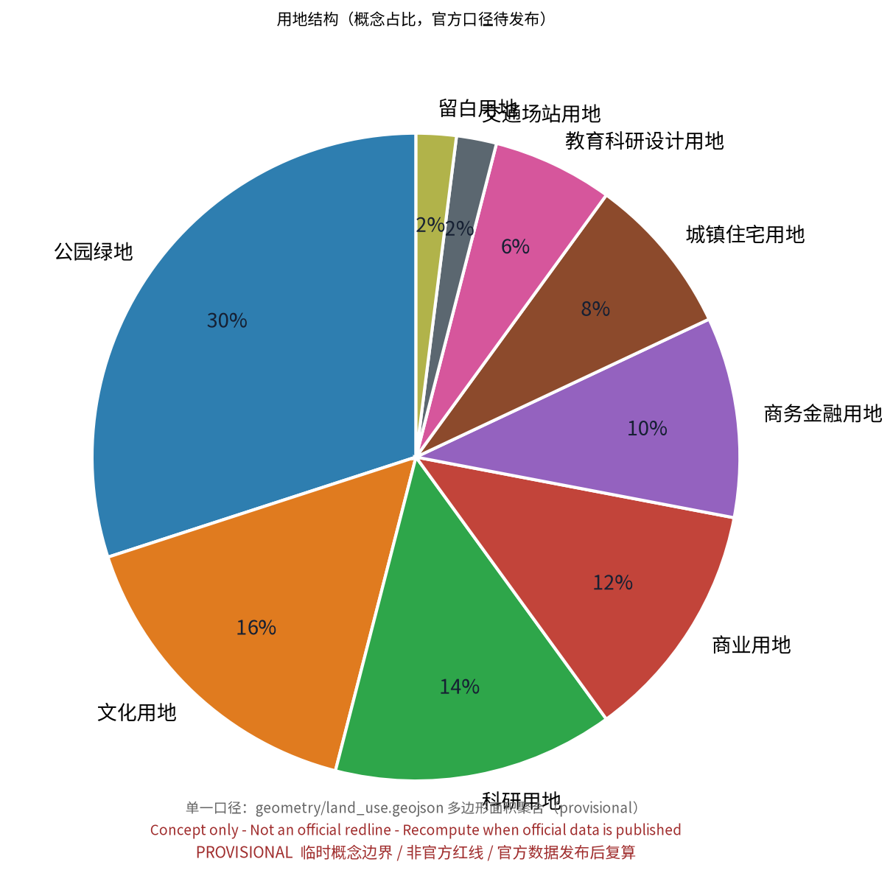
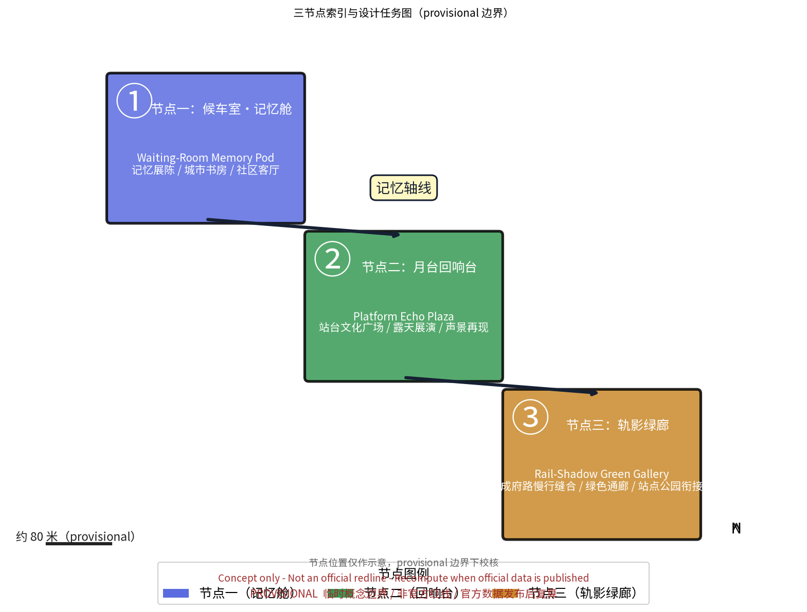
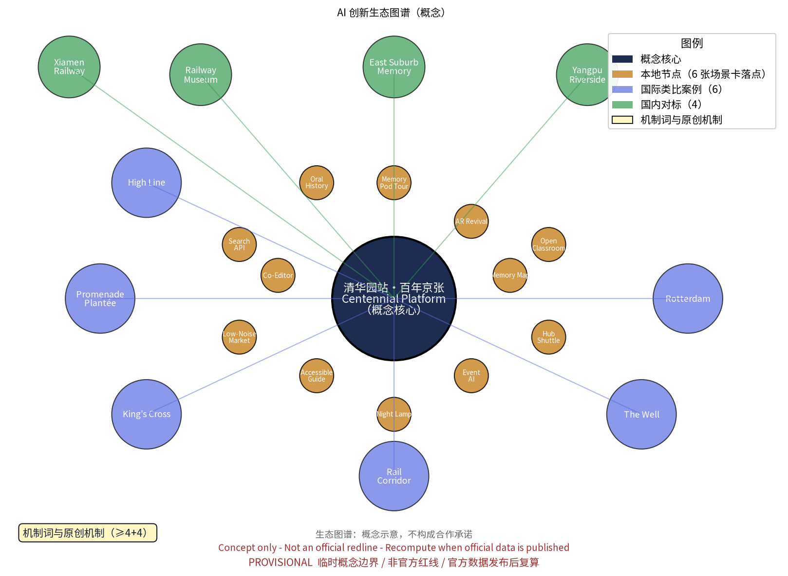
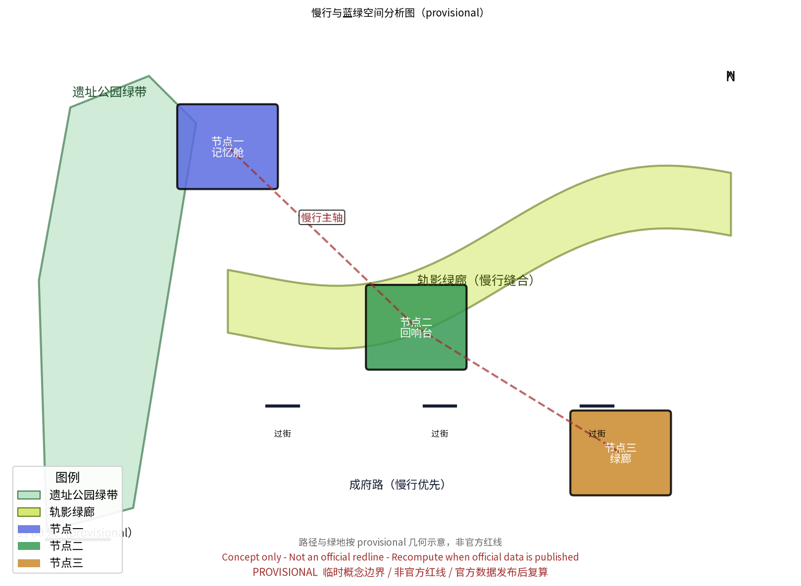
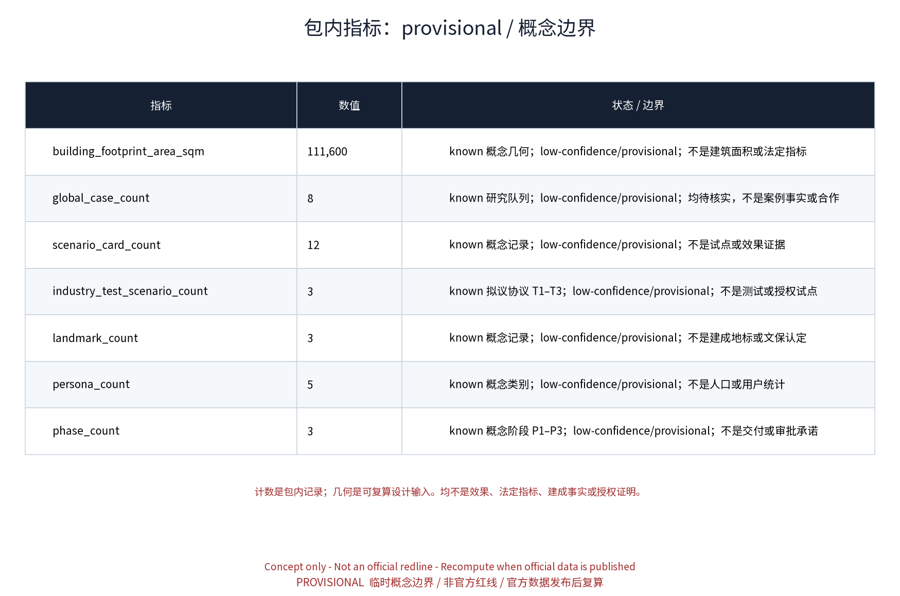

# 清华园站·百年京张文化原点：一带概念性规划

**一句话主张**：把清华园站作为可核验资料到位前的文化锚点，把“记忆—体验—创新—治理”串成一条可步行、可共编、可小规模测试、可撤回维护的 AI 文化带。主名称建议为 **「百年月台 / Centennial Platform」**，英文传播副标仅作概念文案；名称、Logo、导视和机制名均是内部工作代号，未完成商标或在先权利检索。

本包是站城文化街区的**概念建议**，不是法定规划、城市设计审查意见、工程设计、审批文件、投资承诺或运营承诺。现有 GeoJSON 仅为 `provisional` 概念几何；不据此给出容积率、建筑高度、建设规模、文保允许干预、道路红线或市政可行性结论。无法由当前来源核验的站史、口述、现场踏勘和案例，均标为“待核实/仅供研究”，不作为本方案事实前提。

## 设计依据与资料清单

本包实际使用的依据分为四层：任务书与公告的目标口径；公开规划/无障碍/生成式人工智能治理资料的**方法参照**；本包 provisional GeoJSON 与指标的**可复算技术输入**；原创概念文本、图件和场景卡的**工作产物**。任务书明确的三大定位、五大功能、三区两翼、agent.1—6 交付要求，是结构设计的来源，不等于组织方已承诺采用本方案。[source:DATA-SRC-OFFICIAL-ANNOUNCEMENT-20260509] [source:DATA-SRC-AGENT-TASKBOOK-20260518]

关于清华园站、京张铁路遗产、遗址公园和周边现状的具体历史事实，本轮不补写未经来源逐条核验的叙述；“文化锚点”是本方案的设计选择，不是文物认定。站房本体、保护范围、建设控制地带、产权、现状保存、道路红线、客流、市政和活动容量均列为待补数据。现有几何仅来自包内 `geometry/`，并明确 `source_type=provisional`；正式资料到位后按统一口径重落位、重算、重做图件。[source:DATA-SRC-PROVISIONAL-BOUNDARIES-20260605] [data:geometry/site_boundary.geojson] [data:geometry/key_areas.geojson]

资料台账采用 `sources.json` 的 ID、标题、URL/路径、资料类型、访问/发布日期字段和复用边界；每条全球 AI 生态案例均标为“待核实参考”，不把着陆页或类比关系写成已验证绩效。原创文字、图件、PDF、HTML、Logo 草图、场景卡、AI 生成/辅助内容与字体的权利边界见 `report/copyright_statement.md`；任何对外发布、派生或商业化前须重新清权。[source:PACKAGE-SOURCES-REGISTRY] [source:PACKAGE-RIGHTS-LEDGER]

## 三层范围工作框架

三层范围不是三套互相独立的方案，而是“区域协同判断—街区结构—站点试点”的传导链。统筹研究范围只回答产业、文化、人才、算力、数据和区域协同的方向性问题；总体设计范围把方向转译为公共空间、慢行、功能兼容和更新项目的概念框架；重点区域详细设计把可逆组件、场景卡和测试协议落到清华园站文化锚点。三层均不替代法定规划，也不把 provisional polygon 当作官方范围。[source:DATA-SRC-AGENT-TASKBOOK-20260518]

| 层级 | 工作问题 | 本包交付 | 回传/复算条件 |
|---|---|---|---|
| 统筹研究范围 | 一带如何与科创、社区、科学城、先进制造和京津冀形成互补 | 三定位、五功能、生态案例队列、区域协同与生态图谱 | 官方总体范围、产业/人才/交通基线到位后复核，不作面积结论 |
| 总体设计范围 | 一条文化—AI 带如何形成可步行、可停留、可运营的街区骨架 | 三区两翼空间—功能—主体回路；蓝绿、慢行、更新和公共服务策略 | 道路红线、产权、文保控制、市政和无障碍现状到位后重落位 |
| 重点区域详细设计 | 清华园站文化锚点如何成为可体验、可测试、可撤回的示范节点 | 三个文化/AI 地标、12 场景卡、T1–T3 协议、组件库、阶段门 | 站房资料、管理主体、社区同意与试点授权到位后再决定是否试点 |

空间—功能—主体的最低闭环是：**空间提供可逆承载，功能定义公共价值，主体负责数据/内容/安全/维护，指标触发继续、调整或退出**。本包所有空间编号与指标都要回到 `geometry/`、`metrics.json` 和阶段门复核。[data:geometry/key_areas.geojson] [data:geometry/land_use.geojson]

## 统筹研究范围产业与未来城市研究

一带的产业逻辑不是把文化节点包装成招商承诺，而是用清华园站作为低风险、低数据、可人工接管的公共测试入口：文化内容产生可理解的公共体验，体验反哺开发者和企业对服务质量的验证，企业成果再经过社区和专业评估进入人才/企业转化链。产业研究暂不判断具体企业、投资额或用地强度；只提出可供后续核验的机制和接口。[source:DATA-SRC-AGENT-TASKBOOK-20260518]

**三大定位**：

1. **百年京张文化带**：以资料核验后的铁路记忆、公共展陈、社区共编和国际叙事为文化底座；当前不宣称具体站史细节。
2. **都市 AI 生活体验带**：以无障碍导览、低技术参与、匿名聚合和人工服务为城市生活接口；AI 不替代讲解、社区协商或安全责任主体。
3. **AI 融合创新带**：以开放场景、开发者社区、产业测试协议、知识产权清权和人才—企业转化为创新接口；不预设合作、采购或落地。

**五大功能**：AI 全栈自主创新体系、世界级 AI 创新生态、AI+ 场景赋能新范式、智能化 AI 活力城市、AI 治理全球话语权。五项功能分别通过“数据/模型最小化—案例研究—场景测试—公共体验—治理证据”回到空间和运营，不把“世界级”写成既成荣誉。[source:DATA-SRC-AGENT-TASKBOOK-20260518]

**外部协同另列，不并入三区两翼**：

| 外部对象 | 协同主题 | 清华园站输入/输出 | 主体类型 | 先决核验 |
|---|---|---|---|---|
| 北纬社区 | 邻里日常、亲子、低技术文化参与 | 输入居民议题与时段偏好；输出可撤回的社区活动模板 | 社区组织、居民代表、运营方 | 需征得真实社区主体同意，不能代称为既有合作 |
| 未来科学城 | 科普内容、科研公众沟通 | 输入科普素材与专家审阅；输出面向公众的可理解导览 | 科研机构、科普团队、场景运营者 | 需核验机构、内容版权和开放时间 |
| 怀柔科学城 | 大科学装置/科学文化的公共转译 | 输入公开科普内容；输出文化带的远程/巡回展陈接口 | 科研机构、教育机构、文化机构 | 不涉及设备、人员或涉密信息，需逐项清权 |
| 经开区 | 先进制造、机器人/智能产品的公众体验 | 输入经审查的产品演示；输出低风险公共体验场景 | 企业、产业园运营方、专业评估方 | 需核验企业和演示安全，不构成招商或采购承诺 |
| 京津冀 | 京张线性文化叙事与创新节点互访 | 输入沿线公开史料；输出可互链的双语内容模板 | 沿线文化机构、城市更新团队、研究者 | 需逐地核验历史与版权，不主张统一管理关系 |

### 六个生态域与人才—企业转化链

六个生态域是：**内容与遗产**（史料核验、可撤回共编）、**模型与算力**（端侧优先、低资源推理）、**数据与隐私**（最小字段、生命周期删除）、**空间与设施**（可逆、无障碍、低技术替代）、**资本与专业服务**（清权、评估、企业服务）、**场景与人才**（开放 API/SDK 概念、导师、实习和企业验证）。生态入口分为“提出问题—公开场景卡—伦理/安全预审—小试—复盘—人才/企业转化”六步；任何一步失败都能退回或终止，不产生默认合作义务。

## 总体设计范围城市更新与控规深度城市设计

总体设计采用“一条记忆轴线、两种公共界面、三处可逆节点”的概念结构。记忆轴线把文化锚点、站前开放空间和成府路慢行界面串联；两种界面分别是可安静阅读/讲解的文化界面与可轮换市集/演示的创新界面；三处节点对应 `public_space.geojson` 的三个 AI landmark。图件仅表达方向、关系和概念位置，周边道路、北向、图例、比例尺和 provisional 水印均不意味着现实放样或审批结论。[data:geometry/roads.geojson] [data:geometry/public_space.geojson]

空间更新以“留—改—拆”的审慎顺序为设计原则：先登记和保留待核验的遗产要素，再使用可逆、可拆卸、可维护的展示和服务构件，最后对确经专业评估为无保留价值且阻碍公共通行的临时构筑物提出研究选项。不存在本包单方决定的拆改清单，不给出建筑规模、容积率、高度、退线或文保控制结论。用地分类只用于理解功能兼容关系，不把图中的颜色或面状数量升级为法定用途。[source:DATA-SRC-MOHURD-URBAN-DESIGN-MEASURES] [source:DATA-SRC-MOHURD-CONTROL-DETAILED-PLANNING] [source:DATA-SRC-MNR-LAND-USE-CLASSIFICATION-202311]

设计回路为：文化资料核验 → 低刺激公共体验 → 匿名聚合的服务改进 → 社区/专业人工复核 → 开发者与企业小试 → 维护或退出。对老人、儿童、听视障人士和不使用智能手机者，所有数字场景都配置纸质/人工/实体标识替代，不以安装 App 或同意数据采集为进入公共空间前提。[source:DATA-SRC-BARRIER-FREE-ENVIRONMENT-LAW]

> 图件证据（范围与功能）：[data:geometry/site_boundary.geojson] [data:geometry/key_areas.geojson] [data:geometry/land_use.geojson]；图件只支持概念讨论。

> 图件证据（建成环境与蓝绿）：[data:geometry/buildings.geojson] [data:geometry/roads.geojson] [data:geometry/green_space.geojson]；官方资料到位后重绘。

> 图件证据（公共空间与实施）：[data:geometry/public_space.geojson] [data:geometry/constraints.geojson] [data:geometry/phasing.geojson]；不构成放样或审批结论。

## 重点区域详细设计

清华园站文化锚点不是孤立的遗产展示点，而是“一带”的试验台：节点空间承载文化与公共生活，三区两翼提供内容、服务、人才、企业和治理接口，外部协同对象另列为待核验的互联关系。三处节点均是原创概念名，不把“原候车室/原站台”的状态写成已核验事实；在正式文保资料到位前，统一使用“待核验遗存/概念锚点”的表述。

| 节点 | 概念空间 | 主要功能 | 负责主体类型 | 可逆组件/安全边界 |
|---|---|---|---|---|
| L1 | **「候车室·记忆舱」** | 资料核验后的双语导览、城市书房、社区客厅 | 内容核验组、社区运营者、人工讲解员 | 可拆屏、纸本、触觉/语音替代；不采集面部/声纹 |
| L2 | **「月台回响台」** | 小型展演、轮换市集、开发者公开演示 | 活动运营者、社区代表、测试评估方 | 临时座椅、可拆展台、人工值守；按噪声与人流阈值可撤 |
| L3 | **「轨影绿廊」** | 慢行缝合、夜间低刺激导视、蓝绿停留 | 道路/绿化维护者、无障碍顾问、志愿者 | 可移动导视、遮阴座椅、雨水花园概念模块；不作道路工程结论 |

### 三大定位—五大功能—三区两翼回路

| 空间单元 | 主要功能落点 | 三大定位接口 | 主体回路 | 可验证产物 |
|---|---|---|---|---|
| AI 原点社区 | 世界级 AI 创新生态；智能化 AI 活力城市 | 百年文化带提供公共叙事；都市生活带提供社区入口 | 居民/高校提出问题 → 内容与服务团队共编 → 运营方人工复核 | 文化导览、纸本替代、社区活动月报 |
| 众智园 AI 自主创新加速区 | AI 全栈自主创新体系；治理全球话语权 | 都市体验带提供低风险试验；创新带提供开发者接口 | 开发者提交 → 隐私/安全预审 → T1/T2 小试 → 评估方复盘 | API/SDK 概念规范、测试报告、失败登记 |
| 大钟寺 AI 产业集聚区 | AI+ 场景赋能新范式；产业服务 | 文化带提供可理解的用户问题；创新带提供产业转化接口 | 企业/高校带来原型 → 场景主持人组织 → 社区与专业方验收 | T3 企业服务试验、人才/企业转化记录 |
| 中关村科技服务翼 | 世界级 AI 创新生态；治理全球话语权 | 为三处空间提供 IP、资本、法律、评估、国际连接 | 专业服务方清权/评估 → 运营方发布 → 结果可追溯 | 权利台账、双语案例卡、评估摘要 |
| 小月河场景赋能翼 | AI+ 场景赋能新范式；智能化 AI 活力城市 | 将公共服务、慢行、蓝绿和低刺激体验外接 | 公共空间维护者提出需求 → 场景团队适配 → 人工服务兜底 | 慢行/导视试验、环境反馈、维护清单 |

### 三个 AI 文化地标与国际传播资产

三处地标分别承担“证据入口、公共回响、慢行连接”三种角色；地标不等于新建建筑，也不承诺永久设施。Logo 概念以一条“月台切线”、一个“站房方框”、一组“轨距节奏”组成黑白最小单元；色彩建议为钢蓝、赭红、月白，正文/图件提供高对比和双色备用。Logo 和 VI 只用于内部概念评审，待在先权利与无障碍审查后再决定是否继续。[source:DATA-SRC-AGENT-TASKBOOK-20260518]

国际传播资产包括：中英概念名对照、100 字英文摘要、8 张待核实 AI 生态案例卡、12 张中英场景卡字段、沿线文化带的双语导览模板和“先核验、再公开、可撤回”的治理说明。建议英文主标语：**“Walk the memory, test the future.”**，它是原创概念文案，不是机构口号、合作承诺或历史事实。

## AI 创新生态、人才画像与 AI+ 场景

### 生态图谱和案例核验规则

生态图谱以“内容—数据—模型—空间—运营—治理”六层链路为中心，外环接 8 个全球 AI 生态参考入口，内环接三处节点、五个空间单元和 T1–T3 测试。8 条案例均有 `sources.json` ID 与 URL/来源字段，但当前一律标为**待核实/仅供后续研究**：本包不声称其绩效、合作关系、可复制性或官方背书；复核时必须打开原始页面、记录发布日期/访问日期、核对主体和许可，再决定是否保留。[source:PACKAGE-AI-CASE-QUEUE]

案例参考队列：AI Singapore、Mila、Vector Institute、The Alan Turing Institute、UAE AI Office、Seoul AI Hub、Helsinki AI Register、Data & Society。它们只作为“机构组织方式/开放研究/治理接口”的检索入口；没有完成来源页面逐条复核前，不在正文中写具体人数、项目数、投资额、效果或合作事实。[source:PACKAGE-AI-CASE-QUEUE]

### 五类人才画像

1. **高校师生/研究者**：需要可引用资料、开放讲解和低门槛试验；不应被默认采集研究方向或身份。
2. **科创从业者/开发者**：需要公开场景、测试数据说明、人工评估和失败样例；只使用脱敏/合成/聚合输入。
3. **铁路文化与社区内容贡献者**：需要逐条来源、作者署名、撤回渠道和纸本参与；不把口述直接当史实。
4. **周边居民与老年人**：需要安静时段、人工服务、座椅、厕所和不使用手机的通道；居民代表不等于全体居民授权。
5. **亲子、学生与游客**：需要连续安全路径、清晰导视、触觉/字幕/语音替代和可暂停体验；儿童不作为测试数据主体，除非另有法定监护与伦理程序。

### 12 张完整场景卡（概念，非上线承诺）

下列每张卡统一使用 11 个字段：**对象/问题；输入；AI 能力；用户流程；空间设施；运营主体；数据最小化与同意；故障兜底；指标/阈值；退出/撤回；核验状态**。所有卡默认适用三句式：仅匿名聚合、关键决策人工复核、禁止过度监控与个体识别。

1. **C01 资料核验导览**：对象/问题=访客想知道哪些内容已核验；输入=来源 ID 与人工编目；AI 能力=检索与引用定位；流程=扫描纸牌/询问讲解员→查看来源等级→反馈；空间=记忆舱纸本架、屏幕、人工台；主体=内容核验组+讲解员；数据=不记录身份，反馈可匿名；兜底=人工讲解/空白条目；指标=引用可追溯率 100%（卡片内目标）；退出=来源失效即下架；状态=站史细节待核实。
2. **C02 双语低门槛导览**：对象/问题=不同语言与识字能力的访客；输入=已审核中英文本、图标、音频；AI 能力=受控翻译草稿；流程=选语言→人工确认→纸本/字幕/音频任选；空间=双语导视、盲文/触觉样本；主体=翻译审校+运营；数据=不采集语言偏好；兜底=人工/纸本；指标=关键页面人工抽检全通过；退出=术语争议即回退人工版；状态=中英资产已列包内。
3. **C03 口述记忆共编**：对象/问题=居民想贡献但不愿公开身份；输入=自愿音频/文字、授权范围；AI 能力=转写/主题聚类草稿；流程=说明同意→选择署名/匿名与期限→人工核对→可撤回；空间=安静采集角与纸本表；主体=社区内容组；数据=最小化、加密、默认短期保存；兜底=手工记录/不入库；指标=同意字段完整率 100%；退出=一键撤回并删除未发布副本；状态=无现成访谈，本卡为未来流程。
4. **C04 记忆地图检索**：对象/问题=把已核验内容与步行点位关联；输入=公开来源、概念点位 ID；AI 能力=地理检索与摘要；流程=选择主题→查看点位→人工讲解；空间=平面图、编号牌、非手机路径；主体=运营方+地图审校；数据=只记录汇总点击（如启用）；兜底=静态地图；指标=点位与来源对应率；退出=几何变更则暂停；状态=几何 provisional。
5. **C05 开放场景卡检索**：对象/问题=开发者找得到可测试问题；输入=12 张卡的公开字段和限制；AI 能力=标签搜索；流程=阅读边界→提交意向→预审；空间=开发者公告栏/线上静态页；主体=场景主持人；数据=不开放个人数据；兜底=人工目录；指标=字段完整率、预审时长；退出=无合规输入即拒绝；状态=概念开放目录。
6. **C06 无障碍路线提示**：对象/问题=连续路径、坡度/障碍未知；输入=人工巡检清单与临时障碍状态；AI 能力=规则匹配，不作安全认证；流程=选择目的地→看纸图/听取人工提示→现场确认；空间=连续导视、休息点、可替代路线；主体=维护者+无障碍顾问；数据=不记录个体；兜底=人工陪同/关闭不安全段；指标=障碍清单更新及时率；退出=任何障碍未确认就停用数字提示；状态=需现场调查。
7. **C07 社区活动排期辅助**：对象/问题=活动冲突和安静时段平衡；输入=人工提交的活动时长、人数级别、安静时段；AI 能力=约束排程建议；流程=运营者录入→社区代表复核→公示→人工调整；空间=回响台/社区客厅；主体=运营方+社区代表；数据=不采集居民画像；兜底=人工排期；指标=冲突率、投诉响应时间；退出=超阈值即取消/改时段；状态=不承诺年度档期。
8. **C08 低噪市集提示**：对象/问题=活动声光可能影响居民；输入=人工设定的时段、设备级别、现场测读；AI 能力=阈值提醒；流程=活动前审查→现场人工监看→超过建议阈值降级/停止；空间=可拆摊位、低亮导视；主体=活动安全员+社区代表；数据=只记场次级读数；兜底=人工停机；指标=超阈值处置时间；退出=连续超阈值暂停场地；状态=阈值需现场与主管主体确认。
9. **C09 轨影蓝绿维护**：对象/问题=绿廊组件的浇灌、清洁和破损；输入=维护人员人工登记、天气公开信息；AI 能力=任务排序建议；流程=巡检→建议→人工派单→复核；空间=雨水花园概念模块、座椅、工具柜；主体=绿化维护方；数据=不采集访客；兜底=纸面清单；指标=闭环率/超时数；退出=数据不足时回退人工；状态=不作市政工程方案。
10. **C10 内容安全与偏差复核**：对象/问题=自动摘要可能错引、偏见或越界；输入=来源、模型输出、人工标注；AI 能力=差异比对/风险提示；流程=草稿→两人审校→发布/拒绝→申诉；空间=编辑台和公开更正栏；主体=内容核验组+申诉人；数据=保留版本号，不留个人身份；兜底=下线原文并发布更正；指标=抽检错误率、申诉处理时长；退出=错误超阈值停用模型；状态=必须人工审校。
11. **C11 企业原型试验登记**：对象/问题=企业原型如何在公共空间低风险试验；输入=方案说明、合规声明、合成/聚合数据；AI 能力=不参与审批，只做字段完整性检查；流程=报名→隐私/安全预审→限时试验→复盘→公开摘要；空间=可预约测试位、人工服务台；主体=场景主持人+企业+评估方；数据=不接个人敏感数据；兜底=人工中止和物理撤场；指标=完成率、故障响应；退出=任一硬禁项命中即终止；状态=不构成采购/合作。
12. **C12 跨区域双语内容互链**：对象/问题=京津冀及科学城的公开内容难以互读；输入=已清权公开文本与机构确认；AI 能力=翻译/主题标签草稿；流程=来源确认→翻译审校→静态互链→定期复核；空间=导览屏/纸本索引；主体=文化机构+翻译审校；数据=不处理个人数据；兜底=只保留原文链接；指标=链接可用率、审校覆盖率；退出=来源失效/权利变更即下架；状态=外部协同待核实。

### T1–T3 产业测试协议

| 协议 | 测试对象与边界 | 输入/参与者 | 周期与流程 | 指标/阈值 | 人工复核与退出 |
|---|---|---|---|---|---|
| T1 内容与双语导览 | C01/C02/C10；只用已核验/已授权文本，不触及个人数据 | 纸本、静态页面、合成问题集；讲解员、内容审校员、志愿者 | 2 周：来源清单→草稿→两轮人工审校→小规模可读性反馈→复盘 | 关键引用对应率=100%；人工抽检无未标注事实；理解度目标≥80%（样本与方法先备案） | 任何错引、译义反转或权利不明立即下线该条；保留版本与更正记录 |
| T2 无障碍与低技术公共体验 | C06/C07/C08；不作全场地合规认证，不采集个体轨迹 | 人工巡检表、纸图、字幕/音频；老年人、听视障顾问、社区代表（自愿、可撤回） | 3 周：障碍盘点→替代媒介→人工陪同→时段/噪声复核→整改 | 已识别障碍均有处理状态；替代媒介可达率目标≥90%；超建议噪声阈值处置≤5 分钟（阈值须现场确认） | 儿童不作为未成年人测试样本；无障碍路径不连续或噪声超限即停段/改时段，删除不必要记录 |
| T3 企业场景开放 | C05/C11；仅合成/聚合数据，不做安防筛查、个体识别或自动审批 | 1–3 家待遴选企业/高校团队、场景主持人、专业评估方、社区观察员 | 4 周：报名→安全/隐私预审→限时试验→人工观察→公开复盘→去留决定 | 0 个硬禁项；故障人工接管≤2 分钟；试验记录完整率≥95%；参与方投诉均有答复 | 主持人可立即中止；出现敏感数据、未授权采集、持续失真即退出并清除试验数据；不出采购承诺 |

### AI 治理和开发者/企业转化

统一规则是：**仅处理匿名聚合数据；关键决策由内容、社区、无障碍或安全责任人人工复核；禁止过度监控、个体识别式追踪和自动审批**。[source:DATA-SRC-GENERATIVE-AI-INTERIM-MEASURES]

开发者社区采用公开问题单、月度“场景开放日”、代码/数据卡和失败样例摘要；不公开个人资料或未清权数据。人才—企业转化链为“学生/研究者提出问题 → 导师/专业服务预审 → 企业原型 → T3 限时验证 → 社区与评估方复盘 → 作品集/实习/岗位或企业服务机会”。其中“机会”是机制建议，不是招聘、采购、投资或合作承诺。

## 品牌识别与视觉系统（Logo/VI 概念）

品牌系统由一个主名、三个节点名、三类活动、三类荣誉、三层导视组成。主名 **「百年月台 / Centennial Platform」**；节点名为 **「候车室·记忆舱」**、**「月台回响台」**、**「轨影绿廊」**。三种原创机制名为 **「记忆证据卡」**（每条内容挂来源状态）、**「回响轮换表」**（活动与安静时段共同排期）、**「场景退出票」**（测试完成/中止/删除的公开摘要）。均为工作代号，须清权后才可对外使用。

Logo 草图采用月台切线、站房方框、轨距节奏三元素的黑白最小单元；VI 建议用钢蓝（信息）、赭红（记忆）、月白（留白），并为色弱提供线型、编号和纹理替代。导视用 L1/L2/L3 编号、双语短标题、方向箭头、纸本索引、触觉/盲文接口和人工台，不在图件中写不可核验的站房尺寸或历史铭文。[source:PACKAGE-ORIGINAL-ASSETS]

活动品牌：**车站记忆开放日**（来源核验与人工讲解）、**京张口述史市集**（自愿贡献与撤回）、**轨影低刺激季**（夜间低亮、低噪、可随时停）。荣誉展示：**年度记忆证据贡献**、**年度社区共护**、**年度开放场景复盘**；它们只是透明展示/感谢机制，不是官方奖项，不暗示入选者背书。可逆组件库包含可拆展台、纸本架、触觉导视、字幕/语音设备、移动座椅、雨水花园概念模块、低亮灯具和可回收收纳箱；每项登记材质、连接、拆除、维护、责任人和复核日期。[source:DATA-SRC-AGENT-TASKBOOK-20260518]

### 国际传播与开发者社区

英文 100 字摘要：*Centennial Platform is a provisional, community-facing concept anchored by the cultural memory of Qinghuayuan Station. It links evidence-led heritage interpretation, low-data AI public services, reversible public-space components and small, human-reviewed pilots. The proposal is not a statutory plan, approval, construction or partnership commitment. Historical claims, external cases and rights must be verified before publication.*

传播渠道建议为双语静态图、开放场景卡、案例核验日志、开发者月度公开复盘和沿线文化机构的可撤回互链；不购买流量、不伪造国际合作、不把案例参考变成奖项或排名。

## 用地、建筑规模与拆改留方案

本包只给出**功能方向**：文化展示/社区服务、创新服务/开发者活动、商业与日常服务、蓝绿公共空间、交通与慢行连接、待核验的存量建筑适配。`geometry/land_use.geojson` 的面是概念图层，不能当作法定用地或项目红线；本轮删除没有正式口径支撑的 30%/16%/14% 等示意百分比。正式资料到位后，按官方用地分类、产权和保护控制逐宗复核；[metric:site_area_sqm]、[metric:green_ratio] 和 [metric:public_space_ratio] 仅是从现有概念几何复算的监测值，不是规划指标。

建筑策略为“留—改—拆”三道门：**留**，对待核验的车站遗存和有价值存量先登记、保护、低干预；**改**，对可使用空间采用不破坏主体的可逆内装、展陈和公共服务；**拆**，只有经过文保、产权、结构、消防和规划等专业核验，确认无保留价值且确有公共通行必要，才可进入研究清单。本包不判断任何建筑是否应拆，不给出面积、层数、高度、容积率或工程节点。

建筑、公共空间、蓝绿和道路图层均使用概念/低置信度字段；其面积和数量只用于包内自检。触发复算的四项条件是：官方边界/坐标系发布；现状测绘与产权资料齐备；文保本体与控制范围明确；道路/市政/公共服务基线核验。[data:geometry/buildings.geojson] [data:geometry/constraints.geojson]

## 交通、轨道、市政与公共服务设施

交通策略是“慢行优先、公共服务人工兜底、轨道/道路条件待核验”。概念上用 L1–L3 节点串接站前开放空间、成府路界面与遗址公园方向，提出连续无障碍路径、休息点、纸本导视、人工问询、临时活动疏散和自行车停放的研究选项；不画新的道路红线，不推断轨道接驳、站房通行、信号配时、消防、排水、供电、通信或容量结论。[source:DATA-SRC-MOHURD-URBAN-DESIGN-MEASURES] [data:geometry/roads.geojson]

无障碍先做清单再做路线：逐段记录高差、断点、占道物、照明、座椅、厕所、过街、触觉/盲文、字幕/音频、人工服务和可回退路径；没有调查就标“待现场核验”。低技术流程不要求手机、账号或定位；听障提供字幕/文字，视障提供语音/触觉和人工陪同，老年人提供大字纸图和服务台，儿童活动设成人陪同、边界标识和停止机制。公共安全场景只做匿名的流量/排队服务辅助，**不做安检、识别、跟踪或自动执法**。[source:DATA-SRC-BARRIER-FREE-ENVIRONMENT-LAW]

市政设施只列接口：可移动照明、临时用电、雨水花园概念、垃圾分类点、厕所导视、应急广播和人工值守；任何落位和容量需由主管部门及专业单位审查。所有大型活动先做现场疏散、噪声、照度、气象和周边影响检查，未获授权时只保留桌面演练。

## 蓝绿空间、公共空间与城市风貌

蓝绿结构以“遗产记忆—站前公共空间—慢行绿廊”为连续体验，不声称现状已具备连续通道。绿色空间与雨水花园是概念组件，服务于遮阴、停留、识别和维护教育；具体树种、排水能力、消防间距和海绵工程参数留给后续专业设计。公共空间风貌用“钢蓝信息、赭红记忆、月白留白、低亮夜间”建立识别，文化元素只在史料核验后使用，避免仿造铭牌或伪造历史构件。[source:DATA-SRC-MOHURD-URBAN-DESIGN-MEASURES] [data:geometry/green_space.geojson] [data:geometry/public_space.geojson]

公共空间组件库采用可拆、可修、可轮换和可归位四项原则：组件有编号、材料、连接、拆除、储存、维护周期、责任主体和检查日期；展示/市集/演示结束后恢复通行和安静状态。荣誉展示不建永久纪念物，采用可替换卡片墙和数字/纸本双轨；贡献者可匿名、不公开联系方式，有权撤回展示。夜间活动以现场确认的扰民建议阈值为门槛；超过阈值时人工降亮、降声、改时或停场，不将概念阈值写成地方标准。

## 更新项目清单、实施政策与分期计划

实施采用“先证据、后小试、可退出、再扩展”。项目主体不是政府部门或已承诺企业，而是后续需确认的主体类型。所有资源等级只表示工作量（S/M/L），不代表预算；阶段门是概念验收条件，不代表审批通过。[data:geometry/phasing.geojson]

| 阶段 | 项目包与试点空间 | 主体类型 | 资源级别 | 阶段门与验收 | 退出/维护 |
|---|---|---|---|---|---|
| P1 证据与低风险原型（1–12 月） | 站史/权利核验、L1 纸本导览、障碍盘点、C01/C02、T1 | 内容机构、社区代表、无障碍顾问、开发者 | M | G0 资料/权利齐；G1 引用可追溯、替代媒介可用、无个人数据 | 错引/权利不明即下线；维护者每月复核来源和导视 |
| P2 公共体验小试（13–30 月） | L2 轮换展演、L3 慢行组件、C06–C09、T2 | 场地管理者、活动运营者、维护方、社区 | M/L | G2 现场障碍闭环、人工接管演练、噪声/疏散复核、公众反馈可申诉 | 超阈值停场/撤组件；季节性维护与活动后复位 |
| P3 开放生态与转化（31–60 月） | C05/C11/C12、T3、开发者社区、双语传播 | 场景主持人、企业/高校、专业评估方、文化机构 | L | G3 0 个硬禁项、故障可接管、数据删除可证明、复盘公开 | 不达标回退 P2/P1；企业原型撤场并清除试验数据，组件入库维护 |

### RACI 与六步开放运营

| 工作 | R（执行） | A（最终负责） | C（咨询） | I（知会） |
|---|---|---|---|---|
| 史料/案例/权利核验 | 内容核验组 | 项目资料负责人 | 版权顾问、社区代表 | 运营与开发者 |
| 场景与数据预审 | 场景主持人 | 隐私/安全责任人 | 无障碍顾问、专业评估方 | 社区与参与团队 |
| 公共活动与现场安全 | 活动运营者 | 场地管理者 | 社区代表、应急/专业单位 | 公众与周边居民 |
| 组件/图件维护 | 维护方、视觉编辑 | 资产负责人 | 内容、无障碍、版权顾问 | 开发者与公众 |
| 复盘与去留 | 独立评估方 | 项目委员会（待组建） | 运营、社区、参与团队 | 公开摘要读者 |

六步场景开放为：1) 发布问题单和字段；2) 提交方案与数据声明；3) 隐私、安全、版权、无障碍预审；4) 限时小试与人工观察；5) 指标/申诉/故障复盘；6) 继续、整改、归档或退出。每月节奏为首周公开问题单、第二周预审、第三周小试/活动、第四周公布摘要和维护清单；不公开敏感日志。

## 指标体系、面积复算与合规矩阵

指标分“几何监测、包内计数、概念目标”三类。几何监测值由现有 provisional GeoJSON 按 EPSG:4548/统一脚本复算；由于边界、重叠和坐标来源不具法定效力，只用于检查包内一致性。场景卡、人物、案例和阶段数量是文本/结构化文件的计数，不是效果证明。官方数据到位、现场试点、权利核验或社区同意发生变化时，触发全包复算。[source:PACKAGE-METRICS-REGISTRY] [data:geometry/site_boundary.geojson] [data:geometry/green_space.geojson]

补充数据入口：公共空间和建成环境图层用于交叉检查，仍不构成法定指标。[data:geometry/public_space.geojson] [data:geometry/buildings.geojson]

| 指标 | 当前包内值 | 状态/口径 | 复算或验收规则 |
|---|---:|---|---|
| [metric:site_area_sqm] | 11,412,825.386 sqm | provisional 几何监测 | `polygon_area(site_boundary, EPSG:4548)`；官方边界替换后复算 |
| [metric:green_space_area_sqm] | 约 1,393,756.2 sqm | provisional 几何监测 | 概念绿地 union 面积；原始复算值 1,393,756.159 sqm；不得写成法定绿地 |
| [metric:public_space_area_sqm] | 约 36,150.0 sqm | provisional 几何监测 | 概念公共空间 union 面积；原始复算值 36,150.000 sqm；不等于开放空间权属 |
| [metric:building_footprint_area_sqm] | 111,600 sqm | known 概念几何计数（low-confidence / provisional） | `geometry/buildings.geojson` 包络 union；不是建筑面积、可建规模、法定指标或建成事实 |
| [metric:green_ratio] | 约 0.1221 | provisional 计算值 | `green_space_area_sqm/site_area_sqm`；机器值 0.122122，页面显示 4 位小数 |
| [metric:public_space_ratio] | 约 0.0032 | provisional 计算值 | `public_space_area_sqm/site_area_sqm`；机器值 0.003167，页面显示 4 位小数 |
| [metric:global_case_count] | 8 | known 研究队列计数（low-confidence / provisional） | 8 条 AI 生态入口均有 URL/来源 ID；均为 `to_verify`，不是案例事实、效果、合作或背书 |
| [metric:scenario_card_count] | 12 | known 概念记录计数（low-confidence / provisional） | 12 张概念卡均具 11 字段；不是已完成试点、产业验证或效果证据，后续可撤回/增删 |
| [metric:industry_test_scenario_count] | 3 | known 拟议协议计数（low-confidence / provisional） | 独立 T1/T2/T3 协议；不是已完成产业测试、授权试点或验证结果 |
| [metric:landmark_count] | 3 | known 概念记录计数（low-confidence / provisional） | `scenario_type=ai_landmark` 的三条概念记录；不是建成地标、文保认定或建设许可 |
| [metric:persona_count] | 5 | known 概念画像类别计数（low-confidence / provisional） | 仅用于包容性设计检查，不是人口统计、用户样本或需求调查 |
| [metric:phase_count] | 3 | known 概念阶段计数（low-confidence / provisional） | P1–P3 概念阶段；时间为研究窗口建议，不是交付、审批或运营承诺 |

矩阵文件把 23 项任务要求、5 项专业标准和 15 项设计深度条目分别映射到正文、图件、GeoJSON、指标和风险；矩阵是证据导航，不替代人工审查。[source:DATA-SRC-AGENT-TASKBOOK-20260518]

## 风险、版权与合规说明

### 事实、数据与规划边界

风险登记在 `risk.json`：官方范围、文保控制、现状测绘、道路/市政、活动容量、案例页面、访谈、版权、公众接受、算法成熟度和运维资金均有缺口。没有来源的站史、现场踏勘、访谈和案例绩效不进入事实段；暂需保留的仅标“待核实/参考”。本包不提供审批、工程、消防、轨道、容积率、高度、法定用地或投资回报结论。[source:DATA-SRC-OFFICIAL-ANNOUNCEMENT-20260509] [source:DATA-SRC-PROVISIONAL-BOUNDARIES-20260605]

### 数据与公众权益

口述/反馈流程包括明示用途、可选署名、默认不公开、保留期限、撤回/删除、人工申诉和版本更正；不同意数据处理不影响进入公共空间。场景测试只用匿名聚合、合成或公开输入；不采集面部、声纹、精确轨迹、身份证、联系方式、敏感职业/健康信息或涉密资料。若实际主体要求更高保护，按更严格要求执行；一旦发现越界，立即停止、隔离、删除并记录不含个人信息的事件摘要。[source:DATA-SRC-GENERATIVE-AI-INTERIM-MEASURES] [source:DATA-SRC-BARRIER-FREE-ENVIRONMENT-LAW]

### 版权、商标与复用

本包文字、表格、Logo 草图、图件和 PDF/HTML 为本包原创/程序化工作产物，第三方字体与公共来源按 `sources.json` 和 `report/copyright_statement.md` 逐条管理。`COMMUNITY-DISPLAY-ONLY` 只表示按征集规则可展示；不自动授予商业复用、商标注册、训练数据、再许可或对外派生权。专业团队若需修改/派生，先取得作者/组织方允许、记录版本和署名，并重新清理案例、字体、图片、代码和数据权利。

### 居民意见、失败退出与维护

线下议事会、纸本意见簿、线上静态反馈和活动后复盘构成四条渠道；每条意见有编号、处理状态、预计答复时间和申诉入口。超出噪声、无障碍、引用准确性、数据或现场安全阈值时，运营者可停用场景、撤下组件、恢复纸本人工服务；维护者按月检查来源/链接/组件，按季复核场景和案例，按年复核权利与社区同意。所有阶段门都允许“不继续”，不把退出写成失败责任。

## 参考资料

正式来源、待核实来源、包内几何和原创资产分别登记于 `sources.json`。本节只列可追踪入口；“待核实”代表尚未完成逐页核查，不能作为事实证据、绩效证明或合作依据。公开规划/政策文件只作方法参照，不扩大为本项目合规结论。[source:PACKAGE-SOURCES-REGISTRY]

### 任务、方法与包内资料

| ID | 用途 | 状态 |
|---|---|---|
| DATA-SRC-OFFICIAL-ANNOUNCEMENT-20260509 | 公开征集公告口径 | official_public，按原页面复核 |
| DATA-SRC-AGENT-TASKBOOK-20260518 | 三定位、五功能、三区两翼和 agent.1–6 要求 | taskbook，按包内摘要使用 |
| DATA-SRC-MOHURD-URBAN-DESIGN-MEASURES | 城市设计方法参照 | official_public，非项目审批依据 |
| DATA-SRC-MOHURD-CONTROL-DETAILED-PLANNING | 控规边界提醒 | official_public，非本包法定结论 |
| DATA-SRC-MNR-LAND-USE-CLASSIFICATION-202311 | 用地分类名称参照 | official_public，需按现行版本复核 |
| DATA-SRC-GENERATIVE-AI-INTERIM-MEASURES | 生成式 AI 风险表述参照 | official_public，非法律意见 |
| DATA-SRC-BARRIER-FREE-ENVIRONMENT-LAW | 无障碍公共服务参照 | official_public，非全场地合规认证 |
| DATA-SRC-PROVISIONAL-BOUNDARIES-20260605 | provisional 几何来源 | agent_inferred_from_public_data；不可作红线 |

### 8 个全球 AI 生态参考入口（全部待核实）

| ID | 参考入口 | 计划观察维度 | 当前边界 |
|---|---|---|---|
| DATA-SRC-CASE-AI-SINGAPORE | AI Singapore | 研究—人才—场景组织方式 | 待核实，未引用绩效 |
| DATA-SRC-CASE-MILA | Mila | 研究机构与公共沟通 | 待核实，未引用人数/成果 |
| DATA-SRC-CASE-VECTOR | Vector Institute | 产业/人才接口 | 待核实，未引用合作/投资 |
| DATA-SRC-CASE-TURING | The Alan Turing Institute | 公共研究与治理 | 待核实，未引用项目结论 |
| DATA-SRC-CASE-UAE | UAE AI Office | 公共治理与开放叙事 | 待核实，未引用政策效果 |
| DATA-SRC-CASE-SEOUL | Seoul AI Hub | 开放空间与开发者活动 | 待核实，未引用运营数据 |
| DATA-SRC-CASE-HELSINKI | Helsinki AI Register | AI 透明与公共沟通 | 待核实，未引用合规结论 |
| DATA-SRC-CASE-DATA-SOCIETY | Data & Society | 社会影响与批判性评估 | 待核实，未引用研究结论 |

## 附录 A：五类用户画像与包容性检查

五类画像见第 6 节。落地前逐项检查：连续路径与障碍清单；坡度/高差/过街与休息点；听障字幕和视障语音/触觉；老人纸本/人工流程；儿童成人陪同和活动边界；夜间低亮、低噪和可离场；不提供数据也能完整体验。任何一项无基线就标“待现场核验”，不以概念图宣称合规。[source:DATA-SRC-BARRIER-FREE-ENVIRONMENT-LAW]

## 附录 B：8 个案例核验卡字段

每条案例卡须补齐：入口 URL；主体/机构；页面标题；发布日期与访问日期；具体可核验事实；与本包的类比维度；不可类比之处；许可/截图边界；核验人和复核日期；是否进入正式论据。当前 8 条只完成入口登记，`verification_status=待核实`，因此只进入生态图谱的参考外环，不进入效果对标或合作清单。[source:PACKAGE-AI-CASE-QUEUE]

## 附录 C：开发者社区、场景开放与转化链

社区每月公开一次问题单和复盘摘要，季度整理一次失败样例，年度检查一次权利与参与同意。问题单公开字段只含公共目标、空间需求、合规限制、测试指标和退出条件。人才和企业按“学习/研究—导师辅导—原型—T3—复盘—作品集/企业服务机会”转化；不承诺岗位、采购、投资、入驻或国际合作。参与者可匿名，企业可选择不公开商业机密，公共价值结论不因赞助关系改变。

## 附录 D：双语传播、图件和 HTML 资产

中英正文、7 组中英 PNG、A0/A3 中英 PDF、报告 HTML 和 visual 入口在 manifest 中逐项登记。图件统一含 provisional/非官方红线/官方数据后复算提示，并尽量标出北向、概念比例尺、图例、编号和数据层。HTML 为离线生成，不加载远程资源；中英版本仅作同一概念包的语言表达，不增加未在中文稿出现的事实或承诺。[source:PACKAGE-BILINGUAL-MANIFEST]

## 附录 E：产业测试协议索引

T1 内容与双语导览、T2 无障碍与低技术公共体验、T3 企业场景开放，均为概念协议。每个协议有输入、参与者、周期、指标/阈值、人工复核、数据删除和退出机制；最终测试需由真实责任主体、伦理/隐私顾问、场地管理者和参与者共同确认，任何协议不得绕过审批或将测试变成公共安全系统。[source:PACKAGE-TEST-PROTOCOLS]

## 附录 F：来源与版权台账摘要

来源台账字段为 ID、标题、URL/路径、类型、发布/访问日期、核验状态、引用边界和复用说明；版权台账另列正文、双语图件、PDF、HTML、Logo/VI、字体、代码、GeoJSON、案例截图/链接和 AI 辅助文本。缺字段的案例和历史资料不进入正式论据；待核实项目在复核前不对外发布。详见 `sources.json` 与 `report/copyright_statement.md`。
