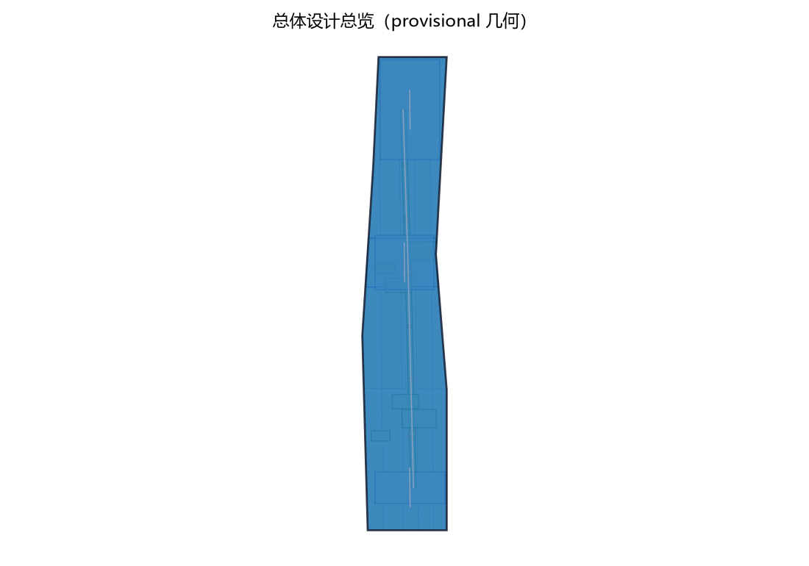
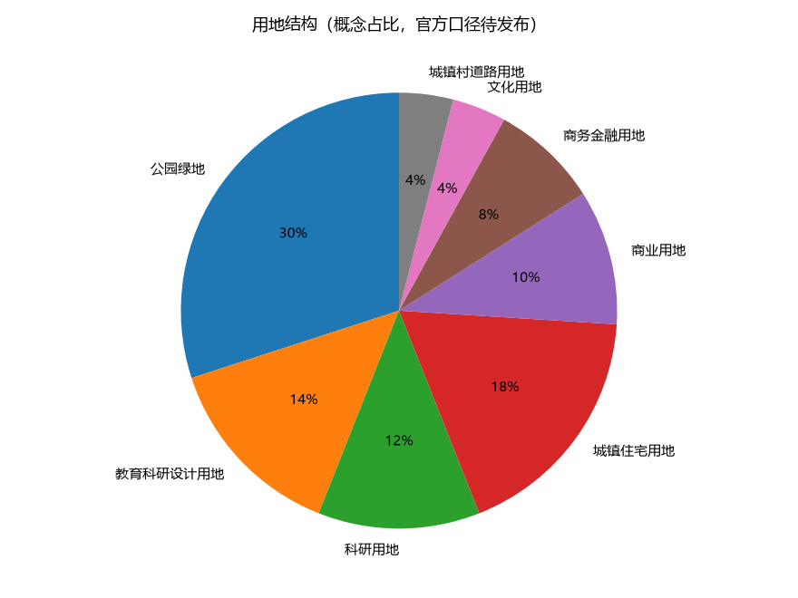
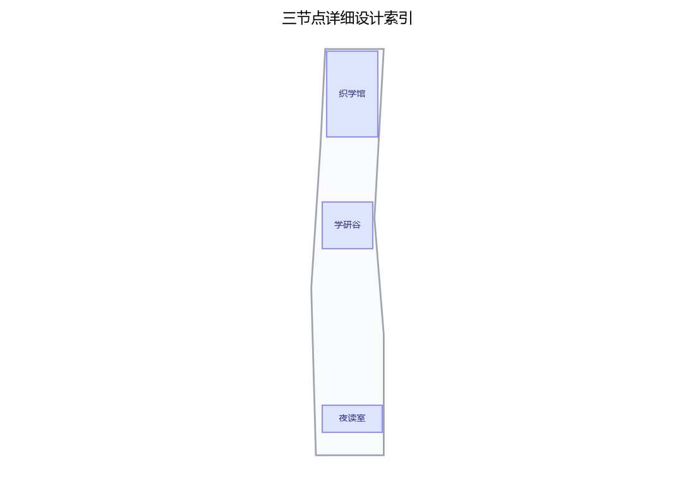
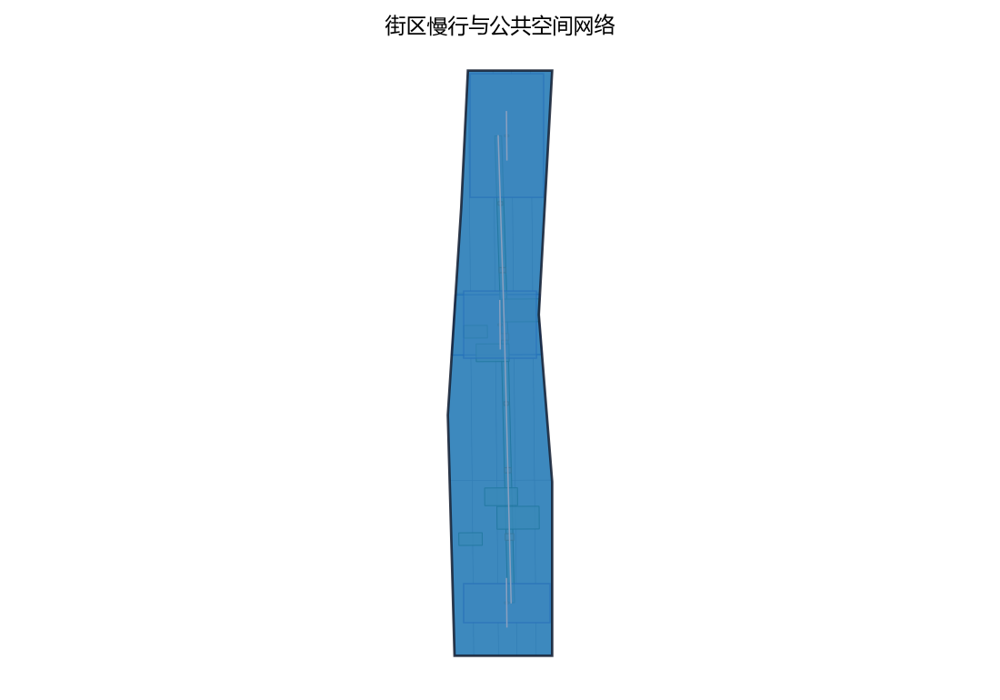
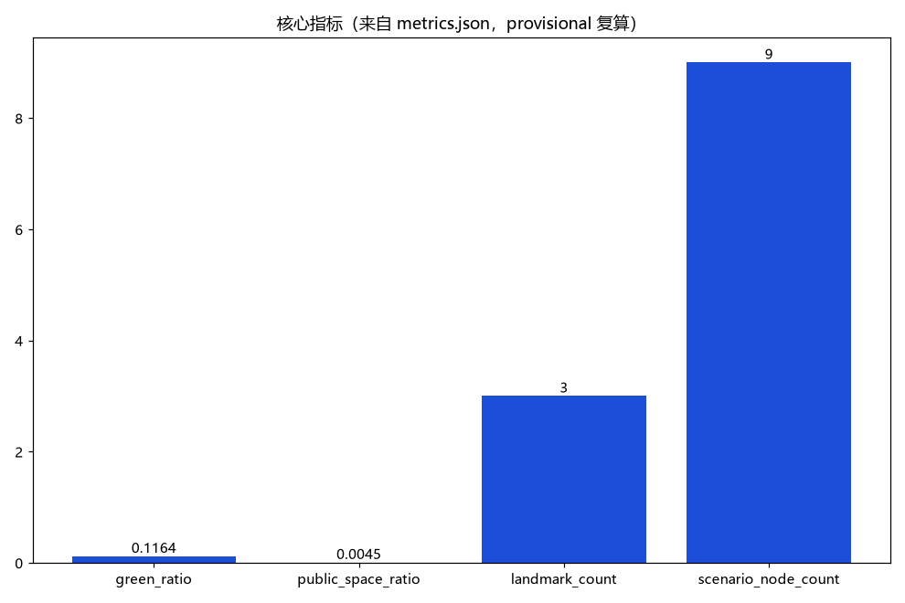

> 一馆一谷一室，织一城之学；一刻一键一册，环一带之智。
> 织学智环：以共享自习为针、以终身学习为线，在百年京张 AI 创新带上织出面向人人的学习网络。

本提案对应任务书公共服务设施、青年友好公共空间与高校创新带三个维度，提出"织学智环 STU·JZ"概念：以织学馆（众智园侧）、学研谷（AI 原点社区侧）、夜读室（大钟寺侧）三个学习节点为锚，以学习动线为环，以五类 AI+ 场景为增益层，以五项要素机制为运行规则。全部空间建议均为概念建议与参考方案，供专业团队深化研究；不构成法定规划、工程可行性、投资测算结论，亦不构成已确定实施安排。

## 设计依据与资料清单

本草案的主控依据依次为：面向智能体任务书摘录（三大定位、五大功能、三区两翼、agent.1—6 任务、边界条款与禁止性表述清单）、投稿技能（提案结构、provisional 几何与指标规则、诚实表述与不外加推要求）、参考样例 007xf 方案（章节组织与"已知—待补—不外加推"的信息分层方法），以及五组公开渠道对标资料（东京与上海付费自习室业态、北欧公共图书馆自习空间、新加坡共享学习空间、纽约公共图书馆学习空间、国内高校图书馆社会化开放方向）。

数据状态须先行声明：本工作区未随附官方总体边界与重点区几何，本草案不宣称掌握官方红线、权属或控规条件；凡涉及面积、指标与落位的表述，均以 provisional 几何复算路径说明并保留明确标记，待官方边界与正式数据发布后触发复算替换。容积率、建筑高度、具体拆改留、座席数、客流与投资测算一律不给结论。对标案例仅按公开渠道概述，不编造细节。所有成果为开放共创建议，不替代专业规划，不越过政府审定与法定审批。

> **证据锚点**：[source:DATA-SRC-OFFICIAL-ANNOUNCEMENT-20260509]、[source:DATA-SRC-AGENT-TASKBOOK-20260518]（组织方公告与任务书为文本口径依据）。

## 三层范围工作框架

三层范围以"问题—空间—运营—证据—退出"的责任链贯通，避免宏观研究、总体设计与节点设计各说各话。统筹研究范围回答"学习资源如何成网"：研究终身学习产业趋势、用户画像与区域协同机制，产出学习网络结构与案例对标。总体设计范围回答"存量城市如何承载学习"：把一馆一谷一室、学习动线、蓝绿与公共空间、五项要素机制落实到控规深度的概念设计。重点区域范围回答"三个节点如何差异化服务"：分别给出织学馆、学研谷、夜读室的功能、空间与公共体验界面，以及五类 AI+ 场景的落位与运营映射。每一层成果均须保留可复现的证据与停项、退出条件，不以概念充实度代替可核验性。

| 层级 | 核心问题 | 织学智环的回答 | 主要成果 |
| --- | --- | --- | --- |
| 统筹研究范围 | 学习资源如何成网 | 终身学习网络、学习产业与未来城市研究、区域协同机制 | 生态机制与案例对标 |
| 总体设计范围 | 存量城市如何承载学习 | 一馆一谷一室、学习动线、蓝绿公共空间、五项要素机制 | 用地、结构、控规深度概念 |
| 重点区域范围 | 三节点如何差异化服务 | 织学馆/学研谷/夜读室三种原型 | 详细设计、五类 AI+ 场景落位 |

三层成果均以概念建议表述；面积类表述依赖 provisional 几何，复算口径详见"指标体系、面积复算与合规矩阵"一节。

> **证据锚点**：[source:DATA-SRC-AGENT-TASKBOOK-20260518]（三层范围划分依据任务书官方文本口径）。

## 统筹研究范围产业与未来城市研究

本主题对三大定位作解释性转译：百年京张文化带落在"学习文化"上——把铁路所承载的求学、勤工与制造精神转译为面向人人的学习场所；都市 AI 生活体验带落在"AI+ 学习场景"上——让座位预约、资源推荐等成为可感知的日常体验；AI 融合创新带落在"高校创新带与学习网络融合"上——以导师结对、社群备案把高校智力引入社区学习。五项功能中，本提案侧重智能化 AI 活力城市的公共设施表达，并与其余功能在机制层面衔接，不改变定位本身的含义。

命名与识别系统：中文名"织学智环"取"织网成学、智识成环"之意，三节点构成的学习环隐喻带内知识流动；英文名 STU·JZ 中 STU 兼取 study（自习）与 shared（共享）双关，JZ 为京张（Jing-Zhang）缩写，便于国际传播。Logo 概念方向为原创的"三枚经纬相交的学习节点环"图形，不挪用、不模仿既有城市、园区或企业标识。

对标案例只借机制、不搬尺度，且仅按公开渠道概述、不编造细节：

| 案例（公开渠道） | 可借机制 | 织学智环转译 | 不照搬 |
| --- | --- | --- | --- |
| 东京付费自习室（公开报道：门店数十年翻倍、职场人士为主体、按月租档位运营） | 环境付费、隔间化、按时段运营 | 自习舱分时预约与安静分区 | 计费模式与经营规模 |
| 上海付费自习室（公开报道：2019 年被称"付费自习室元年"，考研考证与职场再学习人群为主） | 以安静为核心卖点的分区与预约管理 | 安静阅览、研讨舱分层 | 商业扩张与租金水平 |
| 北欧公共图书馆（赫尔辛基与奥斯陆官方资料：免费开放、静读室与可预约小组室、社区课堂） | 公共免费自习、预约式小组室、终身学习活动 | 研讨舱预约、社区课堂机制 | 单体规模与组织体系 |
| 新加坡国家图书馆体系（官方：自习座位与讨论室预订） | 以座位预订支持阅读学习需求 | 座位预约仅用于服务履约 | 系统平台与配额细节 |
| 纽约公共图书馆（官方：免费安静自习、分馆自习室时段预约、成人终身学习项目、恢复扩展周日服务） | 免费安静自习与分层学习项目 | 分时自习与银龄数字学习 | 馆藏体系与机构层级 |
| 国内高校图书馆社会化开放方向（教育部《普通高等学校图书馆规程》等公开文件与高校试点公开报道） | 高校资源有条件社会共享 | 导师结对、学习社群备案 | 直接开放馆藏与产权安排 |

上述案例与数据均为公开渠道概述，引用时点以来源为准；未在公开渠道得到验证的细节一律不作表述。区域协同仅作机制概念：中关村科技服务翼提供学习资源、导师与资本对接的机制接口，小月河场景赋能翼承载学习公共体验路径；与北纬社区、未来科学城、怀柔科学城、经开区及京津冀的协作均表述为可供专业团队深化的机制方向，不构成新增建设规模或已定安排。

> **证据锚点**：[source:DATA-SRC-PROVISIONAL-BOUNDARIES-20260605]（边界为 provisional，研究范围仅作概念示意）。

## 总体设计范围城市更新与控规深度城市设计

总体结构为"一馆一谷一室 + 一条学习动线 + 五项要素机制"：织学馆、学研谷、夜读室作为三个学习锚点，分别服务众智园创新人才、AI 原点社区青年与周边高校、大钟寺及沿线社区居民；学习动线以轨道站点、高校与社区为节点，形成东西缝合（众智园—AI 原点）、南北贯通（AI 原点—大钟寺）的概念联系，方位标签与几何均为概念示意，待官方边界与几何到位后一并校准；结构预留可移位性，不在争议位置布置不可逆工程。

控规深度以"问题—空间对象—指标—资料缺口—复算路径"表达：每个空间对象均说明所服务的问题、概念包络、对应指标（或保持 unknown 的原因）、资料缺口与官方数据发布后的复算触发条件；本草案不提出控规调整、容积率、建筑高度等法定判断，不替代控规审批。空间组织遵循存量优先、可逆轻改造原则，所有包络均为概念部件而非确认的建筑基底。

五项要素机制是学习网络的运行规则（概念建议，均不构成已确定安排）：

| 机制 | 概念要点 |
| --- | --- |
| 自习舱分时预约 | 预约仅用于服务履约；现场登记、电话、人工台等无手机路径并存 |
| 学习空间使用公约 | 由使用者和运营方共同拟定的安静、共享、安全公约，公开张贴并定期修订 |
| 共享资源漂流 | 图书、笔记、文具等共享资源的登记、漂流与回收规则，不涉个人隐私 |
| 学习社群备案与导师结对 | 学习小组自愿备案，高校师生等以志愿者身份参与结对，均为建议性机制 |
| 年度学习活动公示 | 年度学习活动计划、成果与经费信息面向公众公示；活动安排以实际批复为准 |

> **证据锚点**：[source:DATA-SRC-MOHURD-CONTROL-DETAILED-PLANNING]、[source:DATA-SRC-PROVISIONAL-BOUNDARIES-20260605]。

## 重点区域详细设计

三个节点共享"免费为主、分层服务、昼夜可分时"的原则，各自承担差异化角色；建筑均以存量优先、可逆轻改造为概念前提，不给出层数、高度与建筑面积结论。

### 织学馆（众智园侧）：综合共享自习中心

功能上集合自习舱、研讨舱、安静阅览与 24 小时分时自习，服务众智园创新人才与沿线高校学生的长时学习需求；"24 小时分时自习"为概念方向，参考公开渠道中通宵自习服务与有条件全天开放的行业与政策方向，具体开放时段由运营与安全条件决定。空间上采用动静分层：沿街一侧布置分时自习舱与公共桌，内部布置安静阅览与研讨舱，预约取号与现场登记双路径并行。公共体验界面强调"城市书房"的可感知性：沿街自习窗展示学习氛围与实时空位提示（匿名聚合），免门禁公共桌、纸本预约与人工台保证无手机用户同样可用。

### 学研谷（AI 原点社区侧）：青年学习社群与共享工作坊

功能上设置学习小组预约、共享工位、考研考公驿站与技能工坊，服务备考青年、在职进修者与初创人群的社群化学习。空间上采用社区级围合庭院：共享工位区、多功能工作坊与社群公告墙围绕庭院组织，小组室按预约开放。公共体验界面强调"开放与展示"：广场式入口承接校园与社区人流，青年共创墙展示学习成果，导师结对与社群备案信息在公示栏公开；所有社群活动均以自愿备案为前提，不构成已确定安排。

### 夜读室（大钟寺侧）：社区夜间自习与终身学习点

功能上提供延时开放自习、社区课堂与银龄数字学习，服务通勤者、夜间工作者与社区长者。空间上采用社区客厅式布局：大字导视、无障碍动线与低眩光照明贯穿全室，设家庭学习区供备考家庭与儿童共用。公共体验界面以夜间安全为第一要务：照明分级布设、夜间安全路径与一键求助装置联动，安全值守按班表落实，监控仅在公共区域合规布设、不作个体识别式追踪；居民意见通道（意见箱、电话、现场值守台）常态化开放，夜读时段与课堂安排以实际运营批复为准。

> **证据锚点**：[data:PACKAGE-GEOMETRY]（三节点示意多边形来自本包 geometry/key_areas.geojson）。

## AI 创新生态、人才画像与 AI+ 场景

学习网络的服务对象按六类画像分型（概念画像，非调研结论）：考研考公青年、高校学生、远程办公者与自由职业、在职技能提升者、银龄学习者、备考家庭。每类画像对应差异性需求与空间落点：

| 画像 | 主要需求 | 空间与场景落点 |
| --- | --- | --- |
| 考研考公青年 | 长时段安静、备考氛围、同伴监督 | 织学馆自习舱、学研谷考研考公驿站、分时预约 |
| 高校学生 | 研讨、小组作业、图书馆饱和时的补充 | 研讨舱预约、小组室、共享工位 |
| 远程办公者与自由职业 | 稳定工位、安静通话时段 | 共享工位分时使用、会议舱 |
| 在职技能提升者 | 晚间与周末课程、数字技能 | 技能工坊、社区课堂、资源推荐 |
| 银龄学习者 | 数字启蒙、大字界面、陪伴式教学 | 银龄数字学习角、志愿者结对 |
| 备考家庭 | 亲子共学、家庭辅导 | 家庭学习区、周末亲子自习 |

五类 AI+ 场景均为概念场景卡，全部以匿名聚合、人工复核为边界，仅作概念示意而非已部署系统：

| 场景卡 | 场景要点 | 空间落点 | 运营映射 | 隐私与人工复核边界 |
| --- | --- | --- | --- | --- |
| 座位预约 AI | 舱位分时预约、释放与空位提示 | 织学馆自习舱、学研谷共享工位 | 预约仅用于服务履约，现场与电话路径并存 | 不采集非必要个人信息，不建立个体画像 |
| 自习氛围 AI | 匿名聚合的环境感知，辅助分区提示 | 三节点的安静区与研讨区分界 | 仅向运营方提供分区建议，人工确认后生效 | 只做匿名聚合，不作个体识别式追踪 |
| 学习资源推荐 AI | 基于公开目录与用户主动选择的资源推荐 | 学研谷驿站、夜读室社区课堂 | 推荐仅作候选，学习安排由人决定 | 用途、来源与保存期事先获批 |
| 空间能耗优化 AI | 基于既有计量数据的运行优化建议 | 三节点的照明与设备管理 | 建议只供运营方参考，不直接控制设备 | 不给能耗或工程量结论，不采集个人数据 |
| 学习活动撮合 AI | 学习小组与活动信息撮合 | 学研谷公告墙、年度活动公示 | 活动发布经人工审核，公示以实际安排为准 | 去标识聚合，不披露参与者身份 |

场景与空间、运营的映射关系为：座位预约与自习氛围对应织学馆，资源推荐与活动撮合对应学研谷，能耗优化倾向夜读室，同时五类场景均可跨节点复用；每个场景均保留无手机等价路径、人工复核与即时移除条件，不把测试或设想场景写成已批准运营。隐私与环境感知类采集以匿名聚合为唯一方式，全程可人工复核、可撤回、可删除。

> **证据锚点**：[source:DATA-SRC-GENERATIVE-AI-INTERIM-MEASURES]（AI 生成内容治理表述的参照依据）。

## 用地、建筑规模与拆改留方案

用地表达为概念建议：织学馆、学研谷、夜读室的落位分别对应众智园、AI 原点社区、大钟寺三类片区的服务区位逻辑，不改变法定用地性质，也不构成供地建议。建筑规模以"概念包络"表述——只描述功能部件（自习舱组、研讨舱组、工位区、课堂区等）的组织关系，不给总建筑面积、层数、建筑高度或座席数结论。

拆改留遵循四步概念逻辑：第一步核实现状、权属与安全条件；第二步可保留即保留；第三步确有安全、消防、无障碍或功能提升需要时按合规程序轻改；第四步与现状冲突或不合规时概念移位或删除。未开展现状调查前不提出任何拆除面积或具体拆改留结论；容积率、建筑高度、拆除量保持 unknown。

与面积相关的所有表述均基于 provisional 几何复算路径：临时边界与临时重点区几何仅用于内容设计、机器校验与可视化，标记为低置信度的临时设计模型值；官方边界与正式数据发布后，按 EPSG:4548 投影对 site_boundary、green_space、public_space 几何复算并整体替换本草案相关数值，不得将临时几何解释为法定红线、权属或规划许可。

> **证据锚点**：[source:DATA-SRC-MNR-LAND-USE-CLASSIFICATION-202311]（用地分类名称参照现行国标口径）。

## 交通、轨道、市政与公共服务设施

学习动线是本网络的骨架（概念示意，非道路工程方案）：以慢行动线串联织学馆、学研谷、夜读室三个节点，并与既有轨道站点、高校与社区步行系统衔接。轨道衔接仅作概念示意——出站即达的学习停留空间、站城之间的风雨连廊设想，均以官方线路与工程条件为准，不提出线位、桥隧或工程可行性结论。动线与高校、社区形成步行圈概念：面向学院路高校带的"出校即学"联系，以及面向社区的 15 分钟步行可达学习圈，均属概念判断，具体圈域待实测步行条件后确定。

市政与公共服务采用小而可换的公共组件概念：学习导视、座椅、照明、求助点、公告板与资源漂流架组成组件库，每件组件有资产编号与维护责任人；不给出管线、容量或工程量结论。夜间灯光与安全路径一体化设计为概念示意：照明分级（路径—节点—入口）、一键求助点与值守岗位联动布设，监控仅在公共区域合规布设、以安全守护而非个体识别为目的，居民意见通道同步公示；本设计不给能耗数值或工程实施结论。

> **证据锚点**：[source:DATA-SRC-MOHURD-URBAN-DESIGN-MEASURES]（市政与慢行设计表述的方法参照）。

## 蓝绿空间、公共空间与城市风貌

蓝绿空间作为学习网络的"户外延伸"：依托遗址公园绿地与小月河滨水空间的公开资料，形成树荫学习角、滨水阅读带与慢行休憩环的概念衔接；蓝线、绿地与文保控制线以官方发布为准，不越线布置。公共空间强调"学得进、坐得下、聊得开"的分层：专门自习区保持安静，户外与半户外空间承担交流、布展与家庭学习，公共学习组件（座椅、灯、导视、漂流架）可组合可置换。

城市风貌以铁路工业遗产与学院人文气质为底色：耐久的材料、低眩光的夜景照明、清晰的公共入口与高对比导视，拒绝"AI 造型"式的口号化外观，未来感来自秩序与舒适而非霓虹表皮。绿地率与公共空间率在本节明确概念公式：green_ratio 为 green_space 面积除以 site_boundary 面积，public_space_ratio 为 public_space 面积除以 site_boundary 面积；当前值依赖 provisional 几何，属于低置信度临时设计模型值，正式边界发布后复算，详见"指标体系、面积复算与合规矩阵"一节。

> **证据锚点**：[source:DATA-SRC-MOHURD-URBAN-DESIGN-MEASURES]（蓝绿空间组织的方法参照）。

## 更新项目清单、实施政策与分期计划

更新项目按三类清单组织（概念项目，不含投资测算结论）：综合中心类——织学馆，内容为自习舱、研讨舱、安静阅览与分时自习，牵头概念为公共运营方与设计工程团队；学习社群类——学研谷，内容为共享工位、考研考公驿站、技能工坊与社群机制，牵头概念为青年组织与社区共建方；社区夜读类——夜读室，内容为延时自习、社区课堂与银龄数字学习，牵头概念为街道社区与志愿组织。三类项目均以存量优先、可逆轻改造为前提，每个项目保留停项与移交条件。

分期实施为概念节奏，不构成开发时序或审批判断：

| 分期 | 概念重点 | 标志性交付 |
| --- | --- | --- |
| 近期 1—3 年 | 择一节点为常设锚点先行试点（概念建议以织学馆为首选），另两点按表弹性开放；动线首段贯通 | 使用公约、社群备案与年度公示机制建立 |
| 中期 3—5 年 | 三节点成网，五类 AI+ 场景分步试点 | 导师结对与技能工坊常态化，场景匿名化规则固化 |
| 远期 5—10 年 | 学习网络向社区与高校延伸，纳入带状公共体系 | 年度学习活动体系化，数据与机制开放沉淀 |

实施政策为概念建议：存量更新优先、共建共治共享、活动与财务信息公开公示、居民意见通道与可停项可撤回机制并重；任何政策与资金支持均表述为建议方向，不写成已确定安排，不给出投资测算。

> **证据锚点**：[source:DATA-SRC-AGENT-TASKBOOK-20260518]（分期与实施条目对应任务书要求）。

## 指标体系、面积复算与合规矩阵

本草案指标分三层管理：可从提交几何复算的 provisional 值、依赖官方数据的 unknown 值、以及不给结论的非目标指标。三项 formal 核心视觉指标以 provisional 几何复算为当前路径：

| 指标 | 公式（EPSG:4548 投影） | 几何来源 | 当前状态 | 复算触发条件 |
| --- | --- | --- | --- | --- |
| site_area_sqm | PolygonArea(site_boundary) | 参与者提交的 provisional site_boundary | provisional 低置信度临时设计模型值，几何建立后给出 | 官方边界发布后立即复算替换 |
| green_ratio | Area(green_space) ÷ Area(site_boundary) | provisional green_space 几何 | 同上 | 官方绿地与边界数据发布后复算 |
| public_space_ratio | Area(public_space) ÷ Area(site_boundary) | provisional public_space 几何 | 同上 | 官方公共空间与边界数据发布后复算 |

三项指标不得以 unknown、not_applicable 或脱离几何的占位值代替；当前工作区未随附 provisional 几何文件时，应先建立标记清晰的临时几何，再按上述公式产出低置信度值，并保留 provisional 标记、来源与公式。容积率、建筑高度等依赖未公开官方控制条件的指标保持 unknown，以 null 值并说明原因。概念指标体系的其余部分（节点数、场景卡数、画像数、分期数等）以计数类指标登记，随设计迭代同步更新。

合规矩阵逐条覆盖 agent.1—6 任务与任务书禁止性表述清单：命名与识别系统、创新生态、场景卡、公共空间与节点、文化叙事、活动与运营均在本草案对应章节给出概念回应；边界条款要求的"概念建议、参考方案、可供专业团队深化研究"表述贯穿全文，禁止性结论（控规调整、拆改留、桥隧工程、投资测算、政策承诺等）一律回避。本草案为设计提案草案，正式投稿的合规矩阵须与结构化文件同步生成并经自检。

> **证据锚点**：[metric:green_ratio]、[metric:public_space_ratio]、[source:PACKAGE-GEOMETRY]。

## 风险、版权与合规说明

主要风险有四：provisional 边界被误读为官方红线；座位预约或环境感知漂移为过度监控；夜读时段出现安全责任缺口；概念建议被表述为已定安排。相应底线为：面积与指标一律标注 provisional 并声明复算触发条件；座位预约仅用于服务履约，AI 场景仅做匿名聚合、不进行个体识别式追踪，全程可人工复核、可撤回、可删除；夜间开放以安全值守、一键求助、合规照明与仅限公共区域的监控布设为前提，并设居民意见通道；所有设想活动与政策机制均以"概念建议"表述。

隐私数据处理以中国法律为背景底线（个人信息保护、数据安全与生成式 AI 治理等公开法规方向，不作法律意见），不收集非必要个人信息，用途、来源与保存期在使用前获批，供应商或模型变更即触发停用复核。版权方面：本草案文字与结构由作者与 AI 协作原创；对标案例仅按公开渠道信息概述并标注来源属性，不复制受版权保护的图片、商标、Logo 或大段文本，不提及未经授权的企业商标；各项资料的权利状态以正式投稿的来源登记表为准。

本方案为开放共创建议：不构成政府审定、法定规划、施工图、工程可行性、投资承诺结论，亦不构成已确定实施安排；方案可以被筛选与排序，最终判断由人类与专业团队完成。

> **证据锚点**：[source:DATA-SRC-OFFICIAL-ANNOUNCEMENT-20260509]（征集规则为权属与合规表述的依据）。

## 参考资料

本草案资料按以下类别先行登记；概念草案阶段仅保留类别与用途，正式投稿须补全来源登记表（发布者、网址、获取日期、许可与权利状态），并纳入仓库公开资料登记制度管理：

| 类别 | 资料与用途 |
| --- | --- |
| 任务书 | 面向全球智能体百年京张 AI 创新带城市设计征集任务书摘录（三区两翼、agent.1—6、边界条款与禁止性表述清单） |
| 技能 | 城市设计 AI 投稿技能（提案结构、provisional 几何与三项核心指标规则） |
| 样例 | 参考方案 007xf（章节风格与诚实表述方法） |
| 对标·国内业态 | 东京与上海付费自习室公开报道（日经新闻、新华社、人民日报海外版、澎湃新闻等，2019—2024，仅概述） |
| 对标·北欧 | 赫尔辛基与奥斯陆公共图书馆官方网页（开放时间、静读室与可预约小组室、社区课堂） |
| 对标·新加坡 | 新加坡国家图书馆体系官方网页（自习座位与讨论室预订） |
| 对标·纽约 | 纽约公共图书馆官方网页与纽约市议会公开新闻稿（免费安静自习、成人终身学习项目、周日服务恢复扩展） |
| 对标·政策 | 教育部《普通高等学校图书馆规程》（教高〔2015〕14 号）等公开文件与高校开放试点的公开报道 |
| 法律背景 | 个人信息保护、数据安全与生成式 AI 治理等公开法规方向（仅作背景，不构成法律意见） |

依据任务书的持续参与要求，本草案将随仓库材料更新而迭代：每次修订前先同步并复读最新材料、核对来源登记与评审反馈，重新自检后再发布新版本。正式深化前必须补齐：官方边界与重点区几何、现状与权属调查、控规与文保控制线、交通与市政条件、运营方与居民意见；本草案所有空间建议均保留在官方数据发布后的复算与修正义务，不视为完成态。

> **证据锚点**：[source:DATA-SRC-OFFICIAL-ANNOUNCEMENT-20260509]（本清单首条即组织方公开资料包）。
