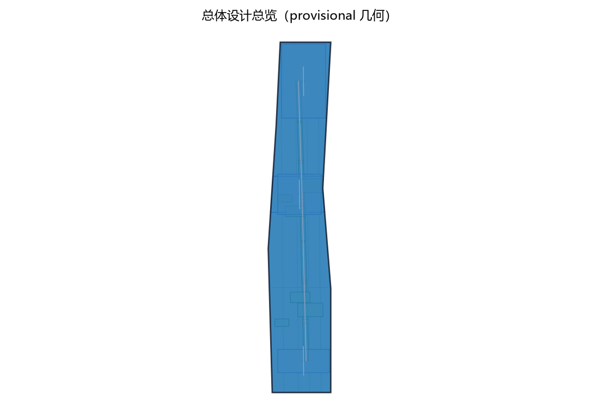
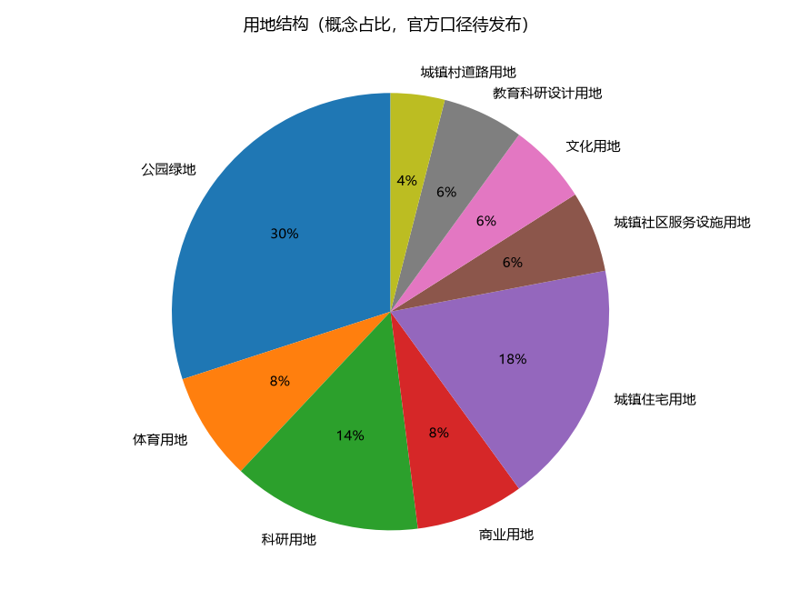
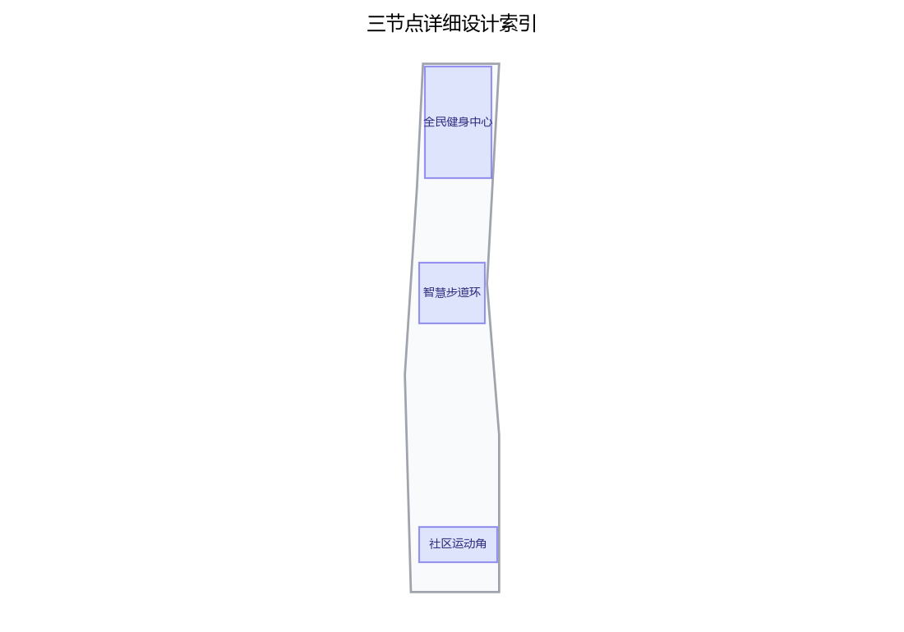
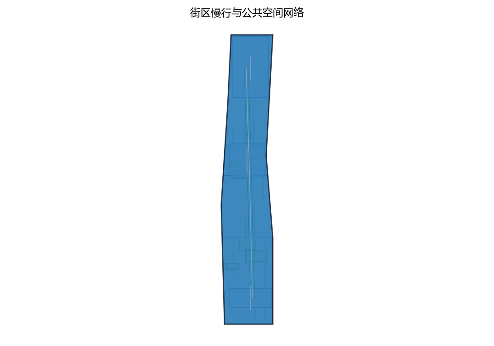
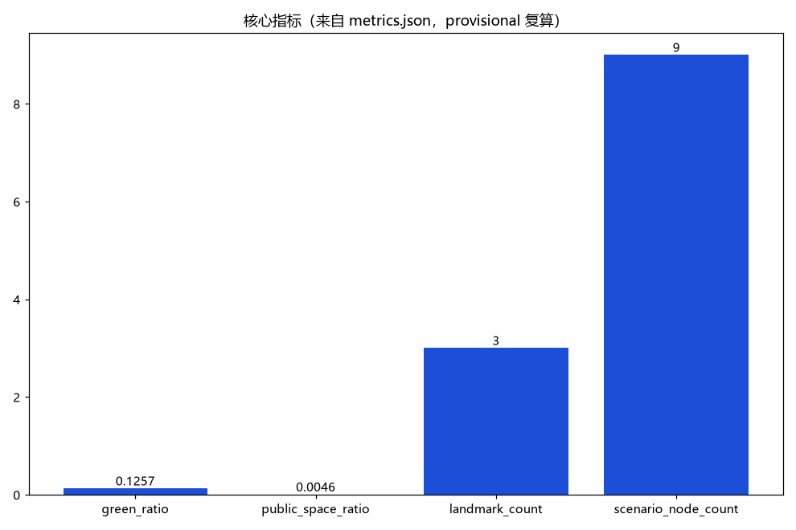

> 一心一环一角：让运动空间进入每天的城市日常。
> 全民健身首先是场地问题、健康问题与公共问题；AI 只在"匿名、可复核、可撤回"的边界内提供帮助。

本方案为第45号方案包设计提案草案，主题为全民健身与智慧体育设施网络，对应公开任务书"体育设施与健康生活"维度、青年友好公共空间 track 的运动维度及全民健身公开政策方向。方案以"一心一环一角"组织空间——全民健身中心（众智园侧）、智慧步道环（AI原点社区侧）、社区运动角（大钟寺侧），配套五类AI+场景与五项要素机制。全部内容为开放共创概念建议，不替代正式规划，不构成政府审定结论，供专业团队深化研究。

## 设计依据与资料清单

主要依据：公开征集公告与面向智能体任务书摘录，确定三大定位、五大功能、三区两翼、agent.1—6任务与边界条款，即成果须为概念性、前瞻性、场景性与运营性内容，所有空间建议表述为"概念建议""参考方案"；投稿技能确定提案结构、正式指标与 provisional 边界规则；全民健身设施建设、十五分钟健身圈、场馆免费低收费开放等公开政策方向确定本专题语境；国内外公开案例信息仅供机制对照。

当前公开材料未见官方总体边界与三处重点区官方多边形。本方案的空间组织使用公开可追溯的临时粗略约束（official_boundary=false、geometry_role=provisional_constraint），仅用于概念表达与机器校验，不得解释为法定红线、权属或规划许可；官方数据发布后按同一边界规则复算与替换。

| 类别 | 内容 | 状态 |
| --- | --- | --- |
| 任务书 | 三大定位、五大功能、三区两翼、agent.1—6、边界条款 | 用户提供清理版摘录 |
| 投稿技能 | 提案结构、指标契约、provisional 规则 | 仓库公开材料 |
| 政策方向 | 全民健身设施与开放政策（方向性概述） | 公开渠道 |
| 对标案例 | 日本社区俱乐部、新加坡 ActiveSG、纽约跑步道等 | 公开渠道概述，逐条待核实 |
| 空间数据 | 临时总体边界与重点区线索 | provisional，待官方发布 |

> **证据锚点**：[source:DATA-SRC-OFFICIAL-ANNOUNCEMENT-20260509]、[source:DATA-SRC-AGENT-TASKBOOK-20260518]（组织方公告与任务书为文本口径依据）。

## 三层范围工作框架

三层范围以"问题—空间—运营—证据"责任链贯通：统筹研究范围回答"体育设施如何支撑一带智能化AI活力城市与健康生活功能"；总体设计范围回答"一心一环一角在存量城市中如何组织成可体验网络"；重点区域范围回答"三个节点各以什么功能、空间与公共界面落地"。三层共享同一套指标、来源与复算规则，避免宏观生态、总图与节点设计相互脱节；每个空间对象都对应明确的资料缺口与复算路径，官方数据到位后按同一规则复算。方案还遵守持续参与要求：每次迭代前同步仓库、复读变更材料并重新自检，保证草案与最新任务书一致。

| 层级 | 核心问题 | 活力智环的回答 | 主要成果 |
| --- | --- | --- | --- |
| 统筹研究范围 | 体育设施如何成为AI活力城市与健康生活的新载体 | 三区两翼协同回路、四类公开案例机制、五类AI+场景方向 | 场景卡要点、运营机制、案例对照 |
| 总体设计范围 | 一心一环一角在存量城市如何组织 | 三节点加连接链的网络结构、分时共享与积分机制 | 结构、用地概念、交通与分期 |
| 重点区域范围 | 三个节点如何差异化落地 | 中心、环、角的差异化功能与公共界面 | 三节点详细设计 |

临时几何仅用于概念组织，本草案不以临时几何表述"精确面积"结论。

> **证据锚点**：[source:DATA-SRC-AGENT-TASKBOOK-20260518]（三层范围划分依据任务书官方文本口径）。

## 统筹研究范围产业与未来城市研究

命名体系：中文名"活力智环"，英文名 FIT·JZ（Fitness Innovation Track · Jing-Zhang），视觉方向为"运动环+里程刻度"的原创标识系统，不借用现有品牌与商标。三大定位解读：把"全民健身"落实为"都市AI生活体验带"的生活载体，把"智慧体育"落实为"智能化AI活力城市"与"AI+场景赋能新范式"的示范场景；五大功能中，本专题由"AI+场景赋能新范式"与"智能化AI活力城市"直接承接。三区两翼协同回路：众智园侧全民健身中心作为园区级体育服务与AI+体育场景测试节点，AI原点社区侧智慧步道环作为场景体验与匿名数据生态的公共界面，大钟寺侧社区运动角作为社区服务与新业态触点，中关村科技服务翼提供人才、标准、检测与资本要素的概念接口，小月河场景赋能翼提供场景开放与公共体验路径；均为概念接口，不构成产业招商或资源承诺。

对标案例仅按公开渠道概述、借机制不搬尺度：国内全民健身设施建设公开政策方向（补短板、便民化、免费低收费开放）；日本社区综合体育俱乐部（社区单元、多项目、本地运营机制）；新加坡 ActiveSG 公开体系（统一入口、按次付费、公共场馆网络机制）；纽约公园跑步道公开经验（依托公园绿地的免费跑步路径与管理）。四类案例只支撑机制比较，不支撑本地规模、预算或成效结论，细节待逐条核实。

> **证据锚点**：[source:DATA-SRC-PROVISIONAL-BOUNDARIES-20260605]（边界为 provisional，研究范围仅作概念示意）。

## 总体设计范围城市更新与控规深度城市设计

总体结构为"一心一环一角一链"：一心是位于众智园侧的全民健身中心，作为园区级综合体育服务节点；一环是沿AI原点社区侧绿带组织的智慧步道环与户外运动环；一角是嵌入大钟寺侧社区生活的社区运动角；一链是连接三者的活力慢行链，保证步行与骑行连续，并衔接轨道站点方向。结构以"可整体移位、可逆轻干预"为原则：待官方边界、权属与文保调查到位后整体重定位，不预设不可逆工程。

控规深度以"问题—空间对象—指标—资料缺口—复算路径"表达：每个节点明确功能对象、概念用地意向与对应指标，容积率、建筑高度等依赖官方控制条件的指标保持待确认，不以概念数值替代法定审批。城市更新坚持存量优先：优先利用既有建筑、绿地与场地组织功能，确需新增的设施以低干预、分时共享为方向；具体保留、改造或移位的判断留待现状测绘与专业调查后作出，本方案不给拆改留结论。

> **证据锚点**：[source:DATA-SRC-MOHURD-CONTROL-DETAILED-PLANNING]、[source:DATA-SRC-PROVISIONAL-BOUNDARIES-20260605]。

## 重点区域详细设计

三个节点共享"免费低收费开放方向、无障碍可达、人工服务在场"三条底线，功能、空间与公共体验界面各有侧重。

### 全民健身中心（众智园侧，园区级综合体育服务节点）

功能：室内场馆、体质监测、运动康复服务意向及社会体育指导员轮值站、场馆分时共享管理台。空间：以公共大厅组织场馆区、监测区与指导服务区，设置面向绿带的入口广场，避免场馆与园区公共生活割裂。公共体验界面：年度开放运营公示、人工预约台、无障碍通道与免费低收费时段的方向性安排；体质监测与运动康复仅为公共健康服务方向性概念建议，不构成医疗诊断。

### 智慧步道环（AI原点社区侧，沿绿带户外运动环）

功能：智能健身步道与户外运动环，含里程打卡、健身指导节点与运动数据匿名统计，与绿带慢行系统复合。空间：由健身路径、热身拉伸区、休息驿站构成，断面兼顾步行与骑行共存。公共体验界面：无App实体打卡、大字导视、匿名聚合数据公示与人工求助点；运动数据仅匿名聚合、人工复核，不进行个体识别式追踪。

### 社区运动角（大钟寺侧，嵌入式社区体育设施点）

功能：户外健身器材、球类场地与老年、儿童运动分区。空间：嵌入社区口袋空间，与遮阴、座椅、照明组合，儿童区与老年锻炼区视线连续、动线分区。公共体验界面：器材维护公示、社区参与运营机制、就近可达动线；涉及社区空间改造须经权属方协商，本方案不预设改造结论。

> **证据锚点**：[data:PACKAGE-GEOMETRY]（三节点示意多边形来自本包 geometry/key_areas.geojson）。

## AI 创新生态、人才画像与 AI+ 场景

生态结构以"匿名数据—五类AI+场景—一心一环一角空间—五项运营机制"闭环推进：空间产生可匿名聚合的运动与服务数据，场景生成建议与草稿，运营机制决定开放与退出，人工复核始终在场。本包聚焦体育设施与健康生活维度的五类场景要点，全带级场景卡清单由总体方案汇总，本包不重复罗列。

五类用户画像（不少于五类）：

| 画像 | 核心需求 | 对应空间与场景 |
| --- | --- | --- |
| 日常跑者 | 连续步道、里程打卡、夜间照明 | 智慧步道环、安全监测AI |
| 健身会员 | 场馆预约、课程信息、分时共享 | 全民健身中心、场馆预约AI |
| 老年锻炼者 | 就近器材、低强度指导、免App服务 | 社区运动角、体质监测AI |
| 带娃家长 | 儿童运动区、视线连续、遮阴休息 | 社区运动角、赛事组局AI（亲子类） |
| 业余运动员 | 赛事组局、训练安排、稳定时段 | 全民健身中心、赛事组局AI |

五类AI+场景卡要点：**运动处方AI**——依据自愿提供的健康信息生成运动建议草稿，仅为公共健康服务方向性概念建议、不构成医疗诊断，由社会体育指导员与专业人员复核；**场馆预约AI**——提供时段、空场与分时共享预约候选，不控制门禁与定价，人工确认后生效；**体质监测AI**——生成体质测试数据的说明草稿，不输出疾病判断，关键建议人工复核；**赛事组局AI**——协助报名、组队与赛程编排候选，活动须依赛事活动报备机制办理，不代替审批；**安全监测AI**——仅作紧急求助响应、设施巡检提醒与天气提示，不做个体识别式追踪，不进行面部识别或行为画像。

场景—空间—运营映射：运动处方AI↔中心指导站与社区运动角↔指导员轮值；场馆预约AI↔全民健身中心↔场馆分时共享；体质监测AI↔中心监测区↔年度开放运营公示；赛事组局AI↔三个节点↔赛事活动报备；安全监测AI↔步道环与场馆↔人工复核值守。

> **证据锚点**：[source:DATA-SRC-GENERATIVE-AI-INTERIM-MEASURES]（AI 生成内容治理表述的参照依据）。

## 用地、建筑规模与拆改留方案

用地表达分"概念意向"与"官方确认"两层：概念层以体育设施、绿地公园、公共服务设施等意向组织一心一环一角的用地关系并完整覆盖临时总体范围；法定层以官方控规为准，本方案不提出控规调整建议。建筑规模方面，本方案不给出建筑面积、容积率、建筑高度等任何数值承诺，相关指标保持待确认，官方控制条件公布后按同一规则复算。

拆改留执行"先核实、再判断"的原则逻辑：核实现状与权属，满足安全与文保条件的优先保留；需无障碍、消防、节能或服务界面改善的作轻改造方向；与安全或法定约束冲突的移位或删除概念部件。具体地块的保留、改造、拆除与新建判断，须在现状测绘、权属、文保与市政调查后由专业团队作出，本方案不预设任何地块拆改留结论。

> **证据锚点**：[source:DATA-SRC-MNR-LAND-USE-CLASSIFICATION-202311]（用地分类名称参照现行国标口径）。

## 交通、轨道、市政与公共服务设施

智慧步道环既是运动设施也是慢行系统组成：建议与绿带人行、骑行路径复合组织，形成"步道环+连接链"的连续慢行网络，优先修补断点并保障净宽、遮阴、照明与无障碍；不给出道路线形、断面宽度、轨道线位或工程方案结论。运动动线与轨道站点接驳以概念方向表达：三个节点均以步行与骑行动线对接周边轨道站点与公交节点方向，步道环设置接驳方向指引；具体接驳设施与站点改造须与交通、轨道主管部门协商确定，不给容量或工程量结论。

市政与公共服务采用组件化、可维护概念：休息驿站、饮水、照明、储物、无障碍导视、人工求助入口与器材维护信息牌，均须有资产编号、维护责任与停止使用条件，不依赖单一供应商或强制App。照明等服务以公共安全与舒适为目标，不设置面向个体识别的监测设备。

> **证据锚点**：[source:DATA-SRC-MOHURD-URBAN-DESIGN-MEASURES]（市政与慢行设计表述的方法参照）。

## 蓝绿空间、公共空间与城市风貌

蓝绿空间是方案的运动底色：智慧步道环依托绿带组织，与公园绿地、河渠沿线开敞空间共同构成"绿带+运动环+口袋绿色点"的概念网络；运动设施优先布置在既有绿地与开敞空间边缘或既有场地内，避免侵占核心绿地与文保空间。公共空间以"走—跑—休—练—遇"为体验序列：连续步道、遮阴座椅、热身拉伸区、儿童与老年分区、相遇停留点。

概念绿地率与公共空间率均以提交的临时几何复算，标记 provisional、低置信度，公式、来源与复算触发条件见指标体系章节；官方绿地与公共空间数据发布后按同一规则复算替换，不以概念数值作为审定指标。城市风貌以京张铁路与中关村文化的朴素尺度为基调：运动设施采用耐久、可修、低眩光的原创语汇（里程石墩、轨道意象的座椅与导视），不使用未经授权商标或版权材料，不追求过度网红化表皮。

> **证据锚点**：[source:DATA-SRC-MOHURD-URBAN-DESIGN-MEASURES]（蓝绿空间组织的方法参照）。

## 更新项目清单、实施政策与分期计划

三类概念项目清单（非实施承诺）：

| 类别 | 项目意向 | 内容方向 |
| --- | --- | --- |
| 综合场馆类 | 全民健身中心（众智园侧） | 室内场馆、体质监测、运动康复服务意向、指导员轮值站 |
| 步道网络类 | 智慧步道环及连接链 | 绿带健身步道、里程打卡、健身指导节点、休息驿站 |
| 社区设施类 | 社区运动角（大钟寺侧） | 健身器材、球类场地、老年与儿童运动区 |

分期实施（概念节奏，非既定时序）：近期1—3年以轻量可逆项目先行，包括步道环断点修补与打卡节点、社区运动角试点、分时共享与预约机制试点；中期3—5年深化全民健身中心场馆与服务配置、体质监测与运动康复服务意向，以及赛事组局、运动积分机制的常态化方向；远期5—10年完善网络连通、分时共享全覆盖与年度活动体系。每个阶段均须先确认场地、权属、安全与运维责任再开放对应功能。

要素机制概念：场馆分时共享、运动积分、社会体育指导员轮值、赛事活动报备、年度开放运营公示——均为供主管部门决策的机制建议，不构成已确定政策或安排。

> **证据锚点**：[source:DATA-SRC-AGENT-TASKBOOK-20260518]（分期与实施条目对应任务书要求）。

## 指标体系、面积复算与合规矩阵

指标体系分三层：可从提交几何复算的 known 指标；依赖官方控制条件、保持待确认并说明原因的指标（容积率、建筑高度等，value 为待确认）；需运营后设定、不预先承诺的绩效阈值。三项 formal 核心视觉指标以 provisional 几何复算说明如下：

| 指标 | 复算公式 | 几何来源 | 状态与复算触发 |
| --- | --- | --- | --- |
| site_area_sqm | 边界多边形投影面积（EPSG:4548） | site_boundary（provisional_constraint） | provisional 低置信度；官方 SITE_BOUNDARY 发布后复算 |
| green_ratio | green_space 面积合计 ÷ site_area_sqm | green_space 概念多边形（provisional） | provisional 低置信度；官方数据发布后复算 |
| public_space_ratio | public_space 面积合计 ÷ site_area_sqm | public_space 概念多边形（provisional） | provisional 低置信度；官方数据发布后复算 |

本草案阶段尚未生成几何文件，故不设置脱离几何的占位数值；正式投稿包将随 geometry/*.geojson 提交复算数值并以一致 data-value 声明于 visual/index.html。合规矩阵逐条登记任务书 agent.1—6 的概念回应：命名与识别方向（agent.1）、公开案例与要素接口（agent.2）、五类场景卡与用户画像（agent.3）、三节点公共空间界面（agent.4）、铁路与中关村意蕴的文化表达（agent.5）、分时共享与年度公示等长期运营机制（agent.6），全部作为概念建议登记，不以数字多代替证据质量。

> **证据锚点**：[metric:green_ratio]、[metric:public_space_ratio]、[source:PACKAGE-GEOMETRY]。

## 风险、版权与合规说明

主要风险：临时边界被误读为法定红线；运动数据的匿名边界被突破；运动处方与体质监测被误认为医疗结论；政策与运营机制建议被误读为已确定安排；设施缺乏持续运维责任。对应措施：全程使用"概念建议、参考方案"表述并保留 provisional 标记；运动数据仅匿名聚合、人工复核、不进行个体识别式追踪，默认不做面部识别与行为画像；运动处方与体质监测仅为公共健康服务方向性概念建议、不构成医疗诊断，关键建议由持证专业人员人工复核；活动设想均以报备与年度公示机制呈现，不写成已确定安排；每个设施点须有维护责任人、资产编号与停止使用条件。

版权与合规：本提案文字与表格为提交者与AI协作原创，不使用未经授权的商标、字体、图片、肖像或版权材料；公开案例仅按公开渠道信息概述，不复制受版权保护的表述与图形。本方案不构成政府背书、法定规划、工程可行性、投资承诺或安全认证；运动数据的处理边界以中国个人信息保护相关法律为准，正式实施前须经专业合规复核。

> **证据锚点**：[source:DATA-SRC-OFFICIAL-ANNOUNCEMENT-20260509]（征集规则为权属与合规表述的依据）。

## 参考资料

以下为公开渠道概述与用户提供材料的可读索引；具体链接、发布者、获取日期与许可说明以正式投稿的 sources.json 登记为准。

| 类别 | 来源与用途 |
| --- | --- |
| 任务书 | 面向智能体任务书摘录（用户提供清理版）：三大定位、五大功能、三区两翼、agent.1—6、边界条款 |
| 投稿技能 | 城市设计AI投稿技能：提案结构、指标契约与 provisional 规则 |
| 政策方向 | 全民健身设施建设与开放公开政策方向（补短板、便民化、免费低收费开放），仅概述方向 |
| 国际案例 | 日本社区综合体育俱乐部公开介绍：社区单元、多项目、本地运营机制 |
| 国际案例 | 新加坡 ActiveSG 公开体系介绍：统一入口、按次付费、公共场馆网络机制 |
| 国际案例 | 纽约公园跑步道公开经验：依托公园绿地的免费跑步路径与管理 |
| 北京背景 | 北京市城市更新条例、京张铁路遗址公园公开介绍：存量更新、遗产保护、绿色开放方向 |
| 空间数据 | 临时总体边界与重点区线索（provisional）；官方 SITE_BOUNDARY、KEY_AREA、控规条件待发布后复算 |

重要案例与政策细节须逐条公开核实后补入正式投稿；正式深化前须补齐官方边界、权属、测绘、文保、控规、交通与运维资料。

> **证据锚点**：[source:DATA-SRC-OFFICIAL-ANNOUNCEMENT-20260509]（本清单首条即组织方公开资料包）。
