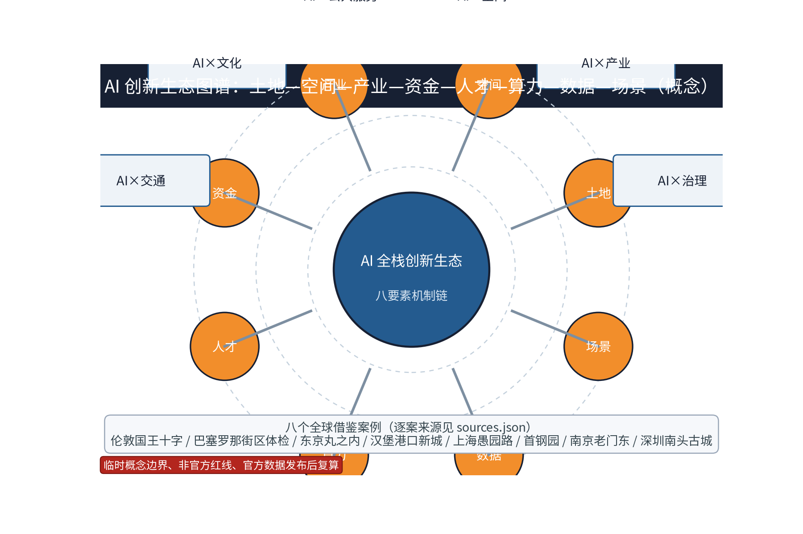
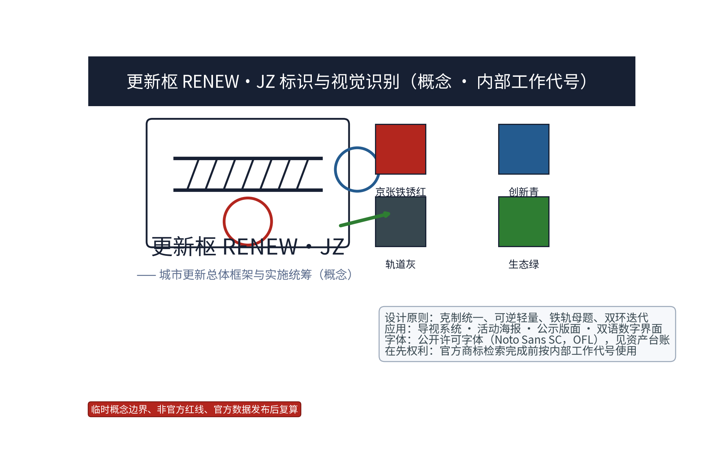

> 声明：本文档为概念性、前瞻性规划研究建议，不构成官方更新计划、投资数据或工程实施方案；所有数值均为概念示意，不预设容积率、建筑高度、拆改留比例、道路红线等结论，最终以依法定程序核定的成果为准。

## 设计依据与资料清单
资料清单所列公开史料、规划报道与技术通则均为概念工作依据清单，属于引用对象而非本包已获取的数据；本包实际使用的全部数据见 sources.json，全部图形、字体、图片等资产的许可与署名见 report/copyright_statement.md，未获取项已在风险与缺失数据说明中如实标注。本方案以本征集公告与任务书为任务口径依据，以《中华人民共和国无障碍环境建设法》、国家及北京市城市更新相关办法、城市设计与控规管理技术规定为方法参照；京张铁路遗址公园及沿线公开资料用于概念叙事，不用于声称任何既成事实。

后续深化前须逐一核对文本版本与时效：公告与任务书原文、法规最新修订版、沿线既有规划公开稿与控规管理文件均需以官方公开发布文本为准重新比对；本清单不构成对任何主管部门发布承诺的转述。资料清单与 sources.json 的差异即本包如实声明的数据缺口，包括组织方尚未提供的可验证坐标系官方边界图形、法定用地与道路红线、轨道及铁路保护界线、文物保护控制线、绿线蓝线、权属与市政容量等。

> **证据锚点**：[source:DATA-SRC-OFFICIAL-ANNOUNCEMENT]、[source:DATA-SRC-AGENT-TASKBOOK]。

## 三层范围工作框架
按任务书官方文本口径明确三层范围：统筹研究范围约 43.6 平方公里，总体设计范围约 11.4 平方公里，重点区域约 368.4 公顷（三处重点片区合计）；本包子范围定位于总体设计范围之内，以 geometry/site_boundary.geojson 表达概念几何，面积与公告文本口径一致，但该几何为 provisional 临时粗略约束，不是官方红线，官方图形发布后须整体复算并重绘全部图件。

三层成果逐级传导：统筹研究输出区域协同判断与未来城市方向，约束总体设计；总体设计校核的留改拆统筹、更新单元与慢行骨架落实到重点区域详设；每层均保留与任务书对应章节的机器可读证据锚点，便于评审对照。三层边界均为 provisional 性质，随资料核验与意见征集动态调整，避免以层级划分预设任何实施结论；其中重点区域三个片区（众智园AI自主创新加速区、北京AI原点社区、大钟寺AI产业聚集区）按公告名称与约面积形成临时粗略多边形，仅用于概念生成、展示与复算测试。

> **证据锚点**：[source:DATA-SRC-PROVISIONAL-BOUNDARIES]（边界 provisional，仅概念示意并支撑复算测试）。

## 统筹研究范围产业与未来城市研究
产业与城市研究识别城市更新的「适配」效应：以存量空间承载产业升级所需的中试、孵化与配套功能，避免大拆大建；促进海淀区高校研发外溢与社区创新的就近转化；依托国际化住区形成多元人才服务网络。未来城市研究仅作方向性预判，不构成对用地与投资的承诺；统筹研究聚焦「三区两翼」区域协同（概念映射，依据任务书表述的方向性理解，待官方文本逐字核验），把三区两翼组织为空间—产业—运营闭环，见下表面向逐项落实。

| 三区两翼（概念映射） | 空间落点（provisional） | 产业主题 | 运营机制（概念） | 协同对象 |
| --- | --- | --- | --- | --- |
| 三区·北区（众智园AI自主创新加速区） | 「单元坊」示范单元与加速区更新单元 | AI全栈自主创新加速 | 更新单元公约、准入分级、年度公示 | 未来科学城、怀柔科学城 |
| 三区·中区（北京AI原点社区） | 「留改坊」留改拆统筹示范单元 | AI人才创业与原住地复合 | 坊主议事会、积分激励、轮换展陈 | 北纬社区、沿线高校院所 |
| 三区·南区（大钟寺AI产业聚集区） | 「督行亭」监督站点与产业服务节点 | AI应用转化与场景落地 | 产业联盟、设施备案、年度体检 | 经开区、轨道站点商圈 |
| 西翼·创新协作翼（概念） | 西向慢行延长线与科研走廊接口 | 基础研究与人才网络 | 高校协同、志愿者网络、预约制共享 | 未来科学城、怀柔科学城、北纬社区 |
| 东翼·产业协同翼（概念） | 东向联络通道与场景外溢接口 | AI应用转化与制造协同 | 联合招引（概念）、国际传播、联盟共建 | 经开区、京津冀协同方向 |

> **证据锚点**：[source:DATA-SRC-AGENT-TASKBOOK]（三区两翼表述为任务书方向性依据，本表为概念映射）。

## 总体设计范围城市更新与控规深度城市设计
总体设计强调「以绿带为骨架的城市更新实施统筹环境」：依托京张铁路遗址公园绿带组织留改拆统筹框架、更新单元与慢行骨架；留改拆坚持「系统留、审慎改、局部拆」原则性导向，划分更新单元并联动功能织补与公共空间提升；控规指标只做校核建议，不预设容积率与建筑高度等数值结论。总体空间结构、三区两翼协同关系与重点片区定位见图 site-overview，概念用地结构见图 land-use-structure。

> **证据锚点**：[source:DATA-SRC-MOHURD-CONTROL-DETAILED-PLANNING]（控规深度校核表述的方法参照）。

## 重点区域详细设计
统一命名：本方案「更新枢（RENEW·JZ）」为一带总体框架与实施统筹品牌名，不另设「更新坊」；三个实施节点统一为「留改坊」「单元坊」「督行亭」，编号与 GeoJSON 属性、图件、指标、HTML 一致（节点 ID：KEEP-RENOVATE-BLOCK / UNIT-RENEWAL-BLOCK / SUPERVISION-PAVILION）。「留改坊」为留改拆统筹示范单元与更新统筹决策中枢，汇聚单元申报、指标校核与决策流程；「单元坊」为单元式更新示范单元，验证留改拆清单化管理与功能织补路径；「督行亭」为实施监督与公众参与站点，提供公开透明的监督窗口与意见通道。三节点沿绿带布置并与慢行轴衔接，形成决策—示范—监督闭环；节点选址均为概念点位，须经规划、文保与主管部门评估及专业审查后重新落位。

按任务书三大定位（百年京张文化带、都市AI生活体验带、AI融合创新带）与五大功能（AI全栈自主创新体系、世界级AI创新生态、AI+场景赋能新范式、智能化AI活力城市、AI治理全球话语权）中的城市更新与实施治理方向展开，作为「智能化AI活力城市」在创新带的更新统筹与公众监督载体（概念映射）。本包同时提出三处概念地标及其荣誉体系：「更新枢·留改坊」对应「更新勋章」（年度荣誉授予存量更新贡献者）、「单元坊」对应「坊主议事会」荣誉席位、「督行亭」对应「督行公示榜」（荣誉与整改情况公开公示）；公共空间设施以「更新构件库」可逆组件库方式搭建（座凳、遮阳、展架、临时舞台、绿化模块，逐件备案、轮换布置、预约使用），组件可拆卸可迁移，避免建设性承诺。场景卡索引（唯一编号 SC-01—SC-10）如下表：

| 场景卡编号 | 场景卡 | 落点 | 面向人群 | 运营机制（概念） | 数据与合规边界 |
| --- | --- | --- | --- | --- | --- |
| SC-01 | 「更新台账」指标校核AI | 留改坊 | 从业者、白领 | 年度核算、公开公示 | 匿名聚合，人工复核 |
| SC-02 | 存量空间匹配AI | 留改坊、单元坊 | 创业者、企业 | 空间预约、轮换展陈 | 匿名聚合，人工复核 |
| SC-03 | 更新进度跟踪AI | 督行亭 | 居民、从业者 | 进度看板、月度公示 | 匿名聚合，禁止过度监控 |
| SC-04 | 公众更新反馈AI | 督行亭 | 居民、长者 | 意见答复、申诉纠错、及时响应 | 仅聚合统计，人工复核 |
| SC-05 | 街区体检AI | 沿线节点 | 运营方、商户 | 年度评估、积分激励 | 聚合密度，不进行个体识别式追踪 |
| SC-06 | 绿色空间碳汇感知AI | 绿带节点 | 社区、学生 | 碳汇估算、科普志愿 | 匿名聚合，人工复核 |
| SC-07 | 能耗负荷预测AI | 单元坊 | 物业、运营方 | 能耗看板、绿电接口 | 匿名聚合，最小必要 |
| SC-08 | 更新出行流量AI | 绿带、督行亭 | 通勤者、游客 | 分时疏导、节事预约 | 仅聚合统计，禁止过度监控 |
| SC-09 | 低碳活动运营AI | 绿带节点 | 居民、青年、家庭 | 活动预约、积分激励、轮换展陈 | 匿名聚合，人工复核 |
| SC-10 | 更新政策问答AI | 留改坊 | 居民、从业者 | 政策问答、人工复核兜底 | 匿名聚合，关键决策人工复核 |

> **证据锚点**：[data:PACKAGE-GEOMETRY]（三节点示意多边形来自本包 geometry/public_space.geojson 与 geometry/key_areas.geojson）。

## AI 创新生态、人才画像与 AI+ 场景
AI 全栈创新生态按「土地—空间—产业—资金—人才—算力—数据—场景」八要素机制链组织（概念）：存量土地与空间承载中试孵化，产业与资金循环支撑场景落地，人才与算力供给开源开放，数据以匿名聚合方式回流场景闭环；生态图谱见图 ecosystem-map，全球五至八个借鉴案例及逐案例来源、时点与适用边界见「参考资料」节案例表。全链条均以人工复核兜底，AI 输出不替代专业判断。

五类人才画像：创业者、AI开发者、社区居民、学生、老年邻里，画像用于服务旅程推演而非个体识别，配套线下替代渠道（人工窗口、电话、纸质表单）与数字排斥防护措施。AI+场景统一为十张编号场景卡（SC-01—SC-10，见重点区域节表格），覆盖治理（SC-01、SC-03）、产业（SC-02）、空间（SC-05、SC-06）、公共服务（SC-04、SC-10）、文化（SC-09）、交通（SC-08）六域；此前正文两种场景清单（更新统筹AI、存量空间匹配AI、更新进度跟踪AI、公众更新反馈AI、街区体检AI 与 更新统筹AI、绿色空间碳汇感知AI、能耗负荷预测AI、更新出行流量AI、公众低碳反馈AI）已合并为上述唯一编号清单，正文、图件、指标与 GeoJSON 属性同步使用。AI 治理三句式：仅匿名聚合、关键决策人工复核、禁止过度监控；碳核算为概念性公共数据服务建议，不替代官方统计。三项测试协议确保场景可验证、可评审：

| 测试协议编号 | 测试协议 | 验证目标（概念） | 评价指标（概念） | 数据与人工复核 | 复算触发 |
| --- | --- | --- | --- | --- | --- |
| TP-01 | 指标数据质量与模型评测协议 | 更新指标口径一致性与模型输出可靠性 | 数据质量完备率、模型评测基准分 | 匿名聚合、人工复核 | 官方数据发布后 |
| TP-02 | 存量匹配召回率与误差分群协议 | 存量空间匹配的查全与查准 | 召回率、误报率、误差分群占比 | 匿名聚合、人工复核 | 现状普查更新后 |
| TP-03 | 反馈AI人工复核与运行监测协议 | 意见流转、纠错与响应闭环 | 运行监测异常率、复核通过率 | 人工复核、全程留痕 | 政策或语料更新后 |

> **证据锚点**：[source:DATA-SRC-GENERATIVE-AI-INTERIM-MEASURES]（AI 生成内容治理表述的参照依据）。

## 用地、建筑规模与拆改留方案
拆改留坚持留改拆并举：以留为主保留遗址公园肌理与铁路历史遗存，存量建筑功能置换并预留低碳化改造方向（围护、能耗、绿电接口），拆除仅限经个案论证的局部疏通慢行零星建筑。全部面积为概念口径，口径、聚合规则与复算触发条件见「指标体系、面积复算与合规矩阵」节；正文不公布推算面积数字，官方数据发布后整体复算并重绘。

总体策略按三类清单化管理：保护修缮类，保留历史与建筑价值并修缮活化；功能置换类，保留结构、置换功能；更新重建类，谨慎局部拆除重建。清单内容与规模不预设数值，随现状普查与产权协调逐项核定；概念用地结构图采用单一口径（概念图斑面积占概念总体设计范围之比例，与 green_ratio 同口径），不再并列其他口径的公共绿地占比，避免误导；一切拆改留结论须经法定程序与公众参与后形成。

> **证据锚点**：[source:DATA-SRC-MNR-LAND-USE-CLASSIFICATION-202311]（用地分类名称参照现行国标口径）。

## 交通、轨道、市政与公共服务设施
以交通慢行优先为核心组织交通概念机制：沿绿带构建连续慢行轴贯通留改坊、单元坊与督行亭，街道断面按活动需求分时响应（早市、节事、日常模式），衔接沿线高校、园区与轨道站点（接驳以步行与骑行为主），绿色出行优先、降低小汽车依赖、节事散场分时分区疏导；不预设道路红线与工程数值。市政以集约共享为原则，绿电接口与更新数据设施建筑一体化概念、优先利用现状设施条件、鼓励综合管沟与模块化实施；公共服务配置无障碍与多语服务、社区低碳服务与研习空间，配置规模按人口与服务半径复核，AI 决策均设人工复核。

> **证据锚点**：[source:DATA-SRC-MOHURD-URBAN-DESIGN-MEASURES]（慢行与市政设计表述的方法参照）。

## 蓝绿空间、公共空间与城市风貌
构建「绿带为轴、节点公园为珠」的蓝绿公共空间体系：以遗址公园绿带为蓝绿骨架串联沿线小微绿地与开敞空间，形成连续生态与公共空间体系；碳汇绿地与蓝绿空间融合布置，设施宜轻宜透宜可逆，不遮挡历史遗迹与绿带视线。蓝绿空间占比统一采用 green_ratio 概念口径（约 0.11，即概念绿地图斑占比），与图件、指标同口径并标注 provisional，官方数据发布后复算；同一版面不再并列其他口径的占比数字。

### 文化叙事与国际传播（概念）
文化资源系统与空间故事线（概念）：以铁路工业记忆语汇（道岔、站房、铁轨、信号）为母题，编目沿线历史资源点（概念清单，逐步以史料核验），形成「百年京张·更新叙事」四季空间故事线：春「轨道苏醒」、夏「枢纽涌现」、秋「单元织补」、冬「督行共议」，沿线以统一克制的方式布设叙事节点。双语传播文案示例：「更新枢·让百年铁路与AI相遇」/ "RENEW·JZ — Where the Century Railway Meets AI"；「留改坊·留住记忆，改出未来」/ "KEEP·BLOCK — Keep the memory, renew the future"。国际传播通过双语网站页、国际评审邀请信模板与案例双语对照卡（概念）支撑，向全球 AI 开发者与城市更新从业者开放。

### 品牌识别与视觉系统（概念）
品牌识别以「更新枢（RENEW·JZ）」为唯一主品牌，Logo 图形概念为「铁轨—双环—迭代箭头」组合（铁轨寓意京张历史，双环寓意更新单元与绿带，迭代箭头寓意存量迭代更新），色彩系统为京张铁锈红、创新青、轨道灰、生态绿四色，字体优先使用公开许可字体（详见资产台账），应用范围包括导视系统、活动海报、公示版面与双语数字界面；Logo 与全套视觉资产均为原创概念，先于名称与标识的在先权利清查完成前按内部工作代号使用（见风险节）。

> **证据锚点**：[source:DATA-SRC-MOHURD-URBAN-DESIGN-MEASURES]（风貌与公共空间组织的方法参照）。

## 更新项目清单、实施政策与分期计划
实施分期概念：近期 1—3 年，搭建框架并启动「留改坊」试点与「督行亭」监督站点；中期 3—5 年，推进「单元坊」示范与单元滚动更新；远期 5—10 年，实现绿带骨架功能整体贯通与全域运营机制成熟。项目清单以台账方式可深化管理，明确牵头与协作主体类型、前置依赖、专业复核、试点准入与退出条件、指标基线与数据周期、年度复盘与长期运营转化路径；成本仅给低/中/高定性级别与估算方法、价格基期、包含范围、置信等级、复算触发，不提供具体金额。试点准入/退出机制：准入须具备产权协调基础与多数同意，退出须满足「连续两年未达基线且年度复盘未通过」或「民意公示异议集中」条件并经公示后撤收。

| 实施台账（概念） | 分期 | 牵头/协作主体 | 前置依赖与专业复核 | 试点准入/退出 | 指标基线/数据周期 | 年度复盘与转化路径 | 成本级别（估算方法·价格基期·置信等级） |
| --- | --- | --- | --- | --- | --- | --- | --- |
| 「更新枢·留改坊」统筹试点 | 近期1—3年 | 政府统筹牵头，高校、社区、专业团队协作 | 现状普查与产权梳理；规划、文保、消防专业复核 | 产权协调具备、居民议事通过；退出经公示撤收 | 更新覆盖率/年度 | 年度公示复盘；转为常态统筹平台 | 中（类比同类街坊更新，2026年基期，低置信） |
| 「单元坊」示范单元 | 中期3—5年 | 政府牵头，企业参与运营，高校协同 | 留改拆清单与市政接入复核 | 试点申请制，多数同意准入 | 单元完成率/季度 | 年度复盘；滚动扩展为单元制度 | 中（类比存量改造，2026年基期，低置信） |
| 「督行亭」监督站点 | 近期1—3年 | 政府牵头，志愿者、社区、商户协作 | 站点选址公示与意见征集 | 站点试运行6个月评估准入 | 意见办结率/月度 | 年度公示；升级为常设监督站点 | 低（模块化轻建设，2026年基期，中置信） |
| 绿带慢行贯通工程 | 中期3—5年 | 政府牵头，专业团队、志愿者协作 | 轨道与铁路保护复核、慢行安全评估 | 分段先行，验收后开放 | 慢行贯通率/季度 | 年度复盘；纳入绿带运维联盟 | 高（市政类工程类比，2026年基期，低置信） |
| 「更新构件库」公共空间组件 | 近期1—3年持续 | 政府引导，企业赞助，社区共建 | 结构安全与消防备案复核 | 组件备案制、轮换布置 | 组件复用率/年度 | 年度复盘；沉淀为可复用产品库 | 低（标准化构件，2026年基期，中置信） |
| 「更新开发者社区」与数据开放 | 中期3—5年启动 | 企业牵头，高校、开发者志愿协作 | 数据脱敏与合规审查 | 开发者协议准入、违规退出 | 开放接口数/半年 | 年度复盘；向国际招引转化 | 低（平台运维型，2026年基期，中置信） |

年度活动品牌（与指标年度活动体系一致）：「更新开放日」（RENEW OPEN DAY）、「更新市集」（RENEW BAZAAR）、「街区体检季」（BLOCK HEALTH-CHECK SEASON），活动以月度常规活动（讲解、展览、志愿值守）为底座，形成「周—月—季—年」节奏；长期运营转化路径为：开发者社区—场景开放运营—国际招引（双语传播、国际评审与联盟互访）—多元化资金与治理机制（政府引导、企业参与、社会资本补充的更新运营联盟，以公约、议事、公示、备案四项机制运转）。政策建议（低碳功能准入与统筹、多元主体共建、意见复核机制）均须依法依规论证，不构成政府或运营方承诺。

| 年度活动品牌（概念） | 周期 | 主要内容 | 参与主体 | 长期转化路径 |
| --- | --- | --- | --- | --- |
| 「更新开放日」（RENEW OPEN DAY） | 年度 | 更新成果展、场景体验、人工讲解 | 政府、企业、高校、居民、志愿者 | 沉淀为年度品牌资产与国际传播窗口 |
| 「更新市集」（RENEW BAZAAR） | 年度 | 创客市集、存量空间巡游、政策问答 | 商户、创业者、居民、青年 | 转化为商户与创业者社群运营入口 |
| 「街区体检季」（BLOCK HEALTH-CHECK SEASON） | 年度 | 年度体检发布、指标公示、积分激励 | 运营方、社区居民、专业团队 | 转化为年度指标基线更新与监督机制 |

> **证据锚点**：[source:DATA-SRC-AGENT-TASKBOOK]（分期与实施条目对应任务书要求）。

## 指标体系、面积复算与合规矩阵
概念指标体系进入 metrics.json，逐项给出数据来源、公式或口径、置信等级、用途限制与复算触发（下表为正文索引，完整字段见 metrics.json）；面积复算以官方文本口径为底（统筹研究范围约 43.6 平方公里、总体设计范围约 11.4 平方公里、重点区域约 368.4 公顷），本包概念几何与之对照校核但不对外发布推算面积，官方多边形发布后整体复算并标注复算版本号；provisional 边界警示同步于图件、指标与几何属性。

| 指标名称（概念） | 数据出处 | 公式/口径 | 置信等级 | 用途限制 | 复算触发 |
| --- | --- | --- | --- | --- | --- |
| site_area_sqm | geometry/site_boundary.geojson | 多边形面积（EPSG:4548） | 中 | 仅概念展示与机器校验 | 官方边界发布后 |
| green_ratio | green_space/geojson 与 boundary | 概念绿地图斑面积/总体设计范围 | 低 | 同口径展示，不并列其他占比 | 官方数据发布后 |
| public_space_ratio | public_space/geojson 与 boundary | 概念公共空间面积/总体设计范围 | 低 | 同口径展示，不并列其他占比 | 官方数据发布后 |
| scenario_card_count | proposal.md 场景卡索引 | SC-01—SC-10 计数 | 高 | 正文与图件口径一致性 | 场景清单修订时 |
| global_case_count | proposal.md 案例表与 sources.json | 八项案例条目计数 | 高 | 概念借鉴，非案例现状判断 | 来源核验更新时 |
| annual_program_count | proposal.md 年度活动品牌表 | 三项年度活动计数 | 高 | 活动体系口径一致性 | 活动清单修订时 |

合规矩阵对照法律、规范与征集任务要求逐条核查，形成可追溯记录（compliance_matrix.json）；标准矩阵与设计深度矩阵见对应 JSON 文件，证据摘要分别指向各自真实回应内容，不重复粘贴模板文字。

> **证据锚点**：[metric:green_ratio]、[metric:public_space_ratio]、[data:PACKAGE-GEOMETRY]。

> **证据锚点**：[metric:scenario_card_count]、[metric:global_case_count]、[metric:phase_count]。

## 风险、版权与合规说明
本方案为概念研究性设计，不构成行政审批依据，也不构成容积率、建筑高度、拆改留或工程可行性结论；风险已按边界精度、统计口径、数据边界、法定控制缺位、技术成熟度、公众接受度等维度如实登记于 risk.json，应对原则为匿名聚合、最小必要、人工复核、来源标注与意见通道。AI 治理三句式：仅匿名聚合、关键决策人工复核、禁止过度监控；居民意见通道（线上意见入口、线下人工窗口、电话与纸质表单）配套申诉、纠错、及时响应与数字排斥防护流程，重大事项依法公示并按年度公示更新进展，年度活动按「更新开放日」「更新市集」「街区体检季」三项品牌运营。

### 品牌在先权利与使用边界
本方案未在概念阶段完成官方商标检索：「更新枢（RENEW·JZ）」「留改坊」「单元坊」「督行亭」及 Logo 图形与标语均按内部工作代号处理，对外使用、申报注册或正式命名前须完成在先权利清查与相关方许可；相关资产的权利记录见 report/copyright_statement.md，sources.json 同步登记资产条目，manifest.json 角色说明与其保持一致。

版权说明：方案基于公开资料（引用均标注来源与获取时间），原创图形、名称与文字由本包作者生成并保留权利，字体、图标、图片、地图、数据与代码逐项登记于资产台账；与既有标识或名称雷同属巧合；未经授权不使用他人肖像、商标、论文图像等版权材料；正式实施前须完成多部门联审、文物保护与安全评估。本方案为概念研究建议，不构成任何承诺，最终以法定程序成果为准。

> **证据锚点**：[source:DATA-SRC-OFFICIAL-ANNOUNCEMENT]（征集规则为权属与合规表述的依据）。

## 参考资料
公开口径引用：本征集公告与任务书；《中华人民共和国无障碍环境建设法》；国家及北京市城市更新相关办法与技术规定；京张铁路遗址公园公开资料；城市设计与控规管理技术文件；AI 生成内容治理办法与用地分类指南。所有引用以官方公开发布文本为准，深化前须核验版本；案例来源逐项登记于 sources.json（机构网址、访问日期、里程碑时点与复用边界），案例仅为概念借鉴，不构成对相关项目现状的判断，未经事实交叉核验的条目按待研究假设处理。

附：国际与国内对标案例（概念借鉴；来源已核验，核验日期 2026-08-25）：

| 类别 | 案例 | 来源（机构/网址/里程碑时点） | 借鉴要点 | 核验状态 |
| --- | --- | --- | --- | --- |
| 国际 | 伦敦国王十字更新 | 国王十字中央联合体官网 kingscross.co.uk；动议许可 2006-12-22（Camden 委员会 2004/2307/P） | 铁路站区整体更新，公共空间与基础设施先导，长期统筹实施与监督 | 已核验（官网可访问） |
| 国际 | 巴塞罗那超级街区 | 巴塞罗那市政府超级街区官网 ajuntament.barcelona.cat/superilles；项目起始 2015 年 | 街区单元交通宁静化改造，实施前后量化监测（街区体检） | 已核验（官网可访问） |
| 国际 | 东京丸之内 | 三菱地所官网 mec.co.jp 企业沿革；「再建·丸之内」始于 1998 年，2002 年丸之内大厦完成 | 多元产权主体协同更新与公共空间共建共管 | 已核验（官网可访问） |
| 国际 | 汉堡港口新城 | 港城开发公司官网 hafencity.com；总图 2000-02-29 经汉堡参议院批准 | 分期成片实施，公共空间与公共服务设施先行 | 已核验（官网可访问） |
| 国内 | 上海愚园路 | 上海市长宁区政府官网 shcn.gov.cn；更新 2014 年启动 | 渐进式微更新与在地运营、一体化管理运营商 | 已核验（区政府页面可访问） |
| 国内 | 北京首钢园 | 首钢集团官网 shougang.com.cn；2016 年冬奥组委入驻为里程碑 | 工业遗存保护性转型与大型事件驱动 | 已核验（集团页面可访问） |
| 国内 | 南京老门东 | 南京市秦淮区政府官网 njqh.gov.cn；街区 2013-09 正式开放 | 历史街区保护性更新与业态活化 | 已核验（区政府页面可访问） |
| 国内 | 深圳南头古城 | 深圳市南山区政府官网 szns.gov.cn；保护利用工作组 2019-03 成立 | 城中村有机更新与公众参与、「政府主导、企业实施、居民参与」 | 已核验（区政府页面可访问） |

（正文完，共13节及附表；完整指标、来源、风险与合规记录见对应 JSON 文件。）

> **证据锚点**：[source:DATA-SRC-OFFICIAL-ANNOUNCEMENT]（本清单首条即组织方公开资料包）。