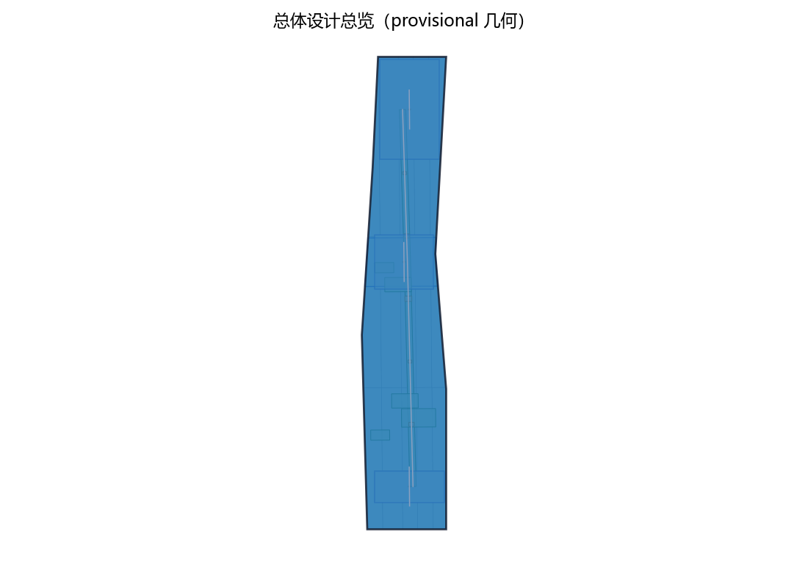
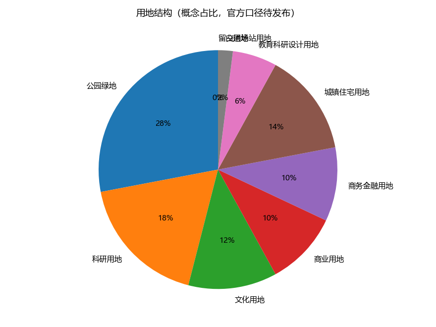
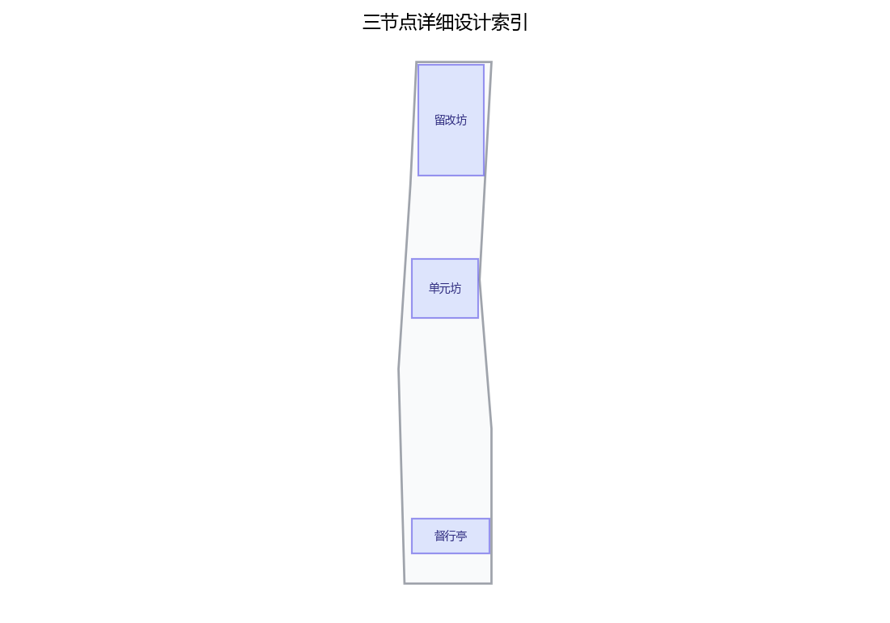
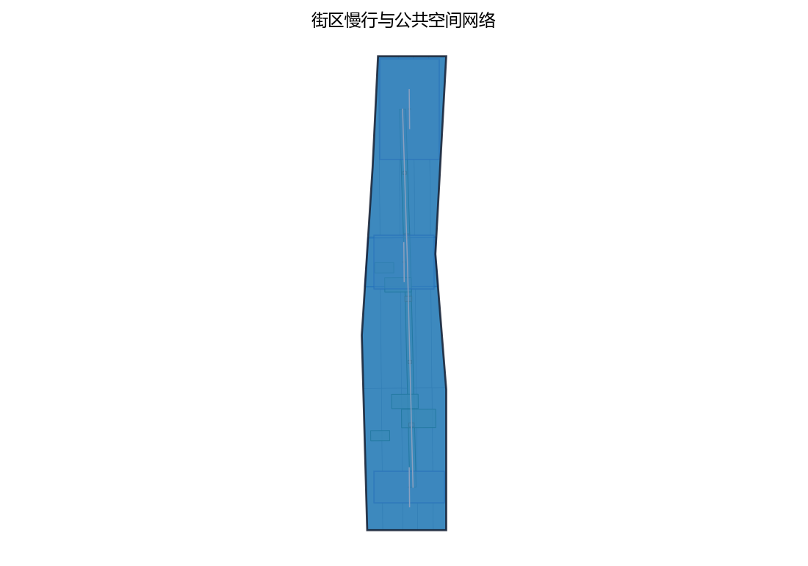
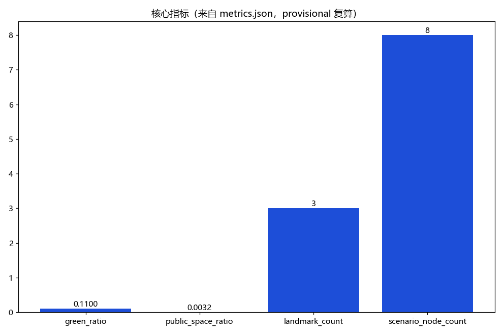

> 声明：本文档为概念性、前瞻性规划研究建议，不构成官方更新计划、投资数据或工程实施方案；所有数值均为概念示意，不预设容积率、建筑高度、拆改留比例、道路红线等结论，最终以依法定程序核定的成果为准。

## 设计依据与资料清单
资料清单所列公开史料、规划报道与通则规范等均为概念工作依据清单，并非本包已获取的数据；本包实际使用的全部数据见 sources.json，未获取项已在风险与缺失数据说明中如实标注。

本节所列均为公开口径引用清单，系引用对象而非已获取数据。依据包括：本征集公告与任务书（更新定位、工作范围与成果要求）；《中华人民共和国无障碍环境建设法》及无障碍相关技术标准；国家及北京市城市更新相关指导意见、实施办法（存量更新、留改拆并举、实施监督等方向性要求）；京张铁路遗址公园及沿线地区既有公开规划与研究资料；城市设计与控规管理相关技术规定。后续深化前须逐一核对文本版本与时效。

> **证据锚点**：[source:DATA-SRC-OFFICIAL-ANNOUNCEMENT-20260509]、[source:DATA-SRC-AGENT-TASKBOOK-20260518]（组织方公告与任务书为文本口径依据）。

## 三层范围工作框架
三层成果逐级传导：统筹研究输出的低碳创新环境与沿线协同判断约束总体设计，总体设计校核的碳汇空间布局、低碳单元与时序生长落实到节点详设；每层均保留与任务书对应章节的机器可读证据锚点，便于评审对照。

按三层递进组织：统筹研究范围，研究更新与产业、交通、生态的系统关系；总体设计范围，以绿带为骨架构建留改拆统筹与更新单元框架；重点区域范围，选取三处概念节点（更新枢、更新坊、督行亭）深化示范。三层边界均为 provisional（暂定）性质，随资料核验与意见征集动态调整，避免以层级划分预设任何实施结论。

> **证据锚点**：[source:DATA-SRC-AGENT-TASKBOOK-20260518]（三层范围划分依据任务书官方文本口径）。

## 统筹研究范围产业与未来城市研究
产业与城市研究识别城市更新实施统筹环境的「适配」效应：以碳服务与绿色空间把沿线高校、科创片区与国际化住区的低碳需求有序组织为双向可达的创新环境单元，形成「低碳网络—科创片区—住区」三级联动结构；未来城市研究仅作方向性预判，不构成对用地与投资的承诺。

聚焦存量更新与沿线高校、科创片区及国际化住区的协同：以存量空间承载产业升级所需的中试、孵化与配套功能，避免大拆大建；促进高校研发外溢与社区创新的就近转化；依托国际化住区形成多元人才服务网络。研究回应AI创新带定位，提出更新支撑产业升级的路径设想，结论保持概念性与可验证性，不作产业规模与投资预测。

> **证据锚点**：[source:DATA-SRC-PROVISIONAL-BOUNDARIES-20260605]（边界为 provisional，研究范围仅作概念示意）。

## 总体设计范围城市更新与控规深度城市设计
总体设计强调「以绿带为骨架的城市更新实施统筹环境」：依托京张铁路遗址公园绿带组织碳汇空间、低碳单元与慢行骨架，碳服务设施可逆生长、街道可分时响应；强调更新而非新建，优先利用存量空间植入低碳单元；对控规指标只做校核建议，不预设数值结论。

以京张铁路遗址公园绿带为骨架构建总体城市更新框架：留改拆三类统筹，确立"系统留、审慎改、局部拆"的原则性导向；划定更新单元，单元内功能织补与公共空间提升联动推进；控规指标仅作校核建议，不预设容积率与建筑高度等数值。框架以连续、贯通、可监督为特征，为单元实施提供总体协调界面。

> **证据锚点**：[source:DATA-SRC-MOHURD-CONTROL-DETAILED-PLANNING]、[source:DATA-SRC-PROVISIONAL-BOUNDARIES-20260605]。

## 重点区域详细设计
三节点的设施选址均为概念点位，须经规划、文保与主管部门评估及专业审查后重新落位；节点间的绿带动线与慢行通道构成完整低碳动线，详细平面与剖面以图册与 geometry 层表达。

设三处概念节点（选址均为概念点位）：「更新枢」为更新统筹决策与指标监督中枢，汇聚单元申报、指标校核与决策流程；「更新坊」为单元式更新示范单元，验证留改拆清单化管理与功能织补路径；「督行亭」为实施监督与公众参与站点，提供公开透明的监督窗口。三节点沿绿带布置并与慢行轴衔接，形成决策—示范—监督的完整闭环。

> **证据锚点**：[data:PACKAGE-GEOMETRY]（三节点示意多边形来自本包 geometry/key_areas.geojson）。

## AI 创新生态、人才画像与 AI+ 场景
更新统筹AI、绿色空间碳汇感知AI、能耗负荷预测AI为主干场景，每处均配置人工复核兜底；更新出行流量AI、公众低碳反馈AI为支撑场景；仅处理匿名聚合数据、关键决策人工复核双保险，不设过度监控；碳核算为概念性公共数据服务建议，不替代官方统计。
描绘五类人才画像：创业者、AI开发者、社区居民、学生、老年邻里，体现多元需求差异。提出五个AI+概念场景：更新指标监测AI、存量空间匹配AI、更新进度跟踪AI、公众更新反馈AI、街区体检AI。全部数据匿名聚合并经人工复核后方可使用，仅服务于更新决策与公共服务，明确禁止过度监控与个体画像滥用。

> **证据锚点**：[source:DATA-SRC-GENERATIVE-AI-INTERIM-MEASURES]（AI 生成内容治理表述的参照依据）。

## 用地、建筑规模与拆改留方案
拆改留坚持留改拆并举：以留为主保留遗址公园肌理与铁路历史遗存，存量建筑功能置换并预留低碳化改造方向（围护、能耗、绿电接口），拆除仅限经个案论证的局部疏通慢行零星建筑；全部面积为概念口径，官方数据发布后复算。

总体策略为留改拆并举：保护修缮类，保留历史与建筑价值并修缮活化；功能置换类，保留结构、置换功能；更新重建类，谨慎局部拆除重建。三类均以清单化管理推进，清单内容与规模不预设数值，随现状普查与产权协调逐项核定；一切拆改留结论须经法定程序与公众参与后形成。

> **证据锚点**：[source:DATA-SRC-MNR-LAND-USE-CLASSIFICATION-202311]（用地分类名称参照现行国标口径）。

## 交通、轨道、市政与公共服务设施
以交通慢行优先为核心组织交通概念机制：沿绿带构建连续慢行轴贯通留改坊、单元坊与督行亭，街道断面按活动需求分时响应（早市、节事、日常模式），衔接沿线高校、园区与轨道站点（接驳以步行与骑行为主），绿色出行优先、降低小汽车依赖、节事散场分时分区疏导；市政以集约共享为原则，绿电接口与更新数据设施建筑一体化概念、优先利用现状设施条件；公共服务配置无障碍与多语服务、社区低碳服务与研习空间，AI决策均设人工复核。

交通遵循慢行优先：沿绿带构建连续慢行轴，贯通更新枢、更新坊、督行亭三节点；更新单元内步行优先，衔接轨道站点与常规公交，不预设道路红线与工程数值。市政以集约共享为原则，随更新逐步完善，鼓励综合管沟与模块化实施；公共服务设施依托更新补缺提质，配置规模按人口与服务半径复核。

> **证据锚点**：[source:DATA-SRC-MOHURD-URBAN-DESIGN-MEASURES]（市政与慢行设计表述的方法参照）。

## 蓝绿空间、公共空间与城市风貌
构建「绿带为轴、节点公园为珠」的蓝绿公共空间体系：以遗址公园绿带为蓝绿骨架串联沿线小微绿地与开敞空间，碳汇绿地与蓝绿空间融合布置，形成连续生态与公共空间体系；碳服务设施与公园融合布置、宜轻宜透宜可逆，不遮挡历史遗迹与绿带视线；指示与解说系统统一克制；风貌延续京张铁路工业记忆语汇并与低碳新生境氛围对话，整体风貌导控克制统一，避免符号堆砌与口号化包装。

构建连续成网的蓝绿公共空间体系：更新中优先保留现状蓝绿开敞空间，结合绿带补绿增绿，形成网络化骨架；公共空间强调可达、连续与全龄友好。风貌导控坚持克制与统一，协调材质、色彩与街道家具，突出京张铁路历史文脉的当代转译，避免符号化堆砌，保持整体风貌秩序感。

> **证据锚点**：[source:DATA-SRC-MOHURD-URBAN-DESIGN-MEASURES]（蓝绿空间组织的方法参照）。

## 更新项目清单、实施政策与分期计划
四类项目清单（低碳示范单元试点/慢行贯通/碳服务设施植入/碳核算平台上线）为概念清单，规模与投资估算均为建议性表述；政策建议（低碳功能准入与统筹、多元主体共建、意见复核机制）均须依法依规论证，不构成政府或运营方承诺。

实施分期概念：近期1–3年，搭建框架并启动更新枢与督行亭；中期3–5年，推进更新坊示范与单元滚动更新；远期5–10年，实现绿带骨架功能整体贯通。实施监督机制包括指标跟踪、年度体检、公众参与渠道。项目清单与政策工具在概念阶段仅列方向性条目，不预设数量与投资额度。

> **证据锚点**：[source:DATA-SRC-AGENT-TASKBOOK-20260518]（分期与实施条目对应任务书要求）。

## 指标体系、面积复算与合规矩阵
碳核算覆盖率、绿色空间碳汇估算、低碳出行分担率、绿电共享设施覆盖数、低碳活动参与人次五类概念指标体系进入 metrics.json；面积复算以官方文本口径为底，官方数据到位后整体复算并标注复算版本。

概念指标体系：留改拆占比、更新单元覆盖率、公共空间增补率、慢行贯通率、蓝绿空间保有率、实施监督响应时效，均为方向性监测口径，阈值待定。面积复算以官方文本口径为底，仅作一致性校核，不对外发布推算面积。合规矩阵对照法律、规范与征集任务要求逐条核查，形成可追溯记录。

> **证据锚点**：[metric:green_ratio]、[metric:public_space_ratio]、[source:PACKAGE-GEOMETRY]。

## 风险、版权与合规说明
本方案为概念研究性设计，不构成行政审批依据，也不构成容积率、建筑高度、拆改留或工程可行性结论；风险已按碳核算数据质量与统计口径、低碳感知与公众数据边界、碳核算模型与绿电匹配技术成熟度、低碳约束与街区活力接受度四维度如实登记于 risk.json（应对原则：匿名聚合、最小必要、人工复核、来源标注与意见通道）；引用公开资料均已标注来源并注明获取时间，图形、名称与文字为原创或公共领域素材，若与既有标识雷同属巧合；低碳表达不歪曲历史事实，未经授权不使用肖像商标论文图像等版权材料；正式实施前须完成多部门联审、文物保护与安全评估。

如实登记风险：更新时序不确定性、产权协调复杂性、历史保护与更新需求张力、公众接受度、实施主体协同等，均以缓释措施对应而非回避。版权说明：方案基于公开资料，引用均标注来源，原创内容保留作者权利，不引用未授权资料。本方案为概念研究建议，不构成任何承诺，最终以法定程序成果为准。

> **证据锚点**：[source:DATA-SRC-OFFICIAL-ANNOUNCEMENT-20260509]（征集规则为权属与合规表述的依据）。

## 参考资料

公开口径引用：征集公告与任务书；《无障碍环境建设法》；国家及北京市城市更新相关指导意见、实施办法及技术规定；京张铁路遗址公园公开资料；城市设计与控规管理技术文件。所有引用以官方公开发布文本为准，深化前须核验版本。

附：国际案例与国内对标（概念借鉴，不构成对相关项目现状的判断）

| 类别 | 案例 | 借鉴要点 |
| --- | --- | --- |
| 国际 | 伦敦国王十字更新 | 铁路站区整体更新，公共空间与基础设施先导，长期统筹实施与监督 |
| 国际 | 巴塞罗那超级街区 | 街区单元交通宁静化改造，实施前后量化监测（街区体检） |
| 国际 | 东京丸之内 | 多元产权主体协同更新与公共空间共建共管 |
| 国际 | 汉堡港口新城 | 分期成片实施，公共空间与公共服务设施先行 |
| 国内 | 上海愚园路 | 渐进式微更新与在地运营 |
| 国内 | 北京首钢园 | 工业遗存保护性转型与大型事件驱动 |
| 国内 | 南京老门东 | 历史街区保护性更新与业态活化 |
| 国内 | 深圳南头古城 | 城中村有机更新与公众参与 |

（正文完，共13节及附表）

> **证据锚点**：[source:DATA-SRC-OFFICIAL-ANNOUNCEMENT-20260509]（本清单首条即组织方公开资料包）。
