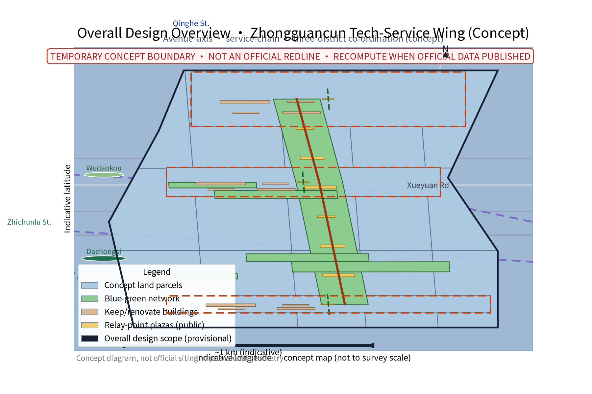
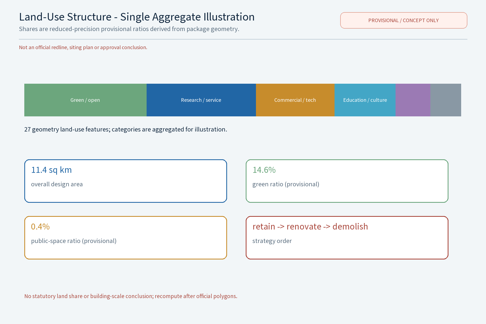
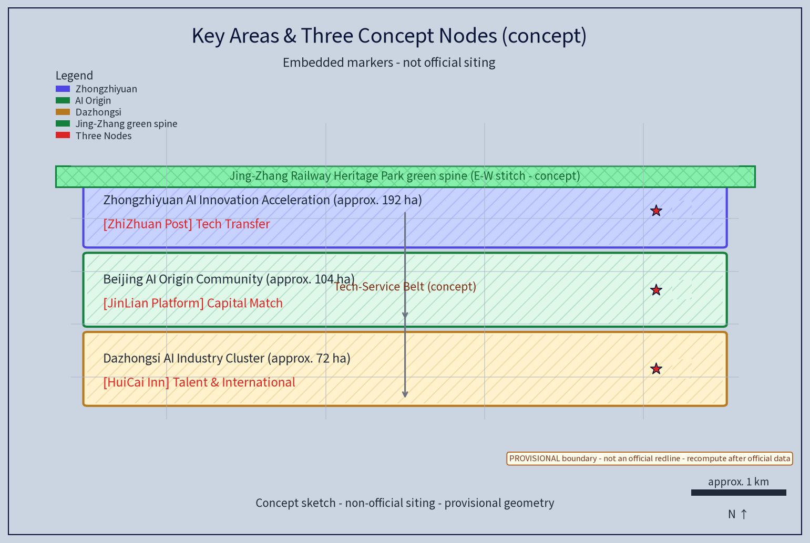
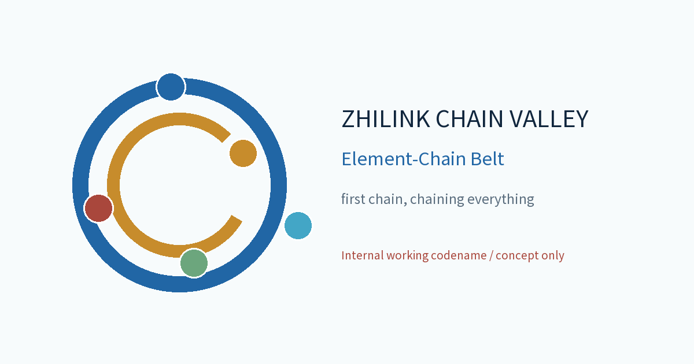
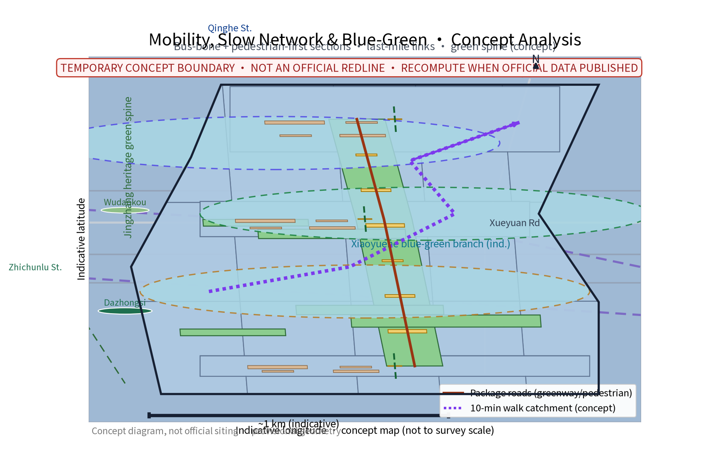
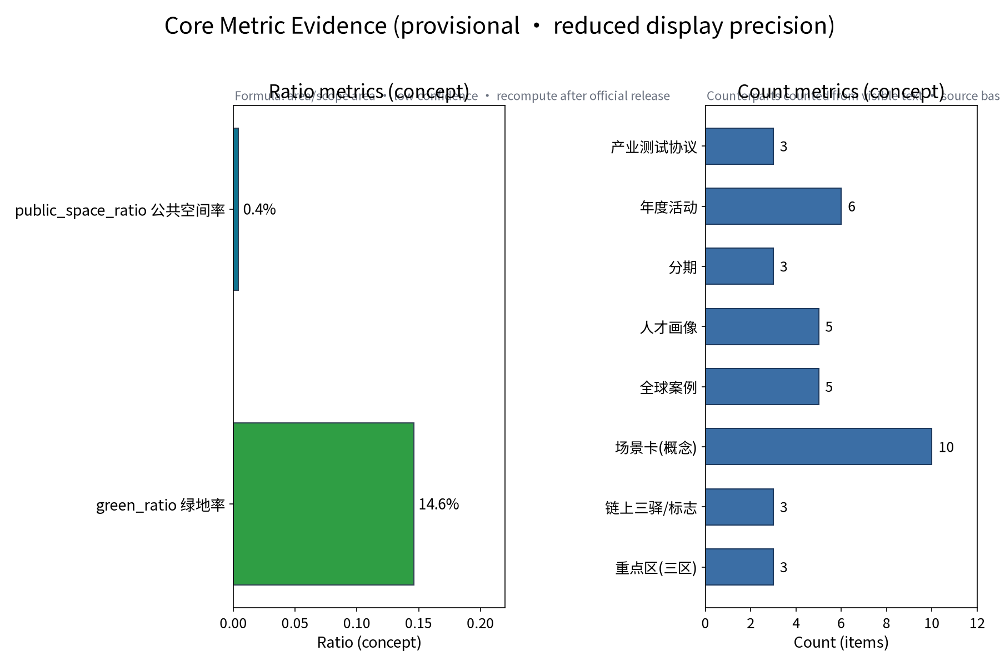

**Scheme Name and Overall Positioning (Concept)**

Primary name: "Zhilink Chain Valley", English: ZHILINK CHAIN VALLEY (an original concept name that does not refer to any real city, park or enterprise; used as an internal working codename). Overall idea: taking the "Zhongguancun Tech-Service Wing" as the topic, treat tech services as the "first chain" that organizes the flow of innovation elements, and build along Zhongguancun Avenue (Haidian section) a tech-service ecosystem belt for global element allocation, letting technology, capital, talent, data and standards flow along the chain and aggregate in the belt. Drawing on the century-old Beijing-Zhangjiakou Railway spirit of "independent innovation, one line through", the scheme turns the full tech-service chain into the "three chain relays": Zhizhuan Relay Post (tech-transfer), Jinlian Capital Platform (investment & innovation capital), and Huicai Talent Inn (talent & international cooperation) - three original concept nodes stringing together the avenue's public-service sequence, together with a "Zhilink Chain Valley · Element-Chain Belt" brand identity (logo, tagline, color and icon component library) and regional co-ordination loops. The scheme links the three orientations (Jingzhang century culture belt, urban AI-life experience belt, AI-integrated innovation belt) and the five functions (full-stack independent AI innovation system, world-class AI innovation ecosystem, new AI+ scenario empowerment paradigm, intelligent AI-vibrant city, global voice in AI governance); all deliverables are concept proposals and reference schemes for professional teams to develop further.

## Design Basis and Source List

This scheme is grounded in the call-for-proposal announcement and design taskbook, using the organizers' published text calibers: coordinated research area 43.6 sq km, overall design area 11.4 sq km, key areas totaling 368.4 hectares, and the district calibers of Zhongzhiyuan AI Autonomous Innovation Acceleration Area (about 192 ha), Beijing AI Origin Community (about 104 ha) and Dazhongsi AI Industry Cluster (about 72 ha). References include: published design results of the Jingzhang Railway Heritage Park, publicly available Beijing and Haidian territorial spatial plans and urban-renewal policy texts, published statistics, along-the-belt site surveys, and open geodata used only for spatial narrative illustration. The organizers have not yet published a coordinate-bearing official boundary; this scheme claims no precise area or geometry, treats all geometry as provisional, and will recompute uniformly once official boundary and regulatory-control data are published. Where site-specific professional inputs are missing (statutory regulatory plans, rail/road control conditions, heritage and ecological constraints, ownership, municipal capacity, fire control), the scheme uses only methodological references for boundary and terminology, draws no project-specific conclusions, and records the gaps in the risk & compliance section.

> **Evidence anchors**:[source:OFFICIAL-ANNOUNCEMENT](call text caliber), [source:AGENT-TASKBOOK](taskbook task caliber).

## Three-Level Scope Framework

Results cascade down three levels: the coordinated research level outputs on element-flow patterns and service-belt functions and constrains the overall design; the overall design level's land-use compatibility, avenue sections and flexible indicators then land in the node detailed design. Each level keeps machine-readable evidence anchors for the corresponding taskbook chapters to support reviewers.

The framework is organized as a closed "research-design-implementation" loop. Level 1 - the coordinated research area (43.6 sq km, official text caliber): studies industry structure, element-flow networks and future-city research, settling the tech-service wing's hub position in the innovation belt. Level 2 - the overall design area (11.4 sq km, official text caliber): uses regulatory-plan-depth urban design to prepare the overall spatial scheme and a design-guideline element list for the urban renewal along Zhongguancun Avenue. Level 3 - the key areas (totaling 368.4 ha, official text caliber): detailed design of the three districts and deepening of the "three chain relays" concept nodes. The three levels share one "Zhilink digital base" (concept mechanism) that locally de-identifies and anonymizes industry, transport, building, blue-green and population data to support dynamic calibration and phasing evaluation; the base does not collect or use individual-identifying information and supports aggregate decision support only.

> **Evidence anchors**:[source:AGENT-TASKBOOK](three-level scope divided by the official text caliber of the taskbook).

## Coordinated Research Area: Industry and Future City Research

The along-the-belt industry narrative runs north to south: Qinghe-Shangdi/Zhongguancun Software Park as an AI software-platform and compute heavyweight, Zhichun Road concentrating research institutes and hard-tech incubation, Zhongguancun Avenue as the innovation source and tech-business core, and Xueyuan Road converging the university talent belt - together forming the full-stack independent AI innovation industry spectrum. The coordinated research proposes "five conceptual mechanisms for global element allocation": global innovation-network links (liaison nodes at offshore innovation hubs, two-way guidance); technology transfer and IP trading (open licensing of patents and on-site settlement); cross-border talent-mobility services (one-stop visa guidance and qualification recognition); standards and evaluation services (co-building AI benchmarks and evaluation rules); and data-element circulation rules (on-site registration, anonymized circulation, revenue sharing).

**Ecosystem map (concept)**: with the "chip-framework-model-data-application-evaluation" full-stack chain as the horizontal axis and "source-incubation-transfer-capital-talent-governance" service stages as the vertical axis, the scheme maps the tech-service wing's place in the global AI innovation ecosystem, locating where the five elements flow and where gaps sit. **Global case comparison (concept, 5 items)** are listed below; all are public institutional pages used only as mechanism references, not official endorsements, and should be re-verified at citation time.

| Case (region/park) | Mechanism point | Transferable element | Source (public verifiable page) |
|---|---|---|---|
| one-north, Singapore | government-guided + market-operated R&D community | cluster layout and shared platforms | JTC (Singapore) official site |
| Kendall Square, Cambridge, USA | research-university/venture-capital corridor | concept validation and capital aggregation | MIT Kendall Square Initiative site |
| Hetao Shenzhen-Hong Kong Innovation Zone | cross-border element flows and rule alignment | cross-border talent and data arrangements | State Council gazette (gov.cn) |
| Mila AI Institute, Montreal, Canada | open datasets and talent-network co-building | open science and international talent networks | Mila official site |
| Pangyo Tech Valley, South Korea | government park + enterprise-led operation | industry clustering and exhibition ecosystem | Pangyo Techno Valley official site |

> **Evidence anchors**:[source:PROVISIONAL-BOUNDARIES](boundaries provisional; ecosystem map and cases are conceptual), [metric:global_case_count].

## Overall Design Area: Urban Renewal and Regulatory-Plan-Level Urban Design

The overall design area (11.4 sq km, official text caliber) is organized with "avenue as axis, service as chain". First, integrate service nodes with the avenue public-space sequence: embed the three chain-relay concept nodes in avenue segments near Zhichun Road, the middle Zhongguancun Avenue and the south entrance of Xueyuan Road, aligning with existing squares and green spaces to form a continuous "tech-service living room" experience. Second, let tech-service functions co-exist with street life: service retail and display on the ground floor, professional services and incubation above, encouraging work-live-consume mixing. Third, strengthen pedestrian and slow links: restructure the avenue section, reserve a continuous walking band, and network with the Jingzhang Railway Heritage Park green corridor, Xueyuan Road and Zhichun Road slow links. Fourth, supplement public services: convenience centers, 24-hour shared service points, nursery/elder-care micro-facilities and barrier-free facilities. Building heights, building-line ratios and similar indicators should be settled only after official boundary and regulatory plans are published; this scheme offers guideline elements only and presets no conclusive control values.

> **Evidence anchors**:[source:MOHURD-URBAN-DESIGN](urban-design method reference), [source:PROVISIONAL-BOUNDARIES](provisional boundary, recompute).

## Detailed Design of Key Areas

The key areas total 368.4 ha (official text caliber), comprising the Zhongzhiyuan AI Autonomous Innovation Acceleration Area (about 192 ha), the Beijing AI Origin Community (about 104 ha) and the Dazhongsi AI Industry Cluster (about 72 ha), respectively focusing on autonomous-innovation acceleration, AI-origin culture and life experience, and industry clustering with service supporting - aligned with the "three districts, two wings" pattern of the taskbook ("three districts" being the three key areas above; "two wings" refers to the urban AI-life experience wing and the AI-integrated innovation wing flanking the Jingzhang Railway Heritage Park - a conceptual generalization in the organizers' public wording, referenced narratively here without claiming any boundary). The scheme deepens three original concept nodes (all marked as concept nodes, siting is conceptual, not official, for professional teams to refine): Zhizhuan Relay Post - tech-transfer service node proposed near the Zhichun Road junction, integrating concept validation, pilot acceleration and result roadshows; Jinlian Capital Platform - investment & innovation-capital node proposed near the mid-avenue tech-business towers, running venture matching, patient-capital aggregation and a fintech sandbox; Huicai Talent Inn - talent & international-cooperation node proposed near the university-gathering south Xueyuan Road segment, offering one-stop cross-border talent services and global network links. The three nodes are built from modular, reversible "element-service components" to keep room for later adjustments.

**Scenario-card index (concept, 10 cards)**: AI+ scenarios land as scenario cards to form a reviewable, iterable operating index; each card records location, audience, operating mechanism, and data & compliance boundary:

| Scenario card (concept) | Location | Audience | Operating mechanism (concept) | Data & compliance boundary |
|---|---|---|---|---|
| "Value Assistant" IP valuation | Relay Post service node | founders, engineers | booked review, expert review | DP aggregation, human review |
| "Chain Capital Lounge" VC match | capital platform towers | investors, professionals | bi-weekly, rotating agenda | anonymized, no individual tracking |
| "Talent Window" cross-border service | Talent Inn, S. Xueyuan Rd | international talent, students | booking, voluntary guides | on-device de-identification, no over-monitoring |
| "Zhilink Screen" data ledger | avenue public space | operators, merchants | annual disclosure, deliberation | aggregates only, human review |
| "Relay Commute" event shuttle | relays & avenue stops | commuters, visitors | reservation, points | aggregates only, one-tap shutdown |
| "Zero Validation" concept validation | Zhichun incubators | researchers, university teams | milestone gate, deliberation | project de-identified, public results |
| "Cloud Ladder" incubation conversion | avenue street-level booths | SMEs, start-ups | tiered rent, filing | anonymized business data, human match |
| "Origin Stage" roadshow space | avenue stage nodes | founders, public, audience | booked slots, open registration | de-identified media, public-interest first |
| "Silver Care" community terminal | community service centers | elders, families | voluntary pairing, human fallback | non-digital channels, anonymized |
| "Teen Maker" youth AI workshop | component node | children, families | booked batches, rotating courses | no minor data collection, supervision |

> **Legend convention**: each key area has exactly one red-star concept-node marker, three markers in total; background grid, borders and text are not node markers. Siting is conceptual and not official.

> **Evidence anchors**:[data:PACKAGE-GEOMETRY](three-district and relay polygons from geometry/key_areas.geojson).

## AI Innovation Ecosystem, Personas, and AI+ Scenarios

At ecosystem level the belt links the chip-framework-model-data-application-evaluation full stack, using the tech-service wing as the common support for every stage (ecosystem map in the coordinated-research section). Persona portraits cover five types of talent: frontier researchers, serial entrepreneurs, engineers and product people, internationally mobile talent, and tech-service professionals; facilities are allocated by persona with off-peak scheduling, keeping alternative channels for elders, children and people with disabilities who have low digital ability. AI+ scenarios (concept tools, six families): tech-service smart matching & policy-compliance assistant; IP valuation assistant; investment-matching assistant; talent & visa assistant; standards & evaluation digital tool; data-element circulation ledger. Privacy and human-review boundary: all assistants process anonymized aggregates only; personal information is locally de-identified and differentially private aggregated; sensitive conclusions (compliance opinions, valuations, credit opinions, visas) must be human-reviewed by licensed professionals before release; no behavior-tracking or individual-profiling surveillance, no person-recognition applications, no individual tracking, no over-monitoring.

**AI technical test protocols (concept, 3 - test first, scale later)** verify tool reliability before real business integration; each records test conditions, pass criteria and exit mechanism:

| Test protocol (concept) | Test conditions (samples/environment) | Pass criteria | Failure exit & human takeover |
|---|---|---|---|
| "Policy Compliance Assistant" | anonymized policy corpus, offline sandbox | key-clause hit and false-positive rates within target; human review pass | stop above threshold; hand to legal team |
| "IP Valuation Assistant" | de-identified valuation samples, licensed baseline | valuation-band deviation within band; error stratification controlled | out of band, return to manual valuation |
| "Data Ledger" protocol | anonymized transaction sample, simulated flow | ledger reconciliation consistent; model eval & runtime monitoring OK | mismatch -> withdraw, revert to manual registration |
> Protocols verify the tools only; none constitutes a business-approval commitment.

AI scenario domains cover six areas: industry (concept validation & pilot acceleration), space (avenue public-space sequence), public services (talent & visa guidance), culture (roadshows & annual forum), governance (data ledger & compliance sandbox), and transport (event shuttle & market organization); each domain is backed by human review.

> **Evidence anchors**:[source:GENERATIVE-AI-MEASURES](AI-generated-content governance reference), [source:BARRIER-FREE-LAW](accessibility & human-fallback baseline, listed scenarios only).

## Land Use, Building Scale, and Retain-Renovate-Demolish Strategy

The retain-renovate-demolish strategy keeps the order "retain first, then renovate, demolish last": along the avenue, quality research/business premises, heritage buildings and public green spaces are registered and kept as much as possible; only the rare buildings that are dilapidated or seriously obstruct slow travel and public services undergo building-by-building demolition appraisal. All areas are concept-caliber and will be recalculated when official data is published. This section asserts no numeric land shares: until the official regulatory plan and land-cadastre classification are published, the relative structure of uses (research & service, commercial/tech business, education-research-design, green & open space, residential supporting, cultural facilities, transport facilities and flexible reserve) is shown only as a single aggregate-caliber illustration (see land-use-structure figure) and is not a statutory conclusion; formal land data follows official publication and recomputation.

This scheme provides a conceptual retain-renovate-demolish strategy and scale suggestion: retain - quality research/business premises, heritage buildings and green public space along the avenue, preserving and revitalizing their functions; renovate - low-efficiency buildings and older streetfront shops upgraded with mixed functions, adding service and open public space; build - only a small number of controlled node buildings reserved around the three concept points. No precise building scale is presupposed; a ratio range among "service space, incubation space, public space" is proposed for further study. All land classification and indicators are concept-level and are not statutory planning conclusions.

> **Evidence anchors**:[source:MNR-LAND-USE-GUIDE](land-use classification terminology by current national guide).

## Transport, Rail, Municipal Infrastructure, and Public Services

Slow mobility is organized with Zhongguancun Avenue as the axis and the Jingzhang Railway Heritage Park as the green spine, linking bus-bone and pedestrian-first sections with last-mile rail-station transfers; municipal work combines power capacity upgrades, distributed energy and rainwater collection (concept); public services use a two-tier system (chain relays + community services) integrating convenience, sharing, nursery/elder care, barrier-free, mother-and-baby and AED facilities, with human review on all AI decisions.

Transport concept: Zhongguancun Avenue reinforces bus-bone and pedestrian-first sections and organizes last-mile transfer around stations; existing rail nodes (Qinghe, Zhichunlu, Wudaokou, Dazhongsi and other current facilities) serve as transfer anchors for deepening rail-innovation-belt coupling research. Slow traffic and greenways: network with the Jingzhang Railway Heritage Park, Xueyuan Road and Xiaoyuehe riverfront trails to form both commuter and vitality systems. Municipal: compute-oriented power expansion, distributed energy and photovoltaics, rainwater collection and infiltration retrofit (all concept). Public services: supplemented by the two-tier "chain relays + community services" system covering convenience centers, 24-hour shared service points, nursery and elder-care micro-facilities, barrier-free and mother-and-baby rooms, and AED points, with age-friendly, elder-friendly and child-friendly design throughout, raising shared service for international talent and residents. Accessibility and human fallback use the scenarios listed in the Barrier-Free Environment Law as the baseline and do not claim all spaces compliant.

> **Evidence anchors**:[source:MOHURD-URBAN-DESIGN](municipal and slow-design method reference), [source:BARRIER-FREE-LAW](accessibility baseline).

## Blue-Green Network, Public Space, and Urban Character

The blue-green network integrates the Jingzhang Railway Heritage Park green spine, the Xiaoyuehe blue-green branch and the Xueyuan Road university green belt; the three relay-point plazas act as "breathing points" on the chain. Smart street furniture, information release and night lighting follow a restraint principle - moderate lighting, on-demand illumination, avoiding over-decoration and light pollution.

The blue-green network takes the Jingzhang Railway Heritage Park as the green spine, the Xiaoyuehe riverfront as the blue-green branch, and the Xueyuan Road green belt and street greenery as a network; each concept point is paired with a small plaza as a breathing point. The public-space sequence runs along Zhongguancun Avenue, integrating station plazas, street living rooms, relay plazas and park entrances into a continuous "tech-service living room" experience. **Public-space component library (concept, reversible)**: standardized modules of street furniture, seating, planters, information columns, charging and vending units combine and rotate by season and event to avoid rigid construction. **Honor & display system (concept)**: on the Origin Stage and Zhilink Screen, an honor wall for founders, volunteers and community co-builders is updated through annual disclosure and points incentives, highlighting people's participation rather than device surveillance.

### Brand Identity and Visual System (Concept)

The unifying identity is "Zhilink Chain Valley · Element-Chain Belt": the logo uses a "chain-ring + five element dots" motif with the tagline "first chain, chaining everything"; the color system takes tech blue as the base with auxiliary colors distinguishing the five elements; the icon component library covers the intellectual hub, chain belt, relay post, platform and inn categories. The identity also serves the wayfinding system and **international communication copy** (bilingual): publish a "Zhilink Chain Valley" tech-service narrative and overseas-facing materials for global talent and companies, blending the century-old Jingzhang culture, Zhongguancun culture and new AI culture to strengthen international reach; wayfinding centers on the three relays with both text and voice channels for barrier-free and low-digital-ability users. All brand names and marks are treated as internal working codenames until trademark clearance; they are not registered or used externally.

> **Evidence anchors**:[source:MOHURD-URBAN-DESIGN](blue-green organization & character-control method reference).

## Renewal Projects, Implementation Policy, and Phasing

The three-phased project list (near 1-3y / mid 3-5y / far 5-10y) is a concept list; scale and investment estimates are qualitative suggestions only and do not constitute government, investment or approval commitments. Implementation is organized as "actor - prerequisite - minimum viable pilot - concept resource pack - milestone - indicator - human takeover & go/no-go", with a RACI of four actor types (lead, collaborator, approval channel, operator), and stop conditions for each project (a pilot that under-performs is withdrawn or halted; a data-compliance sandbox that fails evaluation is disabled).

**Project list and phasing (concept)**: near term (start-up 1-3y) - build the Zhilink digital base and AI-assistant platform 1.0, run pilot-point micro-renewal and relay-siting research, open the first Xiaoyuehe experience-path segment; mid term (growth 3-5y) - the three relays come online, the avenue public-space sequence links through, pilot-block mixed-use renovation; far term (maturity 5-10y) - the full-chain ecosystem forms, offshore liaison nodes and global networks run routinely, and the developer community and scenario-opening platform become self-organizing. Each phase sets a minimum viable pilot (e.g., validating the event mechanism with a single roadshow day), a concept resource pack (scripts, graphics, budget-tier description), milestones and stage acceptance indicators, and reserves human takeover and go/no-go decision points.

**Developer community and scenario opening (concept)**: run a developer community (online workshops + offline hackathons), open the "scenario opening" interface and dataset catalog under an "open co-creation covenant" bounding participant rights and duties; **attraction-to-conversion mechanism (concept)**: the "Cloud Ladder" incubation service converts event traffic into a "event - match - entry - repurchase" chain. **Annual event system (concept, 6 branded programs)**:

| Annual program brand (concept) | Frequency | Lead & partners (concept) | Review indicator (concept) |
|---|---|---|---|
| Results Roadshow Day | quarterly | universities + relays + enterprises | project count and conversion leads |
| Technology Trading Market | monthly | relays + associations + agencies | booths and intent-to-deal count |
| Capital Matching Bi-weekly | bi-weekly | Capital Platform + investors | sessions held and follow-on intent |
| Global Talent Service Day | monthly | Talent Inn + university intl. offices | served persons and satisfaction |
| Standards & Evaluation Open Week | yearly | standards bodies + relays | participating bodies & reports |
| Zhilink Chain Valley Annual Forum | yearly | alliance + media + government | attendance and topics count |

**Regional co-ordination loops (concept)**: build element-exchange and co-hosted-event loops with Beiwai Community, Future Science City, Huairou Science City, the Economic-Technological Development Area and the Beijing-Tianjin-Hebei innovation collaboration area to avoid operating the wing in isolation.

> **Evidence anchors**:[source:AGENT-TASKBOOK](phasing and implementation items mapped to the taskbook).

## Metrics, Area Recalculation, and Compliance Matrix

A three-tier goal-indicator-validation conceptual indicator system lives in metrics.json; area recalculation uses this package's provisional geometry as its base and will be recomputed wholesale - with a recalculation version - when official data arrives.

Indicator system (concept): 10-minute walkable coverage of element services; average tech-transfer cycle; cross-border talent service time; AI-assistant penetration and human-review pass rate; job-density; slow-network connectivity; public-service per-thousand-people achievement rate. Each indicator documents data source, formula, confidence level, scope of use and the recalculation trigger when official data is published (see metrics.json). Area recalculation: the scheme uses only official text-caliber values (43.6 sq km, 11.4 sq km, 368.4 ha and the three district hectares), claims no precise coordinates or geometry, and will be recomputed by professional teams on a uniform basis once official boundary polygons are published; provisional indicators are displayed at reduced precision to avoid being read as formal. The compliance matrix checks the scheme item-by-item against statutory planning, urban-renewal policy and data-compliance requirements, rated as "fully aligned / to deepen / to be studied", serving as the working baseline for further study.

> **Evidence anchors**:[metric:green_ratio], [metric:public_space_ratio], [data:PACKAGE-GEOMETRY].

## Risk, Copyright, and Compliance

This scheme is conceptual research design and is not an administrative-approval basis; prior to any formal implementation, multi-department joint review, data-compliance evaluation and security evaluation are required. Main risks and responses: the official boundary and site-specific professional data are not yet published, so geometry and analysis are treated as provisional and will be recalculated on trigger; market demand and capital cycles fluctuate, so the phasing plan keeps flexibility; privacy and data-compliance risks are controlled by anonymized aggregation plus human review; legacy ownership is complex, so the retain-renovate-demolish scheme insists on fulcrum micro-renewal; accessibility and rights are not yet verified one by one and are not claimed compliant.

Copyright: the names "Zhilink Chain Valley" and "ZHILINK CHAIN VALLEY" and the three relay names are original concept names that do not refer to any real city, park or enterprise. **Prior-rights and use boundary (concept)**: no official trademark search has been completed at concept stage, so all names and marks are treated as internal working codenames, not registered or used commercially until a prior-rights search clears them; source and rights boundaries are itemized in `report/copyright_statement.md`. Attribution does not itself grant permission; any external asset without verified rights or a redistribution credential is excluded from public production, commercial communication and physical installation. Compliance: this is a competition concept submission; all implementation suggestions are concept proposals and reference schemes, not statutory planning approval conclusions; the final authority is the official call rules and the professional teams' development results. Resident feedback channels, annual disclosure and annual events are all conceptual mechanism suggestions.

> **Evidence anchors**:[source:OFFICIAL-ANNOUNCEMENT](call rules as the basis for ownership and compliance wording).

## References

References follow the officially published versions; sources.json in this package lists only verifiable entries and fabricates no official data or links.

1. The call announcement, design taskbook and the organizers' public explanations of theme, positioning and scope (official text-caliber source); 2. published design and construction materials of the Jingzhang Railway Heritage Park; 3. public planning texts such as the Beijing Master Urban Plan and the Haidian District territorial spatial plan; 4. public policy documents on Beijing urban renewal, data elements and AI governance; 5. published along-the-belt industry and population statistics; 6. the public institutional pages listed in the global case comparison (comparative research use; re-verify at citation); 7. site-survey records and open geodata (spatial narrative only, not statutory boundaries). The above are cited by category; specific clauses and drawings follow the official published versions, and the scheme assumes no responsibility for updates after the retrieval date.

> **Evidence anchors**:[source:OFFICIAL-ANNOUNCEMENT](first item of the list is the organizers' public package).

### Name and abbreviation rights boundary (concept)

If “ZC” appears in this package, it is an approved abbreviation by this package's internal convention only; it does not indicate organizer, government or any third-party approval, endorsement, authorization or administrative conclusion. All names and marks remain internal working codenames until a prior-rights search clears them for any external use.
