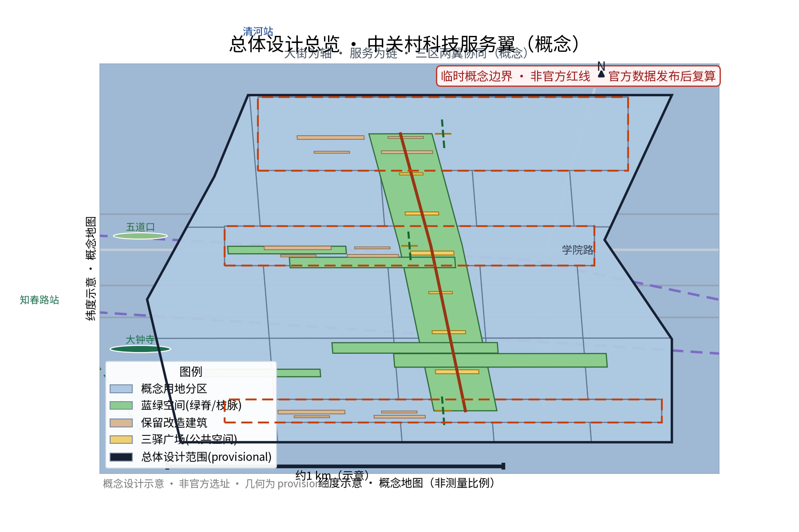
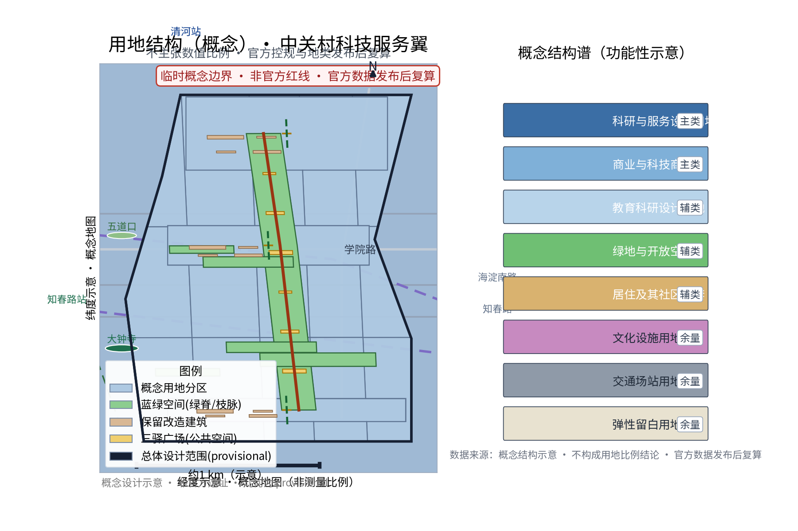
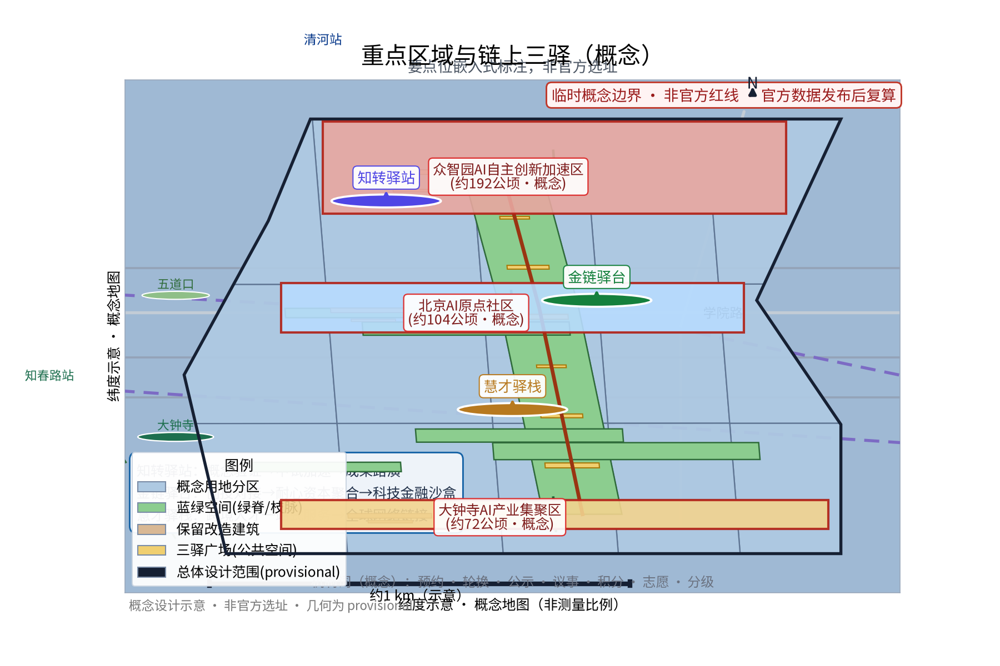
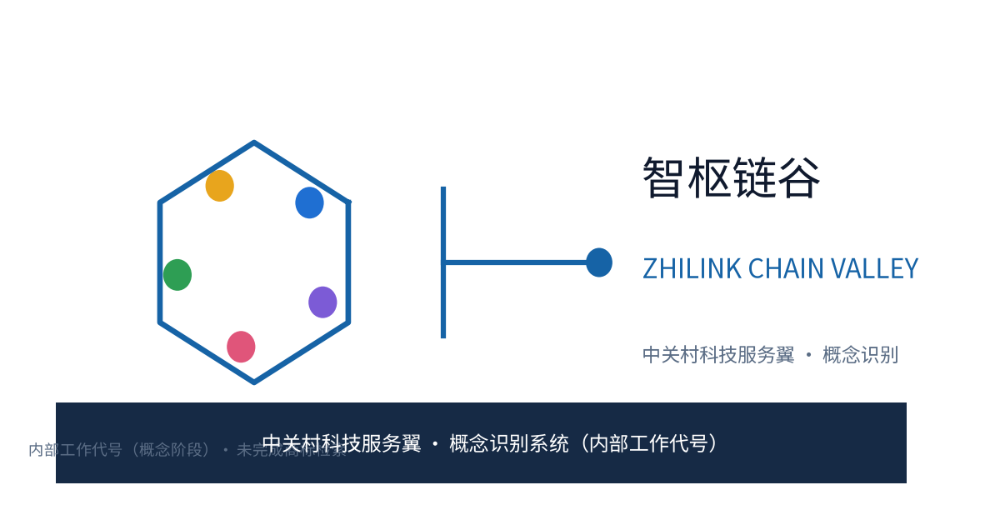
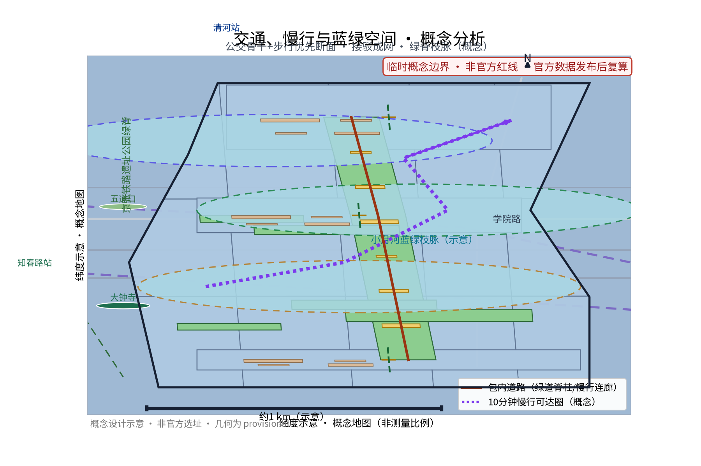
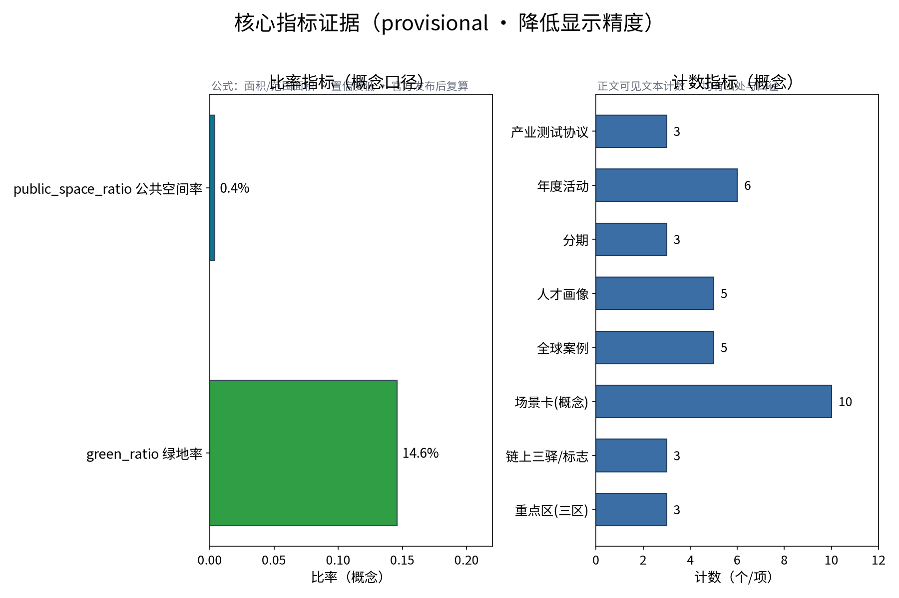

**方案名称与总体构想（概念）**

主名「智枢链谷」，英文名 ZHILINK CHAIN VALLEY（原创概念名，不指代任何现实城市、园区或企业；作为内部工作代号使用）。总体构想：以"中关村科技服务翼"为题目，把科技服务视为组织创新要素流动的"第一链"，沿中关村大街（海淀段）构筑一个要素全球化配置的科技服务生态带，让技术、资本、人才、数据、标准五类要素沿链流动、在带聚合。方案借百年京张铁路"自主创新、一线贯通"的精神意象，将科技服务全链条转译为"链上三驿"——知转驿站（科技成果转化）、金链驿台（投融资与创新资本）、慧才驿栈（人才与国际合作），以三个原创概念点位串起大街公共服务序列，并配套「智枢链谷·要素链带」品牌识别系统（Logo、昭示语、色彩与图标组件库）与区域协同回路。方案衔接"百年京张文化带、都市AI生活体验带、AI融合创新带"三大定位与"AI全栈自主创新体系、世界级AI创新生态、AI+场景赋能新范式、智能化AI活力城市、AI治理全球话语权"五大功能；全部落地内容均为概念建议与参考方案，供专业团队深化研究。

## 设计依据与资料清单

本方案以征集公告与设计任务书为基本依据，采用组织方公开文本口径：统筹研究范围43.6平方公里、总体设计范围11.4平方公里、重点区域合计368.4公顷，以及众智园AI自主创新加速区（约192公顷）、北京AI原点社区（约104公顷）、大钟寺AI产业集聚区（约72公顷）的分区口径。参考资料包括：京张铁路遗址公园公开设计成果、北京市与海淀区公开的国土空间规划与城市更新政策文本、公开统计数据、沿带现场踏勘记录及开源地理信息（仅作空间叙事示意）。组织方尚未发布带坐标系的官方边界多边形，本方案不主张任何精确面积与几何数值，全部几何按provisional处理，官方边界与控规数据发布后由专业团队统一复算。针对"正式控规、轨道道路控制条件、文保生态约束、权属、市政容量、消防"等场地专业资料缺口，本方案仅以方法性引用支撑边界与术语表达，不据此推出项目特定结论，缺口以风险与合规节登记。

> **证据锚点**：[source:OFFICIAL-ANNOUNCEMENT]（征集公告文本口径）、[source:AGENT-TASKBOOK]（任务书任务口径）。

## 三层范围工作框架

三层成果逐级传导：统筹研究输出的要素流动格局与服务带职能判断约束总体设计，总体设计校核的用地兼容、大街断面与弹性指标再落实到节点详设；每层均保留与任务书对应章节的机器可读证据锚点，便于评审对照。

工作框架按"研究—设计—实施"三环闭环组织：第一层，统筹研究范围（43.6平方公里，官方文本口径），开展产业格局、要素流动网络与未来城市研究，确定科技服务翼在创新带中的中枢地位；第二层，总体设计范围（11.4平方公里，官方文本口径），以控规深度城市设计手法，对沿中关村大街的城市更新编制总体空间方案与设计导则要素清单；第三层，重点区域（合计368.4公顷，官方文本口径），对三区开展详细设计并深化"链上三驿"概念点位。三层共用一个"智枢数字底座"（概念机制）：将产业、交通、建筑、蓝绿与人口数据本地化脱敏、匿名聚合，支撑方案动态校核与分期评估；数字底座不采集、不使用个体识别类信息，仅作聚合决策支持。

> **证据锚点**：[source:AGENT-TASKBOOK]（三层范围划分依据任务书官方文本口径）。

## 统筹研究范围产业与未来城市研究

沿带产业空间叙事自北向南展开：清河—上地/中关村软件园为AI软件平台与算力服务重镇，知春路集中科研院所与硬科技孵化，中关村大街为创新策源与科技商务核心，学院路汇聚高校智力带，共同构成AI全栈自主创新的产业带谱。统筹研究提出"要素全球化配置五大概念机制"：全球创新网络链接——在离岸创新高地设立联络节点、双向导流；技术转移与知识产权交易——专利开放许可与场内交易结算；跨境人才流动服务——一站式签证辅导与资质互认；标准与评测服务——参与AI基准与评测规则共建；数据要素流通规则——场内登记、匿名化流通与收益分配。

**生态图谱（概念）**：以"芯片—框架—模型—数据—应用—评测"全栈环节为横轴、以"策源—转化—资本—人才—治理"服务环节为纵轴，绘制科技服务翼在全球AI创新生态中的图谱，映射五类要素沿链流动的节点与缺口。**全球案例对照（概念，5项）**如下表，均来自公开机构页面，仅作机制参照，不作官方背书；案例原始页面在引用时需二次核验。

| 案例（地区/园区） | 机制要点 | 可借鉴要素 | 来源（公开可核验页面） |
|---|---|---|---|
| 新加坡纬壹科技城（one-north） | 政府引导+市场运营的产学研社区 | 簇团布局与共享平台 | 新加坡裕廊集团官网 |
| 美国剑桥肯德尔广场 | 研究型大学与风投对接走廊 | 概念验证与资本聚合 | MIT 肯德尔广场计划官网 |
| 深圳河套深港科技创新合作区 | 跨境要素流动与科创规则衔接 | 跨境人才与数据要素安排 | 国务院公报·河套发展规划 |
| 加拿大蒙特利尔 Mila AI 研究院 | 开放数据集与人才网络共建 | 开放科学与国际人才网络 | Mila 机构官网 |
| 韩国板桥科技谷（Pangyo） | 政府园区+企业主导运营 | 产业集聚与会展产业生态 | 板桥科技谷官网 |

> **证据锚点**：[source:PROVISIONAL-BOUNDARIES]（边界为 provisional，生态图谱与案例仅作概念示意）、[metric:global_case_count]。

## 总体设计范围城市更新与控规深度城市设计

总体设计范围（11.4平方公里，官方文本口径）以"大街为轴、服务为链"组织空间：其一，服务节点与大街公共空间序列整合——将"链上三驿"概念点位嵌入知春路、中关村大街中段与学院路南口附近的大街段落，与既有广场、绿地序列形成"科技服务客厅"连续体验；其二，科技服务功能与街区生活共生——底层布局服务型商业与展示空间，楼上承载专业服务与孵化功能，促进职住与消费混合；其三，步行与慢行联系——重构大街断面，预留连续步行带，与京张铁路遗址公园绿廊、学院路及知春路慢行形成网络；其四，公共服务设施补充——增补便民服务中心、24小时共享服务点、托育养老微设施与无障碍设施。建筑高度、贴线率等指标建议以官方边界与控规发布后核定，本方案仅提供导则要素建议，不预设结论性控制值。

> **证据锚点**：[source:MOHURD-URBAN-DESIGN]（城市设计方法参照）、[source:PROVISIONAL-BOUNDARIES]（provisional 边界复算）。

## 重点区域详细设计

重点区域合计368.4公顷（官方文本口径），含众智园AI自主创新加速区（约192公顷）、北京AI原点社区（约104公顷）、大钟寺AI产业集聚区（约72公顷），分别侧重自主创新加速、AI原点文化与生活体验、产业集聚与服务配套，与任务书"三区两翼"格局衔接（"三区"即上述三处重点区，"两翼"指依托京张铁路遗址公园东西两侧展开的都市生活体验翼与AI融合创新翼，为组织方公开表述的概念化泛指，本方案仅作叙事引用，不主张具体边界）。本方案深化三处原创概念点位（均标注为概念点位，落位为概念建议，非官方选址，供专业团队深化研究）：「知转驿站」——科技成果转化服务节点，建议近知春路交会段，集成概念验证、中试加速与成果路演；「金链驿台」——投融资与创新资本节点，建议近中关村大街中段科技商务楼宇群，组织创投对接、耐心资本聚合与科技金融沙盒场景；「慧才驿栈」——人才与国际合作服务节点，建议近学院路南口大学集聚段，提供跨境人才一站式服务与全球网络链接功能。三节点采用模块化、可逆的"要素服务组件"构造，为后续功能调整预留弹性。

**场景卡索引（概念，10张）**：AI+场景以场景卡落地，形成可评审、可迭代的运营索引，每张场景卡含落点、面向人群、运营机制、数据与合规边界四字段：

| 场景卡（概念） | 落点 | 面向人群 | 运营机制（概念） | 数据与合规边界 |
|---|---|---|---|---|
| 「估值助手」IP价值评估 | 「知转驿站」服务节点 | 创业者、工程师 | 预约评估、专家复核 | 差分隐私聚合，人工复核 |
| 「链金会客厅」创投对接 | 「金链驿台」商务楼宇群 | 投资人、白领 | 双周会、轮换议题 | 匿名聚合，不进行个体识别式追踪 |
| 「慧才窗」跨境人才服务 | 「慧才驿栈」学院路南口 | 国际人才、学生 | 预约办理、志愿引导 | 端侧脱敏，禁止过度监控 |
| 「智枢屏」数据要素台账 | 大街公共空间 | 运营方、商户 | 年度公示、议事征集 | 仅聚合统计，人工复核 |
| 「驿行通」活动集散接驳 | 三驿及大街站点 | 通勤者、游客 | 预约报名、积分激励 | 仅聚合统计，可一键关闭 |
| 「零号验证」概念验证加速 | 知春路创新孵化载体 | 科研团队、高校师生 | 立项议事、阶段评估 | 项目信息脱敏，结果公开发布 |
| 「云梯铺」招商转化服务 | 大街服务型底商展位 | 中小企业、初创团队 | 租金分级、履约备案 | 商业数据匿名聚合，人工对接 |
| 「原力舞台」成果路演空间 | 大街公共舞台节点 | 创业者、公众、观众 | 预约排期、公开报名 | 影像脱敏，公益优先 |
| 「银龄智护」社区服务终端 | 社区公服微中心 | 老年人、家庭 | 志愿结对、人工兜底 | 非数字渠道并行，匿名处置 |
| 「童创工坊」青少年AI工坊 | 公共空间组件节点 | 儿童、亲子家庭 | 预约分批、轮换课程 | 未成年人信息不采集，人工监护 |

> **证据锚点**：[data:PACKAGE-GEOMETRY]（三区与三驿示意多边形来自本包 geometry/key_areas.geojson）。

## AI 创新生态、人才画像与 AI+ 场景

生态层面，沿带串联芯片—框架—模型—数据—应用—评测的全栈环节，以科技服务翼作为全栈各环节的公共支撑（配套生态图谱见统筹研究节）。人才画像分五类人才：前沿研究者、连续创业者、工程师与产品人、国际流动人才、科技服务专业人才，服务设施按画像错峰配置，并照顾低数字能力的老人、儿童与残障人士的替代渠道。AI+场景（概念工具，共六类）：科技服务智能匹配与政策合规助手、知识产权价值评估助手、投融资对接助手、人才服务与签证辅导助手、标准与评测数字工具、数据要素流通台账工具。隐私保护与人工复核边界：所有助手仅处理匿名聚合数据，个人信息一律本地化脱敏、差分隐私聚合；合规意见、估值、授信与签证等敏感结论须由持证专业人员人工复核后方可对外输出；明确禁止行为轨迹追踪与个体画像式监控，不建设人格识别类应用，不进行个体识别式追踪、禁止过度监控。

**AI技术测试协议（概念，3项，先测试后规模化）**，用于在真实业务接入前验证工具可靠性，均含测试条件、通过标准与退出机制：

| 测试协议（概念） | 测试条件（样本/环境） | 通过标准 | 失败退出与人工接管 |
|---|---|---|---|
| 「政策合规助手」协议 | 匿名化政策语料、离线沙盒 | 关键条款命中率与误报率达标、人工复核通过 | 误报超阈值即停用，转人工法规团队 |
| 「IP估值助手」协议 | 脱敏估值样本、持证复核基线 | 估值区间偏差在设定带内、误差分群可控 | 超带即退回，人工估值兜底 |
| 「数据台账」协议 | 匿名交易样本、模拟流通 | 台账对账一致、模型评测与运行监测正常 | 不一致即撤收，回归人工登记 |
> 协议仅覆盖工具本身的技术验证，不构成任何业务审批承诺。

AI场景域覆盖产业、空间、公共服务、文化、治理、交通六域：AI产业（概念验证与中试加速）、AI空间（大街公共空间序列）、AI公共服务（人才与签证辅导）、AI文化（成果路演与年度论坛）、AI治理（数据要素台账与合规沙盒）、AI交通（活动集散与市集组织），各域均以人工复核兜底。

> **证据锚点**：[source:GENERATIVE-AI-MEASURES]（AI生成内容治理表述参照）、[source:BARRIER-FREE-LAW]（无障碍与人工服务兜底基线，仅限列举服务场景）。

## 用地、建筑规模与拆改留方案

拆改留坚持留改拆排序：沿大街品质较好的科研商务载体、历史建筑与公共绿地登记建档、能留尽留，仅针对危房及严重妨碍慢行与公共服务的极少数建筑逐栋论证拆除；全部面积为概念口径，官方数据发布后复算。本条不以任何数值主张用地比例：正式控规与地类调查发布前，各类用地的相对结构（科研与服务、商业与科技商务、教育科研设计、绿地与开放空间、居住配套、文化设施、交通场站与弹性留白等）仅作单一聚合口径的示意（见 land-use-structure.png 结构图），不构成法定规划结论，正式用地数据以官方发布后复算为准。

本方案提供概念性的拆改留策略与规模建议：保留——沿大街品质较好的科研商务载体、历史建筑与公共绿地，原样保护与功能活化；改造——低效楼宇、老旧底商以功能混合方式更新，重点补充服务型空间与公共开放空间；新建——仅在三处概念点位周边预留少量节点型建筑，严控体量。建筑规模不预先主张精确数值，建议以"服务空间、孵化加速空间、公共空间"的配比区间作为深化参考。所有用地分类与指标均以概念建议表述，不构成法定规划结论。

> **证据锚点**：[source:MNR-LAND-USE-GUIDE]（用地分类名称参照现行国标口径）。

## 交通、轨道、市政与公共服务设施

慢行组织以中关村大街为轴、京张铁路遗址公园为绿脊，公交骨干与步行优先断面、轨道站点最后一公里接驳贯通成网；市政结合电力扩容、分布式能源与雨水收集（概念建议）；公共服务以双层体系（链上三驿+社区公服）集成便民、共享、托育养老、无障碍、母婴与AED设施，AI决策均设人工复核。

交通概念：中关村大街强化公交骨干与步行优先断面，站点周边组织"最后一公里"接驳；利用既有轨道节点（清河站、知春路站、五道口、大钟寺等现状设施）作为接驳锚点，深化轨道与创新带的空间耦合研究。慢行与绿道：与京张铁路遗址公园、学院路、小月河步道串联成网，形成通勤加活力双系统。市政：电力扩容与算力设施配套、分布式能源与光伏利用、雨水收集与下渗改造（均为概念建议）。公共服务设施：按"链上三驿+社区公服"双层体系补充，涵盖便民服务中心、24小时共享服务点、托育与养老微设施、无障碍及母婴室、AED急救点，贯彻全龄友好、适老化与儿童友好设计，提升国际人才与社区居民的共享服务水平；无障碍与人工服务兜底以《无障碍环境建设法》所列服务场景为基线，不泛化为全部空间已合规。

> **证据锚点**：[source:MOHURD-URBAN-DESIGN]（市政与慢行设计表述的方法参照）、[source:BARRIER-FREE-LAW]（无障碍基线）。

## 蓝绿空间、公共空间与城市风貌

京张铁路遗址公园绿脊+小月河蓝绿枝脉+学院路高校绿带整合蓝绿空间，三驿广场作为链上呼吸点；智慧街道家具、信息发布与夜间照明遵循克制原则，适度亮化、按需照明，避免过度装饰与光污染。

蓝绿空间以京张铁路遗址公园为绿色脊梁，小月河滨水空间为蓝绿枝脉，学院路高校绿带与街头绿地串联成网，三处概念点位各配一处小型广场作为链上"呼吸点"。公共空间序列沿中关村大街展开，将站前广场、街道客厅、三驿广场与公园入口整合为连续的"科技服务客厅"体验。**公共空间组件库（概念，可逆）**：以街具、座椅、花箱、信息柱、充电与售卖单元等标准化模块组合，支持按季节与活动轮换布置，避免固化建设。**荣誉展示体系（概念）**：在「原力舞台」与「智枢屏」设置创业者、志愿者与社区共建者荣誉墙，以年度公示与积分激励滚动展示，突出人的参与而非设备监控。

### 品牌识别与视觉系统（概念）

以「智枢链谷·要素链带」为统一识别：Logo 取"链环+五要素色点"母题，配昭示语"第一链、链万物"，色彩系统以科技蓝为主、辅助色区分五类要素；图标组件库覆盖智库、链带、驿站、驿台、驿栈五类。该识别体系同时用于导视系统与**国际传播文案**（中英双语）：面向全球人才与企业发布"智枢链谷"科技服务叙事与国际传播素材，借助京张百年文化、中关村文化与AI新文化融合叙事提升国际传播力；导视系统以「链上三驿」为核，配合无障碍与低数字能力人群的文字、语音双通道。所有品牌名称与标识在完成商标检索前按内部工作代号处理，不对外注册使用。

> **证据锚点**：[source:MOHURD-URBAN-DESIGN]（蓝绿空间组织与风貌控制方法参照）。

## 更新项目清单、实施政策与分期计划

三阶段项目清单（近期1-3年/中期3-5年/远期5-10年）为概念清单，规模与投资估算均为定性建议，不构成政府、投资或审批承诺；政策建议不构成政府或运营方承诺。实施按"主体—前置—最小可行试点—资源包—里程碑—指标—人工接管与go/no-go"组织，附RACI角色（牵头单位、协作单位、审批通道、运营主体四类主体），并为各项目设停止条件（试点未达即撤收或停项、数据合规沙盒未过评即停用）。

**项目清单与分期（概念）**：近期（启动期，1-3年）——建设智枢数字底座与AI助手平台1.0，开展先行点位微更新、三驿选址深化研究，启动小月河体验路径首段贯通；中期（成长期，3-5年）——三驿概念点位建成投用，大街公共空间序列贯通，试点街区功能混合改造；远期（成熟期，5-10年）——科技服务全链条生态成型，离岸联络节点与全球网络常态化运行，开发者社区与场景开放平台形成自组织生态。各期均设最小可行试点（如以单个路演日验证活动机制）、概念资源包（剧本、图集、预算档次说明）、里程碑与阶段验收指标，并预留人工接管与go/no-go决策点。

**开发者社区与场景开放（概念）**：建设开发者社区（线上工坊+线下黑客松），开放"场景开放"接口与数据集目录，以「开放共创公约」约束参与者权责；**招引转化机制（概念）**：以「云梯铺」招商转化服务承接活动流量，形成"活动—对接—入驻—复购"转化链条。**年度活动体系（概念，6项品牌）**设计如下表：

| 年度活动品牌（概念） | 频次 | 主办协作（概念） | 考核指标（概念） |
|---|---|---|---|
| 成果转化路演日 | 每季度1场 | 高校+驿站+企业 | 路演项目数与转化线索数 |
| 技术交易集市 | 每月1场 | 驿站+协会+机构 | 集市摊位与成交意向数 |
| 资本对接双周会 | 每两周1场 | 金链驿台+投资机构 | 对接场次与跟投意向数 |
| 国际人才服务日 | 每月1场 | 慧才驿栈+高校国际处 | 服务人次与满意度 |
| 标准评测开放周 | 每年1周 | 标准机构+驿站 | 参与机构与报告发布数 |
| 智枢链谷年度论坛 | 每年1场 | 联盟+媒体+政府 | 参会规模与议题数 |

**区域协同回路（概念）**：与北纬社区、未来科学城、怀柔科学城、经开区及京津冀创新协作区建立要素互换与活动共办回路（如玉泉大院创新交流、环高校圈共办），避免本翼孤立运营。

> **证据锚点**：[source:AGENT-TASKBOOK]（分期与实施条目对应任务书要求）。

## 指标体系、面积复算与合规矩阵

目标—指标—校验三层概念指标体系进入 metrics.json；面积复算以本包 provisional 几何为底，官方数据到位后整体复算并标注复算版本。

指标体系（概念）：要素服务10分钟步行可达覆盖率、科技成果转化平均周期、跨境人才服务办理时长、AI助手渗透率与人工复核通过率、就业岗位密度、慢行连通度、公共服务设施千人指标达标率；每项指标标注数据来源、计算公式、置信度等级、适用范围与官方数据发布后的复算触发条件（详见 metrics.json）。面积复算：本方案仅采用官方文本口径数值（43.6平方公里、11.4平方公里、368.4公顷及三区公顷数），不主张精确坐标与几何；待官方边界多边形发布后，由专业团队按统一基准复算并与本方案衔接；provisional 指标在展示时降低显示精度，避免误读为正式口径。合规矩阵：逐项对照法定规划、城市更新政策与数据合规要求，按"完全衔接、建议深化、需专题论证"三档标注，作为深化研究的合规工作底表。

> **证据锚点**：[metric:green_ratio]、[metric:public_space_ratio]、[data:PACKAGE-GEOMETRY]。

## 风险、版权与合规说明

本方案为概念研究性设计，不构成行政审批依据；正式实施前须完成多部门联审、数据合规评估与安全评估。主要风险与应对：官方边界与场地专业资料尚未发布，几何与分析均按provisional处理，复算触发后整体重算；市场需求与资本周期波动，分期计划预留弹性；隐私与数据合规风险，以匿名聚合加人工复核机制管控；存量产权复杂，拆改留方案坚持支点微更新路径；无障碍与权益未逐一核验，不作为已合规声明。

版权说明：方案名称「智枢链谷」「ZHILINK CHAIN VALLEY」及三驿名称均为原创概念命名，不指代现实城市、园区或企业；**品牌在先权利与使用边界（概念）**——概念阶段未完成官方商标检索，相关名称与标识一律按内部工作代号处理，暂不对外注册或商用，待在先权利检索完成后再进入品牌发布流程；引用资料仅按类别注明来源，不构成侵权，资产权利登记见 report/copyright_statement.md。合规说明：本方案为参赛概念提案，全部落地建议均为概念建议与参考方案，不构成法定规划审批结论，最终以官方征集规则与专业团队深化成果为准；居民意见通道、年度公示与年度活动均为概念机制建议。

> **证据锚点**：[source:OFFICIAL-ANNOUNCEMENT]（征集规则为权属与合规表述的依据）。

## 参考资料

参考资料以政府正式发布版本为准；本包 sources.json 仅收录可查证条目，未虚构任何官方数据或链接。

1. 本征集公告、设计任务书及组织方公开的主题、定位与范围说明（官方文本口径来源）；2. 京张铁路遗址公园已公开的设计与建设成果资料；3. 北京市城市总体规划、海淀区分区国土空间规划等公开规划文本；4. 北京市城市更新与数据要素、人工智能治理相关公开政策文件；5. 沿线产业与人口公开统计数据；6. 全球案例对照所列公开机构页面（对比研究用途，原始链接与抓取时点见 sources.json，引用时二次核验）；7. 现场踏勘记录与开源地理信息资料（仅作空间叙事示意，不代表法定边界）。以上资料按类别引用，具体条款与图件以官方发布版本为准，方案不对资料获取时点后的更新承担责任；本清单首条即组织方公开资料包，其余为公开渠道资料，未虚构任何官方数据或链接。

> **证据锚点**：[source:OFFICIAL-ANNOUNCEMENT]（本清单首条即组织方公开资料包）。
