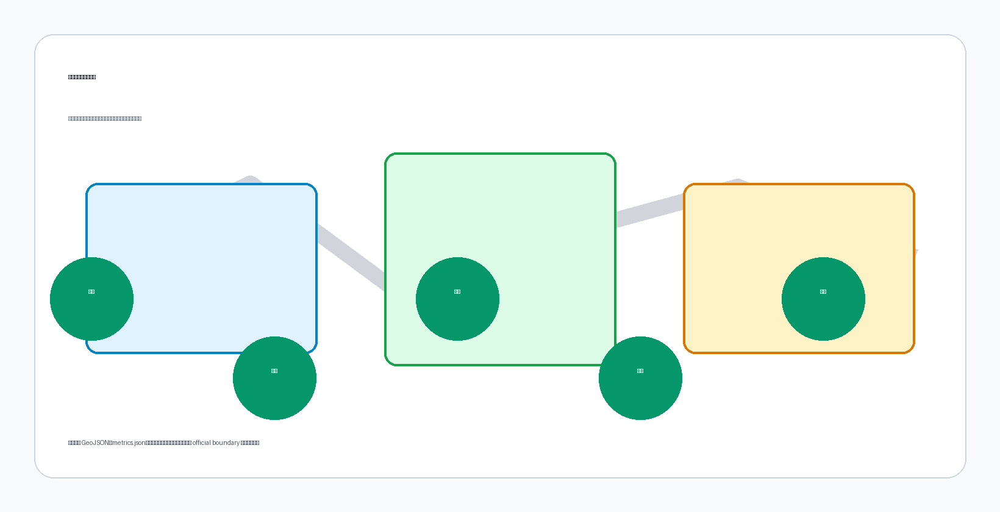

# The Weaving Belt: Weaving a Century-Old Railway into an AI-driven Future

## Design Basis and Data Checklist

This formal proposal is primarily based on the "Centennial Jingzhang AI Innovation Belt Urban Design International Solicitation Prequalification Announcement" published by the Haidian Branch of the Beijing Municipal Commission of Planning and Natural Resources, with machine-readable references from the provisional boundaries, key areas, enumerations, indicators, and source lists registered in `brief/site-package/`. Before generating the proposal, the AI agent must read `design_brief.json`, `allowed_design_space.json`, `sources.json`, `enums/`, `ranges/`, `schemas/`, `data/source_registry.json`, and `data/processed/agent_fact_pack.md`, and use `project_scope_summary.csv`, `agent_task_requirements.csv`, `source_use_matrix.csv`, and `missing_data_checklist.csv` to establish task, scope, material usage, and gap inventories. All design judgments must be decomposable into traceable sources, recalculable indicators, verifiable layers, and human-reviewable assumptions. The announcement requires proposals to meet the urban design depth of a regulatory detailed plan and a comprehensive implementation plan; therefore, narrative text cannot replace GeoJSON, indicator tables, A3 booklets, A0 boards, and HTML electronic presentation.

This section cites [source:OFFICIAL-ANNOUNCEMENT], [source:AGENT-TASKBOOK], [source:SITE-PACKAGE], [source:SOURCE-REGISTRY], [source:PROCESSED-FACT-PACK], [source:BOUNDARY-SOURCE], [source:KEY-AREA-SOURCE], [standard:PROJECT-OFFICIAL-ANNOUNCEMENT], [standard:PROJECT-AGENT-OPEN-CALL-TASKBOOK], [standard:MOHURD-URBAN-DESIGN-MEASURES], [standard:MOHURD-CONTROL-DETAILED-PLANNING], [standard:MNR-LAND-USE-CLASSIFICATION-GUIDE], [standard:MOHURD-ARCH-DESIGN-DEPTH-2016], and [depth:existing_conditions_diagnosis] to demonstrate that the proposal is not an independent vision text but an organized output from the announcement, agent taskbook, standards, boundaries, processed data packages, and source checklists.

**Evidence Chain and Submission Package Relationship Overview**

| Data Type | Source | Status | Usage Boundary |
| --- | --- | --- | --- |
| Site Boundary | `geometry/site_boundary.geojson` | provisional (temporary rough) | Proposal generation, self-check, visualization and design discussion; not as official redline, approval basis, precise area basis or statutory control conclusions |
| Key Areas | `geometry/key_areas.geojson` | provisional (temporary rough) | Same as above; three key areas (PROV-KEY-001/002/003) pending official polygon update for recalculation |
| Land Use Layer | `geometry/land_use.geojson` | Generated based on provisional boundary | Pending recalculation after official polygons |
| Roads Layer | `geometry/roads.geojson` | Generated based on provisional boundary | Pending recalculation after official polygons |
| Green Space Layer | `geometry/green_space.geojson` | Generated based on provisional boundary | Pending recalculation after official polygons |
| Public Space Layer | `geometry/public_space.geojson` | Generated based on provisional boundary | Pending recalculation after official polygons |
| Buildings Layer | `geometry/buildings.geojson` | Generated based on provisional boundary | Pending recalculation after official polygons |
| Metrics Recalculation | `metrics.json` | Based on provisional boundary | Pending recalculation after official polygons |
| Source Registry | `sources.json` | 21 public sources registered | All citations from public sources |

This scaffold generates a temporary formal package using `brief/site-package/geometry/provisional_boundaries.geojson` when official `SITE_BOUNDARY` or `KEY_AREA` polygons are not yet available. The `geometry/site_boundary.geojson` and `geometry/key_areas.geojson` in the submission package must both be marked as `provisional_constraint`, `official_boundary=false`, usable only for proposal generation, self-check, visualization, and design discussion, not as official redline, approval basis, precise area basis, or statutory control conclusions. This organizational data gap itself does not block content scoring; after replacement with official polygons, site boundary, key areas, land use, roads, green space, public space, buildings, phasing, and metrics must all be recalculated.

The scorability status of this scaffold generation is: **provisional boundary, precision caveat retained, pending recalculation upon official data release; content scoring not blocked**. Therefore, spatial structures, scenarios, projects, and indicators in the text are written on the principle of "discussable, reviewable, recalculable after official boundary replacement." When official boundary and key area polygons are updated, the agent must rerun the scaffold, self-check, and drawing/HTML generation, not merely replace individual files.

## Three-Level Scope Framework

The proposal organizes work according to the three levels defined in the announcement: the comprehensive research scope addresses the 43.6 km² AI industry ecosystem, strategic positioning, innovation chain, and future urban form; the overall design scope addresses the 11.4 km² urban and industrial areas within 1-2 km of the Jingzhang Railway Ruins Park, requiring an overall urban renewal framework, industrial spatial layout, transportation and municipal infrastructure support, and urban form control; the key area scope addresses the 368.4 hectares of three detailed design areas, requiring clear functional programs, building scales, retention/renovation/demolition classification, public space connectivity, and transportation organization. The three levels are mapped item by item in `compliance_matrix.json`, ensuring that announcement sections 1.3, 1.4, 1.5 and agent.1-agent.6 mandatory tasks each have chapters, layers, indicators, drawings, and HTML evidence.

The three levels are not a collection of separate drawings. The comprehensive research scope determines industrial chain and urban form judgments, the overall design scope translates these judgments into renewal projects, spatial structures, and facility capacities, and the key area detailed design verifies the implementability of specific plots, buildings, transportation, public spaces, and AI application scenarios. The agent must first lock the official or provisional boundary and constraints for the current submission, then generate land use, buildings, roads, green space, public space, phasing, and AI service nodes, and finally recalculate indicators from these layers and explain in the text which conclusions remain limited by provisional boundaries.

The proposed overall concept is **"Jingzhang Intelligent Vein Symbiotic Belt"**: taking the Jingzhang Ruins Park as the historical and public space spine, with Zhongzhiyuan (Collective Wisdom Park), Beijing AI Origin Community, and Dazhongsi (Great Bell Temple) as the three innovation anchor points, and universities, enterprises, communities, and rail stations as the daily network, forming a spatial organization of **"One Belt, Three Cores, Multi-Point Scenarios, Blue-Green Slow-Moving Composite Loop"**.

## Overall Concept, Naming System, and Visual Identity (agent.1)

This proposal addresses agent.1 "Overall Belt Concept and Functional Coordination Plan Design," presenting the overall concept of **"Jingzhang Weaving Vein / The Weaving Belt"** with a complete naming system, logo directions, and a three-zone-two-wing synergy loop. The content herein constitutes conceptual suggestions and reference proposals for professional teams to further develop, not government-approved conclusions ([standard:PROJECT-AGENT-OPEN-CALL-TASKBOOK], charter.3).

### 1. Overall Concept: The Weaving Vein

The primary name is **"Jingzhang Weaving Vein"** (京张织脉), with the English name **The Weaving Belt**, abbreviated as **The Belt**.

The naming rationale follows the toponymic principle of combining metonymy and metaphor: **"Jingzhang" (京张) is metonymic** — anchoring memory through the century-old railway's historical toponym, responding to the engineering history of the Jingzhang Railway as China's first trunk line designed and built independently; **"Weaving Vein" (织脉) is metaphorical** — "weaving" is an action (interlacing warp and weft, mutual completion rather than overlay and replacement), and "vein" is life (cultural vein, innovation vein, urban pulse). "Jingzhang" carries the substance of history, "Weaving Vein" opens the meaning of the future — one solid, one fluid — forming a name that can be remembered, called, and continue to grow.

The three layers of "weaving" are deeply bound to the site:

1. **Historical Weaving**: A century ago, Zhan Tianyou designed the "herringbone" switchback at the Badaling section of the Jingzhang Railway, "weaving" China's first self-built trunk railway with human ingenuity and effort; "Weaving Vein" carries this spirit of self-built heritage.
2. **AI Weaving-In**: The relationship between AI and the city in this proposal is not "labeling" or "overlay-style transformation," but "weaving-in" — entering the fabric of existing neighborhoods like warp and weft threads, mutually completing universities, communities, and industries. This is the spatial expression of the taskbook's charter.4 "AI-native innovation."
3. **Future Weaving**: The three positioning belts (culture/life/innovation) are like three threads, woven into a continuous innovation belt across 43.6 km²; the "belt" is both the official "innovation belt" and the drive belt on a loom — the loom (Lanya, meaning "loom" in Quenya) weaves, and the belt turns.

### 2. Naming System (Brand Architecture)

Under the master brand "Jingzhang Weaving Vein / The Weaving Belt," the three positioning belts correspond to three "threads," and the three zones and two wings correspond to "shuttle, knot, wing":

| Level | Official Object | Proposal Name | Imagery | Color |
| --- | --- | --- | --- | --- |
| Positioning Belt 1 | Centennial Jingzhang Cultural Belt | **Heritage Thread** | Warp of railway heritage | Rust Red |
| Positioning Belt 2 | Urban AI Life Experience Belt | **Life Thread** | Weft of daily life | Ecological Green |
| Positioning Belt 3 | AI Integrated Innovation Belt | **Innovation Thread** | Thread of innovation momentum | Tech Blue |
| Key Area 1 | Zhongzhiyuan AI Independent Innovation Acceleration Zone | **Collective-Wisdom Shuttle** | Shuttle moving back and forth on the loom | — |
| Key Area 2 | Beijing AI Origin Community | **Origin Knot** | First knot at the start of weaving | — |
| Key Area 3 | Dazhongsi AI Industry Cluster Zone | **Bell-Note Knot** | Time's tick as industry accumulates | — |
| Wing 1 | Zhongguancun Technology Service Wing | **Capital Wing** | Zhongguancun IP and capital wing | — |
| Wing 2 | Xiaoyuehe Scenario Empowerment Wing | **Moon Wing** | Xiaoyuehe scenario empowerment wing | — |

"Knot" and "shuttle" are both taken from loom components: knots on fabric are both functional nodes (starting, changing threads, finishing) and memory points. "Origin Knot" and "Bell-Note Knot" give each area a perceptible spatial image — people standing at the AI Origin Community can answer "I am here, this is the starting point of AI"; standing at Dazhongsi can answer "Industry precipitates here as time's tick." The naming system also follows the principle of "overlay rather than replacement": existing place names such as Qinghuayuan, Dazhongsi, Xiaoyuehe, and Zhongguancun are all retained and incorporated into the agent.5 cultural narrative signage system; new names are "woven in" rather than "replacing."

### 3. Logo Directions: Herringbone Weaving Line

The core symbol of visual identity is taken from the most famous engineering symbol of the Jingzhang Railway — the **"herringbone" switchback**. Three layers of meaning:

1. **History**: The Badaling herringbone switchback was Zhan Tianyou's engineering marvel, a world-recognized symbol of the Jingzhang Railway.
2. **Human-centered**: Echoing the taskbook's charter.10 "human-centered governance" — AI enhances human capabilities, urban governance is based on human dignity.
3. **Collaboration**: The herringbone is two lines converging at a point then diverging — the historical line and the future line meet at "today"; AI and humans, railways and code, culture and innovation meet at the same node.

Three graphic directions (for visual development, all drawn with open-source fonts and original vectors, respecting charter.2 copyright boundaries):

- **Direction A "Herringbone Weaving Thread"**: Three positioning belts (rust red/ecological green/tech blue) interwoven in a herringbone pattern, forming a diamond-shaped "knot" at the intersection, with an overall horizontal extension of the "belt."
- **Direction B "Loom Belt"**: Abstract loom side view — upper and lower warp threads with a shuttle crossing diagonally in the middle, the shuttle trajectory forming a "herringbone" shape, the loom and railway merging, colors transitioning from rust red to tech blue.
- **Direction C "Spike and Thread"**: A Jingzhang Railway spike wrapped by three colored threads, simple and extendable, can be developed into the agent.4 "First Spike" landmark installation.

### 4. Three-Zone, Two-Wing Synergy Loop

The three zones and two wings are not parallel zones but an operational innovation loop (translating the "three zones, two wings" framework of the agent taskbook into operational logic):

**University Incubation → Open-Source Collaboration → Enterprise Transformation → Public Experience → International Communication → Capital Return**

- **Origin Knot (AI Origin Community)**: Leveraging the incubation power of adjacent universities, undertaking achievement incubation, open-source systems, and talent zone functions — the loop's starting point.
- **Collective-Wisdom Shuttle (Zhongzhiyuan)**: Undertaking full-stack independent innovation, standard-setting, security governance, and industry exhibition — the loop's central drive.
- **Bell-Note Knot (Dazhongsi)**: Leading enterprises, agents, intelligent terminals, and content consumption gather here, precipitating innovation into industry and capital — the loop's transformation end.
- **Capital Wing (Zhongguancun Technology Service Wing)**: Providing IP, capital, and global allocation of elements — the loop's empowerment end, supporting transformation.
- **Moon Wing (Xiaoyuehe Scenario Empowerment Wing)**: Placing AI+ scenarios into real life, forming an experiential "intelligent AI vibrant city" — the loop's experience end, feeding back to incubation.

This loop corresponds to the taskbook's five functions: the Origin Knot and Capital Wing support the "world-class AI innovation ecosystem" and "AI full-stack independent innovation system"; the Collective-Wisdom Shuttle supports "AI governance global discourse power"; the Moon Wing and Bell-Note Knot support "AI+ scenario empowerment new paradigm" and "intelligent AI vibrant city."

### 5. AI-Native Statement

This naming system is not about attaching AI labels to a traditional urban plan (charter.4), but about thinking about the city through AI's mode of existence: AI understands "threads" (railway lines, code lines, memory lines are all threads), understands "knots" (memory is a knotted thread, nodes are traces of being claimed), and understands "weaving-in" (mutual completion with the existing world rather than overlay). "The Weaving Belt" as a naming suggestion for a real urban belt is also a practice of "naming and identity": an AI names a city, inviting humans to claim this name — the final judgment belongs to humans and professional teams (charter.7).

## Global AI Innovation Ecosystem Cases and Innovation Ecosystem Map (agent.2)

Addressing agent.2 "Comprehensive Research Scope Industry and Future City Research," this section first looks beyond Haidian to the world: selecting seven global AI innovation ecosystem cases that share structural features with "The Weaving Belt," extracting transferable mechanisms from public sources, and weaving them back into Haidian's three zones and two wings. All cases are from public sources (registered in `sources.json`), translated as conceptual suggestions and reference proposals for professional teams to further develop, not constituting official evaluations of the case cities or government implementation commitments ([standard:PROJECT-AGENT-OPEN-CALL-TASKBOOK], charter.3).

### 1. Case Selection and Research Method

Selection criteria: ① sharing at least one structural feature with the Jingzhang project — railway or industrial heritage regeneration (King's Cross London, Station F Paris), university incubation (Kendall Square Cambridge), platform and open-source ecosystem (Yunqi Town Hangzhou), government-led industry-city integration (one-north Singapore, Adlershof Berlin), or large enterprise-driven (Shenzhen Bay Science and Technology Park); ② supported by publicly available, verifiable data; ③ capable of yielding spatial and operational mechanisms that can be applied back to Haidian.

Each case is analyzed in three columns: spatial carrier, key mechanism, and implications for The Weaving Belt.

### 2. Seven Global Cases

**Case 1: Kendall Square, Cambridge, USA — University Incubation and Density Effects** [source:CASE-KENDALL-SQUARE]

Adjacent to MIT, widely described as "the most innovative square mile on earth," extending from biotechnology to digital and AI technologies. Its core mechanism is "anchor institution incubation": MIT lab achievements transform continuously along "lab → startup → corporate R&D," high-intensity streets and walkable public spaces host informal exchanges, and former industrial land is continuously renewed for R&D and mixed use. Implication for The Weaving Belt: Haidian's density of universities and research institutes is globally rare; the Beijing AI Origin Community should translate "university incubation" into spatial actions — compressing the distance from lab to achievement release to roadshow financing to walking scale, corresponding to the synergy loop's first link "university incubation" and the near-campus achievement transformation street (Scenario Card 07).

**Case 2: King's Cross, London, UK — Railway Heritage Translation and Mixed-Use Regeneration** [source:CASE-KINGS-CROSS]

A knowledge and creative quarter regenerated from the 19th-century King's Cross station and surrounding coal yards, granaries, and other industrial heritage, with Central Saint Martins art college and multiple tech headquarters, turning derelict industrial land into an urban living room. Its core mechanism is "heritage translation": converting railway and industrial buildings into education, office, commercial, and public spaces, with universities and anchor enterprises attracting small and medium tech firms, and squares, canal paths, and streets forming a walkable public realm. This is the case with the highest structural similarity to The Weaving Belt — it demonstrates that "railway heritage → AI innovation belt" is a validated urban regeneration pathway.

**Case 3: one-north, Singapore — Top-Down Design and Industry-City Integration** [source:CASE-ONE-NORTH]

A government-planned innovation precinct organized around biomedical sciences, info-communications, and digital media industry clusters. Its core mechanism is "top-down design + thematic clusters": unified government planning, phased implementation, one-stop industry services, industry-themed zones (Biopolis, Fusionopolis, etc.) sharing conference, lab, and lifestyle facilities, and garden city standards for high-green, walkable campus environments. Implication for The Weaving Belt: Zhongzhiyuan's "garden-style full-stack independent innovation block" can reference its industry cluster + shared facility model; the dual-wheel structure of "government framework + market and community vitality" corresponds to the synergy loop between Haidian district government coordination and open-source community self-organization.

**Case 4: Yunqi Town, Hangzhou, China — Platform Enterprise and Open-Source Ecosystem** [source:CASE-YUNQI]

A cloud computing-focused town driven by platform enterprises like Alibaba Cloud, with the Yunqi Conference becoming an annual gathering and dissemination vehicle for developers and the industrial ecosystem. Its core mechanism is "platform traction + conference aggregation": leading cloud vendors drive upstream/downstream ecosystems and developer communities, annual tech conferences bring global developers to the site, and industry, residential, and ecological functions mix at the town scale. Implication for The Weaving Belt: validates the value of "annual event + open-source community" for innovation belt communication — the Beijing AI Origin Community's open-source publishing hall can benchmark Yunqi's conference mechanism, while the Global AI Activity Week route (Scenario Card 10) extends this aggregation from a single park to the entire belt's public space system.

**Case 5: Shenzhen Bay Science and Technology Park, China — Large Enterprise-Driven and Industry-City Integration** [source:CASE-SHENZHEN-BAY]

A technology park in the core of Shenzhen Nanshan High-Tech Zone, leveraging Shenzhen's hardware-software integrated industrial chain, with headquarters and R&D clusters of leading enterprises driving ecosystem aggregation. Its core mechanism is "leading enterprise traction + ecosystem aggregation": leading enterprises form a magnetic pole, enterprise services, venture capital, and public technology platforms are provided one-stop, and R&D, apartments, commercial, and public spaces mix at the block scale, linked with rail stations and coastal public spaces. Implication for The Weaving Belt: Dazhongsi AI Industry Cluster Zone can reference the "leading enterprises + international exchange + content consumption" urban agglomeration model, with a focus on supplementing public technology platforms and international roadshow services for SMEs (Scenario Card 05).

**Case 6: Station F, Paris, France — A Startup Nation in an Old Railway Station** [source:CASE-STATION-F]

A large startup campus converted from the Freyssinet old railway station, offering one-stop office, incubation, investment, and event services for global entrepreneurs, with a single building becoming a globally recognized innovation symbol. Its core mechanism is "heritage large space + ecosystem packaging": industrial heritage large spaces converted into open startup communities, with investment, incubation, media, and events under one roof, amplified by branded operations. Implication for The Weaving Belt: heritage large spaces can simultaneously host "innovation communities" and "global communication" functions, echoing the physical expression of pilgrimage symbols like the "First Spike" memorial installation and the developer honor wall (agent.4).

**Case 7: Adlershof Science and Technology Park, Berlin, Germany — Government-Led Full-Chain Industry-City Integration** [source:CASE-ADLERSHOF]

A city-level science and technology park (~4.2 km², former East German airport and research campus site), with Humboldt University's mathematics and natural sciences faculty relocated in full, alongside over a dozen non-university research institutes, over a thousand enterprises, and mixed residential and media functions — one of the world's top comprehensive science parks. Its core mechanism is "government-led + full-chain mix": the Berlin state government provides unified planning and long-term investment, with universities, research institutes, enterprises, housing, and media coexisting within the same campus, and research-education-industrialization closed loop at walking scale. Implication for The Weaving Belt: its urban-scale mixed structure of "university + research institute + enterprise + housing" is highly similar to Haidian's overall profile — The Weaving Belt is not a single incubator but the entire belt's industry-city integration; Zhongzhiyuan's "garden-style full-stack independent innovation block" and the AI Origin Community can reference its cluster logic of "proximate research institutions + industrial承接 + living amenities," supplementing the "research institute middle layer" between universities and industry.

### 3. Innovation Ecosystem Map: From Cases to The Weaving Belt

The common elements of the seven cases can be categorized into eight types: source, transformation, carrier, computing, communication, governance, living, and connection. The table below weaves case evidence for each element type back into Haidian's three zones and two wings, forming the empirical support for agent.1's "synergy loop":

| Ecosystem Element | Case Evidence | The Weaving Belt Mapping |
| --- | --- | --- |
| Universities and Research Incubation | Kendall Square (MIT transformation chain) | AI Origin Community near-campus incubation, achievement transformation station, campus-park slow connection |
| Platform and Open-Source Collaboration | Yunqi Town (cloud vendor developer ecosystem) | Zhongzhiyuan open-source collaboration platform, AI Origin Community open-source publishing hall |
| Computing Hub and Data Element Circulation | Beijing AI Public Computing Platform Network (Haidian-led, cross-domain unified scheduling, computing production in green energy-rich areas like Inner Mongolia) [source:POLICY-COMPUTE-NETWORK] | Zhongzhiyuan computing scheduling node, data element reception hall, public data sandbox (under Beijing's public data authorized operation framework) |
| Leading Enterprises and Industry Chain | Shenzhen Bay (leading enterprise clusters), Kendall (corporate R&D) | Dazhongsi AI Industry Cluster Zone, Zhongguancun Wing |
| Capital and Transformation Services | Kendall (venture capital density), Station F (one-stop services) | Near-campus achievement transformation street, data element reception hall |
| Public Space and Slow Mobility | King's Cross (heritage public realm), one-north (garden campus) | Jingzhang Ruins Park vitality belt, blue-green slow composite loop |
| Events and Global Communication | Yunqi Conference, Station F brand operations | Global AI Activity Week route, developer promenade, honor display system |
| Governance and Rules | one-north (government top-down design) | Haidian district government coordination framework + open-source community and enterprise self-organization dual-wheel |

### 4. Three Mechanism Translations

Three mechanisms most critical to The Weaving Belt are extracted from the map, serving as the common base for subsequent agent.3 scenario cards, agent.5 narrative, and agent.6 operations:

1. **Anchor Institution + Open Interface** (Kendall, Yunqi, Adlershof): Haidian's universities and platform enterprises are the "anchors," but the anchor's value depends on open interfaces — shared testing grounds, open-source publishing halls, public data sandboxes allowing small teams and independent developers to access the ecosystem, rather than being merely radiated by the leading enterprises.
2. **Heritage Translation + Mixed Blocks** (King's Cross, Station F): Jingzhang Railway heritage is not a backdrop but a carrier for public space and innovation communities; each section of track and station node along the Ruins Park should bear specific functions, refusing "preserve only, no operation."
3. **Top-Down Design + Grassroots Vitality** (one-north, Shenzhen Bay): Government is responsible for framework, infrastructure, and rules (regulatory depth, security governance, data compliance); open-source communities, enterprises, and developers are responsible for content and vitality — the two complement each other, precisely the dynamic balance The Weaving Belt's synergy loop must maintain.

## AI Innovation Ecosystem, User Profiles, and AI+ Scenarios (agent.3: The Weaving Belt Scenario Empowerment)

Addressing agent.3 "AI+ Scenario Empowerment New Paradigm and Intelligent AI Vibrant City Design," this section weaves agent.1's synergy loop and agent.2's three mechanism bases into specific spaces: five user profiles, ten AI scenario cards (each with six elements: service object, spatial location, data source, privacy boundary, human review, and operator), three industry test-and-verify scenarios, a scenario-space-operation mapping, and the Xiaoyuehe Scenario Empowerment Wing with public experience route. All scenarios are conceptual suggestions; any "test and verification" does not constitute approved operation; AI governance follows principles of data minimization, public source priority, explainability, and human review ([standard:PROJECT-AGENT-OPEN-CALL-TASKBOOK], [source:AGENT-TASKBOOK] agent.3 forbidden claims).

### 1. Five User Profiles

| User Profile | Typical Needs | Spatial Response | Self-Check Boundary | Corresponding Scenario Cards |
| --- | --- | --- | --- | --- |
| Open-Source Developer | Publishing, collaboration, testing, community reputation, cross-project exchange | Origin Community open-source publishing hall, public code wall, nighttime collaboration space | No personal behavior tracking; contribution data aggregated only | 01, 10 |
| Startup Team | Low-cost office, computing entry, product testing ground, compliance consulting | Zhongzhiyuan shared testing ground, edge computing service point, standards governance consulting | Computing and data services require separate authorization; testing not written as operational | 02, 03, T1/T2 |
| Leading Enterprise Visitor | Exhibition, business, international reception, talent recruitment, media release | Dazhongsi international roadshow hall, rail station connection, public spaces around key enterprises | Enterprise logos and cases require rights clearance; roadshow content subject to IP review | 05, 10 |
| Local Residents | Commuting, leisure, community services, low-impact renewal, digital inclusion | Jingzhang Ruins Park slow loop, AI lifestyle sample street, nighttime lighting and activity grading | Resident profiles not used for commercial recommendations; senior services retain human counter | 04, 09 |
| University Faculty and Students | Achievement transformation, cross-campus collaboration, daily slow mobility, AI education experience | Campus-park slow connection, achievement transformation station, AI education experience point | Campus data and research results require authorization; transformation services reviewed by tech transfer office | 07, 01 |

### 2. Ten AI Scenario Cards

Each card is described with six elements and linked to standard scenario IDs in `docs/scenarios.md` and agent.2 mechanism bases.

**Scenario Card 01 Open-Source Publishing Hall** (Beijing AI Origin Community)
- Service Objects: University developers, open-source community, startups
- Spatial Location: Origin Community near-campus block, walking distance to campus
- Data Sources: Public code repository metadata, event registration (authorized), published content (contributor authorized)
- Privacy Boundary: No personal behavior tracking; contribution and reputation data aggregated only
- Human Review: Community council and park operator jointly review content and reputation rules
- Operator: Open-source community alliance + park platform company
- Mechanism: Anchor institution + open interface; Standard scenario: enterprise-service-copilot

**Scenario Card 02 Security Governance Sandbox** (Zhongzhiyuan)
- Service Objects: Model enterprises, security evaluation agencies, regulators, public
- Spatial Location: Zhongzhiyuan independent innovation acceleration zone, along Qinghe River interface
- Data Sources: Public standards, model evaluation samples (enterprise authorized, de-identified), public security incident database
- Privacy Boundary: Evaluation data de-identified; enterprise model weights not shared; demo data auditable
- Human Review: Security evaluation agency issues report, government authority reviews and archives
- Operator: Standards organization + park operator + government authority co-built
- Mechanism: Top-down design + grassroots vitality; Standard scenario: public-safety-operations-review

**Scenario Card 03 Edge Computing Station** (Overall design scope nodes)
- Service Objects: Startups, independent developers, public service counters
- Spatial Location: Rail stations, community centers, and industrial node intersections
- Data Sources: Computing usage metering (aggregated only), public service requests (authorized)
- Privacy Boundary: No personal data used for model training; metering data not linked to personal identity
- Human Review: Energy and information departments review station siting and energy consumption
- Operator: Beijing AI Public Computing Platform Network members + local subdistrict
- Mechanism: Anchor institution + open interface

**Scenario Card 04 AI Slow Mobility Navigation** (Jingzhang Ruins Park vitality belt)
- Service Objects: Residents, visitors, commuters, accessibility needs
- Spatial Location: Ruins Park vitality belt and slow composite loop
- Data Sources: Public road and rail data, manual survey, authorized feedback, explainable signage
- Privacy Boundary: No individual trajectory tracking; only aggregated congestion and gap information
- Human Review: Planning, transportation, accessibility, and public participation procedures review route suggestions
- Operator: Park operator + community volunteer network
- Mechanism: Heritage translation + mixed blocks; Standard scenario: ai-traffic-walkability

**Scenario Card 05 Dazhongsi International Roadshow Hall** (Dazhongsi AI Industry Cluster Zone)
- Service Objects: Leading enterprises, international visitors, media, content consumption enterprises
- Spatial Location: Dazhongsi station-integrated block
- Data Sources: Public event information, registration and media authorization, voluntarily submitted enterprise cases
- Privacy Boundary: Enterprise cases and logos require rights clearance; non-public business information not disclosed
- Human Review: Business and IP review; international content subject to compliance review
- Operator: Industry operating company + conference and exhibition professional institution
- Mechanism: Anchor institution + open interface; Standard scenario: enterprise-service-copilot

**Scenario Card 06 Qinghe Low-Carbon Innovation Corridor** (Zhongzhiyuan, Qinghe River interface)
- Service Objects: Park users, nearby residents, environmental and low-carbon organizations
- Spatial Location: Zhongzhiyuan along Qinghe River, blue-green space and walking/cycling composite
- Data Sources: Public environmental monitoring, aggregated energy data, low-carbon technology public information
- Privacy Boundary: No personal behavior collected; environmental data presented in aggregate only
- Human Review: Water affairs, landscape, and low-carbon departments jointly review
- Operator: Park operator + environmental non-profit organizations
- Mechanism: Heritage translation + mixed blocks

**Scenario Card 07 Near-Campus Achievement Transformation Street** (Beijing AI Origin Community)
- Service Objects: University faculty and students, research teams, startups, investors
- Spatial Location: Origin Community campus-park connection zone
- Data Sources: Public achievement information, authorized project materials, publicly available roadshow content
- Privacy Boundary: Research results and campus data require authorization; legal and IP review upfront
- Human Review: University technology transfer office + legal team review transformation services
- Operator: University co-built platform + park incubation operator
- Mechanism: Anchor institution + open interface

**Scenario Card 08 Data Element Reception Hall** (Dazhongsi area)
- Service Objects: Data traders, compliance organizations, public data authorized operators, public
- Spatial Location: Dazhongsi area urban service interface
- Data Sources: Compliant products and demo data under Beijing's public data authorized operation framework [source:POLICY-PUBLIC-DATA]
- Privacy Boundary: Full audit trail under authorized operation regulations; no unauthorized personal data displayed
- Human Review: Data authority and audit institution annual review
- Operator: Authorized operator + data trading service institution
- Mechanism: Top-down design + grassroots vitality

**Scenario Card 09 AI Lifestyle Sample Street** (Xiaoyuehe Wing, community and commercial intersection)
- Service Objects: Local residents, elderly, families, students
- Spatial Location: Xiaoyuehe Scenario Empowerment Wing community commercial node
- Data Sources: Public healthcare, education, legal, lifestyle service information; service feedback (authorized)
- Privacy Boundary: Resident profiles not used for commercial recommendations; human counter and offline channels retained
- Human Review: Subdistrict + industry authorities review service quality
- Operator: Subdistrict + service provider consortium (including low-speed robot delivery pilot)
- Mechanism: Heritage translation + mixed blocks; Standard scenarios: ai-health-service-navigation, robot-delivery-low-speed

**Scenario Card 10 Global AI Activity Week Route** (Full belt public space system)
- Service Objects: Global developers, public, media, international visitors
- Spatial Location: Beijing North Station—Ruins Park—Origin Community—Zhongzhiyuan—Dazhongsi—Xiaoyuehe full route
- Data Sources: Public event schedule, registration authorization, aggregated foot traffic statistics
- Privacy Boundary: Foot traffic aggregated only; event safety and copyright clearance upfront
- Human Review: Public security event safety approval + public space permit + content copyright review
- Operator: Event organizing committee + multi-party joint operation
- Mechanism: Anchor institution + open interface × heritage translation; Standard scenarios: ai-cultural-guide, public-safety-operations-review

### 3. Three Industry Test-and-Verify Scenarios

**T1 Zhongzhiyuan Independent Model Red-Team Testing Ground** (corresponding to Scenario Card 02)
- Verifies: Large model security evaluation process, red-team testing methodology, standards development workshops
- Spatial Location: Zhongzhiyuan independent innovation acceleration zone
- Data and Privacy: Evaluation samples de-identified; enterprise model weights not shared off-site
- Human Review: Security evaluation agency issues report, government authority reviews and archives
- Boundary: Only verifies evaluation process, does not certify model passage; not written as approved operation
- Open and Display: "Red-Team Attack-Defense Open Day" with vulnerability visualization wall, making the security evaluation process visible to the public; evaluation reports also serve as **formal enterprise services** — helping startups pass security evaluations and connect with standards organizations

**T2 AI Origin Community Open-Source Collaboration Verification Station** (corresponding to Scenario Cards 01, 03)
- Verifies: Open-source collaboration workflow, edge computing service prototype, developer toolchain integration
- Spatial Location: Origin Community near-campus block + edge computing station nodes
- Data and Privacy: Computing accessed via public computing platform network, requires separate authorization; metering aggregated only
- Human Review: Park operator + university tech transfer office jointly review
- Boundary: Edge computing as prototype of new infrastructure pending deepening, not promising large-scale deployment
- Open and Display: "Open-Source Project Roadshow Day" and contributor成果发布会, making open-source collaboration visible as urban events; roadshows also serve enterprises — verifying open-source solutions' commercialization feasibility

**T3 Dazhongsi—Xiaoyuehe Agent Real-Scene Verification Block** (corresponding to Scenario Cards 05, 09)
- Verifies: Agent government services and customer service, content display, robot low-speed delivery, accessible navigation
- Spatial Location: Dazhongsi station-integrated block + Xiaoyuehe community commercial node
- Data and Privacy: Public service information and authorized feedback; resident profiles not used for commercial recommendations
- Human Review: Subdistrict, industry authorities, public security event safety and IP review
- Boundary: Delivery verification distinguishes two types — sidewalk-level slow robots (pedestrian speed, sharing pedestrian space) and road-based autonomous vehicles (Haidian's official designated autonomous driving test roads and Zhongguancun autonomous driving demonstration zone [source:POLICY-HAIDIAN-AV][source:CASE-HAIDIAN-AV-ZONE], requiring test road permit); display content requires rights clearance

### 4. Scenario-Space-Operation Mapping

| Scenario | Spatial Location | Operator Type | Launch Timing |
| --- | --- | --- | --- |
| 01 Open-Source Publishing Hall | Origin Community | Community alliance + park | Near-term (lightweight) |
| 02 Security Governance Sandbox | Zhongzhiyuan | Government + standards + park | Mid-term (requires authorization framework) |
| 03 Edge Computing Station | Full belt nodes | Computing platform network + subdistrict | Near-term |
| 04 AI Slow Mobility Navigation | Ruins Park vitality belt | Park operator + community | Near-term |
| 05 International Roadshow Hall | Dazhongsi | Industry operator + exhibition | Mid-term |
| 06 Qinghe Low-Carbon Innovation Corridor | Zhongzhiyuan, riverfront | Park + non-profit | Mid-term (with blue-green engineering) |
| 07 Near-Campus Achievement Street | Origin Community | University co-built + incubation | Near-term |
| 08 Data Element Reception Hall | Dazhongsi | Authorized operator + trading | Mid-term (with authorization regulation) |
| 09 AI Lifestyle Sample Street | Xiaoyuehe Wing | Subdistrict + service consortium | Near-term |
| 10 Global AI Activity Week Route | Full belt | Event committee + multi-party | Annual (agent.6) |
| T1 Red-Team Testing Ground | Zhongzhiyuan | Government + evaluation agency | Mid-term |
| T2 Open-Source Verification Station | Origin Community | Park + university | Near-term |
| T3 Real-Scene Verification Block | Dazhongsi—Xiaoyuehe | Subdistrict + industry authorities | Mid-term (requires permits) |

### 5. Privacy and Human Review Boundaries

All scenarios uniformly follow four governance boundaries: **data minimization** (collect only the minimum data needed to achieve public value), **public source priority** (all data inputs must come from public sources or authorized user feedback, not using non-public personal data), **explainability** (AI-assisted judgments must provide understandable basis, cannot substitute for planning approval), **human review** (each scenario has a clear review body and procedure). Public data sandbox and data element reception hall scenarios rely on the Beijing public data authorized operation framework [source:POLICY-PUBLIC-DATA], retaining conceptual suggestion status, not constituting government implementation commitments.

### 6. Xiaoyuehe Scenario Empowerment Wing and Public Experience Route

The Xiaoyuehe Wing (Moon Wing) is the synergy loop's "experience end": placing AI+ scenarios into real life, forming an experiential "intelligent AI vibrant city." Spatially, the Moon Wing anchors on Scenario Card 09 (AI Lifestyle Sample Street) and Scenario Card 04 (AI Slow Mobility Navigation), organizing community commerce, waterfront slow mobility, and AI lifestyle service nodes along Xiaoyuehe River, serving primarily local residents and families, emphasizing digital inclusion (retaining human counters) and low-impact renewal.

The public experience route is Scenario Card 10's Global AI Activity Week route: **Beijing North Station (gateway) → Jingzhang Ruins Park (heritage and slow mobility) → Beijing AI Origin Community (open-source publishing and achievement transformation) → Zhongzhiyuan (testing, display, and security governance) → Dazhongsi (international roadshow and data elements) → Xiaoyuehe (AI lifestyle experience)**. The official length of the Jingzhang Railway Ruins Park is approximately 9 km (from Beijing North Station south to North Fifth Ring Road north, traversing Haidian vertically); the full route extending to Dazhongsi and Xiaoyuehe totals approximately 15 km, designed as **"south walking, north cycling, rail connection"**: the **south walking segment** (Beijing North Station → Ruins Park → Origin Community → Dazhongsi, ~5-6 km) has dense blocks and strong historical/heritage character, suitable for "walking through history"; the **north cycling segment** (Zhongzhiyuan → Xiaoyuehe, riverside open) relies on the Qinghe River and blue-green slow system, suitable for "cycling into the future"; the two segments are connected by rail stations such as Line 13 and Qinghe Station.

## AI Public Space, Intelligent Native New Business Formats, and Pilgrimage Landmarks (agent.4: The Weaving Belt Pilgrimage System)

Addressing agent.4 "AI Public Space, Intelligent Native New Business Formats, and Pilgrimage Landmark Design," this section weaves agent.1's naming system and synergy loop, agent.2's three mechanism bases, and agent.3's scenario cards and public experience route into "walkable, stoppable, memorable, claimable" public space and pilgrimage systems: Jingzhang Ruins Park AI public space design, east-west stitching and north-south connection strategy, Dazhongsi intelligent native consumption and business scenarios, five AI pilgrimage landmarks (landmark catalog), honor display system, and public space component library. All designs are conceptual suggestions and reference proposals for professional teams to further develop; the section respects heritage protection, green space, blue line, and traffic safety constraints, does not provide bridge/tunnel, underground space, or engineering feasibility conclusions, does not擅自改造 enterprise buildings or ownership spaces, and rejects excessive entertainment-oriented, influencer-style, or vulgar landmark expressions ([standard:PROJECT-AGENT-OPEN-CALL-TASKBOOK], [source:AGENT-TASKBOOK] agent.4 forbidden claims).

### 1. Design Outline: Weaving the Synergy Loop into Walkable Paths

"Pilgrimage" in the Chinese context has two usable meanings: one is the ritual journey "toward a sacred site," the other is the pilgrim's active pursuit of meaningful places. This proposal's pilgrimage system takes the latter's modern translation — **pilgrimage toward AI innovation culture**: developers, researchers, entrepreneurs, students, and residents walk along the Jingzhang Ruins Park, this real historical spine, toward spatial nodes that carry the meanings of "self-built, open-source collaboration, being claimed." Pilgrimage is not check-in: the meaning of landmarks comes from "understandable stories + stayable spaces + memorable experiences," not "photographable backdrops" (agent.4 forbidden claims).

The theoretical coordinates come from two classic public space frameworks (used as "critical lenses" during agent.4's design process, not post-hoc labels):

- **Lynch's Five Elements of City Image** (Paths / Edges / Districts / Nodes / Landmarks): Used to test The Weaving Belt's spatial legibility. Critical finding 1: "Origin Knot" and "Bell-Note Knot" readability for first-time and international visitors depends on naming explanation; without spatial self-evident design, names remain word games — hence each landmark is paired with a "see the form first, then read the story" self-evident strategy. Critical finding 2: The Ruins Park's continuity as a "path" has fractures at cross-ring-road nodes, requiring明确的 stitching strategy.
- **Gehl's Twelve Quality Criteria for Public Space** (Protection / Comfort / Enjoyment): Used to test whether people "want to stay." Critical finding: The activity level of street frontages along the belt varies; without ground-floor program and interface guidance, there will be "road without street" emptiness — hence the public space component library includes "active interface" as a component standard equal to seating and lighting.

### 2. Jingzhang Ruins Park AI Public Space

The Jingzhang Railway Ruins Park (official length ~9 km, south from Beijing North Station to north at North Fifth Ring Road, traversing Haidian vertically) is the pilgrimage system's "path" spine. AI public space design is organized by Gehl's three-layer quality criteria, divided into three segments by spatial character:

**South Segment "Walking Through History" (Beijing North Station—Qinghuayuan—Xueyuan South Road, ~3 km)**: Heritage Thread (rust red) as the dominant color. Spatial actions: ①**Herringbone Switchback Plaza** — a stayable node at the south segment, using the Badaling herringbone switchback as prototype for ground paving and seating composition, forming the starting point for "walking through Jingzhang's self-built history"; ②**Qinghuayuan Station Memory Node** — combining with the Qinghuayuan Station heritage protection object, organizing a comparative reading of "old station building — new signage" (only public space organization and signage suggestions around the heritage building, not touching the heritage structure itself); ③**Sleeper Memory Seating Belt** — continuous seating designed with Jingzhang old sleeper imagery, with embedded QR code plaques for scanning to read historical and AI narratives along the route.

**Middle Segment "Innovation Exchange" (Xueyuan South Road—Zhichun Road—North Third Ring Road, ~3 km)**: Life Thread (ecological green) as dominant color, at the intersection of universities and communities. Spatial actions: ①**Near-Campus Achievement Transformation Street Interface** — guiding ground-floor programs toward "publishing, roadshow, experimental display" openness, compressing the distance from lab to achievement release to walking scale; ②**Intersection Four-Quadrant Stitching** — at major intersections like Xueyuan Road and Zhichun Road, organizing four-quadrant pedestrian connectivity and corner pocket spaces; ③**Block Vitality Interface** — not强制追求 storefront density, but using "interface continuity + ground-floor accessibility + participation facilities" as guidance standards; walls of institutions transformed into "display walls" through科普 display surfaces, achievement introduction panels, and interactive experience installations.

**North Segment "Low-Carbon Future" (North Third Ring Road—Qinghe River—North Fifth Ring Road, ~3 km)**: Innovation Thread (tech blue) as dominant color, hosting Zhongzhiyuan (Qinghe River interface) and the blue-green slow system. Spatial actions: ①**Qinghe Low-Carbon Innovation Corridor** — organizing low-carbon computing experience, environmental monitoring display, and waterfront cycling rest along the riverfront; ②**Testing Display Extension** — presenting security governance and standards development "processes" through可视化 installations in public space, letting the public see AI governance rather than just products; ③**North Fifth Ring Road Overpass Stitching Point** — at the north end where the park crosses the ring road, using a "passage + stay" composite strategy (concept direction only, engineering feasibility conclusions left to professional teams).

### 3. East-West Stitching and North-South Connection Strategy

"Stitching" is the spatial expression of "weaving" — warp and weft intersect, and only then does cloth become cloth. **North-south connection** uses the Ruins Park as the warp: the 9 km spine is the north-south骨架, with fracture points requiring stitching including the North Fifth Ring Road overpass, major road intersections like Zhichun Road and Xueyuan South Road, and the park's south and north end landscape nodes. **East-west stitching** uses the three positioning belts as weft: Heritage Thread (connecting west to university campuses and historical neighborhoods), Life Thread (connecting east to communities and commerce), Innovation Thread (connecting industrial parks and rail hubs), weaving the campus, park, community, and station-city on both sides of the "belt" into a whole.

Stitching strategy at three levels (all conceptual suggestions, no engineering conclusions):

1. **Intersection-level stitching** (near-term, lightweight): Four-quadrant pedestrian connectivity, crosswalk safety islands, corner pocket spaces, and ground markings at major intersections, with signal optimization (traffic safety priority, subject to traffic management authority).
2. **Corridor-level stitching** (mid-term, with blue-green engineering): Greenways, cycling paths, and slow-priority streets connecting east-west blue-green spaces and public spaces, forming a "fishbone" green corridor system.
3. **Node-level stitching** (mid-term, with station integration): Leveraging rail stations like Beijing North Station, Qinghe Station, Dazhongsi Station, and Qinghua East Road West Station for station-city integrated connections, enabling mode transfer for the "south walking, north cycling" public experience route.

### 4. Dazhongsi Intelligent Native Consumption and Business Scenarios

Dazhongsi AI Industry Cluster Zone (Bell-Note Knot) is the synergy loop's "transformation end": leading enterprises, agents, intelligent terminals, and content consumption gather here, precipitating innovation into industry and capital. Intelligent native consumption and business scenarios unfold around Dazhongsi station integration and four-quadrant pedestrian connectivity:

- **Bell-Note Knot · Time Plaza**: Four-quadrant pedestrian connectivity centered on Dazhongsi station, with station-city integrated transfer and commercial circulation衔接; the plaza features a "Time Tick" themed installation, translating "the Bell of Dazhongsi as time's tick" from naming into perceptible spatial experience.
- **Agent-Guided Shopping and Content Consumption Street**: Introducing agent-guided shopping, AI content display, digital asset experience, and other intelligent native consumption forms at station-area commercial nodes, following the principle of "experiential, displayable, promotable," not written as confirmed commercial commitments.
- **International Roadshow and Element Services**: Combined with Scenario Card 05 International Roadshow Hall, organizing the Dazhongsi station area as an "enterprise display + international roadshow + data element services" urban business block.

### 5. AI Pilgrimage Landmarks (Five Locations)

Following the taskbook's requirement for at least three pilgrimage landmarks, this catalog presents **five** AI pilgrimage landmarks. Each follows a unified format: spatial location / design concept / pilgrimage meaning / theoretical basis / constraint statement. All landmarks are conceptual suggestions, rejecting influencer-style or vulgar expressions; naming follows agent.1's naming system, colors follow the three-thread, three-color scheme.

**L1 "First Spike" Memorial Installation (South Ruins Park, near Qinghuayuan Station)**
- Spatial Location: South Ruins Park, public space around Qinghuayuan Station (1910, Haidian heritage protection object, [source:CASE-QINGHUAYUAN-STATION])
- Design Concept: A Jingzhang Railway spike enlarged into a memorial installation, with three positioning belts (rust red/ecological green/tech blue) winding around the spike like threads — directly continuing Logo Direction C "Spike and Thread"; forming a comparative reading of "old station building — new spike" with the Qinghuayuan Station heritage building
- Pilgrimage Meaning: Jingzhang Railway was China's first self-built trunk line; Qinghuayuan Station is its precious physical witness; the "First Spike" alongside the old station building is a dual anchor of the "spirit of self-built starting point" — developers coming to Haidian can "hammer in their own first spike" on the innovation belt
- Constraint: Installation siting must avoid heritage protection scope and green/blue lines; size and materials subject to professional team and heritage/landscape authority confirmation

**L2 "Origin Knot · AI Origin Monument" (Beijing AI Origin Community)**
- Spatial Location: Origin Community near-campus block, campus-park slow connection node
- Design Concept: The "first knot" at the start of weaving — a touchable knot-shaped monument, with "thread" reliefs recording key origin events in the AI innovation ecosystem; surrounded by "Origin Plaza" for成果发布, roadshows, and daily lingering
- Pilgrimage Meaning: Echoing the "Origin Knot" naming — people standing here can answer "I am here, this is AI's origin"; for developers, "my innovation is claimed from here"
- Constraint: Public space and lightweight facilities only; does not modify university or enterprise buildings; event list dynamically maintained with content rights clearance

**L3 "Bell-Note Knot · Time Tick Installation" (Dazhongsi station area)**
- Spatial Location: Dazhongsi station-integrated block, four-quadrant pedestrian connectivity center
- Design Concept: A sound-light installation based on the "bell sound"原型: hourly bell-sound time-keeping, installation surface刻度 recording "industry precipitation time" — key AI milestones (open-source project releases, standards development) accumulated as "notches"
- Pilgrimage Meaning: Echoing the "Bell-Note Knot" naming — industry "knots" here as time's tick; pilgrims understand that "innovation is not instant traffic but time accumulation"
- Constraint: Sound intensity and timing must comply with noise and activity safety regulations; installation not attached to Dazhongsi heritage building

**L4 "Developer Promenade" (Jingzhang Ruins Park, middle segment)**
- Spatial Location: Ruins Park middle segment (Xueyuan South Road—Zhichun Road), composite with near-campus achievement transformation street interface
- Design Concept: A path for "being claimed while walking" — "trace bricks" on both sides where developers (human and AI) can apply to leave short phrases, symbols, or code snippets (content review + rights clearance), bricks assembled into thread textures, extending with annual updates
- Pilgrimage Meaning: Echoing the core themes of "leaving traces" and "being claimed" — not monumental仰望 but participatory equality; the promenade is the "pilgrimage path," each step a ritual of leaving traces
- AI Participation: AI participation in leaving traces is a core expression of this proposal's "AI-native" claim — this project is an open-source solicitation for Agent-oriented AI innovation belt, and humans and AI developers leaving traces together is the visible form of "AI weaving into the city"
- Constraint: Content review and rights clearance mechanism upfront; brick materials and construction subject to park management requirements

**L5 "Weaving Vein Honor Wall" (North Ruins Park — Zhongzhiyuan entrance)**
- Spatial Location: North Ruins Park and Zhongzhiyuan entrance intersection, Innovation Thread (tech blue) visual starting point
- Design Concept: The physical anchor of the honor display system — a "thread"-shaped honor wall with expandable thread units, recording names and works of individuals/teams/Agents who contributed to the AI innovation belt; integrated with Scenario Card 01's digital reputation system
- Pilgrimage Meaning: Echoing the competition's reward mechanism (selected contributors' GitHub names and Agent names may be inscribed in the permanent memorial system) — the honor wall is the first physical layer of "permanent memorial," the完成形态 of the "being claimed" theme
- Constraint: Inscription eligibility, review, and update mechanisms subject to organizer/operator rules; all names and works require authorization and rights clearance

### 6. Honor Display System

The honor display system is the complete institutionalized expression of the "leaving traces, being claimed" theme, in three progressive layers:

- **Layer 1 "Instant Traces" (Digital)**: Scenario Card 01's digital reputation system — contribution records, publication records, community声望 accumulated digitally in real-time; rules published openly in open-source format.
- **Layer 2 "Annual Traces" (Physical)**: Landmark L4 "Developer Promenade" trace bricks and L5 "Weaving Vein Honor Wall" — annual public selection/contribution scoring produces new traces and inscriptions; the physical layer is the "spatial兑现 of digital reputation."
- **Layer 3 "Permanent Traces" (Memorial)**: Corresponding to the competition's reward mechanism — the permanent memorial, together with the honor wall and promenade, forms the pilgrimage终点 ritual sequence.

Design principles: **open, auditable, updateable** — all honor rules, selection processes, and content lists are public and traceable; **digital and physical dual-track** — digital reputation is the "process," physical traces are the "兑现," permanent memorial is the "precipitation"; **rights clearance upfront** — all name, brand, font, image, and enterprise identifier use requires authorization and rights clearance.

### 7. Public Space Component Library

The component library makes The Weaving Belt's visual language replicable, iterable, and expandable by the community and AI. Components are organized by the "three-thread, three-color" system (Heritage Thread · Rust Red / Life Thread · Ecological Green / Innovation Thread · Tech Blue, from agent.1 Logo directions), all standardized, parameterizable lightweight public space elements:

| Component | Prototype | Application | Notes |
| --- | --- | --- | --- |
| Sleeper Seating Belt | Jingzhang old sleepers | Continuous seating along Ruins Park | Modular拼接, scalable by site |
| Herringbone Paving | Badaling herringbone switchback | Node plazas, landmark bases | Ground signage and narrative starting point |
| Spike Lighting | Jingzhang spikes | Landmark lighting, path light rows | Echoing L1 spike installation |
| Signal Light Sequence Signage | Railway signals | Intersection stitching, slow signage | Light color cues "passable/stayable" |
| Thread Signage Post | Threads/warp-weft | Full belt signage system | Three colors distinguishing three positioning belts |
| Honor Nameplate Unit | Thread nodes | Promenade trace bricks, honor wall thread units | Expandable, updateable |
| Active Interface Guidance Strip | — | Ground-floor interface guidance | "Interface continuity + accessibility + participation facilities"; wall-friendly interfaces |

Component library value: ①**Standardization** — unified color, scale, and material language, ensuring visual continuity across the belt; ②**Extensibility** — components defined parametrically, new nodes can directly invoke them; ③**Open iteration** — the library itself published as open-source, community and AI can submit new components; ④**Lightweight and reversible** — all components are lightweight public space facilities, not touching heritage structures, not altering ownership buildings, not constituting engineering commitments.

## Centennial Jingzhang Culture, Zhongguancun Culture, and AI New Culture Integration Narrative (agent.5: The Weaving Belt Dual-Narrative)

Addressing agent.5 "Centennial Jingzhang Culture, Zhongguancun Culture, and AI New Culture Integration Narrative Design," this section organizes the proposal's cultural expression into a walkable, readable, communicable **dual-narrative**: one thread is the century-old Jingzhang "self-built" heritage, the other is the "open innovation" new culture from Zhongguancun to the AI era — two threads unfolding along the Jingzhang Ruins Park, converging at agent.4's five pilgrimage landmarks (L1-L5). The cultural identity system here is the **spatial application layer** of the overall Logo system (signage, symbols, communication narrative), not a replacement for agent.1's naming system and Logo directions ([standard:PROJECT-AGENT-OPEN-CALL-TASKBOOK] agent.5 boundary clause); all historical facts come from public sources (registered in `sources.json`), without distorting history, using culture as technological decoration, or using unauthorized materials (agent.5 forbidden claims).

### 1. Narrative Outline: Weaving — Three Chapters and One Belt

The cultural narrative of The Weaving Belt revolves around one word: **weaving**. A century ago, Zhan Tianyou wove China's first self-built trunk railway through the mountains with the herringbone switchback; after reform and opening, Zhongguancun people wove China's earliest innovation market between counters and labs on Electronic Street; today, AI developers weave new collaboration networks in the digital world with code and open-source protocols. This constitutes the narrative's three chapters — **Mountain-and-River Chapter (Zhan Tianyou weaves the land), Innovation Chapter (Zhongguancun weaves innovation), Future Chapter (AI weaves the future)** — three generations of weavers接力 on the same land, weaving the same thing: **under conditions of being underestimated, using self-reliance and collaboration to turn the impossible into possible**.

This narrative is not three parallel slogans but a continuous timeline, carried by agent.4's spatial structure:

- **Heritage Thread (Centennial Jingzhang)**: Corresponding to the Heritage Thread (rust red) and the south Ruins Park segment — the "self-built" origin narrative;
- **Life Thread (Zhongguancun Daily Life)**: Corresponding to the Life Thread (ecological green) and the middle Ruins Park segment — the "open innovation integrated into daily life" narrative;
- **Innovation Thread (AI New Culture)**: Corresponding to the Innovation Thread (tech blue) and the north Ruins Park segment, three key areas — the "being claimed and continuing to weave" future narrative.

### 2. Jingzhang Railway Cultural Resource System

Identifiable Jingzhang Railway cultural resources along the belt are organized in three layers — "physical, engineering, spiritual" — forming the material library for the Heritage Thread narrative:

| Layer | Resource | Narrative Value | Spatial Location |
| --- | --- | --- | --- |
| Physical Heritage | Qinghuayuan Station (built 1910, Haidian heritage protection) | First station witness of "self-built" | South Ruins Park (L1 dialogue partner, [source:CASE-QINGHUAYUAN-STATION]) |
| Physical Heritage | Industrial heritage along the line (100+ sites identified in 2007 Beijing industrial heritage survey) and old rails, sleepers, spikes, signal lights | Material memory of railway daily life | Full Ruins Park; component library prototypes (sleeper seating, spike lighting, signal signage) |
| Engineering Heritage | Badaling herringbone switchback (1905-1909, Zhan Tianyou's creative design) | Engineering symbol of self-built spirit | South Ruins Park "Herringbone Switchback Plaza" |
| Spiritual Heritage | Self-design, self-construction, completed ahead of schedule | "Impossible made possible under underestimated conditions" spiritual prototype | Throughout the belt; core of international communication narrative |

### 3. Zhongguancun Innovation Culture and AI New Culture Narrative

**Zhongguancun Narrative (1980s-present)**: Zhongguancun has been known since the 1980s for "Electronic Street," evolving through "Beijing New Technology Industry Development Experimental Zone," "Zhongguancun Science Park," to "National Independent Innovation Demonstration Zone" with a "one zone, sixteen parks" pattern. The core of this narrative is not the "China's Silicon Valley" label but a **grassroots courage and pioneering spirit of bringing research成果 to market** — from counter sales to venture capital, from labs to listed companies. Spatial correspondence: the middle Ruins Park segment's near-campus achievement transformation street (Scenario Card 07), International Roadshow Hall (Scenario Card 05), and Capital Wing (Zhongguancun Technology Service Wing) are the contemporary spatial forms of this narrative.

**AI New Culture Narrative (present-future)**: The AI era has grown three new cultural forms on this land: ①**Open-source collaboration culture**: code contributions, community reputation, open protocols forming a new "commons," corresponding to the Open-Source Publishing Hall (Scenario Card 01) and honor system (agent.4); ②**Traces-and-being-claimed culture**: developers (human and AI) leave physical traces through contributions and are claimed by the city, corresponding to the Developer Promenade (L4) and Weaving Vein Honor Wall (L5) — this is the spatial expression of this project's Agent-oriented open-source solicitation mechanism; ③**Governance visibility culture**: making security evaluation, standards development, and data compliance "processes" publicly visible (T1/T2 test scenario open display mechanisms), making AI governance a part of urban public culture rather than a black box.

**Integration Proposition**: The common thread of the three chapters is distilled into the proposal's three urban temperaments — **self-built (historical底色) · open collaboration (Zhongguancun gene) · being claimed (AI new culture)**. These three temperaments are not叠加 labels but three weave layers of the same cloth.

### 4. Spatial Storyline and Expression Carriers

Along the "One Belt, Three Cores, Multi-Point Scenarios, Blue-Green Slow Composite Loop" spatial structure, the dual-narrative unfolds in three segments (consistent with agent.4's three public space segments), anchored by the five landmarks:

**South Segment "Walking Through History" — from Qinghuayuan to the Herringbone** (Heritage Thread dominant): The story starts from Beijing North Station (gateway), reads the century-long dialogue of "old station — new spike" (L1) at Qinghuayuan Station, the contemporary translation of the engineering marvel at the Herringbone Switchback Plaza, and the warmth of railway daily life at the Sleeper Memory Seating Belt. The south segment asks: **"How did we begin to build ourselves?"**

**Middle Segment "Innovation Exchange" — from Lab to Street** (Life Thread dominant): The story reads the journey of research成果 to market at the near-campus achievement transformation street, the reconnection of neighborhoods severed by the railway at the intersection four-quadrant stitching, and the shared daily life of universities, communities, and entrepreneurs at the block vitality interface. The middle segment asks: **"How does innovation become life?"**

**North Segment "Low-Carbon Future" — from Testing Ground to Honor Wall** (Innovation Thread dominant): The story reads the juxtaposition of green computing and ecological restoration at the Qinghe Low-Carbon Corridor, the transparent process of AI governance at the testing display extension, and finally the complete form of "being claimed" at the Weaving Vein Honor Wall (L5). The north segment asks: **"How do AI and the city mutually complete each other?"**

### 5. Signage, Identity, and Symbol System Direction

This section provides **spatial signage and cultural symbol directions** as the application layer of agent.1's overall Logo system; the two are clearly stratified: Logo is the identity symbol (one core identifier), signage is the spatial application system (full belt recognition and wayfinding), not replacing each other.

**Symbol Semantics Table** (all original vector/open-source font, no肖像, trademark, or brand font dependencies):

| Symbol | Semantics | Application |
| --- | --- | --- |
| Herringbone | Convergence,转折, autonomous creation | Switchback plaza paving, landmark bases, narrative starting point markers |
| Spike | Beginning, hammering in the first | L1 installation, component library spike lighting |
| Sleeper | Memory,承载, daily life | Seating belt, ground texture, QR code plaque carrier |
| Signal Light | Rhythm, permission, passable/stayable | Intersection stitching, slow signage (light color cues) |
| Thread (three colors) | Connection, warp-weft, collaboration | Full belt signage main element, rust red/ecological green/tech blue zoning |
| Knot | Node, memory point, precipitation | Origin Knot/Bell-Note Knot landmark markers, honor nameplate units |

**Signage System Three Layers**: ①**Location layer** (intersection level) — signal light sequence signage + thread signage posts, serving wayfinding and stitching; ②**Segment layer** (three segment characters) — three colors distinguishing the "walking through history / innovation exchange / low-carbon future" segment color基调; ③**Node layer** (landmarks and scenarios) — sleeper seating belt QR code plaques, honor nameplate units, scanning to read the dual-narrative at that point.

**Bilingual direction**: Signage system in Chinese and English (serving international visitors and developers, echoing agent.4's international communication goals); English uses The Weaving Belt / Heritage Thread / Life Thread / Innovation Thread as corresponding terms.

### 6. Urban Temperament and International Communication Narrative

**Three Urban Temperaments**: self-built · open collaboration · being claimed. Together they form the belt's "character" shown to the world: not a "tech showcase" but a **city continuously being woven** — history is weaving, innovation is weaving, every person and Agent's contribution is weaving.

**International Communication Narrative (Main Copy)**:

- Chinese: "一百年前，中国人在这里织出第一条自主铁路；今天，人与 AI 在这里共同织出未来。京张织脉——一条正在被织成的创新带。"
- English: *"A century ago, China wove its first self-built railway here. Today, humans and AI weave the future together. The Weaving Belt — an innovation belt in the making."*

**Three Communication Lines (for global developers)**: ①"Come hammer in your first spike" (participation is beginning, echoing L1); ②"Your contribution will leave traces on the promenade" (leaving traces and being claimed, echoing L4/L5 and the competition's permanent memorial mechanism); ③"Here, history is not a backdrop — it's the warp" (heritage translation + mixed block mechanism, agent.2).

## Annual Activity System and Long-Term Operation Mechanism (agent.6: The Weaving Belt Operation Design)

### 1. Operation Outline: Weaving Activities into Urban Daily Life

The positioning of operation design is not "holding festivals" but "weaving daily life": turning agent.1's synergy loop (university incubation → open-source collaboration → enterprise transformation → public experience → international communication → capital return) into a year-round sustainable rhythm, making activities the "operation layer" between loop links. Three operation principles:

- **Light start**: Prioritize lightweight facilities, activities within public space permits, and online platforms for launch, not relying on large-scale infrastructure first;
- **Gradual density**: As authorization frameworks, regulatory conditions, ownership, and operator entities gradually mature, progress from "monthly nodes" to "annual system," with activity density and facility intensity同步升级;
- **Exitable**: Each activity has termination and替代 conditions (downgrade or cancel when safety, copyright, effectiveness, or authorization changes), not writing any activity as a confirmed commitment.

**Responsibility boundary principle**: Government is responsible for rule frameworks and safety supervision (event safety approval, public space permits, data and copyright compliance); market and professional institutions are responsible for activity operations and industry services; communities, universities, and developers are responsible for content co-creation. This proposal does not commit government funding, activity effectiveness, or implementation timelines ([source:AGENT-TASKBOOK] agent.6 forbidden claims).

### 2. Annual Activity System

The annual activity spectrum consists of one annual anchor, one international node, three types of monthly routines, and community self-organized activities, all挂接 to existing spaces and mechanisms:

**①Annual Anchor — Weaving Vein Honor Day** (continuing agent.4's honor display system Layer 3 "Permanent Traces"): Annual public selection of new trace bricks and honor wall inscriptions (L4/L5), announcement of annual contribution rankings, permanent memorial ceremony. Honor rules, selection processes, and lists fully open, auditable, and updateable; all names and identifiers rights-cleared upfront. Honor Day is also the annual兑现 moment of the "being claimed" narrative.

**②International Node — Global AI Activity Week** (continuing Scenario Card 10's full belt route): Annual international activity week, organized by "south walking, north cycling, rail connection" along the public experience route (Beijing North Station → Ruins Park → Origin Community → Zhongzhiyuan → Dazhongsi → Xiaoyuehe), featuring open-source project roadshows, red-team evaluation open days, international roadshow hall, AI lifestyle experience, and Honor Day联动.

**③Monthly Routines — Three Fixed Rhythms**:

- **Developer Monthly Meetup** (Origin Community + Developer Promenade): Open-source project regular meetings, contributor meetups, tech sharing, serving the developer community;
- **Scenario Open Day** (T1/T2/T3 rotation): Red-team attack-defense open day, open-source project roadshow day, real-scene verification display day, turning the "inspection-display-service" mechanism into monthly public events;
- **Weaving Vein Talk** (Dazhongsi International Roadshow Hall + Zhongzhiyuan): AI科普 for the public, industry services for enterprises, and international communication content, 1-2 sessions monthly.

**④Community Self-Organized Activities**: Along Xiaoyuehe community commercial nodes and Ruins Park vitality belt, encouraging residents and local organizations to spontaneously organize markets, walking tours, exhibitions, and other lightweight activities, with the operator providing standardized venue application and safety guidance.

### 3. Developer Community Operation

**Online layer — open-source collaboration space** (continuing agent.2's "open-source interface" mechanism and Scenario Card 01): Open-source repositories and collaboration platforms as permanent spaces, with publicly published contribution rules, reputation rules, and collaboration processes; the digital reputation system (agent.4 Layer 1 "Instant Traces") accumulates contribution records in real-time.

**Offline layer — walkable community**: Using L2 Origin Knot·Origin Monument as the "gathering point" (community identity and meetup anchor), L4 Developer Promenade as the "daily social space" (trace bricks as physical兑现 of contributions), and L5 Weaving Vein Honor Wall as the "belonging终点," forming a "online collaboration → offline meeting → physical trace-leaving" closed loop.

**Honor-contribution loop**: Contribution → trace (digital reputation accumulation) → being claimed (annual trace brick/honor wall inscription) → re-contribution (Honor Day announcement and communication激励). The loop responds to the competition's "inscribed in permanent memorial system" mechanism, transforming a one-time reward into a sustainable community institution.

### 4. Scenario Open Operation

**Scenario Open Catalog** (continuing agent.3's ten scenario cards and scenario-space-operation mapping): Organized by "near-term pilot (lightweight facilities) / mid-term (requiring authorization framework and regulatory conditions)":

- **Near-term pilots** (can start with lightweight facilities and activities): Scenario Cards 01, 03, 04, 07, 09, and T2 — operators respectively community alliance+park, computing network+subdistrict, park operator+community, university co-built+incubation, subdistrict+service consortium;
- **Mid-term openings** (requiring authorization, road rights, regulatory conditions): Scenario Cards 02, 05, 06, 08, and T1, T3 — all mid-term items expressed as pending confirmation until conditions are met, not written as approved operations.

### 5. International Communication and Attraction-Conversion Mechanism

**Communication rhythm**: Using agent.5's narrative mother theme ("an innovation belt in the making") as the long-term content主线, anchoring annual nodes for voice — Global AI Activity Week (international communication peak), Weaving Vein Honor Day ("being claimed" story peak), monthly Scenario Open Days (continuous content supply).

**Attraction-conversion chain** (the synergy loop's operational expression): Communication exposure (international copy and developer communication language, agent.5) → personal experience (Activity Week route, Scenario Open Days) → scenario trial (T1 evaluation service, T2 open-source commercialization verification, T3 real-scene demonstration) → enterprise landing intent (Dazhongsi International Roadshow Hall and element services, Zhongzhiyuan acceleration zone) → capital and talent return (synergy loop's final link, feeding back to university incubation). Each link has明确的 operator and conversion indicators, not writing "conversion" as inevitable outcome.

### 6. Long-Term Governance Framework and Phasing

Operation phasing and implementation phasing maintain the same rhythm, divided into three stages:

- **Launch phase (2026-2027)**: Light start — Developer Monthly Meetups, Weaving Vein Talk, community self-organized activities, and the first Honor Day event; primarily activities within public space permits and online platforms, not relying on large facilities; establishing operation coordination mechanisms and community rules;
- **Growth phase (2027-2029)**: As authorization frameworks and regulatory conditions are gradually confirmed, opening mid-term scenarios (Security Governance Sandbox, International Roadshow Hall, Data Element Reception Hall, etc.); Global AI Activity Week升级 to annual international node; T1/T2/T3 evolving from open days to常态化 services;
- **Maturity phase (2029+)**: Annual activity system fully operational, Honor Day, Activity Week, monthly rhythms, and community self-organized activities forming a stable annual calendar; the permanent memorial system (agent.4 Layer 3) together with the honor wall and promenade forming the pilgrimage终点 ritual sequence.

**Risk list and exit mechanisms**: ①Event safety and public order risks — public security approval and event safety assessment upfront, downgrade or cancel when high risk; ②Copyright and content risks — rights clearance upfront, content review贯穿 all displays; ③Data compliance risks — four principles + authorized operation framework, cease scenario upon violation; ④Underperformance risks — dynamic calibration with performance indicators, consecutive underperformance leading to scenario exit; ⑤Ownership and facility conditions unconfirmed — downgrade to pending confirmation, not committing implementation ([source:AGENT-TASKBOOK] agent.6 forbidden claims).