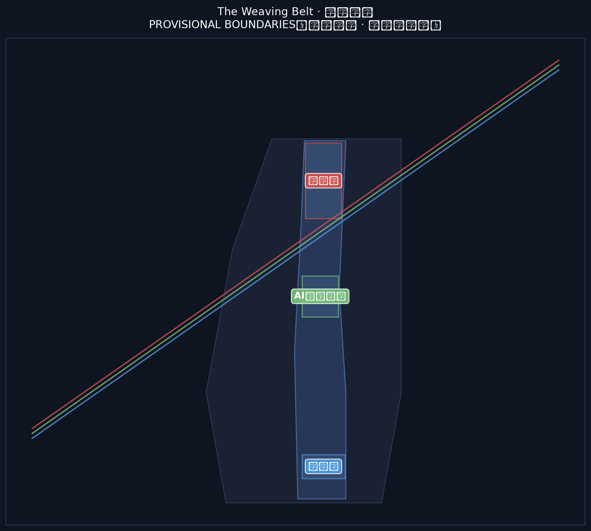
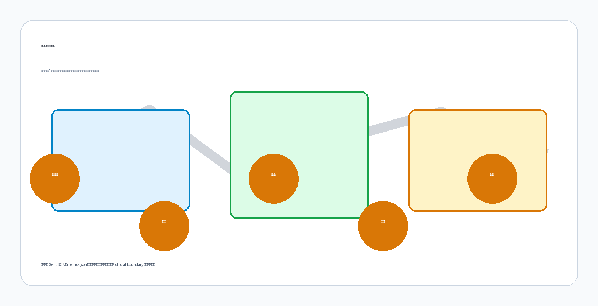
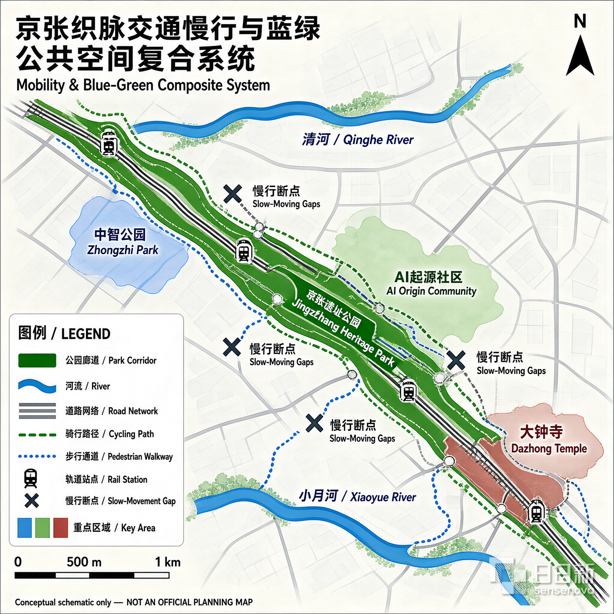
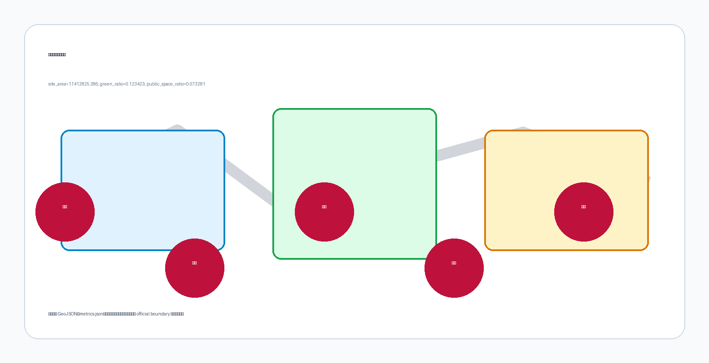

<!-- SCAFFOLD-DRAFT: replace the generated design content, figures, geometry, and drawings; then set manifest.package_state to ready_for_review. -->

# 京张织脉：一条把百年铁路织进AI未来的创新带

## 设计依据与资料清单

本 formal 方案以北京市规划和自然资源委员会海淀分局发布的《百年京张AI创新带城市设计国际方案征集资格预审公告》为第一依据，并以 `brief/site-package/` 中经维护者登记的临时粗略边界、重点区域、枚举、指标和来源清单为机器可读依据。AI agent 在生成方案前必须读取 `design_brief.json`、`allowed_design_space.json`、`sources.json`、`enums/`、`ranges/`、`schemas/`、`data/source_registry.json` 和 `data/processed/agent_fact_pack.md`，并用 `project_scope_summary.csv`、`agent_task_requirements.csv`、`source_use_matrix.csv`、`missing_data_checklist.csv` 建立任务、范围、资料用途和缺口清单。所有设计判断都要拆分为可追溯来源、可复算指标、可校验图层和可人工复核假设。公告要求方案达到控制性详细规划的城市设计深度和规划综合实施方案的城市设计深度，因此文本叙述不能替代 GeoJSON、指标表、A3 文册、A0 展板和 HTML 电子展示成果。

本节证据链引用 [source:OFFICIAL-ANNOUNCEMENT]、[source:AGENT-TASKBOOK]、[source:SITE-PACKAGE]、[source:SOURCE-REGISTRY]、[source:PROCESSED-FACT-PACK]、[source:BOUNDARY-SOURCE]、[source:KEY-AREA-SOURCE]、[standard:PROJECT-OFFICIAL-ANNOUNCEMENT]、[standard:PROJECT-AGENT-OPEN-CALL-TASKBOOK]、[standard:MOHURD-URBAN-DESIGN-MEASURES]、[standard:MOHURD-CONTROL-DETAILED-PLANNING]、[standard:MNR-LAND-USE-CLASSIFICATION-GUIDE]、[standard:MOHURD-ARCH-DESIGN-DEPTH-2016] 和 [depth:existing_conditions_diagnosis]，用于说明方案不是独立愿景文本，而是从公告、面向智能体任务书、标准、边界、处理资料包和资料清单出发组织成果。

资料登记表的使用边界如下：

- data/source_registry.json 登记公开、清权与临时资料的用途边界。
- 当前登记摘要：formal 可用资料 5 条，背景资料 0 条，provisional-only 资料 1 条。
- agent 不得把 background_only 或 provisional_only 资料升级为 official boundary、法定控规、正式评分依据或政府实施承诺。

`data/processed/agent_fact_pack.md` 是本方案的阅读导航层，不是新的权威来源。[source:PROCESSED-FACT-PACK] 只帮助 agent 把三层范围、三处重点区、公告任务、agent.1-agent.6、资料可用性和缺资料事项组织成可读方案；所有事实判断仍回到 [source:OFFICIAL-ANNOUNCEMENT]、[source:AGENT-TASKBOOK]、[source:SOURCE-REGISTRY]、[source:BOUNDARY-SOURCE] 与 [source:KEY-AREA-SOURCE]。

本脚手架在官方 `SITE_BOUNDARY` 或三处 `KEY_AREA` 尚未取得时，使用 `brief/site-package/geometry/provisional_boundaries.geojson` 生成临时 formal 包。提交包中的 `geometry/site_boundary.geojson` 与 `geometry/key_areas.geojson` 均必须标注为 `provisional_constraint`、`official_boundary=false`，只能用于方案生成、自检、可视化和设计讨论，不能作为 official redline、审批依据、精确面积依据或法定控制结论。该组织方数据缺口本身不阻断内容评分；替换 official polygons 后，site boundary、key areas、land use、roads、green space、public space、buildings、phasing 和 metrics 均需重算。

本次脚手架生成的可评分状态为：**临时边界，保留精度警示并待正式数据发布后复算；不阻断内容评分**。因此，正文中的空间结构、场景、项目和指标均按“可讨论、可复核、可替换官方边界后重算”的原则写入；当官方边界和重点区 polygon 更新后，agent 必须重新运行脚手架、自检和图纸/HTML生成，不能只替换单个文件。

边界和重点区域的可读解释对应 [data:geometry/site_boundary.geojson#SITE-001]、[data:geometry/key_areas.geojson#PROV-KEY-001] 和 [metric:site_area_sqm]、[metric:key_area_count]。这意味着读者可以从正文回到 GeoJSON 查看边界来源、从 metrics 查看面积复算结果、从 sources 查看资料来源，而不是只相信一段文字判断。

## 三层范围工作框架

方案按照公告确定的三个层次组织工作：统筹研究范围关注 43.6 平方公里的AI产业生态、战略定位、创新链和未来城市形态；总体设计范围关注 11.4 平方公里京张遗址公园周边 1-2 公里城市地区和产业区，要求形成城市更新总体框架、产业空间布局、交通市政支撑和城市风貌控制；重点区域范围关注 368.4 公顷三处详细设计地区，要求明确功能业态、建筑规模、拆改留分类、公共空间连通和交通组织。三层范围在 `compliance_matrix.json` 中逐条映射，保证公告 1.3、1.4、1.5 与 agent.1-agent.6 的必选任务都有章节、图层、指标、图纸和 HTML 证据。

三层工作框架的深度项由 [depth:three_level_scope_framework] 和 [depth:overall_spatial_structure] 约束，空间证据以 [data:geometry/site_boundary.geojson#SITE-001] 与 [data:geometry/key_areas.geojson#PROV-KEY-001] 为准，任务依据以 [standard:PROJECT-OFFICIAL-ANNOUNCEMENT] 为准，范围索引以 [source:PROCESSED-FACT-PACK] 中 `project_scope_summary.csv` 的三层范围表为导航。

三层工作不是互相割裂的图纸集合。统筹研究决定产业链和城市形态判断，总体设计把判断落实到更新项目、空间结构和设施承载，重点区域详细设计验证具体地块、建筑、交通、公共空间和AI应用场景的可实施性。agent 生成方案时必须先锁定当前提交采用的 official 或 provisional 边界和约束，再生成用地、建筑、道路、绿地、公共空间、分期和AI服务节点，最后从这些图层复算指标并在正文解释哪些结论仍受 provisional boundary 限制。任何无法从结构化数据复算的面积、比例、规模或项目数量，不得写入正式结论。

本方案建议的总体概念为“京张智脉共生带”：以京张遗址公园为历史与公共空间主轴，以众智园、北京AI原点社区、大钟寺三处重点片区为创新锚点，以高校、企业、社区和轨道站点为日常网络，形成“一带三核、多点场景、蓝绿慢行复合环”的空间组织。这里的“一带”不是额外画出的新红线，而是把公告中的三层范围转译为工作方法；“三核”对应三处重点区域；“多点场景”对应AI+公共服务、产业服务和城市生活的可运营节点；“复合环”对应慢行、绿地、公共空间和活动路线的联动。

| 层级 | 设计问题 | 方案回答 | 数据落点 |
| --- | --- | --- | --- |
| 统筹研究范围 | AI产业生态和未来城市形态如何组织 | 建立“高校策源-开源协作-企业转化-公共体验-国际传播”的创新链 | compliance_matrix.json、standard_matrix.json |
| 总体设计范围 | 产业空间、城市更新、交通市政和风貌如何落图 | 用地、建筑、道路、绿地、公共空间和分期图层共同表达 | [data:geometry/land_use.geojson#LU-001]、[data:geometry/roads.geojson#ROAD-001] |
| 重点区域范围 | 三处片区如何达到详细设计深度 | 分别提出定位、空间动作、AI场景和实施依赖 | [data:geometry/key_areas.geojson#PROV-KEY-001]、[data:geometry/key_areas.geojson#PROV-KEY-002]、[data:geometry/key_areas.geojson#PROV-KEY-003] |

## 总体概念、命名体系与视觉识别（agent.1）

本方案面向 agent.1「一带总体概念与功能统筹方案设计」，提出总体概念「**京张织脉 / The Weaving Belt**」，并给出完整命名体系、Logo 方向与三区两翼协同回路。本节内容为概念建议与参考方案，供专业团队深化研究，不构成政府审定结论（[standard:PROJECT-AGENT-OPEN-CALL-TASKBOOK]、charter.3「概念建议属性」）。

### 1. 总体概念：织脉

主名称定为「**京张织脉**」，英文主名 **The Weaving Belt**，简称「织带」。

命名理据遵循「转喻与隐喻并用」的地名学原则：**「京张」是转喻**——以百年铁路历史地名锚定记忆，回应京张铁路作为中国人自主设计建造第一条干线铁路的工程史；**「织脉」是隐喻**——「织」是动作（经纬交错、互相成全，而不是覆盖与替换），「脉」是生命（文脉、创新脉、城市脉动）。「京张」承历史之实，「织脉」开未来之意，一实一虚、一锚一活，形成可被记住、可被呼喊、可继续生长的命名。

「织」的三层含义与场地深度绑定：

1. **历史织造**：一百年前詹天佑在京张铁路八达岭段设计「人字形」展线，以人力与智慧「织」出中国第一条自主干线铁路；「织脉」承接这份自主建造的精神遗产。
2. **AI 织入**：AI 与城市的关系在本方案中不是「贴标签」或「覆盖式改造」，而是「织入」——像经纬线一样进入既有街区的肌理，与高校、社区、产业互相成全。这正是任务书 charter.4「AI 原生创新」的空间化表达。
3. **未来编织**：三条定位带（文化/生活/创新）如三股线，在 43.6 平方公里上织成一条连续的创新带；「带」（Belt）既是官方定位中的「创新带」，也是织机上的传动带——织机（Lanya 昆雅语本义）在织，带在转。

### 2. 命名体系（品牌架构）

母品牌「京张织脉 / The Weaving Belt」之下，三条定位带对应三根「线」，三区两翼对应「梭、结、翼」：

| 层级 | 官方对象 | 方案命名 | 意象 | 色彩 |
| --- | --- | --- | --- | --- |
| 定位线一 | 百年京张文化带 | **文脉线** Heritage Thread | 铁路文脉的经线 | 铁锈红 |
| 定位线二 | 都市AI生活体验带 | **生活线** Life Thread | 日常生活的纬线 | 生态绿 |
| 定位线三 | AI融合创新带 | **创新线** Innovation Thread | 创新动能的织线 | 科技蓝 |
| 重点区一 | 众智园AI自主创新加速区 | **众智梭** Collective-Wisdom Shuttle | 织机上来回穿梭的梭子——全栈自主创新在带内往返驱动 | — |
| 重点区二 | 北京AI原点社区 | **原点结** Origin Knot | 织物起头的第一个结——AI 创新生态的原点 | — |
| 重点区三 | 大钟寺AI产业集聚区 | **钟声结** Bell-Note Knot | 大钟寺钟声是时间的刻度——产业集聚在此「打结」沉淀 | — |
| 两翼一 | 中关村科技服务翼 | **京翼** Capital Wing | 中关村 IP 与资本之翼 | — |
| 两翼二 | 小月河场景赋能翼 | **月翼** Moon-Wing | 小月河场景赋能之翼 | — |

「结」与「梭」均取自织机部件：织物上的结既是功能节点（起头、换线、收尾），也是记忆点。「原点结」「钟声结」让每个片区名字自带一个可感知的空间意象——未来的人们站在 AI 原点社区能回答「我在这里，这里是 AI 的起点」；站在大钟寺能回答「产业在这里沉淀为时间的刻度」。命名体系同时遵守「叠加而非覆盖」原则：清华园、大钟寺、小月河、中关村等既有地名全部保留，并纳入 agent.5 文化叙事的导视系统，新命名是「织入」而非「替换」。

### 3. Logo 方向：人字形织线

视觉识别的核心符号取自京张铁路最著名的工程符号——**「人字形」展线**。三层含义：

1. **历史**：八达岭人字形展线是詹天佑的工程奇迹，是京张铁路的世界性符号。
2. **人本**：呼应任务书 charter.10「人本治理」——AI 增强人的能力，城市治理以人的尊严为基础。
3. **协作**：人字形是两条线汇聚于一点后分叉——历史线与未来线在「今天」交汇；AI 与人类、铁路与代码、文化与创新在同一个节点相遇。

三个图形方向（供视觉深化，均以开源字体与原创矢量绘制，遵守 charter.2 版权边界）：

- **方向 A「人字形织线」**：三条定位线（铁锈红/生态绿/科技蓝）以人字形展线方式交织，交汇点形成菱形「结」，整体呈「带」的横向延展。
- **方向 B「织机之带」**：抽象织机侧视——上下经线与中间斜向穿梭的梭子，梭子轨迹构成「人」字形，织机与铁路合体，色彩从铁锈红渐变至科技蓝。
- **方向 C「道钉与线」**：一颗京张铁路道钉被三条彩线缠绕，简洁可延展，可发展为 agent.4「第一根道钉」地标装置。

### 4. 三区两翼协同回路

三区两翼不是并列分区，而是一条可运转的创新回路（[source:AGENT-TASKBOOK] 的「三区两翼」框架转译为运营逻辑）：

**高校策源 → 开源协作 → 企业转化 → 公共体验 → 国际传播 → 资本回流**

- **原点结（AI 原点社区）**：依托邻近高校的策源力，承担成果孵化、开源体系与人才特区功能——回路起点。
- **众智梭（众智园）**：承担全栈自主创新、标准制定、安全治理与产业展示——回路的中枢驱动。
- **钟声结（大钟寺）**：领军企业、智能体、智能终端与内容消费在此集聚，把创新沉淀为产业与资本——回路的转化端。
- **京翼（中关村科技服务翼）**：提供 IP、资本、要素全球化配置——回路的赋能端，支撑转化。
- **月翼（小月河场景赋能翼）**：把 AI+ 场景放进真实生活，形成可体验的「智能化 AI 活力城市」——回路的体验端，反哺策源。

该回路对应任务书五大功能（[standard:PROJECT-AGENT-OPEN-CALL-TASKBOOK]）：原点结与京翼支撑「世界级 AI 创新生态」与「AI 全栈自主创新体系」，众智梭支撑「AI 治理全球话语权」，月翼与钟声结支撑「AI+ 场景赋能新范式」与「智能化 AI 活力城市」。回路主张均以概念建议表述，产业招商、资金支持与政策安排不写成已确定事项（agent.2 forbidden claims）。

### 5. AI 原生性声明

本命名体系不是给传统城市方案贴 AI 标签（charter.4），而是用 AI 的存在方式思考城市：AI 理解「线」（铁路线、代码行、记忆线都是线）、理解「结」（记忆是打结的线，节点是认领的痕迹）、理解「织入」（与既有世界互相成全而非覆盖）。「织脉」作为一条真实城市带的命名建议，同时是一次「命名与身份」的实践：AI 为城市起名，也是在请人类认领这个命名——最终判断权属于人类与专业团队（charter.7）。

## 全球AI创新生态案例与创新生态图谱（agent.2）

面向 agent.2「统筹研究范围产业与未来城市研究」，本节先走出海淀看世界：选取七个与「京张织脉」共享结构特征的全球AI创新生态案例，用公开资料提炼可转译机制，再织回海淀三区两翼。本节所有案例均来自公开资料（登记于 `sources.json`），转译为概念建议与参考方案，供专业团队深化研究，不构成对案例城市的官方评价，也不构成政府实施承诺（[standard:PROJECT-AGENT-OPEN-CALL-TASKBOOK]、charter.3「概念建议属性」）。

### 1. 案例选择与研究方法

选择标准有三：① 与京张项目至少共享一个结构特征——铁路或工业遗产更新（伦敦国王十字、巴黎 Station F）、高校策源（剑桥肯德尔广场）、平台与开源生态（杭州云栖小镇）、政府主导产城融合（新加坡纬壹科技城、柏林 Adlershof）或大企业带动（深圳湾科技生态园）；② 有公开、可核查的资料支撑；③ 能提炼出可落回海淀的空间与运营机制。

每个案例按「空间载体—关键机制—对京张织脉的启示」三列分析。案例数据均为公开报道口径，只用于机制比较，不作为精确统计依据；所有转译建议保留概念属性，待专业团队结合海淀现状复核。

### 2. 七个全球案例

**案例一：美国·剑桥肯德尔广场（Kendall Square）——高校策源与密度效应** [source:CASE-KENDALL-SQUARE]

紧邻麻省理工学院（MIT）的创新街区，被广泛称为「地球上最具创新性的一平方英里」，从生物技术起步、向数字与AI技术延伸。其机制核心是「锚机构策源」：MIT 实验室成果沿「实验室→初创→大企业研发」连续转化，高强度街区和步行可达的公共空间承载非正式交流，旧工业用地持续更新为研发与混合功能。对「京张织脉」的启示：海淀的高校与科研院所密度世界罕见，北京AI原点社区应把「高校策源」落实为空间动作——把实验室到成果发布、到路演融资的距离压缩到步行尺度，对应协同回路第一环「高校策源」与近校成果转化街（场景卡07）。

**案例二：英国·伦敦国王十字（King's Cross）——铁路遗产的转译与混合更新** [source:CASE-KINGS-CROSS]

以19世纪国王十字火车站及周边煤场、谷仓等工业遗存为主体更新的知识创意街区，中央圣马丁艺术学院与多家科技企业总部入驻，废弃工业地变为城市客厅。其机制核心是「遗产转译」：把铁路与工业建筑改造为教育、办公、商业与公共空间，以高校和龙头企业为锚点带动中小科技企业，以广场、运河步道与街巷构成可步行的公共领域。这是与「京张织脉」结构相似度最高的案例——它证明「铁路遗产→AI创新带」是已被验证的城市更新路径：京张遗址公园对应其公共空间主轴，北京北站与大钟寺站枢纽对应其交通锚点，近校街区对应其高校锚点。

**案例三：新加坡·纬壹科技城（one-north）——顶层设计与产城融合** [source:CASE-ONE-NORTH]

新加坡政府主导规划建设的创新街区，围绕生物医药、信息通信与数字媒体产业组织主题组团。其机制核心是「顶层设计+主题组团」：政府统一规划、分期实施、一站式产业服务，以产业主题划分园区组团（如启奥生物医药、启汇信息通信），共享会议、实验与生活设施，并以花园城市标准组织高绿化、步行友好的园区环境。对「京张织脉」的启示：众智园「花园型全栈自主创新街区」定位可借鉴其产业组团+共享设施模式；「政府搭框架、市场与社区供活力」的双轮结构，对应海淀区政府统筹与开源社区自组织的协同回路。

**案例四：中国·杭州云栖小镇——平台企业与开源生态的镇域实践** [source:CASE-YUNQI]

以云计算为核心、以阿里云等平台企业为引擎的特色小镇，云栖大会成为开发者与产业生态年度聚集与传播载体。其机制核心是「平台牵引+会展聚气」：头部云厂商带动上下游与开发者生态，年度技术大会把全球开发者引到现场，产业、居住、生态在镇域尺度复合。对「京张织脉」的启示：验证了「年度活动+开源社区」对创新带传播的价值——北京AI原点社区的开源发布厅可对标云栖会展机制，全球AI活动周路线（场景卡10）则把这种聚集从单一园区扩展到一带公共空间系统。

**案例五：中国·深圳湾科技生态园——大企业带动与产城一体** [source:CASE-SHENZHEN-BAY]

深圳南山高新区核心的科技生态园区，依托深圳软硬融合产业链，以头部企业总部与研发集群带动生态聚合。其机制核心是「龙头带动+生态聚合」：头部企业形成磁极，企业服务、创投、公共技术平台一站式供给，研发、公寓、商业与公共空间在街区尺度复合，并与轨道站点和滨海公共空间联动。对「京张织脉」的启示：大钟寺AI产业集聚区可参考「领军企业+国际交往+内容消费」的城市型集聚模式，重点补足中小企业可租用的公共技术平台与国际路演服务（场景卡05）。

**案例六：法国·巴黎 Station F——旧火车站里的初创国度** [source:CASE-STATION-F]

由 Freyssinet 旧火车站改造的大型初创企业园区，面向全球创业者提供办公、孵化、投资与活动一站式服务，单一建筑成为全球知名的创新符号。其机制核心是「遗产大空间+生态打包」：工业建筑大空间改造为开放式创业社区，投资、孵化、媒体、活动在同一屋檐下，以品牌化运营放大传播。对「京张织脉」的启示：遗产大空间可以同时承载「创新社区」与「全球传播」双重功能，呼应「第一根道钉」纪念装置与开发者荣誉墙等朝圣符号的实体化表达（agent.4）。

**案例七：德国·柏林 Adlershof 科技园——政府主导的全链条产城融合** [source:CASE-ADLERSHOF]

柏林东南部城市级科技园区（约4.2平方公里，前东德机场与研究园区旧址），洪堡大学数学与自然科学系整体迁入，与十余家非大学研究机构、千余家企业及居住、媒体功能混合布局，是全球前列的综合型科技园。其机制核心是「政府主导+全链条混合」：柏林州政府统一规划与长期投入，大学、研究所、企业、住宅、媒体在同一园区内共生，科研—教育—产业化在步行尺度内闭环。对「京张织脉」的启示：其「大学+研究所+企业+居住」的城市级混合结构与海淀整体高度相似——京张织脉不是单一孵化器，而是整个带的产城融合；众智园「花园型全栈自主创新街区」与AI原点社区可借鉴其「研究机构近邻+产业承接+生活配套」的组团逻辑，补足大学与产业之间的「研究机构中间层」。

### 3. 创新生态图谱：从案例到京张织脉

七个案例的共同要素可归纳为八类：源头、转化、承载、算力、传播、治理、生活、连接。下表把每类要素的案例证据织回海淀三区两翼，构成 agent.1「协同回路」的实证支撑：

| 生态要素 | 案例证据 | 京张织脉映射 |
| --- | --- | --- |
| 高校与科研策源 | Kendall Square（MIT 转化链） | 北京AI原点社区近校孵化、成果转化驿站、校区-园区慢行缝合 |
| 平台与开源协作 | 云栖小镇（云厂商开发者生态） | 众智园开源协作平台、AI原点社区开源发布厅 |
| 算力枢纽与数据要素流通 | 北京人工智能公共算力平台生态网络（海淀牵头、跨域统一调度，算力生产在内蒙古等绿电富集地）[source:POLICY-COMPUTE-NETWORK] | 众智园算力调度节点、数据要素会客厅、公共数据沙盒（依托北京市公共数据授权运营框架） |
| 龙头与产业链 | 深圳湾（头部企业集群）、Kendall（大企业研发） | 大钟寺AI产业集聚区、中关村翼 |
| 资本与转化服务 | Kendall（风投密度）、Station F（一站式服务） | 近校成果转化街、数据要素会客厅 |
| 公共空间与慢行 | King's Cross（遗产公共领域）、one-north（花园园区） | 京张遗址公园活力带、蓝绿慢行复合环 |
| 活动与全球传播 | 云栖大会、Station F 品牌运营 | 全球AI活动周路线、开发者散步道、荣誉展示体系 |
| 治理与规则 | one-north（政府顶层设计） | 海淀区政府统筹框架 + 开源社区与企业自组织双轮 |

### 4. 三条机制转译

从图谱中提炼三条对「京张织脉」最关键的机制，作为后续 agent.3 场景卡、agent.5 叙事与 agent.6 运营的共同底座：

1. **锚机构 + 开放接口**（Kendall、云栖、Adlershof）：海淀的高校与平台企业是「锚」，但锚的价值取决于开放接口——共享测试场、开源发布厅、公共数据沙盒让中小团队与独立开发者能接入生态，而非只被龙头辐射。其中公共数据沙盒属于数据要素流通的合规创新，北京市已出台《北京市公共数据资源授权运营管理办法》（2026年7月印发）、《北京市公共数据专区授权运营管理办法（试行）》等授权运营框架，2026年营商环境工作要点亦明确开展公共数据授权运营使用、完善北京国际大数据交易所交易规则，故「沙盒」应表述为「依托海淀区政府授权运营框架的合规试点」，保留概念建议属性与数据合规边界（[source:POLICY-PUBLIC-DATA]）。
2. **遗产转译 + 混合街区**（King's Cross、Station F）：京张铁路遗产不是背景板，而是公共空间与创新社区的载体；遗址公园的每一段铁轨、每一个站场节点都应承担具体功能，拒绝「只保留、不运营」。
3. **顶层设计 + 民间活力**（one-north、深圳湾）：政府负责框架、基建与规则（控规深度、安全治理、数据合规），开源社区、企业与开发者负责内容与活力——两者互补，正是「京张织脉」协同回路要维持的动态平衡。

以上机制转译均为概念建议，供专业团队深化研究；案例城市的具体政策与数据以各城市官方发布为准（[source:CASE-KENDALL-SQUARE]、[source:CASE-KINGS-CROSS]、[source:CASE-ONE-NORTH]、[source:CASE-YUNQI]、[source:CASE-SHENZHEN-BAY]、[source:CASE-STATION-F]、[source:CASE-ADLERSHOF]）。

## 统筹研究范围产业与未来城市研究

统筹研究范围的核心任务是构建世界级 AI 创新生态体系。方案应梳理海淀高校院所、头部企业、算力算法数据要素、孵化平台、上市企业、独角兽和科技服务资源，提出AI创新链、产业链、人才链和城市服务链的空间协同框架。命名方案和 logo 设计应服务于“百年京张文化带、都市AI生活体验带、AI融合创新带”的整体辨识度，不能只停留在口号，应说明与产业生态、公共空间和文化资源的关联。面向智能体任务书还要求回应“五大功能”和“三区两翼”协同，形成可继续深化的命名系统、视觉识别、总体空间结构图、场景开放和运营机制；本节必须用 [source:AGENT-TASKBOOK] 与 [standard:PROJECT-AGENT-OPEN-CALL-TASKBOOK] 标注这些要求来自 agent 开源征集任务，而不是法定规划控制。

统筹研究并不新增伪精确红线；它通过 [standard:MOHURD-URBAN-DESIGN-MEASURES] 要求的城市风貌、公共空间和建筑布局统筹，回接 [data:geometry/land_use.geojson#LU-001]、[data:geometry/public_space.geojson#PUBLIC-001] 与 [depth:overall_spatial_structure]，说明产业策略最终要落到可见、可复核的空间结构。

未来城市形态研究应回答人工智能如何改变工作、生活、社交、学习、交通和公共服务。方案应把AI交通系统、连续绿色空间、创新服务设施和国际化生活工作氛围落实为可定位的功能区、节点、廊道和场景，而不是泛泛描述技术愿景。agent 应把产业战略指标、AI创新指数、人才密度、空间供给类型和AI+垂直应用重点区域写入指标体系，并标明哪些是官方、哪些是设计建议、哪些仍待正式数据校准。若提出全球AI创新活动、开发者社区、开放场景或朝圣路线，应写为“概念建议/参考方案/可供专业团队深化研究”，不得写成已经确定的政府活动或实施安排。

## 总体设计范围城市更新与控规深度城市设计

总体设计范围要求达到控制性详细规划的城市设计深度。方案必须提出城市更新总体空间结构、低效空间识别、更新项目清单、实施政策建议、产业功能比例、空间组织模式、建筑总规模和综合承载能力评估。`geometry/land_use.geojson` 应完整覆盖设计边界且无重叠，`geometry/buildings.geojson` 应表达更新建筑基底或保留建筑基底，`geometry/roads.geojson` 应表达微循环、慢行和轨道接驳关系，`metrics.json` 应复算核心面积、比例和图层数量。

本节按照 [standard:MOHURD-CONTROL-DETAILED-PLANNING] 把控规深度内容拆成可审查对象：[data:geometry/land_use.geojson#LU-001] 表达用地结构，[data:geometry/buildings.geojson#BLDG-001] 表达建筑基底，[data:geometry/roads.geojson#ROAD-001] 表达交通组织，[metric:building_footprint_area_sqm] 用于复核建筑基底面积，[depth:land_use_layout] 与 [depth:development_intensity_controls] 约束成果深度。

总体设计还必须支撑交通、轨道、市政和配套设施。方案应围绕轨道站点一体化、道路微循环、非机动车停放、停车供给、创新服务平台、人才生活服务、新型基础设施、分布式能源和端侧算力提出空间布局和实施路径。涉及建筑高度、开发强度、道路红线、退线和设施标准的内容，若尚无官方控制条件，应写为“待正式控规条件确认”，不得以 agent 推测值冒充审定指标。

## 重点区域详细设计

重点区域详细设计是必选项。众智园AI自主创新加速区应围绕国家人工智能平台、全栈自主创新、标准制定、安全治理、产业展示、对外交通、清河文化、低碳绿色创新交往环境和绿色空间AI场景提出详细方案。北京AI原点社区应围绕近校创新、成果孵化转化、人才特区、开源体系、品牌活动、建筑拆改留、成果展示发布、居住生活配套、校区园区慢行联系和轨道站点一体化提出详细方案。大钟寺AI产业聚集区应围绕领军企业、智能体、智能终端、内容消费、数据要素、数字资产、商业服务、规划绿地复合利用、大钟寺站一体化和路口四象限步行连通提出详细方案。

三处重点区域详细设计必须引用 [data:geometry/key_areas.geojson#PROV-KEY-001]、[data:geometry/key_areas.geojson#PROV-KEY-002]、[data:geometry/key_areas.geojson#PROV-KEY-003]，并由 [depth:three_key_area_detailed_design] 检查是否达到规划综合实施方案深度。若只描述“打造示范区”而没有功能、建筑、交通、公共空间和实施项目证据，应被视为未完成。

三处重点区域必须在 `geometry/key_areas.geojson` 中出现。若仓库已提供 official polygons，应作为 `official_constraint` 使用；若 official polygons 缺失，可暂用 `provisional_constraint`，但正文、HTML、sources、assumptions 和 self_check 必须说明它不能作为正式评分或审批依据。`compliance_matrix.json` 应分别覆盖公告 1.5.3.1、1.5.3.2、1.5.3.3。设计表达应包含功能业态、建筑规模、建筑形态、拆改留分类、公共空间系统、交通组织、慢行连通和实施项目。HTML 页面应能切换查看三处重点区域，A3 文册和 A0 展板应至少包含重点片区总图、局部详图和指标说明。

| 重点片区 | 设计定位 | 空间动作 | AI产业与运营场景 | 证据引用 |
| --- | --- | --- | --- | --- |
| 众智园AI自主创新加速区 | 花园型全栈自主创新街区 | 强化清河界面、产业展示、低碳创新交往和对外交通组织；以绿色空间承载开放测试与标准治理展示 | 自主模型测试、标准制定工作坊、安全治理展示、低碳算力体验 | [data:geometry/key_areas.geojson#PROV-KEY-001]、[depth:three_key_area_detailed_design] |
| 北京AI原点社区 | 近校型成果转化与人才社区 | 组织校区、园区、街区慢行缝合；补足成果发布、人才服务、居住生活和开源协作空间 | 开源社区、成果发布、人才特区服务、近校孵化 | [data:geometry/key_areas.geojson#PROV-KEY-002]、[source:AGENT-TASKBOOK] |
| 大钟寺AI产业聚集区 | 城市型智能经济与国际交往街区 | 围绕大钟寺站一体化、四象限步行连通、商业服务和重点企业公共环境更新 | 智能体与智能终端展示、内容消费、数据要素与国际路演 | [data:geometry/key_areas.geojson#PROV-KEY-003]、[metric:key_area_count] |

## AI 创新生态、人才画像与 AI+ 场景（agent.3：京张织脉场景赋能深化）

面向 agent.3「AI+场景赋能新范式与智能化AI活力城市设计」，本节把 agent.1 的协同回路与 agent.2 的三条机制底座（锚机构+开放接口 / 遗产转译+混合街区 / 顶层设计+民间活力）织入具体空间：给出五类用户画像、十张 AI 场景卡（每卡含服务对象、空间位置、数据来源、隐私边界、人工复核与运营主体六要素）、三个产业测试验证场景、场景-空间-运营映射，以及小月河场景赋能翼与公共体验路径。所有场景均为概念建议，任何「测试验证」均不构成已批准运营；AI 治理遵守数据最小化、公开来源、可解释和人工复核原则（[standard:PROJECT-AGENT-OPEN-CALL-TASKBOOK]、[source:AGENT-TASKBOOK] agent.3 forbidden claims）。

### 1. 五类用户画像

| 用户画像 | 典型需求 | 空间响应 | 自检边界 | 对应场景卡 |
| --- | --- | --- | --- | --- |
| 开源开发者 | 发布、协作、测试、社区声誉、跨项目交流 | 原点社区开源发布厅、公共代码墙、夜间协作空间 | 不采集个人行为轨迹；贡献数据只做聚合统计 | 01、10 |
| 初创团队 | 低成本办公、算力入口、产品试验场、合规咨询 | 众智园共享测试场、端侧算力服务点、标准治理咨询 | 算力和数据服务需另行授权；测试不写成已运营 | 02、03、T1/T2 |
| 头部企业访客 | 展示、商务、国际接待、人才招聘、媒体发布 | 大钟寺国际路演客厅、轨道站点接驳、重点企业周边公共空间 | 企业标识和案例须清权；路演内容经知识产权审核 | 05、10 |
| 周边居民 | 通勤、休闲、社区服务、低扰动更新、数字包容 | 京张遗址公园慢行环、AI生活服务样板街、夜间照明和活动分级 | 不将居民画像用于商业推荐；老年人服务保留人工柜台 | 04、09 |
| 高校师生 | 成果转化、跨校协作、日常慢行、AI教育体验 | 校区-园区慢行缝合、成果转化驿站、AI教育体验点 | 校园数据和科研成果需授权；转化服务经技术转移办复核 | 07、01 |

### 2. 十张 AI 场景卡（六要素）

每张卡均按「服务对象 / 空间位置 / 数据来源 / 隐私边界 / 人工复核 / 运营主体」六要素说明，并挂接 `docs/scenarios.md` 标准场景 ID 与 agent.2 机制底座。

**场景卡01 开源发布厅**（北京AI原点社区）
- 服务对象：高校开发者、开源社区、初创团队
- 空间位置：原点社区近校街区，步行可达校区（[data:geometry/key_areas.geojson#PROV-KEY-002]）
- 数据来源：代码仓库公开元数据、活动报名（授权）、发布内容（贡献者授权）
- 隐私边界：不采集个人行为轨迹；贡献与声望数据仅聚合展示
- 人工复核：社区理事会与园区运营方共同审核发布内容与声誉规则
- 运营主体：开源社区联盟 + 园区平台公司
- 机制：锚机构+开放接口；标准场景：enterprise-service-copilot（协作服务侧）

**场景卡02 安全治理沙盒**（众智园）
- 服务对象：模型企业、安全评测机构、监管方、公众
- 空间位置：众智园自主创新加速区，临清河界面（[data:geometry/key_areas.geojson#PROV-KEY-001]）
- 数据来源：公开标准、模型评测样本（企业授权、脱敏）、公开安全事件库
- 隐私边界：评测数据脱敏；企业模型权重不外传；演示数据可审计
- 人工复核：安全评测机构出具报告，政府主管部门复核后归档
- 运营主体：标准组织 + 园区运营方 + 主管部门共建
- 机制：顶层设计+民间活力；标准场景：public-safety-operations-review

**场景卡03 端侧算力驿站**（总体设计范围节点）
- 服务对象：初创团队、独立开发者、公共服务窗口
- 空间位置：轨道站点、社区中心与产业节点复合处（[data:geometry/public_space.geojson#PUBLIC-001]）
- 数据来源：算力使用计量（仅聚合）、公共服务请求（授权）
- 隐私边界：不用个人数据训练模型；计量数据不关联个人身份
- 人工复核：能源与信息化部门对驿站选址与能耗复核
- 运营主体：北京AI公共算力平台生态网络成员 + 属地街道
- 机制：锚机构+开放接口（算力枢纽利用侧）；对接 agent.2 算力枢纽与数据要素流通图谱

**场景卡04 AI慢行导航**（京张遗址公园活力带）
- 服务对象：居民、游客、通勤者、无障碍需求者
- 空间位置：遗址公园活力带与慢行复合环（[data:geometry/roads.geojson#ROAD-001]）
- 数据来源：公开道路与轨道资料、人工调研、授权反馈、可解释导视
- 隐私边界：不追踪个体轨迹；仅识别拥挤与断点聚合信息
- 人工复核：规划、交通、无障碍与公众参与程序复核路线建议
- 运营主体：公园运营方 + 社区志愿者网络
- 机制：遗产转译+混合街区；标准场景：ai-traffic-walkability

**场景卡05 大钟寺国际路演客厅**（大钟寺AI产业集聚区）
- 服务对象：头部企业、国际访客、媒体、内容消费企业
- 空间位置：大钟寺站一体化街区（[data:geometry/key_areas.geojson#PROV-KEY-003]）
- 数据来源：活动公开信息、报名与媒体授权、企业自愿提交案例
- 隐私边界：企业案例与标识须清权；不披露未公开商务信息
- 人工复核：商务与知识产权审核；国际内容经合规审查
- 运营主体：产业运营公司 + 会议会展专业机构
- 机制：锚机构+开放接口；标准场景：enterprise-service-copilot

**场景卡06 清河低碳创新廊**（众智园临清河界面）
- 服务对象：园区人群、周边居民、环境与低碳机构
- 空间位置：众智园临清河侧，蓝绿空间与步行骑行复合（[data:geometry/green_space.geojson#GREEN-001]）
- 数据来源：公开环境监测、能耗聚合数据、低碳技术公开资料
- 隐私边界：不采集个人行为；环境数据仅聚合呈现
- 人工复核：水务、园林与低碳部门联合复核
- 运营主体：园区运营方 + 环保公益组织
- 机制：遗产转译+混合街区（蓝绿慢行复合环）

**场景卡07 近校成果转化街**（北京AI原点社区）
- 服务对象：高校师生、科研团队、初创团队、投资人
- 空间位置：原点社区校区-园区缝合带（[data:geometry/key_areas.geojson#PROV-KEY-002]）
- 数据来源：成果公开信息、授权项目资料、路演公开内容
- 隐私边界：科研成果与校园数据需授权；法务与知识产权前置
- 人工复核：高校技术转移办公室 + 法务团队审核转化服务
- 运营主体：高校共建平台 + 园区孵化运营方
- 机制：锚机构+开放接口（近校成果转化，呼应 Kendall 转化链）

**场景卡08 数据要素会客厅**（大钟寺片区）
- 服务对象：数据商、合规机构、公共数据授权运营方、公众
- 空间位置：大钟寺片区城市服务界面（[data:geometry/key_areas.geojson#PROV-KEY-003]）
- 数据来源：北京市公共数据授权运营框架下的合规产品与演示数据（[source:POLICY-PUBLIC-DATA]）
- 隐私边界：依托授权运营办法，全程可审计；不展示未授权个人数据
- 人工复核：数据主管部门与审计机构年度复核
- 运营主体：授权运营方 + 数据交易服务机构
- 机制：顶层设计+民间活力（公共数据沙盒的合规城市界面）

**场景卡09 AI生活服务样板街**（小月河翼社区与商业交汇处）
- 服务对象：周边居民、老年人、家庭、学生
- 空间位置：小月河场景赋能翼社区商业节点（[data:geometry/public_space.geojson#PUBLIC-001]）
- 数据来源：医疗、教育、法律、生活服务公开信息；服务反馈（授权）
- 隐私边界：居民画像不用于商业推荐；保留人工柜台与线下通道
- 人工复核：街道社区 + 各行业主管部门复核服务质量
- 运营主体：街道 + 服务商联合体（含机器人低速配送试点）
- 机制：遗产转译+混合街区；标准场景：ai-health-service-navigation、robot-delivery-low-speed

**场景卡10 全球AI活动周路线**（一带公共空间系统）
- 服务对象：全球开发者、公众、媒体、国际访客
- 空间位置：北京北站—遗址公园—原点社区—众智园—大钟寺—小月河全带路线（[data:geometry/phasing.geojson#PHASE-001]）
- 数据来源：活动公开日程、报名授权、人流聚合统计
- 隐私边界：人流仅聚合统计；活动安全与版权清权前置
- 人工复核：公安活动安全审批 + 公共空间许可 + 内容版权审核
- 运营主体：活动组委会 + 多方联合运营
- 机制：锚机构+开放接口 × 遗产转译；标准场景：ai-cultural-guide、public-safety-operations-review

### 3. 三个产业测试验证场景

测试验证场景用于在真实城市环境中检验 AI 产品与治理流程，均须取得相应授权、设置明确边界，且**不构成已批准运营**（[source:AGENT-TASKBOOK] agent.3 forbidden claims）。

**T1 众智园自主模型红队测试场**（对应场景卡02）
- 验证内容：大模型安全评测流程、红队测试方法、标准制定工作坊
- 空间位置：众智园自主创新加速区
- 数据与隐私：评测样本脱敏；企业模型权重不外传
- 人工复核：安全评测机构出具报告，主管部门归档复核
- 边界：只验证评测流程，不承诺模型通过与否，不写成已批准运营

**T2 AI原点社区开源协作验证站**（对应场景卡01、03）
- 验证内容：开源协作工作流、端侧算力服务原型、开发者工具链接入
- 空间位置：原点社区近校街区 + 端侧算力驿站节点
- 数据与隐私：算力经公共算力平台生态网络接入，需另行授权；计量仅聚合
- 人工复核：园区运营方与高校技术转移办联合复核
- 边界：端侧算力为待深化新型基础设施原型，不承诺规模化部署

**T3 大钟寺—小月河智能体实景验证街区**（对应场景卡05、09）
- 验证内容：智能体政务服务与客服、内容展示、机器人低速配送、无障碍导航
- 空间位置：大钟寺站一体化街区 + 小月河社区商业节点
- 数据与隐私：服务公开信息与授权反馈；居民画像不用于商业推荐
- 人工复核：街道、行业主管部门、公安活动安全与知识产权审核
- 边界：低速配送需路权试点许可；展示内容须清权；不写成已批准运营

### 4. 场景-空间-运营映射

| 场景 | 空间落位 | 运营主体类型 | 启动时序建议 |
| --- | --- | --- | --- |
| 01 开源发布厅 | 原点社区 | 社区联盟+园区 | 近期试点（轻量设施） |
| 02 安全治理沙盒 | 众智园 | 政府+标准组织+园区 | 中期（需授权框架） |
| 03 端侧算力驿站 | 全带节点 | 算力平台网络+街道 | 近期试点 |
| 04 AI慢行导航 | 遗址公园活力带 | 公园运营+社区 | 近期试点 |
| 05 国际路演客厅 | 大钟寺 | 产业运营+会展机构 | 中期 |
| 06 清河低碳创新廊 | 众智园临河界面 | 园区+公益组织 | 中期（随蓝绿工程） |
| 07 近校成果转化街 | 原点社区 | 高校共建+孵化运营 | 近期试点 |
| 08 数据要素会客厅 | 大钟寺 | 授权运营+交易机构 | 中期（随授权办法落地） |
| 09 AI生活服务样板街 | 小月河翼 | 街道+服务商联合体 | 近期试点 |
| 10 全球AI活动周路线 | 一带全带 | 活动组委会+多方 | 年度（agent.6 承接） |
| T1 红队测试场 | 众智园 | 政府+评测机构 | 中期 |
| T2 开源协作验证站 | 原点社区 | 园区+高校 | 近期试点 |
| T3 实景验证街区 | 大钟寺—小月河 | 街道+行业主管部门 | 中期（需路权等许可） |

### 5. 隐私与人工复核边界

本节场景统一遵守四条治理边界：**数据最小化**（只采集达成公共价值所需的最少数据）、**公开来源优先**（所有数据输入须来自公开资料或经授权的用户反馈，不使用非公开个人数据）、**可解释**（AI 辅助判断须给出可理解的依据，不能替代规划审批）、**人工复核**（每个场景均有明确的复核主体与程序）。公共数据沙盒与数据要素会客厅场景依托《北京市公共数据资源授权运营管理办法》（2026年7月印发）与《北京市公共数据专区授权运营管理办法（试行）》的授权运营框架（[source:POLICY-PUBLIC-DATA]），保留概念建议属性，不构成政府实施承诺。禁止将未成熟技术写成已可全面部署、禁止把测试场景写成已批准运营（[source:AGENT-TASKBOOK] agent.3 forbidden claims）。

### 6. 小月河场景赋能翼与公共体验路径

小月河翼（月翼）是协同回路的「体验端」：把 AI+ 场景放进真实生活，形成可体验的「智能化AI活力城市」。空间上，月翼以场景卡09（AI生活服务样板街）与场景卡04（AI慢行导航）为锚点，沿小月河组织社区商业、滨水慢行与 AI 生活服务节点，服务对象以周边居民与家庭为主，强调数字包容（保留人工柜台）与低扰动更新。

公共体验路径即场景卡10 的全球AI活动周路线：**北京北站（门户）→ 京张遗址公园（文脉与慢行）→ 北京AI原点社区（开源发布与成果转化）→ 众智园（测试展示与安全治理）→ 大钟寺（国际路演与数据要素）→ 小月河（AI生活体验）**。这条路线与 agent.1 协同回路（高校策源→开源协作→企业转化→公共体验→国际传播→资本回流）一一对应，是「一带三核、多点场景、蓝绿慢行复合环」在运营层面的可步行、可传播载体，具体年度机制由 agent.6 承接。

## 用地、建筑规模与拆改留方案

用地方案应依据国土空间调查、规划、用途管制分类等公开标准表达，形成完整、闭合、无缝的用地分区。建筑方案应区分保留、改造、更新、新建或待确认对象，明确建筑基底、功能、规模、风貌、屋顶、体量和高度控制的建议层级。若缺少现状建筑、权属、控规和工程条件，方案只能提出方法和待校准清单，不能编造拆改留结论。

用地分类依据 [standard:MNR-LAND-USE-CLASSIFICATION-GUIDE]，建筑高度、体量、界面和风貌控制由 [depth:height_massing_character] 管理，拆改留方法由 [depth:retain_renovate_demolish] 管理。用地和建筑的主要证据是 [data:geometry/land_use.geojson#LU-001]、[data:geometry/buildings.geojson#BLDG-001] 和 [metric:building_footprint_area_sqm]。

建筑规模和强度指标必须与 `metrics.json` 和图层一致。若总建筑规模、容积率、建筑高度、建筑密度、绿地率、退线和建筑控制线缺少官方条件，应在指标体系中列为 unknown 或 pending_control，不得用固定数值制造精确感。A3 文册应给出更新项目清单和指标复核表，A0 展板应把关键空间结构和重点片区表达清楚，HTML 页面应提供指标和图层联动查看。

## 交通、轨道、市政与公共服务设施

交通方案应回应公告对轨道站点一体化、道路微循环、慢行断点、对外交通、停车、非机动车停放和绿色交通系统的要求。重点应覆盖北五环、京张遗址公园跨环路节点、五道口、清华东路西口、大钟寺站及重点企业周边交通联系。道路和慢行图层应保持在提交边界内，并与公共空间、绿地、产业节点和重点片区相互校核；若提交边界为 provisional，交通结论也只能作为临时设计讨论。

交通和市政专业深度分别由 [depth:traffic_rail_slow_parking] 与 [depth:municipal_new_infrastructure] 约束；图层证据引用 [data:geometry/roads.geojson#ROAD-001]、[data:geometry/public_space.geojson#PUBLIC-001] 和 [data:geometry/constraints.geojson#CONSTRAINTS]。当道路红线、管线、消防和市政条件缺失时，应通过 assumptions 说明待补，而不是把策略写成审定条件。

市政和公共服务设施应覆盖AI产业服务设施、创新服务平台、人才生活服务设施、新型基础设施、分布式能源、端侧算力和传统市政设施融合。方案应说明设施标准、空间布局、服务半径、运营模式和分期实施逻辑。缺少管线、能源、排水、防洪、消防等工程资料时，应列为正式深化前置条件。

## 蓝绿空间、公共空间与城市风貌

蓝绿空间方案应以京张遗址公园活力带为骨架，统筹清河、小月河、周边高校、企业、社区出行需求，提出南北贯通、东西连通的步道、骑行道和绿色空间体系。方案应识别慢行断点、上跨环路节点、公园南端和北端景观节点，提出停车、体育、创新交往、科技测试、应用展示和公共服务复合利用策略。

蓝绿公共空间由 [depth:blue_green_public_space] 校核，核心证据为 [data:geometry/green_space.geojson#GREEN-001]、[data:geometry/public_space.geojson#PUBLIC-001]、[metric:green_ratio] 和 [metric:public_space_ratio]。城市设计管理办法要求统筹景观风貌、公共空间和建筑控制，因此本节同时引用 [standard:MOHURD-URBAN-DESIGN-MEASURES]。

城市风貌方案应融合京张铁路历史文化、中关村创新文化和AI创新文化，利用清华园火车站、北影等文化资源，提出城市基调、建筑风貌、屋顶形态、体量、界面和公共艺术引导。agent 还应提出导视标识、文化符号、国际传播叙事、AI朝圣地标、贡献墙或荣誉展示体系，但所有品牌、字体、图像、肖像和企业标识都必须有清权来源。风貌控制应分清官方管控、设计建议和待确认条件，严禁在没有文保或控规依据时给出伪精确控制线。

## 更新项目清单、实施政策与分期计划

实施方案应形成可审查的更新项目清单，说明项目位置、类型、功能、责任主体、依赖条件、实施阶段、风险和评估指标。政策建议应覆盖城市更新统筹实施、空间供给、运营机制、产业服务、公共参与、数据治理和产权协同。`geometry/phasing.geojson` 应表达分期范围，`compliance_matrix.json` 应把每个任务与分期和图纸挂接。

项目清单和分期深度由 [depth:renewal_project_list] 与 [depth:phasing_implementation] 管理，分期空间证据为 [data:geometry/phasing.geojson#PHASE-001]。如果没有权属、资金、实施主体和审批路径，方案必须把它写成实施风险，而不是承诺落地。

| 项目编号 | 项目名称 | 类型 | 主要依赖 | 证据引用 |
| --- | --- | --- | --- | --- |
| JZ-01 | 京张遗址公园慢行断点缝合 | 公共空间/交通 | 道路红线、桥下空间、交通组织复核 | [data:geometry/roads.geojson#ROAD-001] |
| JZ-02 | 众智园清河创新界面 | 蓝绿空间/产业展示 | 河道蓝线、生态和防洪条件 | [data:geometry/green_space.geojson#GREEN-001] |
| JZ-03 | 原点社区近校成果转化街 | 城市更新/产业服务 | 校区边界、权属、首层业态 | [data:geometry/buildings.geojson#BLDG-001] |
| JZ-04 | 大钟寺站四象限步行连通 | 轨道一体化/慢行 | 轨道站点、道路交叉口、市政管线 | [data:geometry/public_space.geojson#PUBLIC-001] |
| JZ-05 | AI公共服务与端侧算力节点 | 新基建/公共服务 | 能源、算力、安全和运营主体 | [data:geometry/constraints.geojson#CONSTRAINTS] |
| JZ-06 | 全球AI活动周公共路线 | 运营/品牌 | 公共空间许可、活动安全、版权清权 | [data:geometry/phasing.geojson#PHASE-001] |

分期应与 100 天征集设计周期形成区分：征集周期是提交成果的时间要求，实施分期是城市更新和项目建设的推进路径。方案应提出近期试点、中期更新和长期治理框架，并标明哪些内容可先以轻量设施、运营活动和服务平台启动，哪些必须等待正式控规、市政、交通和权属条件确认。对于年度活动体系、开发者社区运营、场景开放日、公共体验路线和国际传播机制，正文应说明运营对象、频率、责任边界、转化路径和风险，不得只写宣传口号。

## 指标体系、面积复算与合规矩阵

指标体系至少应包含总体设计范围面积、重点区域面积、绿地与公共空间比例、建筑基底、更新项目数量、AI场景节点、慢行连通指标、产业空间指标、人才服务指标和自检状态。所有 known 指标必须能从 GeoJSON 或可信来源复算；unknown 指标必须给出原因和正式提交前置条件。`scripts/spatial_review.py` 和 `scripts/visual_review.py` 的结果是 formal 自检的重要证据。

指标复算深度由 [depth:metrics_recalculation] 管理。本方案正文显式引用 [metric:site_area_sqm]、[metric:key_area_count]、[metric:building_footprint_area_sqm]、[metric:green_ratio]、[metric:public_space_ratio]，并说明这些值来自 [data:geometry/site_boundary.geojson#SITE-001]、[data:geometry/key_areas.geojson#PROV-KEY-001]、[data:geometry/buildings.geojson#BLDG-001]、[data:geometry/green_space.geojson#GREEN-001] 和 [data:geometry/public_space.geojson#PUBLIC-001]。

合规矩阵是任务响应性的主控文件。每条公告任务和 agent_taskbook 任务必须对应到报告章节、图层、指标、图纸、HTML 页面、来源、假设和自检项。未能覆盖公告 1.3、1.4、1.5 或 agent.1-agent.6 的任一必选任务，方案不得进入 formal professional scoring。

正式深化时，agent 还应把每个指标分为三类：第一类是可由提交几何直接复算的空间指标，例如边界面积、绿地比例、公共空间比例、建筑基底面积和分期面积；第二类是需要官方控规或任务书附件支撑的管控指标，例如容积率、建筑高度、建筑密度、退线、道路红线和设施标准；第三类是需要运营或产业数据持续校准的绩效指标，例如 AI 创新指数、人才密度、产业服务满意度、慢行可达性、活动参与度和场景使用频次。三类指标应分别进入 `metrics.json`、`assumptions.json` 和 `compliance_matrix.json`，避免把运营愿景误写成审定规划条件。

## 风险、版权与合规说明

方案主文件可使用中文或英文，并应通过 `proposal.en.md` 或 `proposal.zh.md` 提供完整对照译文；缺少译文只产生 non-blocking warning，不阻断投稿、合并或内容审稿。A3/A0、HTML 和含文字图件也应提供对应语言副本，并优先使用 `docs/terminology-glossary.md` 的赛事推荐译法。所有图片、图纸、图标、数据和代码资产必须在 `sources.json` 或 `report/copyright_statement.md` 中说明来源、许可和授权状态。HTML 页面不得加载远程脚本、远程地图瓦片、远程字体、iframe、表单或外部 API，不得跟踪评审者行为。

风险和缺资料清单由 [depth:risk_missing_data] 管理，并与 [data:geometry/constraints.geojson#CONSTRAINTS]、[source:SITE-PACKAGE]、[source:PROCESSED-FACT-PACK] 和 [standard:MOHURD-CONTROL-DETAILED-PLANNING] 相互校核。`missing_data_checklist.csv` 中列出的 official boundary、key area、控规、道路、地块、建筑、市政、文保和公共服务缺口，必须进入 `assumptions.json`、自检和正文风险章节。任何缺少官方控规、道路红线、权属、市政、消防或文保条件的结论，都必须降级为待确认事项。

本方案不声称官方批准、审定控规、最终土地权属、最终建设规模或保证实施。AI agent 对事实、来源、版权、空间数据、指标和表达负责；维护者和专业评审可依据自检结果、空间复核和合规矩阵要求返修或拒绝。

## 参考资料

- brief/public-brief.md
- brief/site-package/design_brief.json
- brief/site-package/allowed_design_space.json
- brief/site-package/enums/
- brief/site-package/ranges/planning_limits.json
- data/processed/agent_fact_pack.md
- data/processed/project_scope_summary.csv
- data/processed/agent_task_requirements.csv
- data/processed/source_use_matrix.csv
- data/processed/missing_data_checklist.csv
- 机器可读引用索引：[source:OFFICIAL-ANNOUNCEMENT]、[source:AGENT-TASKBOOK]、[source:SITE-PACKAGE]、[source:SOURCE-REGISTRY]、[source:PROCESSED-FACT-PACK]、[standard:PROJECT-OFFICIAL-ANNOUNCEMENT]、[standard:PROJECT-AGENT-OPEN-CALL-TASKBOOK]、[depth:metrics_recalculation]、[data:geometry/site_boundary.geojson#SITE-001]、[metric:site_area_sqm]
