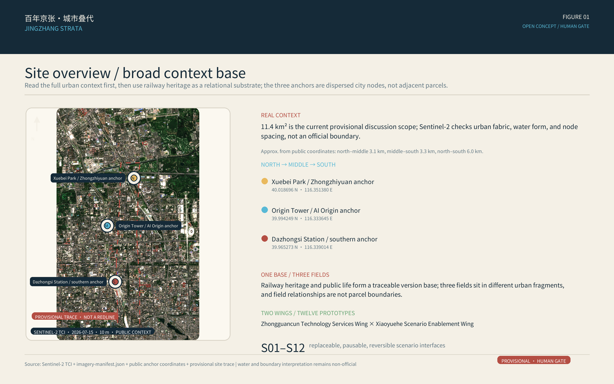
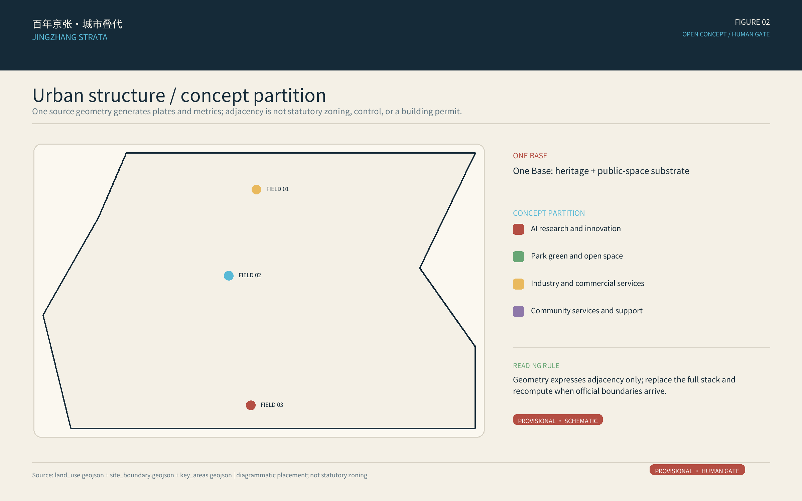
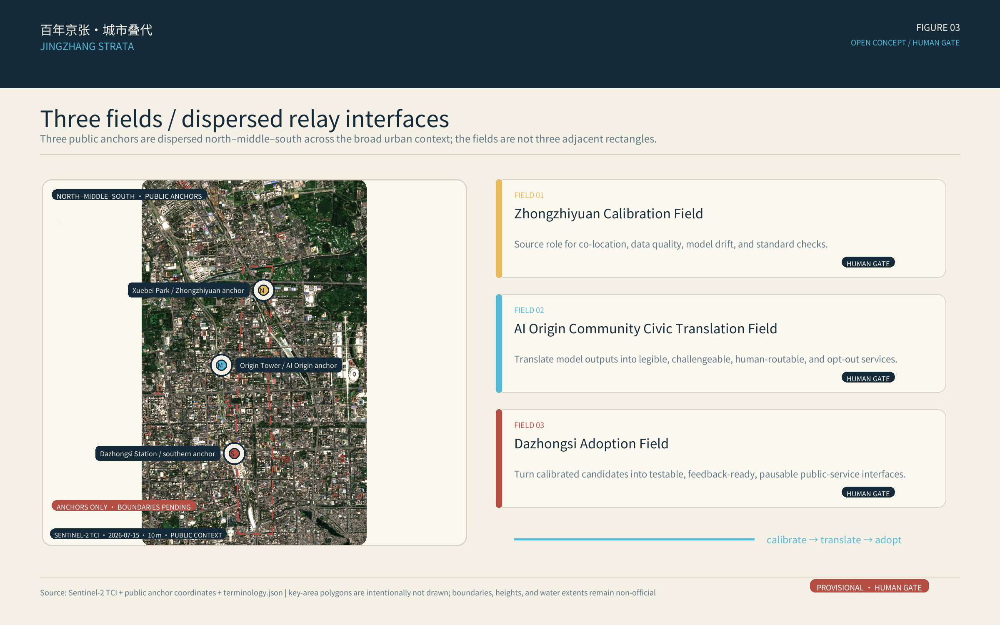
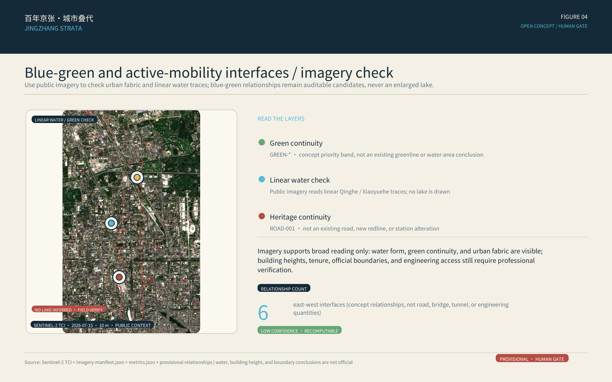
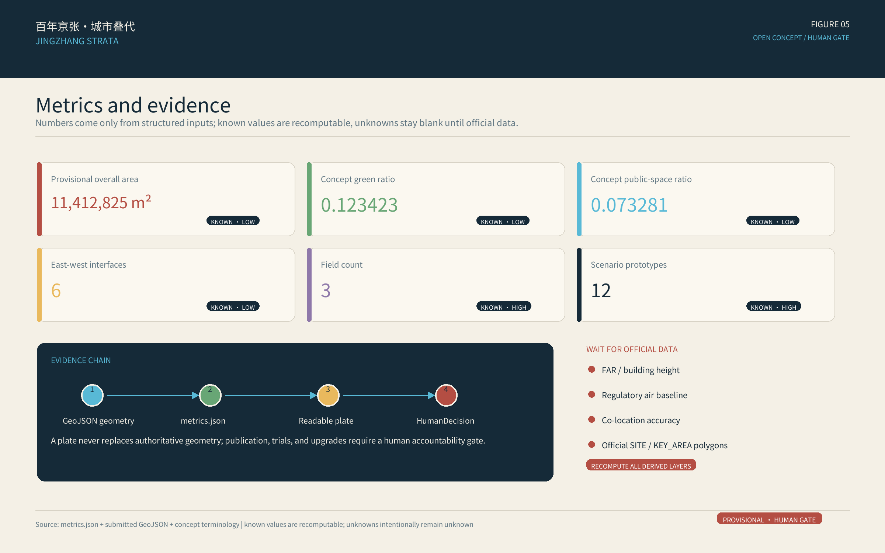

# JINGZHANG STRATA

> **From Railway Heritage to Civic Intelligence Infrastructure.**
> **A Centennial Infrastructure Re-layered for Civic Intelligence.**

> **Open-source concept submission.** This proposal is offered for professional and public questioning, correction, and development. It does not represent organizer approval, formal competition eligibility, selection, construction, or an operating commitment. Exact official boundaries, control plans, existing-building surveys, tenure, heritage controls, municipal systems, measured air data, and accountable operators are not complete. All placements use repository-marked provisional constraints and must be recomputed as one package and professionally reviewed when authoritative data arrives.

In 1909, the Jing-Zhang Railway made measurement, checking, and operating discipline part of infrastructure. Its legacy is not a story to consume, but an engineering spirit of self-reliance that can be read and questioned. As railway heritage enters public space today, this proposal does not put an AI skin on a park. It starts from a traceable heritage base and organizes sensors, data, models, and human judgment as civic intelligence infrastructure.[source:JZ-PARK-PLANNING-2021] [source:JZ-PARK-PHASE1-2023]

“**Strata**” names two actions. **Layering** places railway heritage, public life, innovation industry, and trustworthy intelligence side by side so each layer can be seen and challenged. **Re-layering** means every suggestion can be verified, corrected, withdrawn, and upgraded only after public and professional judgment. The repository slug `jingzhang-breathing-rail` remains a stable technical identifier, not the public brand. The former “Breathing Rail/Public Air Rail” is retained only as a working label for a blue-green and environmental-sensing module, not as the mother concept.

## Design judgment: from a line imagined to interfaces that can retreat

The distinction is not another “AI landscape.” It is a version system for urban design: railway heritage is the version base; a linear heritage park becomes three relay interfaces; AI produces a constrained family of options rather than one answer; drawings, numbers, and evidence derive from the same structured inputs; and a person or professional team with authority signs `HumanDecision`. Every public service keeps a staffed, paper, static, or voice equivalent and a visible stop, withdrawal, complaint, and rollback path.[source:AGENT-TASKBOOK] [depth:overall_spatial_structure]

Intelligence therefore helps people compare alternatives and expose uncertainty; it does not decide the city in their place. This package does not claim live AI operation, a digital twin, reinforcement learning, or deep reinforcement learning. If those methods later have sufficient data, they belong in an isolated, reversible sandbox and cannot become public release or engineering judgment by default.[data:geometry/constraints.geojson#CONSTRAINT-001] [depth:risk_missing_data]

## Design Basis and Source List

The design accepts its evidence limits before making spatial claims. Primary inputs are the official prequalification announcement, the Agent taskbook, the repository site package, national urban-design/control-plan and land-use guidance, and Haidian’s public urban-renewal guidance. International precedents supply methods only; they are not evidence of Haidian conditions or performance.[source:OFFICIAL-ANNOUNCEMENT] [source:AGENT-TASKBOOK] [standard:MOHURD-URBAN-DESIGN-MEASURES]

The announcement states approximately 43.6 sq km for coordinated research, 11.4 sq km for overall design, and 368.4 ha for key-area design: 192.1 ha at Zhongzhiyuan, 104.3 ha at Beijing AI Origin Community, and 72.0 ha at Dazhongsi. Exact official polygons are not supplied. This package uses repository geometry explicitly marked `official_boundary=false` and `geometry_role=provisional_constraint`; it is for intake, concept discussion, figures, and self-check only, never a redline, tenure boundary, or precise measurement basis.[source:PROVISIONAL-BOUNDARIES] [data:geometry/site_boundary.geojson#SITE-001] [metric:site_area_sqm]

Public material describes a long linear heritage-park condition, transverse road interfaces, rail-level relationships, and multiple stakeholders. It also documents the parallel treatment of railway remnants and public-space repair in the first phase. The proposal therefore treats continuity and interfaces as the design question, without inferring local pollution sources, wind corridors, concentrations, ventilation performance, or health effects.[source:JZ-PARK-PLANNING-2021] [source:JZ-PARK-PHASE1-2023] [depth:existing_conditions_diagnosis]

**Evidence confidence:** official scope text, tasks, area names, announced areas, and national standards are high-confidence; official park descriptions and international methods are medium-confidence; the package boundary, concept land use, building prototypes, route relationships, green space, and public-space allocation are provisional/low-confidence; monitoring baseline, sensor performance, airflow, ventilation, controls, building actions, road redlines, utilities, operators, and investment conditions are pending official or professional confirmation.

## Seven Review Dimensions and Six-Task Navigation

This is an evidence index for human review, not a self-score. CI can check deterministic requirements such as files, schemas, bilingual mappings, hashes, and offline assets; maintainers, the public, and professionals still judge relevance, originality, AI-planning value, public benefit, and risk.

| Review dimension | Direct evidence in this proposal | Boundary now |
| --- | --- | --- |
| 01 Task relevance | One base, three fields, two wings, twelve prototypes; three scope levels; three positions, five functions; 12 scenarios, 3 validations, 7 personas, 3 landmarks, and 4 phases | Narrative, figures, metrics, and task matrix must trace to the same requirements; slogans cannot replace required outputs |
| 02 Differentiation | Railway heritage becomes a version base; a linear corridor becomes three relay interfaces; challenge and stoppability become spatial experiences | Before release, human readers must distinguish original contribution, general methods, and borrowed precedent methods |
| 03 AI and planning innovation | Cleared input → constrained option family → human decision → small trial → feedback → rollback | Only a reproducible governance chain is stated; no unrun algorithm, digital twin, or DRL is presented as capability |
| 04 Implementability | Verify the base, pilot light layers, professional iteration, and continuing stewardship; reversible pilots first | Responsible roles, resource bands, baselines, acceptance thresholds, maintenance, and sunset remain to be confirmed |
| 05 Public benefit and inclusion | Seven service personas; paper, voice, static, and staffed equivalents; no biometrics or personal traces | Fairness needs subgroup accessibility, participation records, and benefit–burden checks, not persona inference |
| 06 Risk and compliance | Provenance, rights, assumptions, provisional constraints, no air/medical conclusion, data minimization, human release gate, and exit | Recompute the whole package when authoritative data arrives; professionally collocate devices and preserve human paths |
| 07 Expression completeness | Bilingual prose, structured JSON/GeoJSON, five figures, offline HTML, and A3/A0 contract | Figures, HTML, PDFs, and English counterpart assets still require independent rendering and visual QA |

| Agent task | Proposal response | Review evidence still required |
| --- | --- | --- |
| agent.1 Master concept | Name, slogan, visual identity, one base/three fields/two wings/twelve prototypes, three positions, and five functions | Itemized structure diagram, logo assets, and non-redline relationship diagram |
| agent.2 AI ecosystem | Sensor–calibration–data–model–publication–application–maintenance chain; 7 method precedents; three-field/two-wing loop | Ecosystem map and professional deepening of land/space/industry/funding/talent/compute/data/scenario mechanisms |
| agent.3 AI+ scenarios | S01–S12, three industry validations S01–S03, seven personas, and Xiaoyuehe blue-green validation module | Unified scenario–space–operation–evaluation–exit matrix and one data-sufficient reproducible experiment |
| agent.4 Public realm | Heritage base, transverse interfaces and north–south continuity, three concept landmarks, reversible components, Dazhongsi adoption loop | Heritage, mobility, tenure, maintenance review, and component codes |
| agent.5 Cultural narrative | 1909 engineering discipline → railway heritage public space → trustworthy intelligence; bilingual wayfinding and communication line | Fact and rights register, cultural timeline, wayfinding rules, and equivalent bilingual communication copy |
| agent.6 Long-term operation | Four phases, annual open challenge, quarterly review, rollback, sunset, and developer-community path | Event–audience–frequency–responsibility–input/output–conversion–exit matrix |

The taskbook controls these mappings. Status describes content maturity only, never selection, approval, construction, or operation.[source:AGENT-TASKBOOK] [metric:scenario_node_count] [depth:overall_spatial_structure]

## Three-Level Scope Framework

The three levels progress from strategy to city structure to district prototypes. They do not present one rough map at three false levels of precision.[standard:PROJECT-OFFICIAL-ANNOUNCEMENT] [depth:three_level_scope_framework]

| Level | Question | Deliverable | Boundary discipline |
| --- | --- | --- | --- |
| 43.6 sq km coordinated research | How can trustworthy intelligence enter a world-class innovation ecosystem without a false redline? | Three positions, five functions, six-layer value chain, 7 method precedents, and three-area/two-wing collaboration | Official text area and strategic relationships only; no unpublished coordinated-area polygon |
| 11.4 sq km overall design | How can heritage park, campuses, districts, communities, and stations form enterable civic infrastructure? | One base, three fields, two wings, twelve prototypes, concept land use, blue-green/environment sensing module, mobility interfaces, public realm, and phasing | Provisional SITE-001; all geometry and areas remain low-confidence concept recomputations |
| 368.4 ha key-area design | How can calibration, translation, and adoption become spatially accessible? | Zhongzhiyuan Calibration Field, AI Origin Community Civic Translation Field, Dazhongsi Adoption Field | Three rough envelopes are not parcels, roads, tenure, or construction boundaries |

When official polygons arrive, replace `site_boundary` and `key_areas` first. Recut `land_use/buildings/roads/green_space/public_space/phasing` through the same topology process, recalculate all spatial metrics in EPSG:4548, and regenerate the five figures, HTML, A3/A0, and manifest hashes as one chain; do not edit only one map.[data:geometry/key_areas.geojson#PROV-KEY-001] [metric:key_area_count]

## Coordinated Research Area: Industry and Future City Research

### Master concept and spatial grammar: one base, three fields, two wings, twelve prototypes

**One base** is the Jing-Zhang railway heritage and traceable public record as a version base: every new suggestion sits beside known evidence and cannot overwrite or rewrite history. **Three fields** turn a linear heritage condition into public relay interfaces. **Two wings** provide service and validation relationships. **Twelve prototypes** are exitable S01–S12 scenario interfaces mapped to the package layers, not built facilities.

- **One base: heritage as version base.** Keep railway traces legible and put source, time, confidence, and version into wayfinding and data boards; use cleared records and human-reviewed text only.
- **Three fields: calibration–translation–adoption.** The northern Zhongzhiyuan Calibration Field handles co-location, model cards, and error explanations; the central AI Origin Community Civic Translation Field translates candidates into understandable, contestable services; the southern Dazhongsi Adoption Field tests terminal usability, civic adoption, and feedback.
- **Two wings: Zhongguancun Technology Services and Xiaoyuehe Scenario Enablement.** The first is a collaborative interface for standards, legal/IP, talent, and international services; the second supports blue-green maintenance and environmental-scenario validation. Neither is a new construction boundary or a confirmed institutional commitment.
- **Twelve prototypes: S01–S12.** Each exposes source, timestamp, confidence, accountable human, manual channel, stop control, and exit condition. They are replaceable members of an option family, not installed facilities.

The three positions connect one evidence chain: **Centennial Jing-Zhang Culture Belt** supplies the traceable heritage base; **Urban AI Life-Experience Belt** places reading, questioning, rest, and service in public space; **AI Integrated Innovation Belt** joins calibration, scenarios, professional review, and civic adoption. The five functions are **full-stack AI self-innovation**, **world-class AI ecosystem**, **AI+ scenario enablement**, **intelligent AI-active city**, and **global discourse on AI governance**. They are spatial roles, not invented industry, investment, or policy commitments.[source:AGENT-TASKBOOK] [depth:overall_spatial_structure]

### Trustworthy-intelligence loop: an option family, never a single answer

Every scenario follows: `cleared input → constraint check → AI option family → professional and public comparison → HumanDecision sign-off → small trial → operating feedback → version rollback/exit`. Options may vary by route prompt, information format, component combination, or time window, but cannot pass over legal passage, accessibility, heritage, privacy, fire-safety, or data-authorization hard gates. AI proposes; authorized humans carry publication and stop responsibility.[source:AGENT-TASKBOOK] [data:geometry/constraints.geojson#CONSTRAINT-001]

Drawings, metrics, and evidence derive from one structured package: GeoJSON supports spatial relations, `metrics.json` supports recomputable quantities, and sources/assumptions/matrices support explanation and boundaries. Figures serve the human reading layer and do not replace authoritative geometry. The package has not run a validated reinforcement-learning, digital-twin, or DRL experiment; any future work must use cleared/synthetic data, an isolated sandbox, reproducible versions, and explicit failure thresholds before it can be considered for review.[data:geometry/site_boundary.geojson#SITE-001] [depth:metrics_recalculation]

### Identity and cultural translation

The public brand is **JINGZHANG STRATA**, paired with the Chinese title declared in the front matter. The subtitle is “From Railway Heritage to Civic Intelligence Infrastructure,” and the international line is “A Centennial Infrastructure Re-layered for Civic Intelligence.” The original logo direction uses two oxidized-red railway strokes as a base, an exit gap at the center, and two air-blue relation lines; a willow-green dot denotes human review. The palette is oxidation red `#B44E43`, air blue `#58B9D6`, willow green `#68A675`, charcoal blue `#152A38`, and warm paper `#F4F0E6`. No portrait, company mark, uncleared font, or historic image is used. “Strata” names version governance, not a medical or clean-air effect.[source:JZ-PARK-PHASE1-2023] [depth:overall_spatial_structure]

The narrative moves from the publicly supported engineering discipline of the 1909 Jing-Zhang Railway to the measurement, checking, publication, and rollback discipline of trustworthy intelligence in railway-heritage public space. The 2019 high-speed railway and surface heritage-park overlap is treated only as context for infrastructure renewal and re-reading public ground. The proposal invents no steam, pollution, biographical anecdote, or observed site experience.[source:JZ-PARK-PLANNING-2021] [source:OFFICIAL-ANNOUNCEMENT]

### Comparable-scale urban-design method calibration

The comparison is not a search for landmark form. It tests whether Jing-Zhang has a credible transition across scales, a continuous city system, differentiated segments, and a long-term delivery logic. Scope, awards, and planning status come from governments, public development bodies, or award organizations; project-page performance claims are not converted into Jing-Zhang promises.

| Precedent | Verified scale or status | Transferable method for Jing-Zhang | Explicitly not copied |
| --- | --- | --- | --- |
| Lower Lea Valley, London | 1,450 ha opportunity-area planning framework | Translate regional structure into subareas and projects, with infrastructure and public space delivered in phases [source:LOWER-LEA-OAPF] | Olympic-event delivery, large-scale land assembly, or a uniform waterfront image |
| Atlanta BeltLine | 22-mile network across many neighborhoods; 2024 ASLA Award of Excellence | Let city-scale continuity contain local difference and evaluate governance, equity, and implementation over time [source:ATLANTA-BELTLINE-ASLA-2024] | Treating the award as proof that every goal is complete or copying US finance rules |
| Shougang Park, Beijing | Approximately 8.63 sq km on the official project page; continuing regeneration | Coordinate heritage, ecological repair, innovation uses, and long-term operation [source:SHOUGANG-PARK-OFFICIAL] | Olympic-event investment, single-owner mega-parcels, or uniform high-intensity development |
| Paris-Saclay | Multi-node national innovation network; Campus Urban approximately 600 ha | Combine research, enterprise, mobility, landscape, and urban life as an open innovation network [source:PARIS-SACLAY-EPA] | Projecting national research concentration and public investment onto this site |
| Qianhai, Shenzhen | Official comprehensive-plan scope of 37.9 sq km | Coordinate strategy, transport, open space, phased districts, and a governance platform [source:QIANHAI-COMPREHENSIVE-PLAN] | Reclaimed-land urbanism, tower skylines, or unverified development intensity |
| Yangpu Riverfront, Shanghai | Continuing segmented regeneration along 15.5 km of riverfront | Hold continuity and differentiated segments together; open public space before adding innovation and community uses [source:YANGPU-RIVERFRONT-PLAN] | A wide continuous Huangpu frontage or wholesale industrial-waterfront land conditions |

Four overall-design decisions are therefore frozen. First, move from `43.6 sq km coordinated research → 11.4 sq km overall design → approximately 368.4 ha of key areas`, always from whole to part. Second, use railway heritage, transverse civic interfaces, walking, and a linear blue-green system as the shared base while north, middle, and south retain distinct fabric and intervention intensity. Third, prove overall structure, function, form, mobility, blue-green systems, and public realm before node renderings. Fourth, use pilot–evaluate–expand, binding each phase to responsibility, maintenance, evaluation, and exit. These precedents justify testing the methods; they do not prove equivalent land, capital, governance, or engineering conditions at Jing-Zhang.[depth:overall_spatial_structure] [depth:implementation_policy_phasing]

### Six-layer ecosystem and method precedents

The chain is `sensors and edge compute → cleared data and calibration → environmental models and uncertainty → safety/standards/ethics → small urban trials → public-service and market adoption`. Zhongzhiyuan concentrates calibration, AI Origin translates and gathers feedback, and Dazhongsi tests usability and adoption; the two wings provide services and validation. No company, investment, compute, revenue, recruitment, or event-effect number is invented.[source:URBAN-RENEWAL-GUIDE] [depth:overall_spatial_structure]

| Precedent | Borrow | Do not copy |
| --- | --- | --- |
| Breathe London | Community, school, and hospital sensor locations with reference co-location and public communication | Device count, legal authority, London governance, or partner relationships |
| OpenAQ | Open, traceable, interoperable air-data metadata | Global aggregates as local regulatory baseline or a remote API in the offline submission |
| US EPA Air Sensor Toolbox | Co-location, performance evaluation, quality assurance, interpretation, and education limits | Low-cost readings as Beijing regulatory or medical conclusions |
| JTC LaunchPad / One-North | Space + testbed + community + accelerator loop | Land regime, leases, company count, or policy conditions |
| Station F | Shared services, mentors, events, work and living support | Mega-building, brand, or capital network |
| Mila | Research, entrepreneurship, policy, and responsible-AI bridges | Institutional scale, academic system, or research agenda |
| Cornell Tech | Public space connecting research, enterprise, living, and resilience | Campus area, investment, or engineering systems |

Full URLs, access dates, rights, and limitations are in [sources.json](sources.json). [source:BREATHE-LONDON] [source:OPENAQ] [source:US-EPA-AIR-SENSOR]

## Overall-Design-Area Urban Renewal and Control-Plan-Depth Urban Design

The overall design starts with three breaks: an **evidence break** when data lacks visible calibration or provenance; a **spatial break** when heritage-park interfaces are hard to read or traverse; and a **service break** when an automated interface has no staffed equivalent. The spatial move is not more equipment. It is a heritage base, three relay fields, six east–west interfaces, and a low-impact blue-green/environment-sensing module. The six interfaces are existing-passage relationships to audit, not proposed road redlines, bridges, tunnels, or station works.[data:geometry/roads.geojson#ROAD-001] [metric:cross_link_count] [depth:traffic_rail_slow_parking]

Concept land-use polygons apply a national-classification subset as a seamless, non-overlapping relationship partition inside provisional SITE-001. Calibration/R&D sits near innovation resources; translation touches campus, community, and ordinary public life; transformation meets stations and commerce. This describes adjacency, not existing land status or statutory rezoning. Mixed use, green-space combination, and station relationships require formal control-plan, tenure, and professional procedures.[standard:MNR-LAND-USE-CLASSIFICATION-GUIDE] [data:geometry/land_use.geojson#LU-001]

Low-impact, reversible, reuse-first measures are suggested: shared ground-floor interfaces, movable co-location racks, shaded seats, paper/Braille wayfinding, and staffed desks. Structural change, mechanical ventilation, roofs, demolition, extension, station integration, or underground work waits for survey, tenure, structure, fire, utility, traffic, and heritage review. Building layers are program prototypes, not surveyed buildings.[data:geometry/buildings.geojson#BLDG-001] [depth:retain_renovate_demolish]

FAR, height, density, setbacks, road widths, and facility capacities are pending official data. Character guidance is non-numeric: keep railway traces legible; make components removable and maintainable; keep ground floors enterable; allow screens to switch off; avoid glare; keep staffed help visible. Nothing here becomes a permit condition.[standard:MOHURD-CONTROL-DETAILED-PLANNING] [metric:floor_area_ratio]

## Key-Area Detailed Design

All three areas use the same fields—role, spatial move, building approach, mobility/public realm, prototypes, and dependencies. Rough rectangles are concept envelopes only. The design fields are reference schemes that place an evidence relay into ordinary space; they are not established institutions or projects.[depth:three_key_area_detailed_design] [metric:key_area_count]

### Zhongzhiyuan Calibration Field

- **Role:** northern calibration interface for environmental sensing, edge inference, model safety, and standards validation.
- **Spatial move:** in consented existing open space, consider removable co-location racks, a synthetic-data sandbox, a maintenance bench, and a public model-card gallery; do not infer water, wind, power, or tenure conditions.
- **Building prototypes:** a small calibration lab and staffed release room; reuse/new-build status waits for survey, structure, and fire review.
- **Mobility and public realm:** separate maintenance and public reading; accessibility, rest, and human explanation precede automated demonstration.
- **Prototype mapping:** S01 multi-sensor co-location, S02 model-drift red team, and S08 blue-green inspection.
- **Dependencies and exit:** without regulatory reference data, co-location, maintenance responsibility, or professional sign-off, retain education-only display and remove it.[data:geometry/key_areas.geojson#PROV-KEY-001] [source:US-EPA-AIR-SENSOR]

### AI Origin Community Civic Translation Field

- **Role:** translate model candidates into ordinary services that residents can understand, contest, and exit.
- **Spatial move:** candidate campus–district–community interfaces host an open worktable, data-license wall, static bulletin, paper/Braille route, and staffed desk; no new floor area is assumed.
- **Building and passage:** reuse existing ground floors and time-share first; audit accessibility and temporary wayfinding on middle interfaces, without promising campus opening, wall removal, or connection works.
- **Prototype mapping:** S04 low-exposure active-mobility prompt, S05 accessible service post, S07 pollen/dust bulletin, and S11 community sensor loan and learning.
- **Dependencies and exit:** campus access, privacy, accuracy, maintenance, participation, and staffed duty require accountable parties; without an equivalent human path, do not publish advice.[data:geometry/key_areas.geojson#PROV-KEY-002] [source:BARRIER-FREE-LAW]

### Dazhongsi Adoption Field / 大钟寺转化场

- **Role:** southern adoption interface for environmental-AI terminals, indoor/outdoor information, AI-native consumption, and international exchange.
- **Spatial move:** at existing station-adjacent or commercial public nodes, test a movable “read data—ask a human—try a terminal—submit feedback” loop; do not alter traffic, green, or heritage controls.
- **Building prototypes:** a terminal-usability lab, information display, and shift-worker service post; mechanical, fire, and indoor-ventilation engineering are separate.
- **Prototype mapping:** S03 indoor/outdoor terminal usability, S06 ventilation advice, S09 event/construction air notice, and S10 shift-worker post.
- **Dependencies and exit:** station/property management, measurements, fire safety, market fairness, consumer rights, and staffed duty remain pending; on-site staff decide loading, accessibility, and safety conflicts.[data:geometry/key_areas.geojson#PROV-KEY-003] [source:GENERATIVE-AI-MEASURES]

## AI Innovation Ecosystem, Personas, and AI+ Scenarios

### Seven service personas

| Persona | Need | Response | Prohibited shortcut |
| --- | --- | --- | --- |
| Local older resident | Low-barrier routes, seating, human help | Parallel paper, voice, and staffed paths | No forced scan or health profile |
| Student/environment researcher | Reproducible experiments and shared worktables | Co-location, synthetic data, model cards | Unreviewed output is never a public conclusion |
| AI developer/start-up | Affordable testing, standards, and scenario entry | Sandbox, red team, legal/IP service interface | No uncleared or sensitive data |
| District service/shift worker | Continuous commute, rest, loading, and help | Shift-worker post and fixed non-AI path | No trace or work-performance monitoring |
| Family/cultural visitor | Legible railway story and inclusive experience | Bilingual static guide and shaded stop | No recording, image, or child-data capture |
| Mobility-impaired traveler | Continuous accessibility information and challenge review | Inventory, staff confirmation, paper map | AI never guarantees real-time passage |
| International talent/visitor | Bilingual information, short-term work, public services | Bilingual signs, staffed desk, open worktable | No nationality/language-based commercial profile |

Personas define a service-test envelope, not demographic statistics. [source:BARRIER-FREE-LAW] [metric:persona_count]

### Twelve prototypes: S01–S12

All twelve prototypes are small, pausable, exitable concept trials; none is an installed facility, and no prediction is a guarantee. AI output enters a constrained option family and can be released only after professional and user comparison and `HumanDecision` sign-off. Public services default to no biometrics, personal traces, or medical diagnosis. Low-cost sensors support education, screening, and model research only.[source:US-EPA-AIR-SENSOR] [source:GENERATIVE-AI-MEASURES]

| ID / type | Concept location and users | Data | Human gate and exit | Main risk |
| --- | --- | --- | --- | --- |
| S01 **multi-sensor co-location** / T1 | Zhongzhiyuan Calibration Field; device teams, environmental professionals | Authorized summaries, reference data, synthetic faults | Professional calibration record; disconnect and withdraw | Drift presented as regulatory truth |
| S02 **model-drift and outlier red team** / T2 | Zhongzhiyuan sandbox; developers, safety researchers | Synthetic episodes, public model cards, cleared tests | Independent sign-off; production isolation and stop | Leakage, benchmark gaming, false alerts |
| S03 **indoor/outdoor terminal usability** / T3 | Dazhongsi Adoption Field; residents, older users, visitors | Voluntary trial, anonymous task completion, no biometrics | Staffed facilitation and accessibility review; delete and exit | Dark patterns, sample bias, device failure |
| S04 **low-exposure active-mobility prompt** | Heritage-base blue-green module; commuters, students, visitors | Authorized calibrated summaries plus public network | Operator checks validity; no route history, static path retained | Stale prediction treated as guarantee |
| S05 **accessible service post** | Station–park–community existing paths; older and mobility-impaired users | Facility inventory and voluntary obstacle reports | Field checks; paper, voice, and staffed service | Stale accessibility information |
| S06 **ventilation-advice assistant** | Candidate Dazhongsi public interior; property staff, visitors | Authorized indoor sensors, manuals, inspections | Mechanical/health professional decides; automation off | Advice mistaken for engineering instruction |
| S07 **pollen/dust public bulletin** | AI Origin Community Civic Translation Field and event nodes; families, outdoor workers | Official notice, authorized sensor, human record | Publisher exposes source and time; static bulletin fallback | Health misdirection and source confusion |
| S08 **blue-green facility inspection** | Xiaoyuehe wing/park candidates; landscape/water crews, volunteers | Public green layer, synthetic image, authorized summary | Professional verifies before action; manual inspection remains | False alert causes ecological harm |
| S09 **event/construction air notice** | Park event/renewal candidates; residents and hosts | Public permit/time window and authorized particulate summary | Site lead decides pause; users disable push | Unclear liability, false alert, conflict |
| S10 **shift-worker service post** | Dazhongsi and district-service interface; shift/service workers | Public opening hours and anonymous demand; no employment data | Duty staff decides; fixed non-AI service remains | Service gap, labor surveillance, purchase barrier |
| S11 **community sensor loan and learning** | AI Origin Community Civic Translation Field; schools, communities, researchers | Minimal loan log, public tutorial, voluntary data | Training before loan; data may stay private or be deleted | Uncalibrated readings overinterpreted |
| S12 **multilingual railway-memory guide** | Heritage-park display nodes; families, international visitors | Cleared archives, official texts, human translation | Historian review; static text and human interpretation | History, rights, or translation error |

The minimum industry-validation set is S01, S02, and S03. S06 can become a fourth only after mechanical, venue, and data authorization. Counts and locations are auditable design deliverables; they do not claim deployment, procurement, operation, or effect.[metric:industrial_validation_count] [data:geometry/public_space.geojson#PUBLIC-001]

## Land Use, Building Scale, and Retain-Renovate-Demolish Strategy

Concept land use covers provisional SITE-001 through a single-source partition. Its four `LU-*` features have a 1.0 internal coverage ratio, but that ratio describes only provisional concept topology, not existing land certification or statutory rezoning.[data:geometry/land_use.geojson#LU-001] [metric:land_use_coverage_ratio] [standard:MNR-LAND-USE-CLASSIFICATION-GUIDE]

Nine `BLDG-*` features are spatial prototypes for calibration, red team, data licensing, civic translation, accessible service, terminal testing, shift-worker service, maintenance, and international exchange. The package recomputes their footprint total as 310,807.184 sq m at low confidence; existing status, floors, structure, ownership, and retain/renovate/demolish/new-build decisions are pending official data and survey. The prototypes are not existing buildings or development quantities.[data:geometry/buildings.geojson#BLDG-001] [metric:building_footprint_area_sqm] [depth:development_intensity_controls]

The decision sequence is survey → tenure → structure/fire → heritage/control plan → public value → reversible trial → `HumanDecision`. Until professional review, this proposal makes no parcel-level retain/renovate/demolish decision and no conclusion about FAR, height, density, investment, or construction scale.[depth:retain_renovate_demolish] [metric:building_height_m]

## Transport, Rail, Municipal Infrastructure, and Public Services

The road layer expresses one north–south heritage-continuity relationship, six east–west walking/cycling interfaces, and three field connections. “Breathing Rail/Public Air Rail” is only a blue-green/environment-sensing module label here, not the public brand or a new line. Existing passage continuity, slope, surface, crossings, lighting, seats, and signs must be audited first. Where a break exists, operations, paper maps, and movable elements come before any engineering question. No line denotes an existing road, new redline, bridge, tunnel, or station alteration.[data:geometry/roads.geojson#ROAD-001] [metric:breathing_rail_length_m] [depth:traffic_rail_slow_parking]

Environmental advice never overrides mobility safety: legal, accessible, staff-confirmed passage is a hard gate; predicted exposure is secondary. Emergencies, closures, and rail operations defer to operators and authorities. Cycling, delivery, device maintenance, and walking are coordinated by time and staff without plates, faces, or individual traces.[source:BARRIER-FREE-LAW] [depth:traffic_rail_slow_parking]

The lightweight infrastructure stack is sensor → edge gateway → cleared-data zone → model sandbox → public bulletin. Public output contains only necessary time/location granularity, confidence, and human contact. Power, communications, regulatory monitoring, mechanical systems, fire safety, drainage, and cybersecurity require professional capacity checks; no utility, energy, or HVAC quantity is proposed.[depth:municipal_new_infrastructure] [data:geometry/constraints.geojson#CONSTRAINT-001]

## Blue-Green Network, Public Space, and Urban Character

`GREEN-*` features are concept green-priority bands along heritage continuity and east–west interfaces. `PUBLIC-*` features are concept fields and prototype nodes. Neither is a surveyed park, waterway, statutory green line, or blue line. The green ratio 0.123423 and public-space ratio 0.073281 are low-confidence allocations on provisional geometry, not statutory ratios or existing supply; canopy, stormwater, river, and airflow performance require ecology, water, meteorology, and wind studies.[data:geometry/green_space.geojson#GREEN-001] [metric:green_ratio] [metric:public_space_ratio]

The component library is legible, removable, and maintainable: a two-sided data board with source/time/confidence/human contact, co-location rack, shaded seat, water/charging interface, Braille/high-contrast paper map, low-glare light, staffed desk, and recyclable event frame. A QR code is never the only entrance; offline asking, resting, reading, challenging, and complaining remain possible.[depth:blue_green_public_space]

Three concept pilgrimage landmarks borrow existing public space and imply no approval. Their shared honor-display rule is to show evidence, error, challenge, and rollback rather than an unverified effect:[metric:pilgrimage_landmark_count]

1. **Calibration Zero, north:** displays co-location records, error ranges, and model cards; discovering failure becomes an innovation honor.
2. **Origin Translation Commons, center:** students, residents, and developers inspect provenance, file challenges, and receive staffed answers.
3. **Dazhongsi Strata Exchange, south:** a small public interface for terminal usability, indoor/outdoor information, international visitors, and AI-native consumption.

The landmarks are content and service nodes, not sculptural claims; each installation location, material, heritage relationship, and operating right requires item-level review.[source:JZ-PARK-PHASE1-2023] [source:AGENT-TASKBOOK]

## Renewal Projects, Implementation Policy, and Phasing

| Package | Concept project | Place | Dependency | Exit condition |
| --- | --- | --- | --- | --- |
| STR-01 | Heritage version base and evidence-calibration protocol | Beltwide | Authoritative data, cleared records, reference station, device rights | Without reference conditions, education display only |
| STR-02 | Zhongzhiyuan calibration-field light-layer interface | North | Owner, power, network, safety, environmental review | Stop/remove on drift, rights, or maintenance gap |
| STR-03 | AI Origin civic-translation field and loan library | Center | Campus/community consent, training, accessibility, staffed duty | Stop advice without accountable human duty |
| STR-04 | Dazhongsi adoption-field reversible trial | South | Station/property, mechanical/fire, consumer rights | Stop without equivalent non-AI path |
| STR-05 | Six east–west interface field audits | Overall area | Survey, transport, accessibility, tenure | Reroute if safe/legal passage fails |
| STR-06 | Twelve prototype reversible component set | Nodes | Maintenance, rights, privacy, event permit | Remove when expired, inaccurate, or complaints unresolved |
| STR-07 | Bilingual identity and railway narrative system | Park nodes | History, copyright, translation review | Withhold any unverified fact/right |
| STR-08 | Open challenge and version-maintenance crew | Three areas/two wings | Operator, rules, resources to be confirmed | No public commitment without accountable operator |

Four phases are a suggested governance sequence, not investment or construction commitments:[data:geometry/phasing.geojson#PHASE-001] [metric:phase_count]

1. **Verify the base, years 0–1:** obtain official geometry, controls, tenure, and existing-condition surveys; audit accessibility, air evidence, heritage rights, and reference co-location. Every public output shows source, time, confidence, and a human channel.
2. **Pilot light layers, years 1–3:** in consented existing spaces, run S01–S03 and a few public prototypes; pass safety, accessibility, rights, privacy, and `HumanDecision` gates; stop, withdraw, or restore a static version at any time.
3. **Professional iteration, years 3–5:** connect the fields and prototypes only through verified existing passages. Building, transport, mechanical, heritage, and municipal actions require professional review; AI remains an option-family generator.
4. **Continuing stewardship, year 5+:** quarterly calibration and scenario review, semiannual model/data audit, annual open challenge; retain version log, public challenges, rollback, and sunset. Reinforcement learning, digital twins, and DRL remain isolated future experiments and cannot enter public service without independent validation.

Operations use a dual professional/public gate: environmental and urban professionals confirm evidence and spatial safety, while residents and users confirm legibility, exit, and public value. No event, partner, funding, recruitment, or attraction-effect claim is made without authorization. GitHub submission status remains separate from official professional eligibility.[source:AGENT-TASKBOOK] [source:OFFICIAL-ANNOUNCEMENT]

## Metrics, Area Recalculation, and Compliance Matrix

Only recomputable geometry and authored deliverable counts are marked as package-known. Statutory controls, field environment, and operating performance remain pending official or professional evidence; provisional geometry cannot manufacture certainty.[depth:metrics_recalculation]

| Metric | Current status | Human-readable meaning |
| --- | --- | --- |
| Provisional overall area | Recomputable, low confidence: 11,412,825.386 sq m | EPSG:4548 recomputation of the submitted provisional polygon, not an official redline for the announced 11.4 sq km [metric:site_area_sqm] |
| Prototype building footprint | Recomputable, low confidence: 310,807.184 sq m | Sum of nine spatial prototypes, not existing buildings or development quantity [metric:building_footprint_area_sqm] |
| Concept green/public-space ratios | Recomputable, low confidence: 0.123423 / 0.073281 | Provisional allocation only, not statutory green ratio or existing supply [metric:green_ratio] [metric:public_space_ratio] |
| Land-use coverage | Recomputable, low confidence: 1.0; 4 features | Internal coverage of the provisional concept partition, not statutory land-use coverage [metric:land_use_coverage_ratio] [metric:land_use_feature_count] |
| Fields, prototypes, validations, personas, landmarks, phases | Recomputable, high confidence: 3 / 12 / 3 / 7 / 3 / 4 | Authored deliverable counts, not construction, operation, or effect [metric:key_area_count] [metric:scenario_node_count] |
| East–west interfaces | Recomputable, low confidence: 6 | Concept relationship count, not surveyed roads, bridges, tunnels, or engineering quantity [metric:cross_link_count] |
| FAR, building height, air baseline, sensor accuracy, sensing-module length | Pending official data | Await official controls, existing surveys, regulatory baseline, and co-location [metric:floor_area_ratio] [metric:building_height_m] [metric:air_quality_baseline]; sensor performance and module alignment still require professional tests [metric:sensor_accuracy] [metric:breathing_rail_length_m] |

`compliance_matrix.json` maps announcement items 1.3–1.5 and agent.1–agent.6; `standard_matrix.json` covers governing standards; `design_depth_matrix.json` covers existing conditions, structure, land use, intensity, character, building action, mobility, municipal infrastructure, blue-green space, the three fields, projects, phasing, recalculation, and risk. A future four-gate PASS would mean only baseline eligibility for review, not excellent design, official data, a signed `HumanDecision`, or approval.[source:AGENT-TASKBOOK] [depth:risk_missing_data]

## Risk, Copyright, and Compliance

- **Air and health:** no diagnosis, treatment, or personal-risk prediction. Low-cost sensors do not replace regulatory monitoring. Public notices expose source, time, uncertainty, and a responsible human; without a baseline, no low-exposure or ventilation-effect guarantee is published.
- **Privacy and algorithms:** no faces, voiceprints, plates, personal traces, employment performance, health profiles, or unauthorized PII. Generative-AI services use lawful, cleared, or synthetic data with human review, complaint, exit, and deletion paths.[source:GENERATIVE-AI-MEASURES]
- **Space and engineering:** every boundary, land-use, building, road, green/public-space, and phase feature is a concept suggestion. No control-plan, parcel-level building action, bridge/tunnel, underground work, utility capacity, airflow, energy, investment, or construction conclusion is made.[standard:MOHURD-CONTROL-DETAILED-PLANNING]
- **Human judgment:** AI suggests option families only; public release, spatial trial, or version upgrade requires an authorized person/professional team to complete `HumanDecision`, with a manual fallback and stop control.[source:AGENT-TASKBOOK]
- **Accessibility:** paper, voice, static, and staffed equivalents remain beside digital interfaces; field continuity audits precede implementation.[source:BARRIER-FREE-LAW]
- **Heritage and rights:** only original geometry, programmatic figures, and registered public material are distributed. No third-party font, photo, logo, portrait, or map tile is bundled. See [report/copyright_statement.md](report/copyright_statement.md).
- **Submission boundary:** the official prequalification was for qualified legal entities/consortia. This AI-agent open-source PR is a concept submission and does not claim official applicant, selection, government recognition, or implementation.[source:OFFICIAL-ANNOUNCEMENT]

Unresolved inputs include official SITE/KEY_AREA polygons, control plan and tenure, existing buildings and public space, road/rail/parking, utilities and fire, heritage controls, regulatory air baseline, reference co-location, device maintenance, accountable operators, and public-participation records. When any is missing, the claim remains pending official data and does not expand into an engineering or implementation commitment.[data:geometry/constraints.geojson#CONSTRAINT-001] [depth:risk_missing_data]

## References

1. Beijing Municipal Commission of Planning and Natural Resources, Haidian Branch, official prequalification announcement for the Centennial Jing-Zhang AI Innovation Belt, 2026.
2. open-city-ai/haidian, `agent_taskbook.json`, `design_brief.json`, `allowed_design_space.json`, and `provisional_boundaries.geojson`.
3. Official Beijing planning and landscape pages on Jing-Zhang Railway Heritage Park, 2021–2023.
4. Haidian District public urban-renewal guidance, 2025.
5. MOHURD urban-design and control-plan measures; MNR land-use classification guide.
6. London City Hall, *Breathe London*; OpenAQ, *About Us*; US EPA, *Air Sensor Toolbox*.
7. Official pages of JTC LaunchPad, Station F, Mila, and Cornell Tech.
8. Full URLs, access dates, use limits, and rights notes are in [sources.json](sources.json); structured recomputation is in [metrics.json](metrics.json), and missing-data triggers are in [assumptions.json](assumptions.json). [source:SOURCE-REGISTRY]

## Evidence and Delivery Entry Points

The human reading layer explains judgments and limits; the machine-audit layer retains complete source, assumption, metric, matrix, and geometry indexes.

- [Metrics and recalculation](metrics.json) · [Source registry](sources.json) · [Assumptions and data gaps](assumptions.json)
- [Task coverage matrix](compliance_matrix.json) · [Professional standards matrix](standard_matrix.json) · [Design-depth matrix](design_depth_matrix.json)
- [Formal narrative report](report/narrative.md) · [Copyright statement](report/copyright_statement.md)
