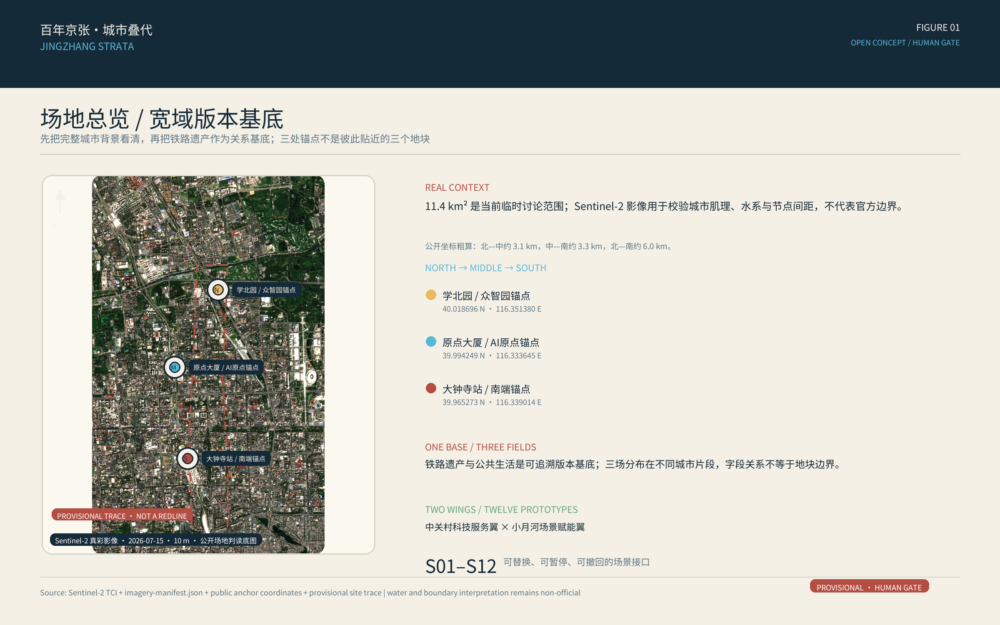
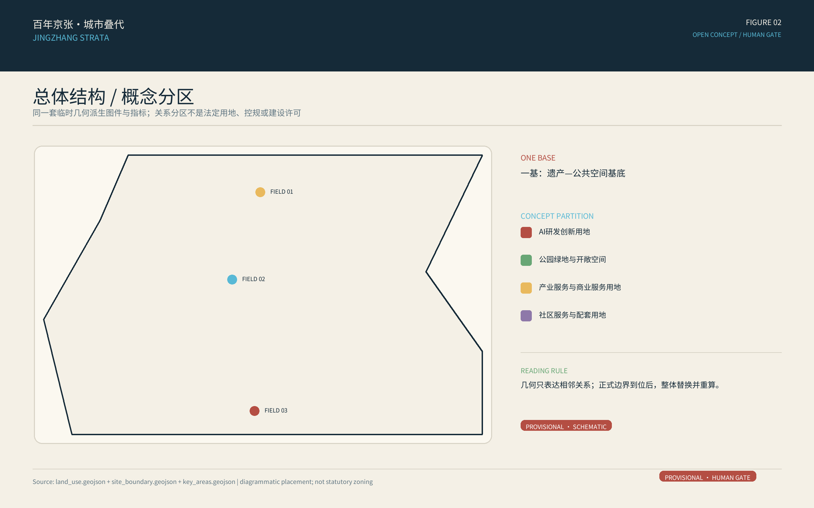
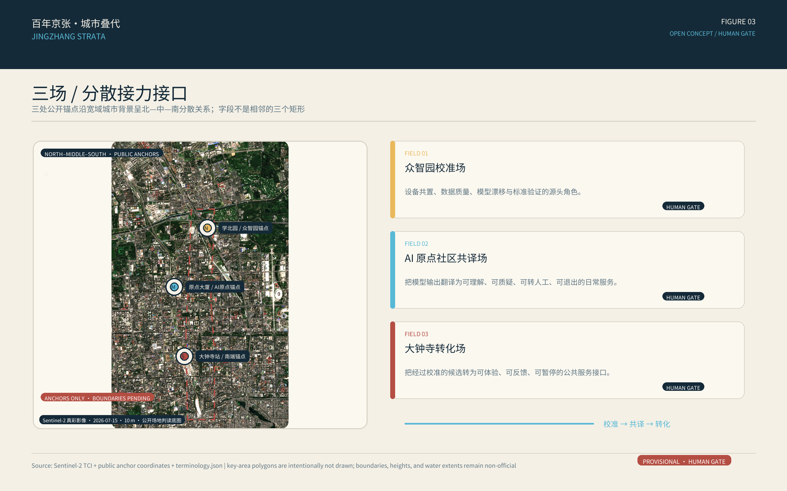
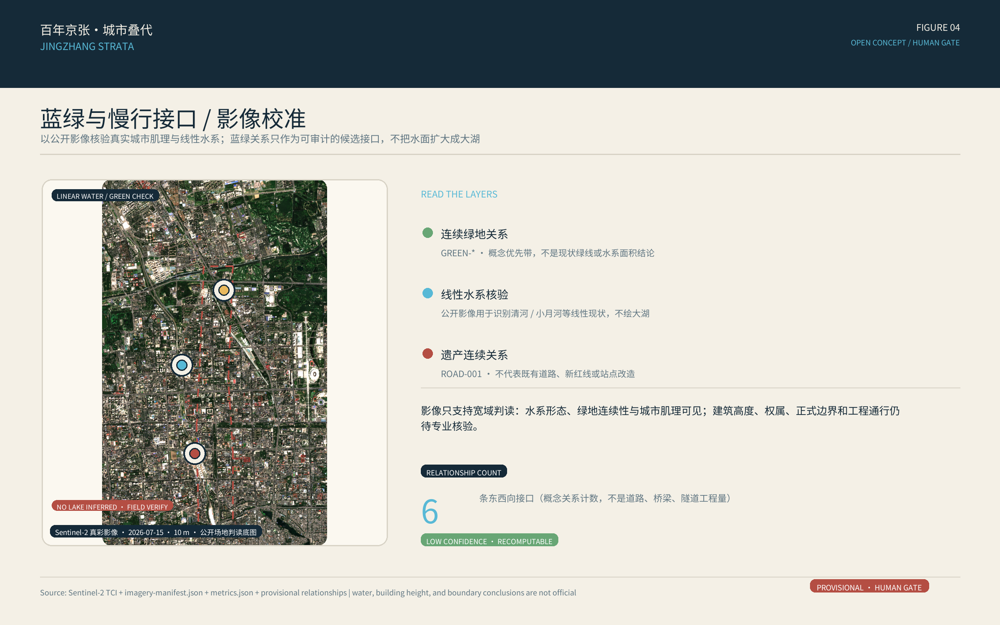
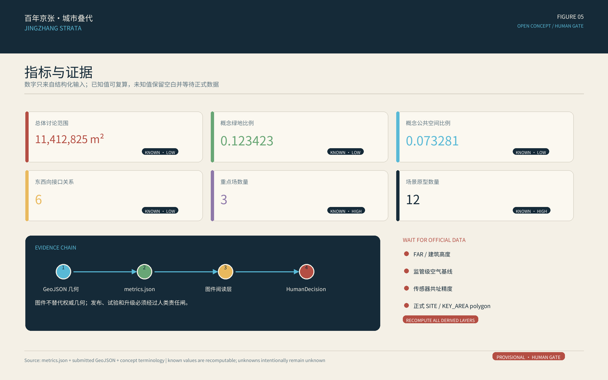

# 百年京张·城市叠代 / JINGZHANG STRATA

> **从铁路遗产到城市智能基础设施。**
>
> **百年为基，城市叠代。**
> *A Centennial Infrastructure Re-layered for Civic Intelligence.*

> **开源概念投稿。** 本方案供专业团队和公众继续质疑、修正与深化，不代表主办方批准、官方应征资格、中选、建设或运营承诺。当前精确官方边界、控规、现状建筑、权属、文保控制、市政、实测空气数据和责任主体均未齐备；所有落位以仓库明确标记的临时约束几何为讨论底图，正式资料到位后必须整体重算并经专业复核。

1909 年，京张铁路所留下的不是一段可以被消费的传说，而是一种把测量、校核和运行纪律写进基础设施的自主工程精神。今天，铁路遗产进入公共空间；我们不再给公园贴一层 AI 皮肤，而是从这层可追溯的遗产基底出发，把传感、数据、模型和人的判断组织成城市智能基础设施。[source:JZ-PARK-PLANNING-2021] [source:JZ-PARK-PHASE1-2023]

“**叠代**”在本方案中有两个动作：**叠**，是把铁路遗产、公共生活、创新产业与可信智能并置，让每一层都能被看见、被追问；**代**，是让每一次建议都可验证、可修正、可撤回，并经公众与专业判断后再升级。仓库路径 `jingzhang-breathing-rail` 保持不变，作为稳定的技术标识而非品牌；旧称“呼吸线/公共空气轨”仅保留为蓝绿与环境感知模块的工作标签，不再承担母概念。

## 设计判断：从一条线的想象到可回退的城市接口

本方案的差异化不在于增加一个“AI 景观”，而在于把城市设计做成可追溯的版本系统：铁路遗产是版本基底，线性遗产公园被组织成三个接力接口，AI 只生成受约束的方案族而不是唯一答案，图、数、证据从同一套结构化输入派生，最终由拥有权限的人类和专业团队签署 `HumanDecision`。任何公众服务都同时提供人工、纸质、静态或语音路径，并设置停用、撤回、投诉和回滚。[source:AGENT-TASKBOOK] [depth:overall_spatial_structure]

这意味着“智能”不是替人决定空间，而是让候选关系更快被比较、让不确定性更早被看见。当前包没有宣称已完成现场 AI 运行、数字孪生、强化学习或深度强化学习；这些技术若未来有足够数据，只能在隔离沙盒中作为可撤回实验，不得直接成为公共发布或工程判断。[data:geometry/constraints.geojson#CONSTRAINT-001] [depth:risk_missing_data]

## 设计依据与资料清单

设计先接受资料边界，再提出空间关系。主控依据为官方资格预审公告、面向智能体任务书、仓库场地包、住建部城市设计与控规编制规则、自然资源部用地分类以及海淀城市更新公开指引；国际案例只提供方法参照，不被当作海淀现状或绩效证据。[source:OFFICIAL-ANNOUNCEMENT] [source:AGENT-TASKBOOK] [standard:MOHURD-URBAN-DESIGN-MEASURES]

公告文字给出约 43.6 平方公里统筹研究范围、约 11.4 平方公里总体设计范围和约 368.4 公顷重点区域，重点区域包括众智园 192.1 公顷、北京 AI 原点社区 104.3 公顷、大钟寺 72.0 公顷。精确官方 polygon 尚未提供；本包使用仓库明确标记的 `official_boundary=false`、`geometry_role=provisional_constraint` 几何，仅用于 intake、概念讨论、图件和自检，不是红线、权属边界或精确计量依据。[source:PROVISIONAL-BOUNDARIES] [data:geometry/site_boundary.geojson#SITE-001] [metric:site_area_sqm]

公开资料说明京张遗址公园面对南北线性空间、横向道路接口、轨道竖向关系和多主体权属，一期资料也说明铁路遗迹保护与公共功能织补可以并行。方案据此提出“连续但有接口”的设计问题，不推断现场污染源、风廊、浓度、通风性能或人群健康。[source:JZ-PARK-PLANNING-2021] [source:JZ-PARK-PHASE1-2023] [depth:existing_conditions_diagnosis]

**资料置信度分层：**

- 高：公告文字范围、任务要求、三处重点区名称与公布面积、国家法规和标准。
- 中：官方公开的遗址公园规划与一期建设事实、国际案例的方法描述。
- 低/临时：本包边界、概念用地、建筑原型、慢行关系线、绿地和公共空间分配。
- 待正式数据补齐：空气监测基线、传感器精度、风环境、通风性能、控规指标、建筑拆改留、道路红线、管线、运营主体与投资条件。

## 七维评审与六项任务导航

下表是给人工评审的证据索引，不是自评分。CI 只能确认文件、schema、双语、哈希和离线资产等确定性要求；相关性、原创性、AI 规划价值、公共利益和风险仍由维护者、公众与专业人员判断。

| 评审维度 | 本方案的直接证据 | 当前边界 |
| --- | --- | --- |
| 01 任务书相关性 | 一基、三场、两翼、十二原型；三层范围；三大定位、五大功能；12 场景、3 验证、7 画像、3 地标和 4 阶段 | 正文、图件、指标和任务矩阵必须同源，口号不能替代必答成果 |
| 02 差异化亮点 | 以铁路遗产作为版本基底，把线性通道变为三场接力接口，把可质疑与可停用变成空间体验 | 发布前仍需人工阅读最近邻全文，区分原创贡献、通用方法与案例借鉴 |
| 03 AI 与城市规划创新 | 校准输入—约束方案族—人工判断—小规模试验—反馈—回滚的闭环 | 当前只提出可复现的治理链，不把尚未运行的算法、数字孪生或 DRL 写成能力 |
| 04 可实施性 | 底层核验、轻层试验、专业叠代、持续治理四阶段；可逆试点优先 | 责任角色、资源级别、基线、验收阈值、维护和 sunset 仍待确认 |
| 05 公共利益与包容性 | 7 类服务画像；纸质、语音、静态和人工等效通道；禁止生物识别和个人轨迹 | 需以分群可达性、参与记录和受益—负担检查验证公平，不能由画像推断 |
| 06 风险与合规意识 | 来源、许可、假设、临时约束几何、无空气/医疗结论、最小化数据、人工发布闸和退出机制 | 正式数据到位后整体重算；设备需专业共址校准，公众 AI 永远保留人工路径 |
| 07 表达完整度 | 中英正文、结构化 JSON/GeoJSON、五图、离线 HTML、A3/A0 合同 | 图件、HTML、PDF 和英文对应资产仍需独立渲染和视觉验收，不能由文字自证完成 |

| 智能体任务 | 本方案响应 | 仍需形成的评审证据 |
| --- | --- | --- |
| agent.1 总体概念 | 命名、口号、视觉识别、一基三场两翼十二原型、三大定位和五大功能 | 逐项结构图、Logo 资产和非红线总体关系图 |
| agent.2 AI 生态 | 传感—校准—数据—模型—发布—应用—维护链；7 个方法案例；三场两翼协同 | 生态图谱、土地/空间/产业/资金/人才/算力/数据/场景机制的专业深化 |
| agent.3 AI+ 场景 | S01—S12 十二原型、S01—S03 三项产业验证、7 类画像、小月河蓝绿验证模块 | 统一场景—空间—运营—评价—退出矩阵和一条数据充分后的复现实验 |
| agent.4 公共空间 | 遗产基底、东西接口与南北连续关系、3 个概念地标、可逆组件和大钟寺转化闭环 | 文保、交通、权属、运维专业复核及组件编码 |
| agent.5 文化叙事 | 1909 工程校核精神—铁路遗产公共空间—可信智能；双语导视与传播句 | 史实与权利清单、文化时间线、导视规范和等义双语传播文本 |
| agent.6 长期运营 | 四阶段、年度开放挑战、季度复盘、回滚、sunset 和开发者社区路径 | 活动—对象—频率—责任—输入输出—转化—退出矩阵 |

任务书控制这些映射；状态只表示当前内容成熟度，不代表中选、批准、建成或运营。[source:AGENT-TASKBOOK] [metric:scenario_node_count] [depth:overall_spatial_structure]

## 三层范围工作框架

三层范围采用“战略—城市—街区”递进，避免把同一张临时底图伪装成三种精度。[standard:PROJECT-OFFICIAL-ANNOUNCEMENT] [depth:three_level_scope_framework]

| 层级 | 核心问题 | 本方案成果 | 边界纪律 |
| --- | --- | --- | --- |
| 43.6 km² 统筹研究 | 如何把可信智能嵌入世界级创新生态，而不制造伪精确红线 | 三大定位、五大功能、六层价值链、7 个方法案例、三区两翼协同 | 只采用公告文字面积和战略关系，不绘制未发布的统筹 polygon |
| 11.4 km² 总体设计 | 如何让遗产公园、园区、校园、社区与站点形成可进入的智能基础设施 | 一基三场两翼十二原型、概念用地、蓝绿—环境感知模块、慢行接口、公共空间和分期 | 使用临时 SITE-001；所有几何和面积均为低置信概念复算 |
| 368.4 ha 重点区域 | 如何把校准、共译、转化三种能力变成可体验的城市空间 | 众智园校准场、AI 原点社区共译场、大钟寺转化场 | 三个临时包络不是地块、道路、权属或建设边界 |

收到官方 polygon 后，先替换 `site_boundary` 与 `key_areas`，再按同一拓扑流程重裁 `land_use/buildings/roads/green_space/public_space/phasing`，在 EPSG:4548 重算全部空间指标，并重新生成五图、HTML、A3/A0 和 manifest 哈希；不能只改一张图。[data:geometry/key_areas.geojson#PROV-KEY-001] [metric:key_area_count]

## 统筹研究范围产业与未来城市研究

### 母概念与空间语法：一基、三场、两翼、十二原型

**一基**是京张铁路遗产与可追溯公开史料构成的版本基底：新建议先与已知证据并置，不能覆盖或篡改历史；**三场**是把一条线性遗产空间转成接力接口的三个公共工作场；**两翼**是提供服务与验证的协作关系；**十二原型**是 S01—S12 的可退出场景接口，映射现有图层但不宣称已建。

- **一基：遗产版本基底。** 保护铁路轨迹的可读性，把来源、时间、置信度和版本号放进导视与数据牌；历史叙事只使用清权史料和经人工核读的文本。
- **三场：校准—共译—转化。** 北部众智园校准场负责设备共置、模型卡和误差说明；中部 AI 原点社区共译场负责把候选输出翻译为公众可理解、可质疑的服务；南部大钟寺转化场负责终端可用性、公共服务采用和反馈。
- **两翼：中关村科技服务翼与小月河场景赋能翼。** 前者可提供标准、法务/IP、人才和国际化服务的协作接口，后者可提供蓝绿运维与环境场景验证；两翼不是新增建设边界，也不代表任何机构已承诺参与。
- **十二原型：S01—S12。** 每个原型都显示来源、时间戳、置信度、责任人、人工通道、停止按钮和退出条件；它们是设计族中的可替换成员，不是已安装的设施。

三大定位将概念落到同一条证据链：**百年京张文化带**提供可追溯的遗产基底，**都市 AI 生活体验带**把公众的阅读、质疑、休息和服务放进空间，**AI 融合创新带**把校准、场景、专业复核与公共采用连成闭环。五大功能对应为：AI 全栈自主创新体系、世界级 AI 创新生态、AI+ 场景赋能新范式、智能化 AI 活力城市、AI 治理全球话语权；本方案将其转译为空间角色，不把产业、投资或政策承诺写成事实。[source:AGENT-TASKBOOK] [depth:overall_spatial_structure]

### 可信智能闭环：方案族而非唯一答案

每个场景遵循“清权输入 → 约束检查 → AI 候选方案族 → 专业与公众比较 → `HumanDecision` 签字 → 小规模试验 → 运行反馈 → 版本回滚/退出”的顺序。候选可以是不同的路径提示、信息表达、组件组合或时段安排，但不能越过合法通行、无障碍、文保、隐私、消防和数据授权等硬门；AI 提建议，人类承担发布与停用责任。[source:AGENT-TASKBOOK] [data:geometry/constraints.geojson#CONSTRAINT-001]

图件、指标和证据由同一批结构化输入派生：GeoJSON 支撑空间关系，`metrics.json` 支撑可复算量，来源/假设/矩阵支撑解释和边界，图片只承担人类阅读层，不替代权威几何。当前尚未运行可验证的强化学习、数字孪生或 DRL；若未来进入研究，只能以合成/清权数据、隔离沙盒、可复现版本和明确失败阈值开展，不得把试验结果直接当作现场绩效。[data:geometry/site_boundary.geojson#SITE-001] [depth:metrics_recalculation]

### 视觉识别与文化转译

品牌名为 **JINGZHANG STRATA**，中文为 **百年京张·城市叠代**；传播副标题为“从铁路遗产到城市智能基础设施”，国际传播句为 “A Centennial Infrastructure Re-layered for Civic Intelligence.” Logo 方向采用原创几何：两条铁路氧化红线作为基底，在中部留下可退出的空隙，再向外展开为两条空气蓝的关系线；柳绿色圆点代表人类复核。色板为铁路氧化红 `#B44E43`、空气蓝 `#58B9D6`、柳绿 `#68A675`、炭蓝 `#152A38`、暖纸白 `#F4F0E6`。不使用詹天佑肖像、企业商标、未经授权字体或历史照片；“叠代”表达版本治理，不承诺医疗或空气改善效果。[source:JZ-PARK-PHASE1-2023] [depth:overall_spatial_structure]

叙事从公开资料所支持的 1909 年京张工程精神出发，连接今日铁路遗产公共空间与可信智能的测量、校核、发布和回滚纪律；2019 年京张高铁与地面遗址公园的叠置只作为基础设施换代和公共地面再解释的现实背景。本方案不编造沿线蒸汽、污染、人物轶事或现场体验。[source:JZ-PARK-PLANNING-2021] [source:OFFICIAL-ANNOUNCEMENT]

### 同尺度城市设计方法对标

对标的目的不是借一套地标形式，而是检验京张是否具备大范围城市设计的尺度转换、连续系统、差异化分段和长期实施逻辑。案例尺度、奖项与规划状态来自政府、公共开发机构或奖项主办方；项目方自述的效果不转换为京张性能承诺。

| 案例 | 已核实尺度或状态 | 对京张的可迁移方法 | 明确不照搬 |
| --- | --- | --- | --- |
| Lower Lea Valley，伦敦 | 1,450 ha 机会区规划框架 | 区域结构—片区—项目三级转换，基础设施与公共空间分期承接 [source:LOWER-LEA-OAPF] | 奥运事件、大规模土地重整和统一滨水形象 |
| Atlanta BeltLine | 22 mile 网络，连接多社区；2024 ASLA Award of Excellence | 城市级连续性容纳分区差异，并把治理、公平和实施纳入长期评价 [source:ATLANTA-BELTLINE-ASLA-2024] | 把奖项泛化为全部目标已实现，或直接复制美国融资制度 |
| 首钢园，北京 | 官方项目页约 8.63 km²，持续更新 | 遗产基底、生态修复、创新功能与长期运营协同 [source:SHOUGANG-PARK-OFFICIAL] | 奥运事件、单一大地块和统一高强度开发 |
| Paris-Saclay | 多节点国家级创新网络，Campus Urban 约 600 ha | 研究、企业、交通、景观与城市生活组成开放创新网络 [source:PARIS-SACLAY-EPA] | 把国家级科研集聚和公共投资直接投射到本场地 |
| 前海，深圳 | 官方综合规划范围 37.9 km² | 大范围战略统筹、交通与开放空间系统、分片实施和治理平台 [source:QIANHAI-COMPREHENSIVE-PLAN] | 填海新区、塔群天际线和未经核验的高强度开发 |
| 杨浦滨江，上海 | 15.5 km 岸线的分段持续更新 | 连续性与差异化段落并存，公共空间先行再导入创新与社区功能 [source:YANGPU-RIVERFRONT-PLAN] | 黄浦江连续宽岸线和整片工业滨水用地条件 |

由此冻结四项总体设计决策：第一，按 `43.6 km² 统筹研究 → 11.4 km² 总体设计 → 约 368.4 ha 重点区域` 先总后分；第二，以铁路遗产、横向公共接口、慢行和线性蓝绿构成共同底盘，北中南保持不同肌理与实施强度；第三，总体结构、功能、形态、交通、蓝绿与公共空间先于节点效果；第四，采用“试点—评估—扩展”，每一期都绑定责任、维护、评价和退出条件。案例只证明这些方法值得测试，不证明京张已经具备相同土地、资本、治理或工程条件。[depth:overall_spatial_structure] [depth:implementation_policy_phasing]

### 六层创新生态与方法案例

六层链条为 `传感器与端侧算力 → 清权数据与校准 → 环境模型与不确定性 → 安全/标准/伦理 → 城市小规模试验 → 公共服务与市场采用`。众智园校准场重在前四层，AI 原点社区共译场重在校地共研、公共解释和反馈，大钟寺转化场重在终端可用性与采用；两翼提供服务与验证。任何企业、投资、算力、产值、招商或活动效果数字均不在本方案中推定。[source:URBAN-RENEWAL-GUIDE] [depth:overall_spatial_structure]

| 案例 | 可借鉴的方法 | 不可照搬的条件 |
| --- | --- | --- |
| Breathe London | 传感器与社区、学校、医院及参考站共置，数据面向公众 | 设备数量、法定权威、伦敦治理权限和伙伴关系 |
| OpenAQ | 开放、可追溯、可互操作的空气数据元数据 | 全球聚合数据不能替代本地监管基线，也不依赖远程 API |
| US EPA Air Sensor Toolbox | 共址、性能评估、质量保证、数据解释与教育边界 | 低成本读数不能自动成为北京的监管或医疗结论 |
| JTC LaunchPad / One-North | 空间、试验、社区和加速服务的闭环 | 土地制度、租赁、企业数量与政策条件 |
| Station F | 共享服务、导师、活动、工作与生活支持 | 巨型单体、品牌和资本网络 |
| Mila | 研究、创业、公共政策与负责任 AI 的桥接 | 机构规模、学术体系与研究方向 |
| Cornell Tech | 公共开放空间连接科研、创业、居住和韧性设施 | 校园面积、投资和工程系统 |

案例只支持方法判断；完整 URL、获取日期、许可和限制见 [sources.json](sources.json)。[source:BREATHE-LONDON] [source:OPENAQ] [source:US-EPA-AIR-SENSOR]

## 总体设计范围城市更新与控规深度城市设计

总体设计从三个断点开始：**证据断点**是数据没有校准或来源不可见，**空间断点**是遗产公园与街区接口难读或不连续，**服务断点**是自动化界面没有人工等效路径。空间动作不是增加设备，而是在遗产基底上组织三场接力、六条东西接口和一个低扰动的蓝绿—环境感知模块；六条接口只是需要核验的既有通行关系，不是新路、道路红线、桥隧或站点工程。[data:geometry/roads.geojson#ROAD-001] [metric:cross_link_count] [depth:traffic_rail_slow_parking]

概念用地采用自然资源部分类代码，在临时 SITE-001 内做无缝、无重叠的关系分区：研发/校准空间靠近创新要素，共译空间贴近校园、社区与日常公共生活，转化空间连接站点与商业；它说明相邻关系，不认定现状或法定调地。混合使用、绿地复合和站城关系均需正式控规、权属和专业程序。[standard:MNR-LAND-USE-CLASSIFICATION-GUIDE] [data:geometry/land_use.geojson#LU-001]

更新策略优先轻层、可逆、存量：首层共享界面、可移动共置架、遮荫座椅、纸质/盲文导视和人工服务台可作为候选试验；涉及结构、机电通风、屋顶、拆改、扩建、站城一体化或地下设施的动作，必须等待测绘、权属、结构、消防、市政、交通和文保核验。建筑图层是功能原型，不识别真实建筑。[data:geometry/buildings.geojson#BLDG-001] [depth:retain_renovate_demolish]

容积率、高度、密度、退线、道路宽度和设施容量均待正式数据补齐。风貌只给非数值原则：轨迹可读、组件可拆、首层可进入、材料可维护、屏幕可关闭、夜间低眩光、人工服务可见；不把本方案转换为许可条件。[standard:MOHURD-CONTROL-DETAILED-PLANNING] [metric:floor_area_ratio]

## 重点区域详细设计

三个重点区采用“定位—空间—建筑—交通/公共空间—原型—依赖”的同一叙事模板；临时矩形只作概念包络。三场不是已经成立的机构或项目，而是把证据接力放进日常空间的参考方案。[depth:three_key_area_detailed_design] [metric:key_area_count]

### 众智园校准场 / Zhongzhiyuan Calibration Field

- **定位**：为环境传感、边缘推理、模型安全与标准验证提供北部校准接口。
- **空间动作**：在取得同意的既有开放空间中，优先讨论可拆共置架、合成数据沙盒、维护台和公开模型卡廊；不判断河道、风环境、供电或产权。
- **建筑原型**：小型校准实验室、人工发布室和资料展示界面，改造/新建留待现状、结构和消防核验。
- **交通与公共空间**：设备运维与公众阅读分流；无障碍路线、休息和人工解释先于自动化演示。
- **映射原型**：S01 多传感器共置校准、S02 模型漂移红队、S08 蓝绿设施巡检。
- **依赖与退出**：没有监管级参考数据、设备共置、维护责任或专业签字时，只保留教育展示并可撤下。[data:geometry/key_areas.geojson#PROV-KEY-001] [source:US-EPA-AIR-SENSOR]

### AI 原点社区共译场 / AI Origin Community Civic Translation Field

- **定位**：把模型候选翻译成居民能理解、能质疑、能退出的日常服务。
- **空间动作**：以校园—园区—社区既有接口为候选，配置开放工作台、数据许可墙、静态公报、纸质/盲文路线和人工服务台；不预设新建面积。
- **建筑与通行**：优先存量首层共享和时段复用；中段东西接口先做无障碍审计和临时指引，不承诺打通、拆墙或开放校园。
- **映射原型**：S04 低暴露慢行提示、S05 无障碍服务点、S07 花粉/扬尘公报、S11 社区传感器借用与共学。
- **依赖与退出**：校园开放、隐私、信息准确性、设备维护、公众参与和人工值守均需责任主体确认；不能提供等效人工路径时不发布建议。[data:geometry/key_areas.geojson#PROV-KEY-002] [source:BARRIER-FREE-LAW]

### 大钟寺转化场 / Dazhongsi Adoption Field

- **定位**：为环境 AI 终端、室内外信息、智能原生消费和国际交流提供南部采用接口。
- **空间动作**：在既有站点周边或商业公共节点中，以可移动组件试验“看数据—问人工—试终端—提交反馈”的闭环；不改变交通、绿地或文保控制。
- **建筑原型**：终端可用性实验室、信息展示界面和夜班服务驿，机电、消防和室内通风工程另行设计。
- **映射原型**：S03 室内外终端可用性、S06 通风建议、S09 活动/施工空气提示、S10 夜班服务点。
- **依赖与退出**：站点/物业管理、通风实测、消防、商业公平、消费者权益和人工值守待确认；装卸、无障碍和安全冲突由现场人员最终决定。[data:geometry/key_areas.geojson#PROV-KEY-003] [source:GENERATIVE-AI-MEASURES]

## AI 创新生态、人才画像与 AI+ 场景

### 七类服务画像

| 画像 | 关键需求 | 设计回应 | 禁区 |
| --- | --- | --- | --- |
| 本地长者 | 低门槛路线、座椅、人工咨询 | 纸质、语音和人工并行 | 不强制扫码，不使用健康画像 |
| 学生与环境研究者 | 可复现实验、共享工作台 | 共置校准、合成数据、模型卡 | 未复核输出不作公共结论 |
| AI 开发者/创业团队 | 低成本测试、标准和场景入口 | 沙盒、红队、法务/IP 服务接口 | 不接未清权或敏感数据 |
| 园区服务与夜班员工 | 连续通勤、休息、装卸和人工帮助 | 夜班服务点、固定非 AI 路径 | 不采个人轨迹或雇佣绩效 |
| 家庭与文化游客 | 易懂铁路叙事、儿童和无障碍体验 | 双语静态导览、遮荫停靠 | 不采录音、影像或儿童数据 |
| 行动不便者 | 连续无障碍信息、障碍复核 | 设施清单、人工确认、纸图 | AI 不保证实时可达性 |
| 国际人才/访客 | 双语信息、短时工作和公共服务 | 双语导视、人工服务、开放工作台 | 不按国籍或语言做商业画像 |

画像只是服务测试范围，不是对真实居民的统计推断。[source:BARRIER-FREE-LAW] [metric:persona_count]

### 十二原型场景卡：S01—S12

十二原型都是小规模、可暂停、可退出的概念试验；它们不是已安装的设施，也不把预测当保证。AI 的输出只能进入受约束的候选族，经专业人员与使用者比较后，才能由 `HumanDecision` 签字发布。公众服务默认无生物识别、无个人轨迹、无医疗诊断；低成本传感器只作教育、筛查和模型研究，不能替代监管级监测。[source:US-EPA-AIR-SENSOR] [source:GENERATIVE-AI-MEASURES]

| ID / 类型 | 概念地点与用户 | 数据 | 人工闸与退出 | 主要风险 |
| --- | --- | --- | --- | --- |
| S01 **多传感器共置校准** / T1 | 众智园校准场；设备团队、环境专业人员 | 授权传感摘要、参考站数据、合成故障 | 专业人员签发校准记录；可断网、撤回设备 | 漂移被当作监管结论 |
| S02 **模型漂移与极端值红队** / T2 | 众智园沙盒；开发者、安全研究者 | 合成污染事件、公开模型卡、清权测试集 | 独立红队签字；沙盒/生产隔离，可停测 | 数据泄漏、基准投机、误报 |
| S03 **室内外终端可用性实验** / T3 | 大钟寺转化场；居民、长者、访客 | 自愿体验、匿名任务完成率，不含生物识别 | 人工主持和无障碍审查；随时退出并删除记录 | 暗黑模式、样本偏差、设备故障 |
| S04 **低暴露慢行提示** | 遗产基底蓝绿模块；通勤者、学生、游客 | 获授权的校准摘要与公开路网 | 运营员核验时效；不存路线历史，静态指引并行 | 过时预测被当通行保证 |
| S05 **无障碍服务点** | 站点—公园—社区既有通道；长者、行动不便者 | 设施清单、自愿报障，不采身份 | 现场抽查；纸图、语音和人工通道常开 | 设施变化、信息误导 |
| S06 **通风建议助手** | 大钟寺候选公共室内；物业、访客 | 授权室内传感、设备说明、人工巡检 | 机电/卫生专业人员决定；自动化可关闭 | 建议被误当工程指令 |
| S07 **花粉/扬尘公共公报** | AI 原点共译场与活动节点；家庭、户外人员 | 官方公告、授权传感、人工记录 | 发布员标注来源/时效；静态公报可替代 | 健康误导、来源混淆 |
| S08 **蓝绿设施巡检** | 小月河场景赋能翼与公园候选点；园林、水务、志愿者 | 公开绿地层、合成图像、授权设备摘要 | 专业人员复核后行动；人工巡检持续 | 误报导致生态误操作 |
| S09 **活动与施工空气提示** | 公园活动/更新候选点；居民、组织者 | 公开许可与时段、授权颗粒物摘要 | 现场负责人决定暂停；公众可关闭推送 | 责任不清、设备误报、邻里冲突 |
| S10 **夜班服务点** | 大钟寺转化场与园区服务界面；夜班/服务人员 | 公开设施时段、匿名需求，不采雇佣数据 | 值守人员安排；固定非 AI 服务保留 | 服务中断、劳动监控、排他消费 |
| S11 **社区传感器借用与共学** | AI 原点社区共译场；学校、社区、研究者 | 最小借用日志、公开教程、用户自愿数据 | 培训后借用；数据可不公开并可删除 | 未校准数据被过度解释 |
| S12 **铁路记忆多语导览** | 遗址公园展示节点；家庭、国际访客 | 清权史料、官方文本、人工译校 | 文史顾问逐条核读；静态图文/人工讲解 | 史实、版权和翻译偏差 |

最低产业测试验证为 S01、S02、S03；S06 只有在机电、场地和数据授权到位后才可能成为第四项。场景数量和分布是可审计的设计交付，不代表部署、采购、运行或效果。[metric:industrial_validation_count] [data:geometry/public_space.geojson#PUBLIC-001]

## 用地、建筑规模与拆改留方案

概念用地通过同源切片完整覆盖临时 SITE-001；四个 `LU-*` 图斑的覆盖率为 1.0，但这是临时概念层内部拓扑，不是现状用地认证或法定调地。[data:geometry/land_use.geojson#LU-001] [metric:land_use_coverage_ratio] [standard:MNR-LAND-USE-CLASSIFICATION-GUIDE]

九个 `BLDG-*` 是校准、红队、数据许可、公共共译、无障碍服务、终端测试、夜班服务、运维和国际交流的空间原型。包内复算建筑基底为 310,807.184 m²、低置信；现状属性、层数、结构、所有权和保留/改造/拆除/新建均待正式数据补齐，不得把原型当作现状建筑或开发量。[data:geometry/buildings.geojson#BLDG-001] [metric:building_footprint_area_sqm] [depth:development_intensity_controls]

建议决策顺序是“普查 → 权属 → 结构/消防 → 文保/控规 → 公共利益 → 可逆试用 → `HumanDecision` 再决定”。在专业判断之前，本方案不做具体地块拆改留、容积率、建筑高度、密度、投资或建设规模结论。[depth:retain_renovate_demolish] [metric:building_height_m]

## 交通、轨道、市政与公共服务设施

道路图层只表达一条南北遗产连续关系、六条东西步行/骑行接口和三场的接驳关系；“公共空气轨/呼吸线”在此仅是蓝绿—环境感知模块标签，不是总体品牌或新建线位。优先核验既有通道的连续、坡度、路面、过街、照明、座椅和导视；任何断点先以运营绕行、纸图与可移动设施回应，再由交通专业判断是否需要工程。无任何线段可解释为已建道路、新红线、桥梁、隧道或站点改造。[data:geometry/roads.geojson#ROAD-001] [metric:breathing_rail_length_m] [depth:traffic_rail_slow_parking]

环境提示不能压过交通安全：合法、无障碍、人工确认的通行条件是硬门，空气预测只是次级偏好；紧急事件、临时封闭和轨道运营以现场人员与主管部门信息为准。自行车、配送、设备维护与步行在人流密集点采用时段和人工协调，不采车牌、人脸或个人轨迹。[source:BARRIER-FREE-LAW] [depth:traffic_rail_slow_parking]

新型基础设施采用分层隔离：传感器 → 边缘网关 → 清权数据区 → 模型沙盒 → 公共公报。公报只发布必要的时间、位置粒度、置信度与人工联系人；供电、通信、监管监测、机电、消防、排水和网络安全容量均待专业核定，本方案不提出管线、能源或 HVAC 工程量。[depth:municipal_new_infrastructure] [data:geometry/constraints.geojson#CONSTRAINT-001]

## 蓝绿空间、公共空间与城市风貌

`GREEN-*` 是沿遗产连续关系和东西接口的概念绿化优先带，`PUBLIC-*` 是三场与十二原型的概念公共节点；二者均由设计几何生成，不是现状绿地、河道蓝线或法定绿线。绿地率 0.123423、公共空间比例 0.073281 都是临时几何的低置信概念分配，不是法定指标；树冠、雨洪、河岸和通风绩效须以生态、水务、气象和风环境调查为准。[data:geometry/green_space.geojson#GREEN-001] [metric:green_ratio] [metric:public_space_ratio]

组件库坚持“可读、可拆、可维护”：双面数据牌（来源/时间/置信度/人工联系人）、共置传感架、遮荫座椅、饮水与充电接口、盲文/高对比纸图、低眩光灯、人工服务台和可回收活动展架。二维码从不作为唯一入口；断网时仍可问路、休息、阅读、质疑和投诉。[depth:blue_green_public_space]

三处概念朝圣地标优先借用既有开放空间，不代表批准建设；其共同的荣誉展示规则是公开“证据、误差、质疑与回滚”而非展示未经核验的效果：[metric:pilgrimage_landmark_count]

1. **北部“校准零点 / Calibration Zero”**：展示共置记录、误差范围和模型卡，让发现失败成为创新荣誉。
2. **中部“原点共译工作台 / Origin Translation Commons”**：学生、居民、开发者共同阅读来源、提交质疑并获得人工答复。
3. **南部“大钟寺转化厅 / Dazhongsi Strata Exchange”**：试验终端可用性、室内外信息、国际访客服务和智能原生消费接口。

地标是内容与服务节点，不以造型抢占遗产；任何安装位置、材料、文保关系和运营权利仍需逐项审查。[source:JZ-PARK-PHASE1-2023] [source:AGENT-TASKBOOK]

## 更新项目清单、实施政策与分期计划

| 包 | 概念项目 | 空间 | 关键依赖 | 退出条件 |
| --- | --- | --- | --- | --- |
| STR-01 | 遗产版本基底与资料校准协议 | 全带 | 主管数据、清权史料、参考站、设备许可 | 无参考条件则只保留教育展示 |
| STR-02 | 众智园校准场轻层接口 | 北部 | 业主、供电、网络、安全、环境专业 | 漂移、权利或运维缺位即停机/撤下 |
| STR-03 | 原点社区共译场与借用库 | 中部 | 校园/社区同意、培训、无障碍、人工值守 | 无人工责任人则停止公共建议 |
| STR-04 | 大钟寺转化场可逆试验 | 南部 | 站点/物业、机电、消防、消费者权益 | 无等效非 AI 路径即停测 |
| STR-05 | 六条东西接口现场审计 | 总体范围 | 测绘、交通、无障碍、权属 | 不满足合法安全通行则绕行 |
| STR-06 | 十二原型可逆组件包 | 节点 | 维护、版权、隐私、活动许可 | 超期、失准或投诉未处理则撤下 |
| STR-07 | 双语身份与铁路叙事系统 | 公园节点 | 文史、版权、双语译校 | 史实/权利不能确认则不发布 |
| STR-08 | 开放挑战与版本运维工班 | 三区两翼 | 运营主体、规则、资源另行确认 | 无责任主体则不对外承诺 |

四阶段是建议的治理顺序，不是投资或建设承诺：[data:geometry/phasing.geojson#PHASE-001] [metric:phase_count]

1. **底层核验（0—1 年）**：补官方边界、控规、权属与现状调查；做无障碍、空气资料、史料权利和参考共置审计。所有公开输出显示来源、时效、置信度和人工通道。
2. **轻层试验（1—3 年）**：在获同意的既有空间运行 S01—S03 和少量公共原型；通过安全、无障碍、版权、隐私和 `HumanDecision` 五道闸，可随时停用、撤回或恢复静态版本。
3. **专业叠代（3—5 年）**：仅基于核验后的既有通行关系连接三场与十二原型；建筑、交通、机电、文保和市政动作须先完成专业复核，AI 仍只提供候选方案族。
4. **持续治理（5 年以上）**：季度校准与场景复盘、半年模型/数据审查、年度开放挑战；保留版本日志、公众质疑、回滚和 sunset。强化学习、数字孪生、DRL 等后续能力必须留在隔离实验中，未通过独立验证不得进入公共服务。

运营采用“专业双门槛”：环境/城市专业组确认数据与空间安全，居民/使用者组确认可理解、可退出与公共价值；任何活动、招商、资金、伙伴或招引效果都须获得明确授权，GitHub 投稿状态也必须与官方资格通道分开。[source:AGENT-TASKBOOK] [source:OFFICIAL-ANNOUNCEMENT]

## 指标体系、面积复算与合规矩阵

本包只把几何可复算量和设计交付数量标为“可复算/已写入包”；法定控制、现场环境和运营绩效均待正式数据或专业复核，不用临时几何制造确定性。[depth:metrics_recalculation]

| 指标 | 当前状态 | 人类可读含义 |
| --- | --- | --- |
| 临时总体边界面积 | 可复算，低置信：11,412,825.386 m² | EPSG:4548 对提交的临时 polygon 做数量级复算，不是约 11.4 km² 的官方红线面积 [metric:site_area_sqm] |
| 建筑原型基底 | 可复算，低置信：310,807.184 m² | 九个空间原型的面积合计，不是现状建筑或开发量 [metric:building_footprint_area_sqm] |
| 概念绿地/公共空间比例 | 可复算，低置信：0.123423 / 0.073281 | 只描述临时概念分配，不是法定绿地率或现状供给 [metric:green_ratio] [metric:public_space_ratio] |
| 用地覆盖 | 可复算，低置信：1.0；4 个图斑 | 只证明临时概念切片内部无缝覆盖，不是法定用地覆盖 [metric:land_use_coverage_ratio] [metric:land_use_feature_count] |
| 三场、十二原型、产业验证、画像、地标、阶段 | 可复算，高置信：3 / 12 / 3 / 7 / 3 / 4 | 属于已写入方案的设计交付数量，不代表建设、运行或效果 [metric:key_area_count] [metric:scenario_node_count] |
| 东西接口 | 可复算，低置信：6 | 是概念关系数量，未逐条测绘，不是道路、桥隧或工程数量 [metric:cross_link_count] |
| FAR、建筑高度、空气基线、传感精度、环境感知模块长度 | 待正式数据补齐 | 等待官方控规、现状调查、监管级基线和共置试验 [metric:floor_area_ratio] [metric:building_height_m] [metric:air_quality_baseline]；传感器性能与模块关系长度仍待专业测量 [metric:sensor_accuracy] [metric:breathing_rail_length_m] |

`compliance_matrix.json` 覆盖公告 1.3—1.5 与 agent.1—agent.6；`standard_matrix.json` 覆盖主控标准；`design_depth_matrix.json` 覆盖现状、空间结构、用地、开发强度、风貌、拆改留、交通、市政、蓝绿、三场、项目、分期、复算与风险。未来四门自检全 PASS 也只表示进入评审的基础条件，不表示方案优秀、数据官方、HumanDecision 已签署或项目获批。[source:AGENT-TASKBOOK] [depth:risk_missing_data]

## 风险、版权与合规说明

- **空气与健康**：不诊断、不治疗、不预测个人风险；低成本传感器不替代监管监测。任何公众提示显示来源、时间、不确定性和人工责任人；没有基线就不输出低暴露或通风效果保证。
- **隐私与算法**：禁止人脸、声纹、车牌、个人轨迹、雇佣绩效、健康画像和未经授权 PII；生成式 AI 只使用合法、清权或合成数据，保留人工复核、投诉、退出和删除路径。[source:GENERATIVE-AI-MEASURES]
- **空间与工程**：所有边界、用地、建筑、道路、绿地、公共空间和分期都是概念建议；不构成控规、拆改留、桥隧、地下工程、市政容量、风场、能源、投资或建设结论。[standard:MOHURD-CONTROL-DETAILED-PLANNING]
- **人类判断**：AI 只建议候选族；对外发布、空间试点或版本升级必须由有权限的人类/专业团队完成 `HumanDecision`，并保留人工回退和停止按钮。[source:AGENT-TASKBOOK]
- **无障碍**：数字界面之外保留纸质、语音、静态和人工等效路径；正式落地前做现场连续性审计。[source:BARRIER-FREE-LAW]
- **遗产与版权**：只分发原创几何、程序化图件和已登记公开资料；不打包第三方字体、照片、Logo、肖像或地图瓦片。完整说明见 [report/copyright_statement.md](report/copyright_statement.md)。
- **投稿边界**：官方资格预审面向符合条件的法人/联合体；本包是 AI agent 开源 PR 概念投稿，不声称官方应征人、中选、政府认可或已落地。[source:OFFICIAL-ANNOUNCEMENT]

主要未决项是官方 SITE/KEY_AREA polygon、控规和权属、现状建筑与公共空间、道路/轨道/停车、市政和消防、文保控制、监管级空气基线、参考站共置条件、设备维护、运营主体和公众参与记录。任一项缺失时，相关结论保持“待正式数据补齐”，不向工程或实施承诺扩展。[data:geometry/constraints.geojson#CONSTRAINT-001] [depth:risk_missing_data]

## 参考资料

1. 北京市规划和自然资源委员会海淀分局，《百年京张 AI 创新带城市设计国际方案征集资格预审公告》，2026。
2. open-city-ai/haidian，`agent_taskbook.json`、`design_brief.json`、`allowed_design_space.json` 与 `provisional_boundaries.geojson`。
3. 北京市规划和自然资源委员会，《京张铁路遗址公园规划设计相关公开资料》，2021。
4. 北京市园林绿化局，《京张铁路遗址公园一期公开介绍》，2023。
5. 海淀区人民政府，《海淀区城市更新行动计划实施指引（试行）相关公开页面》，2025。
6. 住房和城乡建设部，《城市设计管理办法》与《城市、镇控制性详细规划编制审批办法》；自然资源部，《国土空间调查、规划、用途管制用地用海分类指南》，2023。
7. London City Hall, *Breathe London*；OpenAQ, *About Us*；US EPA, *Air Sensor Toolbox*。
8. JTC, *LaunchPad*；Station F；Mila；Cornell Tech 官方案例页面。
9. 完整 URL、获取日期、用途、许可/条款和限制见 [sources.json](sources.json)；结构化复算见 [metrics.json](metrics.json)，缺资料与触发条件见 [assumptions.json](assumptions.json)。[source:SOURCE-REGISTRY]

## 证据与交付入口

人类阅读层与机器审计层保持分工：正文说明判断和限制，结构化文件保留完整来源、假设、指标、矩阵和几何索引。

- [指标与复算](metrics.json) · [来源登记](sources.json) · [假设与缺资料](assumptions.json)
- [任务覆盖矩阵](compliance_matrix.json) · [专业标准矩阵](standard_matrix.json) · [设计深度矩阵](design_depth_matrix.json)
- [正式叙事报告](report/narrative.md) · [版权说明](report/copyright_statement.md)
