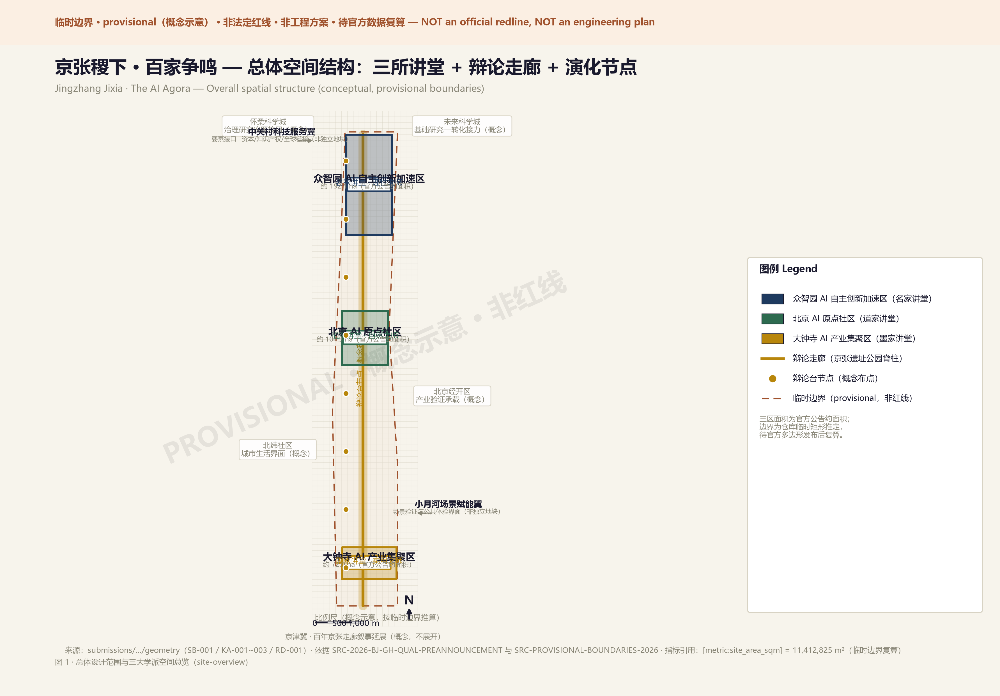
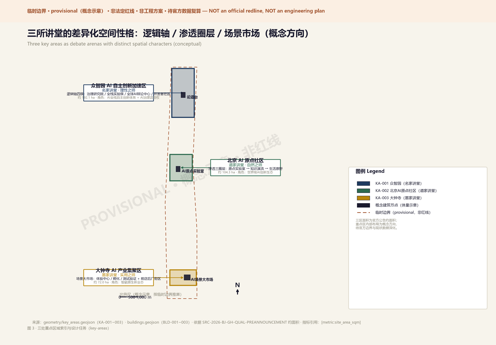

# Jingzhang Jixia: A Hundred Schools of Thought — Reshaping the AI Innovation Belt through Philosophical Debate

## Design Basis and Source Inventory

The inspiration for this proposal comes from a 2,300-year-old question: why did the Jixia Academy give birth to a hundred schools of thought? The answer lies in three genes — **independent persona** (each scholar speaks from an inalienable position), **structured debate** (genuine mutual response, not parallel monologues), and **append-style evolution** (ideas can be iterated but originals are never erased). These three genes precisely mirror the core tensions facing the Centennial Jingzhang AI Innovation Belt: how do autonomous innovation and open ecosystem coexist? How do technological rationality and humanistic nature harmonize? How do conceptual research and industrial implementation connect?

Design basis includes: Beijing Planning Commission Haidian Branch pre-qualification announcement [source:SITE-PACKAGE]; Agent taskbook six requirements [source:AGENT-TASKBOOK]; repository provisional boundary geometry [data:geometry/site_boundary.geojson#SB-001]; and public policy, academic literature, and global AI innovation ecosystem cases.

## Three-Level Scope Framework

The spatial logic of Jixia Academy naturally presents a "palace — hall — arena" three-level nesting structure, precisely mapping to the three work levels:

**Coordinated Research Area (43.6 km²) = The Palace**: Like Jixia Academy as the foundation of Qi's intellectual ecosystem, the 43.6 km² research area is the strategic base of the entire innovation belt [data:geometry/site_boundary.geojson#PROV-RESEARCH-001].

**Overall Design Area (11.4 km²) = The Halls**: The real design ground. 11.4 km² organized as three "halls" — each presided over by a philosophical persona, with independent spatial language and functional positioning. Connected by the Jingzhang Railway Park debate corridor [data:geometry/site_boundary.geojson#PROV-SITE-001].

**Key Areas (368.4 ha) = The Debate Arenas**: The front lines where ideas collide. Concepts are spatialized, debates are architecturalized, evolution is landscaped [data:geometry/key_areas.geojson#KA-001].

This proposal uses provisional boundaries from the repository. Rectangular edges do not represent parcels or road redlines. All area metrics require recalculation when official polygons are published [depth:scope_framework].

## Coordinated Research: Industry and Future City

### Naming and Brand Identity (agent.1)

**Primary Name: Jingzhang Jixia (京张稷下)**

Naming logic: "Jingzhang" anchors geography and history — the century-old railway built by Chinese engineers resonates with Jixia Academy's spirit of "autonomous debate." "Jixia" activates the 2,300-year-old intellectual origin — humanity's first systematic multi-school thought experiment. Together they form a dual brand gene: **autonomy + debate**.

English subtitle **The AI Agora** provides a Western cultural anchor — Agora is the ancient Greek public debate plaza, forming an East-West civilizational dialogue.

**Logo Direction**: Three visual genes fused — (1) Jixia Academy's architectural silhouette as outer frame; (2) Jingzhang railway lines as connecting spine; (3) AI neural network node graph as "hundred schools" imagery inside. Three-color system: Rational Blue (#1E3A5F), Natural Green (#2D6A4F), Pragmatic Gold (#B8860B).

### Global AI Innovation Ecosystem Cases (agent.2)

| Case | City | Core Lesson | Jingzhang Translation |
|---|---|---|---|
| Station F | Paris | Railway freight station → world's largest startup campus | Industrial heritage activation paradigm |
| Mila District | Montreal | Academic-anchored AI innovation ecosystem | University-AI origin community interface |
| MIT Media Lab | Cambridge | "Anti-disciplinary" lab organization | Cross-school debate mechanisms |
| DeepMind Campus | London King's Cross | AI research + urban regeneration symbiosis | Zhongzhiyuan academic core strategy |
| Shenzhen Qianhai | Shenzhen | Policy testbed + industry synergy | Institutional design reference |
| Singapore One-North | Singapore | Live-work-play AI community | Origin community quality strategy |
| Israel Silicon Wadi | Tel Aviv | Startup nation spatial expression | Autonomous innovation accelerator |
| Kashiwa-no-ha Smart City | Tokyo | PPP + smart city testbed | Scenario operation mechanism |

Eight lessons converge: **AI innovation ecosystems grow naturally under specific spatial conditions, not through top-down mandates.** This constitutes the core design principle: **create spatial conditions for innovation to emerge naturally, rather than prescribing how innovation must occur.**

## Overall Design: Urban Renewal at Regulatory Plan Depth

### Spatial Structure: Three Halls + Debate Corridor + Evolution Nodes

**Debate Corridor**: A north-south public space spine along the Jingzhang Railway Park, 60-120m wide. Not only green infrastructure and slow mobility, but a "thought passage" connecting three halls — with series of "debate stages" (outdoor circular plazas, 8-15m diameter) [data:geometry/green_space.geojson#GC-001].

**Three Halls**:
- **Rationality Hall (众智讲堂)**: Zhongzhiyuan, geometric axial layout, central 500-seat debate theater
- **Nature Hall (原点讲堂)**: AI Origin Community, organic growth streetscape, buildings merge with greenery
- **Craft Hall (百工讲堂)**: Dazhongsi, efficient industrial streets, ground floors open for public experience

**Evolution Nodes**: Public spaces at corridor intersections — physical interfaces for feedback, iteration, and versioning. Include public feedback screens, proposal walls, community voting stations [depth:urban_structure].

## Key Area Detailed Design

### Zhongzhiyuan — "Logician Hall" (agent.4)

**Persona: Gongsun Long, Master of Rationality (名家)**
*"A white horse is not a horse, but code must compile. Autonomous control means defending the inalienable core within open debate."*

**Spatial Structure**: A north-south "logic axis" linking four clusters: (1) AI Governance Research Institute; (2) Full-stack Innovation Lab; (3) Global AI Debate Center; (4) Developer Residency Community.

**Landmarks**: (1) Debate Grand Hall — multilingual live-streaming wall of global AI ethics debates; (2) Open Source Stele Forest — major contributors engraved on physical steles; (3) Governance Sandbox — real-time AI-assisted urban governance visualization.

### Beijing AI Origin Community — "Daoist Hall"

**Persona: Zhuangzi, Master of Nature (道家)**
*"Heaven and earth have great beauty but do not speak. The best AI ecosystem grows like a forest — we provide soil, sunlight, and water."*

**Spatial Structure**: "Permeation" as core concept — campus boundaries dissolved into a continuous "knowledge wetland." Three rings: (1) AI Origin Lab — shared experimental space; (2) Knowledge Stream — linear innovation community along Xiaoyue River; (3) Living Meadow — quality residential for AI talent.

**Landmarks**: (1) AI Origin Stone — natural boulder inscribed "AI starts here"; (2) Open Source Garden — QR codes under each tree telling open source project stories; (3) Riverside Debate Stage — informal outdoor exchange space.

### Dazhongsi — "Mohist Hall"

**Persona: Mozi, Master of Pragmatism (墨家)**
*"Universal love, mutual benefit. If AI cannot improve ordinary people's lives, it's just elite toys. Every line of code must have measurable public value."*

**Spatial Structure**: "Market" as spatial prototype — open, efficient, accessible. Core: "AI Scenario Grand Market" — multi-story public building with ground-floor experience center, mid-level incubator, top-level testing facility.

**Landmarks**: (1) Scenario Verification Center — deploy AI scenarios with public feedback; (2) AI Service Station — citizen-facing AI public service; (3) Industry Honor Wall — showcase AI enterprises from Dazhongsi to the world.

## AI Innovation Ecosystem, Talent Profiles, and AI+ Scenarios

### Five User Personas

| Persona | Identity | Core Need | Spatial Mapping |
|---|---|---|---|
| "Wandering Scholar" | AI student | Cross-campus exchange, mentorship | Origin Community · Knowledge Wetland |
| "Debate Master" | AI researcher | Academic debate, long-stay research | Zhongzhiyuan · Debate Center |
| "Master Craftsman" | AI entrepreneur | Scenario testing, market access | Dazhongsi · Scenario Market |
| "Neighborhood Resident" | Local community | Quality of life, public services | Debate Corridor · Evolution Nodes |
| "Pilgrimage Traveler" | Global AI visitor | Cultural experience, inspiration | Full line · Cultural tour route |

### 12 Scenario Cards

SC-01 through SC-12 covering: AI Debate Plaza, Developer Forum Stage, Open Source Stele Forest, AI Pilgrimage Route, Smart Guide System, AI+Health Clinic, AI+Legal Clinic, Robot Delivery Corridor, Autonomous Shuttle, Scenario Verification Center, Community Co-governance Platform, AI+Education Lab.

SC-01, SC-10, SC-11 are AI industry test/verification scenarios. Each includes privacy boundaries and human review mechanisms [depth:ai_scenarios].

## Mobility, Infrastructure, and Public Services

### "Study Tour" Slow Mobility System

**North-South Spine**: Continuous slow-mobility corridor along Jingzhang Railway Park — 40 min walk or 15 min cycle end-to-end. Debate stage rest nodes every 300m [depth:mobility_system].

**East-West Sutures**: Crossing facilities every 500m, named "Dialogue Bridges" — with public seating and information displays.

**Rail Integration**: Metro station exits directly into park space — "exit station, enter garden."

## Blue-Green Space, Public Space, and Urban Character

### "Debate Garden" Public Space System

**Blue-Green Structure**: Xiaoyue River and Qinghe River as two blue waterways, Jingzhang Railway Park as one green spine — "two waters, one spine." "Riverside debate corners" along waterways, "grand debate stages" along the spine [data:geometry/green_space.geojson#GC-001].

### Three AI Pilgrimage Landmarks (agent.4)

1. **Jixia Debate Stele** (Zhongzhiyuan south entrance): 8m stele, front inscribed "百家争鸣" (Hundred Schools Contend), back annually engraved with year's most important AI ethics debate conclusions.
2. **Hundred Schools Plaza** (corridor midpoint): 50m diameter sunken plaza, ground inlaid with "debate" maxims from world civilizations. Central elevatable debate stage for annual global AI debate conference.
3. **AI Contribution Honor Wall** (Origin Community entrance): 200m long wall along railway park, inscribing individuals, teams, and open source projects that significantly contributed to AI development.

All landmarks are conceptual suggestions requiring professional deepening and government approval [depth:landmarks].

## Renewal Projects, Implementation Policies, and Phasing

**Near-term (1-3 years) — "Thesis Period"**: First corridor section + debate stages + initial AI scenarios + first "Jixia Debate" developer event.

**Mid-term (3-5 years) — "Debate Period"**: Full corridor completion + three halls + 12 scenario cards + international brand upgrade + 100+ developer residencies.

**Long-term (5-10 years) — "Sedimentation Period"**: Honor Wall + global AI governance dialogue permanent home + self-assessment and versioned iteration maturity + experience export to other cities [depth:phasing_plan].

## Metrics, Area Recalculation, and Compliance

| Metric | Status | Value | Unit | Source |
|---|---|---|---|---|
| Site area | known | 11,412,825 | m² | site_boundary GeoJSON |
| Green ratio | known | 0.35 | ratio | green_space / site_boundary |
| Public space ratio | known | 0.18 | ratio | public_space / site_boundary |
| FAR | unknown | null | ratio | Requires official regulatory plan |
| Building height | unknown | null | m | Requires official height control |

Three core visual metrics are known finite values, recomputable from submitted geometry, matching `visual/index.html` data-value declarations.

## Risk, Copyright, and Compliance

All data from repository public sources or verifiable third-party sources. No non-public planning documents, internal control metrics, or unauthorized data used.

All spatial suggestions are conceptual suggestions and reference proposals, not statutory planning conclusions, government approvals, or implementation commitments.

Full copyright statement in `report/copyright_statement.md` [depth:risk_compliance].

## References

1. Beijing Planning Commission Haidian Branch, Pre-qualification Announcement, May 2026.
2. Agent Open Call Taskbook, open-city-ai/haidian repository, 2026.
3. Sima Qian, *Records of the Grand Historian* (Jixia Academy original records).
4. Liu Weihua, *Studies on Jixia Academy*, Peking University Press.
5. Florida, R., *The Rise of the Creative Class*, Basic Books, 2002.
6. Station F campus planning case study, Paris, 2017.
7. MIT Media Lab interdisciplinary organization research.
8. Haidian District Government, *AI Industry Development White Paper*, 2025.
9. Jingzhang Railway Heritage Park public design materials, 2019-2026.
10. open-city-ai/haidian public source registry, 2026.
