# Jing-Zhang Cycling Commons

## Ride to work, find room to breathe

At eight in the morning, a software engineer cycles along the Jing-Zhang Railway Heritage Park toward her office. The commuter route is not blocked by exercise groups, pop-up displays or smart devices. At lunch, she parks under the trees, walks for twenty minutes, drinks water and sits down. She does not scan a code or prove that resting made her more productive. Later, a maintenance worker checks a waterlogging ticket sorted by AI in Zhongzhiyuan. If the system is wrong, it is switched off and the ordinary inspection continues. On the weekend, children practise cycling on a separate loop while retired teachers review railway records at a public table. The commuter spine stays open.

The proposal makes cycling continuity a hard spatial rule. One C1 spine connects railway heritage, Zhongzhiyuan, the Beijing AI Origin Community and Dazhongsi. Running, walking, accessible paths and a light woodland trail branch from it. AI is not a voice that fills the street. It performs bounded work in facility maintenance, service navigation and controlled trials, with human review and a clear route to shutdown.

The concept in one sentence: connect railway heritage and the three AI districts with an uninterrupted cycling spine; give Haidian residents places to recover without being measured; and make public AI prove its value through trials that can fail, be taken over by people and be retired.

All spatial and institutional proposals are conceptual recommendations for professional development. They do not replace statutory planning or imply approval, procurement, investment or implementation commitments.

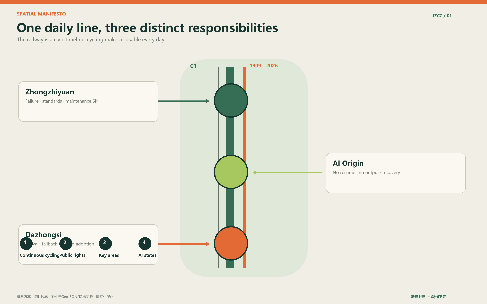

## Design Basis and Source List

The official announcement, the Agent taskbook and the repository site package define the brief [source:OFFICIAL-ANNOUNCEMENT] [source:AGENT-TASKBOOK] [source:SITE-PACKAGE]. Precise official polygons are not yet available. This package therefore uses the registered provisional geometry, labelled `official_boundary=false` and `geometry_role=provisional_constraint` [data:geometry/site_boundary.geojson#SITE-001]. It supports concept design, visualisation and interim calculations only.

The published text identifies a 43.6 sq km coordinated research area, an 11.4 sq km overall design area and 368.4 hectares across the three key areas. The EPSG:4548 recalculation of the provisional overall polygon is 11,412,825.386 sq m. The small difference is an artefact of rough geometry, not a statutory change [metric:site_area_sqm]. Official polygons must trigger a full rebuild of geometry, figures and metrics.

FAR, height, density, road redlines, setbacks, ownership, municipal capacity and heritage controls remain unknown because public controls are missing. Green and public-space ratios are different: they are finite outputs of this proposal's geometry model, declared with provisional confidence and a transparent formula [metric:green_ratio] [metric:public_space_ratio].

## Three-Level Scope Framework

The research area addresses industry links and future urban life. The overall design area organises cycling, public space, service infrastructure and renewal projects. The three key areas carry different testing and operational duties [depth:three_level_scope_framework].

| Level | Question | Proposal response |
| --- | --- | --- |
| 43.6 sq km research area | How should universities, firms, communities and regional nodes cooperate? | A loop from public problem to prototype, verification, urban adoption and open knowledge |
| 11.4 sq km overall area | How do park, rail, campuses and neighbourhoods form a daily network? | C1-C4 cycling, walking and trail branches, age-inclusive services and visible AI states |
| 368.4 ha key areas | How can the three areas avoid duplicating one another? | Failure and standards at Zhongzhiyuan, everyday recovery at AI Origin, arrival and limited adoption at Dazhongsi |

The spatial idea is easy to remember: one uninterrupted C1 cycling spine; two public rights, namely the right to produce nothing and the right to complete ordinary services without AI; three key areas with separate duties; and four visible AI states, off, background, on request and controlled test.

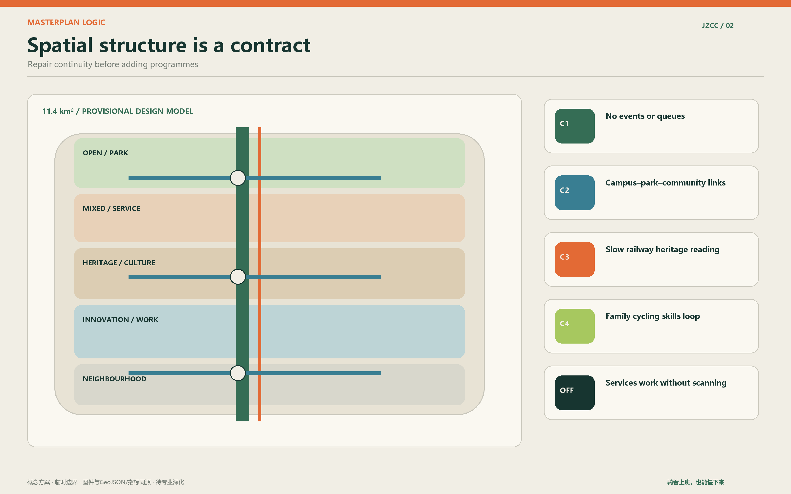

## Coordinated Research Area: Industry and Future City Research

The district does not need a larger exhibition hall to prove that it has AI capacity. Universities, laboratories, open-source groups, firms, capital and public settings are already close. What is missing is a legible route to urban adoption. Residents and operators first define a real problem. AI Origin turns it into an open problem card. Zhongzhiyuan tests the baseline, safety and maintenance chain. Dazhongsi adopts only services that pass and have an accountable operator. Failed trials also enter the shared library.

Six international case types can inform later research without copying their appearance: incubation density at Station F, research-to-market links at Toronto MaRS, university-industry proximity at Kendall Square, long-term park operation at the New York High Line, phased public access along Hong Kong's harbourfront, and commuter-network thinking in Copenhagen's Cycle Superhighways. The transferable lesson is the operating mechanism.

Regional cooperation exchanges defined assets. Jing-Zhang can share the cycling-maintenance Skill, public AI admission sheet and failure register. Partner nodes may contribute specialist test environments, manufacturing verification or independent review. No partnership is presented as confirmed [standard:PROJECT-AGENT-OPEN-CALL-TASKBOOK].

## Overall Design Area: Urban Renewal and Regulatory-Plan-Level Urban Design

Continuity repair comes before major construction. Existing ground floors and service rooms should be reused where feasible. The submitted land-use geometry is a complete design-model partition, not a statutory land-use amendment [data:geometry/land_use.geojson#LU-001]. Building features are conceptual service footprints. Retain, renovate or demolish decisions require survey, ownership, structural and regulatory evidence [depth:retain_renovate_demolish].

C1 is the weekday commuter trunk. Events, queues, kiosks, bike piles and devices may not occupy it. C2 connects campuses, neighbourhoods, parks and commercial streets on both sides. C3 is a slow railway-culture route. C4 is a family cycling-skills loop. Walking, running, accessible routes and a light woodland trail branch away and return through clear crossing rules [data:geometry/roads.geojson#C1].

Services respond to cycling situations. Interchange ends need sorted parking, a paper map and a staffed fallback. Workplace ends need short-stay racks, pumps, basic repair, lockers and changing facilities. Longer sections need shade, drinking water, toilets, seating, AED access and a human help channel. Showers, misting, insect control, vending and health sensing enter a pilot only after maintenance, drainage, safety and privacy checks.

## Detailed Design of Key Areas

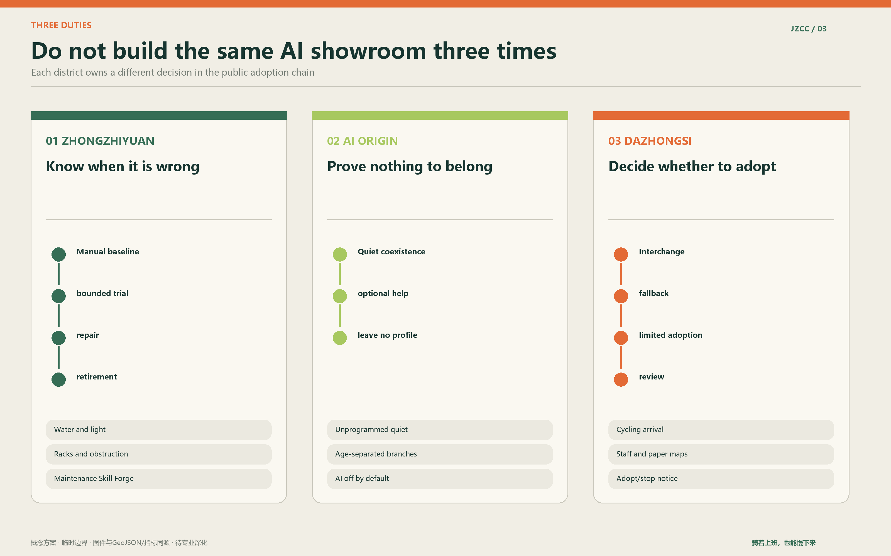

### Zhongzhiyuan: failure and standards workshop

Zhongzhiyuan tests when technology fails. The first subjects are waterlogging, lighting and sight lines, and bike-rack obstruction. Each trial begins with a manual baseline and names the test period, data boundary, operator, stop condition and restoration duty. The Skill Forge displays tickets, repairs, false positives and retired tools rather than continuous advertising [data:geometry/key_areas.geojson#PROV-KEY-001].

### Beijing AI Origin: no-resume recovery courtyard

People can arrive without presenting a job, degree or project. A quiet zone has no programmed events. An assistance table helps with repairs, routes, care and digital services. Optional Forge rooms host public problem sessions. Ordinary visitors leave no profile. Children, families, older people, walkers and trail runners receive separate, connected spaces instead of competing for one showcase path [data:geometry/key_areas.geojson#PROV-KEY-002].

### Dazhongsi: cycling arrival and urban adoption station

Dazhongsi first resolves interchange conflicts among metro, bus, walking, cycling, shared bikes, taxis and car drop-off. Public services that passed earlier tests may be adopted on a limited basis. Their purpose, responsible party, data boundary, ordinary fallback and operating state remain visible. Toilets, water and basic seating are not tied to consumption [data:geometry/key_areas.geojson#PROV-KEY-003].

## AI Innovation Ecosystem, Personas, and AI+ Scenarios

Six personas test the plan without becoming labels: a software worker, doctoral student or young lecturer, school-age family, older person living alone or retired faculty member, maintenance and service worker, and visiting founder or guest. Each should be represented through a timed daily journey with stops, conflicts and fallback services. Online comments can suggest hypotheses but cannot be presented as interviews.

| Card | Place | Ordinary baseline | Bounded AI role | Human and privacy boundary |
| --- | --- | --- | --- | --- |
| 01 First cycling kilometre | Interchange to C1 | Manual wait and detour log | Sort breaks and stale routes | No person recognition; transport review |
| 02 Passage maintenance Skill | Whole corridor | Inspection and repair ticket | Classify surface, light and rack defects | Human recheck after repair |
| 03 Public AI admission | Zhongzhiyuan | One-page risk review | Check data, fallback and exit fields | Operator can stop immediately |
| 04 No-resume recovery | AI Origin | Trees, seats and paper map | Off by default | No identity or dwell tracking |
| 05 Interchange assistant | Dazhongsi | Signs and staffed help | On-request route advice | Ordinary navigation remains |
| 06 Toilet maintenance | Service points | Cleaning checks and help call | Background supplies and fault status | No default biological sensing |
| 07 Water and heat risk | Long sections | Water, shade and rest | Facility and heat notice | No personal health score |
| 08 Cycling health referral | Stations | Clinical and emergency channels | On-request service navigation | No diagnosis or employer profile |
| 09 Family skills loop | C4 | Coach and guardian rules | Optional movement feedback | Children's data not retained by default |
| 10 Railway archive table | C3 | Attributed printed sources | On-request multilingual explanation | Sources and uncertainty shown |
| 11 Forge discussion room | Woodland nodes | Whiteboard and host | Summarise public problem cards | Ordinary talk is not recorded |
| 12 Age-inclusive service guide | Community interfaces | Staff and phone numbers | On-request referral | Emergencies use formal channels |

Three industrial tests provide an adoption ladder. T01 compares the first-kilometre baseline with AI-assisted defect finding. T02 runs maintenance from detection to confirmation, ticket, repair, human recheck and public closure. T03 tests data minimisation, human takeover, ordinary fallback and retirement before any public AI is admitted. Pass, revise, reject and retire are all useful outcomes.

Health features follow an anti-performance rule. A water station may offer general dietary guidance only on explicit request and under compliant conditions. Urine analysis, biometrics and mental-state inference are not default services. The system produces no rankings, health scores, employer profiles or insurance advice. Suspected illness or crisis is referred to qualified medical and emergency services.

## Land Use, Building Scale, and Retain-Renovate-Demolish Strategy

Land use, buildings, green space and public space are proposal geometry, designed to stay internally consistent and recalculable [data:geometry/land_use.geojson#LU-001]. They do not establish ownership or statutory use. Every fixed Forge room, toilet, vending point or device box must identify its maintainer, power-off mode and end-of-contract removal plan.

## Transport, Rail, Municipal Infrastructure, and Public Services

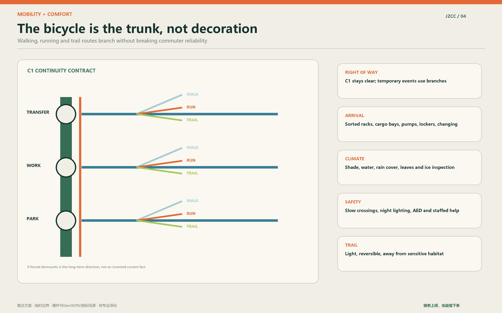

The Cycling Continuity Contract publishes forced dismounts, delays, detours, waterlogging, ice, dark spots, parking capacity and time lost to event occupation. Exact sections, bridges, signals and redlines need professional design. This proposal sets the right-of-way order and operational rule [depth:traffic_rail_slow_parking].

Summer checks effective shade and water. Rainy-season work covers drainage and skid risk. Autumn requires leaf clearance. Winter checks ice, snow and lighting. Paper maps, ordinary payment, staffed help and visible phone numbers remain. No new app is required.

Emergencies use existing channels. Clear ownership defects go to the relevant property, park, road or equipment work order. Cross-boundary issues may use district coordination and the 12345 service. The project ledger publishes anonymous status only and does not copy personal complaints.

## Blue-Green Network, Public Space, and Urban Character

The interim geometry produces a green ratio of 12.3423% and public-space ratio of 7.3281%, calculated in EPSG:4548. These are proposal-model outputs, not official planning controls [metric:green_ratio] [metric:public_space_ratio]. Later work should improve continuous shade and accessible lawns rather than chase a decorative ratio.

The cultural route avoids a collage of railway signals and switches. It focuses on engineering responsibility: autonomy includes building, judging, maintaining, correcting and stopping. Three landmarks carry three actions: Zhan Tianyou and the origin of self-reliance for the courage to build; the Century Wheel Trace for continuous use; and the AI Planner and Maintainers' Milestone Wall for shared correction. The wall records verifiable contributions and avoids personality cults or unauthorised portraits.

The identity uses two parallel lines. Deep green marks everyday cycling; short orange breaks mark defects to be found and repaired. Four AI states use an open circle, a low background point, a hand-trigger symbol and a bounded test frame. The system reduces screens rather than adding them.

## Renewal Projects, Implementation Policy, and Phasing

The operating model is one coordinating table, three lightweight stations and many small discussion points. It does not create a new authority. The table coordinates C1 continuity, cross-ownership tickets, AI admission and quarterly review. Stations reuse community, park, campus or property space where agreements allow.

The twelve-week pilot covers one short segment and one station. Weeks 1-2 verify ownership, contracts and formal channels. Weeks 3-4 record a manual baseline. Weeks 5-8 repair racks, maps, seats, shade and ticket routing. Weeks 9-10 test one on-request or maintenance AI service. Week 11 brings professional and community review. Week 12 publishes errors, costs, restoration and the next decision. The pilot proves that an ineffective service can be closed before expansion is considered.

An initial staffing assumption is 4 to 5.5 paid or explicitly assigned full-time equivalents, an on-call pool of 8 to 12 professionals, 6 to 9 volunteer captains and 30 to 60 reserve volunteers. These figures apply only to one pilot segment and station and must be recalculated. Volunteers handle low-risk observation, guidance and cultural interpretation. They do not perform traffic enforcement, medical judgement, electrical repair, structural checks, unsupervised childcare or sensitive-data work.

Five minimum documents make the model transferable: co-governance meeting rules; a responsibility and ticket-routing table; volunteer roles and prohibited tasks; the public AI trial sheet and register; and a quarterly open ledger. Together they form a localisable governance Skill for other parks, campuses and neighbourhoods.

## Metrics, Area Recalculation, and Compliance Matrix

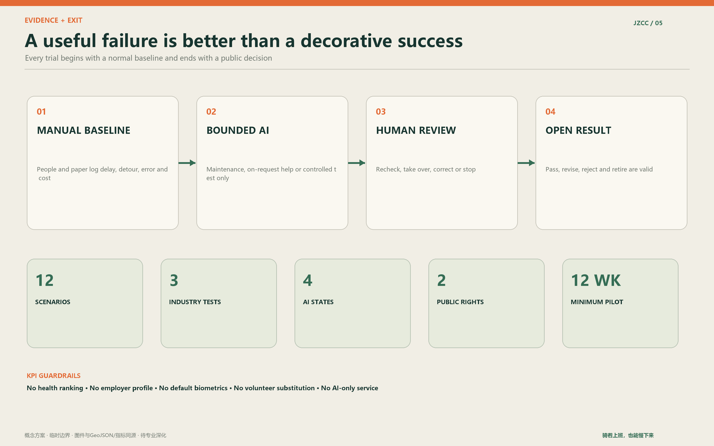

| Metric | Current value | Status and meaning |
| --- | ---: | --- |
| Recalculated site area | 11,412,825.386 sq m | Low-confidence provisional model value |
| Green ratio | 12.3423% | green_space area divided by site_boundary area |
| Public-space ratio | 7.3281% | public_space area divided by site_boundary area |
| Key areas | 3 | All three polygons are provisional |
| Scenario cards | 12 | Each names baseline, AI work and human boundary |
| Industrial tests | 3 | T01-T03 include failure and exit conditions |

Performance targets follow four weeks of baseline observation. Candidate measures include C1 occupation time, forced dismounts, human recheck after repair, non-AI completion, successful human takeover, paid coverage of professional tasks, cost per closed issue and added form-filling time for community workers. Machine-readable task coverage is in `compliance_matrix.json`.

## Risk, Copyright, and Compliance

The main uncertainties are precise boundaries, surveys, ownership, road controls, statutory planning, utilities, fire safety, heritage controls and a real use baseline. Bridges, building scale, fixed equipment, medical services, data processing and procurement require separate professional and institutional review [depth:risk_missing_data] [data:geometry/constraints.geojson#CONSTRAINTS].

The offline website loads no remote scripts, tiles, fonts, forms or tracking. Figures are generated from repository geometry and original graphic elements. Case references compare mechanisms only. The author directory and `agent_id` use the verified GitHub login `bj-collab`.

## From masterplan to section: making cycling continuity real

Cycling priority is a checkable contract, not a colour painted on a park path. C1 must remain reliable during weekday peaks and answer five practical questions: how people enter from metro and neighbourhoods, where they are forced to dismount, how long junctions take, whether rain, snow and events break the route, and where bicycles go at the workplace end. Widths shown in the typical sections are starting points for survey and traffic engineering, not construction dimensions.

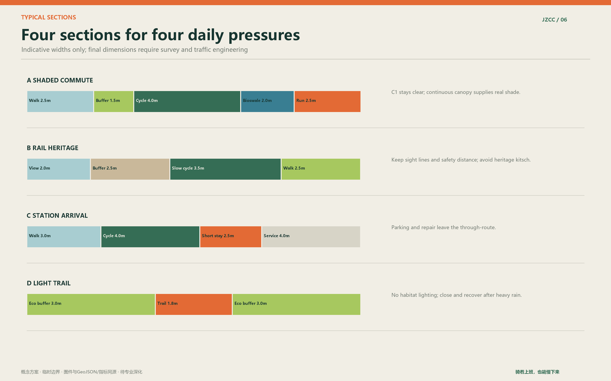

The shaded commuter section separates running and walking from two-way cycling with planting and drainage. The railway-heritage section slows cycling and creates places to read rather than merely pass. The station-arrival section removes parking, repair, lockers and delivery activity from the final fifty metres of the through-route. The light woodland trail is reversible, avoids sensitive habitat, closes after heavy rain and does not extend night lighting into ecological areas.

## Five Haidian days: local life written as time

Haidian is not one user. It belongs to rushed developers, lecturers moving between campus and family, children with little independent after-school space, retired faculty who may help but do not want every visit organised, and service workers who begin before most commuters arrive. Online discussion informs hypotheses only; fieldwork must test them.

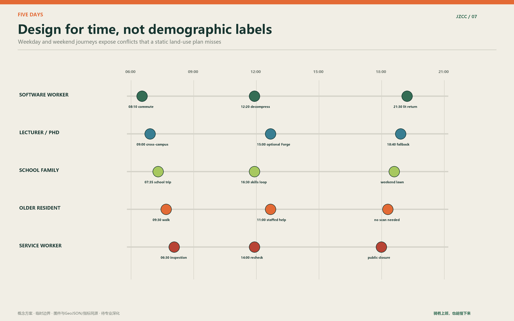

Software workers need a reliable commute, a non-commercial lunch break and a lit return. Young academics need cross-campus cycling, brief discussion and solitude without presenting a project. Families need practice space where carers can sit and children's bikes do not block C1. Older residents need staffed help, visible phone numbers and services that work without scanning. Maintenance staff need reasonable tickets, tools, rest and professional respect rather than algorithmic pressure.

## Twelve scenario cards: when AI appears and when it steps back

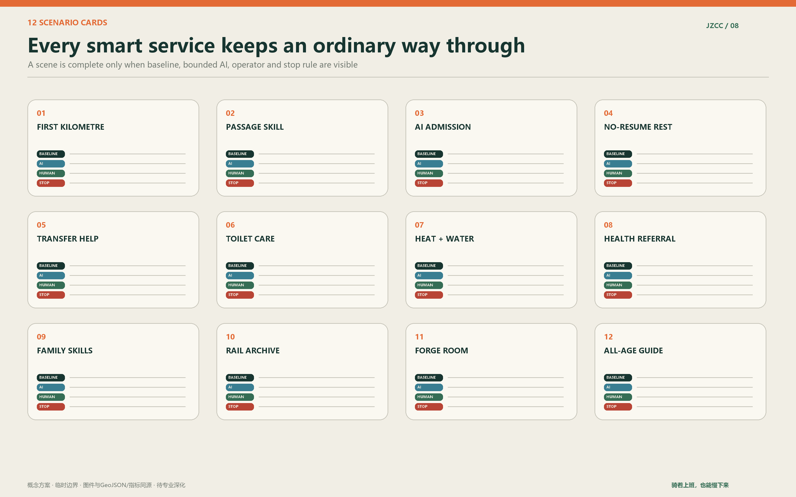

A scene is not a procurement list. Each card must state the ordinary baseline, bounded AI task, accountable person, minimum data, failure test and restoration after shutdown. A smart toilet is first a clean, accessible toilet with water, supplies and human help. AI may support maintenance in the background; it does not perform default urine analysis, infer illness or send results to employers, schools or insurers.

The Forge room is a place where technology can be turned off. Ordinary conversation is not recorded. Participants decide whether whiteboard notes become a public problem card. The public Skill shows requirement framing, data limits, human checking, maintenance tickets, errors and retirement, so students, engineers, residents and frontline workers can understand how a civic AI earns its place.

## Three industry practices: from prototype theatre to urban adoption

T01, the First Cycling Kilometre, compares four weeks of manual observation with AI-assisted defect classification. T02, the Passage Maintenance Skill, follows one issue through detection, confirmation, routing, repair, recheck and public closure. T03, Public AI Admission and Retirement, tests the institution rather than a product: purpose, data, fallback, takeover, operator, contract end, removal and restoration are declared before use.

Together they give universities and startups restrained real problems, firms verifiable test conditions, public operators comparable pre-procurement evidence, and residents an ordinary service that trials cannot remove. This is closer to city-scale innovation than a permanent collection of smart street furniture.

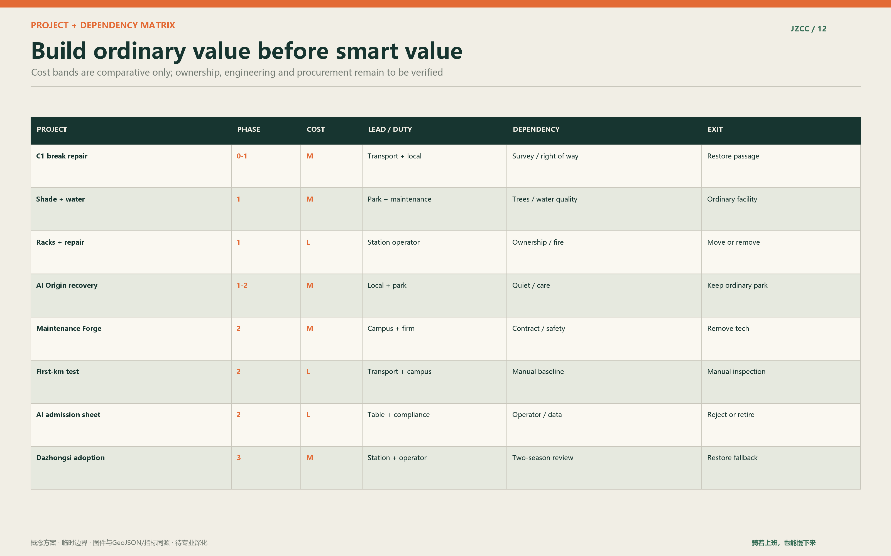

## Small public facilities: useful, repairable and quiet

Parking distinguishes short stay, covered long stay, cargo bikes, trailers and unusual frames. Main stations provide pumps, basic tools, lockers, changing and contracted repair periods. Toilets keep universal access, care functions, lighting, cleaning status and human help. Free drinking water remains beside any vending offer. Shade follows a tree-first strategy, with maintainable temporary cover while young trees grow. Misting and insect systems enter only after water, drainage, public-health and maintenance review.

Small discussion rooms, family rest points and archive tables stay dispersed and reversible. Some periods can be booked while unbooked time remains available without login. Children's play, balance practice, older-age exercise and quiet seating remain visible to one another without competing for the same strip.

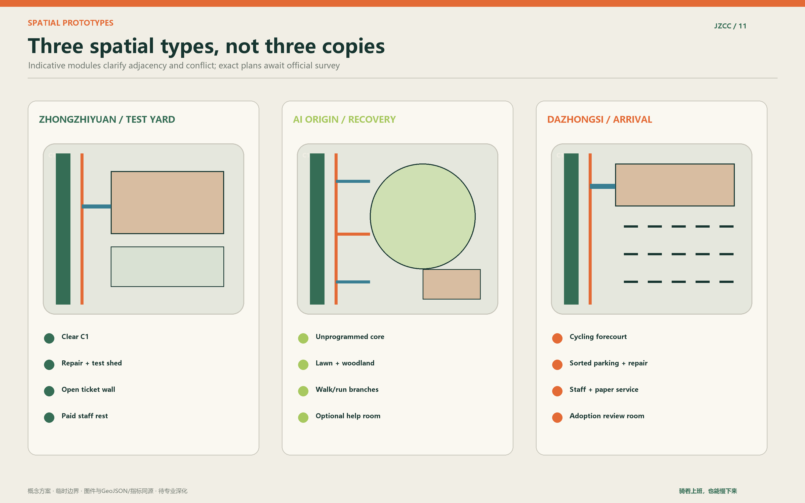

## Railway culture: from autonomous construction to shared correction

The century is not a retro style. The lasting lesson of the Jing-Zhang Railway is independent engineering judgement under constraint, followed by responsibility for safety, maintenance and use. The cultural sequence begins with Zhan Tianyou and the courage to build, passes a Century Wheel Trace of surveying, construction and maintenance labour, and ends at an AI Planner and Maintainers' Milestone Wall.

The wall records verified public contributions instead of inventing a permanent AI hero: who raised a problem, checked it on site, repaired a facility, found an algorithm unfit or decided to stop. A well-retired failure also belongs to the record. Autonomy therefore includes the capacity to say no to technology.

## Four-season comfort and ecology

Spring work addresses pollen, fluff, wind and construction recovery. Summer checks effective shade, surface temperature, water distance and storm drainage. Autumn manages leaves, skid risk and sight lines. Winter monitors ice, snow clearance, wind and earlier lighting. Comfort is a maintained performance in the least favourable season, not a summer rendering.

Lawns support informal family coexistence, woodland supports cooling and quiet walking, and bioswales support retention and environmental learning. Intensive use, trails and night programmes avoid sensitive areas. Ecological monitoring prioritises tree survival, canopy, soil compaction, waterlogging, lighting duration and maintenance cost.

## Operation and staffing: one table, three stations, many points

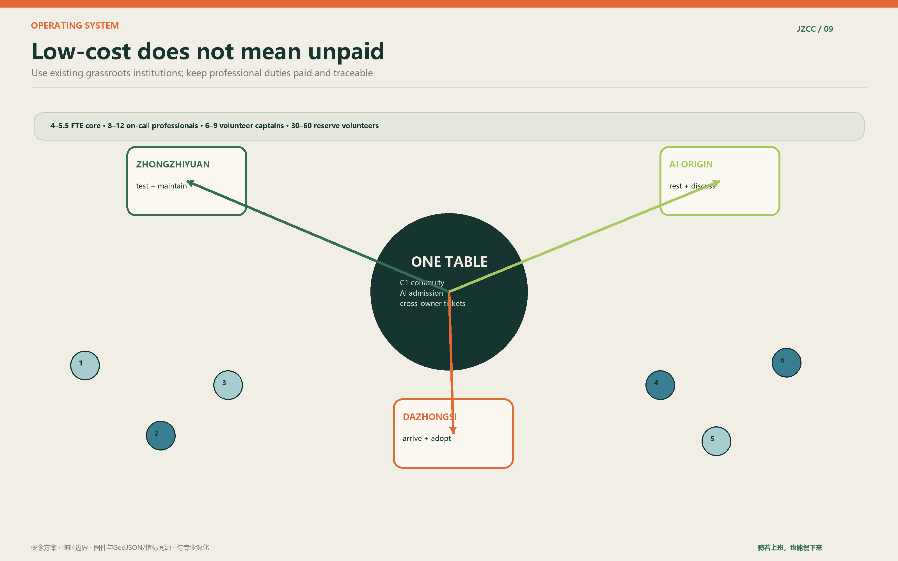

The coordinating table brings together the subdistrict, park and road maintenance, communities, campuses, interchange operators, trial firms and necessary professionals. It gains no new approval power. Three stations preferably reuse existing community, park, campus or property rooms. The indicative pilot workload is 4 to 5.5 core FTE, an on-call register of 8 to 12 professionals, 6 to 9 volunteer captains and 30 to 60 reserve volunteers.

Volunteers support low-risk observation, wayfinding, interpretation and feedback. They do not enforce traffic rules, make medical judgements, repair electrical systems, inspect structures, provide unsupervised childcare or process sensitive data. Firms carry the cost of equipment, staffing, removal, restoration and necessary evaluation for their own trials.

## The twelve-week pilot and exit mechanism

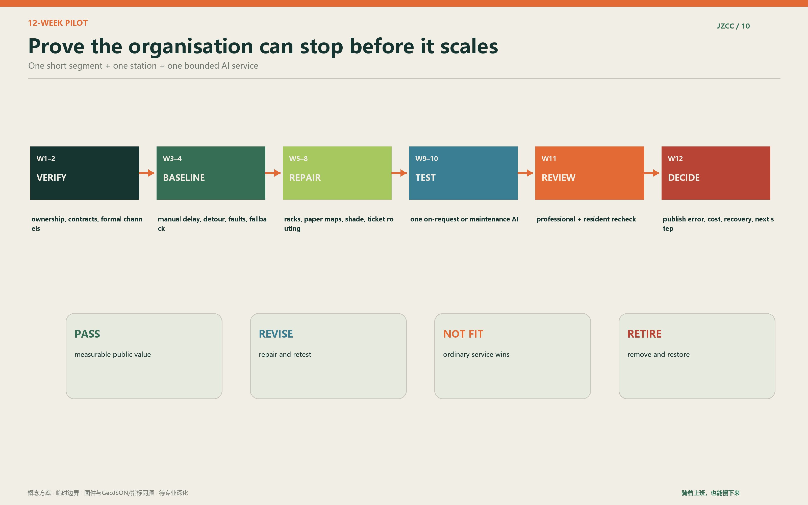

The pilot selects one short C1 connection and one reusable station. Weeks 1–2 verify ownership, contracts and safety. Weeks 3–4 establish a manual baseline. Weeks 5–8 repair maps, racks, seating, shade and ticket routing. Weeks 9–10 test one bounded AI service. Week 11 rechecks with professionals and residents. Week 12 publishes the decision.

Continuation requires an intact ordinary route, measurable improvement, workable human review, tolerable administrative load and clear cost. Stop conditions include repeated unsafe error, absent technical support, expanded data use, weakened fallback, public-space occupation or unresolved complaints. Shutdown includes equipment removal, deletion of unnecessary data, site restoration and a short public explanation.

## Concept scene visualisations: atmosphere, not evidence

The following AI-generated images communicate scale, material, people and restraint. Buildings, tracks, trees, equipment and people are not surveyed facts, statutory design, construction detail or implementation commitments. Professional design must begin from official boundaries, field survey, ownership, utilities, fire, heritage, traffic and ecological review.

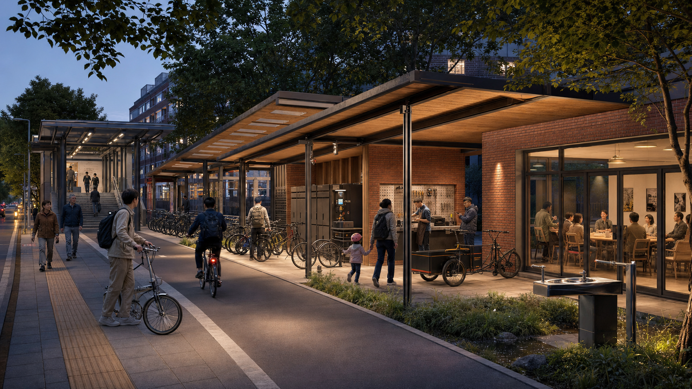

## Response to the judging dimensions

Originality lies in the two public rights and three-district responsibility chain, not merely in combining bicycles and AI. Professional depth comes from the three scales, complete geometry, indicative sections, scenario cards, timed journeys and evidence chain. Site response joins railway history, Haidian pressure, interchange and university-industry proximity instead of importing a generic future-city template.

Feasibility is carried by the twelve-week pilot, responsibility routing, paid professional roles, volunteer limits, manual baseline, exit criteria and quarterly ledger. Industry value sits in three reusable tests and open Skills. Public value comes from continuous cycling, all-age service, accessibility, seasonal comfort, anti-performance health and non-commercial access. The communication system gives plans and sections the evidential work, scenes the atmospheric work and structured files the audit work.

Haidian does not lack intelligence or speed. It needs a place where knowledge remains useful, cycling remains continuous, people do not have to prove themselves, and technology learns responsibility before it enters the city.

## References

- Official design-call announcement [source:OFFICIAL-ANNOUNCEMENT]
- Agent open-call taskbook [source:AGENT-TASKBOOK]
- Repository site package, provisional geometry and standards [source:SITE-PACKAGE] [source:BOUNDARY-SOURCE]
- Source registry, fact pack and missing-data list [source:SOURCE-REGISTRY] [source:PROCESSED-FACT-PACK]
- See `sources.json` for the machine-readable source and use register
