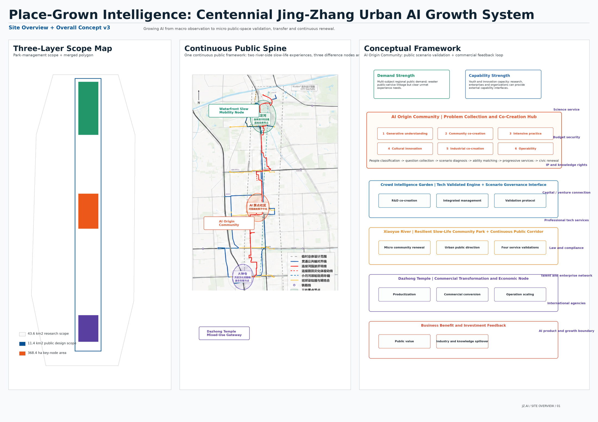
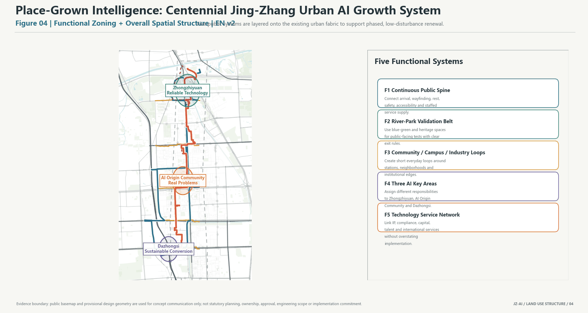
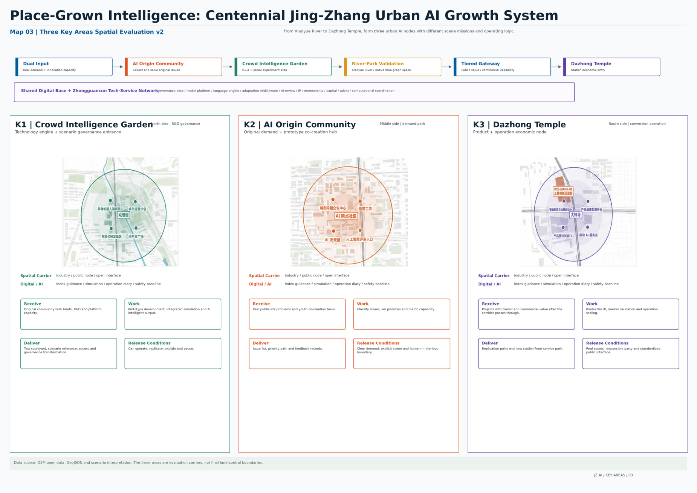
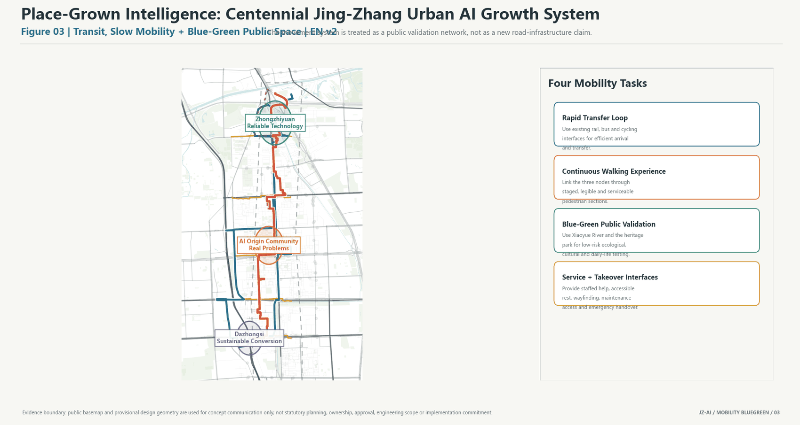
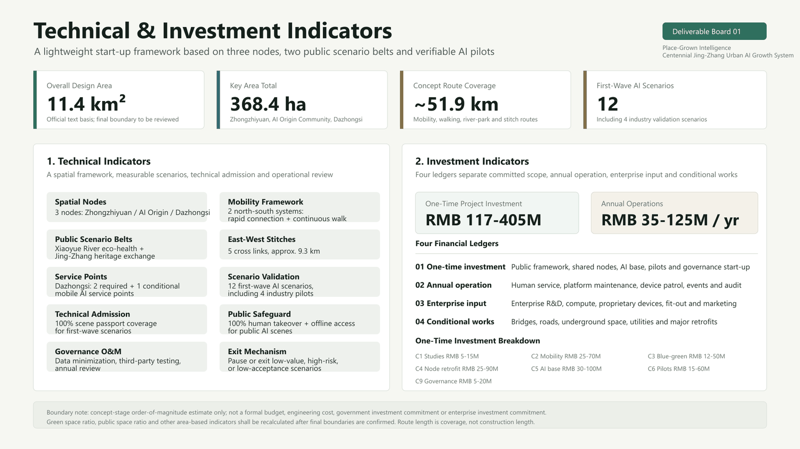

# Place-Grown Intelligence: Centennial Jing-Zhang Urban AI Growth System

## Design Basis and Source List

This proposal uses the official announcement, the agent taskbook, the site package, the source registry, and the processed fact pack as its evidence base [source:OFFICIAL-ANNOUNCEMENT] [source:AGENT-TASKBOOK] [source:SOURCE-REGISTRY]. The current boundary is the provisional boundary supplied through the official repository. It supports generation, review, and discussion, but is not an official redline, approval basis, or precise-area basis [data:geometry/site_boundary.geojson#SITE-001].

The core position is simple: grow AI intelligence from local urban problems, so the city becomes intelligent because it is grounded in place. This is not a one-time technology exhibition corridor. It is a traceable, reviewable, human-takeover-ready, and sustainable urban AI growth system that connects community problems, Haidian innovation capacity, public-space validation, and industrial conversion.

## Three-Level Scope Framework

The three scope levels carry different responsibilities. The coordinated research area studies the AI industrial ecosystem, future urban form, talent attraction, and international activities. The overall design area translates the corridor around the Jing-Zhang Railway Heritage Park into urban renewal, mobility, municipal support, public space, and character strategies. The detailed key areas test whether Zhongzhi Park, the AI Origin Community, and Dazhongsi can reach detailed design depth [standard:PROJECT-OFFICIAL-ANNOUNCEMENT] [depth:three_level_scope_framework].

The design is organized as one urban AI growth chain: origin intake, Zhongzhi development, river-park validation, and Dazhongsi conversion. Residents, young people, visitors, enterprises, and operators raise real problems through staffed desks, co-creation tables, and public terminals. Research teams and enterprises turn those problems into prototypes and pass rights, data, safety, human-takeover, and exit-condition review. Xiaoyue River and the heritage park provide parallel real-world environments. Validated projects then enter either public continuation or commercial scaling.

## Coordinated Research Area: Industry and Future City Research

The coordinated research area is not another closed industrial park boundary. It is an innovation chain that connects university sources, open collaboration, enterprise conversion, public experience, and international communication. The AI Origin Community receives problems; Zhongzhi Park makes technology reliable; Xiaoyue River and the Jing-Zhang Railway Heritage Park validate services in real scenes; Dazhongsi classifies public and commercial conversion; and a compliant public AI return mechanism supports the next round of public-service renewal.

The future-city idea is not to fill nine kilometers with AI devices. It layers five functional systems onto the existing city: a continuous public framework, a river-park public validation belt, short loops around communities, campuses, and industry, three AI focus areas, and the Zhongguancun technology service network. These systems translate AI capacity into space, service, responsibility, and operating rules [depth:overall_spatial_structure].

## Overall Design Area: Urban Renewal and Regulatory-Plan-Level Urban Design

The overall design area follows a low-disturbance renewal strategy. Reuse existing stations, roads, open spaces, and adaptable buildings first. Start with markings, wayfinding, movable facilities, active ground floors, and small public-space repairs. Scenario equipment must be replaceable and removable, and failed pilots must return the place to normal public use. Land use, buildings, roads, green space, public space, and phasing are expressed as GeoJSON so metrics can be recalculated [data:geometry/land_use.geojson#LU-001] [data:geometry/buildings.geojson#BLDG-001] [metric:building_footprint_area_sqm].

The first condition for transport and municipal support is not screens or algorithms, but real access, maintenance, and human takeover. The proposal uses two north-south systems: fast connection and continuous walking experience. AI infrastructure is split into four layers: physical connection, digital platform, trusted governance, and continuous operations. Road redlines, tunnels, pipelines, building height, FAR, and investment approvals remain concept recommendations until official planning and engineering information is available.

## Detailed Design of Key Areas

The three key areas are not isolated districts. They are three responsibility nodes in the same urban AI growth chain [data:geometry/key_areas.geojson#PROV-KEY-001] [data:geometry/key_areas.geojson#PROV-KEY-002] [data:geometry/key_areas.geojson#PROV-KEY-003] [depth:three_key_area_detailed_design].

Zhongzhi Park AI Acceleration Area is responsible for technical reliability and governance admission. Its sequence includes research rooms, controlled testing courtyards, public observation corridors, governance review rooms, and maintenance back-of-house. First actions include a shared governance sandbox, embodied-device and terminal testing yards, and a public testing corridor.

Beijing AI Origin Community is responsible for real-problem intake and youth co-creation. Its sequence includes street entries, staffed desks, co-creation tables, prototype workshops, community review rooms, and daily-life pilots. Participation must not require payment, expert vocabulary, or excessive personal data. Offline staffed access remains necessary.

Dazhongsi AI Industry Cluster is responsible for productization, commercial classification, and international exchange. Its sequence includes a metro gateway, four-quadrant walking repair, movable service points, active ground-floor validation halls, shared enterprise services, international exchange, and operations back-of-house. The main site remains a conditional candidate, not a claim of space, approval, investment, or enterprise commitment.

## AI Innovation Ecosystem, Personas, and AI+ Scenarios

Twelve scenarios turn AI from a concept into verifiable urban services. Public intake and co-creation include SC-01 Urban Problem Desk and SC-02 Youth One-Day Prototype Workshop. Public-space and daily-service scenarios include SC-03 Accessible Walking Detour, SC-04 Xiaoyue River Ecological Co-Management, and SC-06 Night Safety and Human Assistance. Culture and content include SC-05 Jing-Zhang Memory Co-Creation Station and SC-11 AI Content and Copyright Lab. Industry testing includes SC-07 Embodied Device Shared-Route Testing Yard, SC-08 Trusted Agent Governance Sandbox, SC-09 Smart Terminal Public Testing Street, and SC-10 Enterprise Agent Deployment Desk. Long-term operation is SC-12 Public AI Operations and Feedback Room [metric:ai_scenario_count].

Every scenario must answer who uses it, what data it collects, who is responsible, how it stops, how humans take over, and how the place recovers after failure. The four validation dimensions are public value, community acceptance, technical effect, and operational feasibility.

## Land Use, Building Scale, and Retain-Renovate-Demolish Strategy

Land use expresses five overlapping functional systems, not statutory parcel approval. The building strategy retains and lightly upgrades useful existing assets first, opens ground-floor public interfaces first, and tests services with movable facilities before heavier engineering decisions. FAR and other statutory intensity controls remain unknown where official control-plan data are unavailable.

## Transport, Rail, Municipal Infrastructure, and Public Services

The mobility system is built around real access: rail connection, continuous walking, accessible detours, low-speed device testing, night assistance, and event-day traffic organization. Municipal and digital systems support maintenance and takeover: fiber and wireless links, power supply, edge nodes, mounting points, operational sensing, service passages, scenario passports, identity permissions, data catalogs, model versions, logs, and emergency stop rules.

## Blue-Green Network, Public Space, and Urban Character

Xiaoyue River and the Jing-Zhang Railway Heritage Park form parallel real-world validation environments. Xiaoyue River focuses on ecological, health, everyday-life, accessibility, and public-service AI. The heritage park focuses on culture, social interaction, youth activities, city display, and public participation. Green ratio and public-space ratio are recalculated from submitted geometry and must be recalculated when official boundaries are available [metric:green_ratio] [metric:public_space_ratio].

Urban character extends the engineering spirit of the centennial railway into a trustworthy AI city image. Three functional landmarks are proposed: a public testing corridor, an urban problem wall with prototype tables, and an AI product launch and public-value hall.

## Renewal Projects, Implementation Policy, and Phasing

Implementation follows low-disturbance testing, professional deepening, and graded expansion. Early actions focus on wayfinding, active ground floors, movable facilities, problem intake, governance sandboxes, and small public-service pilots. Mid-term work expands industrial and public scenarios around the three key areas. Long-term operation uses audit, public feedback, and professional assessment to retain, expand, pause, or retire services. All policy, funding, and event proposals are concept recommendations.

## Metrics, Area Recalculation, and Compliance Matrix

The submission must prove that drawings, metrics, sources, assumptions, bilingual files, copyright statements, and self-check results align. Recalculated metrics include site area, green ratio, public-space ratio, building footprint area, and key-area count [metric:site_area_sqm] [metric:key_area_count]. Technical and economic metrics are expressed as concept-stage ranges: one-time investment is about RMB 117-405 million, and annual operations are about RMB 35-125 million per year. Enterprise R&D, dedicated equipment, office fit-out, and commercial promotion are listed separately and are not claimed as government or project-owner commitments.

## Risk, Copyright, and Compliance

Current missing data include official redline, official key-area polygons, road redlines, regulatory indicators, building height, ownership, heritage controls, municipal pipelines, traffic sections, site flow counts, and real community research. Related conclusions are marked as provisional, hypothesis, unknown, or concept recommendation, with recalculation triggers after official data are supplied. Copyright, toolchain, and community display permissions are recorded in `report/copyright_statement.md`.

## References

References are recorded in `sources.json`, including the official announcement, agent taskbook, site package, source registry, processed fact pack, provisional boundaries, and submitted structured geometry and metrics.
