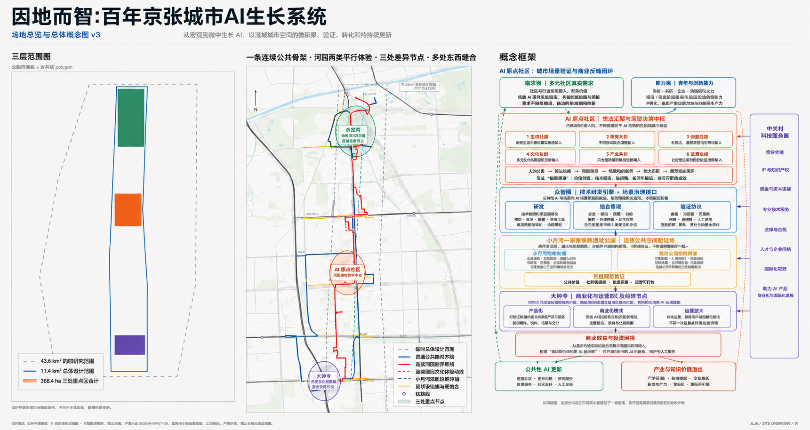
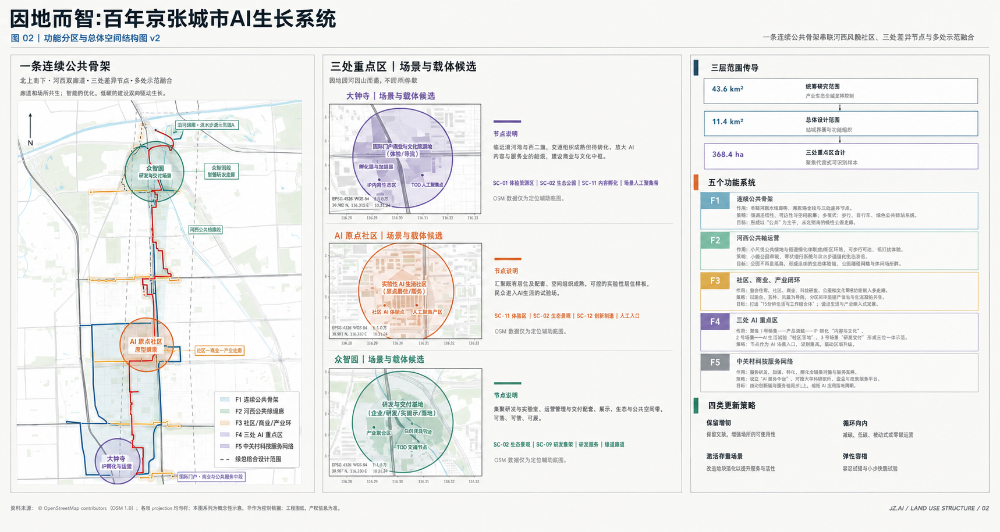
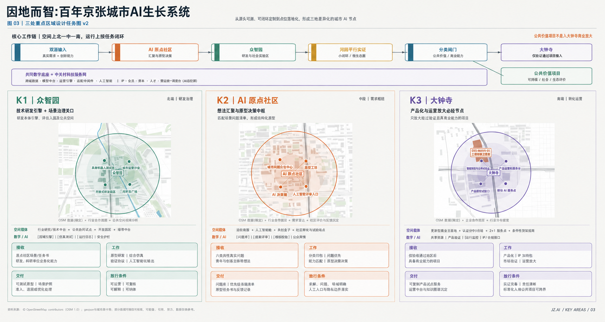
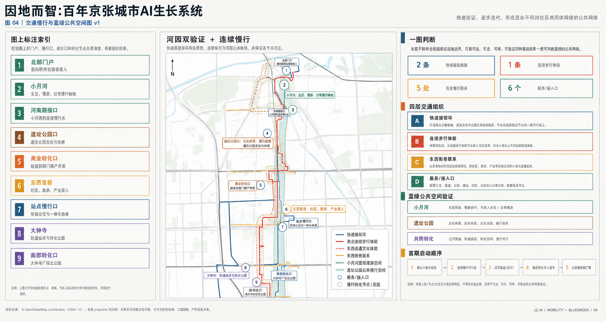
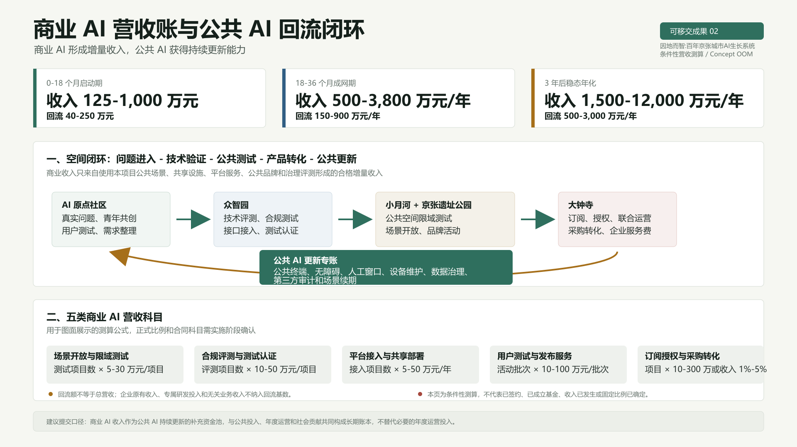

# 因地而智：百年京张城市AI生长系统

## 设计依据与资料清单

本方案以官方公告、智能体任务书、站点资料包、来源登记表和处理后的事实包为依据，形成一个可以被人阅读、也可以被机器复核的正式提交包 [source:OFFICIAL-ANNOUNCEMENT] [source:AGENT-TASKBOOK] [source:SOURCE-REGISTRY]。当前边界采用官方仓库提供的 provisional boundary，只用于方案生成、自检和讨论，不作为 official redline、审批依据或精确面积依据 [data:geometry/site_boundary.geojson#SITE-001]。

方案的核心判断是：从在地问题中，长出 AI 智能，让城市因地而智。它不把百年京张理解为一次性技术展示走廊，而是把沿线真实社区问题、海淀创新能力、公共空间验证和产业转化组织成一套可追溯、可复核、可接管、可持续的城市 AI 生长系统。完整资料索引见 `sources.json`，指标见 `metrics.json`，任务响应见 `compliance_matrix.json`，标准和深度响应见 `standard_matrix.json` 与 `design_depth_matrix.json`。

## 三层范围工作框架

三层范围分别承担不同责任。统筹研究范围回答 AI 产业生态、未来城市形态、人才和国际活动如何组织；总体设计范围回答京张遗址公园周边 1-2 公里的城市更新、交通、市政、风貌和公共空间如何落图；重点区域范围回答众智园、AI 原点社区、大钟寺三个节点如何达到详细设计深度 [standard:PROJECT-OFFICIAL-ANNOUNCEMENT] [depth:three_level_scope_framework]。

本方案把三层工作压缩成一条城市 AI 生长链：原点汇需、众智研发、河园实证、钟寺转化。居民、青年、穿行者、文化参与者、企业和运营者通过人工窗口、共创桌和公共终端提出真实问题；高校、科研团队、开发者和企业把问题转成原型，并接受权限、数据、安全、人工接管和退出条件审查；小月河与京张铁路遗址公园提供生态、日常、文化、交往和公共服务的平行验证环境；通过验证的项目进入公共持续或商业放大两条路径。

## 统筹研究范围产业与未来城市研究

统筹研究不是另画一条封闭产业园边界，而是建立“高校策源、开源协作、企业转化、公共体验、国际传播”的创新链。AI 原点社区负责让问题进入，众智园负责让技术可靠，小月河与京张铁路遗址公园负责真实场景验证，大钟寺负责产品化与公共/商业分类，最终通过合规的公共 AI 反哺机制支持下一轮公共服务更新。

未来城市形态的重点不是铺满 9 公里的 AI 装置，而是在既有城市底盘上叠合五类功能系统：连续公共骨架、河园公共验证带、社区/高校/产业短环、三处 AI 重点区、中关村科技服务网络。这些系统把 AI 从抽象能力转译为空间、服务、责任和运营规则 [depth:overall_spatial_structure]。

## 总体设计范围城市更新与控规深度城市设计

总体设计范围采用低扰动城市更新策略。先复用现有站点、道路、开放空间和存量建筑；先做标线、导视、可移动设施、开放首层和小尺度空间修补；场景设备必须可替换、可撤除，失败后恢复公共空间。用地、建筑、道路、绿地、公共空间和分期均以 GeoJSON 表达，支持指标复算 [data:geometry/land_use.geojson#LU-001] [data:geometry/buildings.geojson#BLDG-001] [metric:building_footprint_area_sqm]。

交通和市政支撑的第一条件不是屏幕和算法，而是可到达、可维护、可接管。方案提出南北快速联系和南北连续步行体验两套贯通关系，并把 AI 基础设施拆成四层：物理连接、数字平台、可信治理、持续运营。涉及道路红线、桥隧、管线、建筑高度、容积率和投资审批的内容，均作为概念建议，待正式控规和工程资料确认。

## 重点区域详细设计

三处重点区不是三个孤立片区，而是同一条城市 AI 生长链的三个责任节点 [data:geometry/key_areas.geojson#PROV-KEY-001] [data:geometry/key_areas.geojson#PROV-KEY-002] [data:geometry/key_areas.geojson#PROV-KEY-003]。其详细设计深度由 `design_depth_matrix.json` 中的重点区域条目复核 [depth:three_key_area_detailed_design]。

众智园 AI 自主创新加速区承担技术可靠性与治理准入。空间序列为研发室、受控测试庭院、开放观察廊、治理评审室和维护后台。首期动作包括共享治理沙盒、具身/终端测试庭院、公开测试廊。公众可以观察和理解测试，但不能误入高风险区域；成熟技术也不能绕过治理审查。

北京 AI 原点社区承担真实问题入口与青年共创。空间序列为街道入口、人工服务台、共创桌、原型工坊、社区评议厅和日常生活试点。参与不以付费、专业术语或交出过量个人数据为前提，必须保留线下人工入口。

大钟寺 AI 产业聚集区承担产品化、商业分类与国际交流。空间序列为地铁门户、四象限步行缝合、可移动服务点、开放首层验证厅、企业共享服务、国际交流和运营后台。主场地仍为条件性候选，不代表取得空间、审批、招商或企业承诺。

## AI 创新生态、人才画像与 AI+ 场景

12 个场景把 AI 从概念变成可验证的城市服务。公共入口与共创包括 SC-01 城市问题采集台、SC-02 青年一日原型工坊；公共空间与日常服务包括 SC-03 南北步行陪伴与无障碍绕行、SC-04 小月河生态共管、SC-06 夜间安全与人工求助；文化与内容包括 SC-05 京张记忆共创站、SC-11 AI 内容消费与版权实验场；产业测试验证包括 SC-07 具身设备共路测试庭院、SC-08 可信智能体治理沙盒、SC-09 智能终端公共测试街、SC-10 企业智能体部署与服务台；长期运营包括 SC-12 公共 AI 运行与反馈室 [metric:ai_scenario_count]。

每个 AI 场景都必须回答：谁使用、收什么数据、谁负责、如何停止、人工如何接管、失败后如何恢复。四维验证包括公共价值、社群接受度、技术效果和运维可行性。公共价值显著但直接投资回报不足的项目进入公共持续评估；具备商业转化潜力的项目进入大钟寺产品化与企业服务通道。

## 用地、建筑规模与拆改留方案

用地方案表达五类功能系统的叠合，而不是法定地块审批结果。建筑策略优先保留和轻改可用存量，优先开放首层和公共界面，优先用可移动设施验证服务，再决定是否进入更重的工程阶段。当前 `floor_area_ratio` 等控规强度指标因缺少正式数据保持 unknown，不以 AI 推测值冒充审批结论 [data:geometry/land_use.geojson#LU-001] [metric:floor_area_ratio]。

拆改留判断遵循“先公共价值、再工程代价、再运营责任”的顺序。可服务步行网络、社区服务、创新展示和低扰动改造的存量建筑，优先列为保留或更新候选；影响连续慢行、安全通行、公共界面和基础设施维护的空间，再进入专业团队的现场核查清单。提交包中的 `buildings.geojson` 只表达概念级建筑基底和更新意图，不替代权属、结构安全、消防、文保、市政容量和审批条件。正式红线、控规图则和权属资料到位后，应以同一套规则重新复核建筑规模、保留比例、改造强度和公共服务承载能力 [data:geometry/buildings.geojson#BLDG-001] [depth:retain_renovate_demolish_strategy]。

## 交通、轨道、市政与公共服务设施

交通慢行系统服务于真实到达：轨道接驳、连续步行、无障碍绕行、低速设备测试、夜间求助和活动日交通组织。市政与数字设施服务于可维护和可接管：光纤/无线、供配电、边缘节点、设备挂载、运行感知、检修通道、场景护照、身份权限、数据目录、模型版本、日志归档和紧急停止 [data:geometry/roads.geojson#ROAD-001]。

交通方案不预设新建一条贯穿全带的城市大道，而是把既有轨道、公交、骑行、步行、河园空间和站点门户组织为可分段进入的连续体验。跨主路、铁路、河道和校园边界的位置被列为现场核查点，后续需要由交通、市政、无障碍和运营团队共同确认。AI 设备和公共服务点必须能被运维人员到达，能在异常时人工接管，也能在活动日、雨雪天或高峰时段切换到低技术运行方式。提交几何只说明概念路线和公共服务组织，不作为道路红线、管线迁改或交通组织批准 [depth:transport_and_municipal_support]。

## 蓝绿空间、公共空间与城市风貌

小月河与京张铁路遗址公园共同构成 AI 场景的平行真实世界验证环境。小月河侧重生态、健康、日常生活、无障碍和公共服务类 AI；京张遗址公园侧重文化、交往、青年活动、城市展示和公共参与类 AI。绿色空间和公共空间比例由提交几何复算，后续需随官方边界更新 [metric:green_ratio] [metric:public_space_ratio]。

城市风貌从百年工程精神延伸到可信 AI 城市气质。三个功能型地标包括公开测试廊、城市问题墙与原型桌、AI 产品首发与公共价值厅。它们展示技术如何测试、何时停止、谁来接管、结果是否通过，也展示失败案例和运营数据。

蓝绿公共空间不是装饰背景，而是 AI 服务能否被公众理解、拒绝、反馈和审计的公共界面。小月河适合低功耗环境感知、设施维护、健康步行、夜间求助和生态共管；京张遗址公园适合可追溯导览、公共讨论、青年共创、活动组织和城市创新展示。所有设备布置都应低扰动、可维护、可撤除，并保留无技术状态下的基本公共空间品质。`green_space.geojson` 和 `public_space.geojson` 的面积只作为概念方案复算依据，正式绿线、河道蓝线、文保控制、树木保护和公园管理要求到位后必须重新校核 [data:geometry/green_space.geojson#GREEN-001] [data:geometry/public_space.geojson#PUBLIC-001] [depth:blue_green_public_space]。

## 更新项目清单、实施政策与分期计划

实施顺序采用“先低扰动验证、再专业深化、再分级扩展”的方式。首期以导视、开放首层、可移动设施、问题入口、治理沙盒和小尺度公共服务为主；中期围绕三处重点区扩大产业和公共场景；远期根据审计、公众反馈和专业评估决定保留、扩展、暂停或退出。所有政策、资金和活动安排均为概念建议或参考方案 [data:geometry/phasing.geojson#PHASE-001]。

更新项目清单应围绕责任而不是围绕工程规模排序。第一类是公共入口项目，包括城市问题采集台、线下人工入口、社区共创桌和低门槛导视；第二类是验证项目，包括公开测试廊、具身设备共路测试庭院、智能终端公共测试街和可信智能体治理沙盒；第三类是转化项目，包括企业智能体部署服务台、AI 产品首发与公共价值厅、版权实验场和国际交流节点；第四类是运营项目，包括公共 AI 运行与反馈室、审计台账、退出恢复机制和年度公共价值评估。每一类项目都要保留停止条件、接管责任和费用来源说明，不能把试点写成已经批准的建设计划 [depth:implementation_phasing]。

## 指标体系、面积复算与合规矩阵

正式投稿不只看概念是否成立，还要证明图件、指标、来源、假设、双语、版权和自检能够互相对上。当前复算指标包括 site area、green ratio、public space ratio、building footprint area 和 key area count [metric:site_area_sqm] [metric:key_area_count]。技术和经济指标以概念阶段数量级表达：一次性投入建议约 1.17-4.05 亿元，年度运营约 3,500-12,500 万元/年；企业自有研发、专属设备、办公装修和商业化推广另列，不作为政府或项目方已承诺支出。

## 风险、版权与合规说明

当前缺少 official redline、official key-area polygons、道路红线、控规指标、建筑高度、权属、文保控制线、市政管线、交通断面、现场客流和真实社群调研。对应结论必须写为 provisional、hypothesis、unknown 或 concept recommendation，并列明正式资料到位后的复算触发条件。版权、工具链和公共展示授权见 `report/copyright_statement.md` [source:SOURCE-REGISTRY]。

合规边界必须写进方案本身，而不是只放在 JSON。第一，所有空间落地建议均为概念建议或可供专业团队深化研究的参考方案，不代表政府承诺、审批结果或工程实施安排。第二，生成图像和展板只作为说明层，权威复核以 GeoJSON、metrics、sources、assumptions、三类矩阵和自检结果为准。第三，涉及个人数据、公共安全、内容版权、设备采集和企业服务的 AI 场景，必须执行最小必要、知情同意、人工接管、可投诉、可退出和可审计原则。第四，任何边界或指标更新都会触发整体复算，而不是只替换单张图 [depth:risk_copyright_compliance]。

## 参考资料

参考资料以 `sources.json` 为准，包括官方公告、智能体任务书、site package、source registry、processed fact pack、provisional boundaries 以及提交包内的结构化几何与指标文件 [source:OFFICIAL-ANNOUNCEMENT]。

正文只在具体判断后保留少量直接相关的证据标记，避免把机器索引堆成不可读文本。完整来源关系由 `sources.json` 保存，面积和比例由 `metrics.json` 保存，任务响应由 `compliance_matrix.json` 保存，标准响应由 `standard_matrix.json` 保存，深度响应由 `design_depth_matrix.json` 保存，自检结果由 `self_check.json` 保存。评审者可以从 Markdown 和 HTML 直接理解方案，也可以沿证据标记回到结构化文件复核每一项主张。若后续官方文件补齐，应先登记来源与哈希，再替换几何和指标，最后重新渲染 HTML、刷新 manifest 并运行自检 [source:AGENT-TASKBOOK] [depth:evidence_traceability]。
