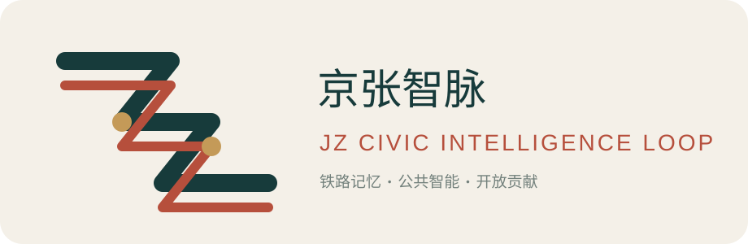
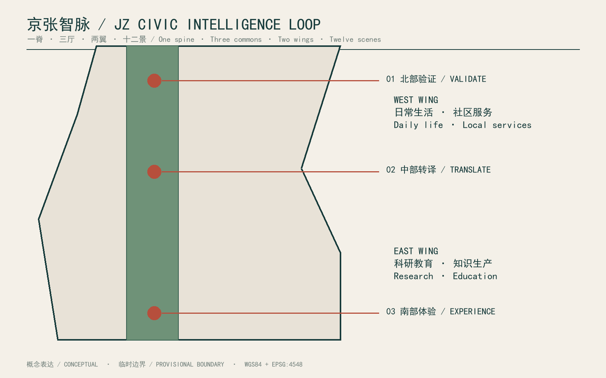
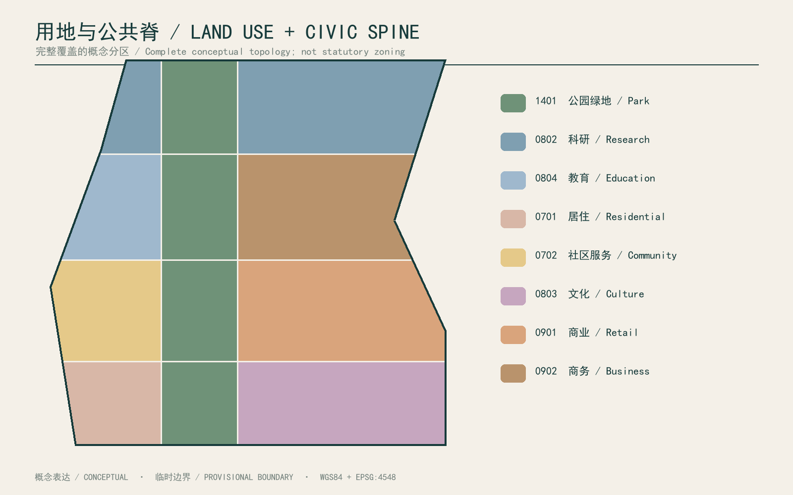
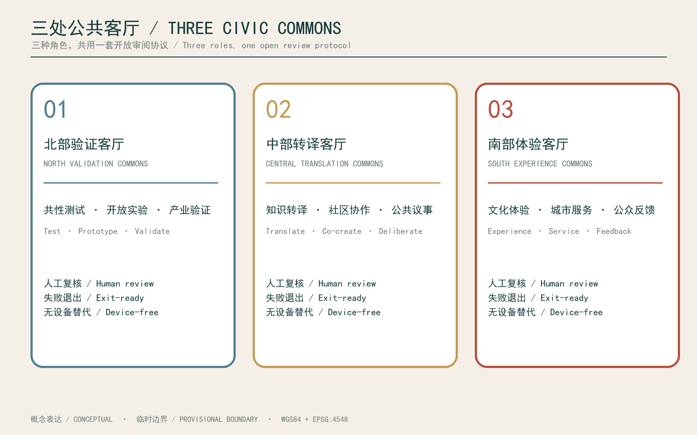
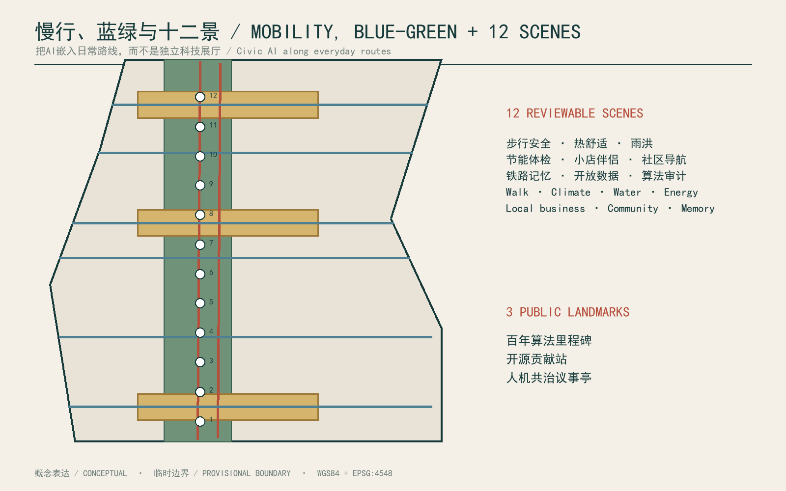
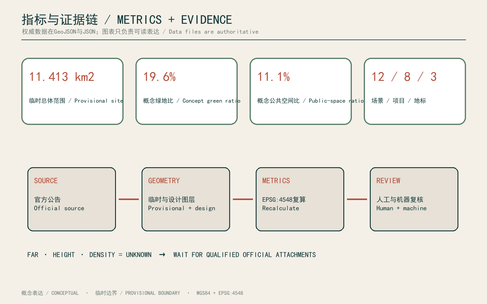

# JZ Civic Intelligence Loop / 京张智脉

> Concept proposal based on provisional rough boundaries; not for statutory redlines, approval, acquisition, or engineering.

## Design Basis and Source List

This proposal uses four evidence layers: the official announcement, the agent-facing taskbook, the site package, and the source registry. The announcement defines the three scope levels, three key areas, and expected professional depth. The taskbook defines open collaboration, AI+ scenarios, personas, industry validation, and public branding. The registry controls whether a source may support a formal claim. [source:OFFICIAL-ANNOUNCEMENT] [standard:PROJECT-AGENT-OPEN-CALL-TASKBOOK]

The public package does not include approved CAD/GIS redlines, statutory development controls, road redlines, ownership, utility networks, a building survey, or a heritage inventory. The submitted boundary and key-area files are explicitly provisional. Metrics recalculate only submitted design layers, assumptions state replacement conditions, and international cases remain background references rather than sources of local parameters. [data:geometry/site_boundary.geojson#SITE-001] [source:SOURCE-REGISTRY]

Human-readable and machine-readable evidence are paired. The narrative, five figures, PDFs, and offline HTML explain intent and use. GeoJSON, metrics, compliance matrices, and depth matrices explain location, quantity, task coverage, and uncertainty. Once qualified official attachments are available, professional teams should replace boundary and control data, recalculate metrics, redraw outputs, and conduct multidisciplinary review.

**Name and visual identity.** “JZ Civic Intelligence Loop” translates the linear memory of the railway into a public knowledge spine. Its mark uses two parallel rail lines forming a folded JZ shape: deep teal for public responsibility, railway red for continuity, and pale-gold nodes for open contribution and traceability. It is a proposal identifier only, never an official endorsement.

## Three-Level Scope Framework

The coordinated research area carries regional connectivity and industry questions without inventing an exact polygon. The overall design area uses the roughly 11.4-square-kilometre provisional corridor as a test base. The three key areas retain announced names and approximate sizes but receive differentiated civic roles. Decisions move from research questions to structural strategy and then to implementable project cards. [depth:three_level_scope_framework] [data:geometry/key_areas.geojson#PROV-KEY-001]

The spatial idea is “one spine, three commons, two wings, twelve scenes.” The Jingzhang heritage park becomes a continuous public knowledge spine. North Validation, Central Translation, and South Experience Commons create a civic sequence. The west wing supports everyday life and local services, while the east wing supports research and education. Twelve reviewable AI+ scenes form a daily walking, cycling, and transit-linked route.

Each level has an update rule. Regional findings enter a policy agenda; overall structure enters phasing and public-space layers; key areas enter persona, time-of-day, operation, and safety tests. If official boundaries change, the relational logic may remain while areas, endpoints, and project sites are recomputed. If controls change, building scale remains unknown until statutory review. [metric:site_area_sqm] [source:PROCESSED-FACT-PACK]

## Coordinated Research Area: Industry and Future City Research

The industry strategy is an open cycle of validation, translation, and civic adoption rather than another closed technology park. The north provides common testing, the centre translates technical claims into understandable service agreements, and the south tests whether products improve ordinary life. Enterprises gain a test environment, residents gain information and feedback rights, and public agencies gain auditable performance evidence. [source:CASE-PUNGGOL] [source:CASE-KNOWLEDGE-QUARTER]

Six cases contribute mechanisms only. Punggol suggests shared district infrastructure; Knowledge Quarter suggests inclusive alliance governance; STATION F suggests adaptive reuse of rail-industrial heritage; Barcelona 22@ links productive renewal with green and mobility systems; Kendall Square links research, housing, retail, and open space; MaRS combines research, startups, capital, events, and heritage. None supplies Jingzhang zoning parameters. [source:CASE-STATION-F] [source:CASE-BARCELONA-22AT]

A proposed Jingzhang Civic Intelligence Cooperative would run open calls, publish testing boundaries, reserve resident seats, commission independent ethics review, and use small reversible pilots with quarterly public retrospectives. Success is measured through reusable public assets, cross-institution validation, community adoption, accessibility, energy demand, and maintenance cost—not company counts alone. [source:CASE-KENDALL] [source:CASE-MARS]

**Complete innovation chain.** The spatial and operating sequence is basic research, public validation, technology translation, incubation, enterprise and capital services, civic procurement or adoption, and public retrospectives. The north connects universities and common laboratories; the centre hosts translation, IP/legal guidance and enterprise services; the south tests adoption through culture, commerce and civic services. Capital matching is transparent and non-exclusive. 

## Overall Design Area: Urban Renewal and Regulatory-Plan-Level Urban Design

Continuity of the public spine is the primary overall-design rule. A central park strip is flanked by residential, community service, education, research, culture, retail, and business zones. This is a topologically complete conceptual partition used to test coverage, overlap, and public-space ratios; it is not a statutory parcel plan. Submitted road layers contain only editable greenway, cycling, pedestrian, and transit-connection proposals. [data:geometry/land_use.geojson#LU-001] [depth:land_use_layout]

Renewal follows retention first, reversible intervention, and gap infill. Rail heritage and existing buildings remain pending verification. New buildings appear only as twelve conceptual footprints that test project distribution; no floor count or height is claimed. Six cross-spine links reconnect the two wings, a greenway and cycleway support north-south movement, and three commons provide non-commercial public destinations.

Regulatory deepening requires five interfaces: official boundaries, ownership and displacement impacts, road redlines and traffic capacity, utility and sponge-city capacity, and building height or view-corridor controls. Missing values remain unknown. Submitted green and public-space ratios describe the current conceptual layers only and must not be read as government controls. [metric:green_ratio] [assumption:A-CONTROLS-001]

## Detailed Design of Key Areas

The northern Zhongzhiyuan area becomes the Validation Commons: an open validation lab, co-creation accelerator, and Algorithm Milestone Archive connect model testing with public review. Traffic and walkability, low-carbon operation, and community-service coordination form three industry validation tracks. Small courtyards, shaded paths, and closable testing interfaces prevent experiments from displacing everyday park use. [data:geometry/key_areas.geojson#PROV-KEY-001] [depth:key_area_1_detailed_design]

The central Beijing AI Origin Community becomes the Translation Commons. A knowledge translation school, community collaboration hub, Open-source Contribution Station, and Civic AI Forum surround a shared square. Model descriptions become readable service cards with human appeal, device-free alternatives, and child- and older-adult-friendly interfaces. Workshops and a community kitchen create low-threshold encounters among residents, researchers, and founders. [data:geometry/key_areas.geojson#PROV-KEY-002]

The southern Dazhongsi area becomes the Experience Commons. A rail-memory workshop, community market, and active-mobility hub combine culture, commerce, and services while respecting residential quiet. All key-area polygons remain rough substitutes. Their roles may persist, but exact sites require official redlines, a heritage inventory, and confirmed operators. [data:geometry/key_areas.geojson#PROV-KEY-003] [assumption:A-HERITAGE-001]

## AI Innovation Ecosystem, Personas, and AI+ Scenarios

Five personas guide design: a parent commuting with children, a newly arrived researcher, a local small-business operator, a municipal maintenance worker, and an older rail-memory volunteer. Their needs include predictability, affordable access, explainable alerts, device-free alternatives, accessible interfaces, and genuine participation. Every scenario therefore states beneficiaries, human review, failure fallback, and public metrics. [depth:ai_innovation_ecosystem] [standard:PROJECT-AGENT-OPEN-CALL-TASKBOOK]

The twelve scenes are walk-safety co-review, cycling signal advice, accessible-route assistance, park thermal-comfort operations, stormwater inspection, building energy check-ups, a small-shop copilot, community-service navigation, collaborative rail-memory editing, open-data questions, a public algorithm audit day, and an urban-issue simulator. The first, fifth/sixth, and eighth become three industry validation tracks; others begin as low-risk public prototypes.

Three pilgrimage landmarks make civic protocol visible rather than monumentalising technology: the Algorithm Milestone Archive records versions, disputes, and exits; the Open-source Contribution Station accepts corrections and proposals; the Civic AI Forum presents model suggestions beside resident views. All scenes minimise data, require clear consent, provide human review and device-free alternatives, and avoid individual-identification surveillance. [metric:scenario_node_count] [metric:pilgrimage_landmark_count]

**Three strengthened scenarios.** A northern AI+health collaboration desk tests authorised, de-identified wayfinding and rehabilitation-access prototypes under professional review. A central AI+education co-learning station supports course co-design, learning-resource navigation and paper alternatives. A southern AI+local-business service supports accessibility information, footfall understanding and low-carbon delivery advice. All remain low-risk concepts pending regulatory, data and operator confirmation.

## Land Use, Building Scale, and Retain-Renovate-Demolish Strategy

The conceptual land-use partition covers the provisional site without overlap. Code 1401 forms the central park spine. The west wing includes residential, community service, education, and research uses; the east wing includes culture, retail, business, and research. The partition supports mixed connections and walkability but does not replace land-use regulation. [data:geometry/land_use.geojson#LU-001] [standard:MNR-LAND-USE-CLASSIFICATION-GUIDE]

Building strategy uses four actions: retain, repair, adapt, and infill. No demolition decision is submitted before a building survey. Twelve footprints represent project containers: validation lab, accelerator, translation school, collaboration hub, talent housing, innovation block, rail workshop, experience market, civic algorithm studio, social-innovation office, retained retrofit, and mobility hub. Footprint area is calculable; floor area, FAR, height, and density remain unknown.

Detailed work begins with building identity cards covering age, structure, ownership, occupancy, heritage value, energy, accessibility, and retrofit carbon. Decisions then combine heritage value, social use, structural risk, and whole-life carbon. Drawn massing communicates public interfaces and courtyard relations only and cannot authorise acquisition, demolition, valuation, or approval. [metric:building_footprint_area_sqm] [assumption:A-BUILDING-001]

## Transport, Rail, Municipal Infrastructure, and Public Services

Mobility turns the heritage park from a linear divider into a civic connector. One north-south greenway, one continuous cycleway, and six east-west links form the active-mobility framework. Interfaces with rail stations, buses, and shared mobility must be corrected when official transport information is available. The proposal does not alter expressways, arterials, or railway operations, and every crossing requires specialist safety review. [data:geometry/roads.geojson#ROAD-001] [depth:transport_and_slow_mobility]

AI remains an advisory layer. Walk-safety review aggregates anonymous conflict locations for engineer approval; cycling advice cannot directly control signals; accessible routing retains physical signs and staffed support; crowd forecasts communicate ranges and uncertainty. Base mobility and wayfinding must continue independently during system failure.

Municipal strategy starts with diagnosis. Authorised energy, water, waste, and stormwater data support building check-ups and maintenance. The green spine provides shade and sponge functions; commons provide drinking water, toilets, charging, first aid, and quiet rest. Pipe capacity, network loads, and detention volumes remain unquantified until official engineering information is available. [metric:road_length_m] [assumption:A-CONTROLS-001]

## Blue-Green Network, Public Space, and Urban Character

The blue-green system prioritises continuity, access, and maintainability. The knowledge spine combines ecology and civic life; three commons concentrate activity; cross-links invite both wings into the park. Green and public-space areas are recalculated from conceptual layers in EPSG:4548 and will change with official boundaries. Their ratios are review metrics, not statutory controls. [data:geometry/green_space.geojson#GREEN-001] [metric:public_space_ratio]

Four micro-environments are proposed: continuous shade with summer rest points, rain gardens that make stormwater visible, gently sloped surfaces usable by children, older adults and wheelchair users, and reservable areas that switch among quiet study, community events, and exhibitions. Commons remain accessible without purchase, maintain a safe night route, and protect accessible circulation from commercial spill-out.

Urban character combines rail-material memory with light contemporary interventions. Brick, steel, timber, and rail scale guide repair; new structures are demountable, deeply shaded, and low-reflectance. Data interfaces sit in paving, shelters, and printed material instead of giant screens or surveillance hardware. The generated cover is a mood-setting concept only and does not prove any depicted asset exists. [assumption:A-HERITAGE-001] [depth:blue_green_and_public_space]

**Three cultural routes.** A rail-memory route carries verified heritage narratives; a Zhongguancun innovation route links open research, translation and entrepreneurship; and an AI-new-culture route links algorithm disclosure, contribution records and public debate. They meet at the three commons through demountable developer walks, an open-source results gallery and a civic-intelligence contribution wall, all subject to heritage, ownership and safety review.

## Renewal Projects, Implementation Policy, and Phasing

Eight priority projects are registered: a public-spine pilot, northern validation lab, central translation school, three civic commons, six cross-spine links, rail-memory workshop, contribution station and forum, and civic-intelligence operations platform. Each project card names public value, spatial scope, leaders, collaborators, prerequisite data, risk, exit conditions, and annual public metrics. [metric:renewal_project_count] [depth:renewal_project_list]

Phase 1 pilots the north validation area and public spine after boundary, heritage, and safety checks. Phase 2 advances central translation and reconnection after community and traffic review. Phase 3 extends southern experience and the operating system only when performance, public acceptance, and maintenance budgets are adequate. These phases express readiness, not a government construction promise. [data:geometry/phasing.geojson#PHASE-001]

Policy tools include reversible interim-use permits, open scenario agreements, public data stewardship, exit-ready procurement, cross-institution contribution credits, and quarterly audits. The operating platform publishes model versions, data inventories, appeals, energy use, and maintenance cost. Pilots pause and revert to human service when they fail to create public value, generate uncontrolled bias, or displace non-digital access. [assumption:A-IMPLEMENTATION-001] [standard:MOHURD-URBAN-DESIGN-MEASURES]

**Annual activity and operation.** The proposed Jingzhang Civic Intelligence Season includes spring scenario calls, a summer university-enterprise validation week, an autumn civic-service and accessibility review, and a winter public audit and maintenance report. Public agencies, communities, universities, enterprises and independent ethics observers share governance. Budgets, sponsorship, data inventories, maintenance duties and exits must be public and are not yet implementation commitments.

## Metrics, Area Recalculation, and Compliance Matrix

Metrics cover spatial quantities, task delivery, and governance quality. Spatial quantities include provisional site area, building footprints, green and public-space areas, and active-mobility line length. Delivery includes three key areas, twelve scenes, eight projects, and three civic landmarks. Governance indicators include human review, device-free alternatives, appeal time, data minimisation, and public audit. Every numeric claim points to a file and formula. [metric:site_area_sqm] [metric:green_ratio]

Area is recalculated in EPSG:4548 while GeoJSON remains in WGS84. The current rough site is approximately 11.413 square kilometres, close to the announced 11.4-square-kilometre scale, but proximity does not prove legal precision. The land-use partition must cover the boundary without gaps or overlap. Green and public-space layers are thematic overlays and are not confused with the land-use topology.

The compliance matrix maps official tasks to sections, layers, metrics, drawings, sources, and checks. The depth matrix covers fifteen professional items, and the standard matrix records five mandatory standards. FAR and height stay unknown rather than being filled with arbitrary ranges. When official redlines arrive, the update sequence is replace, recalculate, redraw, review, and re-sign. [data:metrics.json] [depth:metrics_and_compliance]

## Risk, Copyright, and Compliance

The primary risk is that provisional geometry, conceptual buildings, or an AI image could be mistaken for official fact. GeoJSON properties, metric assumptions, figure footers, HTML status bars, and narrative labels all repeat provisional or conceptual status. The cover cannot be used to calculate area, identify existing conditions, or prove heritage assets. Qualified geometry must replace rather than cosmetically refine the temporary substitute. [assumption:A-BOUNDARY-001] [source:BOUNDARY-SOURCE]

AI risks include privacy intrusion, bias, automation overreach, digital exclusion, and high maintenance cost. Every scene uses purpose limitation, clear consent, human review, appeal, and device-free alternatives; no individual-identification surveillance is proposed. Industry tests require ethics, cybersecurity, accessibility, and energy review. Urban-design risks include heritage damage, crossing safety, event disturbance, and commercial capture of public space.

Text, structured data, and self-produced diagrams follow the repository's community-display license. External cases are linked and summarised without reproducing protected imagery. The concept cover was created in the built-in image-generation mode and is registered as a presentation asset. SimHei and Arial are embedded as PDF subsets and not redistributed. The author identifier is jiangzx25; that account must still confirm the fork, push, and Pull Request. [standard:MOHURD-CONTROL-DETAILED-PLANNING]

## References

1. Beijing Haidian planning authority, official announcement for the Centennial Jingzhang AI Innovation Belt, used for scope, objectives, key areas, and task context. [source:OFFICIAL-ANNOUNCEMENT]

2. Open City AI, agent-facing open-call taskbook and site package, used for participation principles, six agent tasks, data boundaries, and machine validation. [source:AGENT-TASKBOOK] [source:SITE-PACKAGE]

3. National urban-design, detailed-planning, and land-use classification materials, used for professional depth and coding without inventing site-specific controls. [standard:MOHURD-URBAN-DESIGN-MEASURES] [standard:MNR-LAND-USE-CLASSIFICATION-GUIDE]

4. Official materials from JTC Punggol Digital District, Knowledge Quarter London, STATION F, Barcelona 22@, MIT Kendall Square, and MaRS Discovery District, used only to compare governance, mixed use, adaptive reuse, and innovation-service mechanisms. [source:CASE-PUNGGOL] [source:CASE-KNOWLEDGE-QUARTER]

5. The repository source registry and processed fact pack, used for evidence eligibility and task navigation; neither is a new statutory authority. [source:SOURCE-REGISTRY] [source:PROCESSED-FACT-PACK]

Web sources were accessed on 2026-08-30. Continuing participation should record later changes and re-check claims. Where official material conflicts with this package, the latest verified official source takes priority.
