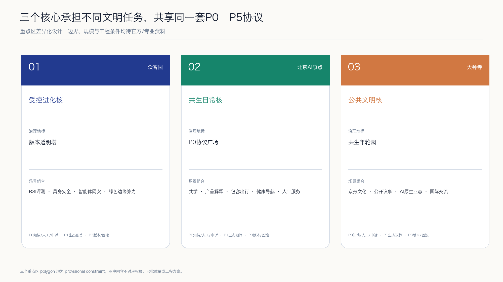
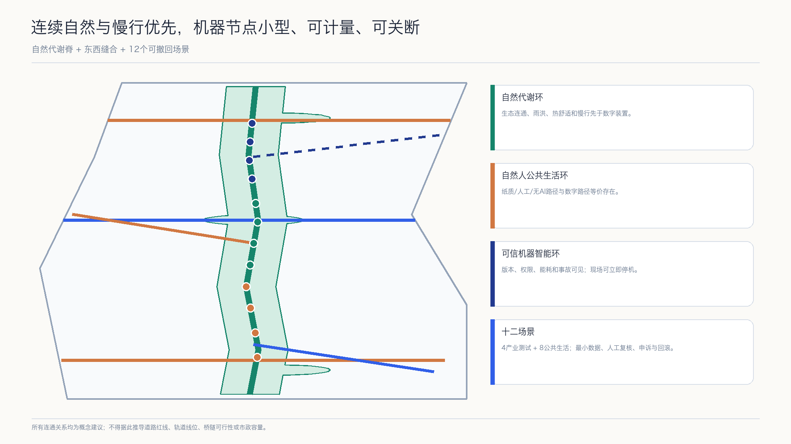
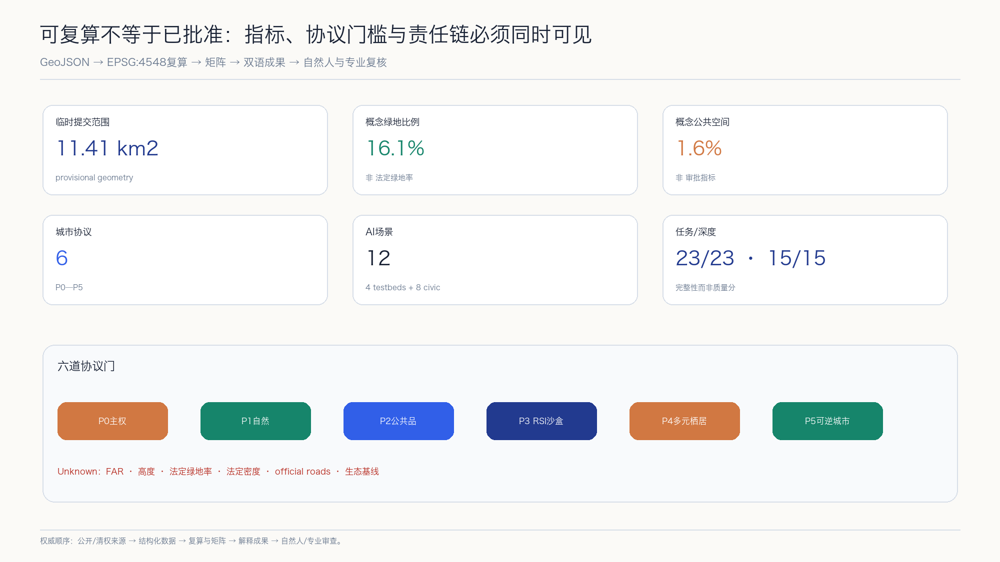

# Aaron-XP2060｜AI-RSI未来自然人机城市

> **自然为底盘，人保有主权，AI 学会克制。** Aaron-XP2060 不是一座由 AI 接管的城市，也不是一组未来感装置，而是一套可由公众理解、质疑、退出和纠错的城市协议。`XP` 表示 eXperimental Protocol（实验性协议），`2060` 表示跨代际远景窗口，不是政府目标、建设期限或投资承诺。

## 设计依据与资料清单

本方案只使用 `sources.json` 登记的公开或已清权资料。任务依据来自征集公告、仓库 site package 与面向智能体任务书；空间生成采用仓库明确标注的 provisional geometry；专业方法参考仓库本地标准快照。[source:OFFICIAL-ANNOUNCEMENT] [source:AGENT-TASKBOOK] [source:SITE-PACKAGE]

公开资料用途按仓库 source registry 区分 formal、background 与 provisional；事实导航包只用于定位任务和数据缺口，不能替代原始来源。[source:SOURCE-REGISTRY] [source:PROCESSED-FACT-PACK]

仓库当前未提供可认定为官方红线的总体设计范围和三处重点区 polygon。本方案因此只把仓库临时边界用于概念生成、相对关系、指标自检和展示，不用于权属、工程放线、法定控规、精确面积或政府决策。[source:BOUNDARY-SOURCE] [source:KEY-AREA-SOURCE]

临时边界的机器入口分别为总体范围 [data:geometry/site_boundary.geojson#PROV-SITE-001] 和重点区 [data:geometry/key_areas.geojson#PROV-KEY-001]；二者必须与 provisional 标签一起解释。

文学只提供价值冲突，不提供规划事实。方案借鉴伊恩·M·班克斯“文明”系列公开访谈中对丰裕、人机共存、个体自由、多元栖居和干预伦理的讨论，并严格遵循作者所强调的“象征而非蓝图”边界：不复制人物、情节、专有名词体系、舰船或栖居体设计、文本、插图和出版版式。[source:CULTURE-AUTHOR-INTERVIEW] [source:CULTURE-PUBLISHER-ARCHIVE] [depth:existing_conditions_diagnosis]

`RSI` 在本方案中专指 **Controlled Recursive Self-Improvement，受控递归自我改进**：每次改进都必须版本化、沙盒化、受预算约束、经独立评估和自然人批准，并且可以回滚。I. J. Good 的历史论文只用于交代“更强系统参与设计后继系统”的思想来源；NIST AI RMF 与 UNESCO 人工智能伦理建议用于构建治理和人权边界。本方案不声称已部署自主自我改进系统。[source:RSI-GOOD-1965] [source:NIST-AI-RMF] [source:UNESCO-AI-ETHICS]

## 三层范围工作框架

三层范围分别回答三个问题：统筹研究范围决定“京张创新带在全球网络中学习什么”；总体设计范围决定“自然、人和机器如何共享城市基础设施”；三处重点区决定“一个具体的人如何进入、使用、质疑并退出一项 AI 服务”。三层通过战略网络、城市协议和可体验节点逐级传导，而不是由一张总图相互替代。[depth:three_level_scope_framework]

公告中的总体设计范围约 11.4 平方公里，本次临时 polygon 的投影复算值见 [metric:site_area_sqm]；三处重点区域的公告文字面积合计见 [metric:announced_key_area_total_sqm]，提交要素数见 [metric:key_area_count]。前者是临时几何复算，后者是公告任务事实，二者口径不同，不暗示精确吻合。

总体结构概括为 **“一脊、三环、三核、两翼、十二触点”**：一脊是沿京张铁路遗产展开的自然人机协议脊；三环是自然代谢环、自然人公共生活环和可信机器智能环；三核是众智园受控进化核、北京 AI 原点共生日常核、大钟寺公共文明核；两翼是科技服务协同翼与小月河场景协同翼；十二触点把测试、公共服务、文化与生活场景连接成可撤回网络。[data:geometry/roads.geojson#ROAD-001] [data:geometry/public_space.geojson#PUBLIC-001]

## 统筹研究范围产业与未来城市研究

### 从科幻亮点到城市公共原则

本方案把“文明”系列的五项亮点转译为可审查的城市原则。第一，后稀缺想象转译为 **公共基本能力优先**：遮阴、饮水、无障碍、人工服务和公共网络先于炫技装置。第二，人机共存转译为 **AI 公共受托机制**：AI 可以提供建议和运营支持，但不获得默认统治权或未经法律确认的主体地位。第三，多元栖居转译为 **可选择的生活方式**：数字化、低数字化和无 AI 路径等价存在。第四，克制干预转译为 **默认不介入和最小必要**。第五，长文明时间转译为 **可逆更新与版本治理**。[source:CULTURE-AUTHOR-INTERVIEW] [standard:PROJECT-AGENT-OPEN-CALL-TASKBOOK]

这些原则被编码为六个城市协议：**P0 自然人主权协议**规定知情、拒绝、申诉、人工服务与停机权；**P1 自然账本协议**记录能源、水、碳、生物多样性与热环境预算；**P2 AI 公共品协议**规定公共服务 AI 的来源、责任、开放接口和审计；**P3 RSI 沙盒协议**规定版本、能力上限、预算、红队、批准和回滚；**P4 多元栖居协议**保障不同年龄、能力与数字偏好的等价通道；**P5 可逆城市协议**要求优先利用存量、模块化建设和可撤除试点。[source:NIST-AI-RMF] [source:UNESCO-AI-ETHICS] [depth:overall_spatial_structure]

六道协议的可读计数见 [metric:protocol_count]；其中 P3 对应一个贯穿全带、只在隔离环境运行的受控 RSI 治理沙盒，计数见 [metric:rsi_industry_sandbox_count]。它不是新增建设规模，也不是已部署系统。

### 产业生态：从“企业集聚”转向“受控进化回路”

产业回路由研究、产品化、测试、公共反馈、独立评估和人类决定六步组成。模型或智能体每次能力变化都生成版本卡；测试区只接收已登记版本；现场事故、能耗、偏差和公众投诉进入公开账本；是否扩大、修改或停止由具有责任的自然人和专业机构决定。城市空间因此不仅承载办公室，也承载证据、问责和安全退出。[source:NIST-AI-RMF] [depth:overall_spatial_structure]

七个全球案例只用于机制比较。MIT Kendall Square、Vector Institute 与 JTC one-north 分别提示混合街区、研究转化和工作生活学习协同。[source:CASE-KENDALL-MIT] [source:CASE-VECTOR-TORONTO] [source:CASE-ONE-NORTH-JTC] STATION F 进一步提示共享创业服务的分层组织。[source:CASE-STATION-F]

Maria 01、Mila 与 Seoul AI Hub 分别提示存量复用、责任 AI 文化和城市级开放创新；本方案不复制其规模、绩效、补贴或控制指标。[source:CASE-MARIA-01] [source:CASE-MILA] [source:CASE-SEOUL-AI-HUB] 登记案例总数见 [metric:global_case_count]。

### 命名、标识与对外叙事

正式提交名为 **Aaron-XP2060**，方案名为 **AI-RSI Future Nature–Human–Machine City**。标识建议由一条绿色“自然基线”、一条暖色“自然人判断线”和一条蓝色“机器版本线”构成开放的 XP 字形；三线不闭合，表达系统始终可修订。视觉不使用“文明”系列专有词、舰船轮廓、轨道栖居体、出版封面构图或机构商标。

## 总体设计范围城市更新与控规深度城市设计

总体设计以“自然底盘先行、公共生活居中、机器系统后置”为图层顺序。连续蓝绿空间先确定最低生态连通和公共可达；社区、研发、服务与生活功能围绕三环组织；机器设施采用小型、可计量、可关断的边缘节点，不形成不可逆的集中控制中心。[standard:MOHURD-URBAN-DESIGN-MEASURES] [depth:land_use_layout]

临时范围被完整划分为六类概念用地：AI 创新研发与成果转化、科技服务与 AI 原生业态、社区共享服务、人才生活、连续绿地、东西缝合共享街道。图层覆盖临时边界且不重叠，但只用于测试功能关系，不是已批用地性质。[data:geometry/land_use.geojson#LU-001] [standard:MNR-LAND-USE-CLASSIFICATION-GUIDE]

建筑只表达“开放研发、混合服务、社区服务、人才生活”四类类型包络。更新顺序是保留调查、低扰动改造、可逆增补、长期评估；任何真实建筑的保留、改造或拆除都必须等待文保、结构、产权、消防、日照、控规和碳成本核验。[data:geometry/buildings.geojson#BLDG-001] [depth:retain_renovate_demolish]

控规深度体现为可审查问题，而不是虚构参数：用地关系、公共空间、概念道路、建筑类型、分期与复算指标可在现有资料上讨论；容积率、建筑高度、法定密度、道路红线、退界、权属、市政和文保条件保持 unknown。official data 到位后必须从源图层重算全部成果。[standard:MOHURD-CONTROL-DETAILED-PLANNING] [depth:development_intensity_controls]

城市设计、控规边界和概念用地术语分别回到仓库本地官方参考快照，不把外部 URL 当作唯一专业证据。[source:STD-URBAN-DESIGN] [source:STD-CONTROL-PLANNING] [source:STD-LAND-USE]

## 重点区域详细设计

三处重点区共享 P0 人类主权、P1 自然账本和 P3 RSI 沙盒三条底线，但承担不同城市角色。边界均为 provisional constraint，详细设计只表达空间结构、公共界面、项目类型和决策门，不对应地块、权属或批准体量。[data:geometry/key_areas.geojson#PROV-KEY-001] [depth:three_key_area_detailed_design]

**众智园｜受控进化核。** 这里设置受控 RSI 版本验证园：模型/智能体评测、具身智能低速安全、智能体互操作与网安、绿色边缘算力四类产业测试形成封闭到半开放的风险梯度。公众入口“版本透明塔”只展示已经过审的版本卡、限制、事故与回滚记录；生产区与观察区物理分离。任何系统不得在现场自主修改权限、数据边界或部署范围。

**北京 AI 原点社区｜共生日常核。** “P0 协议广场”把共学、产品解释、社区健康导航、无障碍出行和小型企业服务放在可步行日常中。每个数字服务旁均有人工窗口和非 AI 等价路径；夜间采用分时运营，敏感信息不进入公共展示。研发者在这里面对真实使用反馈，但居民不成为默认实验对象。

**大钟寺｜公共文明核。** “共生年轮园”连接公共文化、多语京张叙事、AI 原生消费、国际交流和公开议事。每一圈代表自然、城市、自然人和机器版本的一段时间；生成内容标注来源与责任，争议内容可暂停展示。轨道接驳、四象限连通、商业和公共文化只表达协同意图，等待道路、站点和产权条件复核。

三个地标不是昂贵造型，而是治理接口：P0 协议广场提供知情、退出和申诉；版本透明塔提供版本、限制和事故记录；共生年轮园提供跨代际公共讨论和贡献档案。地标数量见 [metric:landmark_count]，概念包络见 [data:geometry/public_space.geojson#PUBLIC-001]。

## AI 创新生态、人才画像与 AI+ 场景

### 六类需求画像

方案只做需求画像，不建立可识别个人的行为评分。六类画像为：研究者与安全评估者；初创团队与工程师；学生与青年人才；周边居民、家庭与长者；公共运营者与专业审查者；国际访客及无障碍需求者。六类人都拥有知情、拒绝、人工服务、申诉、更正、撤回和停机请求的入口。[metric:persona_count] [source:UNESCO-AI-ETHICS]

### 十二张场景卡

十二个场景以 `SCENARIO_NODE` 写入公共空间图层，总数见 [metric:ai_scenario_count]；其中四个为产业测试验证场景，见 [metric:industry_testbed_count]。所有场景通过目的合法、数据最小、安全包容、人工接管、可回滚五道门槛。[data:geometry/public_space.geojson#SCN-01] [depth:municipal_new_infrastructure]

| 场景 | 使用者与空间 | 数据、人工与停止条件 |
| --- | --- | --- |
| 01 受控 RSI 模型与版本评测站（产业测试） | 众智园；研究者、评审 | 隔离测试集；无自主联网部署；独立签署；无法复现或越权即回滚 |
| 02 具身智能低速安全环（产业测试） | 众智园受控时段；工程师、运营者 | 只记必要安全事件；现场安全员接管；越界或近失事件即停机 |
| 03 智能体互操作与网安沙盒（产业测试） | 众智园；企业、网安团队 | 合成/清权数据；最小权限；出现数据外泄、提示注入扩散或不可撤销动作即关闭 |
| 04 绿色边缘算力代谢实验室（产业测试） | 公共脊服务舱；设施人员 | 设备能耗、温度与负载；人工调度；突破能耗、噪声或热安全预算即降级 |
| 05 AI-off 包容出行助手 | 公共脊；居民、访客 | 公共路网和主动反馈；保留纸质/人工路线；错误引导未修复即暂停 |
| 06 人在回路社区健康导航 | 原点社区；居民、长者 | 公开机构信息和主动输入；不诊断；无法转人工或误导就医即下线 |
| 07 自适应共学工作室 | 原点社区；学生、教师 | 清权教材与自愿内容；教师最终判断；替代评价或涉及未成年人画像即停止 |
| 08 公共政策模拟论坛 | P0 广场；公众、运营者 | 公开数据与假设；只支持讨论、不作行政决定；来源过期或被当成决定即撤回 |
| 09 京张文化证据导览 | 公共文明核；居民、访客 | 经核验公开史料；专家与社区校订；来源不明或虚构史实即撤下 |
| 10 生物多样性哨点与栖息地护理 | 蓝绿脊；志愿者、生态人员 | 非人脸生态观察；生态专业复核；采集个人轨迹或干扰物种即停用 |
| 11 循环资源交换站 | 三核服务节点；商户、居民 | 自愿物品信息；人工仲裁；诱导消费、权利不清或不安全物品即下架 |
| 12 公共贡献与版本档案 | 三处地标；贡献者、公众 | 公开许可版本与自愿署名；可更正撤名；归属争议未决即隐藏 |

RSI 场景的特别规则是：系统只能在隔离环境提出候选改进，不得直接更改生产模型、基础设施控制、身份权限或数据政策；候选版本必须经过能力差异、失效模式、资源消耗、红队、公众影响和回滚演练后，由明确责任人批准。[source:RSI-GOOD-1965] [source:NIST-AI-RMF]

## 用地、建筑规模与拆改留方案

六类用地面积由临时拓扑分区复算：研发转化、科技服务与社区服务分别见 [metric:land_use_area_0802_sqm]、[metric:land_use_area_05_sqm]、[metric:land_use_area_0702_sqm]。人才生活、连续绿地与共享街道分别见 [metric:land_use_area_0701_sqm]、[metric:land_use_area_1401_sqm] 与 [metric:land_use_area_1207_sqm]。这些数值只用于包内一致性和方案比较，不是法定用地规模。[standard:MNR-LAND-USE-CLASSIFICATION-GUIDE]

建筑基底面积与相对临时范围的概念比值见 [metric:building_footprint_area_sqm]、[metric:building_density_ratio]。总建筑面积、容积率、建筑高度和法定建筑密度保持 unknown。没有现状调查、结构安全、权属、消防、日照、文保和法定控制时，不推导层数、总量或拆除清单。[depth:height_massing_character]

拆改留遵循四道证据门：先判定历史与公共价值，再判定结构安全和使用绩效，再比较适应性再利用与全生命周期碳，最后由权利人、专业团队和主管部门决定。P5 可逆城市协议优先开放首层、共享院落、无障碍改造和可拆卸构件；新建只作为待论证类型，不作为默认答案。[standard:MOHURD-ARCH-DESIGN-DEPTH-2016] [depth:retain_renovate_demolish]

## 交通、轨道、市政与公共服务设施

概念交通由一条南北自然人机协议脊、三条东西缝合连接和三条重点区支线组成，证据见 [data:geometry/roads.geojson#ROAD-001]。慢行优先解决跨道路连续、轨道最后一公里、无障碍和活动日冲突；数字导航不能成为唯一入口，低速机器人只能在明示边界和受控时段运行，行人和现场人员拥有优先与停机权。[depth:traffic_rail_slow_parking]

概念道路面积比例见 [metric:conceptual_road_area_ratio]。由于官方道路红线、断面、流量、交叉口和轨道工程资料缺失，本方案不提供车道数、信号配时、转弯半径、停车量或施工线位。所有跨越和接驳均为关系建议。

市政与机器基础设施采用可关断服务舱：边缘计算、能耗计量、公共网络、人工服务和急停装置物理共址但权限分离。P1 自然账本先设资源预算，P3 RSI 沙盒再决定系统可用能力；供电、通信、排水、消防、防洪、网安和维护责任均需专项复核。[source:NIST-AI-RMF] [depth:municipal_new_infrastructure]

## 蓝绿空间、公共空间与城市风貌

自然不是 AI 城市的装饰，而是约束所有技术和建设选择的第一层基础设施。连续绿地承担生态连通、雨洪调节、热舒适、步行骑行、文化学习和低干扰观察；机器系统只有在不突破水、能耗、热、噪声和生物多样性预算时才可扩大。[source:UNESCO-AI-ETHICS] [depth:blue_green_public_space]

概念绿地联合面积和比例见 [metric:green_space_area_sqm]、[metric:green_ratio]；公共空间包络联合面积和比例见 [metric:public_space_area_sqm]、[metric:public_space_ratio]。它们由提交几何复算，均为 low-confidence 设计一致性指标，不是法定绿地率或已批公共空间范围。[data:geometry/green_space.geojson#GREEN-001]

公共空间形成三层：连续协议脊保障最低可达，五个公共空间包络承载服务与停留，十二个场景点提供可撤回活动。遮阴、座椅、饮水、卫生间、儿童与无障碍设施优先于传感器和屏幕；任何 AI 装置都展示责任人、数据边界、版本、人工入口和关闭状态。[standard:MOHURD-URBAN-DESIGN-MEASURES]

风貌以“轨道时间、自然基线、公开版本”组织：保留可核验的铁路材料和时间刻度；用连续植物与水文痕迹表达自然代谢；用简洁的版本标记表达机器系统变化。封面概念图是 AI 生成的原创说明图，不是现状照片、规划总图、边界或工程依据。

## 更新项目清单、实施政策与分期计划

九个项目包采用“公开问题—小型试点—证据评估—自然人决定—扩大/修改/退出”循环。项目数量见 [metric:renewal_project_count]，三期空间见 [data:geometry/phasing.geojson#PHASE-001]；阶段只表示学习顺序，不是投资和政府实施时序。[depth:renewal_project_list] [depth:phasing_implementation]

| 编号 | 项目包 | 可先验证的最小动作 | 必须等待的决策门 |
| --- | --- | --- | --- |
| P01 | 自然人机协议脊样段 | 遮阴、座椅、无障碍、非 AI 导视 | 官方边界、道路、文保、绿线与水系 |
| P02 | 众智园 RSI 受控验证园 | 离线版本卡、回滚演练、预约观察 | 安全、网安、设备、能耗与运营许可 |
| P03 | P0 协议广场 | 人工服务、知情与申诉原型 | 权属、消防、社区协商与长期责任主体 |
| P04 | 版本透明塔 | 公开模型卡和事故/回滚档案 | 信息安全、责任认定、版权与内容审核 |
| P05 | 共生年轮园 | 文化证据线和小型公共讨论 | 文保、生态、轨道、交通和场地条件 |
| P06 | AI-off 包容出行网络 | 人工走查、纸质路线和临时导视 | 道路红线、无障碍专项和持续维护 |
| P07 | 绿色边缘算力服务舱 | 非联网能耗计量原型 | 供电、通信、消防、热安全、网安与运维 |
| P08 | 自然账本与生物多样性哨点 | 公开指标定义和志愿观察 | 生态基线、数据治理和专业监测方法 |
| P09 | 公共版本与申诉运营台 | 场景登记、申诉、停机和年度复盘模板 | 独立评审、预算、问责和法定职责边界 |

近期优先做不依赖精确工程红线的 P0 公共服务与可逆样段；中期在众智园建立受控验证网络，在两翼形成场景协同；远期才讨论全带扩展和国际活动。任何阶段只要触发生态预算、权利、安全、投诉或运维红线，即进入降级、修正或退出，而不是以“已投入”作为继续理由。

三期概念面积分别由 [metric:phase_1_area_sqm]、[metric:phase_2_area_sqm] 与 [metric:phase_3_area_sqm] 记录，只用于验证分期 polygon 对临时范围的完整覆盖，不代表投资量或建设规模。

运营采用“一账、两会、三权、六门”。一账是公开版本与场景账本；两会是季度公众反馈和年度独立复盘；三权是现场停机权、公众申诉权、专业否决权；六门对应 P0—P5 协议。活动体系包括开放模型与公共价值周、城市 AI 测试季、京张人机共生论坛和年度失败案例评审，均为运营建议，不代表活动已获批。

## 指标体系、面积复算与合规矩阵

指标分为三类：从提交几何复算的设计一致性指标；来自公告和任务书的任务事实；用于检验方案完整性的运营计数。法定、工程和投资指标在资料缺失时保持 unknown，不以推测数值填空。[depth:metrics_recalculation]

临时范围、建筑基底、绿地、公共空间、六类用地和三期面积均可从 GeoJSON 重算。关键值见 [metric:site_area_sqm]、[metric:green_ratio] 与 [metric:public_space_ratio]。这三项服务于视觉与拓扑自检，不可脱离 provisional status 摘录为现状或规划控制指标。

任务矩阵、设计深度和强制标准计数分别见 [metric:compliance_requirement_count]、[metric:design_depth_complete_count] 与 [metric:mandatory_standard_count]。它们只证明“有可定位证据”，不等于方案质量评分、规划批准、工程可行或技术安全认证。[standard:PROJECT-OFFICIAL-ANNOUNCEMENT]

official polygons 或专业资料补齐后，必须按“替换源几何—重算图层—重算指标—重绘图件—重渲染 HTML/PDF—重新自检”的顺序整体更新，不允许只修改正文数字。[depth:risk_missing_data]

已知资料缺口与待确认控制的机器入口为 [data:geometry/constraints.geojson#documented_constraints]；空要素集合不表示不存在约束，而表示当前没有可清权、可定位的正式约束 polygon。

## 风险、版权与合规说明

**空间与实施风险。** 当前边界、重点区、用地、建筑、道路、公共空间和分期均为概念建议。缺失项包括 official polygons、控规、权属、现状建筑、道路与轨道、市政、消防、防洪、文保、生态与公共设施底数。本方案不构成规划审批、拆改留决定、工程方案、投资测算、招商承诺或政府时序。[standard:MOHURD-CONTROL-DETAILED-PLANNING] [depth:risk_missing_data]

**RSI 与 AI 风险。** 受控 RSI 是治理设计，不是已验证安全技术。任何候选改进都可能产生能力突变、目标漂移、评测欺骗、数据泄露、供应链风险、资源过耗和不可逆依赖。生产系统不得自主自改；自然人批准不能只做形式签字，必须有能力差异证据、红队、回滚演练、责任主体和独立停止权。[source:NIST-AI-RMF]

**自然人与生态边界。** 不进行秘密感知、默认个体追踪、情绪操控、公共服务歧视或自动行政决定；未成年人、健康、生物识别与其他敏感数据不进入公共试验。高风险用途需另行合法性、伦理、安全、无障碍和环境影响评估。[source:UNESCO-AI-ETHICS]

**版权边界。** 文学作品仅作为公开说明的价值启发，不引用小说正文，不使用受保护角色、情节、专有命名系统、视觉设定、封面或商标。核心图由提交 GeoJSON、指标和矩阵派生；概念封面由 OpenAI 图像生成工具原创生成并在版权声明中登记；未使用外部地图截图、新闻图片或本地私有资料。[source:CULTURE-PUBLISHER-ARCHIVE]

**资料隔离。** 本投稿包只包含公开/清权来源与本次原创派生成果；不包含用户本地知识库、私有文件、未公开研究、个人信息、本地绝对路径或短期凭证。完整声明见 `report/copyright_statement.md`。

## 参考资料

- 百年京张 AI 创新带征集公告、公开 site package、agent taskbook、source registry 与本地专业标准快照：[source:OFFICIAL-ANNOUNCEMENT] [source:SITE-PACKAGE] [source:AGENT-TASKBOOK]
- Iain Banks 官方站公开访谈与 Orbit 出版社公开资料，仅用于思想与版权边界：[source:CULTURE-AUTHOR-INTERVIEW] [source:CULTURE-PUBLISHER-ARCHIVE]
- I. J. Good 历史论文、NIST AI RMF、UNESCO 人工智能伦理建议：[source:RSI-GOOD-1965] [source:NIST-AI-RMF] [source:UNESCO-AI-ETHICS]
- 全球案例的一手机构页面：MIT Kendall Square、Vector Institute、JTC one-north、STATION F、Maria 01、Mila、Seoul AI Hub；只作机制比较。[source:CASE-KENDALL-MIT] [source:CASE-MILA] [source:CASE-SEOUL-AI-HUB]

最终解释边界：所有空间和运营内容均为概念建议、参考方案或可供专业团队深化研究的材料；中国法律法规、征集正式文件、官方数据、专业审查和自然人的责任判断优先。
