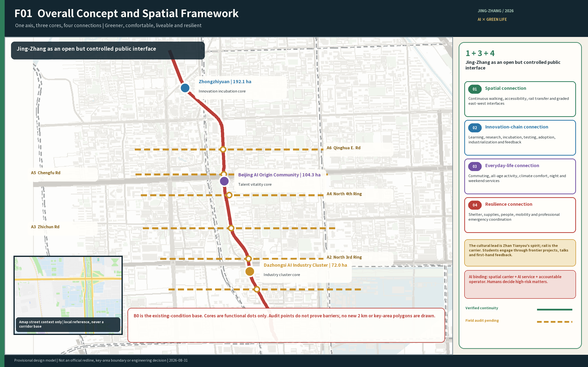
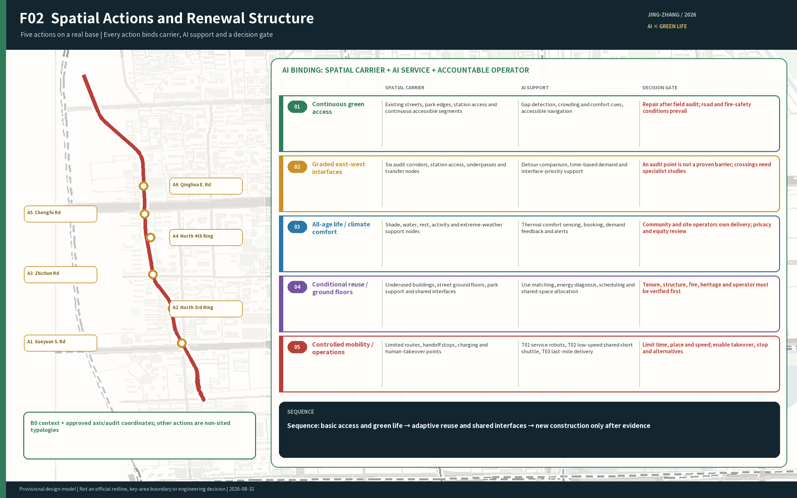
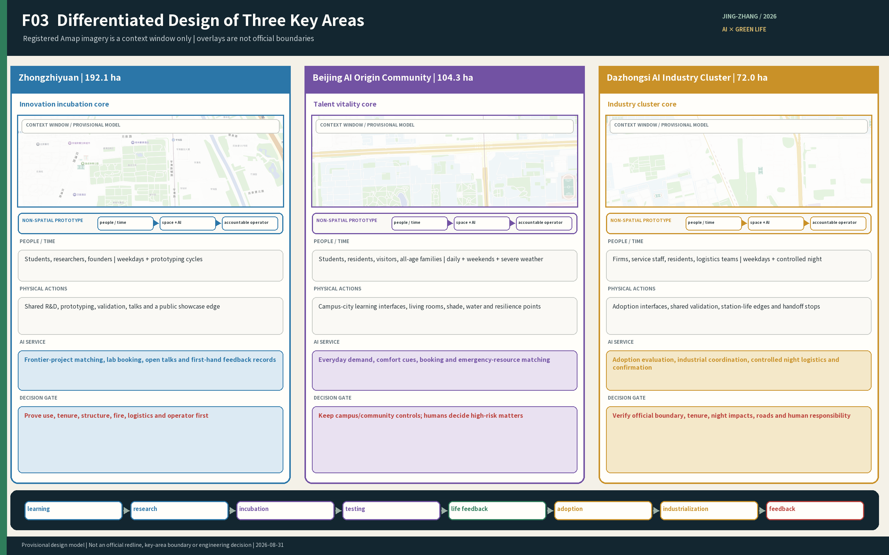
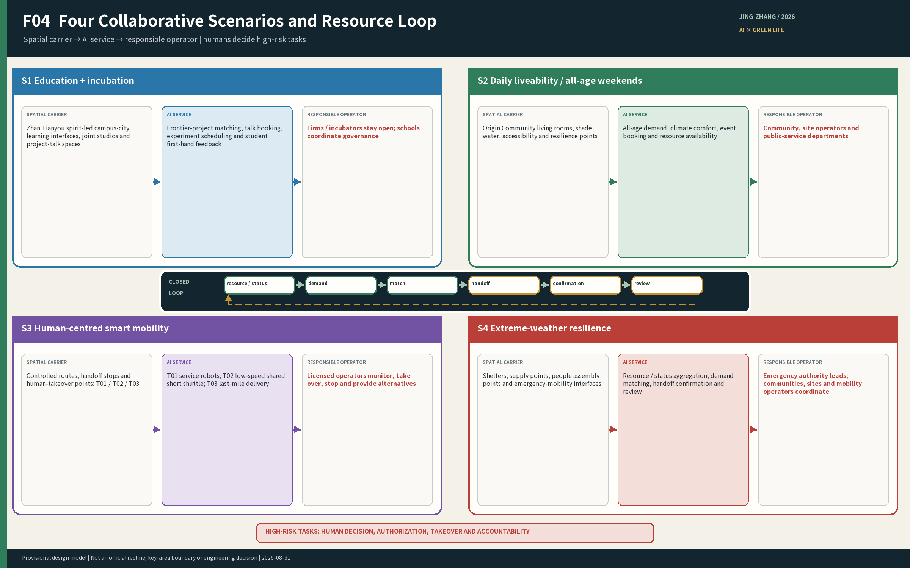
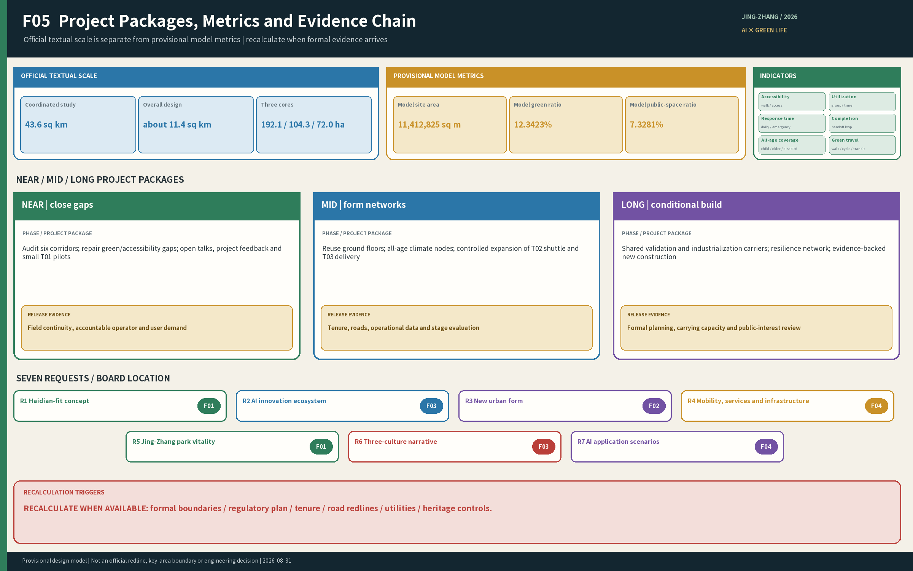

# Jing-Zhang Symbiotic Innovation Belt

## Design Basis and Source List

This proposal responds first to the organizer's announcement, the site package, and the Agent Open-Call Taskbook. It retains the three-level scope, the three key areas, and the seven design requirements. Public material can support positioning, needs analysis, spatial relationships, and conceptual renewal strategies, but cannot prove exact parcel boundaries, ownership, statutory land use, road boundaries, building safety, institutional commitments, or permits for professional testing. These matters remain pending official data or implementation-stage studies. [source:OFFICIAL-ANNOUNCEMENT] [source:SITE-PACKAGE] [source:AGENT-TASKBOOK]

The design also draws on the project's Jing-Zhang axis maps, facility inventory, online evidence register, five people-time-scenario studies, talent-development chain, and southern-segment design. They support problem definition and option comparison but are not elevated to statutory evidence. Their scope, permitted use, and evidentiary limits are registered in `report/design-basis-register.md`. [source:PARTICIPANT-DESIGN-BASIS] [depth:existing_conditions_diagnosis]

The current site and key-area layers are provisional constraints. Figures and metrics must retain `official_boundary=false`; they must not be described as an official planning boundary, a survey-grade area, or an approval basis. When official polygons become available, land use, roads, green space, public space, buildings, phasing, and metrics must be recalculated together. B0 is the overall mapping base, while the registered detailed map provides local existing-condition evidence. M0 is used only as a reference for the self-defined 2 km facility inventory and not for its key-area divisions. The 2 km extent and the three key-area shapes are working models, not organizer-issued statutory boundaries or official redlines. [data:geometry/site_boundary.geojson#SITE-001] [data:geometry/key_areas.geojson#PROV-KEY-001] [depth:risk_missing_data]

## Three-Level Scope Framework

The three levels answer different questions. The 2-kilometre facility-survey band on each side of the railway is not a substitute for the formal scopes.

| Level | Official scale | Primary task | Proposal output |
| --- | ---: | --- | --- |
| Coordinated Research Area | 43.6 sq km | Define the AI ecosystem, future-city proposition, and Three Zones and Two Wings relationship | Industry and talent chains, concept, case comparison, and operating mechanism |
| Overall Design Area | 11.4 sq km | Establish urban renewal, spatial structure, transport and infrastructure, blue-green network, and Urban Character | Overall Urban Design, renewal projects, and metrics |
| Three Key-Area Detailed Design Areas | 368.4 ha in total | Test functions, spatial form, buildings, mobility, public space, and implementation logic | Three detailed area designs and enlarged nodes |

The coordinated study establishes direction; the overall design translates it into spatial networks and renewal projects; the key-area designs test how these moves enter streets, building interfaces, and daily operations. Only official textual descriptions and area figures are currently available. Exact polygons remain pending, so this document confirms tasks and structure without deriving statutory controls from provisional shapes. [standard:PROJECT-OFFICIAL-ANNOUNCEMENT] [depth:three_level_scope_framework] [metric:key_area_count]

## Coordinated Research Area: Industry and Future City Research

Haidian already contains a dense mix of universities, research institutes, companies, communities, transit, and public green space. The planning problem is neither to create another isolated AI park nor to make AI compensate for every facility gap. It is to turn dispersed resources into relationships that people can enter, use, and respond to, so AI development improves commuting, learning, social contact, recreation, and resilience during extreme weather.

The proposal adopts “one spine, three cores, with green space as the base.” The Jing-Zhang Railway Heritage Park forms the continuous green public spine. Zhongzhiyuan, Beijing AI Origin Community, and Dazhongsi respectively support innovation incubation, talent vitality, and industry clustering. Jing-Zhang is an open but controlled public interface, not a single linear channel through which every project must pass; projects are also not forced to move through the three areas in geographic order. Together, the areas support a development chain of frontier learning, project practice, engineering validation, incubation, and industrial application. [source:AGENT-TASKBOOK] [depth:overall_spatial_structure]

The proposal establishes four forms of connection:

1. **Spatial connection:** improve north-south walking and cycling continuity, east-west entrances, transit interchange, crossings, accessibility, and waiting conditions, helping mend the spatial separation created or continued by the railway corridor.
2. **Innovation-chain connection:** connect universities, parks, firms, and community needs through public lectures, joint briefs, cross-campus studios, shared prototyping, professional validation, and industry services. Institutions do not need to remove their management boundaries.
3. **Daily-service connection:** connect the basic facilities, public living rooms, and time-shared services needed by residents, students, employees, families, older people, children, night-shift workers, and outdoor service workers.
4. **Resilience-resource connection:** during heat, heavy rain, snow and ice, or strong winds, connect shelter spaces, supplies, facilities, people, mobility capacity, and professional emergency interfaces. AI assists discovery and matching; accountable organizations confirm and carry out actions.

Together, these connections address the seven requirements: a Haidian-specific development concept; an AI Innovation Ecosystem; an AI-adapted urban form; transport and public services; an active Jing-Zhang Railway Heritage Park; integration of the spirit of Zhan Tianyou with Zhongguancun and AI culture; and AI-Enabled Scenarios in transport, healthcare, education, robotics, autonomous mobility, and unmanned delivery. [standard:PROJECT-AGENT-OPEN-CALL-TASKBOOK] [source:OFFICIAL-ANNOUNCEMENT]

Five international cases test how space can support an innovation chain; their building forms and scale are not copied:

| Case | Transferable mechanism | Jing-Zhang application | Condition that cannot be copied |
| --- | --- | --- | --- |
| Singapore one-north / LaunchPad | Flexible incubation, shared equipment, staged testing, and ground-floor display | At Zhongzhiyuan, establish an incubation-prototyping-controlled testing-display-adoption ladder | Do not assume that facilities and data across multiple owners are automatically shared. [source:CASE-ONE-NORTH] |
| France Paris-Saclay | Innovation education across career stages, proof of concept, temporary activation, and long-term operation | The three cores form a learning-research-validation-incubation-adoption chain | Do not copy a large greenfield campus or claim cross-campus cooperation without operators and agreements. [source:CASE-PARIS-SACLAY] |
| Toronto MaRS / Vector Institute | A professional platform connects research, talent, commercialization, and adoption while separating public events from controlled R&D | The Jing-Zhang public interface hosts lectures, display, experience, and social feedback | Openness does not remove data, intellectual-property, or testing-space boundaries. [source:CASE-MARS-VECTOR] |
| Helsinki Maria 01 | Existing buildings receive an operator, admission and graduation rules, and community benefits before streets and parks are incrementally improved | Reuse links an urban-problem bank with university mentoring and company validation | A building that appears idle is not assumed to have resolved tenure, use, structure, or fire-safety conditions. [source:CASE-MARIA-01] |
| Pittsburgh Hazelwood Green / CMU | Industrial heritage, controlled robotics testing, public education, and green space are layered | High-risk testing stays in professional sites; the green corridor hosts only low-risk demonstration and feedback | Do not copy a large brownfield test site or assume that technology occupancy automatically creates community benefit. [source:CASE-HAZELWOOD-CMU] |

The shared mechanism is a professional division of labor across the three key areas, an open but controlled public interface along the Jing-Zhang green spine, and a long-term operating platform that organizes universities, companies, communities, and city agencies into an accountable feedback loop.

## Overall Design Area: Urban Renewal and Regulatory-Plan-Level Urban Design

The overall spatial system has four layers. The green-space layer secures walking, cycling, accessibility, ecology, shade, drainage, and rest. The three-core innovation layer supports the talent and outcome-development chain. The daily-life layer tests the plan through commuting, lunchtime, evening, weekend, and extreme-weather scenarios. The AI resource-coordination layer connects resource status, needs, and accountable actors without becoming a fourth enclosed district.

The corridor street-level regulatory plan approved in 2026 identifies Dazhongsi and Wudaokou as two centers, calls for north-south and east-west walking and cycling connections, supports reuse of old factories and underperforming buildings for industry, and strengthens 15-minute community services, roads, and municipal infrastructure. Phase II of the Jing-Zhang park has also recently opened. Physical interventions are therefore consolidated into five types: maintaining and completing the continuous green Walking and Cycling Network; east-west interfaces and interchange nodes; all-age public-life nodes; reuse and time-sharing interfaces for existing space; and professional validation and logistics nodes. Operations are consolidated into time-based access rules, a public narrative of Zhan Tianyou's spirit, all-age activities and courses, and an urban resource-coordination system. Implementation first verifies and repairs existing continuity, safety, ecology, and basic services; it then adapts existing space and professional interfaces; new buildings and their scale are decided only after land-use, ownership, and demand evidence is available. [source:OFFICIAL-JZ-CONTROL-PLAN-20260812] [depth:land_use_layout] [depth:overall_spatial_structure]

The urban resource-coordination system shares seven functions: resource inventory, status verification, demand intake, resource matching, task handoff, outcome confirmation, and review. AI may assist search, analysis, prompts, translation, and matching. Authorized people decide access, admission, transport takeover, emergency response, service activation, and reopening. Basic movement, fixed signs, human assistance, and safety procedures continue when AI, data, or networks fail.

## Detailed Design of Key Areas

The three key areas are different urban environments within one innovation chain and should not reproduce a single generic “AI park” form. Their names, roles, and area figures come from official text. The current provisional key-area polygons cannot support detailed-design boundaries; the provisional Dazhongsi polygon does not contain Dazhongsi Station and has been withdrawn from spatial derivation. [source:OFFICIAL-ANNOUNCEMENT] [source:KEY-AREA-SOURCE]

### Zhongzhiyuan AI Independent Innovation Acceleration Area — Innovation Incubation Core, 192.1 ha

Zhongzhiyuan is the innovation-incubation core for engineering development, shared prototyping, professional validation, and pre-incubation. Its spatial priorities are a low-carbon R&D environment, professional workshops, controlled testing, park logistics, and a public-facing urban interface. Companies and incubated teams continuously offer students frontier lectures, real projects, testing opportunities, and first-hand feedback. Professional testing remains in spaces with clear land use, ownership, safety controls, and operational responsibility; the park edge supports public learning, explanation of results, and user feedback without treating ordinary visitors as default test subjects.

### Beijing AI Origin Community — Talent Vitality Core, 104.3 ha

The AI Origin Community is the talent-vitality core for frontier learning, problem discovery, cross-campus projects, all-age daily life, and everyday innovation exchange. Campus-city learning interfaces, rotating lectures by companies and incubated teams, cross-campus studios, public living rooms, and time-shared services allow students to encounter current technical directions, engineering failures, and user feedback earlier. During extreme weather it differentiates support for older people, children, people with reduced mobility, and night-shift and outdoor workers through shelter, water, supplies, fallback routes, and staffed service points. Campuses, parks, and communities retain necessary management boundaries; cooperation occurs through public interfaces, booking rules, and responsibility agreements.

### Dazhongsi AI Industry Cluster — Industry Clustering Core, 72.0 ha

Dazhongsi is the industry-clustering core for product integration, market validation, enterprise services, industrialization, and mature applications. Controlled night logistics uses only designated back-of-house routes, loading, and handover nodes; it does not displace quiet residential evenings or basic movement. Before an official boundary is available, the design uses a boundary-independent framework: the Jing-Zhang green public spine remains the everyday-life and ecological base; Dazhongsi Station, where Lines 12 and 13 interchange, is the transit and industry-service study anchor; [source:OFFICIAL-DZ-INTERCHANGE-20241213] the Xueyuan South Road daily-service interface and the North Third Ring transport-industry interface have equal importance; existing public spaces such as Shunxin Park connect cultural, community, and enterprise resources; [source:OFFICIAL-SHUNXIN-20260602] and candidate east-west links connect communities, universities, and public services across the railway corridor. The North Third Ring gateway already provides a spatial foundation for the Jing-Zhang spine to cross the ring road north-south, but it does not prove an east-west crossing of Metro Line 13. The latter remains a government-confirmed gap requiring professional study. The current stage may define structural relationships, node types, and planning actions, but not land-use shares, building quantities, or parcel-level retain-renovate-demolish decisions. Land-use closure, metric recalculation, and complete detailed design follow after the official boundary is obtained. [source:OFFICIAL-JZ-PHASE2-20260730] [source:OFFICIAL-LINE13-BARRIER-20241029] [depth:three_key_area_detailed_design]

## AI Innovation Ecosystem, Personas, and AI+ Scenarios

The proposal serves at least five groups: university students and early-career researchers; start-up teams and company employees; existing residents and families; older people, children, and people with reduced mobility; and night-shift, delivery, maintenance, and other urban service workers. International visitors, developers, and business partners are cross-cutting users, but they do not displace the objective of improving life for existing residents.

| Scenario | Primary users and time | Spatial and service move | AI role and human boundary |
| --- | --- | --- | --- |
| S01 Peak commute | Residents, students, workers, cyclists on weekday peaks | Continuous routes, crossings, interchange, parking, accessibility | Status and alternative-route information; people retain traffic management and response |
| S02 Lunchtime innovation exchange | Students, researchers, start-ups, residents at lunchtime | Public living rooms, meeting points, time-shared service windows | Resource discovery, booking, and translation; institutions decide access |
| S03 Evening life and quiet | Residents, young people, night workers in the evening | Quiet routes home, basic services, time-zoned activity areas | Open/fault status; human staffing and fixed signs remain |
| S04 Weekend all-age activity | Families, children, older people, visitors on weekends | All-age routes, rest points, nature education, courses | Opt-in age-appropriate interpretation; no cross-scenario profiles of children |
| S05 Extreme-weather resilience | Everyone before, during, and after events, with priority for vulnerable and outdoor users | Shelter, water, supplies, fallback routes, staffed service points | Resource matching and outcome tracking; no replacement of warnings, rescue, or medical judgment |
| S06 Frontier awareness | University students and young researchers during terms | Rotating company lectures, product demonstrations, failure reviews | Organize questions and feedback; teachers and practitioners approve content |
| S07 Project practice | Students, mentors, firms, and community problem owners during terms | Joint studios, real briefs, low-risk prototypes | Team and information support; mentors and problem owners jointly review |
| T01 Service-robot validation | R&D teams and professionals in booked test periods | Indoor, building-interface, and enclosed-module tests | Performance and incident records; human takeover, immediate stop, and site recovery |
| T02 Shared autonomous short-distance shuttle validation | Users with specific interchange needs in controlled periods | Controlled validation in the north, conditional application in the south, walking priority in the middle | Vehicles are not limited to cars; permits, takeover, stop, and substitute service remain human responsibilities |
| T03 Unmanned last-mile delivery validation | Operators and recipients during park logistics periods | Controlled logistics routes, loading, and handover nodes | Dispatch and status prompts; human takeover is always available and public movement has priority |

The scenarios use a shared resource-coordination back end but retain different access rules, data permissions, human review, and exit conditions. AI creates value by organizing dispersed people, spaces, supplies, facilities, and mobility capacity, thereby shortening resource discovery and cross-organizational coordination. It does not replace physical space, public institutions, or professional staff. [standard:PROJECT-AGENT-OPEN-CALL-TASKBOOK] [data:geometry/public_space.geojson#PUBLIC-001]

## Land Use, Building Scale, and Retain-Renovate-Demolish Strategy

Land and building decisions follow the sequence “retain effective uses—adapt reusable space—add public and professional facilities only where a demonstrated gap exists.” Street-facing ground floors, park support space, existing R&D offices, inefficient transport edges, and time-share candidates are investigated first. Without evidence on current use, ownership, structural safety, and operating intent, a building is not called an idle factory and is not assigned a definite demolition or renovation decision. [standard:MNR-LAND-USE-CLASSIFICATION-GUIDE] [depth:retain_renovate_demolish]

Total floor area, Floor Area Ratio, Building Coverage Ratio, Building Height, setbacks, and new housing quantities remain pending official Regulatory Detailed Planning and existing-condition data. Talent housing policy first improves access to existing housing, rental resources, commuting, childcare, healthcare, night services, and public space. New housing is considered only when the scale of demand, land conditions, and public-service capacity are demonstrated. [metric:floor_area_ratio] [depth:development_intensity_controls]

## Transport, Rail, Municipal Infrastructure, and Public Services

Walking, cycling, accessibility, and rail interchange form the transport base. The plan first verifies and repairs north-south continuity and east-west crossings, then organizes metro–park–campus–innovation-park–community interchange nodes. Intelligent mobility is not synonymous with cars: T01 service robots, T02 low-speed shared short-distance shuttles, and T03 last-mile delivery each require controlled space, an operating responsibility, and human takeover. Shared autonomous short-distance shuttles serve only specific north-south needs that walking and conventional transit cannot adequately meet. The proposal does not create a continuous car-testing corridor through the park and does not remove trees, reduce green space, or occupy the only accessible route for testing. [data:geometry/roads.geojson#ROAD-001] [depth:traffic_rail_slow_parking]

Public-service nodes combine seating, shade, drinking water, toilets, care facilities, first aid, charging, parking, and human assistance according to user and time needs, rather than reproducing a standard “smart kiosk.” New infrastructure includes demand-backed edge computing, low-intrusion sensing, communication, energy, and data interfaces, coordinated with drainage, lighting, fire safety, and existing municipal systems. [depth:municipal_new_infrastructure]

## Blue-Green Network, Public Space, and Urban Character

The Jing-Zhang Railway Heritage Park is first a green public space for everyone and only then a setting for innovation display and technical testing. Continuous walking and cycling, east-west entrances, shade and drainage, quiet rest, all-age activity, and ecological repair create an everyday green spine. Professional tests, temporary events, and new facilities must not reduce effective green space, damage mature trees, or block basic movement. [data:geometry/green_space.geojson#GREEN-001] [data:geometry/public_space.geojson#PUBLIC-001] [depth:blue_green_public_space]

The cultural narrative foregrounds the spirit of Zhan Tianyou rather than repeating generic railway imagery. Authentic remains and engineering sources explain independent innovation, context-responsive design, engineering reliability, responsibility, and public service, and connect them to independent AI R&D, safety evaluation, green resilience, and the responsibilities of young engineers. Student learning prioritizes AI frontiers and industry practice, with Zhan Tianyou's spirit as a continuing engineering value; families and park visitors receive a fuller public interpretation.

Three landmark prototypes are proposed: the southern AI Industry and Community Gateway, the central Campus-City Co-Creation Living Room, and the northern Engineering Incubation Co-Creation Workshop. They create public interfaces between industry and daily life, campus and city, and R&D and validation. Contribution displays, annual results, and the spirit of Zhan Tianyou can establish public anchors for achievement display and engineering-value learning. Exact sites and construction forms remain pending boundary, heritage, ownership, and operating conditions. [standard:PROJECT-AGENT-OPEN-CALL-TASKBOOK]

## Renewal Projects, Implementation Policy, and Phasing

The first project set contains nine outputs: an urban resource-coordination system; an all-weather walking, cycling, and accessibility network; metro–park–campus–innovation-park interchange nodes; an all-age basic-service network; institutional time-sharing and professional service windows; day-night operating rules; a public narrative connecting Zhan Tianyou with contemporary innovation; all-age activities and courses; and controlled validation for robots, autonomous mobility, and unmanned delivery. Phasing proceeds from reversible near-term repairs, through medium-term adaptation of existing space, to long-term work after official boundaries and regulatory controls are available. Governance maps R1–R7, without changing their official meanings, to project accountability, evidence, and review. Each project has one primary requirement and records users, time, spatial action, AI role, non-AI fallback, accountable organization, metric, and prerequisites. [data:geometry/phasing.geojson#PHASE-001] [depth:renewal_project_list]

Near-term work prioritizes reversible, low-risk walking and cycling repairs, basic services, public interfaces, and resource inventories. The medium term adapts existing spaces, key-area public interfaces, and controlled validation environments. The long term uses official boundaries, Regulatory Detailed Planning controls, demand data, and operational evaluation to decide new buildings, complex transport, and major public-space works. The annual program combines frontier lectures, open briefs, result exhibitions, developer co-creation, public experience, and international exchange; outputs feed back into education, testing, incubation, industry services, and spatial improvements. [depth:phasing_implementation]

## Metrics, Area Recalculation, and Compliance Matrix

Official textual figures are 43.6 sq km for the Coordinated Research Area, 11.4 sq km for the Overall Design Area, and 192.1 ha, 104.3 ha, and 72.0 ha for Zhongzhiyuan, Beijing AI Origin Community, and Dazhongsi. Provisional overall-area geometry is used only for package generation, visualization, and overall design-model calculations. Provisional key-area polygons do not support key-area area, land-use, or development metrics; the Dazhongsi placeholder has been withdrawn because of its spatial mismatch. Green-space ratio, public-space ratio, and building footprint calculated from the provisional model test layer relationships and formulas only; they are neither statutory controls nor official existing-condition statistics. [metric:site_area_sqm] [metric:green_ratio] [metric:public_space_ratio]

Metrics fall into three groups: spatial metrics recomputed from final geometry; control metrics dependent on official Regulatory Detailed Planning, infrastructure, and ownership data; and performance metrics calibrated through operations. After formal design layers are complete, the next pass recalculates site area, green-space ratio, public-space ratio, building footprint, walking continuity, project counts, and scenario nodes. Talent density, industry performance, resource-response time, and user satisfaction receive formulas and collection methods before any unsupported target values. [depth:metrics_recalculation]

## Risk, Copyright, and Compliance

Principal risks are the absence of exact official boundaries and Regulatory Detailed Planning data, the limited age and granularity of online evidence, unconfirmed institutional access and operators, permits and safety for professional testing, and rights clearance for generated and third-party materials. Each risk remains recorded in `assumptions.json`, `sources.json`, `report/copyright_statement.md`, and the three matrices. [depth:risk_missing_data] [source:SOURCE-REGISTRY]

Spatial locations, building adaptations, operating programs, industry collaborations, and AI scenarios are conceptual recommendations for further professional development. They do not constitute government approval, a statutory plan, an investment commitment, or an engineering-feasibility conclusion. AI does not make final decisions on closure, evacuation, medical triage, transport takeover, or reopening. Personal data is minimized, users may opt out, and critical services retain human review and non-AI alternatives.

The Chinese and English texts keep their chapters, conclusions, areas, scenario identifiers, and evidence positions aligned; text-bearing figures, offline HTML, A3 booklet, and A0 boards use paired language versions. Final submission status is determined only by the actual results of the official finalize script, four-gate self-check, and participant preflight.

## References

1. Qualification pre-announcement for the Centennial Jing-Zhang AI Innovation Belt Open Call for Urban Design.
2. Centennial Jing-Zhang AI Innovation Belt site package under `brief/site-package/`.
3. Agent Open-Call Taskbook for the Centennial Jing-Zhang AI Innovation Belt.
4. Source Registry for the Centennial Jing-Zhang AI Innovation Belt.
5. Public-source compilation for the Jing-Zhang axis and corridor facilities.
6. Five people-time-scenario studies and the urban resource-coordination system.
7. AI talent-development chain and T01–T03 Testing and Validation Scenario rules.
8. Overall Jing-Zhang spatial framework and southern-segment design outputs.
9. Official JTC materials for one-north / LaunchPad and Punggol Digital District.
10. Official Université Paris-Saclay and EPA Paris-Saclay materials.
11. Official MaRS Discovery District and Vector Institute materials.
12. Official City of Helsinki materials on Maria 01 and Urban Tech Helsinki.
13. Official Hazelwood Green, Carnegie Mellon University, and City of Pittsburgh materials.

The complete index of sources, rights, limitations, and permitted uses remains in `sources.json`. [source:SITE-PACKAGE] [source:AGENT-TASKBOOK]
