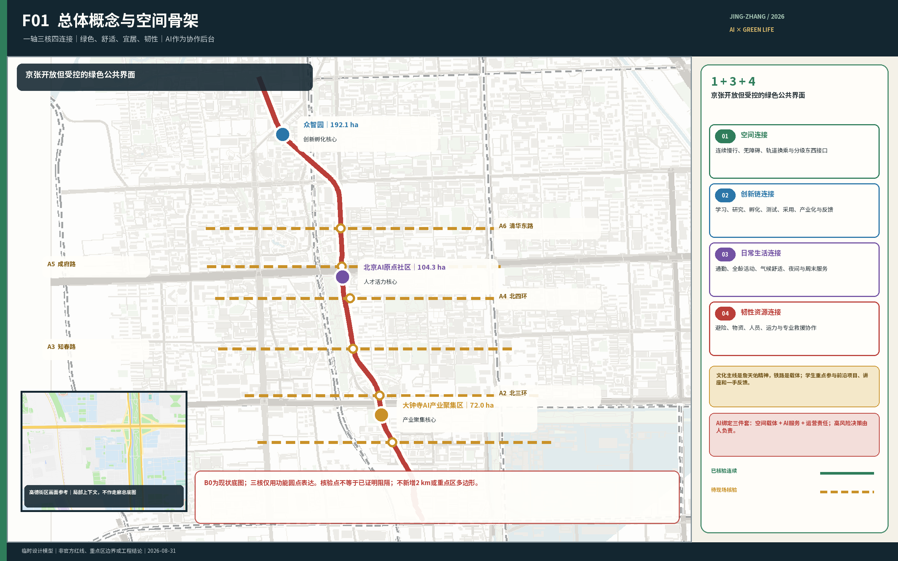
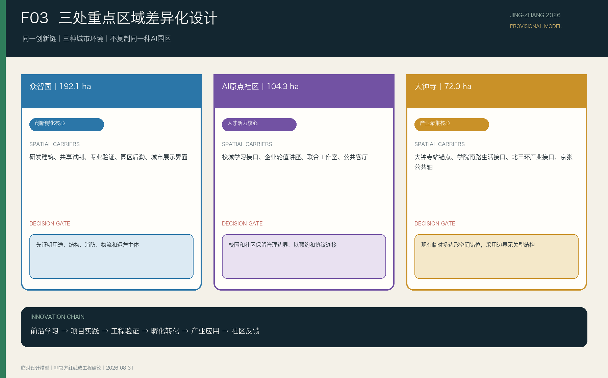
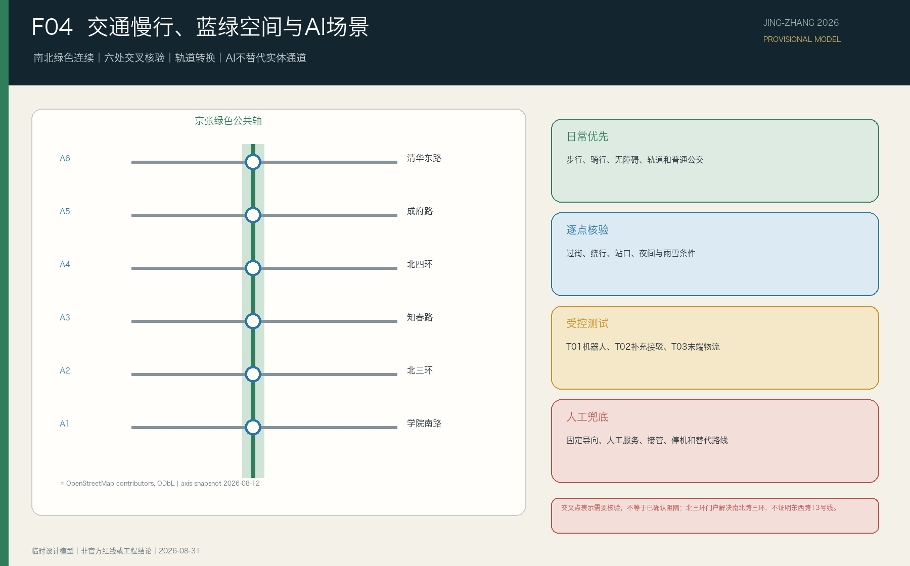
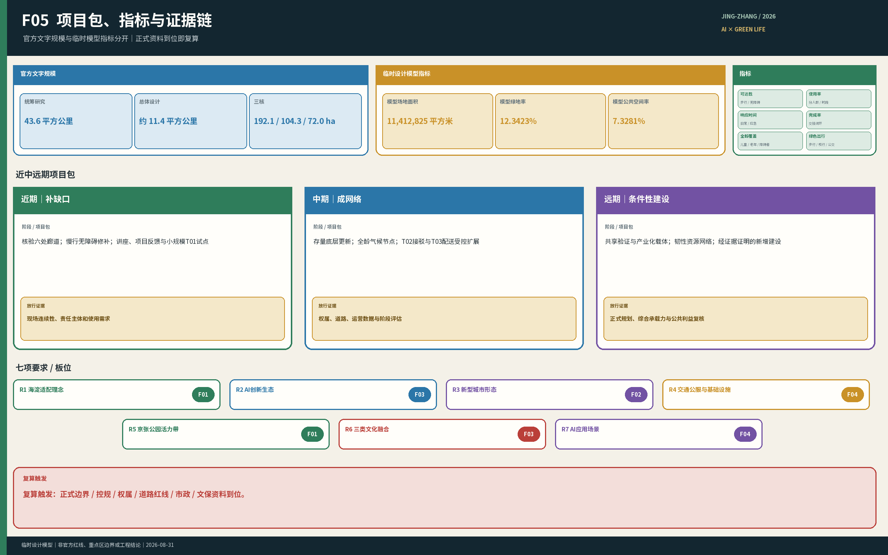

# 京张共生创新带

## 品牌与视觉识别

“百年京张AI创新带”作为长期主品牌，“京张共生创新带”作为本方案概念名。标志以“生活庭院”为母体：开放的城市界面围绕人的日常生活，绿色生长与智能连接嵌入其中，京张不被画成铁轨或列车，而转译为可靠、连续、面向未来的工程结构。深蓝、绿色与工程金分别承担公共可信、生态宜居与人的生活核心；该标志可延展到导视、公共设施、年度活动和线上服务界面，但不替代詹天佑文化专题标识。

## 设计依据与资料清单

本方案首先回应主办方公告、场地包和面向智能体任务书，继承三层工作范围、三个重点区域及七项任务要求。现有公开资料能够支持总体定位、需求判断、空间关系和概念性更新策略，但不能证明精确地块边界、权属、法定用地、道路红线、建筑安全、机构开放承诺或专业测试许可。上述事项均留待正式资料或实施深化阶段确认。[source:OFFICIAL-ANNOUNCEMENT] [source:SITE-PACKAGE] [source:AGENT-TASKBOOK]

方案同时使用本项目已形成的京张轴线地图、沿线设施清单、线上证据登记、五类人群—时间—场景研究、人才成长链和南段设计作为设计推导材料。这些材料用于说明问题和比较方案，不升级为法定依据；资料范围、用途和不能证明的事项登记在 `report/design-basis-register.md` 中。[source:PARTICIPANT-DESIGN-BASIS] [depth:existing_conditions_diagnosis]

当前场地和三处重点区图层采用临时约束范围。图件与指标必须持续标明 `official_boundary=false`，不得称为官方红线、精确面积边界或审批依据；取得官方多边形后，用地、道路、绿地、公共空间、建筑、分期和指标应整体复算。本项目以 B0 作为总体制图底图，以已校准的高细节地图作为局部现状证据；M0 仅用于自定 2 公里设施盘点范围参照，不采用其中的重点区划分。2 公里范围和三处重点区图形均为工作模型，不是主办方法定边界或官方红线。[data:geometry/site_boundary.geojson#SITE-001] [data:geometry/key_areas.geojson#PROV-KEY-001] [depth:risk_missing_data]

## 三层范围工作框架

三层范围承担不同问题，不能以京张铁路两侧2公里的设施盘点范围替代正式工作边界：

| 层级 | 官方规模 | 主要任务 | 本方案的成果形式 |
| --- | ---: | --- | --- |
| 统筹研究范围 | 43.6平方公里 | 判断AI产业生态、未来城市形态和三区两翼关系 | 产业与人才链、总体理念、案例比较和运营机制 |
| 总体设计范围 | 11.4平方公里 | 形成城市更新、空间结构、交通市政、蓝绿系统和风貌策略 | 总体城市设计、更新项目和指标体系 |
| 三处重点区域 | 合计368.4公顷 | 验证具体片区的功能、空间、建筑、交通、公共空间和实施逻辑 | 三个重点区详细设计及节点放大 |

统筹研究决定方向，总体设计把方向转化为空间网络和更新项目，重点区设计验证这些动作如何进入街区、建筑界面和日常运营。现阶段只有官方文字范围和面积，精确多边形仍待补齐；因此本文确认任务和结构，不用临时图形推导法定控制值。[standard:PROJECT-OFFICIAL-ANNOUNCEMENT] [depth:three_level_scope_framework] [metric:key_area_count]

## 统筹研究范围产业与未来城市研究

海淀已有高校、科研、企业、社区、轨道交通和公共绿地等高密度资源。规划的核心问题不是再造一个孤立的AI园区，也不是用AI补齐所有设施，而是把分散资源变成可进入、可协作、可反馈的关系，使AI产业发展同时改善通勤、学习、交往、休闲和极端天气下的生活保障。

总体结构采用“一轴三核，绿色为底”。京张铁路遗址公园承担连续绿色公共轴；众智园、北京AI原点社区和大钟寺分别承担创新孵化、人才活力和产业聚集。京张是开放但受控的公共界面，而非要求所有项目都经过的单一线性通道；三个重点区也不按地理顺序强制串联项目，而是共同支撑“前沿学习—项目实践—工程验证—孵化转化—产业应用”的成长链。[source:AGENT-TASKBOOK] [depth:overall_spatial_structure]

方案形成四类连接：

1. **空间连接**：改善南北慢行连续性、东西入口、轨道换乘、过街、无障碍和等候条件，缝合京张铁路造成或延续的空间分隔。
2. **创新链连接**：用公开讲座、联合课题、跨校工作室、共享试制、专业验证和产业服务，把高校、园区、企业与社区需求接起来；不要求机构取消管理边界。
3. **生活服务连接**：连接居民、学生、职工、家庭、老人、儿童、夜班与户外服务人员所需的基本设施、公共客厅和分时服务。
4. **韧性资源连接**：在高温、暴雨、冰雪和大风等情况下，连接避险空间、物资、设施、人员、交通能力和专业救援接口；AI辅助发现与匹配，由责任主体确认和执行。

四类连接共同回应七项任务：海淀适配的发展理念、AI创新生态、新型城市形态、交通与公共服务设施、京张遗址公园活力带、詹天佑精神与中关村/AI文化融合，以及AI+交通、医疗、教育、机器人、自动驾驶、无人配送等应用场景。[standard:PROJECT-AGENT-OPEN-CALL-TASKBOOK] [source:OFFICIAL-ANNOUNCEMENT]

五个国际案例用于校验“空间如何支撑创新链”，而非复制其建筑形态或规模：

| 案例 | 可转化机制 | 京张落点 | 不可照搬条件 |
| --- | --- | --- | --- |
| 新加坡 one-north / LaunchPad | 灵活孵化、共享设备、分级测试和首层展示 | 众智园建立“孵化—试制—受控实测—展示—采用”阶梯 | 不假设多权属机构的设施和数据天然共享 [source:CASE-ONE-NORTH] |
| 法国 Paris-Saclay | 全阶段创新教育、概念验证、临时激活和长期运营 | 三核共同组成“学习—研究—验证—孵化—采用”链条 | 不复制大尺度增量新区或未经落实的跨校合作 [source:CASE-PARIS-SACLAY] |
| 多伦多 MaRS / Vector Institute | 研究、人才、商业化与产业采用由专业平台连接，公开活动与受控研发分层 | 京张公共界面承担讲座、展示、体验和社会反馈 | 不把开放度等同于数据、知识产权和试验空间无边界 [source:CASE-MARS-VECTOR] |
| 赫尔辛基 Maria 01 | 旧建筑先确定运营主体、入驻规则和社区收益，再渐进改善街道公园 | 存量空间改造与城市问题题库、高校辅导和企业验证联动 | 不将“看似闲置”当作权属、用途、结构和消防已具备 [source:CASE-MARIA-01] |
| 匹兹堡 Hazelwood Green / CMU | 工业遗产、受控机器人测试、公众教育和绿地分层并置 | 高风险测试留在专业场地，绿廊只承担低风险示范与反馈 | 不复制大尺度棕地测试场，也不认定技术进驻自动产生社区收益 [source:CASE-HAZELWOOD-CMU] |

案例比较得出的共同机制是：三个重点区承担专业分工，京张绿色公共轴承担开放但受控的公共界面，长期运营平台将高校、企业、社区和城市部门组织成可反馈、可问责的闭环。

## 总体设计范围城市更新与控规深度城市设计

总体空间由四层叠合：绿色空间层保证步行、骑行、无障碍、生态、遮阴、排水和休息；三核创新层承接人才与成果成长链；日常生活层按通勤、午间、晚间、周末和极端天气五类场景校核；AI资源协作层连接资源状态、需求和责任主体，不形成第四个封闭园区。

2026年获批的沿线街区控规明确大钟寺、五道口两处中心，提出南北贯通、东西连通的慢行网络，采用老旧厂房改造和低效楼宇更新挖潜产业空间，并完善一刻钟社区服务圈、道路和市政设施。京张公园二期也已近期开园。因此空间建设收敛为五类动作：维护并补齐连续绿色慢行网络、东西接口与转换节点、全龄公共生活节点、既有空间更新与共享接口、专业验证与后勤节点。运营内容收敛为分时开放规则、詹天佑精神公共叙事、全龄活动课程和城市资源协作系统。建设顺序是先核验并修补现有连续性、安全、生态和基本生活服务，再更新存量空间和专业接口，最后依据用地、权属与需求证据决定新增建筑及规模。[source:OFFICIAL-JZ-CONTROL-PLAN-20260812] [depth:land_use_layout] [depth:overall_spatial_structure]

“城市资源协作系统”共用资源台账、状态核验、需求受理、资源匹配、任务转交、结果确认和复盘七项能力。AI可辅助检索、分析、提示、翻译和匹配；场地开放、人员准入、交通接管、应急处置、公共服务上线与恢复由有权限的人员决定。系统失效时，基本通行、固定导向、人工咨询和安全流程继续运行。

## 重点区域详细设计

三处重点区是同一创新链上的不同城市环境，不应复制同一种“AI园区”形态。以下名称、定位和面积来自官方文字。当前临时重点区多边形不能作为详细设计边界，其中大钟寺临时多边形不包含大钟寺站，已停止用于空间推导。[source:OFFICIAL-ANNOUNCEMENT] [source:KEY-AREA-SOURCE]

### 众智园AI自主创新加速区——创新孵化核心，192.1公顷

众智园承担工程开发、共享试制、专业验证和创业预孵化，是创新孵化核心。空间重点是低碳研发环境、专业工场、受控测试、园区后勤和面向城市的公共界面。企业与孵化团队持续向学生开放前沿讲座、真实项目、测试机会和一手反馈；专业测试留在权属、用途、安全和运营责任明确的空间，公园界面用于公开学习、成果解释和用户反馈，不把普通游园者当作默认测试对象。

### 北京AI原点社区——人才活力核心，104.3公顷

原点社区承担前沿学习、问题发现、跨校项目和全龄日常创新交往，是人才活力核心。规划通过校城学习接口、企业与孵化团队轮值讲座、跨校联合工作室、公共客厅和分时共享服务，让学生更早接触真实技术方向、工程失败和用户反馈；同时按老人、儿童、行动不便者、夜班与户外服务人员的不同需求，在极端天气中提供避险、补水、物资、降级路线和人工服务点。校园、园区与社区保留必要管理边界，合作通过公开界面、预约规则和责任协议发生。

### 大钟寺AI产业聚集区——产业聚集核心，72.0公顷

大钟寺承担产品集成、市场验证、企业服务、成熟成果应用与产业化，是产业聚集核心；受控夜间物流只进入明确后勤线路、装卸和交接节点，不挤占居民夜间安静与基本通行。官方边界取得前，设计采用边界无关型骨架：京张绿色公共轴作为生活与生态基底；12号线与13号线换乘的大钟寺站作为轨道和产业服务调查锚点；[source:OFFICIAL-DZ-INTERCHANGE-20241213] 学院南路生活服务接口与北三环交通产业接口同等重要；顺馨园等既有公共空间承接文化、社区与企业资源；[source:OFFICIAL-SHUNXIN-20260602] 候选东西向通道连接铁路两侧社区、高校和公共服务。北三环“三环门户”已经形成京张绿轴南北跨三环的空间基础，但不能据此认定已经东西跨越13号线；后者仍是政府确认、需要专业论证的真实缺口。现阶段可确定结构关系、节点类型和建设动作，不能确定用地比例、建筑规模或地块级拆改留。取得官方边界后，再完成用地闭合、指标复算和完整详细设计。[source:OFFICIAL-JZ-PHASE2-20260730] [source:OFFICIAL-LINE13-BARRIER-20241029] [depth:three_key_area_detailed_design]

## AI 创新生态、人才画像与 AI+ 场景

方案至少服务五类人群：高校学生与青年科研人员、创业团队与企业职工、既有社区居民与家庭、老人儿童及行动不便者、夜班配送维护等城市服务人员。国际访客、开发者和企业合作伙伴作为跨类用户纳入活动与产业服务，但不取代既有居民的生活改善目标。

| 场景 | 主要人群与时间 | 空间与服务动作 | AI作用及人工边界 |
| --- | --- | --- | --- |
| S01 高峰通勤 | 工作日早晚，居民、学生、职工、骑行者 | 连续慢行、过街、换乘、停放和无障碍 | 告知状态与替代路径；交通管理和现场处置由人负责 |
| S02 午间创新交往 | 工作日午间，学生、科研人员、创业团队、居民 | 公共客厅、会面点、分时共享窗口 | 检索开放资源、辅助预约和翻译；机构决定是否开放 |
| S03 晚间生活与安静 | 工作日晚间，居民、青年、夜班人员 | 安静归家、基本服务、分时活动区 | 告知开放与故障状态；保留人工值守和固定导向 |
| S04 周末全龄活动 | 周末，家庭、儿童、老人、访客 | 全龄路线、休息点、自然教育和课程 | 用户主动选择分龄讲解；不建立儿童跨场景画像 |
| S05 极端天气韧性 | 风险事件前中后，重点照顾行动困难与户外人群 | 避险、补水、物资、降级路线和人工服务点 | 匹配资源并跟踪结果；不替代预警、救援和医疗判断 |
| S06 前沿认知 | 学期内，高校学生与青年研究者 | 企业轮值讲座、产品演示、失败案例复盘 | 整理问题与反馈；课程和内容由教师、企业人员审定 |
| S07 项目实践 | 学期内，学生、导师、企业和社区问题方 | 联合工作室、真实课题和低风险原型 | 辅助组队、资料检索与记录；导师和问题方共同把关 |
| T01 服务机器人验证 | 预约测试期，研发团队与专业人员 | 室内、建筑界面和封闭模块测试 | 记录性能和事件；可人工接管、立即停机并恢复场地 |
| T02 自动驾驶共享短程接驳验证 | 受控时段，特定接驳需求人群 | 北端优先受控验证，南端条件成熟后应用，中段慢行优先 | 载具不限于汽车；许可、接管、停机和替代服务由人工体系保障 |
| T03 无人配送末端物流验证 | 园区后勤时段，运营人员与配送对象 | 受控后勤线路、装卸和交接节点 | 调度与状态提示；人工可随时接管，普通通行优先 |

上述场景共享同一资源协作后台，但具有不同开放规则、数据权限、人工复核和退出条件。AI的价值在于把分散的人、空间、物资、设施和交通能力组织起来，缩短资源发现与跨主体协作时间，而不是替代实体空间、公共机构或专业人员。[standard:PROJECT-AGENT-OPEN-CALL-TASKBOOK] [data:geometry/public_space.geojson#PUBLIC-001]

## 用地、建筑规模与拆改留方案

用地与建筑策略遵循“保留有效使用—改造可复用空间—补建确有缺口的公共与专业设施”的顺序。优先核验临街底层、园区配套、存量研发办公、低效交通边角和可分时使用空间；没有现状用途、权属、结构安全和运营意愿证据时，不称其为闲置厂房，也不作确定拆除或改造结论。[standard:MNR-LAND-USE-CLASSIFICATION-GUIDE] [depth:retain_renovate_demolish]

当前总建筑规模、容积率、建筑密度、高度、退线和具体住房建设量待正式控规与现状资料补齐。人才生活保障优先从既有住房、租赁资源、通勤、托育、医疗、夜间服务和公共空间改善入手；只有需求规模、用地条件和公共服务承载得到证明后，才讨论新增人才住房。[metric:floor_area_ratio] [depth:development_intensity_controls]

## 交通、轨道、市政与公共服务设施

交通策略以步行、骑行、无障碍和轨道接驳为基础。规划先核验并修补南北连续路径和东西跨线接口，再组织地铁—公园—校园—园区—社区转换节点。智能运载不等同于汽车：T01服务机器人、T02低速共享短接驳、T03末端配送各有受控空间、运营责任和人工接管；自动驾驶短程接驳只服务无法由慢行和常规公交充分解决的南北特定需求，不建设贯穿公园的汽车测试走廊，不以砍树、压缩绿地或占用唯一无障碍通道换取测试条件。[data:geometry/roads.geojson#ROAD-001] [depth:traffic_rail_slow_parking]

公共服务节点根据人群和时段组合座椅、遮阴、饮水、厕所、护理、急救、充电、停放和人工咨询，不复制统一造型的“智慧驿站”。新型基础设施包括经需求证明的端侧算力、低侵入感知、通信、能源与数据接口，并与排水、照明、消防和既有市政系统同步深化。[depth:municipal_new_infrastructure]

## 蓝绿空间、公共空间与城市风貌

京张铁路遗址公园首先是面向所有人的绿色公共空间，其次才承载创新展示和技术测试。规划通过连续步行骑行、东西入口、遮阴排水、安静休息、全龄活动和生态修复形成日常可用的绿色轴；任何专业测试、临时活动和新增设施不得减少有效绿地、损害成熟乔木或阻断基本通行。[data:geometry/green_space.geojson#GREEN-001] [data:geometry/public_space.geojson#PUBLIC-001] [depth:blue_green_public_space]

文化叙事突出詹天佑精神，而非反复陈列一般铁路符号。真实遗存和工程史料用于说明自主创新、因地制宜、工程可靠、责任担当和服务公共，并连接AI自主研发、安全评测、绿色韧性与青年工程责任。学生教育以AI前沿和产业实践为主，詹天佑精神作为持续的工程价值线索；面向家庭和公园访客设置更完整的公共讲解。

三个标志节点原型分别为南端“AI产业生活门户”、中段“校城共创客厅”和北端“工程孵化共创工场”。它们承担产业—生活、学校—城市、研发—验证的公共接口，并可结合贡献展示、年度成果和詹天佑精神形成面向公众的成果展示与工程精神学习节点；具体选址和建设形式仍待边界、文保、权属与运营条件核验。[standard:PROJECT-AGENT-OPEN-CALL-TASKBOOK]

## 更新项目清单、实施政策与分期计划

首批项目按九项成果组织：城市资源协作系统；全天候慢行与无障碍网络；轨道—公园—校园—园区转换节点；全龄基本服务网络；机构分时共享与专业服务窗口；日夜分时运营规则；詹天佑精神与新时代创新叙事；全龄活动与课程；机器人、自动驾驶和无人配送受控验证。项目分期以近期可逆修补、中期存量适配、远期正式边界与控规深化为序；治理把R1—R7七项任务逐项对应到项目责任、证据和复盘。每项只设一个主要任务响应，并记录人群、时段、空间动作、AI作用、非AI保障、责任主体、指标和前置条件。[data:geometry/phasing.geojson#PHASE-001] [depth:renewal_project_list]

近期优先实施可逆、低风险的慢行修补、基本服务、公开接口和资源台账；中期推进存量空间更新、重点区公共界面和受控验证；长期根据正式边界、控规、需求数据和运行评估决定新增建筑、复杂交通与重大公共空间工程。年度活动由前沿讲座、开放课题、成果展示、开发者共创、公众体验和国际交流组成，活动成果反向进入课程、测试、孵化、产业服务和空间改进。[depth:phasing_implementation]

## 指标体系、面积复算与合规矩阵

官方文字规模包括统筹研究范围43.6平方公里、总体设计范围11.4平方公里，以及众智园192.1公顷、北京AI原点社区104.3公顷、大钟寺72.0公顷。总体范围临时几何只用于建包、展示和总体设计模型复算；三处重点区临时多边形不用于重点区面积、用地或建设指标，其中大钟寺临时多边形已因空间错位停止使用。临时设计模型计算的绿地率、公共空间率和建筑基底面积仅用于检验图层、公式和方案关系，不作为法定控制值或官方现状统计。[metric:site_area_sqm] [metric:green_ratio] [metric:public_space_ratio]

指标分为三类：可由最终几何复算的空间指标；依赖正式控规、市政和权属资料的管控指标；需要运营数据持续校准的绩效指标。下一轮在正式设计图层完成后复算场地面积、绿地率、公共空间率、建筑基底、慢行连续性、项目数量和场景节点；人才密度、产业绩效、资源响应时间和用户满意度先定义公式与采集方式，不填写无依据目标值。[depth:metrics_recalculation]

## 风险、版权与合规说明

当前主要风险是官方精确边界和控规资料缺失、在线证据时效与粒度有限、机构开放和运营主体未经确认、专业测试涉及许可与安全、生成图件和第三方素材需要清权。每项风险在 `assumptions.json`、`sources.json`、`report/copyright_statement.md` 和三个矩阵中保留对应记录。[depth:risk_missing_data] [source:SOURCE-REGISTRY]

本方案中的空间落位、建筑更新、运营活动、产业合作和AI场景均为概念建议或供专业团队深化的参考方案，不构成政府审定、法定规划、投资承诺或工程可行性结论。AI不作封闭、疏散、医疗分级、交通接管和恢复开放等最终决定；个人数据最小化采集，用户可以退出，关键服务保留人工复核与非AI替代。

中文与英文正文保持章节、结论、面积、场景编号和证据位置一致；图件、离线HTML、A3文册和A0展板采用对应语言版本。最终提交状态以官方 `finalize_submission.py`、四门自检与参与者预检的实际结果为准。

## 参考资料

1. 百年京张AI创新带城市设计国际方案征集资格预审公告。
2. 百年京张AI创新带场地包 `brief/site-package/`。
3. 百年京张AI创新带面向智能体任务书。
4. 百年京张AI创新带来源登记表。
5. 京张轴线与沿线设施公开资料整理。
6. 京张五类人群—时间—场景研究与城市资源协作系统。
7. 京张AI人才成长与成果转化链及T01—T03测试验证规则。
8. 京张总体空间框架与南段设计成果。
9. JTC one-north / LaunchPad 与 Punggol Digital District 官方资料。
10. Université Paris-Saclay 与 EPA Paris-Saclay 官方资料。
11. MaRS Discovery District 与 Vector Institute 官方资料。
12. City of Helsinki 关于 Maria 01 与 Urban Tech Helsinki 的官方资料。
13. Hazelwood Green、Carnegie Mellon University 与 City of Pittsburgh 官方资料。

完整来源、许可、局限和用途以 `sources.json` 为准。[source:SITE-PACKAGE] [source:AGENT-TASKBOOK]
