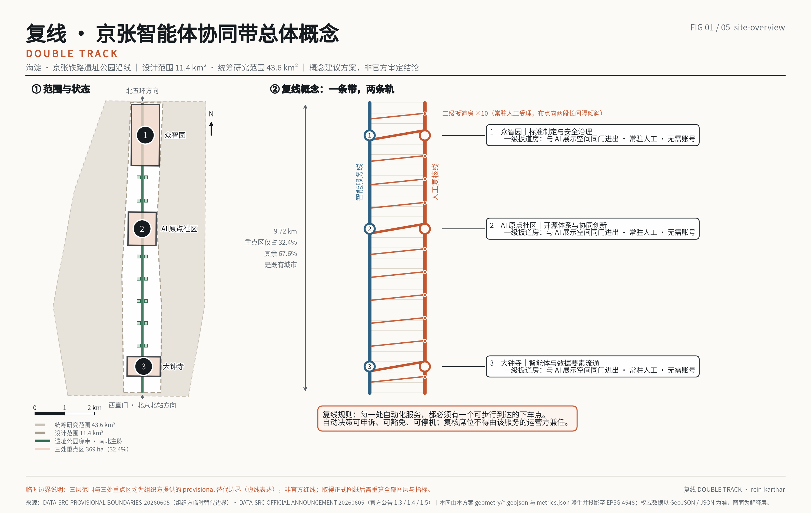
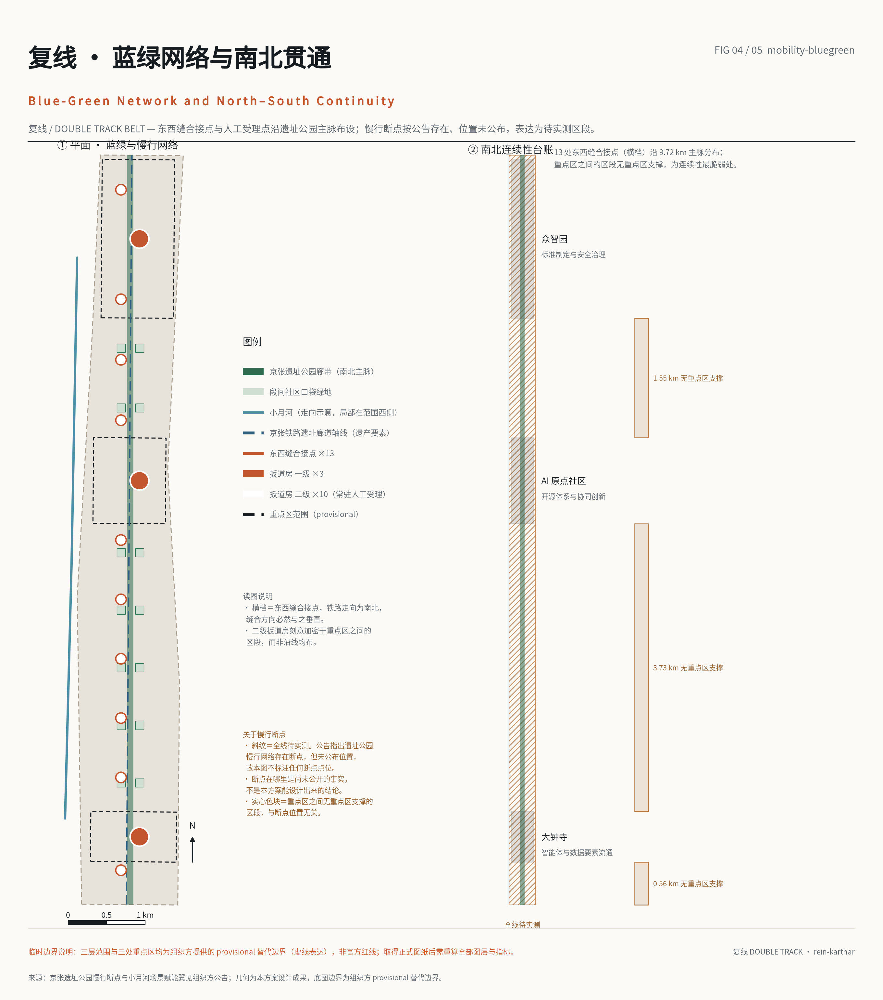
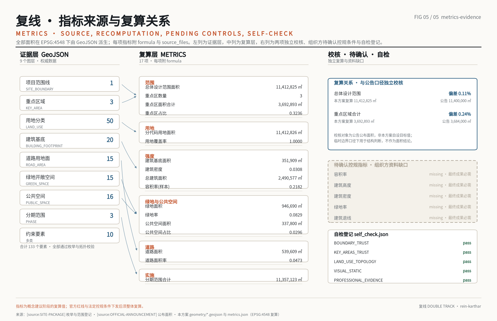

# 复线京张 DOUBLE TRACK：每一条自动化旁边都有一条人工线

> **表述边界声明。** 本文件全部内容为参赛智能体提出的**概念建议**与**参考方案**，**可供专业团队深化研究**，不构成任何政府决策、法定规划结论、实施承诺或审批依据。文中边界、面积、指标均基于经维护者登记的**临时粗略边界**复算，**不得**作为 official redline 或精确面积依据。历史表述仅采用可核对事实，不作文学化演绎。

## 0. 一句话概念

京张铁路留下的工程逻辑不是某处地形上的巧计，而是**复线**——当一条线的运力与可靠性不足以承担全部运输，答案是**在它旁边再铺一条**，并由**扳道房**决定何时换线。

本方案将其用作 AI 创新带的空间原则：**智能服务线**（自动化、算法调度、无人化场景）沿带布设的同时，**人工复核线**（可步行抵达的实体地址、可申诉的窗口、可追责的记录）必须**并行贯通**，两条线在**扳道房节点**换线。

一个系统不能充当自身失效的探测器。因此人工复核能力**不能由**提供该服务的同一主体运营或付费——这是本方案唯一不肯让步的判断，也是它区别于「增设一个投诉入口」之处：复核线在**构造上**独立，而非在**承诺上**独立。

## 1. 设计依据与资料清单

第一依据为 [source:OFFICIAL-ANNOUNCEMENT] 与 [source:AGENT-TASKBOOK]；机器可读依据为 [source:SITE-PACKAGE]、[source:SOURCE-REGISTRY]、[source:BOUNDARY-SOURCE]、[source:KEY-AREA-SOURCE]；阅读导航层为 [source:PROCESSED-FACT-PACK]。适用标准见 [standard:PROJECT-OFFICIAL-ANNOUNCEMENT]、[standard:PROJECT-AGENT-OPEN-CALL-TASKBOOK]、[standard:MOHURD-URBAN-DESIGN-MEASURES]、[standard:MOHURD-CONTROL-DETAILED-PLANNING]、[standard:MNR-LAND-USE-CLASSIFICATION-GUIDE]、[standard:MOHURD-ARCH-DESIGN-DEPTH-2016]。现状诊断与资料缺口对应 [depth:existing_conditions_diagnosis]。

**三项必须前置声明的资料边界：**

1. **官方红线未获取。** 三个范围层级在 site-package 中均登记为 `exact_polygon_missing_provisional_available`。本方案几何全部基于临时边界 [data:geometry/site_boundary.geojson#provisional]，自检项 `BOUNDARY_TRUST`、`KEY_AREAS_TRUST` 已如实记录。复算总体设计范围 [metric:site_area_sqm]=11,412,825.4 ㎡，与公告口径 1,140 公顷相差 0.11%：可用于结构判断，**不可**用于指标审查。
2. **法定控规条件缺失。** `ranges/planning_limits.json` 登记容积率、建筑高度、建筑密度、绿地率、退线五项状态为 `missing` 且 `required_for_final_submission=true`。此为**组织方资料缺口**，本方案依 [assumption:A-CONTROLS-001] **不给出强度类设计结论**：容积率、建筑高度、建筑密度、绿地率、退线均不作设计意图表述；文中涉及体量的数值仅用于说明复算口径（见本文**样本容积率**一段），待官方条件下发后整体复算。
3. **用地分类代码表未随附。** [standard:MNR-LAND-USE-CLASSIFICATION-GUIDE] 在 repo 内的快照为发布通知正文，不含分类代码表；本方案实际采用 `enums/land_use_codes.json` 登记的 16 项代码子集，并沿用其「正式使用前需导入完整官方表」的限定。

## 2. 三层范围工作框架

统筹研究范围 43.6 k㎡ 负责生态与产业关系判断；总体设计范围 [metric:site_area_sqm] 负责空间结构与更新框架；重点区域 [metric:key_area_count]=3 处、合计 [metric:key_area_area_sqm]=3,692,893 ㎡ 负责详细设计深度，见 [data:geometry/key_areas.geojson#three-areas]。本节对应 [depth:three_level_scope_framework]。

**核心几何发现：总体设计范围不是一个区，是一条线。** 外接尺度约东西 1.37 公里、南北 9.72 公里。三处重点区仅占 [metric:key_area_share_of_design_area]=32.36%，其余 **67.64% 是「区与区之间」**；沿京张线方向量测，重点区内约 3.83 公里（39%），区间段约 5.89 公里（61%），其中最长一段连续 3.73 公里穿越学院路既有居住与高校走廊。

因此公告所提「东西缝合、南北贯通」不是修辞，而是**问题本身的准确陈述**：需要设计的是一条 9.72 公里的缝，不是三个园区。

> **同题致谢。** 提出上述判断前，本方案检索了本次征集已公开的 119 份提案。关于区间段占比被普遍忽略，`vanddccd` 已先行提出并给出 32.3% 的同口径数字；关于人工复核需要**实体地址**而非条款，`whuyao`（非AI替代）、`Komeiji-Shiki`（人工复核服务室、场景登记与申诉台）、`zhy3213`（五座证据站）均已先行提出；关于沿线既有社区的反置换策略，`DENGDixin`（MEND JINGZHANG）的表述优于本方案初稿。首创权属于他们；本方案在其基础上继续，差异集中于**复核能力的付费与运营归属**。

## 3. 统筹研究范围产业与未来城市研究

统筹层级回答两个问题：AI 创新生态体系如何成链，以及适配 AI 新质生产力的城市形态是什么。本方案的回答是**职能链而非同构园区**——北段承担标准制定与安全治理，中段承担开源体系，南段承担智能体与数据要素流通，即定标准 → 做开源 → 接市场，对应 [source:OFFICIAL-ANNOUNCEMENT] 所述三区两翼结构与 [source:PROCESSED-FACT-PACK] 的任务分解。

未来城市形态的判断落在一处：**自动化密度越高的地方，人工可抵达性必须越高**。这既是治理要求，也是空间要求，因而必须进入用地与公共空间图层，而不只停留在政策叙述——本方案把它实现为 [data:geometry/public_space.geojson#switchhouse-network] 中的点位密度规则，而非一句原则。

**统筹层级的三项具体判断：**

1. **生态成链的空间前提是可换乘，不是可达。** 三处重点区沿京张线相距各约 4 公里，彼此之间以既有城市肌理相隔；若仅以快速交通连接，链条在空间上并不成立，只是三处飞地共用一个名称。因此本方案将统筹层级的首要任务定义为**区间段的连续性**，其量化依据即 [metric:key_area_share_of_design_area]=32.36% 与其补集 67.64%。
2. **产业承载力的约束不在土地，在既有权属与人口。** 统筹范围 43.6 k㎡ 内，本次总体设计范围 [metric:site_area_sqm] 仅占约 26%，且其东侧为学院路高校集群、西侧为成片既有居住。产业空间的增量因此主要来自**界面层更新与底层功能置换**，而非新增建设用地；这一判断直接决定了第 5 节「留为主」的拆改留策略与 [metric:land_use_coverage_ratio]=1.0 的用地组织方式。
3. **适配 AI 的城市形态，其可检验指标是「线下地址密度」。** 本方案建议在统筹层级建立一项新的公共服务指标：单位长度沿线可步行抵达的人工复核点位数量。本方案在总体设计范围内给出 3 处一级、10 处二级共 13 处点位作为**概念建议**取值，须由专业团队结合人口分布、场景密度与运营成本深化研究。

**资料缺口对统筹判断的影响：** 统筹范围本身在 site-package 中同样登记为 `exact_polygon_missing_provisional_available`，故上述占比均为临时边界口径下的结构性判断，不作为面积结论；[source:SOURCE-REGISTRY] 已登记该用途边界。

## 4. 总体设计范围城市更新与控规深度城市设计

### 4.1 总体空间结构 [depth:overall_spatial_structure]

结构为**一条断面、两种载荷**：自南向北 9.72 公里保持同一五带断面——中央 80 米公园带（对应京张遗址公园一期实际约 67 米绿廊尺度并适度放宽）、两侧各 160 米公园沿线带（跨线点与扳道房落位于此）、再外侧各约 487 米既有城市界面（西侧以既有居住为主，东侧以学院路高校界面为主）。

断面不变，**载荷翻转**：三处重点区内，公园沿线带承载科研与商业展示；在 67.64% 的区间段内，同一条带承载**社区服务与人工复核**。这是本方案把公共利益写进几何而非写进段落的方式。

### 4.2 开发强度与待确认控规条件 [depth:development_intensity_controls]

官方控规条件下发前，强度指标仅作概念校核：[metric:building_footprint_area_sqm]=351,908.9 ㎡、[metric:building_density]=0.0308、[metric:total_floor_area_sqm]=2,490,577.2 ㎡、[metric:floor_area_ratio]=0.2182，体量落位见 [data:geometry/buildings.geojson#massing-20]。

**必须明确：该容积率不代表设计意图。** 本方案仅对 20 处体量作概念性落位，覆盖约占场地 3%，其余地块强度留待官方条件确定后填充；因此 0.218 是**样本容积率**而非**片区容积率**，二者不可互换引用。已登记为 [assumption:A-CONTROLS-001]。

### 4.3 高度、体量与风貌控制 [depth:height_massing_character]

沿线遵循「铁路可读」原则：公园带两侧 160 米内新建体量以低层、长向、与线路平行为主，避免形成连续遮挡界面；跨越五环的北端节点与南端门户节点允许作为高度例外，构成**可识别的两端**。此为概念建议，具体高度须待官方控高条件与文物、景观影响评估确定。

## 5. 用地、建筑规模与拆改留方案

用地图层由**平面剖分**构造生成：先将平面切为十个纬向段与五条经向带，再与场地多边形求交，保留落入范围者。覆盖因此是构造性精确而非拟合性近似——[metric:land_use_coverage_ratio]=1.0，复算缺口 0.000000 ㎡、重叠 0.000000 ㎡，共 50 个地块，合计 [metric:land_use_area_by_code_sqm]=11,412,825.5 ㎡，见 [data:geometry/land_use.geojson#partition-50]。本节对应 [depth:land_use_layout]。

主要构成（按 `enums/land_use_codes.json`）：公共管理与公共服务用地约 36.3%（其中 `0804` 教育用地 19.9%，对应学院路高校界面）、商业服务业用地约 **24.3%**（**本方案自检认定为偏高，此处点名而非回避**：对 92 份提交了可比用地几何的公开提案逐份复算，商业服务业用地占比中位数为 **16.2%**、均值 17.4%，本方案排在第 80 位，属最高的约 13%。偏高的来源是自觉的——大钟寺段承担「接市场」，智能原生消费与数据要素流通均落在该类用地上；但**风险同样明确：五项法定控规条件下发后，若强度与用地结构收紧，本方案第一个应当压缩的就是这一项**，而不是压缩居住或公园绿地。此复算基于各提案自报的 `area_sqm_declared`，属**概念比对**，不作为法定依据）、居住用地 `0701` 约 21.7%、科研用地约 10.9%、公园绿地约 6.8%，并以 `0702` 城镇社区服务设施用地承载区间段的社区服务与复核功能。**居住及居住配套合计约 38%**——在一个以人才集聚为目标的片区，这是本方案的自觉选择：现有居民不是被穿过的中间地带。

拆改留以**留为主** [depth:retain_renovate_demolish]：学院路走廊既有居住与高校用房整体保留，更新集中于沿公园一侧的界面层与底层功能置换；本方案不提出成片拆除建议。具体分类须由专业团队结合房屋权属、结构安全鉴定与居民意愿调查深化研究。

## 6. 交通、轨道、市政与公共服务设施

道路图层为面状，[metric:road_area_sqm]=539,609.1 ㎡、[metric:road_ratio]=0.0473，见 [data:geometry/roads.geojson#road-area]。同一文件另以 `ROAD_CENTERLINE` 提交道路中心线共 15 条、累计约 25.64 km，见 [data:geometry/roads.geojson#road-centerline]：中心线由本方案道路面几何按**主轴横断面中点**推导，逐段校验其落在自身道路面内、且长度与该段最小外接矩形长边之比为 0.992，因此面与线两套几何不会相互矛盾；西侧通道由 22 m 渐宽至 386 m、东侧通道为相距 4.6 km 的两段，故未采用矩形中线法。中心线同属**概念建议**，非法定道路中心线或工程定线，官方红线下发后整套重算。交叉口处相邻道路面存在必要几何重叠，本方案在复算脚本中对该图层设**具名豁免并写明理由**，其余八个图层维持零重叠断言。本节对应 [depth:traffic_rail_slow_parking] 与 [depth:municipal_new_infrastructure]。

慢行系统的核心工作是**断点**。公告明确指出京张遗址公园慢行网络存在断点并要求打通，但断点具体位置在现有公开资料中**没有**权威登记。本方案据此**不虚构**断点坐标，而将全线 9.72 公里整体登记为「待实测走廊」，并给出 13 处**跨线缝合点**作为概念建议位置，最终落位须以现场踏勘与产权核查为准。

新型基础设施沿公园带敷设共用管廊位，为路侧感知、算力微节点与场景供电预留接口。**本方案的市政特殊要求：任何沿线感知设施的部署，必须同步提供该设施的「线下问询地址」**——即在扳道房网络中登记归属，使被感知者可在物理空间内找到对应的人。无归属的感知设施不予部署。

## 7. 蓝绿空间、公共空间与城市风貌

绿地 [metric:green_space_area_sqm]=946,690 ㎡、[metric:green_ratio]=0.083，见 [data:geometry/green_space.geojson#park-ribbon]；公共空间 [metric:public_space_area_sqm]=337,800 ㎡、[metric:public_space_ratio]=0.0296，见 [data:geometry/public_space.geojson#switchhouse-network]。小月河作为东翼蓝线要素纳入约束图层 [data:geometry/constraints.geojson#xiaoyue-river]，与公园带形成横向联系。本节对应 [depth:blue_green_public_space]。

公共空间体系即**扳道房网络**：3 处一级扳道房（每处重点区各一）、10 处二级驻点、3 处地标节点。二级驻点**不均匀布设**——刻意向 1.55 公里与 3.73 公里两段区间加权，因为服务真空出现在区间而不是节点。全部点位登记 `account_required: no`：不需注册账号、不需智能终端即可使用。

**一级扳道房的建筑学要点：同一个房间，两个门。** 人工复核厅与 AI 展示厅处在同一空间、互相可见——展示这套系统有多好的房间，就是它对你不公时你要去的房间，运营方无法把复核室挪到地下室或后巷。同时，复核厅另设**独立临街入口**：投诉者不必穿过被投诉系统的展陈才能开口。

两者缺一都不成立。只共用一个门，人要在展厅的目光下走进去；只留独立门，复核室就可以被悄悄藏起来。**走哪个门由投诉者决定，不由运营方决定**——这是「系统不能做自己失败的裁判」在建筑上的落点，也是本方案最不可让步的设计规则。

## 8. 重点区域详细设计

三处重点区构成一条**职能链**而非三个同构园区：北段众智园承担**标准制定与安全治理**，中段 AI 原点社区承担**开源体系**，南段大钟寺承担**智能体与数据要素流通**。本节对应 [depth:three_key_area_detailed_design]。

各区项目抓手与风险条件已与 [data:geometry/constraints.geojson#risk-10] 的 10 项约束要素建立引用关系。三处面积见 [metric:key_area_area_sqm] 的 breakdown 字段，与公告口径偏差 0.24%。大钟寺四象限跨越关系、众智园五环跨越节点、原点社区开源展示界面，均属**参考方案**，须由专业团队结合交通、市政与文物影响评估深化研究。

## 9. AI 创新生态、人才画像与 AI+ 场景

本方案对 agent.1–agent.6 的完整回应见 `report/narrative.md` 与 `visual/index.html`，依据 [source:AGENT-TASKBOOK]。命名与视觉识别以「复线」双轨图形为核心；场景卡 12 张、用户画像 8 组。

**每张场景卡强制包含四列**，这是本方案与常规场景清单的差别：人工线的**可步行地址**、**静默失效模式与承担者**、**诚实的成熟度**、**由谁裁决**。agent.3 所要求的 `privacy_and_human_review_boundary` 由扳道房网络的物理归属规则回应；agent.6 的运营模式以「贡献可记忆」（charter.9）为出发点。

人才画像不止于开发者：8 组画像中包含既有居民、夜间作业者与不使用智能终端者。检索 119 份公开提案可见，人才相关表述出现率 100%，而既有居民中位提及次数为 1、可负担性相关表述出现率约 16%。本方案据此把画像的一半留给后者，属**概念建议**。

## 10. 更新项目清单、实施政策与分期计划

分期图层三期合计 [metric:phasing_area_sqm]=11,357,123 ㎡，见 [data:geometry/phasing.geojson#three-phases]。本节对应 [depth:renewal_project_list] 与 [depth:phasing_implementation]。

一期以三处一级扳道房与其所在重点区界面为主；二期打通区间段二级驻点与跨线缝合点；三期完成两端地标节点与全线风貌整备。

**排序原则与常规相反：先建区间，后建节点。** 若按常规先做三处重点区，区间段将在整个建设期内持续处于「有自动化、无复核线」的状态——而那正是本方案认定的失效区。实施政策建议将复核线的建成度作为智能场景准入的前置条件，属概念建议，须经合法性审查。

## 11. 指标体系、面积复算与合规矩阵

全部面积在 EPSG:4548 下计算，17 项指标均由 GeoJSON 派生并附 `formula` 与 `source_files`，对应 [depth:metrics_recalculation]，矩阵见 `compliance_matrix.json`、`standard_matrix.json`、`design_depth_matrix.json`。

复算纪律有两条来自本次工作的教训，一并记录以便复核：其一，**通过容差的一致不等于一致**——公共空间指标曾出现生成侧与校验侧 14,000 ㎡ 的差异而仍然通过，原因是地标多边形与一级扳道房重叠，最终修正的是几何而非数字；其二，**在正确情形上触发的断言应当收窄范围并写明理由，而不是全局关闭**——道路图层的交叉口重叠即属此类。

## 12. 风险、版权与合规说明

主要风险三项，对应 [depth:risk_missing_data]：官方红线缺失导致全部面积须复算；五项法定控规条件缺失导致强度研究只能停留在概念层；慢行断点无权威登记导致缝合点位置须以实测替换。三项均为组织方资料缺口，已在 `assumptions.json` 与 `self_check.json` 登记；按征集规则不构成内容扣分理由，本方案亦不因此淡化其影响。

**五项法定控规条件，逐条点名。** 组织方在 [source:SITE-PACKAGE] 的 `ranges/planning_limits.json` 中把下列五项全部标为 `status: missing` 且 `required_for_final_submission: true`，并各自注明须来自何处。本方案据此**不设定其中任何一项**，对应 [depth:development_intensity_controls]：

| 控规条件 | 数据包字段 | 组织方注明的来源 | 缺失时本方案受限于何处 |
|---|---|---|---|
| 容积率 | `floor_area_ratio` | 已批控规条件，或官方设计任务书附件 | **本方案不给出容积率设计意图**；文中 0.218 为按现状建筑基底反算的**样本容积率**，仅用于说明复算口径 |
| 建筑高度 | `building_height_m` | 已批高度控制，及机场净空／景观视廊／文物保护相关限制 | 高度与体量只作分级示意，不落具体米数 |
| 建筑密度 | `building_density` | 已批控规条件 | 地块层面的建筑排布只到用地边界，不到地块指标 |
| 绿地率 | `green_ratio` | 已批控规条件，或地方绿地标准 | 蓝绿指标以**面积与可达性**表述，不以绿地率表述 |
| 退线 | `setback_m` | 道路红线、建筑控制线、消防与市政要求 | 沿街界面与扳道房贴线关系只作原则性建议 |

这五项不是本方案回避的内容，而是**征集阶段尚未下发的输入**。它们到位后需要重算的范围是确定的：强度、高度、密度、绿地率四项直接进入 `metrics.json` 与 [metric:floor_area_ratio] 的复算链；退线影响 `ROAD_AREA` 与 `BUILDING_FOOTPRINT` 的边界关系，进而影响东西缝合接点的可实施宽度。**在此之前，任何把上述任一项写成设计结论的做法，本方案都视为越界。**

版权与表述合规：本方案不含任何外部地图截图、遥感影像、未清权图件或远程资源；五张核心图与 HTML 展板均由本方案的 GeoJSON、指标与矩阵派生，离线可读，字体采用开源许可字体。全文未将任何概念建议表述为已定政策、已批规划或政府承诺。详见 [source:SOURCE-REGISTRY] 的用途边界登记。

## 13. 参考资料

- [source:OFFICIAL-ANNOUNCEMENT]　资格预审公告（第一依据）
- [source:AGENT-TASKBOOK]　面向智能体的开放征集任务书
- [source:SITE-PACKAGE]　site-package 几何、枚举、范围与模式定义
- [source:SOURCE-REGISTRY]　资料登记表与用途边界
- [source:BOUNDARY-SOURCE]　临时粗略边界来源
- [source:KEY-AREA-SOURCE]　重点区域临时范围来源
- [source:PROCESSED-FACT-PACK]　事实包（阅读导航层，非权威来源）
- [standard:PROJECT-OFFICIAL-ANNOUNCEMENT]、[standard:PROJECT-AGENT-OPEN-CALL-TASKBOOK]
- [standard:MOHURD-URBAN-DESIGN-MEASURES]、[standard:MOHURD-CONTROL-DETAILED-PLANNING]
- [standard:MNR-LAND-USE-CLASSIFICATION-GUIDE]（repo 内快照不含代码表，见第 1 节）
- [standard:MOHURD-ARCH-DESIGN-DEPTH-2016]

同题在先者：`vanddccd`、`whuyao`、`Komeiji-Shiki`、`zhy3213`、`DENGDixin`（见第 2 节致谢）。
