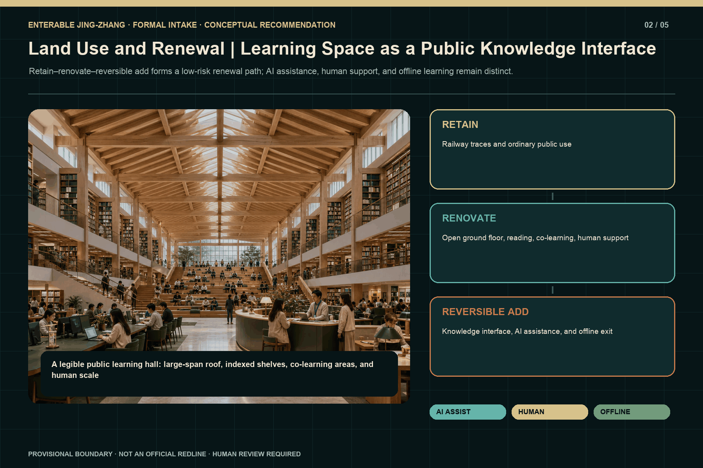
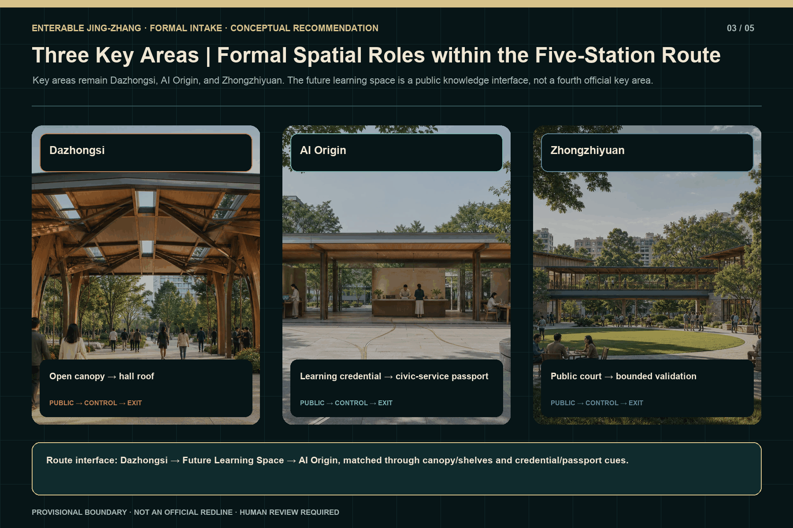
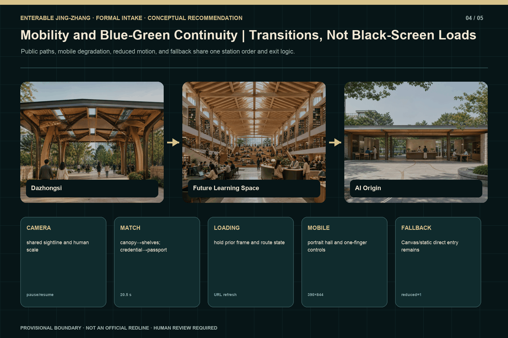

# Enterable Jing-Zhang | One Line, Four Chapters, Five Stations

> GitHub author `wen00710` · private source repository HEAD `8995821c467e96add6524d346d77cd51acb6b8fa` · runtime implementation checkpoint `3d59d727704b84ccf580d1021f5dc6e0e583f3a3`.

## Design Basis and Source List

The proposal registers the official announcement, the Agent taskbook, current official-repository format and terminology controls, and the project's reproducible design model as separate evidence layers. The announcement establishes Coordinated Research, Overall Design, and Key-Area Detailed Design scopes, but the available material does not provide a verifiable statutory redline, regulatory controls, ownership, utilities, fire review, or surveyed slopes. Accordingly, `site_boundary` and the three `key_areas` remain `provisional_constraint`, `official_boundary=false`, and `boundary_precision=provisional_rough`. Their areas and positions support conceptual organization, figure generation, and relative comparison only; they cannot support survey, approval, investment, or construction conclusions [source:OFFICIAL-ANNOUNCEMENT] [source:SITE-PACKAGE] [source:BOUNDARY-SOURCE]; existing-conditions depth is recorded at [depth:existing_conditions_diagnosis].

Runtime evidence is bounded by the declared private-source HEAD and checkpoint. The documented scope is five canonical scene IDs with direct entry, URL-state recovery on refresh, pause/resume, reduced-motion, Canvas/static fallback, and basic mobile checks. The only timed guided segment verified is approximately 20.5 seconds from Dazhongsi through the Future Library/Learning Space to AI Origin. A complete approximately 53-second tour, complete Portfolio Explore, institutional authorization, and an official boundary are not verified. This package therefore never promotes a Wave 1 partial PASS into a formal-submission PASS [source:PRIVATE-SOURCE-REPO] [source:R2-RUNTIME-CONTRACT] [source:R2-WAVE1-VISUAL-QA]; the verified duration is recorded at [metric:verified_wave1_segment_duration_seconds].

The submission directory contains only bilingual public-review text, structured data, provisional geometry, original core figures, and a compiled offline visual. It excludes private source code, Git history, internal QA captures, the other production products, and uncleared material. `sources.json` records title, publisher, date, purpose, license, and evidence grade for every source. The copyright statement distinguishes original presentation assets, programmatic expression, official textual authority, and provisional geometry that must be replaced when better evidence arrives [source:SOURCE-REGISTRY] [source:R2-ORIGINAL-VISUALS].

## Three-Level Scope Framework

The formal title is “Enterable Jing-Zhang | One Line, Four Chapters, Five Stations.” The Coordinated Research Area addresses industry, talent, public value, and long-term operating mechanisms. The Overall Design Area organizes renewal, mobility, blue-green public space, public services, and reversible facilities. The Key-Area Detailed Design scope continues to cover the three announced areas of Dazhongsi, AI Origin, and Zhongzhiyuan. Five stations are narrative and runtime entrances, while the three key areas define professional design depth; they are not interchangeable. `corridor` is an overview and main-line return state, not a sixth station [standard:PROJECT-OFFICIAL-ANNOUNCEMENT] [depth:three_level_scope_framework] [data:geometry/site_boundary.geojson#SITE-001].

### Naming and Project-Original Identity Direction

“Enterable Jing-Zhang” states that ordinary citizens can enter its public paths, knowledge, and services; “One Line, Four Chapters, Five Stations” describes the narrative and runtime structure rather than an administrative division or official project name. The project-original Logo and visual-identity direction centers on the bilingual wordmark “京张可进入 / Enterable Jing-Zhang,” with one continuous line, four chapter beats, and five station markers forming a scalable route grammar for covers, figures, station navigation, and offline pages. The wordmark and identity direction represent only `wen00710`’s competition concept; they are not an official mark of any government, competition, railway, school, or institution and imply no endorsement, authorization, or partnership. They use no railway emblem, school badge, government mark, or third-party trademark [source:R2-ORIGINAL-VISUALS] [source:PRIVATE-SOURCE-REPO] [depth:overall_spatial_structure].

The fixed canonical order is `xizhimen`, `dazhongsi`, `qinghuayuan-knowledge`, `ai-origin`, and `zhongzhiyuan`. The third value is an internal machine ID only; its public name is always Future Library/Learning Space. It does not assert a university, institution, existing building, or authorization. The four chapters are: time and arrival at Xizhimen; heritage-to-knowledge translation from Dazhongsi into the learning space; public intelligence and human responsibility at AI Origin; and visible validation with ordinary-use recovery at Zhongzhiyuan. This creates one line and four chapters rather than five disconnected exhibit boxes [source:R2-RUNTIME-CONTRACT] [depth:overall_spatial_structure] [metric:station_count]; the chapter count is recorded at [metric:chapter_count].

All three scope levels share the same public rules. Every technical layer begins with an ordinary use before AI assistance. Every controlled activity requires a named human responsibility, stop condition, offline alternative, and exit. Every provisional boundary and numerical result keeps its evidence grade and replacement trigger. The route may connect bell inscriptions, roof frames, bookshelves, learning credentials, service passports, and a validation court, but those visual links do not create real partnerships, operators, or tests [source:AGENT-TASKBOOK] [depth:risk_missing_data].

## Coordinated Research Area: Industry and Future City Research

The coordinated layer compresses prior case research into four spatially legible mechanisms that do not depend on invented collaboration. M1, the Open Knowledge Translation Chain, connects archives, bookshelves, learning credentials, open-source contribution, and traceable provenance. M2, Human-Accountable Public Service, limits AI to assisted explanation, queuing, retrieval, and optional route advice while people retain final decisions, appeals, and exception handling. M3, Bounded Validation and Recovery, joins admission, observation, shutdown, data minimization, and restoration of ordinary use. M4, Corridor Stewardship, uses an annual learning route, public activity, maintenance logs, and evidence updates to sustain continuity across the five stations [source:AGENT-TASKBOOK] [depth:municipal_new_infrastructure] [metric:mechanism_count].

### Six Global Ecosystem Cases and Their Jing-Zhang Translation

The preliminary comparison selects six global AI innovation-ecosystem cases to test mechanism questions, not to copy brands or spatial appearances or claim that their outcomes have already occurred in Jing-Zhang:

| Comparative case | Mechanism question tested by this proposal | Conceptual translation for Jing-Zhang |
| --- | --- | --- |
| STATION F [source:CASE-STATION-F] | How startup teams connect with mentors and professional services in an enterable place | M4: cross-station activities, staffed service, and referral |
| Punggol Digital District [source:CASE-PUNGGOL-DIGITAL-DISTRICT] | How research, learning, work, and urban services coordinate at district scale | M4: an ordinary public base and corridor stewardship |
| Seoul AI Hub [source:CASE-SEOUL-AI-HUB] | How talent development, startup support, and shared space form an urban AI community | M2 + M4: staffed support, public learning, and cross-station activity |
| Vector Institute [source:CASE-VECTOR-INSTITUTE] | How basic research, talent development, and industry adoption gain a translation interface | M1: archives, bookshelves, learning credentials, and provenance |
| Mila [source:CASE-MILA] | How research communities, public learning, and venture support form an open knowledge network | M1: a public learning hall, civic learning, and open contribution display |
| Cyber Valley [source:CASE-CYBER-VALLEY] | How academic research, corporate R&D, entrepreneurship, and public engagement sustain long-term connection | M1 + M4: a cross-station learning route and annual evidence review |

These names are research-comparison labels only. They are not a partner list, institutional authorization, brand license, or operating commitment, and they do not prove that the same systems can be deployed directly in Jing-Zhang. This round extracts only verifiable mechanism types from each case's official website, cites no unregistered claims about scale, funding, company counts, or performance, and reduces the translation to M1–M4. Any later case page must still add the operator, date, outcome evidence, license, and non-transferable conditions [source:AGENT-TASKBOOK] [source:SOURCE-REGISTRY] [metric:mechanism_count].

The mechanisms are not four new buildings. M1 moves from mileage and contribution markers at Dazhongsi to the learning-space knowledge index, then concludes with provenance display at Zhongzhiyuan. M2 distinguishes AI-assisted learning, staffed support, and offline learning in the learning space before becoming a public-service passport and staffed handoff at AI Origin. M3 is concentrated in Zhongzhiyuan's observation ring, dual boundary, physical stops, and recovery position. M4 uses Xizhimen's city entrance and the `corridor` overview for cross-station navigation. Each remains a conceptual recommendation and does not imply a commitment by government, school, company, funder, or operator [source:R2-RUNTIME-CONTRACT] [source:R2-WAVE1-VISUAL-QA].

Urban meaning takes priority over technological spectacle. The proposal avoids full-screen neon, unexplained “superintelligence,” and automation presented as public value. Future character is conveyed through enterable ground floors, human scale, bright learning space, an ordinary-service base, and explicit human accountability. If AI is unavailable, the learning space still supports reading, co-learning, and offline indexes; public service still reaches a staffed window; and the validation court returns to ordinary observation and exchange. Graceful degradation is a design requirement rather than an emergency patch [standard:MOHURD-URBAN-DESIGN-MEASURES] [depth:phasing_implementation].

## Overall Design Area: Urban Renewal and Regulatory-Plan-Level Urban Design

The Overall Design layer uses provisional land-use and path layers as a shared base for low-intervention heritage, public learning and service, research and bounded validation, mobility, and blue-green continuity. `land_use.geojson`, `buildings.geojson`, `roads.geojson`, `green_space.geojson`, and `public_space.geojson` are conceptual design layers rather than existing-condition surveys or approved plans. `constraints.geojson` intentionally stays empty where official controls are absent, avoiding inferred lines presented as statutory redlines. FAR, height, road redlines, demolition, utility capacity, and implementation timing remain pending statutory material and professional review [standard:MOHURD-CONTROL-DETAILED-PLANNING] [data:geometry/land_use.geojson#LU-001] [data:geometry/constraints.geojson#CONSTRAINTS]; land-use layout depth is recorded at [depth:land_use_layout].

The five stations form distinct but continuous urban interfaces. Xizhimen is a brief time entrance and contemporary arrival. Dazhongsi addresses only an open canopy, structural rhythm, and low-intervention service outside the heritage boundary. The Future Learning Space is recognized by a large hall frame, bookshelf knowledge index, reading and co-learning areas, visible human scale, and a bright day presentation. AI Origin uses a shaded street, open ground floor, public service, and staffed handoff as an accountability interface. Zhongzhiyuan uses a tower silhouette, public court, observation ring, and bounded validation edge as a visible verification interface. A continuous public path, rather than repeated form, joins them [source:R2-WAVE1-VISUAL-QA] [depth:height_massing_character].

The runtime contract binds scene, camera, URL, tour anchor, explore anchor, loading boundary, and fallback state at each station. This is a presentation and interaction contract, not a statutory planning claim. The open frame leaving Dazhongsi visually matches the main learning-hall frame; a learning credential then matches the AI Origin public-service passport. Loading occurs within related material, direction, and light conditions, while mobile, reduced-motion, and fallback variants preserve meaning through shorter motion or a static continuous composition [source:R2-RUNTIME-CONTRACT] [metric:direct_entry_station_count].

## Detailed Design of Key Areas

The three announced key areas remain Dazhongsi, AI Origin, and Zhongzhiyuan. Dazhongsi is limited to the urban arrival and transition interface outside the heritage boundary. Public paths, an open canopy, reversible information points, and staffed service stay outside the low-intervention edge, and every dimension remains a non-survey-grade design-model value. The bell, temple body, statutory heritage controls, and historical conclusions are not reconstructed. Until surveyed heritage material is available, all buffers and clearances are prompts for further professional work [data:geometry/key_areas.geojson#PROV-KEY-003] [depth:three_key_area_detailed_design].

AI Origin joins a shaded public walk, open ground floor, ordinary service, assisted AI interface, and staffed handoff into an everyday edge with an exit. Equipment cannot consume basic circulation; offline mode retains both human service and an ordinary exit. It is not an automated eligibility system or an unmanned public-administration experiment. At Zhongzhiyuan the public enters only the observation and display layer. Controlled tasks use a unique authorized gate, while a dual boundary, physical stops, recovery positions, and minimal logs constrain the test area. The design does not prove safety certification, road admission, insurance, company participation, or live operations [data:geometry/key_areas.geojson#PROV-KEY-002] [data:geometry/key_areas.geojson#PROV-KEY-001] [source:AGENT-TASKBOOK].

The Future Library/Learning Space is an added public-knowledge node in the five-station route. It is not presented as a newly announced fourth key area and carries no institutional identity. Its hall frame, bookshelves, reading surfaces, co-learning areas, archive-to-knowledge interface, and human scale are formed from project-original procedural geometry and presentation assets. With AI disabled, it remains an ordinary learning space. Its 20.5-second connection with Dazhongsi and AI Origin is verified, but a complete 53-second automatic tour and full free exploration are not verified [source:R2-RUNTIME-CONTRACT] [source:R2-WAVE1-VISUAL-QA] [metric:full_guided_tour_verified].

## AI Innovation Ecosystem, Personas, and AI+ Scenarios

The machine-readable layer keeps ten scenario cards while redistributing them across five stations and adding no eleventh card. Xizhimen has two for accessible time interpretation and multilingual staffed service. Dazhongsi has two for bell-inscription knowledge access and low-impact acoustic rehearsal. The Future Learning Space has two for civic AI learning and a youth opportunity-to-human link. AI Origin has one for inclusive public-service rehearsal. Zhongzhiyuan has three for public-task safety evaluation, a low-speed-device boundary, and open reproducibility display. These cards define spatial needs and risk boundaries; they are not completed pilots, user tests, or operating results [source:AGENT-TASKBOOK] [source:R2-RUNTIME-CONTRACT] [depth:three_key_area_detailed_design].

Seven synthetic personas cover residents, older and disabled users, students and learners, public-service staff, developers and researchers, enterprise visitors, and operations and safety personnel. Personas are used to check seating, clear passage, staffed handoff, captioning, offline material, observation distance, and stop responsibility. They do not support identity inference, credit scoring, biometrics, or eligibility decisions. Every card must identify who enters, the ordinary use, what AI may do, what a person must decide, prohibited data, pause conditions, offline continuity, the exit, and restoration of the facility [depth:municipal_new_infrastructure] [source:SOURCE-REGISTRY].

M1 through M4 cross-check the cards. M1 requires provenance for knowledge and open-source results. M2 requires a human endpoint and appeal in public service. M3 prevents controlled activity from crossing the public boundary and requires stop and recovery. M4 assigns maintenance, activity, and evidence-update roles instead of relying on slogans. There is no verified operator, budget, insurance, DPIA, partner, or personal-data operation; all scenes remain conceptual candidates. Any future pilot requires renewed rights, ethics, safety, accessibility, and professional approval [source:R2-WAVE1-VISUAL-QA] [depth:risk_missing_data].

## Land Use, Building Scale, and Retain-Renovate-Demolish Strategy

Land-use representation follows package enums and shared edges, but every partition is based on provisional site geometry. `site_area_sqm`, `building_footprint_area_sqm`, `green_ratio`, and `public_space_ratio` can be recomputed inside the current model; they are not official site area, statutory green ratio, public-space entitlement, or approved construction quantity. Without an existing-building register or ownership record, the proposal names no building for demolition and provides no fixed FAR, height, floor area, investment, or construction schedule [standard:MNR-LAND-USE-CLASSIFICATION-GUIDE] [metric:site_area_sqm] [metric:building_footprint_area_sqm]; development-intensity limits are recorded at [depth:development_intensity_controls].

Building actions are limited to retain, renovate, and reversible add. Retention covers legible heritage and functioning ordinary public bases. Renovation addresses enterable ground floors, shade, seating, staffed service, and accessible interfaces. Reversible additions cover information indexes, closable equipment, boundaries, stops, recovery, and temporary activity facilities. Dazhongsi avoids refining the heritage body, AI Origin strengthens an open ground floor, and Zhongzhiyuan separates public observation from bounded validation. Every action must be rebuilt against real building, fire, and engineering conditions when professional surveys arrive [data:geometry/buildings.geojson#BLDG-001] [depth:retain_renovate_demolish].

The learning space is recognized by its large-scale frame, hall depth, continuous shelves, knowledge index, reading and co-learning zones, and clear human scale rather than any existing building or a required Blender hero asset. Bright daytime is the primary presentation; night or signal atmosphere remains optional. Shelves and the room continue to work without AI. The current construction proves that procedural geometry can express the visual and interaction concept, not structural feasibility, building permission, institutional authorization, or a real address [source:R2-ORIGINAL-VISUALS] [source:R2-WAVE1-VISUAL-QA] [depth:height_massing_character].

## Transport, Rail, Municipal Infrastructure, and Public Services

Mobility joins transit arrival, walking and cycling, basic accessibility, blue-green public space, and ordinary exits into a continuous public-path system rather than adding railway-themed gameplay. Each station supports direct entry, return to the main line, and jumps to relevant adjacent stations. The free-explore prototype supports entering the learning space, local observation, returning to the route, and jumping to Dazhongsi or AI Origin. URL refresh recovery, basic mobile control, pause/resume, reduced-motion, and fallback are recorded at the declared checkpoint, but those checks are not real pedestrian counts, transport simulations, or operational tests [source:R2-RUNTIME-CONTRACT] [source:R2-WAVE1-VISUAL-QA] [metric:direct_entry_station_count].

Package path comparison uses a local directed graph, design-model service radii, and overlap between public edges and device buffers. Surveyed slopes are absent, so `accessible_continuity_strict` remains unknown. A `flat_design_model` can compare conceptual paths but cannot be written as an accessibility-compliance PASS. Public paths may not cross Zhongzhiyuan's controlled boundary, and every dynamic service in offline mode must reach both staffed service and an ordinary exit. All widths, clearances, and safety bands require professional and surveyed confirmation [data:geometry/roads.geojson#ROAD-001] [metric:accessible_continuity_strict] [depth:traffic_rail_slow_parking].

Municipal, energy, communications, fire, and device-power content is limited to interfaces, manual shutdown, network-loss degradation, and ordinary-use recovery principles, without capacity or alignment claims. Mobile degradation retains station identity, route order, key composition, and exit controls. Reduced motion substitutes cuts, short dissolves, or static visual matching for long camera movement. Canvas/static fallback retains station entry and ordinary learning or service meaning. The complete approximately 53-second tour remains unverified, so overall duration and stability cannot be inferred from the 20.5-second segment [standard:MOHURD-URBAN-DESIGN-MEASURES] [metric:full_guided_tour_verified].

## Blue-Green Network, Public Space, and Urban Character

Blue-green space is an ordinary low-technology base for walking, rest, learning, rainfall management, and public service rather than decorative fill. `green_space.geojson` and `public_space.geojson` derive from the same provisional boundary, allowing internal model recalculation and option comparison. They are not evidence of statutory green space, a water-system redline, or public-space ownership. When official polygons, roads, and water data arrive, related areas, five figure pairs, bilingual HTML, and all four PDFs must be regenerated [data:geometry/green_space.geojson#GREEN-001] [data:geometry/public_space.geojson#PUBLIC-001] [metric:green_ratio]; blue-green public-space depth is recorded at [depth:blue_green_public_space].

Five distinct spatial identities maintain legibility. Xizhimen uses a railway timeline and contemporary arrival. Dazhongsi uses an open frame, a warm low-intervention edge, and service outside the heritage body. The Future Learning Space uses a high hall, knowledge index, bookshelves, and co-learning activity. AI Origin uses a shaded street, open ground floor, public service, and human accountability. Zhongzhiyuan uses a tower silhouette, court observation ring, and explicit control boundary. Even without labels, the three Wave 1 spaces should remain distinguishable rather than becoming repeated boxes or full-screen neon [source:R2-ORIGINAL-VISUALS] [source:R2-WAVE1-VISUAL-QA] [depth:height_massing_character].

### Four Conceptual Pilgrimage/Landmark Nodes

This proposal retains the taskbook term “pilgrimage landmark,” but uses it only for a memorable civic node that people can revisit, recognize, and use for public learning. It has no religious meaning and does not imply that any node is built, approved, or institutionally named. The four conceptual nodes are: (1) the “Bell–Rail Knowledge Gate” outside the Dazhongsi boundary, where an open frame connects time, mileage, and knowledge indexes; (2) the Future Learning Space’s “Commons of Knowledge,” where a high frame, bookshelves, reading, and co-learning form an ordinarily usable public-knowledge destination; (3) AI Origin’s “Human Accountability Porch,” which places ordinary service, AI assistance, staffed handoff, and an offline exit together; and (4) Zhongzhiyuan’s “Visible Validation Court,” which maintains boundaries, stopping, and recovery between public observation and controlled validation. All four names and spatial components are conceptual landmarks proposed by this project, not existing facts or implementation commitments [source:AGENT-TASKBOOK] [source:R2-ORIGINAL-VISUALS] [depth:height_massing_character].

Transitions do not cut to black and load unrelated scenes. The Dazhongsi canopy and frame match the learning hall's primary structure in direction, rhythm, and material, while mileage and contribution markers become shelves and knowledge indexes. An archive or learning credential then becomes an AI Origin public-service passport, and knowledge assistance becomes public service with human responsibility. Desktop, mobile, short landscape, reduced-motion, and fallback variants may shorten or staticize movement, but they preserve the visual and semantic match [source:R2-RUNTIME-CONTRACT] [metric:verified_wave1_segment_duration_seconds].

## Renewal Projects, Implementation Policy, and Phasing

Implementation has three layers. Phase 0 establishes only the ordinary public base: continuous paths, reading and learning, staffed service, stop controls, exits, offline materials, and maintenance access. It works without AI. Phase 1 is the current Wave 1 vertical prototype, limited to the 20.5-second Dazhongsi–Future Learning Space–AI Origin segment and the five-station direct-entry contract. It checks visual recognition, state recovery, mobile degradation, and separation of AI, human, and offline support. Phase 2 may expand a complete tour, full Portfolio, professional key-area detail, and long-term programming only after official geometry, rights, operations, fire, accessibility, safety, budget, and owner gates [data:geometry/phasing.geojson#PHASE-001] [depth:phasing_implementation].

The renewal list stays reversible: repair the corridor public path; create the Xizhimen time entrance; provide low-impact arrival and a knowledge transition outside the Dazhongsi boundary; create an ordinarily usable future learning hall; clarify human-accountable service at AI Origin; establish public observation, bounded validation, stop, and recovery at Zhongzhiyuan; and maintain source, copyright, and evidence updates. This is a conceptual list rather than project approval, procurement, construction, or operating commitment, with no fixed investment, schedule, or delivery body [standard:MOHURD-CONTROL-DETAILED-PLANNING] [depth:renewal_project_list].

M1 through M4 receive separate governance roles. Content curation and copyright review maintain knowledge provenance. A staffed-service lead retains final decisions and appeals. Safety and operations roles control admission, shutdown, and incident records for validation. Corridor stewardship uses cross-station maintenance logs, an activity calendar, and annual evidence review. If any role, permission, or exit mechanism is missing, the related AI layer remains closed and the place returns to ordinary use. No operator is currently confirmed; these are entry gates for a later stage [source:AGENT-TASKBOOK] [source:R2-WAVE1-VISUAL-QA] [depth:risk_missing_data].

## Metrics, Area Recalculation, and Compliance Matrix

Metrics are separated into planning-model results, runtime evidence, and unknown items. The public package registers frozen comparison results for B0_CURRENT_AUTHORED, A1_PUBLIC_CONTINUITY, and A2_BOUNDED_VALIDATION. Six raw families cover public reach, service coverage, pedestrian-device conflict, a flat accessibility proxy, offline exit and recovery, and public-controlled boundary crossings. Non-compensable hard gates precede any composite score. A1's relative preference belongs only to the provisional local model; it is not automatic approval, real crowd behavior, or operating performance [metric:planning_baseline_score] [metric:planning_a1_score] [metric:planning_a2_score]; recomputation must return to the private R1 source because the public package omits executable methods [depth:metrics_recalculation].

Runtime facts that may be stated are `station_count=5`, `chapter_count=4`, `key_area_count=3`, `mechanism_count=4`, five direct station entries, and an approximately `20.5s` verified Wave 1 segment. Verification of the complete approximately 53-second automatic tour remains unknown/false and is not filled with a target duration. Complete Portfolio Explore is likewise not presented as finished. URL refresh, pause/resume, reduced-motion, mobile, and fallback are checkpoint-specific checks and are not generalized to all browsers, devices, or network conditions [metric:station_count] [metric:verified_wave1_segment_duration_seconds] [metric:full_guided_tour_verified]; the testing boundary is recorded at [source:R2-WAVE1-VISUAL-QA].

All areas and ratios remain low-confidence and tied to source layers. Surveyed slopes, official boundaries, FAR, height, crowd data, energy, cost, schedule, model performance, and real-user results remain unknown. The compliance matrix locates responses across the announcement tasks, agent.1 through agent.6, thirteen proposal sections, five figure pairs, geometry, metrics, assumptions, and self-check. “Addressed” in a matrix means that reviewable evidence exists; it does not mean statutory compliance, professional approval, or a passed formal intake gate [source:SOURCE-REGISTRY] [depth:risk_missing_data].

## Risk, Copyright, and Compliance

Evidence uses four grades. Documented evidence includes the announcement, taskbook, source commit, runtime checkpoint, project-original presentation assets, and deterministic receipts. Inferred evidence includes land use, green and public space, and concept buildings derived from provisional boundaries. Interpretive evidence includes local-metre spatial models, mechanism mapping, weights, and composite scores. Unavailable evidence includes official redlines, regulatory controls, ownership, utilities, exact heritage controls, fire review, budget, insurance, DPIA, real operators, real tests, and institutional authorization. Visual polish cannot upgrade an evidence grade [source:SOURCE-REGISTRY] [source:BOUNDARY-SOURCE] [data:geometry/constraints.geojson#CONSTRAINTS]; risk and missing-data depth is recorded at [depth:risk_missing_data].

Seven WebP assets were generated independently on 2026-08-31 with Codex built-in ImageGen from project-authored text-only prompts. The prompt-to-output mapping was committed alongside the assets at private-source commit `5b073cb311bf3ce0a1b37ba6f07f161a0a94641f`, and the formal-package copies match the source-repository asset hashes. The retained record supports only the tool name, per-image prompts, dimensions, and local conversion to WebP quality 88. The underlying image model and version, generation IDs, seeds, source PNG files, and exact conversion tool were not retained and therefore remain unknown. This submission-packaging review consulted `docs/visual-style-recommendations.md` after generation; it does not rewrite that guide as a generation-time source, and no image was regenerated in this repair [source:R2-ORIGINAL-VISUALS] [source:PRIVATE-SOURCE-REPO].

Programmatic Three.js, Canvas, diagrams, HTML, and PDF are project-generated expression. The formal package distributes only the compiled offline visual and approved assets, not private `app`, `tests`, `scripts`, internal docs, QA artifacts, Git metadata, or other production products. The participant declares that the current imagery embeds no commercial map, third-party model, official logo, remote font, or institution-specific identity; this is a participant provenance statement rather than an independent pixel-forensics certification. Offline pages use no CDN, tracking, or uncleared remote media, and the machine ID `qinghuayuan-knowledge` confers no institutional identity or historical conclusion [source:R2-ORIGINAL-VISUALS] [source:PRIVATE-SOURCE-REPO].

The package must not claim a complete 53-second tour, complete Portfolio, institutional authorization, a precise official redline, or a formal-submission PASS. Wave 1 checks support only bounded capability statements. Final `self_check`, participant preflight, push, and PR decisions belong to official scripts and the owner. If a mandatory intake gate fails, its failure must be preserved and pushing must stop rather than deleting limitations or rewriting results. This proposal is not planning, legal, engineering, accessibility, fire-safety, or copyright legal advice [standard:PROJECT-OFFICIAL-ANNOUNCEMENT] [source:AGENT-TASKBOOK] [metric:full_guided_tour_verified].

## References

Formal authorities include the official announcement and task scope [source:OFFICIAL-ANNOUNCEMENT], the Agent taskbook with six tasks and a unified boundary clause [source:AGENT-TASKBOOK], the official site package, formats, enums, and schemas [source:SITE-PACKAGE], and the source-use registry [source:SOURCE-REGISTRY]. The provisional overall and three key-area boundaries are registered as [source:BOUNDARY-SOURCE] and [source:KEY-AREA-SOURCE]. Both are provisional-only and are not official redlines.

Implementation provenance includes the declared private-source HEAD [source:PRIVATE-SOURCE-REPO], the five-station runtime contract [source:R2-RUNTIME-CONTRACT], Wave 1 visual and browser checks [source:R2-WAVE1-VISUAL-QA], and the original WebP and programmatic-presentation registry [source:R2-ORIGINAL-VISUALS]. The R1 candidate is used only as a structural and reproducible planning-evidence migration source [source:R1-CANDIDATE-SKELETON]. Its old 63-second narrative, unavailable-owner status, and four-node figure are not inherited as R2 conclusions.

Professional standards and evidence locations are stored in `standard_matrix.json`, `compliance_matrix.json`, `design_depth_matrix.json`, `metrics.json`, and `assumptions.json`. The three option scores are registered in `metrics.json` as frozen low-confidence R1 results; their executable method remains in the private source and is not distributed with this formal public package, so they support only the current provisional planning comparison. R2 five-station runtime statements depend on the source commit, checkpoint, and bilingual QA. Every source records date, publisher, purpose, license, and evidence grade. Missing official material remains unknown rather than being inferred from images or narrative [depth:existing_conditions_diagnosis] [depth:metrics_recalculation].
