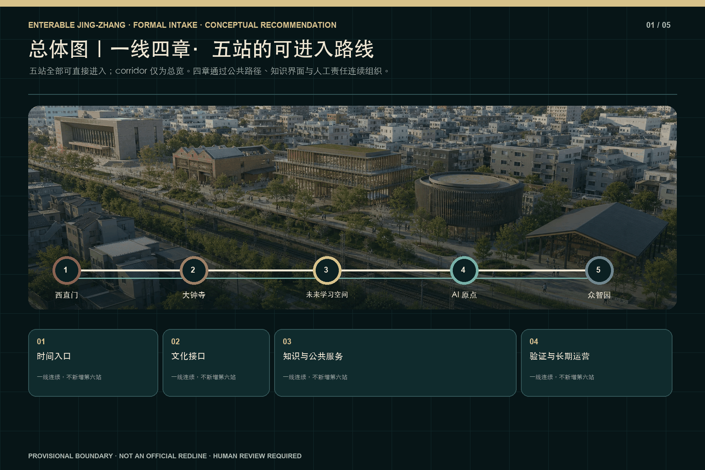
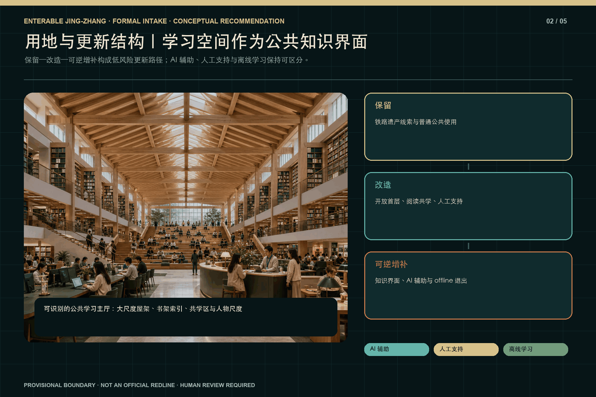
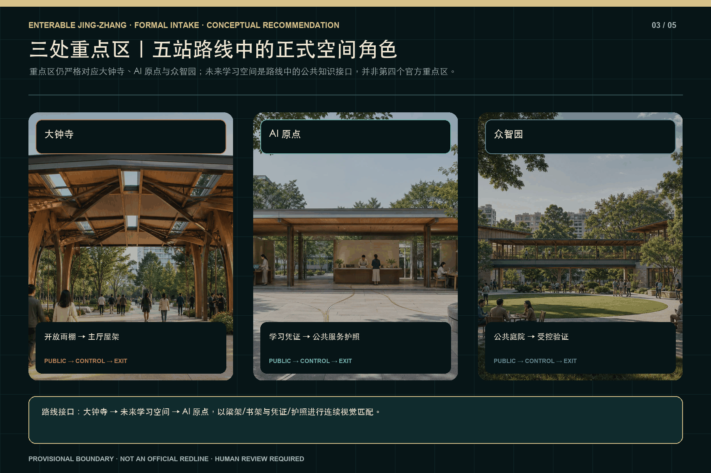
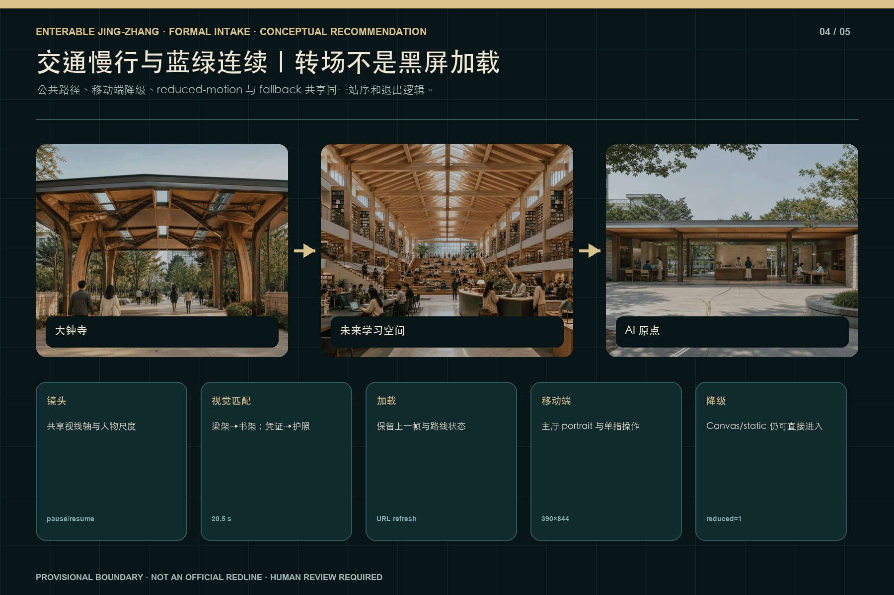
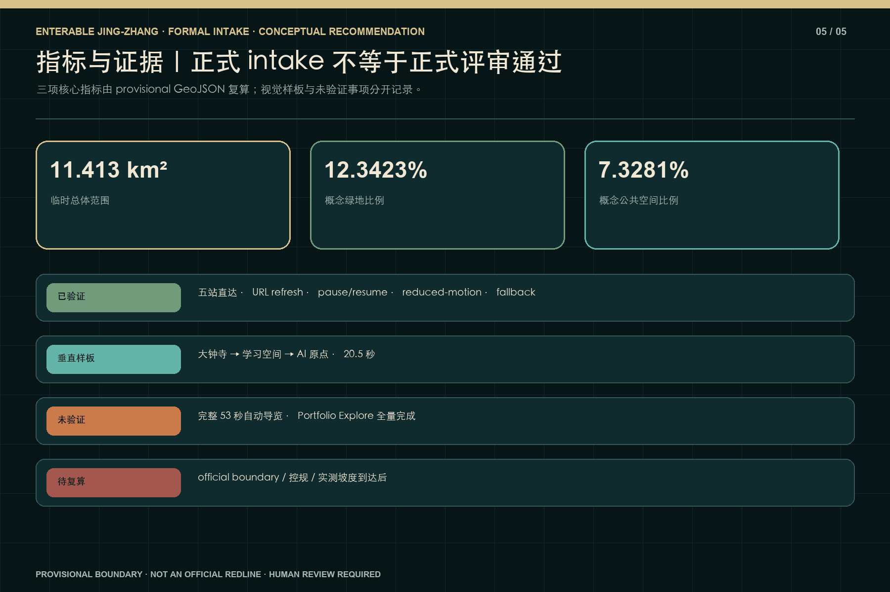

# 京张可进入｜一线四章·五站

> Enterable Jing-Zhang | One Line, Four Chapters, Five Stations · GitHub 作者 `wen00710` · 私有源仓库 HEAD `8995821c467e96add6524d346d77cd51acb6b8fa` · 运行时 implementation checkpoint `3d59d727704b84ccf580d1021f5dc6e0e583f3a3`。

## 设计依据与资料清单

本方案把正式公告、面向智能体任务书、官方仓库中的格式与术语约束，以及项目自身可复核的设计模型分开登记。公告确认统筹研究、总体设计和重点区域三层任务，但当前材料没有提供可核验的法定红线、控规指标、权属、市政、消防或实测坡度。因此 `site_boundary` 与三处 `key_areas` 继续标为 `provisional_constraint`、`official_boundary=false`、`boundary_precision=provisional_rough`；其面积和位置只用于概念组织、图面生成和相对比较，不可转写为测绘、审批、投资或施工结论 [source:OFFICIAL-ANNOUNCEMENT] [source:SITE-PACKAGE] [source:BOUNDARY-SOURCE]；现状诊断深度见 [depth:existing_conditions_diagnosis]。

运行时证据来自私有源仓库指定 HEAD 与 checkpoint。可确认的是五个 canonical scene ID 均有直接进入方式，URL 刷新可恢复状态，存在 pause/resume、reduced-motion、Canvas/static fallback 和移动端基础检查；已验证的自动导览内容仅为约 20.5 秒的“大钟寺→未来学习空间→AI 原点”中段。完整约 53 秒导览、完整 Portfolio Explore、机构授权和官方边界均未验证，本包不把 Wave 1 的局部 PASS 写成正式投稿 PASS [source:PRIVATE-SOURCE-REPO] [source:R2-RUNTIME-CONTRACT] [source:R2-WAVE1-VISUAL-QA]；核验时长见 [metric:verified_wave1_segment_duration_seconds]。

提交目录只包含公开审阅所需的双语文本、结构化数据、临时几何、原创核心图和编译后离线 visual；不包含私有源代码、Git 历史、内部 QA 截图、其他 production 产品或未清权材料。所有来源在 `sources.json` 中记录标题、发布者、日期、用途、许可和证据等级，版权声明区分原创表现层、程序化表达、官方文本依据和仅供替换的临时几何 [source:SOURCE-REGISTRY] [source:R2-ORIGINAL-VISUALS]。

## 三层范围工作框架

作品正式名为“京张可进入｜一线四章·五站 / Enterable Jing-Zhang | One Line, Four Chapters, Five Stations”。统筹研究范围回答产业、人才、公共价值和长期运营机制；总体设计范围组织城市更新、交通慢行、蓝绿公共空间、公共服务与可逆设施；重点区域范围仍对应公告所指的大钟寺、AI 原点和众智园三处详细设计区。五个站点是叙事与运行时入口，三处重点区是专业设计深度，两者不能相互替代。`corridor` 只承担总览与返回主线，不被包装成第六站 [standard:PROJECT-OFFICIAL-ANNOUNCEMENT] [depth:three_level_scope_framework] [data:geometry/site_boundary.geojson#SITE-001]。

五站 canonical order 固定为：`xizhimen`、`dazhongsi`、`qinghuayuan-knowledge`、`ai-origin`、`zhongzhiyuan`。其中第三项只是内部机器 ID，对外名称始终为“未来图书馆／学习空间”；它不代表高校、机构或既有建筑授权，也不引入任何特定校园身份。四章叙事依次为：西直门的时间与抵达；大钟寺到学习空间的遗产—知识转译；AI 原点的公共智能与人工责任；众智园的可见验证与恢复。五站因此形成“一线四章”，而不是五个彼此断开的展示盒子 [source:R2-RUNTIME-CONTRACT] [depth:overall_spatial_structure] [metric:station_count]；章节数量见 [metric:chapter_count]。

跨层传导采用同一组公共规则：任何技术节点先有普通用途，再有 AI 辅助；任何受控活动都有人工责任、停止条件、离线替代和退出路径；任何临时边界或数值都保留证据等级与替换触发。路线视觉可以把钟铭、屋架、书架、凭证、服务护照和验证庭院连续组织，但不能据此制造真实合作、真实运营或真实测试结论 [source:AGENT-TASKBOOK] [depth:risk_missing_data]。

## 统筹研究范围产业与未来城市研究

统筹层把前期案例研究压缩为四项可被空间读取、又不依赖虚构合作的机制。M1“开放知识转化链”把档案、书架、学习凭证、开源贡献和可追溯来源连接起来；M2“人工责任公共服务”要求 AI 只做辅助解释、排队、检索和路径建议，最终判断、申诉和异常处理由人承担；M3“有边界的验证与恢复”把准入、观察、停机、日志最小化和普通用途恢复放在同一场景；M4“走廊共同运营”以年度学习路线、公共活动、维护台账和证据更新维持五站之间的连续性 [source:AGENT-TASKBOOK] [depth:municipal_new_infrastructure] [metric:mechanism_count]。

四项机制不是四座新建筑。M1 主要从大钟寺的里程与贡献标识过渡到未来学习空间的知识索引，并在众智园以来源链展示收束；M2 在学习空间区分 AI 辅助学习、人工支持和离线学习，再在 AI 原点转为公共服务护照与人工交接；M3 集中落实于众智园的观察环、双层边界、实体停止和恢复位；M4 则由西直门的城市入口和 `corridor` 总览提供跨站导航。每项机制均为概念建议，不代表政府、学校、企业、基金或运营主体已经承诺参与 [source:R2-RUNTIME-CONTRACT] [source:R2-WAVE1-VISUAL-QA]。

城市意义优先于技术名词。系统不以满屏霓虹、不可解释的“超级智能”或自动化替代公共价值，而以可进入首层、人物尺度、明亮学习环境、普通服务底座和清晰人工责任表达未来。AI 关闭时，学习空间仍可阅读、共学和使用离线索引；公共服务仍可到人工窗口；验证庭院仍可恢复为普通观察与交流场所。这种可降级能力是正式方案的一部分，而非演示失败后的临时补丁 [standard:MOHURD-URBAN-DESIGN-MEASURES] [depth:phasing_implementation]。

## 总体设计范围城市更新与控规深度城市设计

总体设计以 provisional 用地和路径图层作为共同底板，表达遗产低干扰、公共学习服务、研发验证、慢行与蓝绿连续的关系。`land_use.geojson`、`buildings.geojson`、`roads.geojson`、`green_space.geojson` 和 `public_space.geojson` 是概念设计图层，不是现状测绘或批准方案；`constraints.geojson` 对缺少官方控制线的部分保持空集合，避免用推定线条冒充正式红线。容积率、建筑高度、道路红线、拆改留、工程容量和建设时序均等待法定资料与专业复核 [standard:MOHURD-CONTROL-DETAILED-PLANNING] [data:geometry/land_use.geojson#LU-001] [data:geometry/constraints.geojson#CONSTRAINTS]；用地布局深度见 [depth:land_use_layout]。

五站形成不同而连续的城市界面。西直门是低时长的时间入口和当代抵达；大钟寺只处理遗产边界外的开放雨棚、梁架和低干扰服务；未来学习空间以大尺度主厅屋架、书架知识索引、阅读与共学区、人物尺度和明亮日间视觉成为公共学习节点；AI 原点以林荫街道、开放首层、公共服务与人工交接形成责任界面；众智园以塔楼剪影、公共庭院、观察环和受控验证边界形成可见验证节点。共同语言是连续公共路径，不是复制相同造型 [source:R2-WAVE1-VISUAL-QA] [depth:height_massing_character]。

运行时合同把 scene、camera、URL、tour anchor、explore anchor、loading boundary 与 fallback 状态绑定在每站；这是一项表现层和交互层合同，不改变法定规划性质。大钟寺离开时的开放梁架与学习主厅屋架构成视觉匹配，学习凭证与 AI 原点公共服务护照构成第二次匹配；加载可在同一材质、方向和亮度关系中发生，移动端、reduced-motion 与 fallback 则用缩短运动或静态连续构图保留语义 [source:R2-RUNTIME-CONTRACT] [metric:direct_entry_station_count]。

## 重点区域详细设计

公告意义上的三处重点区域仍为大钟寺、AI 原点和众智园。大钟寺只深化遗产边界之外的城市抵达与转场界面：公共路径、开放雨棚、可逆信息节点和人工服务都保持在低干扰边界外，任何尺寸均为 non-survey-grade design-model value。钟体、寺庙主体、法定文保范围和历史结论均不被本方案重构；取得正式文保与测绘资料前，所有缓冲和净距只能作为深化提示 [data:geometry/key_areas.geojson#PROV-KEY-003] [depth:three_key_area_detailed_design]。

AI 原点把林荫公共步道、开放首层、普通公共服务、AI 辅助界面和人工交接窗串成一条可退出的日常服务边。服务设备不占用基本通行，离线后仍保留人工办理和普通出口；它不是自动资格判断或无人公共管理实验。众智园的公众只进入观察与展示层，受控任务通过唯一授权 gate 进入和退出，双层边界、实体停止、恢复位和日志最小化限制测试范围。当前表达不证明安全认证、道路准入、保险、企业参与或真实运营 [data:geometry/key_areas.geojson#PROV-KEY-002] [data:geometry/key_areas.geojson#PROV-KEY-001] [source:AGENT-TASKBOOK]。

未来图书馆／学习空间是五站路线中的新增公共知识节点，不被冒充为公告新增的第四重点区，也不附着任何机构身份。其主厅屋架、书架、阅读台、共学区、档案—知识界面与人物尺度均由项目原创程序几何和表现资产形成；场景即使关闭 AI，仍可作为普通学习空间运行。它与大钟寺、AI 原点之间的 20.5 秒段落已经验证，但完整 53 秒自动导览和全量自由探索尚未验证 [source:R2-RUNTIME-CONTRACT] [source:R2-WAVE1-VISUAL-QA] [metric:full_guided_tour_verified]。

## AI 创新生态、人才画像与 AI+ 场景

机器层保留十张场景卡，但按五站重新分配而不增加第十一张：西直门两张，覆盖时间可访问解释与多语言人工服务；大钟寺两张，覆盖钟铭知识解释与低干扰声学排演；未来学习空间两张，覆盖市民 AI 学习转化与青年机会—人工联络；AI 原点一张，覆盖包容性公共服务排演；众智园三张，覆盖公共任务安全评测、低速设备边界与开源复现展示。场景卡是空间需求和风险边界，不是已发生的试点、用户测试或运营绩效 [source:AGENT-TASKBOOK] [source:R2-RUNTIME-CONTRACT] [depth:three_key_area_detailed_design]。

七类合成人物画像包括居民、老年人与残障使用者、学生和学习者、公共服务人员、开发者与研究者、企业访客、运维与安全人员。画像只帮助检查座席、净通行、人工交接、字幕、离线材料、观察距离和停止责任，不用于身份推断、信用评分、生物识别或资格决定。每张卡都必须能回答：谁进入、普通用途是什么、AI 做什么、人负责什么、哪些数据禁止收集、何时暂停、离线如何继续、从哪里退出、设施如何恢复 [depth:municipal_new_infrastructure] [source:SOURCE-REGISTRY]。

M1—M4 与场景卡建立交叉核验：M1 要求知识和开源成果有来源链；M2 要求公共服务存在人工终局与申诉；M3 要求验证活动不能穿越公共边界并能停止恢复；M4 要求维护、活动和证据更新有角色而非口号。当前没有真实运营者、预算、保险、DPIA、合作单位或个人数据，因而所有场景只到概念候选；任何未来试点都必须重新完成权利、伦理、安全、无障碍和专业审批 [source:R2-WAVE1-VISUAL-QA] [depth:risk_missing_data]。

## 用地、建筑规模与拆改留方案

用地表达沿用包内枚举和共享边线，但所有分区都建立在 provisional site geometry 上。`site_area_sqm`、`building_footprint_area_sqm`、`green_ratio` 与 `public_space_ratio` 可以从当前图层重复计算，却不等于官方用地面积、法定绿地率、公共空间指标或批准建设量。没有现状建筑台账和权属资料时，本方案不点名拆除任何建筑，也不提供 FAR、限高、建筑面积、投资额或施工工期的确定结论 [standard:MNR-LAND-USE-CLASSIFICATION-GUIDE] [metric:site_area_sqm] [metric:building_footprint_area_sqm]；开发强度边界见 [depth:development_intensity_controls]。

建筑动作只分为“保留、改造、可逆增补”。保留对象是可识别遗产及仍可使用的普通公共底座；改造对象是首层可进入性、遮阴、座席、人工服务和无障碍界面；可逆增补对象是信息索引、可关闭设备、边界、停机、恢复和临时活动设施。大钟寺避免深化遗产主体，AI 原点强化开放首层，众智园强化公众观察与受控验证的分离。所有动作需在正式调查到达后按真实建筑、消防和工程条件重建 [data:geometry/buildings.geojson#BLDG-001] [depth:retain_renovate_demolish]。

未来学习空间的建筑识别来自大尺度屋架、主厅纵深、连续书架、知识索引、阅读与共学区域以及清晰人物尺度，而不是依赖某一座既有建筑或 Blender hero asset。明亮日间是主状态，夜间或信号氛围只是可选表现；书架和空间在无 AI 时仍然工作。当前构造只证明视觉与交互概念可以被程序几何表达，不证明结构可行性、建设许可、机构授权或真实地址 [source:R2-ORIGINAL-VISUALS] [source:R2-WAVE1-VISUAL-QA] [depth:height_massing_character]。

## 交通、轨道、市政与公共服务设施

交通策略将轨道抵达、步行骑行、基本无障碍、蓝绿公共空间和普通退出组织为连续公共路径，而不是增加铁路主题玩法。五站均可直接进入、返回主线并跳转相邻关键站；自由探索样板支持进入学习空间、局部观察、返回主线以及跳至大钟寺和 AI 原点。URL 刷新恢复、移动端基础操作、pause/resume、reduced-motion 和 fallback 已在指定 checkpoint 记录，但这些运行时检查不等于真实客流、交通仿真或设施运营测试 [source:R2-RUNTIME-CONTRACT] [source:R2-WAVE1-VISUAL-QA] [metric:direct_entry_station_count]。

包内路径比较采用局部有向图、设计模型服务半径和设备缓冲重叠进行相对校核。实测坡度缺失，因此 `accessible_continuity_strict` 保持 unknown；`flat_design_model` 只能比较概念路径，不能写为无障碍合规 PASS。公众路径不得穿越众智园受控边界，动态服务离线时必须同时到达人工服务与普通出口。任何路径宽度、净距和安全带数值均需专业团队和实测资料确认 [data:geometry/roads.geojson#ROAD-001] [metric:accessible_continuity_strict] [depth:traffic_rail_slow_parking]。

市政、能源、通信、消防和设备供电仅提出接口、人工停机、断网降级和普通用途恢复原则，不推算容量或线位。移动端降级优先保留站点身份、路线顺序、关键构图和退出控制；reduced-motion 用切换、短溶解或静态匹配替代长镜头；Canvas/static fallback 保留站点入口和普通学习／服务语义。完整约 53 秒导览尚未验证，不能从 20.5 秒中段外推出总体时长或整体稳定性 [standard:MOHURD-URBAN-DESIGN-MEASURES] [metric:full_guided_tour_verified]。

## 蓝绿空间、公共空间与城市风貌

蓝绿空间被视为日常步行、休息、学习、雨洪和公共服务的低技术底座，而非装饰背景。`green_space.geojson` 与 `public_space.geojson` 从同一 provisional boundary 派生，所以可用于当前模型内部复算和方案比较；它们不是法定绿地、河道蓝线或公共空间权属证据。官方 polygons、道路和水系资料到达时，相关面积、五组图、双语 HTML 与四份 PDF 都必须重新生成 [data:geometry/green_space.geojson#GREEN-001] [data:geometry/public_space.geojson#PUBLIC-001] [metric:green_ratio]；蓝绿公共空间深度见 [depth:blue_green_public_space]。

五站通过不同的空间身份保持可读性：西直门以铁路时间线和当代抵达为主；大钟寺以开放梁架、暖色低干扰边界和院外服务为主；未来学习空间以高屋架、知识索引、书架和共学活动为主；AI 原点以林荫街道、开放首层、公共服务与人工责任为主；众智园以塔楼剪影、庭院观察环和明确控制边界为主。即使不看文字，三段 Wave 1 主空间也应被分辨，不依赖相同盒子或满屏霓虹 [source:R2-ORIGINAL-VISUALS] [source:R2-WAVE1-VISUAL-QA] [depth:height_massing_character]。

转场不是黑屏后载入无关场景。大钟寺的开放雨棚／梁架在视线方向、节奏和材质上过渡到学习空间主厅屋架，里程与贡献标识过渡到书架与知识索引；学习空间的档案／学习凭证过渡到 AI 原点公共服务护照，知识辅助转为公共服务与人工责任。桌面、移动端、短横屏、reduced-motion 与 fallback 可以缩短或静态化运动，但应保持这些视觉和语义匹配 [source:R2-RUNTIME-CONTRACT] [metric:verified_wave1_segment_duration_seconds]。

## 更新项目清单、实施政策与分期计划

实施分三层推进。Phase 0 只建立普通公共底座：连续路径、普通阅读与学习、人工服务、停止、出口、离线资料和维护入口；没有 AI 也能工作。Phase 1 对应当前 Wave 1 垂直样板，限定在大钟寺—未来学习空间—AI 原点的 20.5 秒段落和五站直接进入合同，用于检验视觉识别、状态恢复、移动降级与人工／离线区分。Phase 2 才可能扩展完整导览、完整 Portfolio、三重点区专业深化和长期活动，但必须先通过正式 geometry、权利、运营、消防、无障碍、安全、预算和 owner 审核 [data:geometry/phasing.geojson#PHASE-001] [depth:phasing_implementation]。

更新项目清单保持可逆：修补走廊公共路径；建立西直门时间入口；在大钟寺边界外设置低干扰抵达与知识转场；构建普通可用的未来学习主厅；完善 AI 原点人工责任服务界面；在众智园建立公众观察、受控验证、停机和恢复位；维护来源、版权和证据更新。清单是概念建议，不是立项、采购、施工或运营承诺，不给出确定投资、工期和实施主体 [standard:MOHURD-CONTROL-DETAILED-PLANNING] [depth:renewal_project_list]。

M1—M4 分别配置治理责任：知识来源由内容策展与版权复核负责；公共服务由人工服务负责人承担最终决定和申诉；验证活动由安全与运维角色控制准入、停止和事件记录；走廊运营由跨站维护台账、活动日历和年度证据复盘支撑。若任一角色、许可或退出机制缺失，相应 AI 功能不开放，空间退回普通用途。当前不存在已确认运营者，以上只是进入下一阶段的门槛设计 [source:AGENT-TASKBOOK] [source:R2-WAVE1-VISUAL-QA] [depth:risk_missing_data]。

## 指标体系、面积复算与合规矩阵

指标分为规划模型、运行时证据和未知项三类。公开包只登记 B0_CURRENT_AUTHORED、A1_PUBLIC_CONTINUITY 与 A2_BOUNDED_VALIDATION 三项冻结比较结果；六类原始指标覆盖公共可达、服务覆盖、行人—设备冲突、平地无障碍代理、离线退出恢复和公共／受控边界穿越，并以不可补偿 hard gate 先于综合分。A1 的相对偏好只属于 provisional local model，不是自动批准、真实人流或运营绩效 [metric:planning_baseline_score] [metric:planning_a1_score] [metric:planning_a2_score]；复算必须回到私有 R1 来源，当前公开包不附可执行算法 [depth:metrics_recalculation]。

运行时可陈述的离散事实为：`station_count=5`、`chapter_count=4`、`key_area_count=3`、`mechanism_count=4`、五站直接进入，以及已验证 Wave 1 中段约 `20.5s`。完整约 53 秒自动导览的验证状态为 unknown/false，不以期望时长填入已验证指标；完整 Portfolio Explore 同样不写为完成。URL refresh、pause/resume、reduced-motion、mobile 与 fallback 只作为指定 checkpoint 的测试结果，不外推到所有浏览器、设备和网络条件 [metric:station_count] [metric:verified_wave1_segment_duration_seconds] [metric:full_guided_tour_verified]；检查边界见 [source:R2-WAVE1-VISUAL-QA]。

所有面积和比率均标低置信度并绑定源图层；实测坡度、官方边界、FAR、建筑高度、客流、能耗、成本、工期、模型性能和真实用户结果保持 unknown。合规矩阵把公告任务、agent.1—agent.6、13 个正文章节、五组图、geometry、metrics、assumptions 和 self-check 互相定位，但矩阵的“addressed”只表示有可审查回应，不代表法定合规、专业审批或正式投稿 gate 已通过 [source:SOURCE-REGISTRY] [depth:risk_missing_data]。

## 风险、版权与合规说明

证据分四级：documented 包括公告、任务书、源仓库 commit、运行时 checkpoint、项目原创表现资产和确定性回执；inferred 包括从临时边界派生的用地、绿地、公共空间与概念建筑；interpretive 包括局部米制空间、机制映射、权重和综合分；unavailable 包括官方红线、控规、权属、市政、文保精确范围、消防、预算、保险、DPIA、真实运营者、真实测试和机构授权。视觉完成度不能提升证据等级 [source:SOURCE-REGISTRY] [source:BOUNDARY-SOURCE] [data:geometry/constraints.geojson#CONSTRAINTS]；风险与缺失资料见 [depth:risk_missing_data]。

当前 WebP 被登记为项目内原创表现层；程序化 Three.js、Canvas、图表、HTML 和 PDF 为项目原创生成表达。正式包只分发编译后离线 visual 和批准资产，不分发私有 `app`、`tests`、`scripts`、内部 docs、QA artifacts、Git metadata 或其他 production 产品。没有商业地图、第三方模型、官方 Logo、远程字体、CDN、追踪或未清权媒体；系统字体仅用于本地栅格化和排版。机器 ID `qinghuayuan-knowledge` 不赋予任何机构身份或历史结论 [source:R2-ORIGINAL-VISUALS] [source:PRIVATE-SOURCE-REPO]。

本包不得声称完整 53 秒导览、完整 Portfolio、机构授权、精确官方红线或正式投稿 PASS。Wave 1 的局部测试只能支持局部能力陈述；最终 `self_check`、participant preflight、push 和 PR 均由官方脚本与 owner 决定。若 mandatory intake gate 失败，应保留失败输出并停止推送，而不是删除限制声明或改写结果。当前文本同样不构成规划、法律、工程、无障碍、消防或版权法律意见 [standard:PROJECT-OFFICIAL-ANNOUNCEMENT] [source:AGENT-TASKBOOK] [metric:full_guided_tour_verified]。

## 参考资料

正式依据包括：官方公告及其任务范围 [source:OFFICIAL-ANNOUNCEMENT]；面向智能体任务书、六项任务和统一边界条款 [source:AGENT-TASKBOOK]；官方场地包、格式、枚举和 schema [source:SITE-PACKAGE]；来源用途登记 [source:SOURCE-REGISTRY]。临时总体边界和三处重点区边界分别以 [source:BOUNDARY-SOURCE] 与 [source:KEY-AREA-SOURCE] 登记，二者均为 provisional-only，不是 official redline。

实现来源包括私有源仓库指定 HEAD [source:PRIVATE-SOURCE-REPO]、五站运行时合同 [source:R2-RUNTIME-CONTRACT]、Wave 1 视觉与浏览器检查 [source:R2-WAVE1-VISUAL-QA]、原创 WebP 与程序化表现登记 [source:R2-ORIGINAL-VISUALS]。R1 candidate 只作为结构和可复算规划证据的迁移来源 [source:R1-CANDIDATE-SKELETON]；其 63 秒旧叙述、owner unavailable 状态和四节点图不继承为 R2 结论。

专业标准与证据定位保存在 `standard_matrix.json`、`compliance_matrix.json`、`design_depth_matrix.json`、`metrics.json` 和 `assumptions.json`。三方案分值作为 R1 冻结低置信度结果登记在 `metrics.json`，可执行算法仍留在私有来源，不随正式公开包分发；因此它只能支持当前 provisional planning comparison。R2 的五站运行时结论以 source commit、checkpoint 和双语 QA 为准。所有来源均记录日期、发布者、用途、许可和 evidence grade，缺失官方资料时保持 unknown，不从图像或叙事反推权威结论 [depth:existing_conditions_diagnosis] [depth:metrics_recalculation]。
