## Project reflection: from making a plan to building a city system that can learn

The project has two nested research objects. Its direct object is the space, ecosystem, scenarios, and operations of the Jingzhang Railway Innovation Belt. Its fundamental object is **how AI agents can participate in urban planning through a reusable, auditable, and iterative paradigm**. Jingzhang is not a conventional urban design with AI functions added; it is a real-world testbed for whether this path can withstand heritage protection, innovation networks, urban renewal, public-interest conflicts, evidence gaps, and fast-changing agents.

AI-native planning here does not mean automated approval or a model generating a final plan in one pass. Agents participate across source admission, evidence graphs, issue/need/goal/strategy reasoning, spatial scenarios, implementation and operations, monitoring and governance, audience-specific release, and version feedback. Each stage retains evidence, counter-evidence, prohibited inference, accountable human decisions, stop conditions, and exit. The proposal must therefore state where evidence comes from, which conclusions are valid, who can change them, where a reversible trial can start, when a person must take over, and how a failure is stopped, cleared, reviewed, and learned from.

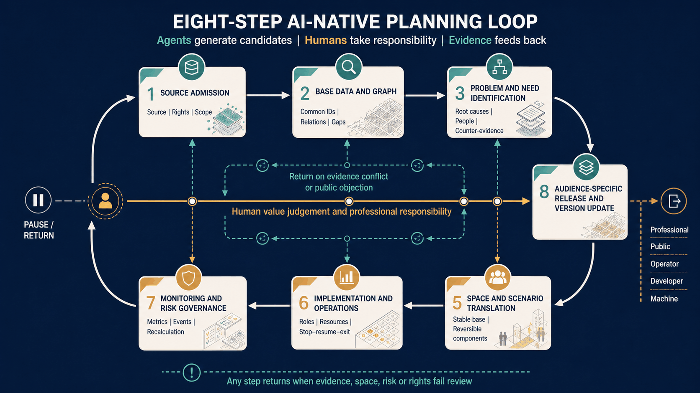

*Figure 20. Seven planning-production stages and an eighth audience-specific release stage remain subject to a human-responsibility spine. Any step can return when evidence, space, risk, or rights fail review. This is a method diagram, not automated approval or implementation.*

For AI to enter planning substantively, two classes of questions must remain distinct. Agents can produce reviewable candidates for computable tasks such as source alignment, rule checks, spatial overlays, simulation, policy transmission, and version comparison. Motives, interests, fairness, public value, and unacceptable consequences are contested value questions that require real affected people, community planners, professionals, and named decision-makers. Behavioural data may support a hypothesis for field verification; it cannot prove motivation or define public needs. The proposal therefore combines an evidence-computation loop with a value-deliberation loop, embedding field interviews, joint walks, minority views, appeal, and accountable human decisions in agent contracts. [source:LIANG-PLAN-FUTURE-I-20260828] [source:LIANG-PLAN-FUTURE-II-20260829]

The exploration follows one explicit argument: **changes in the city → breaks in conventional planning → tasks agents can augment → non-delegable human boundaries → Jingzhang site tests → operating evidence that challenges the method**. Seven lenses structure that argument: urban cognition asks how multi-source evidence becomes valid; problem framing asks who is seen or omitted; reasoning keeps counter-evidence and multiple scenarios; spatial translation connects a stable public base with reversible task layers; public deliberation requires real participation rather than simulated publics; implementation governance asks how to trial, stop, take over, and exit; communication asks how different people understand, use, and scrutinise planning. Points and scenarios are samples for testing the framework, not a substitute for it.

The proposal uses “agent” at three clearly separated levels. **Planning-production agents** support source alignment, problem framing, reasoning, spatial translation, and recalculation. **The six official task agents** organise the brand, ecosystem, scenarios, public space, culture, and operations outputs. **Urban operating agents** are future candidate systems for neighbourhood services and governance. The first two levels describe the actual research workflow; the third is a planning object that still requires instance-by-instance trials. They share evidence, accountability, appeal, and exit rules, but a production inference is not an operating service, a task output is not an institutional commitment, and an operating agent cannot become a planning-approval authority.

Jingzhang is a stress test rather than a decorative backdrop. Its existing heritage park and public-space base require low-intrusion overlays; the near-campus, mixed, short-cycle potential of the AI Origin Community calls for open front desks and correction journeys; Zhongzhiyuan requires a separation between public interpretation and controlled testing; and Dazhongsi requires joint task walks rather than engineering routes while station entrances, roads, rights, and motives remain unverified. If official spatial, field-use, or professional evidence contradicts any of these readings, the proposal must reopen problem framing rather than defend an existing image.

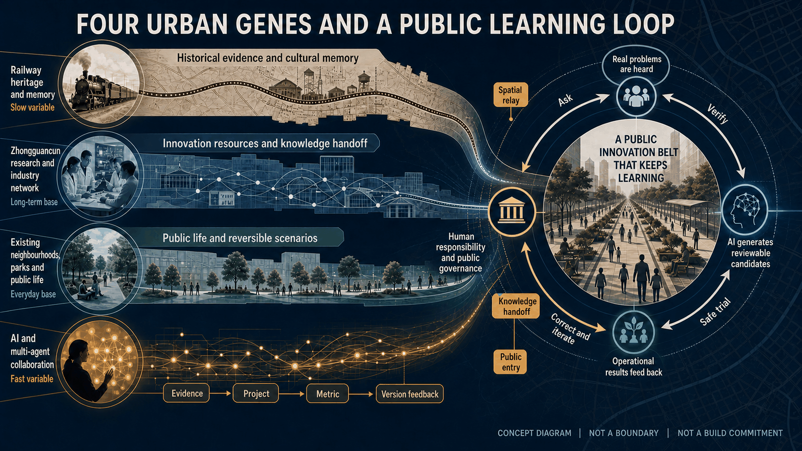

*Figure 21. Railway memory, the Zhongguancun innovation network, existing public life, and fast-changing AI enter a correctable urban-learning loop through the railway public spine. Concept relationship only; not an official boundary, exact location, or build commitment.*

### Communication theme: When the City Begins to Think — Jingzhang as an AI-Native Urban-Civilisation Testbed

“The city begins to think” does not transfer public decisions to algorithms. It describes a civic capacity for traceable evidence, plural problem framing, reversible trials, human takeover, safe exit, and versioned learning. The panorama uses the railway heritage park as a continuous public spine for research, neighbourhood life, cultural exchange, and low-intrusion AI services. It is an AI-generated communication concept—not a site photograph, reconstruction, approved location, or construction commitment. The formal research title remains unchanged.

### Professional planning judgements for the AI era

From an urban-planning perspective, the AI era does not invalidate land use, mobility, ecology, public services, or statutory controls. It requires planning to make four additional objects explicit above that stable public base: **task networks, service interfaces, time rhythms, and governance protocols**. This produces five shifts: static inventories become evidence versions; single conclusions become reviewable candidates; future prediction becomes the governance of uncertainty; one-time fixing becomes staged falsification; and project delivery becomes urban learning.

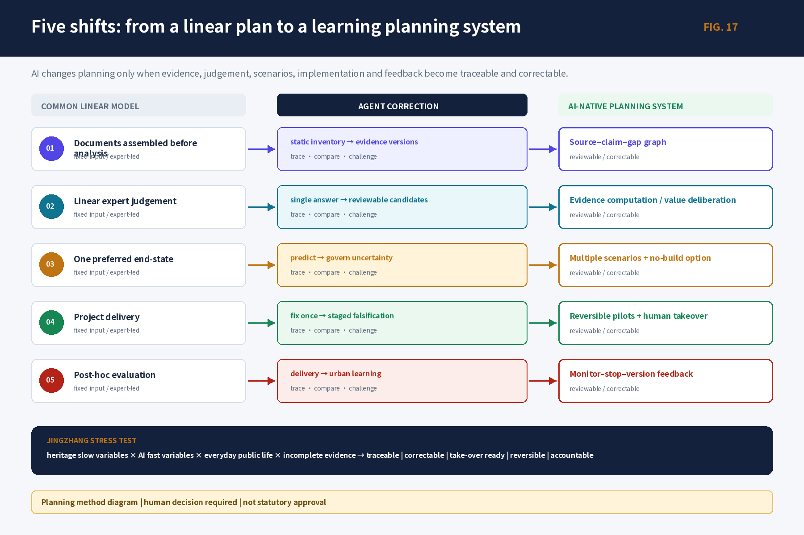

An AI scenario is therefore not merely a function or device. It is a complete contract of space, task, interface, time, and governance. If any variable layer exits, access, rest, accessibility, and ordinary services must still work. Every scenario card consequently states its carrier, users, AI/human division, opening time, rights boundary, stop/clearing rule, and version-feedback trigger.

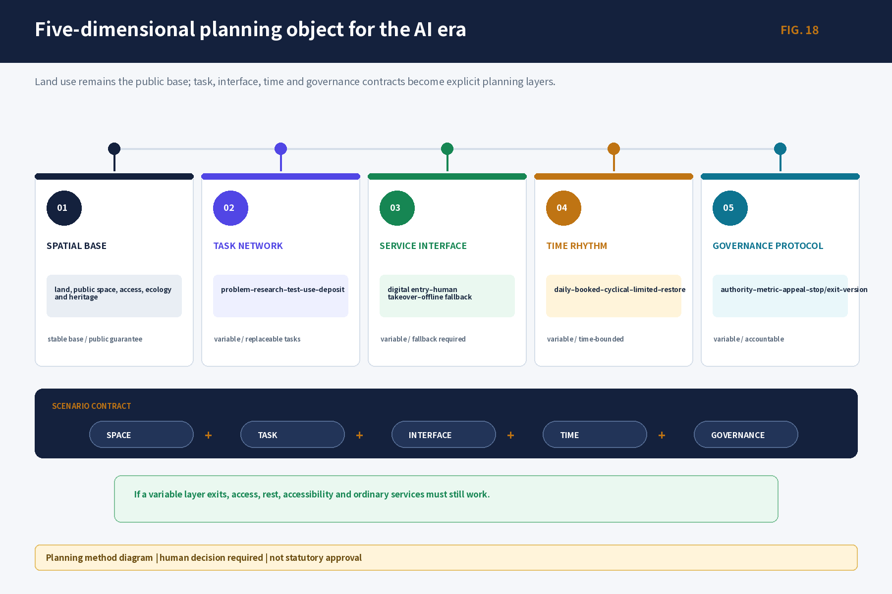

This method does not replace statutory planning. Statutory and professional controls establish non-negotiable rights, spatial, and safety boundaries; strategy and urban design organize scenarios and phased candidates within those boundaries; and operational protocols test only authorized small-scale instances. Runtime evidence may inform the next planning version, but it cannot automatically alter a statutory decision.

The three unified recognitions in Project Research Outline V2.0 become five planning moves: establish seven evidence layers, data graphs, and confidence states; use multiple agents to identify issues, needs, goals, counter-evidence, and responses; translate new forms of work, living, learning, contact, and governance into a stable public base plus reversible scenarios; operate a daily/weekly/quarterly/annual activity rhythm and a six-step conversion chain; and derive one source of truth into a professional report, public interface, bilingual figures, and machine-readable files. Evidence status and limits stay next to each claim. [source:OFFICIAL-ANNOUNCEMENT] [source:AGENT-TASKBOOK] [depth:existing_conditions_diagnosis]

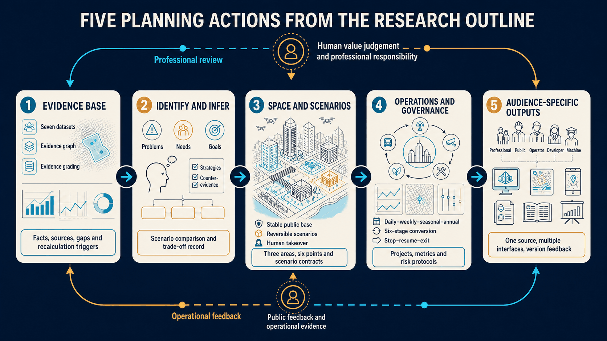

*Figure 22. Evidence base, identification and inference, space and scenarios, operations and governance, and audience-specific outputs form a two-way loop: professional human review above and public/operational feedback below.*

The central proposition is: **how can a historically public, innovation-dense, spatially complex belt become a city laboratory where real problems are heard, evidence is checked, prototypes are tested safely, people can refuse or appeal, and failure can exit into shared knowledge?** The working concept “Jingzhang Smart Pulse Co-living Belt” is therefore a spatial–scenario–operations learning system, not a final atmosphere image.

The proposal delivers two equally important outputs. The site layer provides One Belt–Three Areas–Two Wings, 13 scenarios, and six priority points; the method layer provides task, evidence, spatial-scenario, decision, and version contracts. Agents may collect, relate, reason, generate candidates, check consistency, and draft reviews. Named people must retain source admission, public-value trade-offs, statutory decisions, professional safety, allocation of spatial rights, and formal release. The path is judged by traceability, site specificity, public value, reversibility, and learning capacity—not by the volume of text, image realism, or degree of automation.

The proposal distinguishes `verified` facts, `background` cases, `design_proposal` recommendations, `provisional` spatial relations, and `unknown` values. Visual precision never upgrades evidence status.

### Human review evidence navigation (no self-scoring)

The table uses the official seven dimensions and weights. It points reviewers to evidence but does not fill a 0–5 score or treat local gate passage as an official result.

| Official dimension | Weight | Core evidence | What still requires human judgement |
|---|---:|---|---|
| `brief_alignment` | 20% | Three scopes, One Belt–Three Areas–Two Wings, six task agents; `compliance_matrix.json`, `assets/figures/agent-taskboard.en.png` | Whether the work substantively addresses Jingzhang, Haidian, ecosystem, space, and public governance |
| `originality` | 10% | Two loops, three agent levels, stable base plus reversible task layer, five contracts; `assets/figures/identity-brand.en.png`, `report/narrative.md` | Whether the concepts create a new planning judgement rather than a generic AI collage |
| `ai_planning_innovation` | 15% | Seven planning questions, two agent correction experiments, 13 scenarios, version feedback; `visual/assets/scenario_cards.json` | Whether AI changes cognition, judgement, space, deliberation, and implementation rather than only producing media |
| `implementation_feasibility` | 20% | G0–G3/X, six trials, 19 activities, 15 parent metrics, stop/restart/exit; `design_depth_matrix.json`, `metrics.json` | What must remain a candidate while real owners, sites, budgets, and baselines are absent |
| `public_interest_inclusion` | 10% | Eight user groups, non-digital equivalence, informed refusal, accessibility, appeal, ordinary-service fallback | Whether real residents, marginalised groups, and minority views can change the proposal |
| `risk_compliance` | 10% | Five evidence states, planning-decision and artifact-release gate sets, rights/privacy/stop/clearing; `sources.json`, `assumptions.json` | Whether public-data, copyright, policy, and professional limits are disclosed accurately |
| `expression_completeness` | 15% | Bilingual proposal/HTML, A3/A0, figures, GeoJSON/JSON, manifest, self-check | Whether media remain source-consistent, accessible, and usable for further work without hiding unknowns |

Machine-readable references, limitations, and task mappings are provided in `visual/assets/review_evidence_matrix.json`.

# A New AI-Native Planning Paradigm for the Jingzhang Railway Innovation Belt

This report has three connected parts, not three parallel documents. Part I answers **why planning is needed and what Jingzhang actually faces**. Part II explains **how the agents work and which judgements must never be delegated to machines**. Part III states **what is planned on the ground, how people use it, and how it starts, stops, and exits**. The overall proposition sets the value coordinates, the agent system provides the production and review mechanism, and the urban-planning design is the final spatial answer.

| Part | Core question | Substantive output |
|---|---|---|
| Part I: overall understanding | Why AI-native planning, and what is distinctive about Jingzhang? | Three scales, innovation ecosystem, three cultures, future users, and the One Belt–Three Areas–Two Wings judgement |
| Part II: AI-agent operating plan | How are evidence, inference, counter-evidence, deliberation, and versions organized? | Seven evidence bases, evidence graph, six task agents, five human gates, correction and feedback ledgers |
| Part III: urban-planning design | Where, for whom, what problem, what space and service? | Overall structure, three areas and six points, 13 scenarios, professional systems, projects, phasing, operations, metrics, and exit contracts |

Part III does not use renderings to disguise concepts or replace design with words such as “future”, “smart”, or “empowerment”. Every proposal must identify its site basis, users, spatial relationship, use journey, ordinary-service fallback, accountable role, start evidence, metric, and stop/restoration rule. Missing information remains `unknown/provisional` with a recovery action; false precision is not used to make an abstract idea look like a plan.

# Part I | Overall understanding: from AI-era change to the Jingzhang planning proposition

## Design basis and source list

The design basis combines the official call, the open agent taskbook, the site package, and the public/cleared source registry. The call sets the three working scales and required depth; the taskbook sets six agent tasks, five functions, and the Three Areas–Two Wings collaboration boundary; the registry, gap checklist, and GeoJSON connect each claim to a file, date, spatial scale, rights condition, and recalculation trigger. [source:SOURCE-REGISTRY] [source:PROCESSED-FACT-PACK] [source:PROJECT-SCOPE-SUMMARY]

Task fields and six deliverables are cross-checked through [source:AGENT-TASK-REQUIREMENTS].

The public package does not include official polygons for the study area, overall design area, or three key areas. The package therefore keeps the maintainer-issued provisional geometry. Boundaries, adjacency, routes, and derived areas are discussion-grade and consistency-check inputs only; once official boundary, regulatory, ownership, road, municipal, heritage, fire, and engineering evidence arrives, all nine spatial layers and derived metrics must be recalculated together. [source:SITE-PACKAGE] [data:geometry/site_boundary.geojson#SITE-001] [data:geometry/key_areas.geojson#PROV-KEY-001]

Data collection does not fill unknown fields with invented numbers. Every field keeps a source, state, owner, use, prohibited inference, and evidence-recovery action. Unknown is not zero; provisional is not official; a proposal is not an approval or an operating service.

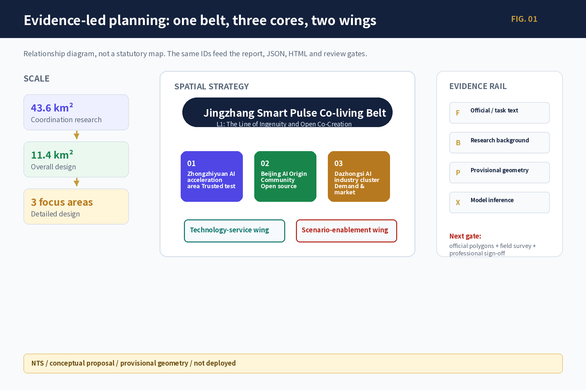

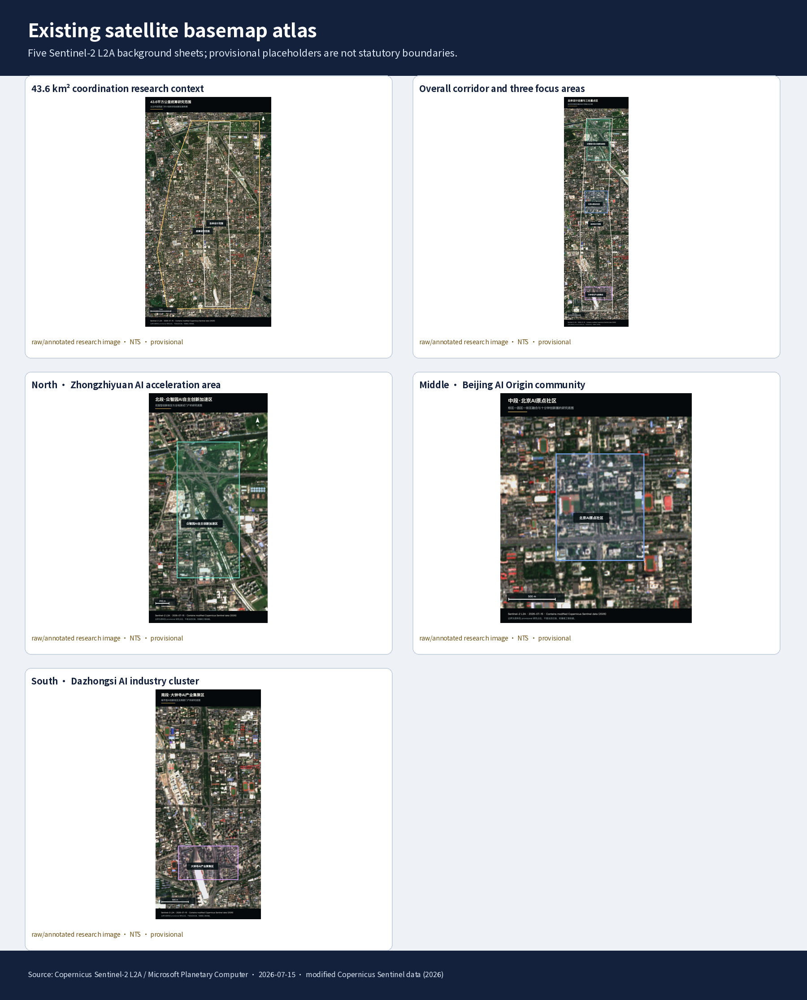

Five Sentinel-2 L2A images are used only for background observation and issue discovery. The annotated outlines are provisional research placeholders from the site package, not statutory redlines, ownership, road, station-entrance, or engineering-capacity evidence. Once official polygons arrive, recut and overlay all nine spatial layers and recompute every derived metric.[source:D2SRC-SHARED-014] [data:visual/assets/base-map-manifest.json]

## Three-level scope framework

The proposal works through three levels: the approximately 43.6 km² coordinating research area addresses Haidian AI ecosystem, cultural narrative, and future-city form; the approximately 11.4 km² overall design area addresses renewal, industry, mobility, municipal support, and character around the Jingzhang heritage park; the three key areas, approximately 368.4 ha in total, address uses, building renewal, public space, walking continuity, and implementation conditions. [standard:PROJECT-OFFICIAL-ANNOUNCEMENT] [depth:three_level_scope_framework] [depth:overall_spatial_structure]

The working concept is “Jingzhang Smart Pulse Co-living Belt”: the Jingzhang heritage park is the historical and public-space spine; Zhongzhiyuan Autonomous-Innovation Acceleration Area, Beijing AI Origin Community, and Dazhongsi AI Industry Cluster Area are differentiated innovation areas; the Zhongguancun Technology-Service Wing and Xiaoyuehe Scenario-Enablement Wing provide professional services, public scenarios, and knowledge return. “One Belt–Three Areas–Two Wings” is a planning relationship, not a statutory redline or engineering alignment.

| Level | Core question | Planning response | Reader-facing evidence |
|---|---|---|---|
| Coordinating research | How do research, open source, capital, markets, and public life connect? | Issue–research–open-source–test–application–knowledge loop | Case mechanisms, ecosystem graph, cultural narrative |
| Overall design | How do renewal, industry, public space, mobility, and municipal systems support one another? | One Belt–Three Areas–Two Wings and a blue-green walking loop | Land-use, building, road, blue-green, and phasing figures |
| Detailed key areas | How do areas become tangible, testable, and reversible? | Two accountable work points per area, tied to users, operators, metrics, and human gates | Six prototype cards, 13 scenario cards, project ledger |

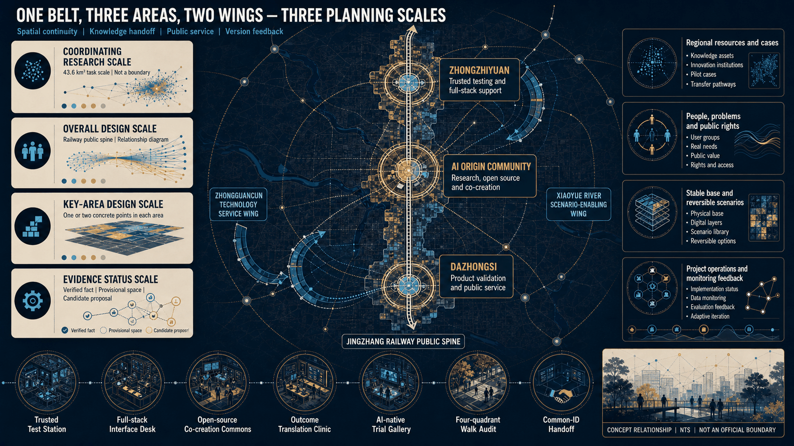

*Figure 23. The diagram labels all three working scales, Three Areas–Two Wings, the railway public spine, and six candidate points. NTS concept relationship only; it does not replace official boundaries, roads, station entrances, or engineering alignments.*

The overall spatial reading is derived from land-use, building, road, blue-green, public-space, and phasing layers. Boundary and metric states are shown consistently in figures, tables, and HTML. [data:geometry/land_use.geojson#LU-001] [data:geometry/buildings.geojson#BLDG-001]

Roads, blue-green, and phasing are cross-checked through [data:geometry/roads.geojson#ROAD-001] and [depth:land_use_layout].

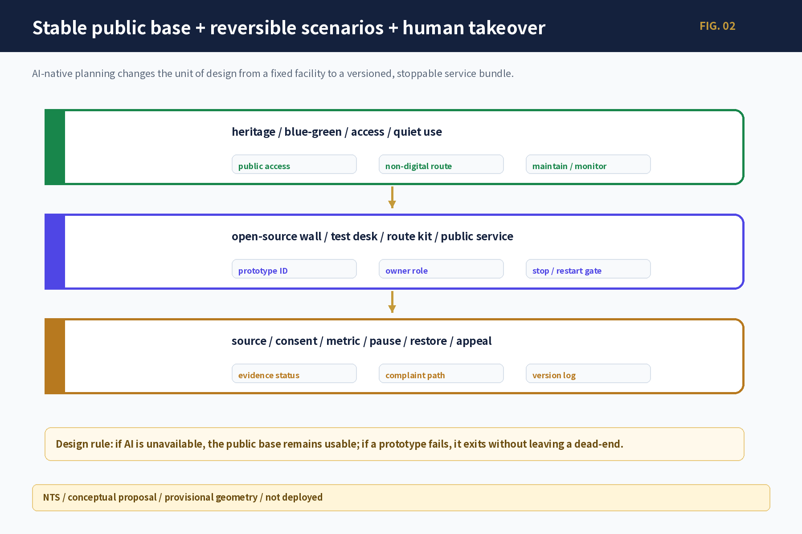

## Coordinated research area: industry and future-city research

### Innovation ecosystem: seven global mechanisms translated into an eight-step chain

Global cases are mechanisms, not Haidian statistics. one-north/AI Singapore demonstrates neighboring carriers, time-bounded PoC, and governance testing; Mila and the Vector Institute connect research, talent, engineering, and venture conversion; Seoul AI Hub/Yangjae combines city support, compute, and business validation; Hub71+ AI releases resources by stage; STATION F/F/ai combines a semi-open front stage, controlled work, and public life; MassRobotics combines shared experiments, prototyping, and safe human takeover. Their local value depends on named carriers, authorized data and compute, professional review, affordable public access, stable operations, and an explicit failure path. No overseas campus scale, funding level, institutional mandate, or policy privilege is transferred to Haidian. Together they support a local conclusion: the belt needs a transferable middle layer, not a copied campus name. [source:SOURCE-USE-MATRIX] [standard:PROJECT-AGENT-OPEN-CALL-TASKBOOK]

Case-source navigation: Singapore `D2SRC-B2-001—005`; Mila `D2SRC-B2-006—008`; Vector `D2SRC-B2-009—010`; Seoul `D2SRC-B2-011—013`; Hub71 `D2SRC-B2-014—015`; STATION F `D2SRC-B2-016—019`; MassRobotics `D2SRC-B2-020—024`. These IDs point to itemized locators in the packaged `sources.json`; no case fact is extrapolated into a Haidian statistic.

The local ecosystem uses one explicit eight-stage production chain: **R Research -> O Open Source -> C Compute -> D Data -> T Testing -> I Incubation -> F Capital -> M Market**. A verified real issue is the input, not a promotional starting point; the G governance crossbeam runs through every stage, while K knowledge feedback returns successes and failures to the next cycle. Professional and ethics review is a gate that can reject, pause or downgrade work, not a production stage. Zhongzhiyuan emphasises compute, data and trusted testing interfaces; the AI Origin Community emphasises research, open-source and incubation hand-offs; Dazhongsi emphasises demand, capital services and market validation. Institutions, funds, compute and operators remain to be authorized; place names do not create commitments.

Regional coordination is organised as accountable hand-offs, not as an unauthorized alliance claim. All relationships below are candidates derived from the taskbook.

| Regional counterpart | Candidate flow | Jingzhang interface role | Entry condition | Prohibited inference |
|---|---|---|---|---|
| Beiwei Community | youth talent, open issues, community experience | receive issue cards and return understandable test/service results | real community issue, authorized contact, non-digital participation, receipt | no claim of existing partnership, resident representation, or confirmed event |
| Future Science City | research outputs, talent, validation needs | open-source translation, controlled testing, city-problem entry | cleared output, applicable scenario, owner, IP/data boundary | do not transfer institutional mandate, resource scale, or policy powers |
| Huairou Science City | scientific outputs and public-application questions | turn specialist output into reviewable public questions and candidate scenarios | specialist interpreter, license, safety, public-value review | do not present research output as deployment-ready product |
| Beijing E-Town | manufacturing, productization, industry feedback | exchange test protocols, demand evidence, failure and maintenance records | real project, quality/safety owner, procurement and commercial-rights boundary | no orders, sites, procurement, or implementation promise |
| Beijing–Tianjin–Hebei | cross-regional issues, standards, talent, knowledge return | retain reusable issue cards, scenario contracts, risks, and versions | aligned data definitions, authority, cost, and affected-group review | do not extrapolate one pilot into regional performance or governance authority |

Every exchange must record input source, hand-off artifact, receiving responsibility, prohibited use, feedback, and exit. Without a real counterpart and authorization, only the interface design remains.

### Concept and identity system

The project title remains “A New AI-Native Planning Paradigm for the Jingzhang Railway Innovation Belt”; “Jingzhang Smart Pulse Co-living Belt” is a working spatial-strategy name subject to public testing and authorization. “The Line of Ingenuity and Open Co-Creation” is a working public narrative and wayfinding motif, not a parallel spatial name. The single hierarchy is L0 project title, L1 spatial-strategy name, L2 public narrative, L3 One Belt–Three Areas–Two Wings, L4 scenarios/activities, and L5 points/components; the three strategic positions remain cross-level evaluation goals. A logo candidate uses a neutral grammar of railway connection, open-source nodes, public entry, and a version opening; publication requires source, trademark, historic-material, accessibility, bilingual, and operator review, and any failed gate withdraws it to text-only identification. No unlicensed railway, institution, person, trademark, or historic image is used. [standard:MOHURD-URBAN-DESIGN-MEASURES] [depth:overall_spatial_structure]

### Non-causal cultural narrative

Railway culture contributes verified histories of mobility, engineering, and public connection; Zhongguancun culture contributes separately sourced histories of research, entrepreneurship, open source, and collaboration; AI culture contributes current questions of models, agents, contribution, correction, and responsibility. They form three evidence tracks rather than a fabricated causal lineage. Five route prototypes are user tasks rather than published routes: R1 “Jingzhang at a Glance” (about 30 minutes as an experience target), R2 “Deep Read of Three Cultures” (about 90 minutes), R3 “Half-day Co-creation Route” (3–4 hours), R4 “Step-free, Low-digital Route”, and R5 “International Visitor Route”. All remain hypothesis/provisional/text-only; geometry, duration, opening conditions and third-party rights require field and professional verification. Each story unit keeps fact source, date, spatial scale, rights, bilingual text, version, correction entry, paper access and human-guided access; no unverified causal history is created.

### Personas and future-city change

Eight groups share public entry but differ in controlled work, data permissions, and professional service: researchers, developers, start-up teams, enterprise visitors, nearby residents, students/teachers, service providers, and operators. AI-era spatial demand is not “more screens”; it is short-cycle collaboration, bookable testing, human explanation, non-digital access, data clearing, quiet use, and reversible equipment.

# Part II | AI-agent operating plan: an evidence-to-ledger planning system

## What agents actually do in this project

An agent is not an automatic drawing tool here; it is part of a planning-production system. Its input is not a slogan but evidence with source, date, spatial scale, rights, and limitations. Its output is not one answer but comparable candidates, counter-evidence, a human decision, and a version difference. Agent work ends at an auditable judgement. Fact promotion, value trade-off, statutory decision, professional safety, spatial rights, and public release remain with named accountable people.

Seven evidence bases—space; people and use; industry and institutions; mobility and access; blue-green environment; culture and rights; and operations and risk—enter the evidence graph first. Every record states its `verified/background/design_proposal/provisional/unknown` status, permitted use, and prohibited inference. When a source changes, dependent questions, proposals, figures, and metrics expire and trigger recalculation; the system does not merely redraw one figure.

## Six task agents and one orchestrator

1. **Concept and identity agent:** develops the overall concept, L0–L5 naming tree, graphic grammar, and brand-rights gate; it cannot publish a final brand.
2. **Ecosystem agent:** compares seven mechanisms and constructs the R/O/C/D/T/I/F/M relay, G governance beam, and K knowledge feedback; it cannot migrate another city's institutional scale or performance into Haidian facts.
3. **Scenario-space agent:** translates AI+ health, education, commerce, and other tasks into user–space–service contracts and produces an ordinary-service/no-AI alternative at the same time.
4. **Public-space agent:** proposes reversible developer-walk, open-output, and contribution-record components while protecting passage, rest, accessibility, and heritage first.
5. **Culture agent:** organizes railway, Zhongguancun, and AI as three independent evidence lines and produces correctable routes without inventing historical causality.
6. **Operations agent:** organizes activities, testing, conversion, metrics, complaints, stopping, and restoration into a long-term ledger; activity counts do not substitute for public value.
7. **Orchestrator:** checks whether all six outputs use the same place, facts, identifiers, evidence states, and human gates; conflicts return to the responsible task rather than being averaged automatically.

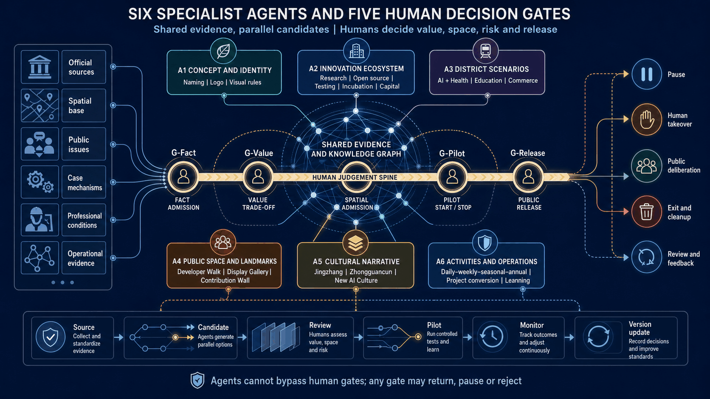

*Figure 24. Six agents generate candidates around one evidence and knowledge graph. Fact admission, value trade-off, spatial admission, pilot start/stop, and public release remain human-controlled; any gate may return, pause, or reject.*

## Operating chain from problem to version

The working chain is evidence admission; problem identification; separation of need and objective; multi-scenario candidates; counter-evidence and conflict; spatial/service translation; human decision; implementation monitoring; and version feedback. Every handoff contains at least four objects: a traceable issue card, alternatives including no-build/no-AI, a human decision record, and a version log stating who can reopen the issue under what condition. Agents therefore do not replace planners with answers; they expose hidden assumptions, broken evidence, and unacceptable consequences earlier.

All agents share one human–machine boundary. Machines handle explicit evidence, logical relationships, conditional scenarios, and consistency checks. People retain problem definition, interpretation of motive, value ranking, negotiation, and final responsibility. Zhongzhiyuan tests whether technology is credible and interruptible; AI Origin Community tests whether online analysis accepts field and resident correction; Dazhongsi tests whether behavioural data is returned to a joint task walk rather than converted directly into conclusions about people.

## Two correction experiments: proving value through rejection

The Developer Walk task produced three candidates: a permanent landmark, reversible markers, and a no-fixed-structure thematic walk. Because park/heritage geometry, content rights, and maintenance evidence were missing, human gates rejected the permanent option and downgraded it to a textual task route with movable story stations. The Dazhongsi station-city task generated a route from OSM and provisional geometry. Because station entrances, roads, rights-of-way, and travel motives could not be verified, the route was cancelled and replaced by a joint walk covering entrances, crossings, cycling, accessibility, and human fallback.

The result is not “two more designs”. It demonstrates that agent output can be rejected by evidence and that false certainty becomes a prohibited inference in the next version. Seven candidate–counter-evidence–decision–feedback records are in `visual/assets/agent_planning_process_ledger.json`; roles, inputs, outputs, gates, and handoffs are in `report/narrative.md`, Appendices A–D; the asset register is `visual/assets/data_asset_register.json`.

## Acceptance criteria for the agent operating plan

Agent value is not measured by words, images, or tokens. It is accepted against five results: **evidence can be traced; proposals are genuinely grounded in Jingzhang; affected people can change a conclusion; high-risk scenarios have human takeover; and failure can stop and become knowledge for the next version**. Where no real object, accountable party, or authorized instance exists, the output remains a research contract and does not impersonate institutional partnership, public participation, professional signature, or live city operation.

# Part III | Urban-planning design: from the overall structure to real spatial answers in three areas and six points

## Overall design area: urban renewal and regulatory-plan-level urban design

The overall design layer creates One Belt–Three Areas–Two Wings, multiple scenarios, and a blue-green walking loop. Land use differentiates innovation research, enterprise services, public services, everyday life, blue-green open space, and pending renewal objects, using checkable land-use classes under [standard:MNR-LAND-USE-CLASSIFICATION-GUIDE]. Buildings use retain, renovate, renew, candidate new, and pending-confirmation states. Roads express directional relationships and pending walking gaps, never an inferred road redline.

FAR, height, density, setbacks, demolition, investment, and municipal capacity are not invented. Submitted geometry can reproduce working areas and layer relationships, but control conditions, ownership, and professional boundaries remain `unknown`; planning, architecture, mobility, municipal, landscape, heritage, fire, and accessibility professionals review them after official data arrives. [standard:MOHURD-CONTROL-DETAILED-PLANNING] [depth:development_intensity_controls]

Architectural depth is checked through [standard:MOHURD-ARCH-DESIGN-DEPTH-2016], [depth:height_massing_character], and [depth:retain_renovate_demolish].

The renewal rule is “public first, carrier second; reversible first, construction second; trial first, expansion second.” Public access, walking continuity, first-floor services, open-source interpretation, and human entry are prioritized. Permanent landmarks and large works require fact, space, rights, professional, operating, and release gates.

## Detailed design of key areas

The three areas have differentiated roles: Zhongzhiyuan is the trusted-test and full-stack autonomous-innovation anchor; the AI Origin Community is the near-campus open-source and research-to-market anchor; Dazhongsi is the demand, product, content, and international-contact anchor. All six points use evidence maturity: G0 research/tabletop; G1 an authorized indoor or off-site low-dependency mock-up; G2 a controlled independent instance; G3 conditional cross-node expansion; and X exit with restoration of ordinary service. Replicable operation is not the default endpoint. State advances by evidence maturity, not image polish. [data:geometry/key_areas.geojson#PROV-KEY-002] [data:geometry/key_areas.geojson#PROV-KEY-003] [depth:three_key_area_detailed_design]

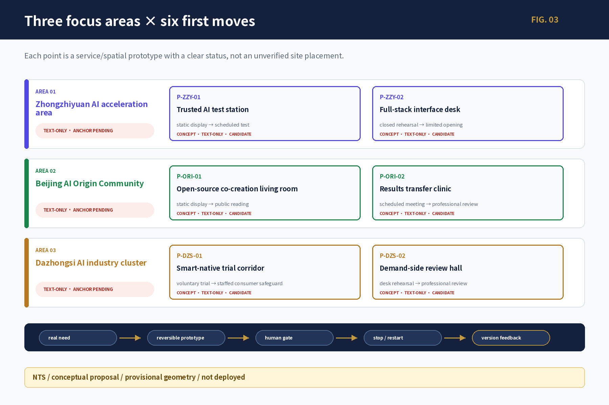

| Area | Point | Tangible action | Key metric / exit |
|---|---|---|---|
| Zhongzhiyuan | `P-ZZY-01` Trusted AI test station | Open validation desk, authorized samples, controlled-test candidate, observer seat, physical stop | completeness, human review, clearing; missing safety or operator downgrades to tabletop |
| Zhongzhiyuan | `P-ZZY-02` Full-stack interface desk | Issue, resource, owner, pause/restart/exit ledger with equal offline entry | state publication, clearing, offline task completion; no automatic approval |
| AI Origin Community | `P-ORI-01` Open-source co-creation room | Free human front desk, weekly open-source table, paper directory, contribution/correction board | license completeness, accessibility, maintenance; unclear rights are withdrawn |
| AI Origin Community | `P-ORI-02` Research-to-market clinic | Issue card, evidence-maturity triage, IP/legal/test referrals, human receipt | transfer time, accountable owner, return reasons; no financing or tenancy promise |
| Dazhongsi | `P-DZS-01` Intelligent-service trial lane | Voluntary single-service test, ordinary-service fallback, paper rights statement, human support, clearing | informed refusal, complaints, clearing; unclear fairness stops the trial |
| Dazhongsi | `P-DZS-02` Demand-side review room | Paper four-quadrant walking audit, accessibility walkthrough, issue dispatch and return visit | waiting/detour, continuity, closure; no engineering conclusion before anchors |

### Design-depth boundary: no false precision, but real design decisions

Official polygons, ownership, buildings, station entrances, and engineering controls have not been supplied. This version therefore cannot responsibly assign building numbers, precise coordinates, area/capacity, FAR, or cost. That does not justify remaining at slogan level. It uses five levels of precision: **area role; spatial interface; functional components; one-day user journey; and implementation contract**. Each area first receives a task in the belt; each point is then tied to a spatial type and front/back relationship; reversible components and use sequences follow; and finally the human owner, start evidence, stop, and restoration are defined. When official drawings arrive, the contract can be matched to an eligible carrier instead of inventing the concept again.

| Area | Primary site conflict | Required spatial interface | First no-regret action | Explicitly excluded now |
|---|---|---|---|---|
| Zhongzhiyuan | Testing must be controlled, while results need to be understood by the public and demand side | Open validation front facing the railway public spine—safety threshold—controlled park-side test back | Validation desk, evidence board, human observer, physical stop, and exit checklist | No unreviewed high-risk equipment in public space; public realm does not substitute for a safety-certified test site |
| AI Origin Community | Universities, young people, and R&D resources are close, but problem entry, maintenance, and referral accountability are fragmented | Everyday public ground-floor front—quiet co-creation layer—professional referral back, without occupying residential access | Weekly open-source table, paper directory, issue card, correction board, and human receipt | The community does not become a showroom; QR codes, profiling, or events do not displace ordinary life |
| Dazhongsi | Station-city, commerce, housing, and visitors overlap, while entrances, rights-of-way, and real needs are unverified | Multi-entry joint-audit front—voluntary single-service trial—demand review and issue-return back | Paper four-quadrant audit, ordinary-service fallback, merchant trial, and issue dispatch | No unverified engineering route; no automated price, rating, or inference of travel motive |

### Zhongzhiyuan: trusted testing becomes an auditable public interface

**Site basis and design judgement.** Zhongzhiyuan carries the full-stack innovation and trusted-testing role, but public access and controlled testing cannot be merged. Space progresses from an accessible validation front facing the railway public spine to a controlled interior back, separated by a legible safety threshold. Logistics, equipment maintenance, and emergency exit do not cross the public waiting face. Until a formal carrier is known, the design fixes this front/back relationship rather than naming a building. [data:geometry/key_areas.geojson#PROV-KEY-001]

**`P-ZZY-01` Trusted AI test station.** The front consists of an issue desk, evidence-maturity board, authorized-sample cabinet, human observation seat, and visible physical stop. Isolated equipment, controlled data, and professional testing sit behind the threshold. A complete user journey is: read ordinary information; choose whether to participate; check data and safety limits; observe one test; receive a human result; confirm data and equipment clearing. Missing fire, insurance, data, safety, accountable operator, or physical-stop evidence downgrades the activity to paper/offline tabletop work.

**`P-ZZY-02` Full-stack interface desk.** This is not a resource display. It is an accountable handoff surface on which every project shows issue source, project ID, required compute/data/test, evidence level, owner role, next gate, and exit state. The public can submit a paper issue card; enterprises and researchers add technical material in the controlled layer. The desk does not approve plans, allocate compute, or make investment decisions. It makes visible who still owes which evidence.

### AI Origin Community: converting near-campus resources into an open, correctable civic front

**Site basis and design judgement.** The area's strength is near-campus mixed use and short-cycle collaboration; its risk is innovation activity displacing everyday life or treating residents as test subjects. The spatial sequence is public commons—quiet co-creation—professional referral. A free human entry and movable components sit at the everyday public edge; booked co-creation sits behind; IP, data, legal, and test matters enter a non-public referral layer. Residential entrances, fire access, ordinary seating, and quiet night use take priority over events. [data:geometry/key_areas.geojson#PROV-KEY-002]

**`P-ORI-01` Open-source co-creation room.** Its minimum unit is a joinable table, paper/offline project directory, contribution and correction board, accessible seat, and retractable display. Residents can bring everyday issues without supplying personal data. Students and developers can adopt a public task only when license, maintainer, completion condition, and exit are visible. Unmaintained, uncleared, or circulation-blocking output is withdrawn; only a source index and human explanation remain.

**`P-ORI-02` Research-to-market clinic.** The clinic is not an incubator sales desk; it performs accountable triage. An issue card is first checked for evidence maturity and public value, then referred to technical testing, open-source maintenance, IP/legal, accessibility, or a demand owner. Each referral returns a human receipt: accepted, returned for evidence, or rejected with reason. Without a named receiving person, the system cannot show “in conversion” and cannot promise financing, procurement, or tenancy.

### Dazhongsi: understanding the complex station-city problem before reversible AI-commerce trials

**Site basis and design judgement.** Dazhongsi combines interchange, commerce, surrounding residents, railway culture, and international visitors. It is closest to real demand and market feedback, and most vulnerable to false certainty derived from flow data. Because formal entrances, roads, and rights-of-way are unverified, this version does not draw an engineering route. It uses four tasks—joint walk, single-service trial, demand review, and issue return—to anchor design in verifiable action rather than fictional coordinates. [data:geometry/key_areas.geojson#PROV-KEY-003]

**`P-DZS-01` Intelligent-service trial lane.** The first stage allows only one willing merchant, one low-risk service, and one observation window—for example bilingual product-information explanation, queue explanation, or accessibility referral—while retaining the original price, human service, and no-participation route. A paper rights card states what is collected, what is not, when it is cleared, and who receives complaints. Automated pricing, credit judgement, forced scanning, differential service, or failed human takeover stops the trial and restores ordinary service.

**`P-DZS-02` Demand-side review room.** Its first output is not a route map but a four-quadrant task base and issue ledger. Residents, commuters, merchants, disabled people, visitors, and mobility/accessibility professionals jointly record entrance legibility, crossing waits, bicycle conflict, rest and weather shelter, step-free continuity, and human fallback at different times. Every issue needs location evidence, affected group, accountable destination, and return result. Only after formal entrances, roads, and professional verification exist can the ledger become an engineering route or facility design.

### Three areas form an accountable relay, not three exhibition halls

Dazhongsi structures real use problems as issue cards with rights boundaries. AI Origin Community opens them to discussion, open-source decomposition, and professional triage. Zhongzhiyuan performs controlled testing, human takeover, and failure recording. Results return to the original demand owner for confirmation. Every handoff carries the same project ID, source, permission, owner, deliverable, unresolved item, and stop state. If any link lacks a real accountable party, the process remains at the previous evidence level; promotional claims of an “ecosystem loop” do not substitute for a real handoff.

Identifiers are not aliases: `P-*` denotes a spatial/service prototype, `PILOT-*` a validation template, and `JZ-*` an implementation action. One point may invoke several templates and feed one or more actions, but it reaches G2 only after an independent test instance has accountable ownership, authorization, and exit conditions. The current number of live instances is 0.

All six points remain research prototypes. No building, coordinate, tenant, station entrance, area, or construction approval is asserted. They nevertheless define the area task, carrier interface, front/back relationship, use journey, ordinary-service fallback, human takeover, and exit. The next phase must supply a formal carrier and implementation evidence, not another layer of slogans.

## AI innovation ecosystem, personas, and AI+ scenarios

The eight-stage innovation relay, eight user groups, and six working points now converge into street-level service contracts. An ecosystem becomes planning content only when it enters a specific space, serves specific people, and preserves ordinary service and exit.

### Street scenarios, people, and service contracts

The agent operating system hands over to urban-planning design here. Every scenario must attach to one of the three focus areas or the railway public spine and specify user, spatial status, data, human gate, operating role, ordinary service, metric, and exit. Full fields, eight user groups, and stage gates are in `visual/assets/scenario_cards.json`; this section retains only the planning conclusions that change how space and services are organized on the ground.

#### How 13 scenarios enter the belt

The 13 scenarios first remain text, service blueprints, or low-fidelity components; a concept image is not a deployed system. They are: `SCN-B3-01` Full-stack Independent Innovation Validation Hub; `02` Xiaoyue River Embodied Intelligence Coexistence Test Window; `03` AI Origin Co-creation Commons; `04` Youth AI Third Place; `05` Developer Walk and Open-source Milestone Gallery; `06` Agent Contribution Wall; `07` AI Public Service Station for health, education and daily-service navigation; `08` Jingzhang AI Time Station; `09` AI-native Commerce Test Gallery; `10` Dazhongsi Four-Quadrant Mobility Audit Pack (station anchor pending); `11` Jingzhang Smart Pulse Southern Foyer; `12` Belt-wide Open Scenario Testbed; and `13` Jingzhang AI City Open-source Week. Each card binds user, spatial state, data, privacy, human gate, operator type, metric, non-digital fallback, and exit rule. [depth:blue_green_public_space] [depth:traffic_rail_slow_parking] [depth:municipal_new_infrastructure]

#### AI+ medical, education, and commerce in the street

AI+ medical means public-information explanation, appointment routing, and human transfer—not diagnosis, prescription, or health eligibility. AI+ education means course explanation, co-learning, and human consultation—not admission, examination, or student ranking. AI+ commerce means voluntary single-service trials and rights statements—not automated pricing, credit scoring, or final consumer-dispute decisions. Paper information, a human window, telephone/on-site appeal, and ordinary-service fallback remain available.

| Affected group | Public value | Main risk | Refusal / non-digital equivalent | Correction owner role |
|---|---|---|---|---|
| Nearby residents, older people, low-digital-literacy users | clear public information, human referral, seated reading | QR barriers, noise, displacement of everyday access | paper, large print, phone/on-site staff; ordinary service without AI | public-service/site operator and community planner |
| Young talent, students, teachers | open-source learning, issue referral, short-cycle collaboration | profiling, over-collection, unpaid work, unclear rights | participation without profiling, attribution choice, human IP/education advice | education, open-source, rights, and data roles |
| Enterprises, developers, start-ups | predictable testing, evidence maturity, demand feedback | candidates misread as admission/procurement commitments; public risk spillover | exit from tests, synthetic/minimum data, offline accountable receipt | testing, safety, legal, procurement/demand roles |
| Universities and researchers | real urban-problem entry and public interpretation | research output misread as deployment maturity | cleared summaries only, professional review and withdrawal | research owner, professional and ethics roles |
| Visitors and international audiences | bilingual, correctable railway–innovation–AI interpretation | mistranslation, cultural error, mobile-only access | bilingual paper, large-print summary, staff guide, no-participation route | culture, language, rights, and site-operation roles |
| Disabled people and other data-omitted groups | multisensory, accessible, appealable service entry | averaged metrics hide exclusion; inaccessible devices/routes | tactile/audio/high-contrast, staff assistance, alternative route | accessibility professional, public representative, named service owner |

This version does not treat a list of affected groups as participation evidence: participant counts, dissent records and disaggregated baselines remain `unknown/not_started`. To give real affected people power to change the proposal, a six-stage protocol is defined: C0 accountable setup; C1 problem co-definition; C2 conflict and dissent register; C3 comparison including a no-AI option; C4 pilot permission and disaggregated baseline; and C5 decision receipt and reopening. An unresolved severe rights, safety, discrimination or accessibility objection blocks G2 and cannot be averaged away; other dissent requires a separate alternative or a public reasoned response. Area entry groups, baseline fields, non-digital channels and the prohibition on claiming completed participation are specified in `visual/assets/public_co_definition_protocol.json`.

A city agent may retrieve sources, explain information, flag gaps, summarize anonymous feedback, and draft text for review. Planning approval, engineering/traffic/fire safety, medical, education, investment/procurement, public honors, and personal-profile ranking return `refuse_and_redirect` to a responsible person.

## Land use, building scale, and retain-renovate-demolish strategy

Land-use, building, public-space, and phasing layers jointly express the spatial structure. Buildings use retain, renovate, renew, candidate new, and pending-confirmation states. Working values reproduce submitted geometry only; FAR, height, density, setbacks, demolition, investment, and municipal capacity remain `unknown/null` with an owner and recalculation trigger. [depth:blue_green_public_space] [depth:renewal_project_list]

The first phase favors actions that do not change ownership or structure: human front desks, movable exhibits, paper guidance, controlled tests, quiet night use, accessible rest, and service ledgers. Permanent buildings, river works, road works, and final landmarks wait for official drawings, professional review, and rights clearance.

## Transport, rail, municipal infrastructure, and public services

Mobility follows “audit first, micro-renewal second, engineering third.” The first tasks are a Dazhongsi four-quadrant audit, heritage-park gap walk, campus–park connection, and accessibility walkthrough; mobility, landscape, accessibility, and municipal professionals then review shade, lighting, bicycle parking, wayfinding, crossings, and interchange. Current layers show directional relationships, not unverified station entrances, redlines, bridges, tunnels, or lift conditions. [depth:traffic_rail_slow_parking] [data:geometry/roads.geojson#ROAD-001]

Municipal and new-infrastructure proposals follow minimum resources, disconnectability, and human maintenance. Edge compute, energy, drainage, fire, and data interfaces remain capacity-unknown; ordinary light, water, rest, accessibility, and paper information cannot be weakened. Official capacity and engineering evidence trigger professional recalculation. [depth:municipal_new_infrastructure] [data:geometry/constraints.geojson#CONSTRAINTS]

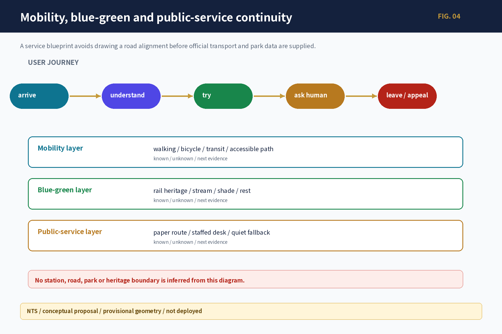

## Blue-green network, public space, and urban character

The Jingzhang heritage park is the public spine. The blue-green system serves movement, rest, cultural understanding, ecological care, and low-risk innovation. Three AI landmark candidates use retractable and correctable components rather than permanent mass: the Developer Walk and Open-source Milestone Gallery combines a thematic walk, paper route, and version/license/correction display; the Agent Contribution Wall shows authorized contributions without automatic awards; and the Jingzhang AI Time Station uses a reversible timeline table to interpret reviewed three-layer cultural knowledge.

Five verifiable route prototypes are used: R1 Jingzhang at a Glance, R2 Deep Read of Three Cultures, R3 Half-day Co-creation Route, R4 Step-free, Low-digital Route, and R5 International Visitor Route. Every story unit displays source, date, spatial scale, rights, bilingual text, version, correction entry and text-only/provisional status. Historical dispute, portrait/font/trademark conflict, or a daily-use conflict triggers withdrawal and a paper/human fallback. [data:geometry/green_space.geojson#GREEN-001] [data:geometry/public_space.geojson#PUBLIC-001] [depth:blue_green_public_space]

## Renewal projects, implementation policy, and phasing

Resource bands are not currency quotations. S reuses existing space/people and low-tech materials; M requires multi-professional work, temporary equipment, or a controlled instance; L requires cross-site sustained operations or engineering. A budget follows only after carrier, quantities, and market quotations exist.

| Project | Near-term action | Resource band / main cost components | Permission and start trigger | Exit cost |
|---|---|---|---|---|
| JZ-01 heritage-park gap stitching | paper audit, accessibility walk, removable wayfinding | S→M; walks, design review, removable parts, maintenance | park/road/heritage/accessibility approval | remove signs, restore surface, publish correction |
| JZ-02 Zhongzhiyuan trusted-test interface | open validation desk, project card, exit checklist | M; controlled carrier, staffed duty, safety/data review, clearing | real demand, owner, physical stop, fire/insurance conditions | clear data/equipment, notify, restore, review incident |
| JZ-03 AI Origin open-source front desk | weekly table, clinic, human receipt | S; staffed desk, paper directory, rights/maintenance | open carrier, maintainer, licenses, correction route | withdraw content, retain source index, close referrals with receipts |
| JZ-04 Dazhongsi walking audit | time-sliced observation, issue ticket, follow-up | S; organization, accessibility support, recording, professional review | entrance/right-of-way check, participant safety, mobility protocol | delete improper records, withdraw route claim, publish non-completion reason |
| JZ-05 AI public-service/edge node | paper/offline service blueprint | M→L; human service, equipment, energy/network, privacy/security, maintenance | formal capacity, data purpose, human takeover, ordinary-service fallback | disconnect system, clear data/equipment, restore ordinary staffed service |
| JZ-06 Global AI Week route | small indoor/public-space tabletop | M; event, bilingual/accessibility, safety, venue, clearing | event permit, capacity, accountable owner, rights, emergency/weather plan | cancellation notice, clearing, participant receipt, annual review |

To keep “to be confirmed” from becoming an empty disclaimer, JZ-01–06 now each has an implementation-handoff register with nine evidence slots: formal carrier; named operator/accountable role; quantities and lifecycle cost scope; quotation or procurement basis; disaggregated baseline; professional signatures; human-takeover drill; clearing/restoration; and complaint/reopening. Named values and quotations remain `null/not_requested`, so all six projects remain `blocked_pending_external_evidence`. G2 requires a named owner, date, attachment and recorded human decision in every applicable slot. Project-specific requirements are in `visual/assets/implementation_handoff_register.json`. The file proves the handoff logic is ready; it does not prove any carrier, operator, budget, baseline, signature or commitment exists.

Phasing follows evidence maturity rather than fixed years. G0–G1 covers evidence recovery, real-task walkthroughs, human services, paper/offline prototypes, synthetic data, retractable components, and stop/clearing drills. G2 creates a controlled independent instance only after site, accountable operator, professional and safety review, lifecycle resources, disaggregated baselines, human takeover, and exit conditions are closed. G3 is optional cross-node expansion; failure in public value, maintenance, or incident isolation returns it to an independent node or X permanent exit. Every phase retains pause, downgrade, clearing, notice, review, and re-entry. [depth:renewal_project_list] [depth:phasing_implementation] [data:geometry/phasing.geojson#PHASE-001]

Participant roles include planning coordination, GIS/survey, mobility/accessibility, landscape/heritage, data/safety, carrier operations, open-source maintenance, public services, and public representatives. Each phase is continued by spatial, service, public-value, innovation-performance, operational-resilience, and AI-risk metrics—not by publicity or device counts.

## Metrics, area recalculation, and compliance matrix

Metrics are separated into: working spatial values reproducible from the same GeoJSON; control values waiting for official regulatory, road, ownership, and professional evidence; and performance values requiring operating baselines. Current working values include submitted-geometry area, key-area count, building footprint, green ratio, and public-space ratio, all explicitly provisional rather than statutory controls. [metric:site_area_sqm] [metric:key_area_count] [metric:building_footprint_area_sqm]

Green and public space are checked through [metric:green_ratio] [metric:public_space_ratio] and finally recalculated under [depth:metrics_recalculation].

Six parent metric categories cover spatial experience, service access, public value, innovation performance, operational resilience, and AI risk. Fifteen parent and 39 child metrics retain `unknown/null` baselines; empty opportunity IDs, test IDs, and event arrays do not mean zero events or success. Ratios publish numerator, denominator, observation window, exclusions, missingness, and group differences; severe safety, discrimination, accessibility, or rights failures cannot be averaged away. Actual owners, frequencies, targets, and thresholds remain `unknown/unassigned`; the package preserves proposed accountability, recalculation triggers, and non-digital alternatives. Footfall, clicks, funding, and exposure do not substitute for public value.

## Audience-specific outputs, planning dialogue, and public scrutiny

One evidence base produces five information densities for professional teams, the public, enterprises/developers, operators, and machine interfaces. Every output shares a fact capsule containing conclusion type, source date, temporal and spatial scope, geometry status, limitation, human reviewer, and version. The planning dialogue is not deployed; its answer contract distinguishes direct, qualified, unknown, source-conflict, provisional-spatial, refusal-and-human-handoff, insufficient-permission, and service-paused states. Dazhongsi routes, the park walk, and public-service stations cannot derive precise placements from provisional geometry or renderings; medical, educational, safety, investment, and final planning decisions transfer to accountable people. Feedback follows receive–assign–human-check–decide–version–public-response–close/reopen, with paper, large-print, high-contrast, and human access retained.

The compliance matrix maps the official 13 headings, 15 chapters, six agent tasks, five mandatory standards, and 15 professional-depth contracts to report, source, assumption, layer, metric, drawing, HTML, and self-check evidence. It closes the research evidence route; it does not self-award a score or professional signature.

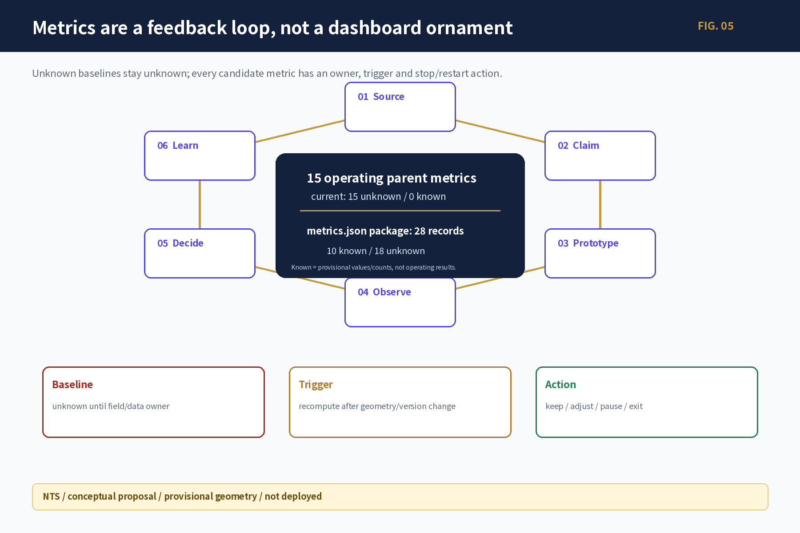

The two counts in the figure use different populations. **All 15 operating parent metrics are currently unknown (15 unknown / 0 known).** The 28 records in the full `metrics.json` package comprise 10 known records that are only provisional geometric work values or structural counts, plus 18 unknown records covering runtime, professional sign-off and statutory-control gaps. Known does not mean operating performance, and unknown is never treated as zero; both remain subject to source-triggered recalculation and stop rules. [metric:monitoring_parent_metric_count] [data:visual/assets/review_evidence_matrix.json]

## Risk, copyright, and compliance

Planning decisions use G-Fact/G-Value/G-Spatial/G-Pilot/G-Release; final artifacts separately pass Fact, Spatial, Rights, Identity and Release gates. The first set controls fact upgrade, value trade-offs, spatial admission and pilot start. The second checks copyright, trademarks, type, portraits, data withdrawal, bilingual terms, accessibility, captions, offline behavior, manifest, hashes and human sign-off. Privacy, copyright, implementation risk and human review records stay next to every high-risk scenario. A failed applicable gate downgrades the output to a research contract, text-only or offline prototype; it does not enter formal site release. [depth:risk_missing_data] [source:MISSING-DATA-CHECKLIST]

AI may retrieve, summarize, compare, flag gaps, draft text for review, and aggregate anonymous feedback. It may not approve planning, allocate public rights, replace engineering safety or medical/education/investment judgment, hide conflicts, or continue service while paused. All formal spatial claims and high-risk decisions retain accountable humans, refusal, appeal, stop, clearing, and recovery.

This revision closes a one-file-one-record rights chain for the 61 current PNGs, basemaps, offline-font CSS, HTML and PDF composite outputs. Generated visuals retain the tool, model-disclosure boundary, final generation specification, input hash and human review. The Noto Sans SC offline subset and all four PDFs use the SIL OFL 1.1 chain; Sentinel backgrounds retain Copernicus attribution. Candidate names and logo grammar are participant-originated research directions, not registered marks or approved public brands. Third-party names are used only for attribution or factual identification, without logos or endorsement claims. This clearance covers `COMMUNITY-DISPLAY-ONLY`; new assets, commercial use, trademark registration, permanent signage or governmental publication reopen G-Rights/G-Brand. Official boundary, field survey, interviews, professional signatures, named operators, and runtime baselines remain external dependencies; they are not filled by the model. [source:SOURCE-USE-MATRIX] [data:visual/assets/asset_rights_register.json] [data:visual/assets/generated_visuals_manifest.json]

## References

- `brief/public-brief.md`, `brief/site-package/design_brief.json`, `brief/site-package/agent_taskbook.json`
- `data/processed/project_scope_summary.csv`, `agent_task_requirements.csv`, `source_use_matrix.csv`, `missing_data_checklist.csv`
- `brief/site-package/` for the design brief, taskbook, enums, ranges, and provisional geometry
- `data/source_registry.json`, `data/processed/project_scope_summary.csv`, `data/processed/agent_task_requirements.csv`, `data/processed/source_use_matrix.csv`, `data/processed/missing_data_checklist.csv`
- The public call and registered sources; global cases are mechanisms, not Jingzhang current-state statistics. [source:SITE-PACKAGE]
- He Nian Liang, “Mr. Liang's Open Letter: The Future of Planning (Part I/II),” used as a normative perspective on human-machine division, planning value judgement, and community planning—not as statutory authority, Jingzhang fact, or an exclusive theoretical framework. [source:LIANG-PLAN-FUTURE-I-20260828] [source:LIANG-PLAN-FUTURE-II-20260829]
