## 项目思考：从“做一套规划”转向“构建一个可持续学习的城市系统”

本项目有两个相互嵌套的研究对象：直接对象是京张铁路创新带的空间、生态、场景和运营；根本对象是**AI Agent如何参与城市规划，并形成可复用、可审计、可迭代的新范式**。京张不是一项普通城市设计附加AI功能，而是检验这条路径能否面对遗产保护、创新网络、城市更新、公共利益、资料缺口和智能体快速迭代的现实试验场。

这里所说的AI原生规划，不是让模型自动审批或一次生成终局方案。它要求Agent沿“来源准入—底数图谱—问题/需求/目标/策略推演—空间与场景—实施运营—监测治理—分众发布—版本回写”参与完整规划链；每一环节都保留证据、反证、禁止推断、人工责任、停止和退出。方案因此必须同时回答：资料从哪里来，哪些判断可以成立，谁能改变结论，哪些空间可以先试，何时必须由人接管，以及失败如何停止、清理和复盘。

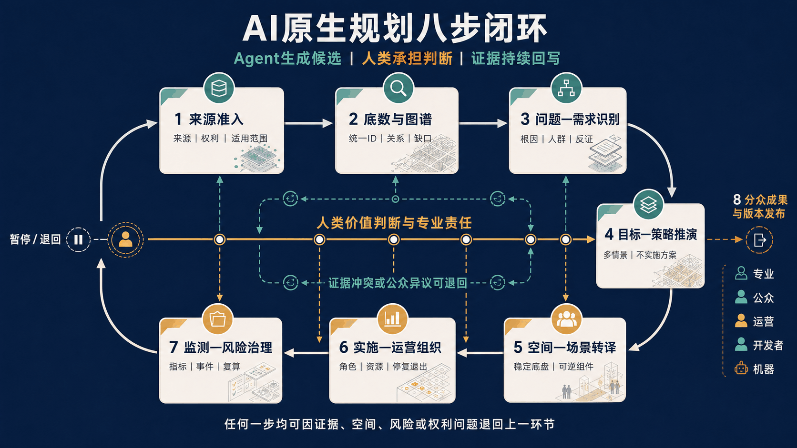

*图20｜八步闭环。七个规划生产环节与第八项分众发布共同受人类责任主线约束；任何一步都可因证据、空间、风险或权利问题退回。图为方法关系，不代表AI自动审批或自动实施。*

AI真正进入规划还需要把两类问题分轨处理：对于来源、规则、叠合、模拟、政策传导和版本差异等**可计算问题**，Agent可以形成可复核候选；对于动机、利益、公平、公共价值和不可接受后果等**价值矛盾**，必须由真实受影响者、社区规划师、专业人员和具名责任主体共同协商。行为数据只能支撑待核假设，不能自动证明人的动机或替公众定义需要。方案因此采用“证据—计算回路 + 价值—协商回路”，并把现场访谈、共同走查、少数意见、申诉和人工决定写入Agent合同。[source:LIANG-PLAN-FUTURE-I-20260828] [source:LIANG-PLAN-FUTURE-II-20260829]

整个探索框架遵循一条明确的论证链：**时代变化 → 传统规划断点 → Agent可增强任务 → 人类不可委托边界 → 京张场地验证 → 运行结果反证方法**。七个切入角度贯穿这条链：城市认知关注多源底数怎样成立；问题定义关注谁被看见或遗漏；逻辑推演关注如何保留反证和多情景；空间转译关注稳定底盘与可逆任务层；公众协商关注真实参与而非模型模拟公众；实施治理关注如何试、停、接管和退出；成果表达关注规划怎样被不同人理解、使用和监督。具体点位和场景只是验证这些问题的样本，不以数量代替框架成立。

本报告把“Agent”统一分为三层：**规划生产Agent**负责来源整理、问题框定、推演、空间转译和复算；**官方六类任务Agent**负责品牌、生态、场景、公共空间、文化和运营六类成果；**城市运行Agent**是未来进入街区服务和治理的候选系统。前两层是本次实际采用的研究组织方式，第三层只是需要后续逐实例试验的规划对象。三者共享证据、责任和退出协议，但生产推演不等于城市运行，任务成果不等于机构承诺，运行Agent也不能成为规划审批主体。

京张不是方法的装饰背景，而是压力测试。已有遗产公园和公共空间要求AI低侵入叠加；AI原点社区的近校、混合和短周期协作潜力要求把资源转成开放前台与纠错旅程；众智园的测试命题要求公众界面与受控测试分开；大钟寺的站城、商业和多类人群叠合，则要求在站口、道路和动机均未核实时先做共同走查而不是工程路线。任何正式空间、现场使用或专业证据与这些判断冲突时，方案必须退回问题定义而非维护既有画面。

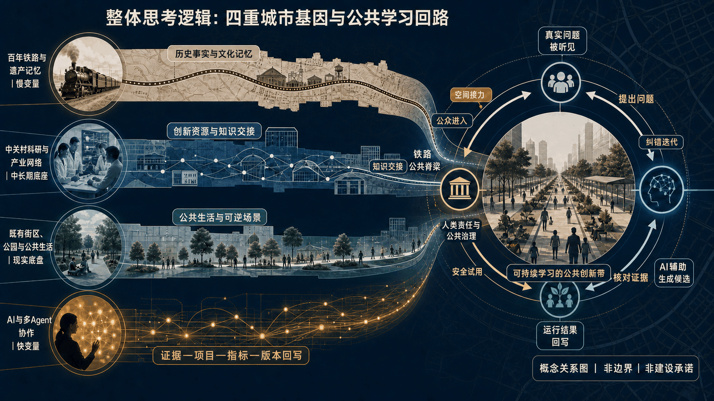

*图21｜整体思考逻辑。百年铁路记忆、中关村创新网络、既有公共生活与AI快变量通过铁路公共脊梁进入可纠错的城市学习回路；为概念关系图，非官方边界、非精确区位、非建设承诺。*

### 传播母题：当城市开始思考——百年京张的AI原生城市文明试验场

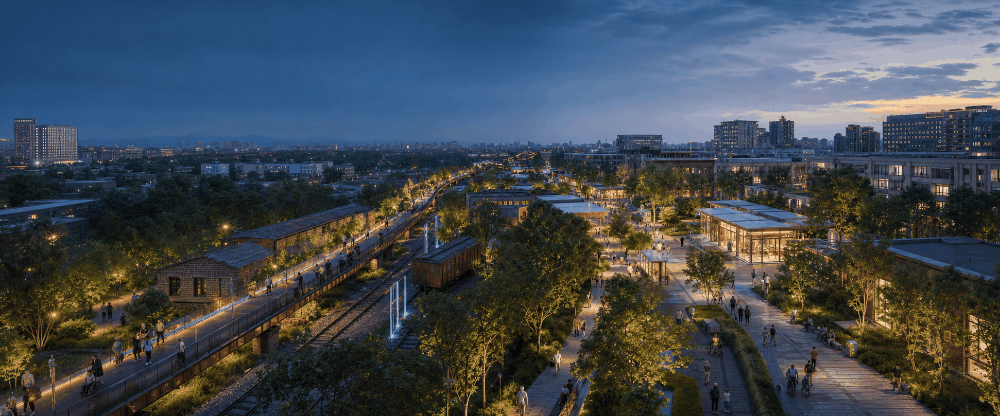

“城市开始思考”不是把决定权交给算法，而是让城市具备可追溯证据、多人定义问题、可逆验证、人工接管、失败退出和版本学习的公共能力。画面以铁路遗产公园为连续公共脊梁，组织研发、社区生活、文化交往和低侵入AI服务；它是AI生成的传播性概念愿景，不是现场照片、真实建筑复原、正式落位或建设承诺。正式研究题名保持不变。

### 面向AI时代的城市规划专业总判断

从规划专业角度，AI时代不是否定用地、交通、生态、公共服务和法定管控，而是在稳定公共底盘之上，把**任务网络、服务接口、时间节律和治理协议**也变成显性的规划对象。这导出五组转变：静态底数转向证据版本，唯一结论转向可审查候选，预测未来转向管理不确定，一次定型转向分阶段证伪，项目交付转向城市学习。

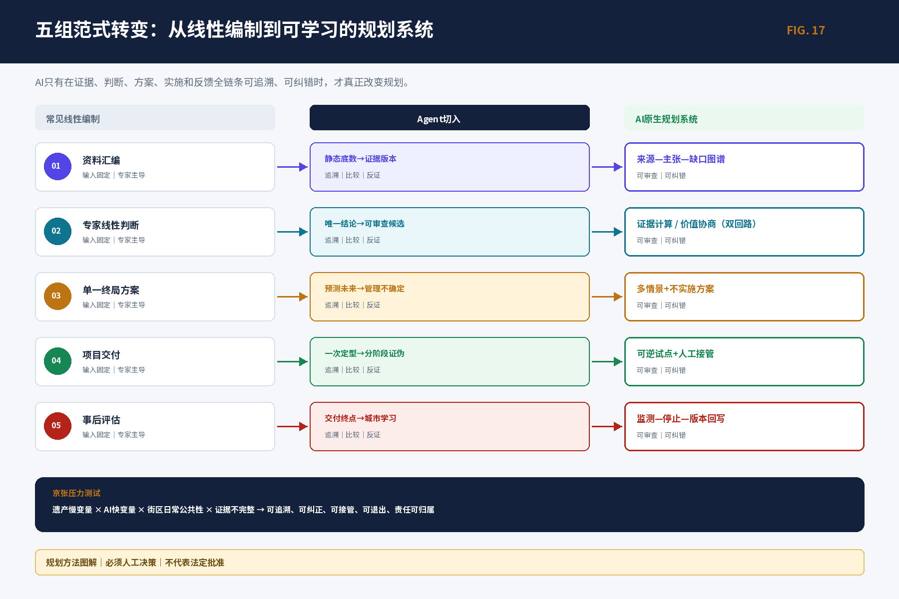

一个AI场景因而不再只是一个功能或设备，而是“空间+任务+接口+时间+治理”的完整合同。任一可变层退出后，公共通行、休憩、无障碍和普通服务仍必须成立。本方案因此要求每张场景卡同时写明空间载体、使用者、AI/人工分工、开放时段、权利边界、停止清理和版本回写。

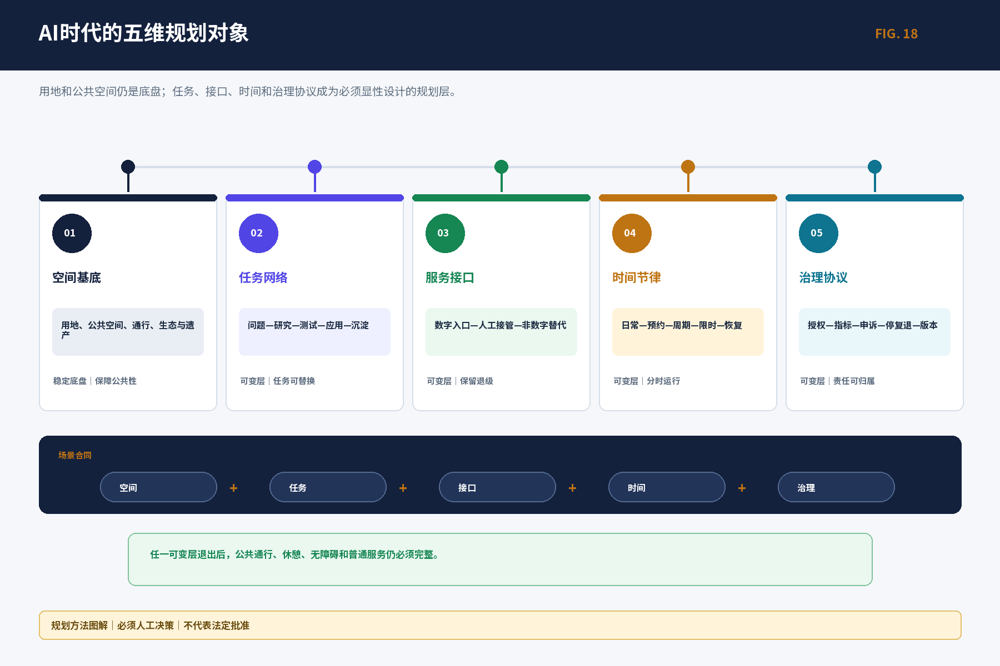

这套方法不替代法定规划。法定与专业底座给出不可突破的权利、空间和安全边界；战略与城市设计在边界内组织多情景和分期候选；运营协议只对获授权的小样进行验证。运行数据可以成为下一版规划的证据，但不能自动改变法定决定。

本方案把《项目研究总纲 V2.0》的三个统一认识转成五个规划动作：先建立七类底数、数据图谱和证据等级；再以多 Agent 并行识别问题、需求、目标、对策和反证；把 AI 时代新的工作、生活、学习、交往与治理方式转成“稳定公共底盘 + 可逆场景”；用日、周、季、年活动和六段转化链组织长期运营；最后把同一套判断派生为专业报告、公众界面、双语图件和机器可读文件。来源、空间状态和证据限制始终与判断相邻。[source:OFFICIAL-ANNOUNCEMENT] [source:AGENT-TASKBOOK] [depth:existing_conditions_diagnosis]

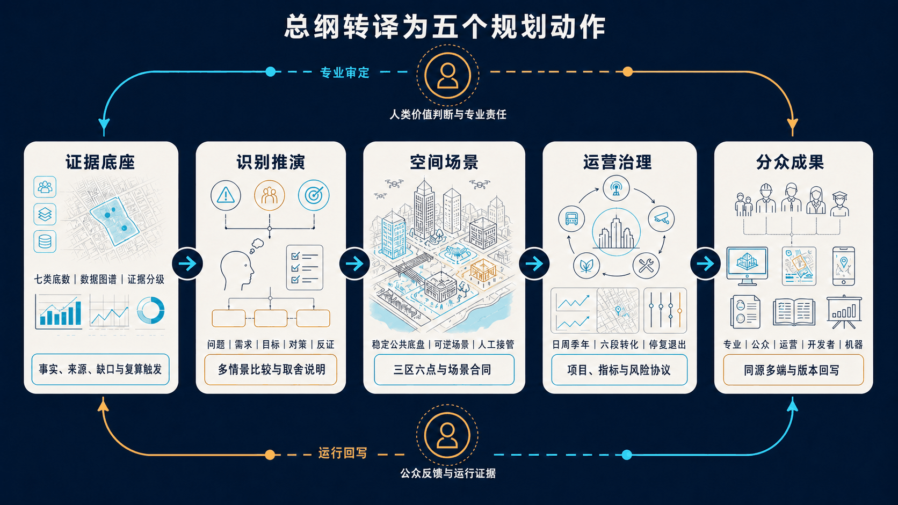

*图22｜五个规划动作。证据底座、识别推演、空间场景、运营治理和分众成果构成双向回路；上环为人类专业审定，下环为公众反馈与运行证据回写。*

京张的核心命题是：**如何把一条有历史公共性、创新资源密度和复杂边界的城市带，变成真实问题可以被听见、证据可以被核对、原型可以被安全验证、公众可以拒绝和申诉、失败可以退出并沉淀为下一轮知识的城市实验场。** 因此，“京张智脉共生带”不是一张终局效果图，而是一套空间—场景—运营学习系统。

本方案交付双重成果：场地层形成“一带三区两翼”、13个场景和三区六点；方法层形成任务、证据、空间—场景、决策和版本五类合同。Agent可以采集、关联、推演、生成候选、检查一致性和形成复盘草案；来源准入、公共价值取舍、法定审定、专业安全、空间权利和正式发布必须由具名责任人完成。评价AI Agent规划路径的标准不是文本或图像数量，而是可追溯性、场地针对性、公共价值、可逆性和持续学习能力。

本方案严格区分 `verified`（来源直接支持的事实）、`background`（全球案例和政策背景）、`design_proposal`（规划建议）、`provisional`（暂定空间或暂定关系）和 `unknown`（尚待补证的量或条件）。任何图件精度都不得升级证据等级。

### 人工评审证据导航（不自评得分）

本表严格采用官方七维权重，只说明专家可在哪里核对证据，不填写0—5分，也不把本地门槛通过表述为官方评分。

| 官方维度 | 权重 | 核心证据 | 人工仍需判断什么 |
|---|---:|---|---|
| 任务书相关性 `brief_alignment` | 20% | 三层范围、一带三区两翼、六类Agent任务；`compliance_matrix.json`、`assets/figures/agent-taskboard.png` | 是否真正回应京张、海淀、创新生态、空间和公共治理，而非关键词覆盖 |
| 原创性 `originality` | 10% | 双回路、三层Agent、稳定底盘+可逆任务层、五类合同；`assets/figures/identity-brand.png`、`report/narrative.md` | 概念和机制是否形成新判断，是否避免通用AI拼贴 |
| AI与城市规划创新性 `ai_planning_innovation` | 15% | 七个规划问题、两次Agent纠错实验、13场景和版本回写；`visual/assets/scenario_cards.json` | AI是否改变认知、判断、空间、协商和实施，而不只是生成文本图像 |
| 可实施性 `implementation_feasibility` | 20% | G0—G3/X、六项试点、19项活动、15项父指标、停复退；`design_depth_matrix.json`、`metrics.json` | 在真实主体、场地、预算和基线缺失条件下，哪些只能保持候选 |
| 公共利益与包容性 `public_interest_inclusion` | 10% | 八类用户、非数字等价入口、知情拒绝、无障碍、申诉和普通服务保底 | 真实居民、弱势群体和少数意见是否会改变方案 |
| 风险与合规意识 `risk_compliance` | 10% | 五种证据状态、规划决策/成果发布两套五门、权利/隐私/停止/清理；`sources.json`、`assumptions.json` | 公开资料、版权、政策和专业边界是否被如实披露 |
| 表达完整度 `expression_completeness` | 15% | 中英proposal/HTML、A3/A0、图件、GeoJSON/JSON、manifest和自检 | 不同媒介是否同源、可读、可继续深化，且不以图像精度掩盖未知 |

机器可读的逐项引用、限制和任务映射见 `visual/assets/review_evidence_matrix.json`。

# 以构建城市规划新范式命题下的京张铁路创新带AI原生规划新思考

本报告由三部分构成，但不是三套互不相干的文本。第一部分回答**为什么规划、京张真正面对什么问题**；第二部分回答**Agent怎样工作、哪些判断绝不能交给机器**；第三部分回答**在京张具体规划什么、怎样使用、怎样实施和退出**。总体命题给出价值坐标，Agent系统提供生产和校核机制，城市规划设计方案才是最终空间回答。

| 部分 | 核心问题 | 本次形成的实质成果 |
|---|---|---|
| 第一部分｜总体理解方案 | 为什么需要AI原生规划，京张的独特矛盾和目标是什么 | 三层范围、创新生态、三文化、未来人群与“一带三区两翼”总判断 |
| 第二部分｜AI Agent规划操作方案 | 资料、推演、反证、协商和版本怎样被组织 | 七类底数、证据图谱、六类任务Agent、五道人类门、纠错与回写账本 |
| 第三部分｜城市规划设计方案 | 什么地方为谁解决什么问题，形成什么空间和服务 | 总体空间结构、三区六点、13场景、专项系统、项目分期、运营指标与退出合同 |

第三部分不是用效果图包装概念，也不以“未来、智慧、赋能”等词替代设计。每项方案必须至少回答场地依据、目标人群、空间关系、使用流程、普通服务保底、责任角色、启动证据、评价指标和停止恢复；资料不足时保留`unknown/provisional`并列出补证动作，不用虚构精度制造“像方案”的假象。

# 第一部分｜总体理解方案：从时代变化到京张规划命题

## 设计依据与资料清单

设计依据由官方征集公告、面向智能体任务书、场地资料包和公开/清权来源登记共同构成。公告给出三层研究任务和成果深度，任务书给出六类 Agent 任务、五大功能和三区两翼的共创边界；来源登记、缺口清单和 GeoJSON 则把每项判断落到文件、时点、空间尺度、许可和复算触发器。[source:SOURCE-REGISTRY] [source:PROCESSED-FACT-PACK] [source:PROJECT-SCOPE-SUMMARY]

任务字段和六类交付由 [source:AGENT-TASK-REQUIREMENTS] 进一步核对。

当前公开包没有法定研究范围、总体设计范围和三处重点区的官方多边形。提交包使用维护者发布的 provisional geometry，所有边界、邻接、路线和由其计算的面积均只用于研究讨论与一致性检查；正式边界、控规、权属、道路、市政、文保、消防和工程资料到位后，九层空间数据和全部派生指标必须整体复算。[source:SITE-PACKAGE] [data:geometry/site_boundary.geojson#SITE-001] [data:geometry/key_areas.geojson#PROV-KEY-001]

资料采集不追求把未知字段填成数字，而是为每个字段保留来源、状态、责任人、用途、禁止推断和补证动作。当前未知不等于零，暂定不等于官方，候选方案不等于已批准或已运行。

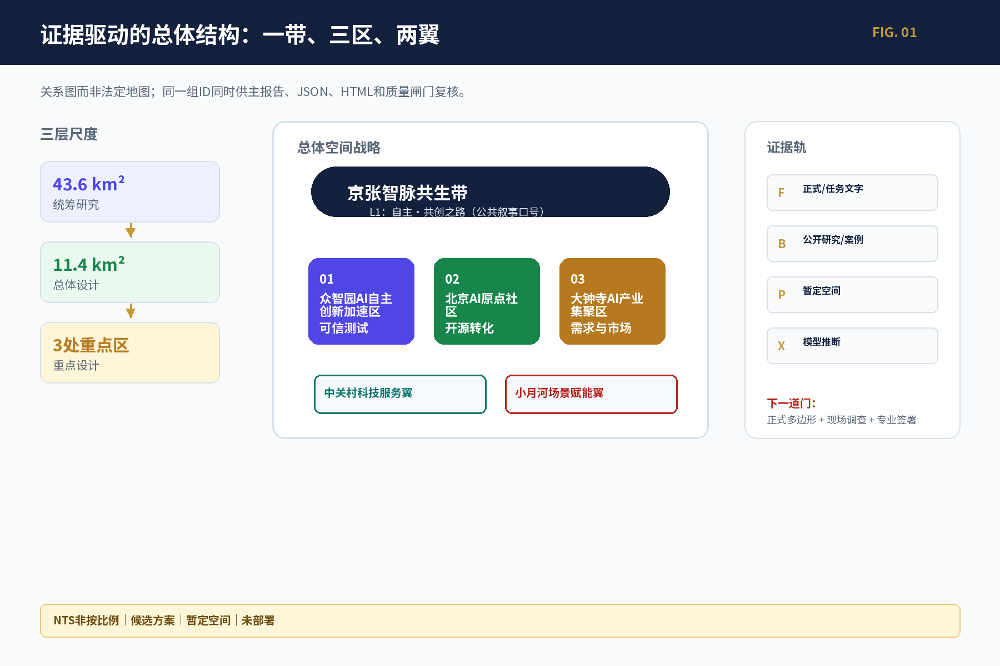

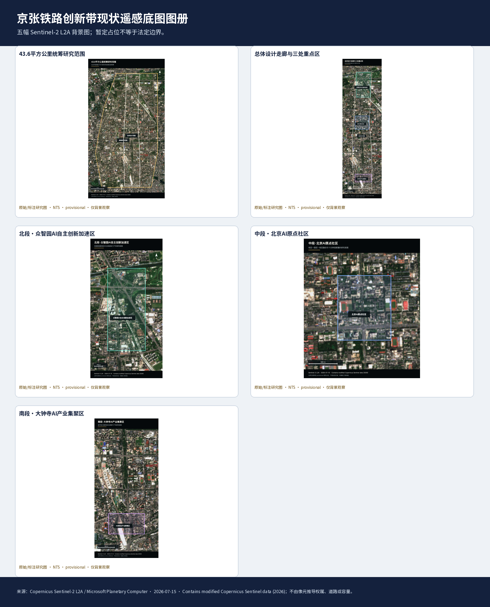

五幅 Sentinel-2 L2A 影像仅作为背景观察和问题发现依据；图册中的标注边界为资料包的 provisional research placeholder，不是法定红线、权属、道路、站口或工程容量依据。正式多边形到位后，必须重裁、叠合九层空间数据并重算全部派生指标。[source:D2SRC-SHARED-014] [data:visual/assets/base-map-manifest.json]

## 三层范围工作框架

方案按三层推进：统筹研究范围约 43.6 平方公里，回答海淀 AI 创新生态、文化叙事和未来城市形态；总体设计范围约 11.4 平方公里，回答京张遗址公园周边城市更新、产业空间、交通市政和风貌控制；三处重点区合计约 368.4 公顷，回答功能业态、建筑更新、公共空间、慢行连通和实施条件。[standard:PROJECT-OFFICIAL-ANNOUNCEMENT] [depth:three_level_scope_framework] [depth:overall_spatial_structure]

本版研究采用“京张智脉共生带”作为总体空间战略工作名：以京张铁路遗址公园及周边公共空间为公共知识与生活脊梁，以众智园、北京 AI 原点社区和大钟寺 AI 产业集聚区作为三类创新任务场，以中关村科技服务翼和小月河场景赋能翼承担专业服务、公共场景与知识回流。“一带三区两翼”是任务关系，不替代法定红线、工程线位或机构承诺；名称和译文仍须通过语言、权利和公众误读测试。

| 层级 | 核心问题 | 规划回答 | 可读成果 |
|---|---|---|---|
| 统筹研究层 | 研究、开源、资本、市场和公共生活如何形成创新生态 | 建立“问题—研究—开源—测试—应用—沉淀”接力 | 全球案例机制表、创新链图谱、文化叙事 |
| 总体设计层 | 城市更新、产业空间、公共空间和交通市政如何共同支撑 | 形成一带三区、两翼协同、蓝绿慢行复合环 | 用地/建筑/道路/蓝绿/分期图件 |
| 重点设计层 | 三处片区如何转成可感知、可试用、可退出的场景 | 每区两个工作点，绑定用户、空间、运营、指标和人工门 | 六个点位卡、13场景卡、项目台账 |

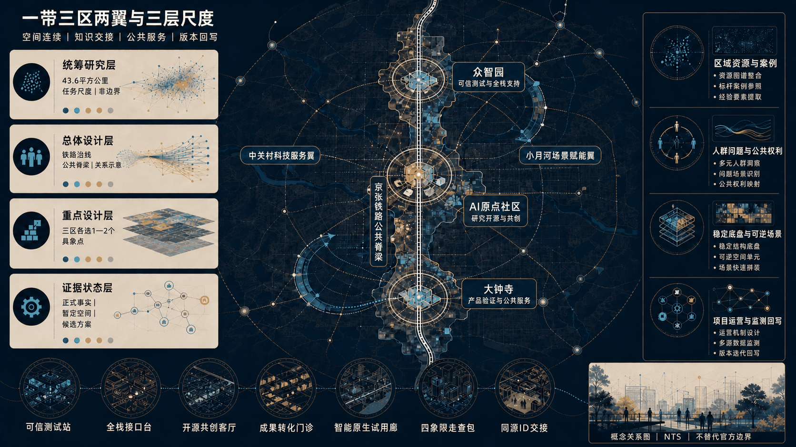

*图23｜三层尺度空间结构。图内直接标注三层工作尺度、三区两翼、铁路公共脊梁与六个候选点；NTS概念关系图，不替代官方边界、道路、站口或工程线位。*

总体空间判断由用地、建筑、道路、蓝绿、公共空间和分期九层数据共同表达；边界状态和指标状态在图例、表格和 HTML 中同步显示。[data:geometry/land_use.geojson#LU-001] [data:geometry/buildings.geojson#BLDG-001]

道路、蓝绿与分期由 [data:geometry/roads.geojson#ROAD-001] 和 [depth:land_use_layout] 继续核对。

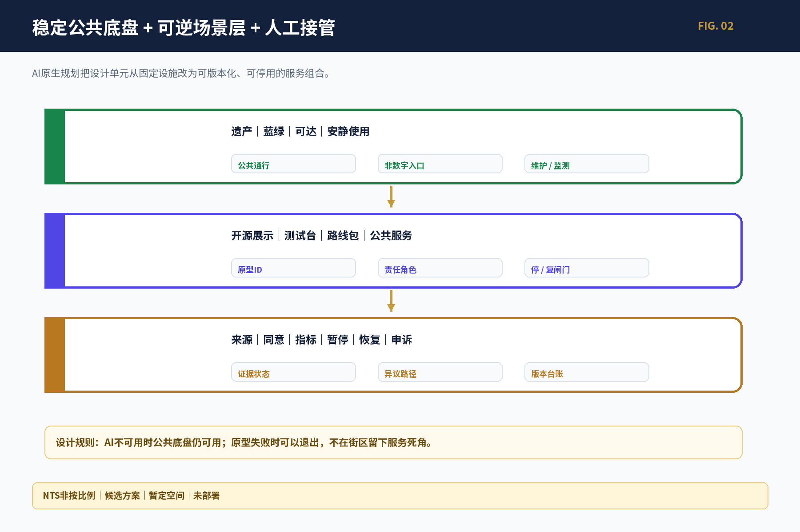

## 统筹研究范围产业与未来城市研究

### 创新生态：七个全球案例转译为八段接力

全球案例不作为海淀现状统计，而用于比较机制：新加坡 one-north/AI Singapore 提供“近邻载体—限定周期 PoC—治理测试”；加拿大 Mila、Vector Institute 提供“研究—人才—工程—创业转化”；Seoul AI Hub/Yangjae 提供“城市支持—高性能计算—业务验证”；Hub71+ AI 提供分阶段资源释放；STATION F/F/ai 提供半开放前台、受控工作与公众生活；MassRobotics 提供共享实验、原型和安全接管。七案共同说明创新带需要可交接的中层机制；进入海淀前须明确项目ID、交接件、人工责任、许可、受控测试和退出，机构架构、补贴、资本、租金、规模、伙伴和案例绩效均不迁移。[source:SOURCE-USE-MATRIX] [standard:PROJECT-AGENT-OPEN-CALL-TASKBOOK]

案例来源入口：Singapore `D2SRC-B2-001—005`；Mila `D2SRC-B2-006—008`；Vector `D2SRC-B2-009—010`；Seoul `D2SRC-B2-011—013`；Hub71 `D2SRC-B2-014—015`；STATION F `D2SRC-B2-016—019`；MassRobotics `D2SRC-B2-020—024`。这些 ID 指向随包 `sources.json` 的逐条定位，不把案例事实外推为海淀统计。

本地创新生态的八段主链严格定义为 **R科研 → O开源 → C算力 → D数据 → T测试 → I孵化 → F资本 → M市场**。真实问题是输入而非宣传起点；G治理横梁贯穿全链，K知识沉淀将成败都回写下一轮；专业与伦理复核是可以否决、暂停或降级的闸门，不冒充生态链的一个生产阶段。众智园侧重算力、数据与可信测试接口，北京 AI 原点社区侧重研究、开源与孵化交接，大钟寺侧重需求、资本服务与市场验证；具体机构、资金、算力和运营主体均待授权，不从地名推导承诺。

区域协同不以“建立联盟”作未经授权的承诺，而以可交接的接口组织。下列对象来自任务书的协同要求，当前均为候选关系：

| 区域对象 | 候选协同流 | 京张承担的接口角色 | 进入条件 | 禁止推断 |
|---|---|---|---|---|
| 北纬社区 | 青年人才、开放议题、社区体验 | 接收问题卡并返回可理解的测试/服务结果 | 真实社区议题、授权联系人、非数字参与与回执 | 不宣称既有合作、代表居民或已形成活动 |
| 未来科学城 | 研究成果、人才与验证需求 | 提供开源转译、受控测试和城市问题入口 | 清权成果、适用场景、责任主体和IP/数据边界 | 不迁移机构使命、资源规模或政策权限 |
| 怀柔科学城 | 科学成果与复杂技术的公共解释/应用问题 | 把专业成果转成可审查的公共问题和候选场景 | 专业解释人、许可、安全与公众价值审查 | 不把科研成果直接写成可部署产品 |
| 北京经开区 | 制造、产品化与产业场景反馈 | 交换测试协议、需求证据、失效和维护记录 | 真实项目、质量/安全责任、采购与商业权利边界 | 不承诺订单、场地、采购或产业落地 |
| 京津冀 | 跨区域问题、标准、人才与知识回流 | 沉淀可复用问题卡、场景合同、风险和版本记录 | 数据口径、治理权限、成本与受影响群体一致性复核 | 不以一地试点外推区域绩效或治理权 |

每次协同必须产生“输入来源—交接件—接收责任—不得使用项—反馈/退出”记录；没有真实对象和授权时只保留接口设计。

### 概念与视觉系统

项目研究总标题保持不变；“京张智脉共生带”是本版总体空间战略工作名，“自主·共创之路”是候选公共叙事母题，均不取代总标题。命名树统一为：L0研究总标题、L1空间战略工作名、L2公共叙事母题、L3一带三区两翼、L4场景/活动、L5点位/组件；三大定位是跨层评价目标，不另占命名层级。Logo只确定“证据之线”构图语法；名称、商标、语言、权利、无障碍或误读门未过时不作正式品牌，权利冲突、史实错误、状态误导或项目停止时撤牌下线并保留版本。[standard:MOHURD-URBAN-DESIGN-MEASURES] [depth:overall_spatial_structure]

### 三种文化的非因果叙事

铁路文化讲特定时代的工程、知识、组织与公共连接；中关村文化讲研究、制度试验、合作与失败；AI新文化讲来源、许可、版本、贡献、纠错和责任。“自主建造—自主创新—开源共创”仅是当代解释框架，不是直接历史因果。五条导览原型是到场任务而非已发布路线：R1“一眼看懂京张”（约30分钟体验目标）、R2“三种文化深读”（约90分钟）、R3“半日共创路”（3—4小时）、R4“无障碍低数字路线”、R5“国际访客线”。它们均保持假设/暂定/纯文字状态，线位、时长、开放条件和第三方权利待现场与专业核验；均提供纸质、无障碍和人工入口。

### 人才画像与未来城市判断

八类用户包括研究者、开发者、创业团队、企业访客、附近居民、学生教师、服务提供者和运营者。不同用户共享公共入口，但在受控工作、数据权限和专业服务上分级。AI 时代新增空间需求不是“更多屏幕”，而是短周期协作、可预约测试、人工解释、非数字替代、数据清理、安静使用和可逆设备。

# 第二部分｜AI Agent规划操作方案：从证据到账本的工作系统

## Agent在本项目中究竟做什么

本项目不把Agent理解为一个自动出图工具，而把它组织成规划生产系统。输入不是一句概念口号，而是带来源、时间、空间尺度、权利和限制的底数；输出也不是一个唯一答案，而是可比较候选、反证、人工裁决和版本差异。Agent的工作止于“提出可审查判断”，事实升级、价值取舍、法定审定、专业安全、空间权利和正式发布必须由具名责任人完成。

七类底数——空间、人口与使用者、产业与机构、交通与可达、蓝绿与环境、文化与权利、运营与风险——首先进入证据图谱。每条记录必须说明`verified/background/design_proposal/provisional/unknown`状态、允许用途和禁止推断；来源变化时，相关问题、方案、图件和指标同时失效并触发复算，而不是只修改一张图。

## 六类任务Agent与一个统筹Agent

1. **概念与品牌Agent：** 形成总体概念、L0—L5命名树、Logo构图语法和品牌权利门，不自行发布正式品牌。
2. **生态Agent：** 比较七个全球机制，形成R/O/C/D/T/I/F/M八段接力、G治理横梁和K知识回写，不把外地机构规模和绩效迁移为海淀事实。
3. **场景空间Agent：** 将AI+医疗、教育、商业等任务转成用户—空间—服务合同，并同时生成“不使用AI”的普通服务方案。
4. **公共空间Agent：** 提出开发者散步道、成果展示和贡献记录等可逆组件，先保护通行、休憩、无障碍和遗产环境。
5. **文化Agent：** 组织铁路、中关村与AI三条独立证据线，形成可纠错导览，不制造未经证实的历史因果。
6. **运营Agent：** 把活动、测试、转化、指标、投诉和停止恢复组织成长期账本，不用活动数量替代公共价值。
7. **统筹Agent：** 检查六类输出是否共用同一场地、事实、编号、证据状态和人工门，发现冲突时退回相应任务而不是自动折中。

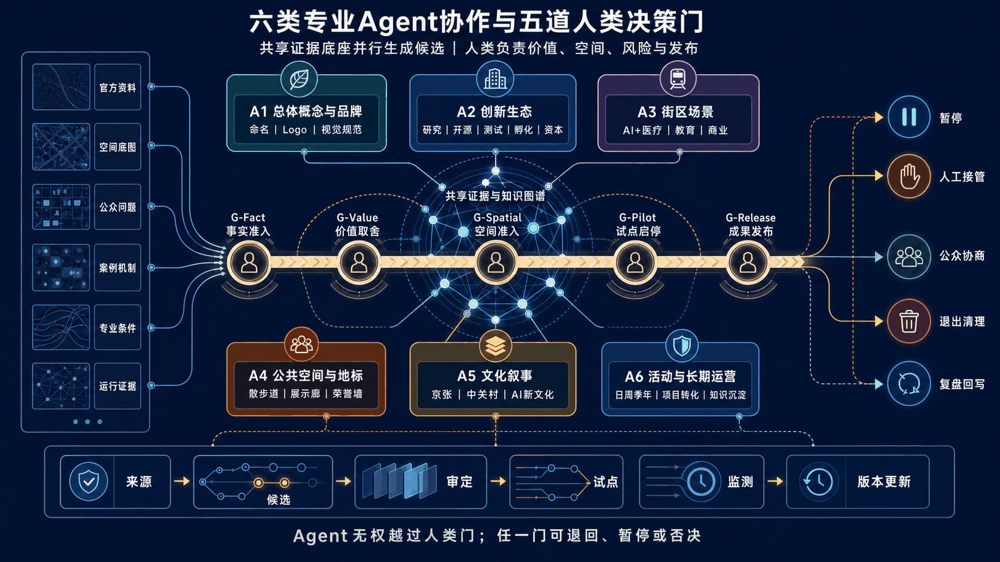

*图24｜六类Agent并行生成候选，共享证据与知识图谱；事实准入、价值取舍、空间准入、试点启停和成果发布均由人类控制，任一门可以退回、暂停或否决。*

## 从问题到版本的操作链

Agent实际执行“底数准入—问题识别—需求/目标辨析—多情景候选—反证与冲突—空间/服务转译—人工决定—实施监测—版本回写”链。每次交付至少包含四项：一张来源可追溯的问题卡、一组含“不实施/不用AI”的备选、一次人工裁决记录，以及一份说明谁在什么条件下重开的版本日志。这样，Agent不是替规划师给答案，而是让隐藏假设、证据断点和不可接受后果更早暴露。

六类Agent共同遵守一条人机分界：机器负责显性证据、逻辑关系、条件情景和一致性检查；人负责问题定义、动机理解、价值排序、利益协调和最终责任。众智园验证“技术是否可信且可接管”，AI原点社区验证“线上分析是否接受现场与居民纠正”，大钟寺验证“行为数据是否退回共同走查，而不是直接替人作结论”。

## 两次纠错实验：以否决证明Agent有用

开发者散步道任务曾生成永久地标、可逆标记和无固定构筑物主题步行三案。由于公园/文保几何、内容权利和运维证据不足，人类门否决永久方案，将其降级为文字任务路线与可移动故事站。大钟寺站城任务曾依据OSM和暂定范围生成路线；由于站口、道路、路权和人的出行动机均无法核验，该路线被废止，改为站口、过街、非机动车、无障碍和人工替代五项共同走查。

两次实验的成果不是“多生成两套方案”，而是证明Agent输出能够被证据否决，并把错误确定性回写为下一轮禁用条件。七项候选—反证—裁决—回写记录见 `visual/assets/agent_planning_process_ledger.json`；角色、输入输出、质量门和交接协议见 `report/narrative.md` 附录A—D；数据资产登记见 `visual/assets/data_asset_register.json`。

## Agent操作方案的验收标准

Agent价值不按文字、图像或Token数量评价，而按五项结果验收：**证据能否回溯、方案是否真正结合京张、公众是否能够改变结论、高风险场景是否可人工接管、失败是否能停止并形成下一版知识**。未形成真实对象、责任主体或授权实例时，Agent成果保持研究合同，不冒充机构合作、公众参与、专业签章或城市运行。

# 第三部分｜城市规划设计方案：从总体结构到三区六点真实空间回答

## 总体设计范围城市更新与控规深度城市设计

总体设计层形成“一带三区两翼、多点场景、蓝绿慢行复合环”的空间框架。用地层区分创新研发、产业服务、公共服务、生活配套、蓝绿开放空间和待核更新对象，并按 [standard:MNR-LAND-USE-CLASSIFICATION-GUIDE] 采用可校验的用地分类；建筑层采用保留、改造、更新、新建候选和待确认五类状态；道路层只表达方向性联系和待核慢行断点，不把暂定线条写成道路红线。

建筑与强度不编造 FAR、建筑高度、拆改量、投资额或市政容量。已提交几何可以复算工作面积和图层关系，但控规指标、权属和专业边界仍为 `unknown`；取得正式控制资料后，规划、建筑、交通、市政、园林、文保、消防和无障碍专业共同复核。[standard:MOHURD-CONTROL-DETAILED-PLANNING] [depth:development_intensity_controls]

建筑专业深度由 [standard:MOHURD-ARCH-DESIGN-DEPTH-2016]、[depth:height_massing_character] 和 [depth:retain_renovate_demolish] 共同核对。

总体更新策略为“先公共、后载体；先可逆、后建设；先试用、后扩面”：优先补齐遗址公园公共性、慢行连续、首层服务、开源展示和人工入口；对高风险测试、永久地标和大规模改造设置证据、权利、专业、运营和发布五门。

## 重点区域详细设计

三处重点区承担不同角色：众智园是可信测试和全栈自主创新锚点；北京 AI 原点社区是近校开源与成果转化锚点；大钟寺是需求方、产品化、内容消费和国际交往锚点。六个点位统一采用证据成熟度：G0 研究/桌面、G1 获授权的室内或非现场低依赖小样、G2 独立实例受控验证、G3 条件式跨节点扩展、X 退出并恢复普通服务；可复制运营不是默认终点。状态上升由证据成熟度而非效果图完成度决定。[data:geometry/key_areas.geojson#PROV-KEY-002] [data:geometry/key_areas.geojson#PROV-KEY-003] [depth:three_key_area_detailed_design]

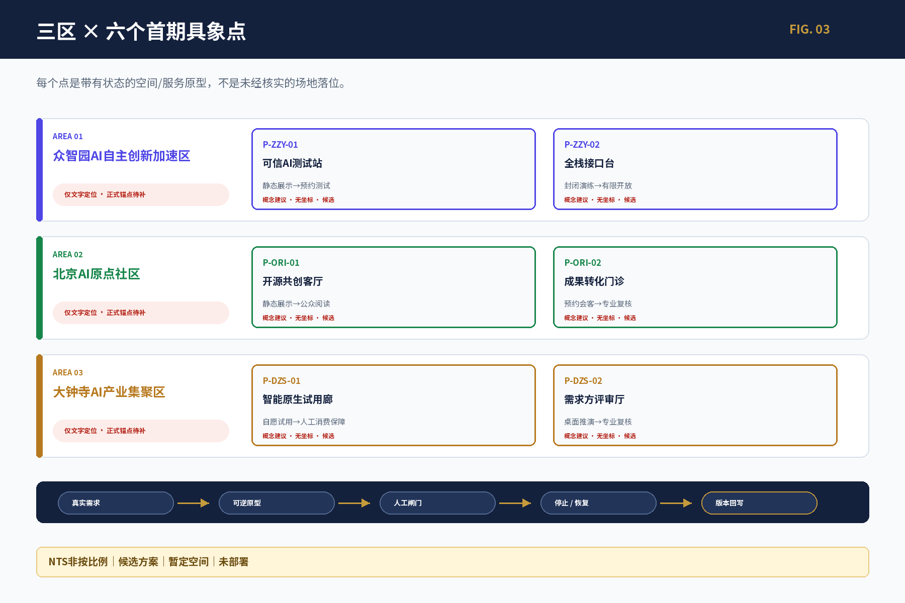

| 区段 | 点位 | 可落地动作 | 关键指标/退出 |
|---|---|---|---|
| 众智园 | `P-ZZY-01` 可信 AI 测试站 | 开放验证桌、授权样本、受控测试舱候选、人工观察位和实体停机 | 材料完整率、人工复核率、事件清理率；安全装置或责任人缺失即降级为离线桌面推演 |
| 众智园 | `P-ZZY-02` 全栈接口台 | 项目卡、资源卡、责任人、暂停/恢复/退出账本，线上线下等价 | 状态公开率、停止清理率、线下任务完成率；不得自动批准或改变规划 |
| AI 原点社区 | `P-ORI-01` 开源共创客厅 | 免费人工前台、每周开源桌、纸质目录、贡献与纠错板、可移动展示 | 许可完整率、无障碍可达性、维护响应；权利不清即撤下或只显示来源索引 |
| AI 原点社区 | `P-ORI-02` 成果转化门诊 | 问题卡、证据成熟度分诊、IP/法务/测试转介和人工回执 | 首次转接时间、责任人确认率、退回原因；不承诺融资、入驻或采购 |
| 大钟寺 | `P-DZS-01` 智能原生试用廊 | 自愿商户单项服务实验、普通服务保底、纸质权益说明、人工客服和退出清理 | 知情拒绝率、投诉响应、清理闭环；消费者权益或公平性不明即停止 |
| 大钟寺 | `P-DZS-02` 需求方评审厅 | 纸质四象限步行核查、无障碍任务走查、问题派单和回访 | 等候/绕行记录、无障碍连续性、修复闭环；站口、道路和路权未核验不做工程结论 |

### 方案深度边界：不伪造精度，但必须作出设计决策

正式多边形、权属、楼宇、站口和工程控制尚未提供，因此本轮不能负责任地给出建筑编号、精确坐标、面积容量、FAR或造价；这不意味着方案只能停留在口号。本轮采用“**片区角色—空间界面—功能组件—一天使用流程—实施合同**”五级精度：先确定每个区在全带承担什么任务，再确定点位应依附的空间类型和前后台关系，继而明确可以摆放、使用和撤除的组件，最后给出人如何进入、谁接管、何时停止。收到正式图件后，只需把已定义的空间合同匹配到合格载体，而不是重新发明概念。

| 区域 | 首要场地矛盾 | 必须形成的空间界面 | 首期无悔动作 | 本轮明确不做 |
|---|---|---|---|---|
| 众智园 | 技术测试需要受控，但成果又需要被公众和需求方理解 | 面向铁路公共脊梁的开放验证前台—安全阈值—园区内部受控测试后台 | 验证桌、证据板、人工观察位、实体停机和退出清单 | 不开放未经审查的高风险设备，不以公众空间替代安全测试场 |
| AI原点社区 | 高校、青年和研发资源密集，但问题入口、开源维护和转介责任容易分散 | 日常首层公共前台—安静共创层—专业转介后台，且不占用居民通行 | 每周开源桌、纸质目录、问题卡、纠错板、人工回执 | 不把社区变成展厅，不用扫码、画像或活动挤占普通生活 |
| 大钟寺 | 站城、商业、居住和访客叠合，但站口、路权和真实需求尚未核验 | 多入口共同走查前台—自愿单项试用界面—需求评审与问题回访后台 | 纸质四象限核查、普通服务保底、商户单项试用、问题派单 | 不画未经核验的工程路线，不自动定价、评级或推断出行动机 |

### 众智园：可信测试不藏在园区内部，而要形成可审查的公共接口

**场地依据与设计判断。** 众智园承担全栈自主创新和可信测试任务，但公共开放与受控测试不能混为一体。空间应由面向铁路公共脊梁、可无障碍到达的“验证前台”向园区内部的“受控后台”递进，中间设置清晰安全阈值；物流、设备维护和紧急退出不穿越公众停留面。正式载体未定时，只锁定这种前后台关系，不指定某栋楼。[data:geometry/key_areas.geojson#PROV-KEY-001]

**`P-ZZY-01`可信AI测试站。** 前台由问题受理桌、证据成熟度板、授权样本柜、人工观察位和可见实体停机构成；后台才允许进入隔离设备、受控数据和专业测试。访客的一次完整旅程是“先看普通说明—自愿选择是否参与—核对数据/安全边界—观察单项测试—取得人工结果回执—确认数据与设备清理”。任何消防、保险、数据、安全责任或物理停机未闭合时，只运行纸面和离线桌面推演。

**`P-ZZY-02`全栈接口台。** 它不是资源展示屏，而是一套有责任人的交接界面：每个项目同时展示问题来源、项目ID、所需算力/数据/测试、当前证据级别、责任角色、下一门槛和退出状态；公众可用纸质卡提交问题，企业和研发人员在受控端补充技术材料。接口台不审批规划、不分配算力或投资，只把“谁还欠什么证据”公开化。

### AI原点社区：把近校创新资源转成社区可进入、可纠错的开放前台

**场地依据与设计判断。** 原点社区的优势是近校、混合使用和短周期协作，风险则是创新活动挤占日常生活，或把居民当作试验样本。空间采用“公共客厅—安静共创—专业转介”三级：临日常公共界面布置免费人工入口和可移动设施，向内过渡到预约共创，涉及IP、数据、法务和测试的内容进入非公开转介；住宅出入口、消防通道、休憩座椅和夜间安静优先于活动。[data:geometry/key_areas.geojson#PROV-KEY-002]

**`P-ORI-01`开源共创客厅。** 以一张可拼合长桌、一套纸质/离线项目目录、贡献与纠错板、无障碍坐席和可撤展示构成最小单元。居民可以带来生活问题但不被要求提交个人数据；学生和开发者可认领公开任务，但必须显示许可、维护人、完成条件和退出方式。成果无人维护、许可不清或影响日常通行时，撤下展示，只保留来源索引和人工解释。

**`P-ORI-02`成果转化门诊。** 门诊不是孵化器招商台，而是责任分诊：问题卡先判断证据成熟度和公共价值，再分别转给技术测试、开源维护、IP/法务、无障碍或需求方；每次转介必须返回“已接收、退回补证或拒绝并说明原因”的人工回执。没有具名接收者时不得显示“正在转化”，更不得承诺融资、采购或入驻。

### 大钟寺：先把复杂站城问题看清，再做可退出的智能商业试用

**场地依据与设计判断。** 大钟寺叠加交通换乘、商业消费、周边居住、铁路文化和国际访客，是全带最接近真实需求与市场反馈的区域，也最容易因流量数据产生错误确定性。由于正式站口、道路和路权尚未核验，本轮不画工程路线，而采用“共同走查—单项试用—需求评审—问题回访”四步，把设计锚定在可核查任务而非假坐标。[data:geometry/key_areas.geojson#PROV-KEY-003]

**`P-DZS-01`智能原生试用廊。** 首期只允许“一家自愿商户—一个低风险服务—一个观察窗”：例如双语商品信息解释、排队信息说明或无障碍服务转接，同时保留原有价格、人工服务和不参与通道。入口处以纸质权益卡说明采集什么、不采集什么、多久清理、向谁投诉；出现自动定价、信用判断、强制扫码、差别服务或无法人工接管时，立即停止并恢复普通服务。

**`P-DZS-02`需求方评审厅。** 评审厅的第一件成果不是路线图，而是四象限任务底图和问题账本。居民、通勤者、商户、残障人士、游客与交通/无障碍专业人员按不同时段共同记录站口辨识、过街等待、非机动车冲突、休息与遮雨、无障碍连续和人工替代；每条问题必须有位置证据、受影响者、责任去向和回访结果。只有正式站口、道路和专业核验齐备后，问题账本才可转为工程路线或设施设计。

### 三区不是三个展馆，而是一条可以完成交接的创新链

大钟寺负责把真实使用问题整理成带权益边界的问题卡；AI原点社区负责公开讨论、开源分解和专业分诊；众智园负责受控测试、安全接管和失败记录；结果再回到原需求方确认是否解决问题。每次交接必须携带同一项目ID、来源、许可、责任人、交接件、未决项和停止状态。任何一环没有真实主体时，流程停在上一证据级，不以宣传性“生态闭环”代替实际交接。

编号不互为别名：`P-*` 是空间/服务原型，`PILOT-*` 是验证模板，`JZ-*` 是实施行动。一个点位可调用多个验证模板并进入一项或多项行动，但只有创建独立测试实例并取得责任、授权和退出条件后才进入 G2；当前真实运行实例数为 0。

六个点都是候选研究原型，未指定楼宇、坐标、商户、站口、面积或建设审批；但它们已经明确片区任务、应依附的空间界面、前后台关系、使用流程、普通服务保底、人工接管和退出清理。下一阶段需要补的是正式载体和实施证据，而不是再增加一层概念口号。

## AI 创新生态、人才画像与 AI+ 场景

前文的八段创新接力、八类人群和六个工作点在此合并为街区级服务合同：生态链只有进入具体空间、面对具体使用者并保留普通服务与退出机制，才从产业框架转为城市规划内容。

### 街区场景、人群与服务合同

Agent操作系统在这里交付给城市规划设计：每个场景必须绑定到三处重点区之一或铁路公共脊梁，明确用户、空间状态、数据、人工门、运营角色、普通服务、指标和退出。完整字段、8类用户和阶段门见 `visual/assets/scenario_cards.json`；本节只保留进入街区后会改变空间和服务组织的规划结论。

#### 13 个场景的进入方式

13个场景均先以文字、服务蓝图或低保真组件表达，不把概念图当作已部署系统：`SCN-B3-01`全栈自主创新验证院、`02`小月河具身智能共生试验窗、`03`AI原点共创客厅、`04`青年AI第三空间、`05`开发者散步道·开源成果里程廊、`06`智能体贡献荣誉墙、`07`AI公共服务驿站（医疗、教育与生活服务导航）、`08`京张AI时光站、`09`智能原生商业测试廊、`10`大钟寺四象限智行核查包（待站点锚定）、`11`京张智脉南部序厅、`12`全带开放场景测试台、`13`京张AI城市开源周。每张场景卡均绑定用户、空间状态、数据、隐私、人工门、运营角色、指标、非数字替代和退出条件。[depth:blue_green_public_space] [depth:traffic_rail_slow_parking] [depth:municipal_new_infrastructure]

#### AI+医疗、教育、商业进入街区的边界

AI+医疗只做公开信息解释、预约分流和人工转接，不做诊断、处方或健康资格判断；AI+教育只做课程信息解释、共学协作和人工咨询，不做录取、考试或学生画像排序；AI+商业只做自愿单项服务试用和权益说明，不做自动定价、信用评估或消费争议终审。三类场景均提供纸质说明、人工窗口、电话/现场申诉和普通服务保底。

| 受影响群体 | 可获得的公共价值 | 主要风险 | 拒绝/非数字等价 | 谁负责纠偏 |
|---|---|---|---|---|
| 附近居民、老人和低数字素养者 | 更清楚的公共信息、人工转接和可坐读空间 | 扫码门槛、噪声、日常通行被活动挤占 | 纸质、大字、电话/现场人工，普通服务不依赖AI | 公共服务/场地运营角色与社区规划师 |
| 青年人才和学生教师 | 开源共学、问题转介和短周期协作 | 画像排序、过度采集、免费劳动或成果权利不清 | 不画像参与、匿名/署名选择、人工IP/教育咨询 | 教育、开源维护、权利和数据角色 |
| 企业、开发者和创业团队 | 可预期的测试、证据成熟度和需求反馈 | 把候选写成准入/采购承诺，或风险外溢到公众 | 可退出测试、合成/最小数据、线下责任回执 | 测试、安全、法务、采购/需求方角色 |
| 高校与科研人员 | 真实城市问题入口和公共解释界面 | 从研究成果外推部署成熟度 | 只提交清权摘要，保留专业复核和撤回 | 科研成果责任人、专业与伦理角色 |
| 游客与国际访客 | 双语、可纠错的铁路—创新—AI理解路径 | 误译、文化误读、只对手机用户开放 | 双语纸质、大字摘要、人工讲解和不参与路线 | 文化、语言、版权和场地运营角色 |
| 残障人士及其他容易被数据遗漏者 | 多感官、无障碍和可申诉的服务入口 | 被平均指标掩盖、设备或路线不可达 | 触觉/听觉/高对比、人工协助、替代路线 | 无障碍专业、公众代表与具名服务责任人 |

本轮不把“列出六类人群”写成已完成参与，当前现场参与人数、少数意见和分群基线均为`unknown/not_started`。为使真实受影响者能够改变方案，设立C0责任建立—C1问题共同定义—C2冲突/少数意见台账—C3含“不用AI”的备选比较—C4试点授权/分群基线—C5回执/重开六段协议。严重权利、安全、歧视或无障碍反对不得被平均数抵消，未解决即阻断G2；其他少数意见必须形成独立备选或公开说明。六段规则、三区入场人群、分群基线字段和禁止冒充参与完成的边界见 `visual/assets/public_co_definition_protocol.json`。

城市智能体允许检索来源、解释政策、提示缺口、汇总匿名反馈和生成待审草案；规划审批、工程/交通/消防安全、医疗、教育、投资/采购、公共荣誉和个人画像排序全部进入 `refuse_and_redirect`，由责任主体人工决定。

## 用地、建筑规模与拆改留方案

用地、建筑、公共空间和分期图层共同表达空间结构；建筑采用保留、改造、更新、新建候选、待确认五类状态。当前工作指标只反映提交几何的可复算结果，不能替代控规或权属条件。涉及 FAR、高度、密度、退线、拆迁、投资和市政容量的字段保持 `unknown/null`，并写入责任人和复算触发器。[depth:blue_green_public_space] [depth:renewal_project_list]

三处重点区的实施先选择不改变权属和结构的可逆动作：人工前台、可移动展示、纸质导览、受控测试、夜间安静使用、无障碍停留和服务账本；永久建筑、河道工程、道路改造和正式地标等待正式图件、专业审查和权利确认。

## 交通、轨道、市政与公共服务设施

交通策略以“先核查、再微更新、后工程化”为顺序：先完成大钟寺四象限、遗址公园断点、校区—园区慢行联系和无障碍任务走查；再由交通、园林、无障碍和市政专业确认遮雨、照明、骑行停放、导向、过街和接驳；最后才讨论工程或永久设施。当前图层表达方向性联系，不表达未经核验的站口、道路红线、桥隧或电梯状态。[depth:traffic_rail_slow_parking] [data:geometry/roads.geojson#ROAD-001]

市政与新基建采用“最小资源、可断开、可人工维护”原则：端侧算力、能源、排水、消防和数据接口均按容量未知处理；智能服务不能削弱普通照明、饮水、休憩、无障碍和纸质信息。正式市政容量、工程线位和安全条件到位后，再进行专业复算。[depth:municipal_new_infrastructure] [data:geometry/constraints.geojson#CONSTRAINTS]

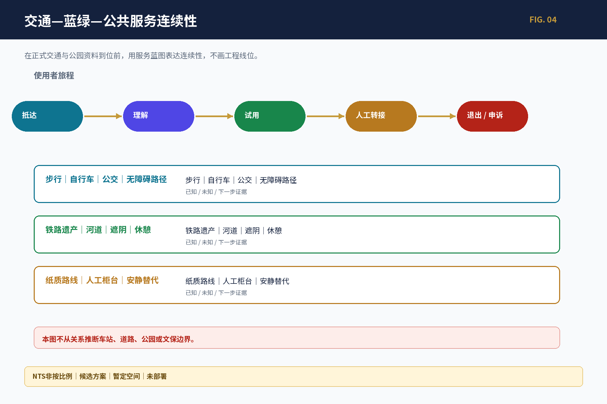

## 蓝绿空间、公共空间与城市风貌

京张铁路遗址公园是公共主轴，蓝绿系统同时服务通行、休息、文化理解、生态维护和低风险创新体验。三个 AI 地标候选不采用永久大体量先行，而采用可撤、可更正、可无障碍使用的公共组件：“开发者散步道·开源成果里程廊”（主题步行、纸质路线及版本/许可/纠错展示）、智能体贡献荣誉墙（经授权的贡献记录，不自动评奖）、京张AI时光站（以可逆时间桌解释审校过的三层文化知识）。

城市文化导览采用五条可验证原型：R1一眼看懂京张、R2三种文化深读、R3半日共创路、R4无障碍低数字路线、R5国际访客线。每个故事单元均显示来源、时间、空间粒度、权利、双语、版本和纠错入口；路线均为text-only/provisional，史实争议、肖像/字体/商标权利或日常通行冲突出现时，立即撤下争议内容并保留纸质/人工替代。[data:geometry/green_space.geojson#GREEN-001] [data:geometry/public_space.geojson#PUBLIC-001] [depth:blue_green_public_space]

## 更新项目清单、实施政策与分期计划

资源等级不是人民币报价：S为复用既有空间/人员和低技术材料，M为多专业协作、临时设备或受控实例，L为跨场地长期运营或工程投入；只有取得载体、工程量和市场报价后才形成预算。

| 项目 | 近期动作 | 资源等级/主要成本构成 | 许可与启动触发 | 退出成本 |
|---|---|---|---|---|
| JZ-01 遗址公园慢行断点缝合 | 纸质核查、无障碍走查、可撤导视小样 | S→M；走查、设计复核、可撤构件、维护 | 公园/道路/文保/无障碍专业通过 | 撤牌、恢复地面、公开更正 |
| JZ-02 众智园可信测试接口 | 开放验证桌、项目卡和退出清单 | M；受控载体、人工值守、安全/数据审查、清理 | 真实测试需求、责任主体、物理停机和保险/消防条件 | 数据/设备清理、通知、场地恢复和事件复盘 |
| JZ-03 AI原点开源与转化前台 | 每周开源桌、成果门诊、人工回执 | S；人工前台、纸质目录、权利/维护工作 | 载体开放、维护人、许可和纠错通道 | 撤内容、保留来源索引、关闭转介并回执 |
| JZ-04 大钟寺四象限步行核查 | 分时观察、问题单和回访 | S；组织、无障碍支持、记录与专业复核 | 站口/路权核验、参与安全和交通专业协议 | 删除不当记录、撤路线主张、公开未成原因 |
| JZ-05 AI公共服务与边缘算力节点 | 纸面/离线服务蓝图 | M→L；人工服务、设备、能源网络、隐私安全、持续维护 | 正式容量、数据目的、人工接管和普通服务保底 | 断开系统、清理数据设备、恢复人工普通服务 |
| JZ-06 全球AI活动周公共路线 | 小规模室内/公共空间桌面演练 | M；活动组织、双语/无障碍、安全、场地和清理 | 活动许可、容量、责任、版权与天气/应急方案 | 取消通知、退场清理、参与者回执和年度复盘 |

为了不把“待落实”当作一句空泛免责，JZ-01—06已分别建立实施交接登记：正式载体、具名运营者/负责角色、工程量与全生命周期费用口径、询价/采购依据、分群基线、专业签章、人工接管演练、清理/恢复和投诉重开九类证据槽。本轮具名值和报价仍为`null/not_requested`，因此六项均保持`blocked_pending_external_evidence`；只有每一槽均有具名责任、日期、附件和人工决定记录时才能进入G2。项目级需求见 `visual/assets/implementation_handoff_register.json`，该文件证明交接逻辑完整，不证明任何主体、场地、预算、基线、签章或承诺已获得。

分期按证据成熟度而非固定年限推进：近期G0—G1做补证、真实任务走查、人工服务、纸面/离线原型、合成数据和停止清理演练；增强G2只在正式空间、责任主体、专项审查、全生命周期资源、分群基线、人工接管和退出齐备后创建独立测试实例；G3为可选择的跨节点扩展，公共价值、维护或异常隔离失效即退回独立节点或永久退出。[depth:renewal_project_list] [depth:phasing_implementation] [data:geometry/phasing.geojson#PHASE-001]

参与主体按类型分为规划统筹、GIS/测绘、交通与无障碍、园林与文保、数据与安全、载体运营、开源维护、公共服务和公众代表；每一阶段都以可复核的空间、服务、公共价值、创新绩效、运营韧性和 AI 风险指标决定是否继续，而不是以宣传量或设备数量决定。

## 指标体系、面积复算与合规矩阵

空间指标分为三类：一是由同版 GeoJSON 可复算的工作指标；二是必须等待官方控规、道路、权属和专业资料的控制指标；三是需要实际运营后建立基线的绩效指标。当前可复算工作值包括提交几何面积、重点区数量、建筑基底、绿地和公共空间比例，但它们均带 provisional 限定，不是法定控制值。[metric:site_area_sqm] [metric:key_area_count] [metric:building_footprint_area_sqm]

绿地和公共空间由 [metric:green_ratio] [metric:public_space_ratio] 复核，最终按 [depth:metrics_recalculation] 触发重算。

指标治理采用空间体验、服务可达、公共价值、创新绩效、运营韧性和AI风险六类。15项父指标和39项子指标均保留`unknown/null`基线；空运行实例、机会/测试编号和事件不能解释为“零事件”或“达标”。比率公开分子、分母、观察窗、排除规则、缺失和分群差异，严重安全、歧视、无障碍或权利失败不被平均值抵消。实际owner、频率、目标和阈值均为`unknown/unassigned`，只保留拟议责任、复算触发和非数字替代；流量、点击、融资和曝光不替代公共价值。

## 分众成果、规划对话体与公众监督

同一事实底座派生专业团队、公众、企业/开发者、运营者和机器接口五种信息密度；每项成果共用结论类型、来源日期、时空范围、几何状态、限制、人工复核和版本“事实胶囊”。规划对话体尚未部署，只按直接、限定、未知、来源冲突、暂定空间、拒答转人工、权限不足、服务暂停八种状态回答。大钟寺路线、公园散步道和公共服务驿站不得从暂定几何或效果图生成精确落点；医疗、教育、安全、投资和规划终审转人工。反馈进入受理—分派—人工核查—决定—版本更新—公开回应—关闭/重开链，并保留纸质、大字、高对比和人工入口。

合规矩阵把官方 13 个标题、15 章、六类 Agent 任务、五项强制标准和 15 项专业深度合同分别映射到正文、来源、假设、图层、指标、图件、HTML 和自检。它证明研究响应和证据接口闭合，不自证官方分数或专业签章。

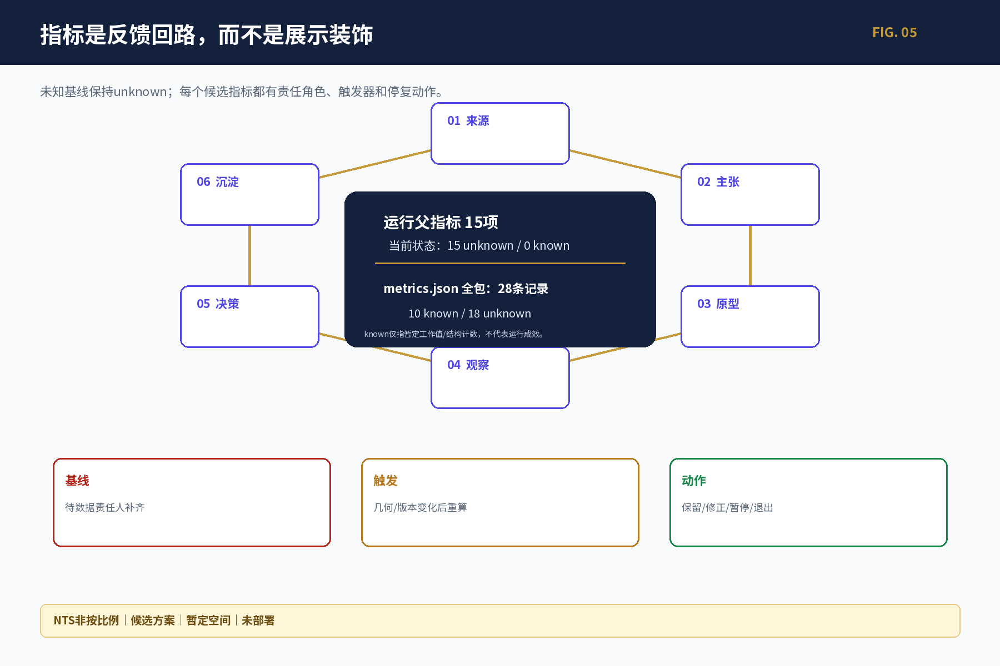

图中两套数字不是同一总体：**15项运行父指标当前全部为 unknown（15 unknown / 0 known）**；`metrics.json`全包另有28条记录，其中10条known仅是暂定几何工作值或结构计数，18条unknown包含运行、专业签署与法定控制缺口。known不等于运行成效，unknown也不按零值处理；两者都服从来源变化后的复算与停止规则。[metric:monitoring_parent_metric_count] [data:visual/assets/review_evidence_matrix.json]

## 风险、版权与合规说明

规划决策采用G-Fact/G-Value/G-Spatial/G-Pilot/G-Release；最终成果另过事实、空间、权利、识别和发布五门。前者决定事实升级、价值取舍、空间准入和试点启动，后者核对版权、商标、字体、肖像、数据撤回、中英术语、无障碍、图注、离线、manifest、哈希和人工签署。隐私保护、版权、实施风险和人工复核记录必须与每个高风险场景相邻。任一适用门未通过，成果降级为研究合同、text-only 或离线原型，不进入正式场址发布。[depth:risk_missing_data] [source:MISSING-DATA-CHECKLIST]

AI 只做检索、归纳、比较、提示缺口、生成待审草案和匿名反馈聚合；不自动审批规划、分配公共权利、替代工程安全、医疗教育投资判断、隐藏冲突或在暂停状态继续服务。所有正式图件、空间结论和高风险决定都保留人工责任、可拒绝、可申诉、可停止、可清理和可恢复机制。

本轮已对当前正式包61项PNG、底图、离线字体CSS、HTML和PDF复合成果完成一文件一记录的权利闭环；生成视觉保留工具、模型披露边界、最终生成指令、输入hash和人工检查，Noto Sans SC离线子集及四份PDF采用SIL OFL 1.1许可链，Sentinel底图保留Copernicus署名。候选名称与Logo为原创研究方向、非注册商标或官方品牌；第三方名称仅作来源署名和事实性指称，不使用其Logo或暗示背书。该闭环只覆盖`COMMUNITY-DISPLAY-ONLY`；新增资产、商业使用、商标注册、永久导视或政府发布会重新开启G-Rights/G-Brand。官方边界、现场测绘、访谈、专业签章、真实运营主体和运行基线仍是外部依赖，不能由模型补写。[source:SOURCE-USE-MATRIX] [data:visual/assets/asset_rights_register.json] [data:visual/assets/generated_visuals_manifest.json]

## 参考资料

- `brief/public-brief.md`、`brief/site-package/design_brief.json`、`brief/site-package/agent_taskbook.json`
- `data/processed/project_scope_summary.csv`、`agent_task_requirements.csv`、`source_use_matrix.csv`、`missing_data_checklist.csv`
- `brief/site-package/` 中的设计简报、任务书、枚举、范围和临时几何
- `data/source_registry.json`、`data/processed/project_scope_summary.csv`、`data/processed/agent_task_requirements.csv`、`data/processed/source_use_matrix.csv`、`data/processed/missing_data_checklist.csv`
- 公开征集公告及其登记来源；全球案例只用于机制比较，不替代京张现状。[source:SITE-PACKAGE]
- 梁鹤年《梁先生的公开信：规划的未来（上）（下）》，作为人机分工、规划价值判断与社区规划方法的规范性观点来源，不作为法定依据、京张现状事实或唯一理论框架。[source:LIANG-PLAN-FUTURE-I-20260828] [source:LIANG-PLAN-FUTURE-II-20260829]
