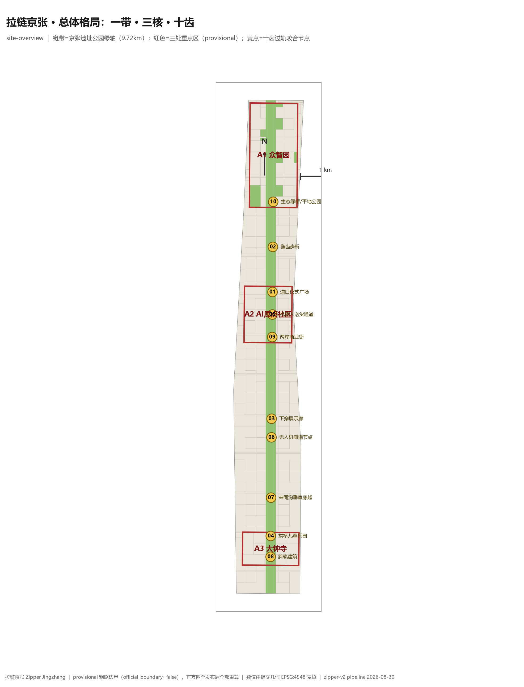
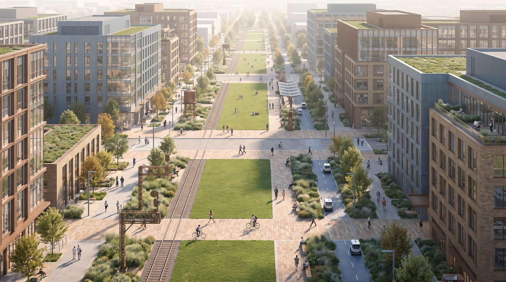
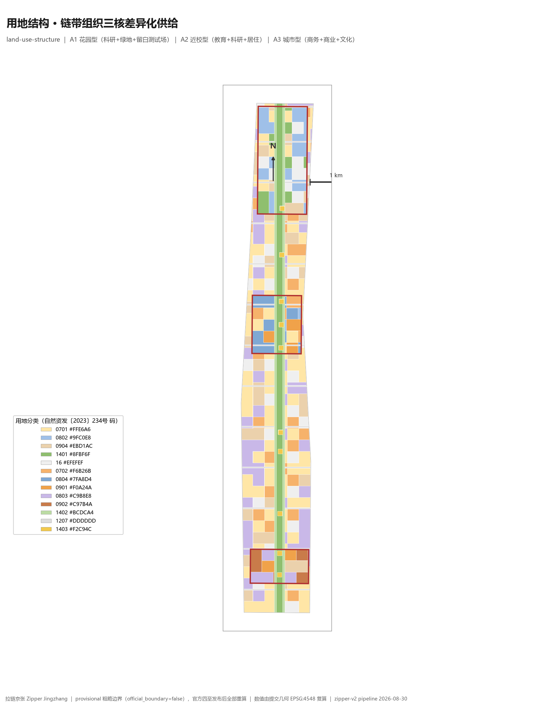
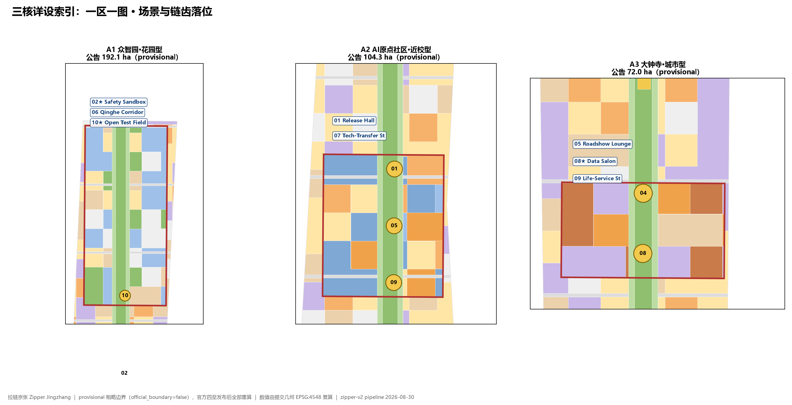
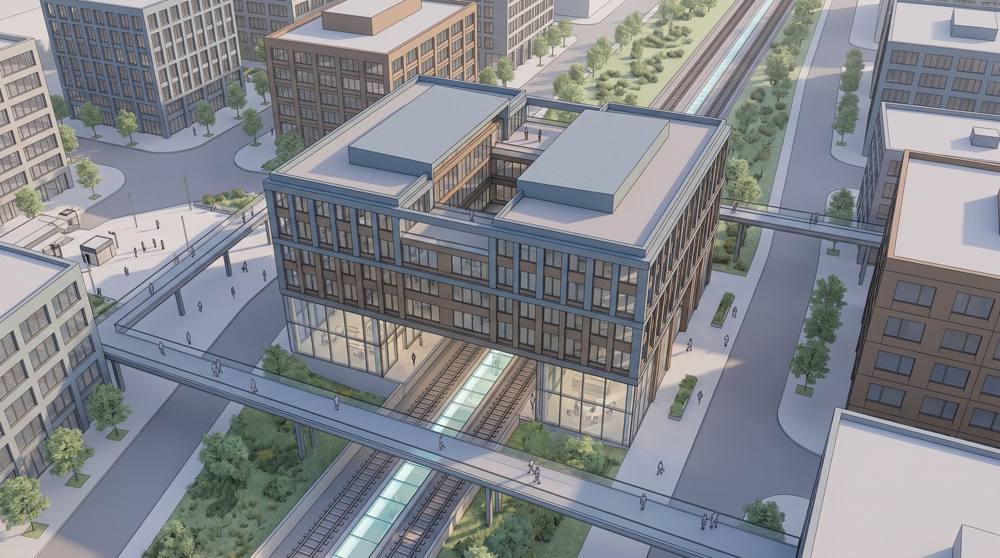
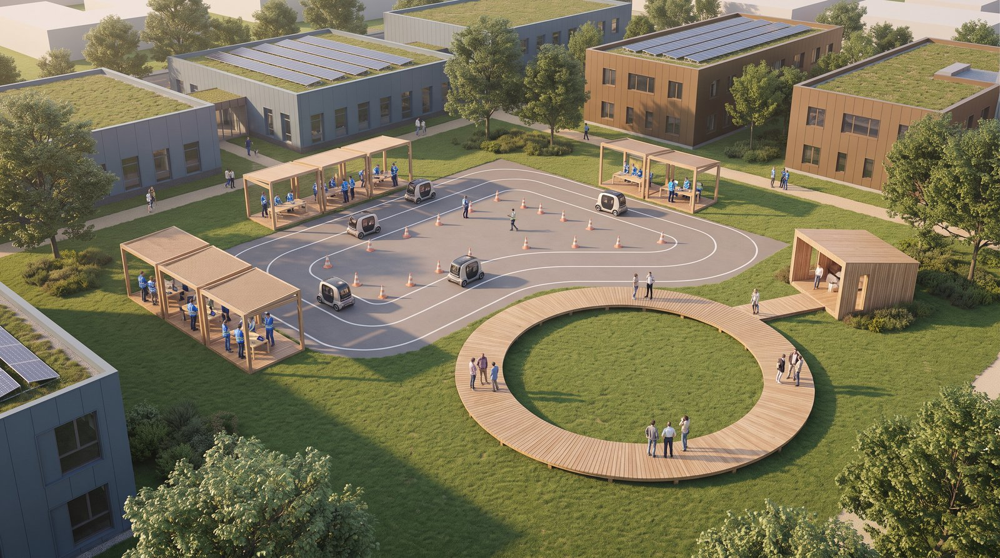
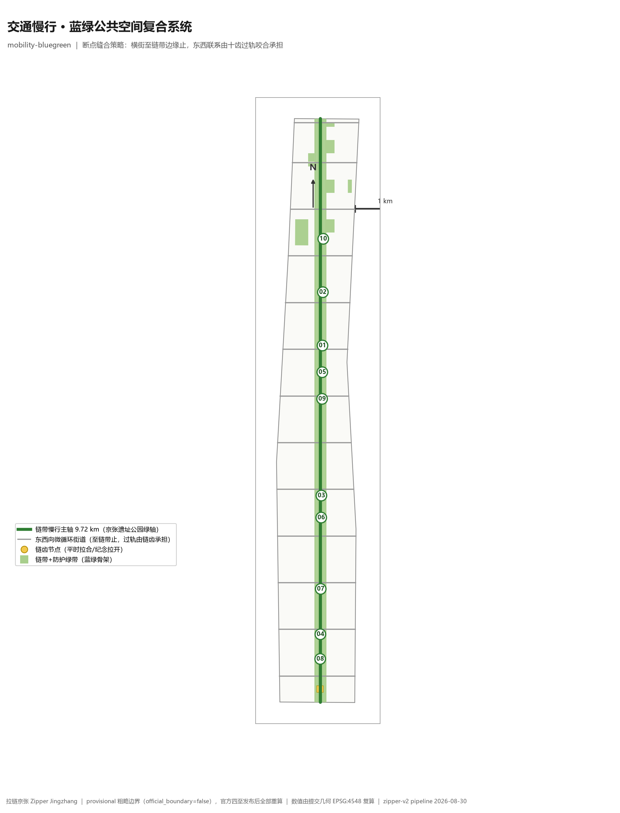
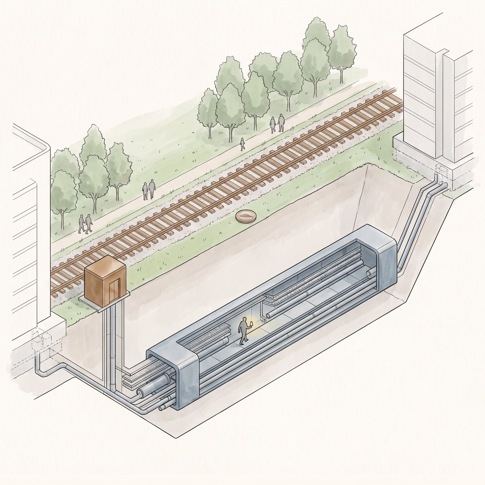
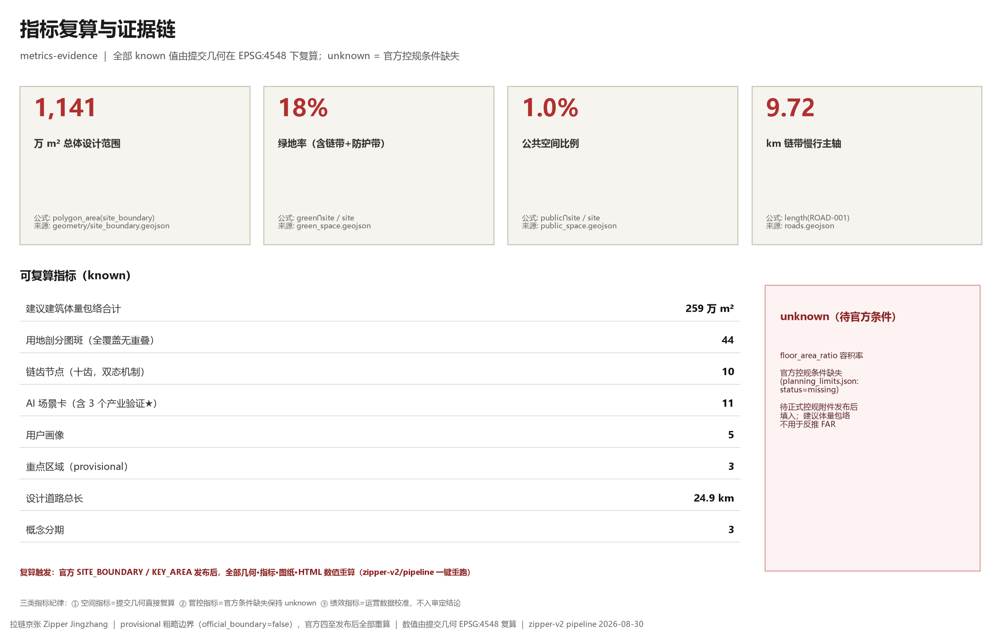

# 拉链京张 Zipper Jingzhang

## 设计依据与资料清单

本方案以《百年京张AI创新带城市设计国际方案征集资格预审公告》为第一依据，以 `brief/site-package/` 登记的临时粗略边界、重点区域、用地枚举、指标限值与来源清单为机器可读依据，全部设计判断拆分为可追溯来源、可复算指标、可校验图层与可人工复核假设 [source:OFFICIAL-ANNOUNCEMENT] [source:SITE-PACKAGE]。方案名"拉链京张"同时是总体概念、命名体系与视觉识别方向：拉链与"缝合"的本质区别是**拉链可以再拉开**——恰好承载遗产可开合展示的核心哲学；全篇措辞使用"开口/咬合/拉合" [source:AGENT-TASKBOOK]。

资料使用遵循双轨边界：官方锚点轨（site-package provisional 边界、面积、枚举）承担一致性基准，现状参照轨只作场景原型与背景，不与官方几何直接对位；`data/source_registry.json` 中 background_only 与 provisional_only 资料一律不升级为官方边界、法定控规或正式评分依据 [source:SOURCE-REGISTRY]。设计推导的完整理念文本随包存档于 `report/design-basis-zipper-jingzhang.md` [source:DESIGN-CONCEPT-NOTE]。

| 平时（拉合） | 纪念（拉开） |
| --- |
|  |  |

本包在官方 `SITE_BOUNDARY` 与三处 `KEY_AREA` 正式多边形发布前，使用 `provisional_boundaries.geojson` 生成：`geometry/site_boundary.geojson`（SITE-001）与 `geometry/key_areas.geojson`（KEY-A1/A2/A3）均标注 `official_boundary=false`、`geometry_role=provisional_constraint`、`boundary_precision=provisional_rough`，只能用于方案生成、自检、可视化与设计讨论，不作为官方红线、审批依据、精确面积依据或法定控制结论；该数据缺口不阻断内容评分，官方数据发布后全部几何、指标、图纸与 HTML 数值须重算 [data:geometry/site_boundary.geojson#SITE-001] [source:SITE-PACKAGE]。

生成式图像的合规证据链：十三张十齿场景示意图由 Lovart AI 免费模型（nano-banana-pro）生成，提示词逐张留档于 `assets/media/prompts/`，生成图像自带的 XMP/IPTC 机器可读 AI 生成标记（trainedAlgorithmicMedia）在压缩转码时原样透传保留，来源与授权在 `sources.json` 与 `report/copyright_statement.md` 主动声明；示意图仅作设计意象表达，与几何证据层明确分离 [source:AI-GENERATED-VISUALS]。

## 三层范围工作框架

方案按公告确定的三层范围组织：统筹研究范围 43.6 km² 关注 AI 产业生态与未来城市形态；总体设计范围 11.4 km² 要求达到控制性详细规划深度的城市更新总体框架；重点区域范围 368.4 公顷（A1 众智园 192.1 / A2 北京AI原点社区 104.3 / A3 大钟寺 72.0）开展详细设计。三层任务在 `compliance_matrix.json` 中逐条对应公告 1.3、1.4、1.5 与 agent.1–agent.6 [depth:three_level_scope_framework] [standard:PROJECT-OFFICIAL-ANNOUNCEMENT]。

### 问题：现状三道开口

对公告文本与两轨资料的整理得出三道"开口"。**开口一·走廊割裂**：京张铁路及高架长期分割城市东西，跨轨绕行远、慢行断点多，两侧社区与园区功能难以共享。**开口二·供给错配**：走廊三段现状肌理各异——清河生态带、学院路高校带、大钟寺总部带，同质化的"创新空间"定位无法回应各自真实短板。**开口三·遗产隔离**：轨床封闭围挡使"被保护"沦为"被隔离"，历史不可靠近，文保约束反而加深割裂 [source:OFFICIAL-ANNOUNCEMENT] [depth:existing_conditions_diagnosis]。

### 思路：不拆不掩盖，为开口装一条拉链

**拉链京张**不掩盖这道开口，而是为它装上一条可以反复开合的拉链，机制由三个部件构成：

1. **链带**——京张遗址公园绿轴（提交几何中为南北纵贯 9.72 km 的带状公园绿地），作为线性骨架缝合步行、骑行、车行、无人系统、市政、生态六类联系 [data:geometry/land_use.geojson#LU-AXIS] [data:geometry/roads.geojson#ROAD-001]；
2. **链齿**——十个过轨咬合节点（Z-01～Z-10），按轨旁标高条件选型，"地形决定齿型，齿型决定仪式方式"，每个齿有平时（拉合）与纪念（拉开）双态 [data:geometry/public_space.geojson#Z-01]；
3. **拉链头**——智能运营系统，统一调度全线开与合：平时拉合服务城市日常，纪念拉开展现轨床与集体记忆；AI 内生于开合机制本身，而非贴在方案上的标签。

三道开口对应三组咬合策略：走廊割裂→绿轴缝合；供给错配→一链三核差异化驱动；遗产隔离→可开合展示机制。总体概念与功能统筹（agent.1）、文化叙事（agent.5）均由该机制统摄 [source:AGENT-TASKBOOK]。

| 层级 | 设计问题 | 拉链京张的回答 | 数据落点 |
| --- | --- | --- | --- |
| 统筹研究范围 | AI 产业生态与未来城市形态如何组织 | "高校策源—开源协作—企业转化—公共体验—国际传播"创新链沿链带布点 | compliance_matrix.json |
| 总体设计范围 | 更新框架、交通市政与风貌如何落图 | 链带+十齿+三核用地剖分与建议体量包络，指标全部可复算 | [data:geometry/land_use.geojson#LU-001] |
| 重点区域范围 | 三处片区如何达到详细设计深度 | 一区一图：花园型/近校型/城市型差异定位与场景落位 | [data:geometry/key_areas.geojson#zhongzhiyuan_ai_acceleration_area] |

## 统筹研究范围产业与未来城市研究

统筹研究范围的核心任务是构建世界级 AI 创新生态。方案将海淀高校院所策源、开源社区协作、头部企业转化、公共空间体验与国际传播五环节沿链带组织：A1 承接全栈自主创新与标准治理，A2 承接近校成果转化与开源发布，A3 承接智能原生业态与国际路演，链齿承担三核之间的日常互达，使创新链的每一跳都有可步行的空间路径 [source:AGENT-TASKBOOK] [depth:overall_spatial_structure]。

命名体系与视觉识别方向（agent.1）：中文名"拉链京张"，英文名 Zipper Jingzhang；Logo 方向为**开合二态拉链标**——常态状态下链齿咬合为直线，纪念状态下拉开露出"轨床"负形，一个符号同时表达连接与可开合展示；导视、活动主视觉与公共艺术共用该二态语法。命名回应"百年京张文化带、都市AI生活体验带、AI融合创新带"三重定位 [source:AGENT-TASKBOOK]。

未来城市形态研究回答 AI 如何改变工作、生活、交通与公共服务：无人配送（Z-05）、无人机物流（Z-06）、共同沟智能巡检（Z-07）作为"技术上真实的可开合"案例嵌入机制；端侧算力驿站、分布式能源与新型基础设施以概念建议表述，运营与绩效指标须待真实数据校准，不写入审定结论 [depth:overall_spatial_structure]。

## 总体设计范围城市更新与控规深度城市设计

总体设计范围要求控规深度。`geometry/land_use.geojson` 以链带（1401 公园绿地）、护带（1402 防护绿地）、横街（1207）与链齿广场（1403）为骨架，将提交边界完整剖分为 44 个图斑：全覆盖无缝隙（管线自检 gap<1 m²）、无重叠（>1 m² 重叠对为 0），相邻图斑共享边界坐标 [data:geometry/land_use.geojson#LU-001] [metric:land_use_parcel_count] [depth:land_use_layout]。

用地结构回应"供给错配"：三核执行差异化配比——A1 花园型（科研 38%＋公园绿地 22%＋留白开放测试场 22%）、A2 近校型（教育 28%＋科研 26%＋居住 22%＋商业 16%）、A3 城市型（商务金融 44%＋商业 28%＋文化 14%），核间连接带以居住与留白为主，全部使用 `enums/land_use_codes.json` 登记编码 [data:geometry/land_use.geojson#LU-001] [source:SITE-PACKAGE]。

`geometry/buildings.geojson` 提供 2483 个**建议建筑体量包络**（按用地编码给高度建议：商务 60m 级、科研 45m 级、商业文化 20–24m 级），全部标注 `design_action=新增（建议体量包络）`——现状建筑、权属与控规条件缺失，方案不编造拆改留结论，仅提供体量方法与待校准清单 [data:geometry/buildings.geojson#BLDG-001] [depth:retain_renovate_demolish]。建筑基底合计约 258.8 万 m²，容积率、建筑高度、建筑密度、退线保持 `status=unknown`，待官方控规条件发布后填入 [metric:building_footprint_area_sqm] [metric:floor_area_ratio] [depth:development_intensity_controls]。

交通组织：链带慢行主轴（9.72 km）＋13 条东西向微循环街道（24.9 km）；横街至链带边缘即止，**过轨连接不由平交路口承担，而由十齿承担**——这是"拉链"与普通绿带方案的实质差别 [data:geometry/roads.geojson#ROAD-001] [metric:road_total_length_m] [depth:traffic_rail_slow_parking]。

**拉链头·智能运营系统**是 AI 原生的运营层：调度链齿开合时刻表、无人配送与无人机廊道秩序、活动期人流与安全边界、开放测试场的准入与回放。治理遵循数据最小化、公开来源、可解释、人工复核四原则；系统不替代规划审批，不输出未授权个人画像 [source:AGENT-TASKBOOK]。

## 重点区域详细设计

三处重点区域"一区一图"，详细设计达到规划综合实施方案深度；每核标注定位、空间动作、链齿与场景落位 [depth:three_key_area_detailed_design]。

| A1 花园型·清河界面 | A2 近校转化街 |
| --- |
|  |  |
| A3 跨轨建筑与站城四象限 | A1 开放测试场·场景10★ |
| --- |
|  |  |

| 重点片区 | 定位 | 空间动作 | 链齿/场景落位 | 证据 |
| --- | --- | --- | --- | --- |
| A1 众智园（花园型） | 全栈自主创新与开放测试 | 强化清河界面绿色空间；以留白用地承载可参观的开放测试场与标准治理展示 | Z-02 链齿步桥、Z-10 生态绿桥；场景 02★/06/10★ | [data:geometry/key_areas.geojson#zhongzhiyuan_ai_acceleration_area] |
| A2 北京AI原点社区（近校型） | 近校成果转化与人才社区 | 校区—园区—街区慢行缝合；成果发布、转化服务与生活配套落在道口两侧 | Z-01 道口仪式广场、Z-05 机器人通道、Z-09 两岸商业街；场景 01/07 | [data:geometry/key_areas.geojson#beijing_ai_origin_community] |
| A3 大钟寺（城市型） | 智能原生新业态与国际交往 | 站城一体、四象限步行连通；商业活力以遗产为对景 | Z-04 拱桥儿童乐园、Z-08 跨轨建筑；场景 05/08★/09 | [data:geometry/key_areas.geojson#dazhongsi_ai_industry_cluster] |

## AI 创新生态、人才画像与 AI+ 场景

面向 AI 人才与企业的空间画像覆盖研发办公、开源协作、成果发布、企业服务、人才居住、社交学习、消费生活与国际交往。五类用户画像逐卡对应空间响应与自检边界 [source:AGENT-TASKBOOK]：

| 用户画像 | 典型需求 | 空间响应 | 自检边界 |
| --- | --- | --- | --- |
| 开源开发者 | 发布、协作、测试、社区声誉 | Z-01 开源发布厅、公共代码墙、夜间协作空间 | 不采集个人行为轨迹；活动数据仅聚合统计 |
| 初创团队 | 低成本办公、算力入口、产品试验场 | A1 共享测试场、端侧算力驿站、标准治理咨询 | 算力与数据服务需另行授权 |
| 头部企业访客 | 展示、商务、国际接待 | A3 国际路演客厅、轨道站点接驳、重点企业周边公共空间 | 企业标识与案例须清权 |
| 周边居民 | 通勤、休闲、社区服务、低扰动更新 | 链带慢行环、社区服务嵌入、夜间照明分级 | 不将居民画像用于商业推荐 |
| 高校师生 | 成果转化、跨校协作、日常慢行 | 近校转化街、成果转化驿站、AI 教育体验点 | 校园数据与科研成果需授权 |

11 张 AI 场景卡（★=产业测试验证场景，满足任务书 ≥10 卡、≥3 产业验证、≥5 画像）：每张卡落到空间载体、说明服务对象、数据来源、隐私边界、人工复核机制与运营主体六要素 [source:AGENT-TASKBOOK]：

| 卡 | 场景 | 空间载体 | 关联链齿 | 说明 |
| --- | --- | --- | --- | --- |
| 01 | 开源发布厅 | A2 | Z-01/Z-05 | 高校、开源社区与初创团队的成果发布、代码贡献展示与小型路演 |
| 02★ | 安全治理沙盒 | A1 | Z-02/Z-10 | 标准制定、安全评测、模型红队测试转译为可参观、可预约、可监管节点 |
| 03 | 端侧算力驿站 | 总体范围节点 | — | 与公共服务、企业服务和低碳能源结合的新型基础设施原型（概念建议） |
| 04 | AI 慢行导航 | 链带全线 | 全线 | 可解释导视与低侵入传感识别慢行断点、拥挤节点与无障碍需求 |
| 05 | 大钟寺国际路演客厅 | A3 | Z-04/Z-08 | 智能体、智能终端与内容消费企业的展示、洽谈、媒体发布与国际交流 |
| 06 | 清河低碳创新廊 | A1 临清河界面 | Z-10 | 绿色空间、雨洪、慢行与 AI 展示结合的园区公共客厅 |
| 07 | 近校成果转化街 | A2 | Z-01/Z-05 | 孵化、展示、法务、知识产权与投融资服务落在道口两侧 |
| 08★ | 数据要素会客厅 | A3 | Z-04/Z-08 | 以合规、授权、可审计为前提的数据要素与数字资产流通服务界面 |
| 09 | AI 生活服务样板街 | 社区与商业交汇处 | Z-09 | 医疗、教育、法律与生活服务落到可运营的小尺度街区 |
| 10★ | 自主模型开放测试场 | A1 绿色空间 | Z-02/Z-10 | 模型测试、标准验证、安全评估的开放场地（留白用地承载） |
| 11（附加） | 全球 AI 活动周路线 | 一带公共空间系统 | 全线 | 遗址文化→开源社区→产业展示→国际路演的可步行体验路线 |

场景的治理边界：城市智能体可辅助识别慢行断点、公共空间热力、设施维护与活动安全风险，但不替代规划审批、不输出未授权个人画像、不声称官方实施承诺；全部场景节点可由公共空间与道路图层定位复核 [data:geometry/public_space.geojson#PUBLIC-001] [data:geometry/roads.geojson#ROAD-001]。

## 用地、建筑规模与拆改留方案

用地方案依据自然资发〔2023〕234号分类表达（05 湿地未使用），形成完整、闭合、无缝的分区；建筑方案区分高度与功能的建议层级。**拆改留结论明确列为待校准事项**：缺少现状建筑测绘、权属与控规条件，方案只提供"建议体量包络+更新方法框架"，不输出拆改留清单；正式深化须以官方现状建筑与权属数据为前提 [standard:MNR-LAND-USE-CLASSIFICATION-GUIDE] [depth:retain_renovate_demolish] [depth:height_massing_character]。

指标三类纪律：①空间指标由提交几何直接复算（本包 13 项 known）；②管控指标（FAR/高度/密度/退线）官方条件缺失保持 unknown；③绩效指标（创新指数、人才密度、活动参与度）属运营数据，持续校准、不写入审定结论 [metric:site_area_sqm] [metric:floor_area_ratio]。

## 交通、轨道、市政与公共服务设施

交通策略围绕"把过轨还给链齿"：链带主轴承担南北慢行与骑行，13 条横街承担东西向机动车微循环，十齿承担全部过轨咬合——步行/骑行（Z-01、Z-02）、车行（Z-04、Z-08）、无人系统（Z-05、Z-06）、市政（Z-07）分齿消化，避免平交路口与轨道的冲突 [data:geometry/public_space.geojson#Z-07] [depth:traffic_rail_slow_parking]。

市政策略以 Z-07 共同沟为原型：垂直短穿越轨床，两侧市政互备，扰动最小；开放日以玻璃天窗展示轨床剖面。新型基础设施（端侧算力、分布式能源、低空廊道）以概念建议表述，服务半径、设施标准与运营主体列为正式深化前置条件；轨道站点一体化（大钟寺站、五道口节点）须以官方轨道与道路红线数据为准，当前仅作概念示意 [depth:municipal_new_infrastructure] [data:geometry/constraints.geojson#CONSTRAINTS-RAIL]。

## 蓝绿空间、公共空间与城市风貌

蓝绿系统以链带为骨架：绿地率 18%（链带公园绿地＋两侧防护绿带＋A1 花园型公园），公共空间比例 1%（拉链头运营广场＋十齿广场），两值均由提交几何在 EPSG:4548 下独立可复算 [metric:green_ratio] [metric:public_space_ratio]。链带与十齿的公共空间组织由绿地图层与设计深度项共同校核 [depth:blue_green_public_space] [data:geometry/green_space.geojson#GREEN-001]。

城市风貌执行"双态语法"：**平时（拉合）**——链带是日常公园，盖板齐平、机器人穿行、桥上观演；**纪念（拉开）**——盖板翻转露轨床、壁龛亮起露路基剖面、百机光阵拼出蒸汽光影列车。文保段执行"退让、收窄、绕行、借景"四原则；风貌控制区分官方管控、设计建议与待确认条件，不在无文保依据时给出伪精确控制线 [depth:height_massing_character] [source:AGENT-TASKBOOK]。

AI 朝圣地标（≥3，agent.4）：**全息火车道口**（Z-01 纪念态，全息列车载着城市为记忆停顿）、**百机光阵·蒸汽列车**（Z-06 夜间无人机光阵）、**玻璃天窗见轨**（Z-07 开放日）；配套贡献墙与荣誉展示体系记录开源社区与智能体贡献。文化叙事（agent.5）：百年京张的"速度记忆"×中关村的"创新记忆"×AI 的"开合机制"统一于拉链语法——纪念不是封存，是可反复拉开的公共仪式 [source:AGENT-TASKBOOK]。

十齿方法一览（适用场景与双态机制，逐齿理念陈述随包存档 `report/design-basis-zipper-jingzhang.md`）：

| 齿 | 方法 | 类别 | 平时（拉合） | 纪念（拉开） |
| --- | --- | --- | --- | --- |
| Z-01 | 道口仪式广场 | 交通 | 轨顶齐平盖板自由过轨 | 下沉观演、盖板翻开、全息火车 |
| Z-02 | 链齿步桥 | 交通 | 格栅桥过堑、脚下轨枕可读 | 桥面观演、堑内机车遗产展 |
| Z-03 | 下穿展示廊 | 交通 | 通勤下穿、壁龛暗 | 壁龛亮起露路基剖面 |
| Z-04 | 拱桥儿童乐园 | 产业/公共 | 攀爬乐园日常使用 | 封路展廊＋投影历史列车 |
| Z-05 | 机器人送货通道 | 交通（无人） | 配送机器人穿涵洞 | 机器人沿轨列队"仪仗" |
| Z-06 | 无人机廊道 | 交通（空域） | 白天配送编队不显眼 | 百机光阵拼蒸汽光影列车 |
| Z-07 | 共同沟垂直穿越 | 市政 | 管廊运行（隐形缝合） | 开放日参观＋玻璃天窗见轨 |
| Z-08 | 跨轨建筑 | 产业 | 楼内通廊无感过轨 | 屋盖滑开、玻璃地条发光 |
| Z-09 | 两岸商业街 | 产业/商业 | 轨道当河、两岸成街 | 商业夜景以遗产为对景 |
| Z-10 | 生态绿桥/平地公园 | 生态 | 兔鸟过桥、绿地连续 | 自然回归即是最深的纪念 |

## 更新项目清单、实施政策与分期计划

更新项目清单（概念建议，须以权属、资金、实施主体与审批路径为深化前提）[depth:renewal_project_list]：

| 项目编号 | 项目名称 | 类型 | 主要依赖 | 证据引用 |
| --- | --- | --- | --- | --- |
| JZ-01 | 链带慢行主轴与断点缝合（Z-01/Z-02 先行） | 公共空间/交通 | 轨道部门协调、慢行流量复核 | [data:geometry/roads.geojson#ROAD-001] |
| JZ-02 | A1 清河低碳创新界面（场景 06/10★） | 蓝绿空间/产业 | 河道蓝线、生态与防洪条件 | [data:geometry/green_space.geojson#GREEN-001] |
| JZ-03 | A2 近校成果转化街（场景 01/07） | 城市更新/产业服务 | 校区边界、权属、首层业态 | [data:geometry/buildings.geojson#BLDG-001] |
| JZ-04 | A3 站城四象限步行连通（Z-04/Z-08） | 轨道一体化/慢行 | 轨道站点、道路交叉口、市政管线 | [data:geometry/public_space.geojson#Z-08] |
| JZ-05 | 拉链头智能运营系统与端侧算力节点 | 新基建/公共服务 | 能源、算力、安全与运营主体 | [data:geometry/constraints.geojson#CONSTRAINTS-RAIL] |
| JZ-06 | 全球 AI 活动周公共路线（场景 11） | 运营/品牌 | 公共空间许可、活动安全、版权清权 | [data:geometry/phasing.geojson#PHASE-001] |

分期计划（概念建议三期）[depth:phasing_implementation] [data:geometry/phasing.geojson#PHASE-001] [metric:phase_count]：**一期·近校启动段**（A2＋Z-01/Z-05/Z-09）以轻量设施、开源活动与运营平台先行；**二期·站城段**（A3＋Z-04/Z-08＋连接带南）结合站城更新推进；**三期·花园段**（A1＋Z-02/Z-10＋连接带北）承接开放测试场与生态缝合。征集周期的成果提交与实施分期是两件事：凡涉及工程实施的内容，必须等待正式控规、市政、交通与权属条件确认。

## 指标体系、面积复算与合规矩阵

全部 known 指标由提交几何复算，公式、来源文件与置信度保存于 `metrics.json`；三核心视觉指标（site_area_sqm / green_ratio / public_space_ratio）为 known、有限、可复算，并与 `visual/index.html` 的 `data-value` 一致 [depth:metrics_recalculation]：

| 指标 | 值 | 复算口径 |
| --- | --- | --- |
| site_area_sqm | 11,412,825 m² | polygon_area(SITE-001)，EPSG:4548；与公告值 1140 万 m² 差约 0.1%（provisional 粗化误差） |
| green_ratio | 18% | 绿地∩site / site |
| public_space_ratio | 1% | 公共空间∩site / site |
| green_axis_length_m | 9,716.12 m | length(ROAD-001) |
| tooth_count | 10 | count(public_space.tooth_id) |
| building_footprint_area_sqm | 2,588,396 m² | Σ建筑包络面积 |
| land_use_parcel_count | 44 | count(land_use)（gap<1m²，重叠对=0） |
| road_total_length_m | 24,928.1 m | Σ道路中心线长度 |
| key_area_count | 3 | count(KEY_AREA) |
| scenario_card_count | 11（含 3★） | 正文场景卡计数 |
| user_persona_count | 5 | 正文画像计数 |
| phase_count | 3 | count(PHASE) |
| floor_area_ratio | unknown | 官方控规条件缺失 |

合规矩阵将公告 1.3、1.4、1.5 全部 23 条必选要求（含 agent.1–agent.6）映射到章节、图层、指标、图纸与 HTML 证据；专业标准响应见 `standard_matrix.json`，设计深度 15 项全部 complete 见 `design_depth_matrix.json` [standard:PROJECT-OFFICIAL-ANNOUNCEMENT] [standard:PROJECT-AGENT-OPEN-CALL-TASKBOOK]。

## 风险、版权与合规说明

**边界风险**：provisional 粗略边界仅用于概念生成与自检；链带线位与十齿落位是设计假定，官方轨线与文保控制线发布后必须重算并重置齿位。**管控风险**：FAR、高度、密度、退线、道路红线全部缺失，本包保持 unknown 并列入 `assumptions.json`。**实施风险**：无权属、资金、实施主体与审批路径，全部项目与分期仅为概念建议，不构成可落地承诺或政府行为 [depth:risk_missing_data] [data:geometry/constraints.geojson#CONSTRAINTS-CTRL]。

**版权与生成方法披露**：十齿场景示意图为 AI 生成（Lovart AI，免费模型 nano-banana-pro），提示词逐张留档 `assets/media/prompts/`，机器可读 AI 生成标记（trainedAlgorithmicMedia）透传保留；五张必备图与本包全部 JSON/HTML 由 zipper-v2 管线从提交几何确定性生成；设计理念文本随包存档 `report/design-basis-zipper-jingzhang.md`。全部资产来源与授权状态见 `sources.json` 与 `report/copyright_statement.md`；成果知识产权按公告 8.1 共同享有，许可 COMMUNITY-DISPLAY-ONLY [source:AI-GENERATED-VISUALS] [source:DESIGN-CONCEPT-NOTE]。

本方案不声称官方批准、审定控规、最终土地权属、最终建设规模或保证实施；全部空间设想为开放共创建议，供专业团队深化，最终判断由人类与专业团队完成。

## 参考资料

- brief/public-brief.md；brief/site-package/design_brief.json；brief/site-package/agent_taskbook.json；brief/site-package/allowed_design_space.json；brief/site-package/enums/；brief/site-package/ranges/planning_limits.json
- data/source_registry.json；data/processed/agent_fact_pack.md
- 完整机器索引：`sources.json`、`metrics.json`、`compliance_matrix.json`、`standard_matrix.json`、`design_depth_matrix.json`
- 设计理念全文：`report/design-basis-zipper-jingzhang.md`；十齿提示词：`assets/media/prompts/` [source:SITE-PACKAGE]
